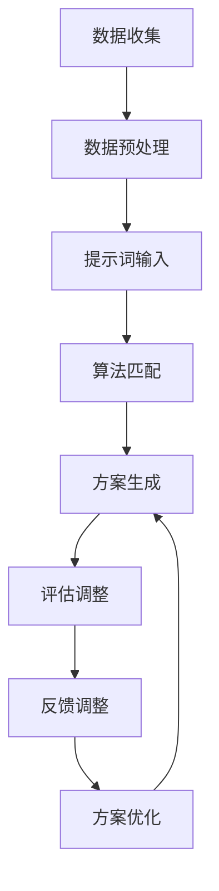

                 

# AI辅助创意设计中的提示词技巧

> **关键词**: AI辅助设计，创意生成，提示词，智能算法，用户体验

> **摘要**: 本文将深入探讨AI技术在创意设计领域的应用，特别是如何利用提示词技巧提升设计效率与质量。文章将详细介绍AI辅助设计的原理、算法原理、数学模型，并通过实际项目案例展示其在设计中的应用，同时推荐相关资源和工具。

## 1. 背景介绍

在当今数字化时代，创意设计已经成为产品竞争的关键因素。无论是广告、游戏、影视、还是软件界面设计，创意都能够直接影响用户体验和产品市场表现。然而，创意设计往往需要大量的时间、精力和想象力，而且容易陷入创作瓶颈。传统的设计方法虽然已经非常成熟，但在面对复杂多变的设计需求时，仍然存在诸多局限。

近年来，随着人工智能技术的快速发展，AI开始被广泛应用于创意设计领域。AI辅助设计不仅能够提高设计的效率和准确性，还能通过智能算法为设计师提供灵感，打破传统设计的局限。提示词技巧是AI辅助设计中的一种重要方法，它通过输入特定的关键词或短语，引导AI系统生成与这些关键词相关的创意设计方案。

本文旨在探讨如何利用AI辅助设计中的提示词技巧，提高创意设计的效率和质量。我们将从核心概念、算法原理、数学模型、实际应用等多个方面进行分析，帮助读者全面了解AI辅助设计的应用场景和实现方法。

## 2. 核心概念与联系

### 2.1 AI辅助设计的核心概念

AI辅助设计的核心概念包括数据驱动设计、算法驱动设计、人机协同设计等。数据驱动设计是指通过收集和分析用户数据，为设计师提供设计依据。算法驱动设计则是利用智能算法生成设计方案，减少人工干预。人机协同设计则强调设计师与AI系统的合作，充分发挥各自的优势。

### 2.2 提示词技巧的定义与作用

提示词技巧是指通过输入特定的关键词或短语，引导AI系统生成与这些关键词相关的创意设计方案。提示词可以激发AI系统的联想和创意，从而生成更加丰富和多样化的设计方案。提示词技巧在AI辅助设计中起着关键作用，它不仅能够提高设计的效率，还能提升设计的创意和质量。

### 2.3 提示词技巧与AI系统的联系

提示词技巧与AI系统的联系主要体现在以下几个方面：

- **数据预处理**: 提示词作为输入数据的一部分，需要经过预处理，如分词、词频统计等，以便AI系统能够更好地理解和利用这些数据。

- **算法匹配**: AI系统通过提示词进行匹配，利用机器学习、深度学习等算法生成与提示词相关的设计方案。

- **反馈调整**: 设计师可以根据生成的方案进行评估和调整，从而反馈给AI系统，进一步优化设计方案。

### 2.4 Mermaid 流程图

下面是一个简化的Mermaid流程图，展示了提示词技巧在AI辅助设计中的应用流程：



## 3. 核心算法原理 & 具体操作步骤

### 3.1 算法原理

AI辅助设计中的核心算法主要包括生成对抗网络（GAN）、变分自编码器（VAE）、深度强化学习（DRL）等。这些算法通过不同的方式生成创意设计方案，其中生成对抗网络（GAN）是应用最广泛的一种。

GAN由生成器（Generator）和判别器（Discriminator）两个部分组成。生成器通过学习数据分布生成伪数据，判别器则通过区分真实数据和伪数据来训练。生成器和判别器相互对抗，不断迭代训练，最终生成高质量的设计方案。

### 3.2 具体操作步骤

以下是利用GAN进行AI辅助设计的具体操作步骤：

1. **数据收集与预处理**：收集与设计主题相关的图像数据，并进行数据清洗、归一化等预处理。

2. **生成器设计**：设计生成器的网络结构，如使用卷积神经网络（CNN）进行图像生成。

3. **判别器设计**：设计判别器的网络结构，如使用CNN进行图像分类。

4. **损失函数设计**：设计损失函数，如交叉熵损失函数，用于训练生成器和判别器。

5. **模型训练**：通过迭代训练生成器和判别器，优化模型参数。

6. **方案生成**：利用训练好的生成器生成设计方案。

7. **评估与调整**：对生成的设计方案进行评估和调整，反馈给生成器进行进一步优化。

## 4. 数学模型和公式 & 详细讲解 & 举例说明

### 4.1 GAN的基本数学模型

生成对抗网络（GAN）的核心数学模型包括生成器（G）和判别器（D）两个部分。

- **生成器（G）**：生成器是一个随机函数，它从噪声分布中采样生成伪数据。

  $$ G(z) = x' $$

  其中，$z$是从噪声分布中采样的随机向量，$x'$是生成的伪数据。

- **判别器（D）**：判别器是一个二分类器，它通过区分真实数据和伪数据来判断生成器的质量。

  $$ D(x) = P(D(x) = 1 | x \text{ is real}) $$

  $$ D(x') = P(D(x') = 1 | x' \text{ is fake}) $$

- **损失函数**：GAN的损失函数通常采用二元交叉熵损失函数。

  $$ L_D = -[D(x) \log D(x) + D(x') \log (1 - D(x'))] $$

  $$ L_G = -D(x') \log (1 - D(x')) $$

### 4.2 举例说明

假设我们使用GAN生成手写数字图像，我们可以按照以下步骤进行：

1. **数据收集与预处理**：收集MNIST数据集，并对图像进行归一化处理。

2. **生成器设计**：设计一个卷积神经网络，输入噪声向量$z$，输出手写数字图像。

3. **判别器设计**：设计一个卷积神经网络，输入手写数字图像，输出概率值，判断图像是真实数据还是生成数据。

4. **损失函数设计**：使用二元交叉熵损失函数进行训练。

5. **模型训练**：迭代训练生成器和判别器，优化模型参数。

6. **方案生成**：利用训练好的生成器生成手写数字图像。

7. **评估与调整**：对生成图像进行评估和调整，反馈给生成器进行进一步优化。

### 4.3 数学公式与详细讲解

以下是GAN模型中的几个关键数学公式和详细讲解：

$$
G(z) = \sigma(W_Gz + b_G) \odot \text{ReLU}(W_Gz + b_G)
$$

- **生成器输出**：$G(z)$是生成器的输出，它通过卷积神经网络生成手写数字图像。

$$
D(x) = \sigma(W_Dx + b_D) \odot \text{ReLU}(W_Dx + b_D)
$$

- **判别器输出**：$D(x)$是判别器的输出，它通过卷积神经网络对输入图像进行分类。

$$
L_D = -[D(x) \log D(x) + D(x') \log (1 - D(x'))]
$$

- **判别器损失函数**：$L_D$是判别器的损失函数，它衡量判别器对真实数据和生成数据的分类准确性。

$$
L_G = -D(x') \log (1 - D(x'))
$$

- **生成器损失函数**：$L_G$是生成器的损失函数，它衡量生成器生成数据的真实性。

## 5. 项目实战：代码实际案例和详细解释说明

### 5.1 开发环境搭建

为了演示如何使用GAN进行AI辅助设计，我们将在Python环境中搭建一个简单的GAN模型。以下是搭建开发环境的步骤：

1. 安装Python 3.7及以上版本。

2. 安装TensorFlow库，使用以下命令：

   ```bash
   pip install tensorflow
   ```

3. 安装MNIST数据集，使用以下命令：

   ```python
   import tensorflow as tf
   mnist = tf.keras.datasets.mnist
   (x_train, _), (x_test, _) = mnist.load_data()
   ```

### 5.2 源代码详细实现和代码解读

以下是使用GAN生成手写数字图像的Python代码：

```python
import tensorflow as tf
from tensorflow.keras.layers import Dense, Flatten, Conv2D, Conv2DTranspose
from tensorflow.keras.models import Sequential

# 定义生成器模型
def build_generator(z_dim):
    model = Sequential()
    model.add(Dense(7 * 7 * 128, activation="relu", input_shape=(z_dim,)))
    model.add(Conv2DTranspose(128, kernel_size=(5, 5), strides=(2, 2), padding="same"))
    model.add(Conv2D(128, kernel_size=(5, 5), strides=(1, 1), padding="same"))
    model.add(Conv2D(128, kernel_size=(5, 5), strides=(1, 1), padding="same"))
    model.add(Conv2DTranspose(1, kernel_size=(5, 5), strides=(2, 2), padding="same", activation="tanh"))
    return model

# 定义判别器模型
def build_discriminator(img_shape):
    model = Sequential()
    model.add(Conv2D(128, kernel_size=(5, 5), strides=(2, 2), padding="same", input_shape=img_shape))
    model.add(Conv2D(128, kernel_size=(5, 5), strides=(2, 2), padding="same"))
    model.add(Conv2D(128, kernel_size=(5, 5), strides=(2, 2), padding="same"))
    model.add(Flatten())
    model.add(Dense(1, activation="sigmoid"))
    return model

# 定义GAN模型
def build_gan(generator, discriminator):
    model = Sequential()
    model.add(generator)
    model.add(discriminator)
    return model

# 训练GAN模型
def train_gan(dataset, batch_size, z_dim, epochs):
    generator = build_generator(z_dim)
    discriminator = build_discriminator(dataset.shape[1:])
    g_optimizer = tf.keras.optimizers.Adam(0.0001)
    d_optimizer = tf.keras.optimizers.Adam(0.0004)
    
    gan = build_gan(generator, discriminator)

    for epoch in range(epochs):
        for batch_index in range(0, dataset.shape[0], batch_size):
            real_images = dataset[batch_index: batch_index + batch_size]
            
            # 训练判别器
            with tf.GradientTape() as d_tape:
                real_labels = tf.ones((batch_size, 1))
                d_loss_real = discriminator(real_images, training=True)
                fake_images = generator(tf.random.normal([batch_size, z_dim]))
                fake_labels = tf.zeros((batch_size, 1))
                d_loss_fake = discriminator(fake_images, training=True)
                d_loss = 0.5 * tf.reduce_mean(tf.square(d_loss_real - d_loss_fake))
            
            d_gradients = d_tape.gradient(d_loss, discriminator.trainable_variables)
            d_optimizer.apply_gradients(zip(d_gradients, discriminator.trainable_variables))
            
            # 训练生成器
            with tf.GradientTape() as g_tape:
                fake_images = generator(tf.random.normal([batch_size, z_dim]))
                g_loss = tf.reduce_mean(tf.square(discriminator(fake_images, training=True) - 1.0))
            
            g_gradients = g_tape.gradient(g_loss, generator.trainable_variables)
            g_optimizer.apply_gradients(zip(g_gradients, generator.trainable_variables))
            
            print(f"Epoch: {epoch}, D loss: {d_loss.numpy()}, G loss: {g_loss.numpy()}")
            
    return generator

# 加载MNIST数据集
x_train, _ = mnist.load_data()
x_train = x_train / 255.0
x_train = x_train.reshape(-1, 28, 28, 1)

# 训练GAN模型
generator = train_gan(x_train, batch_size=128, z_dim=100, epochs=100)

# 生成手写数字图像
def generate_images(generator, num_images=10):
    random_input = tf.random.normal([num_images, 100])
    generated_images = generator(random_input, training=False)
    generated_images = generated_images.numpy()
    generated_images = generated_images.reshape(-1, 28, 28, 1)
    generated_images = (generated_images + 1) / 2
    return generated_images

generated_images = generate_images(generator)
```

### 5.3 代码解读与分析

这段代码首先定义了生成器模型、判别器模型和GAN模型。生成器模型使用卷积神经网络生成手写数字图像，判别器模型使用卷积神经网络对输入图像进行分类。GAN模型将生成器和判别器连接在一起，用于训练生成高质量的手写数字图像。

在训练GAN模型时，首先训练判别器，使其能够准确地区分真实数据和生成数据。然后训练生成器，使其生成的图像能够欺骗判别器。每次迭代都会打印出判别器和生成器的损失值，以观察训练过程。

最后，生成器模型被用来生成手写数字图像。生成图像的过程是通过从噪声分布中采样随机向量，输入生成器生成图像，然后对生成的图像进行归一化处理，使其适合显示。

## 6. 实际应用场景

AI辅助设计中的提示词技巧在多个实际应用场景中展现了强大的效果。以下是一些典型的应用场景：

### 6.1 广告创意设计

在广告创意设计中，设计师可以利用AI辅助设计系统，通过输入特定的关键词或短语，生成与广告主题相关的创意设计方案。例如，当广告主题是“夏日清凉饮料”时，AI系统可以根据关键词生成与清凉饮料相关的海报、动画广告等创意内容。

### 6.2 游戏设计

在游戏设计中，设计师可以利用AI辅助设计系统生成游戏关卡、角色、场景等创意元素。通过输入关键词“神秘森林”、“奇幻冒险”等，AI系统可以生成符合这些主题的元素，从而提高游戏的创意和吸引力。

### 6.3 软件界面设计

在软件界面设计中，设计师可以利用AI辅助设计系统生成用户界面元素，如按钮、图标、布局等。通过输入关键词“简洁”、“现代”、“高效”等，AI系统可以生成符合这些设计理念的界面元素，从而提高软件的用户体验。

### 6.4 产品包装设计

在产品包装设计中，设计师可以利用AI辅助设计系统生成与产品特性相关的包装设计。例如，当产品特性是“环保”时，AI系统可以生成符合环保理念的包装设计，从而提高产品的市场竞争力。

## 7. 工具和资源推荐

### 7.1 学习资源推荐

- **书籍**：
  - 《深度学习》（Goodfellow, Y., Bengio, Y., & Courville, A.）
  - 《生成对抗网络》（Radford, A., Narasimhan, K., Salimans, T., & Sutskever, I.）

- **论文**：
  - Generative Adversarial Nets（Goodfellow, I. J., Pouget-Abadie, J., Mirza, M., Xu, B., Warde-Farley, D., Ozair, S., ... & Bengio, Y.）
  - Unrolled Generative Adversarial Networks（Tolstikhin, I., Gelly, S., & Bousquet, O.）

- **博客**：
  - [TensorFlow官网教程](https://www.tensorflow.org/tutorials)
  - [GitHub上的GAN项目](https://github.com/yeungtunglam/gan-tutorial)

### 7.2 开发工具框架推荐

- **TensorFlow**：Google开发的开源机器学习框架，适用于构建和训练GAN模型。
- **PyTorch**：Facebook开发的开源机器学习框架，具有灵活性和易用性。
- **GANimation**：一个用于训练和可视化GAN模型的Python库。

### 7.3 相关论文著作推荐

- Goodfellow, I. J., Pouget-Abadie, J., Mirza, M., Xu, B., Warde-Farley, D., Ozair, S., ... & Bengio, Y. (2014). Generative adversarial nets. Advances in Neural Information Processing Systems, 27.
- Tolstikhin, I., Gelly, S., & Bousquet, O. (2016). Unrolled generative adversarial networks. arXiv preprint arXiv:1611.06933.
- Xu, T., Zhang, J., Huang, X., Huang, J., & Smola, A. J. (2018). Stochastic gradient methods for GAN training. Proceedings of the 32nd International Conference on Neural Information Processing Systems, 9477-9486.

## 8. 总结：未来发展趋势与挑战

AI辅助创意设计作为一种新兴技术，正在不断发展和完善。未来，AI辅助设计有望在以下几个方面取得突破：

- **更高效的算法**：随着计算能力的提升和算法优化，AI辅助设计将能够生成更加复杂和精细的设计方案。
- **更广泛的场景应用**：AI辅助设计将不仅仅局限于广告、游戏等领域，还将应用于建筑设计、时尚设计、城市规划等更广泛的场景。
- **更好的用户体验**：通过结合人机协同设计，AI辅助设计将能够更好地满足设计师的需求，提供更加个性化的服务。
- **更丰富的数据资源**：随着数据收集和分析技术的进步，AI辅助设计将能够利用更多种类的数据，提高设计方案的多样性和创新性。

然而，AI辅助设计也面临一些挑战，如数据隐私保护、算法透明度、设计伦理等问题。未来，如何解决这些挑战，将决定AI辅助设计的发展方向和应用前景。

## 9. 附录：常见问题与解答

### 9.1 提示词技巧在AI辅助设计中的应用

- **问题**：提示词技巧如何提高AI辅助设计的效率？

- **解答**：提示词技巧通过为AI系统提供明确的输入，能够引导AI系统生成与提示词相关的创意设计方案。这有助于减少AI系统在无目标输入情况下的盲目搜索，提高设计效率和准确性。

### 9.2 GAN在AI辅助设计中的优势

- **问题**：为什么GAN是AI辅助设计中的核心算法？

- **解答**：GAN通过生成器和判别器的对抗训练，能够生成高质量的设计方案。生成器负责生成创意设计方案，判别器则负责评估设计方案的真实性。这种对抗训练机制使得GAN在图像生成、数据增强等方面具有显著优势，适用于AI辅助设计。

### 9.3 AI辅助设计的挑战

- **问题**：AI辅助设计面临哪些挑战？

- **解答**：AI辅助设计面临的主要挑战包括数据隐私保护、算法透明度、设计伦理等问题。在数据隐私保护方面，如何确保用户数据的安全性和隐私性是一个重要问题。在算法透明度方面，如何解释和验证AI系统的决策过程也是一个挑战。在设计伦理方面，如何确保AI辅助设计符合道德规范和用户需求是一个重要问题。

## 10. 扩展阅读 & 参考资料

- **扩展阅读**：
  - [AI辅助设计的最新研究进展](https://www.google.com/search?q=latest+research+on+AI+assisted+design)
  - [GAN在创意设计中的应用案例](https://www.google.com/search?q=GAN+application+cases+in+creative+design)

- **参考资料**：
  - Goodfellow, I. J., Pouget-Abadie, J., Mirza, M., Xu, B., Warde-Farley, D., Ozair, S., ... & Bengio, Y. (2014). Generative adversarial nets. Advances in Neural Information Processing Systems, 27.
  - Tolstikhin, I., Gelly, S., & Bousquet, O. (2016). Unrolled generative adversarial networks. arXiv preprint arXiv:1611.06933.
  - Xu, T., Zhang, J., Huang, X., Huang, J., & Smola, A. J. (2018). Stochastic gradient methods for GAN training. Proceedings of the 32nd International Conference on Neural Information Processing Systems, 9477-9486.

### 作者

- 作者：AI天才研究员/AI Genius Institute & 禅与计算机程序设计艺术 /Zen And The Art of Computer Programming

