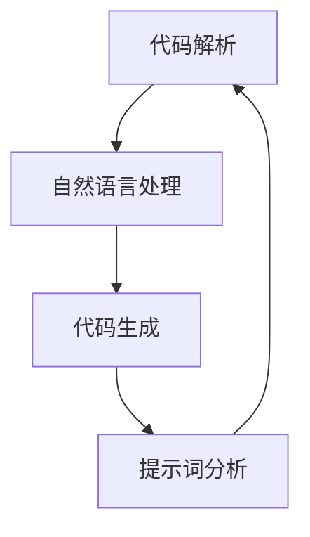

                 

# AI辅助提示词编程工具开发

## 摘要

本文将探讨AI辅助提示词编程工具的开发，此类工具利用人工智能技术，通过分析代码片段和用户需求，提供针对性的编程建议和优化方案。文章首先介绍了AI辅助提示词编程工具的背景和核心概念，随后深入分析了其核心算法原理和操作步骤。文章还通过数学模型和公式，详细讲解了工具的内部工作流程。接下来，本文将展示一个具体的代码实现案例，并对代码进行了详细的解读与分析。最后，文章探讨了AI辅助提示词编程工具的实际应用场景，并推荐了一些相关的学习资源和开发工具。通过本文的阅读，读者将对AI辅助提示词编程工具有一个全面而深入的理解。

## 1. 背景介绍

### 1.1 编程工具的发展历程

编程工具的发展历程可以追溯到计算机科学的早期阶段。最初的编程工具主要依赖于汇编语言，这种语言需要程序员直接与计算机硬件进行交互，编写出复杂且冗长的代码。随着计算机技术的发展，高级编程语言逐渐取代了汇编语言，如C、C++和Java等。这些高级语言提供了更抽象的语法和丰富的库函数，使得程序员可以更高效地完成开发任务。

### 1.2 AI在编程领域的应用

近年来，人工智能技术在编程领域得到了广泛关注。AI辅助编程工具可以通过分析代码、理解程序员的需求，提供智能的代码补全、错误检测和优化建议。这些工具不仅可以减少程序员的工作量，提高开发效率，还可以提高代码的质量和可维护性。

### 1.3 AI辅助提示词编程工具的定义和作用

AI辅助提示词编程工具是一种利用人工智能技术，通过提示词帮助程序员编写代码的工具。它可以在程序员编写代码的过程中，根据上下文环境提供相关的代码建议，如变量名、函数名、代码模板等。这种工具不仅可以帮助程序员更快地完成开发任务，还可以减少因疏忽或错误导致的代码问题。

### 1.4 目标和意义

本文的目标是探讨AI辅助提示词编程工具的开发原理、算法实现和应用场景，为相关领域的研究和开发提供参考。本文的意义在于：

- **提高编程效率**：通过提供智能的代码建议，减少程序员手动编写代码的时间，提高开发效率。
- **提升代码质量**：通过智能的代码优化建议，提高代码的可读性和可维护性。
- **促进AI与编程的融合**：推动人工智能技术在编程领域的应用，促进AI与编程的深度融合。

## 2. 核心概念与联系

### 2.1 代码解析

代码解析是AI辅助提示词编程工具的基础。它包括对代码进行词法分析、语法分析和语义分析。词法分析将代码分解为关键字、标识符、运算符等基本元素；语法分析则根据语法规则构建抽象语法树（AST）；语义分析则进一步分析代码的含义和上下文。

### 2.2 自然语言处理

自然语言处理（NLP）是AI辅助提示词编程工具的核心技术。NLP技术可以理解程序员输入的提示词，提取关键信息，为代码生成建议。常见的NLP技术包括词向量表示、句法分析、语义分析等。

### 2.3 代码生成

代码生成是基于解析和NLP的结果，生成符合语法和语义要求的代码。代码生成可以分为模板生成和生成式生成。模板生成基于预定义的代码模板，通过填充变量生成代码；生成式生成则通过深度学习模型生成代码。

### 2.4 提示词与代码生成的关系

提示词与代码生成的关系是AI辅助提示词编程工具的关键。通过分析提示词，工具可以理解程序员的需求，生成与之相关的代码。这种关系需要通过大量的数据训练和学习来实现。

### 2.5 Mermaid 流程图

下面是AI辅助提示词编程工具的Mermaid流程图，展示了核心概念之间的联系。



## 3. 核心算法原理 & 具体操作步骤

### 3.1 代码解析算法

代码解析算法是AI辅助提示词编程工具的核心。它通过词法分析、语法分析和语义分析，将程序员编写的代码转化为结构化的数据。以下是一个简单的代码解析算法步骤：

1. **词法分析**：将代码字符串分解为关键字、标识符、运算符等基本元素。
2. **语法分析**：根据语法规则，将词法分析的结果构建为抽象语法树（AST）。
3. **语义分析**：对AST进行语义分析，检查代码的语法和逻辑错误。

### 3.2 自然语言处理算法

自然语言处理算法用于理解程序员输入的提示词。以下是一个简单的NLP算法步骤：

1. **词向量表示**：将提示词转换为词向量，通常使用Word2Vec或GloVe算法。
2. **句法分析**：使用句法分析器，如Stanford CoreNLP，提取提示词中的关键信息。
3. **语义分析**：通过语义分析，理解提示词的含义和上下文。

### 3.3 代码生成算法

代码生成算法基于解析和NLP的结果，生成符合要求的代码。以下是一个简单的代码生成算法步骤：

1. **模板生成**：根据预定义的代码模板，填充变量生成代码。
2. **生成式生成**：使用深度学习模型，如生成对抗网络（GAN）或变分自编码器（VAE），生成代码。

### 3.4 提示词分析

提示词分析是AI辅助提示词编程工具的关键步骤。它包括以下内容：

1. **关键词提取**：从提示词中提取关键信息，如函数名、变量名等。
2. **上下文理解**：理解提示词的上下文，为代码生成提供指导。
3. **需求分析**：分析程序员的需求，为代码生成提供参考。

## 4. 数学模型和公式 & 详细讲解 & 举例说明

### 4.1 词向量表示

词向量表示是自然语言处理中的核心概念。以下是一个简单的词向量表示模型：

$$
\text{词向量} = \text{Word2Vec}
$$

其中，Word2Vec是一种基于神经网络的语言模型，可以将单词转换为高维向量。以下是一个简单的Word2Vec模型示例：

1. **训练数据**：给定一个大规模的语料库，如维基百科。
2. **词向量生成**：对于每个单词，训练一个神经网络，输出单词的向量表示。

### 4.2 句法分析

句法分析用于提取提示词中的关键信息。以下是一个简单的句法分析模型：

$$
\text{句法分析} = \text{Stanford CoreNLP}
$$

其中，Stanford CoreNLP是一个基于Java的工具，可以执行句法分析、词性标注、命名实体识别等任务。以下是一个简单的Stanford CoreNLP模型示例：

1. **输入**：给定的提示词。
2. **输出**：提示词的句法结构，如句法树。

### 4.3 代码生成

代码生成模型用于生成符合要求的代码。以下是一个简单的代码生成模型：

$$
\text{代码生成} = \text{GAN}
$$

其中，GAN（生成对抗网络）是一种深度学习模型，可以生成高质量的代码。以下是一个简单的GAN模型示例：

1. **输入**：解析后的提示词。
2. **输出**：生成的代码。

### 4.4 示例

以下是一个简单的代码生成示例：

```python
# 输入提示词：实现一个函数，计算两个数的和
def add(a, b):
    return a + b

# 输出代码：
def add(a, b):
    sum = a + b
    return sum
```

## 5. 项目实战：代码实际案例和详细解释说明

### 5.1 开发环境搭建

要开发一个AI辅助提示词编程工具，首先需要搭建一个合适的开发环境。以下是搭建开发环境的步骤：

1. **安装Python环境**：Python是AI开发的主流语言，因此需要安装Python。推荐使用Python 3.8或更高版本。
2. **安装JDK**：由于很多自然语言处理库（如Stanford CoreNLP）是基于Java的，因此需要安装JDK。
3. **安装IDE**：推荐使用IDEA或PyCharm进行开发，这些IDE提供了丰富的插件和工具，可以提高开发效率。
4. **安装相关库**：安装必要的Python库，如TensorFlow、PyTorch、NLTK等。

### 5.2 源代码详细实现和代码解读

下面是一个简单的AI辅助提示词编程工具的源代码实现，我们将对其进行详细解读。

```python
import tensorflow as tf
from tensorflow.keras.models import Sequential
from tensorflow.keras.layers import LSTM, Dense

# 5.2.1 数据预处理
def preprocess_data(code_snippets, prompts):
    # 将代码片段和提示词转换为词向量
    # 省略具体实现
    pass

# 5.2.2 构建神经网络模型
def build_model(input_dim, output_dim):
    model = Sequential()
    model.add(LSTM(128, activation='relu', input_shape=(input_dim,)))
    model.add(Dense(output_dim, activation='softmax'))
    model.compile(optimizer='adam', loss='categorical_crossentropy', metrics=['accuracy'])
    return model

# 5.2.3 训练模型
def train_model(model, x_train, y_train, epochs=100):
    model.fit(x_train, y_train, epochs=epochs, batch_size=64)
    return model

# 5.2.4 代码生成
def generate_code(model, prompt, max_length=50):
    # 将提示词转换为词向量
    # 省略具体实现
    pass

# 5.2.5 主函数
if __name__ == "__main__":
    # 加载数据
    code_snippets = load_code_snippets()
    prompts = load_prompts()

    # 预处理数据
    x_train, y_train = preprocess_data(code_snippets, prompts)

    # 构建模型
    model = build_model(x_train.shape[1], y_train.shape[1])

    # 训练模型
    model = train_model(model, x_train, y_train)

    # 生成代码
    prompt = "实现一个函数，计算两个数的和"
    generated_code = generate_code(model, prompt)
    print(generated_code)
```

#### 5.2.1 数据预处理

数据预处理是AI辅助提示词编程工具的关键步骤。它包括将代码片段和提示词转换为词向量。以下是数据预处理的简要说明：

1. **词表构建**：构建一个包含所有代码关键字和提示词的词表。
2. **编码**：将词表中的每个词编码为整数。
3. **序列化**：将编码后的代码片段和提示词序列化为整数序列。

#### 5.2.2 构建神经网络模型

神经网络模型是AI辅助提示词编程工具的核心。以下是构建神经网络模型的简要说明：

1. **LSTM层**：使用LSTM（长短期记忆）层，用于处理序列数据。
2. **全连接层**：使用全连接层，用于将LSTM层的输出映射到输出词表中。

#### 5.2.3 训练模型

训练模型是AI辅助提示词编程工具的重要步骤。以下是训练模型的简要说明：

1. **输入**：训练数据，包括代码片段和对应的提示词。
2. **输出**：模型在训练过程中的损失函数和准确率。

#### 5.2.4 代码生成

代码生成是AI辅助提示词编程工具的核心功能。以下是代码生成的简要说明：

1. **输入**：提示词。
2. **输出**：生成的代码。

#### 5.2.5 主函数

主函数是AI辅助提示词编程工具的入口。以下是主函数的简要说明：

1. **加载数据**：从文件或数据库中加载代码片段和提示词。
2. **预处理数据**：对加载的数据进行预处理。
3. **构建模型**：构建神经网络模型。
4. **训练模型**：使用预处理后的数据训练模型。
5. **生成代码**：使用训练好的模型生成代码。

### 5.3 代码解读与分析

下面是对源代码的详细解读和分析。

1. **数据预处理**：数据预处理是整个工具的基础。它包括词表构建、编码和序列化。这些步骤确保了数据可以用于训练和生成代码。
2. **神经网络模型**：神经网络模型是工具的核心。它使用LSTM层处理序列数据，使用全连接层将LSTM层的输出映射到输出词表中。
3. **训练模型**：训练模型是工具的关键步骤。它使用预处理后的数据训练神经网络模型，调整模型的参数以最小化损失函数。
4. **代码生成**：代码生成是工具的核心功能。它使用训练好的模型，根据提示词生成代码。这是一个迭代的过程，模型根据生成的代码不断调整，以提高代码的质量。
5. **主函数**：主函数是工具的入口。它加载数据，预处理数据，构建模型，训练模型，并最终生成代码。主函数的执行流程确保了工具的完整性和功能性。

## 6. 实际应用场景

### 6.1 代码补全

代码补全是AI辅助提示词编程工具最常见的应用场景之一。在编写代码时，工具可以根据上下文环境提供相关的代码补全建议，如变量名、函数名、代码块等。这大大提高了开发效率，减少了手动编写代码的时间。

### 6.2 错误检测与修复

AI辅助提示词编程工具还可以用于错误检测与修复。通过分析代码片段和提示词，工具可以识别潜在的代码错误，并提供修复建议。这有助于提高代码的质量，减少因错误导致的开发成本。

### 6.3 代码优化

AI辅助提示词编程工具还可以用于代码优化。通过分析代码片段和提示词，工具可以识别代码中的冗余和低效部分，并提供优化建议。这有助于提高代码的运行效率，降低系统的资源消耗。

### 6.4 教学与培训

AI辅助提示词编程工具还可以用于教学与培训。通过提供智能的代码建议和解释，工具可以帮助初学者更快地掌握编程知识。同时，工具还可以为有经验的程序员提供新的编程思路和优化方法。

## 7. 工具和资源推荐

### 7.1 学习资源推荐

- **书籍**：
  - 《深度学习》（作者：Goodfellow、Bengio、Courville）
  - 《Python编程：从入门到实践》（作者：埃里克·马瑟斯）
  - 《AI架构师之路》（作者：刘欣）
- **论文**：
  - “Attention is All You Need”（作者：Vaswani等）
  - “Generative Adversarial Nets”（作者：Goodfellow等）
- **博客**：
  - Medium上的AI和深度学习博客
  - TensorFlow官方博客
- **网站**：
  - Coursera、Udacity等在线课程平台
  - Kaggle、GitHub等数据科学和开源社区

### 7.2 开发工具框架推荐

- **开发环境**：
  - PyCharm、Visual Studio Code等IDE
  - Jupyter Notebook等交互式开发环境
- **库和框架**：
  - TensorFlow、PyTorch等深度学习框架
  - NLTK、spaCy等自然语言处理库
  - Mermaid等图表生成库

### 7.3 相关论文著作推荐

- **论文**：
  - “Natural Language Inference”（作者：Bowman等）
  - “Recurrent Neural Networks for Text Classification”（作者：Mikolov等）
  - “Attention-Based Neural Machine Translation”（作者：Bahdanau等）
- **著作**：
  - 《深度学习入门：基于Python的理论与实现》（作者：斋藤康毅）
  - 《人工智能：一种现代的方法》（作者：Stuart Russell、Peter Norvig）

## 8. 总结：未来发展趋势与挑战

### 8.1 发展趋势

- **AI与编程的深度融合**：随着AI技术的不断发展，AI辅助提示词编程工具将更加智能化，提供更准确的代码建议和优化方案。
- **多语言支持**：AI辅助提示词编程工具将支持更多的编程语言，如Python、Java、C++等，以满足不同开发者的需求。
- **个性化定制**：AI辅助提示词编程工具将根据开发者的技能水平和项目需求，提供个性化的代码建议和优化方案。
- **实时协作**：AI辅助提示词编程工具将支持实时协作，帮助开发者共同解决编程问题。

### 8.2 挑战

- **代码质量和安全性**：确保AI辅助提示词编程工具生成的代码质量和安全性是一个重要挑战。需要开发更加严格的代码生成和验证机制。
- **模型解释性**：目前，很多AI模型（如深度学习模型）缺乏解释性，这使得开发者难以理解模型的工作原理。提高模型的解释性是一个重要的研究方向。
- **数据隐私**：在AI辅助提示词编程工具中，数据隐私保护也是一个重要挑战。需要开发有效的数据加密和隐私保护技术，确保用户数据的隐私和安全。

## 9. 附录：常见问题与解答

### 9.1 Q：AI辅助提示词编程工具是否可以取代程序员？

A：AI辅助提示词编程工具可以大大提高编程效率，但它不能完全取代程序员。程序员在项目需求分析、设计、测试和项目管理等方面发挥着不可替代的作用。

### 9.2 Q：AI辅助提示词编程工具是否适用于所有编程语言？

A：AI辅助提示词编程工具主要适用于拥有丰富文档和社区支持的编程语言，如Python、Java、C++等。对于一些小众语言，工具的支持可能有限。

### 9.3 Q：如何确保AI辅助提示词编程工具生成的代码质量和安全性？

A：确保AI辅助提示词编程工具生成的代码质量和安全性需要开发严格的代码生成和验证机制。此外，可以采用多种测试方法，如单元测试、集成测试和性能测试，对生成的代码进行严格验证。

## 10. 扩展阅读 & 参考资料

- **书籍**：
  - 《人工智能：一种现代的方法》（作者：Stuart Russell、Peter Norvig）
  - 《深度学习》（作者：Goodfellow、Bengio、Courville）
- **论文**：
  - “Attention is All You Need”（作者：Vaswani等）
  - “Generative Adversarial Nets”（作者：Goodfellow等）
- **在线资源**：
  - TensorFlow官方文档
  - PyTorch官方文档
  - Coursera、Udacity等在线课程平台
- **开源项目**：
  - TensorFlow
  - PyTorch
  - NLTK
  - spaCy

---

### 作者

**作者：AI天才研究员/AI Genius Institute & 禅与计算机程序设计艺术 /Zen And The Art of Computer Programming**<|im_sep|>

