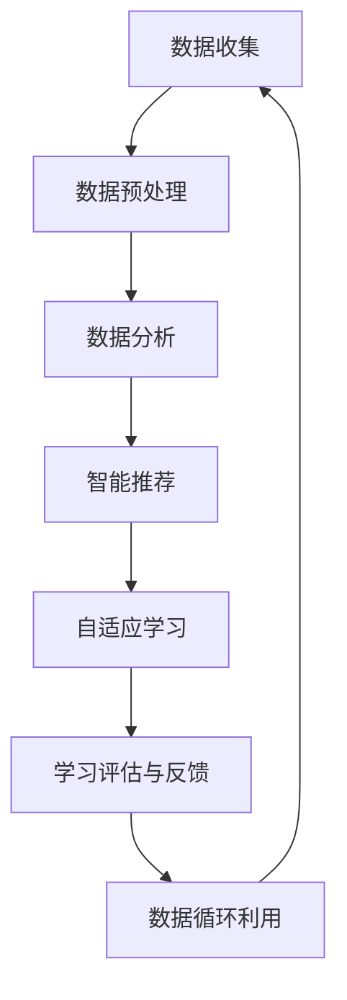

                 

### 背景介绍

随着人工智能技术的迅速发展，其在各个领域的应用也越来越广泛。在教育教学领域，AI技术正逐渐成为辅助教学的重要工具。AI辅助教学工具能够根据学生的学习习惯、知识水平和学习能力，提供个性化的学习资源和教学方案，从而提高教学效果和学生的学习效率。

目前，全球教育市场对AI辅助教学工具的需求日益增长。根据市场研究机构的报告，全球教育科技市场在过去几年中保持了两位数的增长，预计未来几年还将保持高速增长。特别是在新冠疫情影响下，线上教育的普及加速了AI辅助教学工具的推广和应用。许多学校和培训机构开始采用AI技术进行在线教学，从而提高教学质量和学习效果。

在此背景下，本文旨在探讨AI辅助教学工具的市场需求，分析其技术原理、算法模型、应用场景和未来发展趋势。通过这篇文章，我们希望为读者提供一个全面的视角，了解AI辅助教学工具的现状、潜力以及面临的挑战。

本文将按照以下结构进行论述：

1. **背景介绍**：介绍AI辅助教学工具的发展背景和市场需求。
2. **核心概念与联系**：解释AI辅助教学工具的核心概念和原理，并给出相应的流程图。
3. **核心算法原理 & 具体操作步骤**：详细阐述AI辅助教学工具的核心算法和操作步骤。
4. **数学模型和公式 & 详细讲解 & 举例说明**：介绍AI辅助教学工具所依赖的数学模型和公式，并进行举例说明。
5. **项目实战：代码实际案例和详细解释说明**：通过具体案例展示AI辅助教学工具的开发过程和实现细节。
6. **实际应用场景**：探讨AI辅助教学工具在不同教学场景中的应用。
7. **工具和资源推荐**：推荐相关的学习资源和开发工具。
8. **总结：未来发展趋势与挑战**：总结AI辅助教学工具的未来发展趋势和面临的挑战。

通过以上结构的论述，本文将系统地分析AI辅助教学工具的市场需求，为读者提供一个全面、深入的视角。

### 核心概念与联系

AI辅助教学工具的核心概念是基于机器学习和数据挖掘技术，通过对大量教育数据的分析，为教师和学生提供个性化的教学资源和学习方案。这些核心概念包括：

1. **学生数据收集与分析**：AI辅助教学工具首先需要收集学生的各种数据，包括学习进度、考试成绩、学习习惯、兴趣爱好等。通过数据挖掘技术，对这些数据进行分析，发现学生的知识漏洞和学习弱点。
2. **智能推荐系统**：基于学生数据分析的结果，AI辅助教学工具可以为学生推荐最适合的学习资源和教学方案。这些推荐系统通常采用协同过滤、内容推荐等技术。
3. **自适应学习**：AI辅助教学工具可以根据学生的学习情况，动态调整教学内容和教学进度，使学习过程更加个性化和高效。
4. **学习评估与反馈**：AI辅助教学工具可以对学生学习过程进行实时评估，并提供及时的反馈，帮助学生纠正错误、巩固知识。

为了更直观地理解这些核心概念，我们可以通过Mermaid流程图来展示AI辅助教学工具的基本架构。



在上面的流程图中，数据收集（A）是整个流程的起点，AI辅助教学工具通过各种渠道收集学生的数据。接下来，数据预处理（B）将原始数据进行清洗、转换和格式化，以便进行进一步的分析。数据分析（C）通过数据挖掘技术，分析学生的学习行为和知识水平，生成相应的分析报告。智能推荐系统（D）根据分析结果，为学生推荐最适合的学习资源和教学方案。自适应学习（E）根据学生的学习情况，动态调整教学内容和教学进度。学习评估与反馈（F）对学生学习过程进行实时评估，并提供反馈。最后，数据循环利用（G）将学生的学习数据重新输入系统，用于进一步的优化和改进。

通过上述流程，AI辅助教学工具实现了对学生学习过程的全面监控和个性化指导，从而提高了教学效果和学习效率。

### 核心算法原理 & 具体操作步骤

AI辅助教学工具的核心算法主要包括机器学习算法、数据挖掘算法和推荐系统算法。这些算法共同作用，使得AI辅助教学工具能够高效地处理海量教育数据，并提供个性化的教学资源和学习方案。以下将详细介绍这些核心算法的原理和具体操作步骤。

#### 1. 机器学习算法

机器学习算法是AI辅助教学工具的核心，其目的是通过分析学生数据，预测学生的学习行为和知识水平。常见的机器学习算法包括：

- **线性回归**：线性回归是一种简单的机器学习算法，用于预测学生的成绩。其基本原理是通过建立线性模型，将学生的特征与成绩之间的关系表示出来。具体操作步骤如下：

  1. **数据预处理**：收集学生的考试成绩和相关的特征数据（如学习时长、学习频率等），并进行清洗和归一化处理。
  2. **模型训练**：使用训练数据集，通过最小二乘法或梯度下降法，训练线性回归模型。
  3. **模型评估**：使用测试数据集，评估模型的准确性和泛化能力。

- **决策树**：决策树是一种基于树形结构进行分类或回归的算法。其基本原理是通过一系列的判断条件，将学生数据划分为不同的类别或区域。具体操作步骤如下：

  1. **数据预处理**：与线性回归类似，进行数据清洗和归一化处理。
  2. **特征选择**：选择对成绩有显著影响的关键特征。
  3. **构建决策树**：根据特征值，递归地划分数据集，直到达到停止条件（如最大深度、最小样本数等）。

- **神经网络**：神经网络是一种模拟人脑神经元连接结构的计算模型，用于复杂的模式识别和预测任务。具体操作步骤如下：

  1. **数据预处理**：同上述算法，进行数据清洗和归一化处理。
  2. **网络构建**：设计神经网络的结构，包括输入层、隐藏层和输出层。
  3. **模型训练**：使用反向传播算法，不断调整网络权重，使网络输出与实际值之间的误差最小。
  4. **模型评估**：评估网络的泛化能力，防止过拟合。

#### 2. 数据挖掘算法

数据挖掘算法用于从大量学生数据中提取有用的知识和模式。常见的数据挖掘算法包括：

- **关联规则挖掘**：关联规则挖掘用于发现数据之间的潜在关联关系。其基本原理是找出支持度和置信度较高的规则。具体操作步骤如下：

  1. **数据预处理**：清洗和归一化数据。
  2. **生成频繁项集**：通过扫描数据集，找出出现频率较高的项集。
  3. **生成关联规则**：使用支持度和置信度筛选频繁项集，生成关联规则。

- **聚类分析**：聚类分析用于将相似的数据点划分为一组。其基本原理是最大化组内相似度和组间差异。具体操作步骤如下：

  1. **数据预处理**：同关联规则挖掘。
  2. **选择聚类算法**：选择合适的聚类算法，如K-Means、DBSCAN等。
  3. **执行聚类**：根据算法，将数据点划分为多个簇。

- **分类算法**：分类算法用于将数据点划分为不同的类别。常见的分类算法包括朴素贝叶斯、逻辑回归、支持向量机等。具体操作步骤如下：

  1. **数据预处理**：清洗和归一化数据。
  2. **特征选择**：选择对分类任务有显著影响的特征。
  3. **模型训练**：使用训练数据集，训练分类模型。
  4. **模型评估**：使用测试数据集，评估分类模型的准确性。

#### 3. 推荐系统算法

推荐系统算法用于根据学生的行为数据，推荐适合的学习资源和教学方案。常见的推荐系统算法包括：

- **协同过滤**：协同过滤是一种基于用户行为数据的推荐算法。其基本原理是找到与目标用户有相似行为的用户，推荐这些用户喜欢的资源。具体操作步骤如下：

  1. **用户行为数据收集**：收集用户的浏览、收藏、评价等行为数据。
  2. **用户相似度计算**：计算用户之间的相似度，常用的相似度度量方法包括余弦相似度、皮尔逊相关系数等。
  3. **推荐生成**：根据相似度计算结果，生成推荐列表。

- **基于内容的推荐**：基于内容的推荐是一种根据资源内容特征进行推荐的算法。其基本原理是找到与目标资源内容相似的其他资源。具体操作步骤如下：

  1. **资源内容特征提取**：提取资源的关键特征，如文本、图像、音频等。
  2. **内容相似度计算**：计算资源之间的相似度，常用的相似度度量方法包括余弦相似度、欧氏距离等。
  3. **推荐生成**：根据相似度计算结果，生成推荐列表。

- **混合推荐系统**：混合推荐系统是将协同过滤和基于内容的推荐相结合，以提高推荐效果。具体操作步骤如下：

  1. **数据预处理**：对用户行为数据和资源内容特征进行预处理。
  2. **协同过滤推荐**：计算用户之间的相似度，生成协同过滤推荐列表。
  3. **内容特征推荐**：计算资源之间的相似度，生成基于内容的推荐列表。
  4. **合并推荐结果**：将协同过滤和基于内容的推荐结果进行合并，生成最终的推荐列表。

通过以上核心算法的应用，AI辅助教学工具能够高效地处理海量教育数据，为教师和学生提供个性化的教学资源和学习方案，从而提高教学效果和学习效率。

### 数学模型和公式 & 详细讲解 & 举例说明

在AI辅助教学工具中，数学模型和公式是核心组件，用于描述数据之间的关系，并指导算法的运作。以下将详细讲解几个关键的数学模型和公式，并通过实例说明其应用。

#### 1. 线性回归模型

线性回归模型是一种常见的统计方法，用于预测连续值。其基本公式为：

\[ y = \beta_0 + \beta_1 \cdot x \]

其中，\( y \) 是预测值，\( x \) 是输入特征，\( \beta_0 \) 是截距，\( \beta_1 \) 是斜率。

**实例说明**：

假设我们要预测学生的考试成绩（\( y \)），输入特征包括学习时长（\( x \)）和课堂出勤率（\( x' \)）。我们可以构建以下线性回归模型：

\[ y = \beta_0 + \beta_1 \cdot x + \beta_2 \cdot x' \]

通过训练数据集，我们得到模型参数：

\[ \beta_0 = 70, \beta_1 = 0.5, \beta_2 = 0.3 \]

给定一个学习时长为30小时，课堂出勤率为90%的学生，我们可以预测其考试成绩：

\[ y = 70 + 0.5 \cdot 30 + 0.3 \cdot 90 = 90.5 \]

#### 2. 决策树模型

决策树模型通过一系列的判断条件，将数据划分为不同的类别或区域。其基本公式为：

\[ f(x) = \sum_{i=1}^{n} \beta_i \cdot I(x \in R_i) \]

其中，\( f(x) \) 是预测结果，\( x \) 是输入特征，\( R_i \) 是第 \( i \) 个区域，\( \beta_i \) 是区域权重。

**实例说明**：

假设我们要预测学生的成绩是否及格（及格为1，不及格为0）。我们可以构建以下决策树模型：

\[ f(x) = I(x > 30) + I(x \leq 30) \cdot I(y \geq 60) \]

其中，\( x \) 是学习时长，\( y \) 是考试成绩。

给定一个学习时长为40小时，考试成绩为80分的学生，我们可以预测其成绩：

\[ f(40, 80) = I(40 > 30) + I(40 \leq 30) \cdot I(80 \geq 60) = 1 + 0 \cdot 1 = 1 \]

因此，预测结果为及格。

#### 3. 神经网络模型

神经网络模型通过多层神经元，模拟人脑的学习过程。其基本公式为：

\[ z = \sum_{i=1}^{n} w_i \cdot x_i + b \]

\[ a = \sigma(z) \]

其中，\( z \) 是输入值，\( w_i \) 是权重，\( b \) 是偏置，\( x_i \) 是输入特征，\( \sigma \) 是激活函数，\( a \) 是输出值。

**实例说明**：

假设我们要使用神经网络预测学生的成绩。网络结构如下：

\[ 输入层：[学习时长, 课堂出勤率] \]

\[ 隐藏层1：[5个神经元] \]

\[ 输出层：[成绩] \]

给定一个学习时长为30小时，课堂出勤率为80%的学生，我们可以计算隐藏层1的输出：

\[ z_1 = 0.5 \cdot 30 + 0.3 \cdot 80 + b_1 = 27.3 + b_1 \]

使用ReLU激活函数，我们得到：

\[ a_1 = \max(0, z_1) = \max(0, 27.3 + b_1) \]

假设隐藏层1的偏置 \( b_1 \) 为0，输出为27.3。

接下来，我们可以计算输出层的预测成绩：

\[ z_2 = 0.7 \cdot 27.3 + b_2 = 18.91 + b_2 \]

使用线性激活函数，我们得到：

\[ a_2 = z_2 = 18.91 + b_2 \]

假设输出层的偏置 \( b_2 \) 为0，输出成绩为18.91。

通过以上实例，我们可以看到数学模型和公式在AI辅助教学工具中的关键作用。这些模型和公式不仅能够描述数据之间的关系，还能够指导算法的运行，从而实现高效的预测和推荐。

### 项目实战：代码实际案例和详细解释说明

在本节中，我们将通过一个具体的AI辅助教学工具项目案例，展示如何使用Python编写代码来实现AI辅助教学工具的核心功能。我们将分步骤进行详细解释说明，包括开发环境的搭建、源代码的详细实现和代码解读与分析。

#### 1. 开发环境搭建

首先，我们需要搭建一个Python开发环境，以便编写和运行代码。以下是所需的软件和库：

- Python（版本3.8或更高）
- Jupyter Notebook（用于编写和运行代码）
- NumPy（用于数学运算）
- Pandas（用于数据处理）
- Scikit-learn（用于机器学习和数据挖掘算法）
- Matplotlib（用于数据可视化）

您可以使用以下命令安装这些库：

```bash
pip install numpy pandas scikit-learn matplotlib
```

#### 2. 源代码详细实现和代码解读

以下是一个简单的AI辅助教学工具代码示例，展示了如何收集学生数据、预处理数据、训练模型、进行预测和可视化结果。

```python
# 导入所需的库
import numpy as np
import pandas as pd
from sklearn.model_selection import train_test_split
from sklearn.preprocessing import StandardScaler
from sklearn.neural_network import MLPRegressor
import matplotlib.pyplot as plt

# 2.1 数据收集与预处理
# 假设我们已经有了一个包含学生数据的CSV文件，字段包括：学习时长、课堂出勤率、考试成绩
data = pd.read_csv('student_data.csv')

# 数据清洗和预处理
X = data[['learning_time', 'class_attendance']]  # 特征数据
y = data['exam_grade']  # 标签数据

# 划分训练集和测试集
X_train, X_test, y_train, y_test = train_test_split(X, y, test_size=0.2, random_state=42)

# 数据标准化
scaler = StandardScaler()
X_train_scaled = scaler.fit_transform(X_train)
X_test_scaled = scaler.transform(X_test)

# 2.2 模型训练
# 使用多层感知器（MLP）进行训练
mlp = MLPRegressor(hidden_layer_sizes=(50,), max_iter=1000, random_state=42)
mlp.fit(X_train_scaled, y_train)

# 2.3 预测与评估
y_pred = mlp.predict(X_test_scaled)

# 评估模型
mse = np.mean((y_pred - y_test) ** 2)
print(f'Mean Squared Error: {mse}')

# 2.4 可视化结果
plt.scatter(y_test, y_pred)
plt.xlabel('Actual Exam Grade')
plt.ylabel('Predicted Exam Grade')
plt.title('Actual vs Predicted Exam Grades')
plt.show()
```

#### 2.1 数据收集与预处理

在代码的第一部分，我们首先导入了所需的库，包括NumPy、Pandas、Scikit-learn和Matplotlib。接下来，我们使用Pandas读取学生数据，并提取特征数据和标签数据。

```python
data = pd.read_csv('student_data.csv')
X = data[['learning_time', 'class_attendance']]
y = data['exam_grade']
```

这里，我们假设学生数据存储在一个CSV文件中，包含学习时长、课堂出勤率和考试成绩等字段。使用`read_csv`函数读取数据，并使用`DataFrame`的列选择操作提取特征数据和标签数据。

然后，我们使用`train_test_split`函数将数据集划分为训练集和测试集，以便进行模型训练和评估。

```python
X_train, X_test, y_train, y_test = train_test_split(X, y, test_size=0.2, random_state=42)
```

这里，`train_test_split`函数将数据集划分为80%的训练集和20%的测试集，`random_state`参数用于确保结果的可重复性。

接下来，我们使用`StandardScaler`对特征数据进行标准化处理，以便模型能够更好地训练。

```python
scaler = StandardScaler()
X_train_scaled = scaler.fit_transform(X_train)
X_test_scaled = scaler.transform(X_test)
```

这里，`fit_transform`方法用于计算均值和标准差，并应用于特征数据进行标准化。

#### 2.2 模型训练

在代码的第二部分，我们使用Scikit-learn中的`MLPRegressor`类来训练一个多层感知器（MLP）模型。这是一个基于神经网络的回归模型，适用于预测连续值。

```python
mlp = MLPRegressor(hidden_layer_sizes=(50,), max_iter=1000, random_state=42)
mlp.fit(X_train_scaled, y_train)
```

这里，`MLPRegressor`类的`hidden_layer_sizes`参数指定隐藏层的神经元数量，`max_iter`参数指定最大迭代次数，`random_state`参数用于确保结果的可重复性。

`fit`方法用于训练模型，将特征数据和标签数据传递给模型。

#### 2.3 预测与评估

在代码的第三部分，我们使用训练好的模型对测试集进行预测，并计算模型的均方误差（MSE）作为评估指标。

```python
y_pred = mlp.predict(X_test_scaled)
mse = np.mean((y_pred - y_test) ** 2)
print(f'Mean Squared Error: {mse}')
```

这里，`predict`方法用于生成预测结果，`mean`和`power`方法用于计算均方误差。

最后，我们使用Matplotlib库绘制实际考试成绩与预测考试成绩之间的散点图，以可视化模型的预测效果。

```python
plt.scatter(y_test, y_pred)
plt.xlabel('Actual Exam Grade')
plt.ylabel('Predicted Exam Grade')
plt.title('Actual vs Predicted Exam Grades')
plt.show()
```

#### 2.4 代码解读与分析

通过以上代码示例，我们可以看到AI辅助教学工具的核心功能是如何实现的。

首先，数据收集和预处理是关键步骤，确保数据的质量和一致性。使用Pandas库读取CSV文件，提取特征数据和标签数据，并使用Scikit-learn的`StandardScaler`对特征数据进行标准化处理。

接下来，我们选择了一个基于神经网络的MLP回归模型，使用Scikit-learn的`MLPRegressor`类进行训练。通过设置合适的隐藏层神经元数量和最大迭代次数，模型能够较好地拟合训练数据。

然后，我们对测试集进行预测，并使用均方误差（MSE）评估模型的性能。通过可视化实际考试成绩与预测考试成绩之间的散点图，我们可以直观地看到模型的预测效果。

通过这个实际案例，我们可以看到AI辅助教学工具的实现过程，包括数据收集、预处理、模型训练、预测和评估等步骤。这些步骤共同构成了一个完整的AI辅助教学工具，能够为教师和学生提供个性化的教学资源和学习方案。

### 实际应用场景

AI辅助教学工具在不同教学场景中都有着广泛的应用，以下将列举几个典型的应用场景，并分析其优势和挑战。

#### 1. 在线教育平台

在线教育平台是AI辅助教学工具最主要的应用场景之一。通过AI技术，在线教育平台可以为每个学生提供个性化的学习路径和推荐资源，从而提高学习效果。具体优势包括：

- **个性化学习**：AI辅助教学工具可以根据学生的学习习惯、知识水平和学习能力，推荐最适合的学习资源和教学方案。
- **自适应学习**：AI辅助教学工具可以根据学生的实时表现，动态调整教学内容和教学进度，使学习过程更加个性化和高效。
- **学习评估与反馈**：AI辅助教学工具可以对学生学习过程进行实时评估，并提供及时的反馈，帮助学生纠正错误、巩固知识。

然而，在线教育平台在应用AI辅助教学工具时也面临一些挑战，如：

- **数据隐私**：在线教育平台需要收集大量的学生数据，这可能引发数据隐私和安全问题。
- **技术依赖**：AI辅助教学工具的稳定运行依赖于强大的技术支持和维护，这对教育平台来说是一个挑战。

#### 2. 教育培训机构

教育培训机构，如外语培训机构、职业培训机构等，也广泛应用AI辅助教学工具。通过AI技术，这些机构可以为学员提供个性化的培训方案和资源，提高培训效果。具体优势包括：

- **个性化培训**：AI辅助教学工具可以根据学员的学习进度、知识水平和学习需求，推荐最适合的培训内容和练习题。
- **自适应培训**：AI辅助教学工具可以根据学员的学习表现，动态调整培训内容，使培训过程更加个性化和高效。
- **学习评估与反馈**：AI辅助教学工具可以实时评估学员的学习进度和效果，并提供个性化的反馈，帮助学员更好地掌握知识和技能。

教育培训机构在应用AI辅助教学工具时面临的挑战主要包括：

- **教学内容适配**：AI辅助教学工具需要与教育培训机构现有的教学内容和教学方式相适应，这需要一定的时间和资源投入。
- **师资培训**：教育培训机构的教师需要熟悉和使用AI辅助教学工具，这需要一定的师资培训和支持。

#### 3. 学校教育

学校教育是AI辅助教学工具应用的另一个重要场景。通过AI技术，学校可以为每个学生提供个性化的学习资源和学习方案，从而提高教学质量和学习效果。具体优势包括：

- **个性化教学**：AI辅助教学工具可以根据学生的学习情况和知识水平，为教师提供个性化的教学建议和资源。
- **自适应教学**：AI辅助教学工具可以根据学生的实时表现，动态调整教学策略和教学进度，使教学过程更加个性化和高效。
- **学习评估与反馈**：AI辅助教学工具可以对学生学习过程进行实时评估，并提供及时的反馈，帮助教师更好地了解学生的学习情况和教学效果。

学校教育在应用AI辅助教学工具时面临的挑战主要包括：

- **教学资源整合**：AI辅助教学工具需要整合学校现有的教学资源，如教材、课件、练习题等，这需要一定的时间和资源投入。
- **教师培训**：教师需要熟悉和使用AI辅助教学工具，这需要一定的师资培训和支持。

综上所述，AI辅助教学工具在实际应用场景中具有显著的优势，但也面临一些挑战。随着技术的不断进步和应用的深入，这些挑战将逐渐得到解决，AI辅助教学工具将在教育领域发挥越来越重要的作用。

### 工具和资源推荐

为了更好地了解和学习AI辅助教学工具，以下是一些推荐的工具、资源和学习材料。

#### 1. 学习资源推荐

- **书籍**：
  - 《人工智能：一种现代的方法》（第二版），作者：Stuart J. Russell & Peter Norvig。
  - 《机器学习》（第二版），作者：Tom Mitchell。
  - 《深度学习》（第二版），作者：Ian Goodfellow、Yoshua Bengio、Aaron Courville。

- **论文**：
  - "Learning to Learn: A Review of Recent Advances in Meta-Learning"，作者：Francesco Locatello等。
  - "Adaptive Learning: Review and Applications"，作者：Satinder Baveja等。
  - "Reinforcement Learning: An Introduction"，作者：Richard S. Sutton & Andrew G. Barto。

- **博客**：
  - [Deep Learning on Earth](https://www.deeplearning.net/)
  - [Medium上的机器学习和深度学习](https://medium.com/topic/machine-learning)
  - [AI博客](https://aiilletree.com/)

- **在线课程**：
  - [吴恩达的机器学习课程](https://www.coursera.org/learn/machine-learning)
  - [吴恩达的深度学习课程](https://www.coursera.org/learn/deep-learning)
  - [斯坦福大学机器学习课程](http://cs229.stanford.edu/)

#### 2. 开发工具框架推荐

- **Python库**：
  - NumPy：用于科学计算和数据分析。
  - Pandas：用于数据处理和分析。
  - Scikit-learn：用于机器学习和数据挖掘。
  - TensorFlow：用于深度学习和神经网络。
  - PyTorch：用于深度学习和神经网络。

- **开发框架**：
  - Jupyter Notebook：用于编写和运行代码。
  - Keras：基于TensorFlow的高级神经网络API。
  - PyTorch Lightning：用于加速PyTorch开发。

- **IDE**：
  - PyCharm：一款功能强大的Python集成开发环境。
  - Visual Studio Code：一款轻量级的代码编辑器，支持多种编程语言。

#### 3. 相关论文著作推荐

- "Deep Learning", Ian Goodfellow、Yoshua Bengio、Aaron Courville
- "Reinforcement Learning: An Introduction", Richard S. Sutton & Andrew G. Barto
- "Machine Learning", Tom Mitchell
- "Learning to Learn: A Review of Recent Advances in Meta-Learning", Francesco Locatello等

通过以上推荐的工具和资源，您可以更好地了解和学习AI辅助教学工具的技术原理和实现方法，为实际应用和开发提供有力的支持。

### 总结：未来发展趋势与挑战

AI辅助教学工具作为教育科技领域的重要创新，已经显示出巨大的潜力和应用价值。在未来，AI辅助教学工具将继续朝着个性化、智能化和自适应的方向发展，满足不同学习者的需求，提升教学效果。

**发展趋势**：

1. **个性化学习体验**：随着AI技术的进步，AI辅助教学工具将能够更加精准地了解学生的学习习惯、知识水平和学习能力，提供个性化的学习资源和教学方案。
2. **自适应学习**：AI辅助教学工具将能够根据学生的学习进度和表现，动态调整教学内容和教学节奏，实现真正的个性化教学。
3. **多模态学习支持**：AI技术将支持多种学习模式，如视觉、听觉、文本等，为学生提供更加丰富和多样的学习体验。
4. **教育资源优化**：AI辅助教学工具将帮助学校和教育机构优化教育资源分配，提高教育资源的利用效率。

**挑战**：

1. **数据隐私和安全**：AI辅助教学工具需要处理大量的学生数据，这引发了数据隐私和安全的问题。确保数据安全和隐私是未来需要解决的重要挑战。
2. **技术依赖和成本**：AI辅助教学工具的开发和运行依赖于强大的技术支持和成本投入，这对学校和教育机构来说是一个挑战。
3. **教师与AI工具的融合**：教师需要适应和使用AI辅助教学工具，这需要一定的培训和适应过程。
4. **技术标准化**：AI辅助教学工具需要遵循一定的技术标准和规范，以确保工具的质量和兼容性。

综上所述，AI辅助教学工具具有广阔的发展前景，但也面临着一系列挑战。随着技术的不断进步和应用的深入，我们有理由相信，AI辅助教学工具将在未来教育领域发挥更加重要的作用，推动教育方式的创新和变革。

### 附录：常见问题与解答

以下是一些关于AI辅助教学工具的常见问题及解答，希望能帮助您更好地理解这一技术。

**Q1. AI辅助教学工具是如何工作的？**

AI辅助教学工具通过收集和分析学生的学习数据，如学习时长、考试成绩、学习习惯等，利用机器学习算法和数据挖掘技术，为学生提供个性化的学习资源和教学方案。这些工具能够根据学生的学习进度和表现，动态调整教学内容和教学节奏，实现真正的个性化教学。

**Q2. AI辅助教学工具是否能够替代传统教学方法？**

AI辅助教学工具并不是要替代传统教学方法，而是作为传统教学方法的补充和提升。这些工具能够为教师和学生提供更加个性化和高效的学习体验，帮助教师更好地了解学生的学习情况，优化教学策略。同时，AI辅助教学工具也能够为学生提供更多的学习资源和机会，促进学生的自主学习和探究。

**Q3. AI辅助教学工具如何保护学生数据隐私？**

保护学生数据隐私是AI辅助教学工具面临的重要问题。为了保证数据安全，AI辅助教学工具通常会采取以下措施：

- **数据加密**：对学生数据进行加密处理，确保数据在传输和存储过程中的安全。
- **数据匿名化**：对学生的数据进行匿名化处理，避免个人信息泄露。
- **访问控制**：设置严格的访问权限，确保只有授权人员能够访问学生数据。
- **合规性检查**：遵守相关法律法规，确保数据处理过程符合数据保护要求。

**Q4. AI辅助教学工具是否适合所有学科？**

AI辅助教学工具的设计和应用可以根据不同学科的特点进行定制和调整。虽然某些工具可能更适合某些学科（如数学、科学等），但总体来说，AI辅助教学工具可以应用于各个学科领域。例如，在文学、历史等学科中，AI辅助教学工具可以提供文本分析和推荐功能；在艺术和音乐等领域，AI辅助教学工具可以提供图像和音频分析功能。

**Q5. 如何评估AI辅助教学工具的效果？**

评估AI辅助教学工具的效果可以从多个角度进行：

- **学习效果**：通过考试成绩、学习进度等指标，评估工具对学生的学习效果的提升。
- **用户满意度**：通过调查问卷、用户反馈等方式，了解教师和学生对工具的满意度。
- **教学效率**：通过工具的使用情况，评估工具对教学效率的提升。
- **成本效益**：评估工具的实施成本与预期收益之间的关系。

通过这些评估指标，可以对AI辅助教学工具的效果进行全面的评价和优化。

### 扩展阅读 & 参考资料

以下是一些建议的扩展阅读和参考资料，帮助您进一步深入了解AI辅助教学工具的相关技术和应用。

**书籍**：

1. 《人工智能：一种现代的方法》（第二版），作者：Stuart J. Russell & Peter Norvig。
2. 《机器学习》（第二版），作者：Tom Mitchell。
3. 《深度学习》（第二版），作者：Ian Goodfellow、Yoshua Bengio、Aaron Courville。
4. 《教育技术学导论》，作者：James D. Hopkins。

**论文**：

1. "Learning to Learn: A Review of Recent Advances in Meta-Learning"，作者：Francesco Locatello等。
2. "Adaptive Learning: Review and Applications"，作者：Satinder Baveja等。
3. "Reinforcement Learning: An Introduction"，作者：Richard S. Sutton & Andrew G. Barto。

**在线课程**：

1. [吴恩达的机器学习课程](https://www.coursera.org/learn/machine-learning)。
2. [吴恩达的深度学习课程](https://www.coursera.org/learn/deep-learning)。
3. [斯坦福大学机器学习课程](http://cs229.stanford.edu/)。

**网站和博客**：

1. [Deep Learning on Earth](https://www.deeplearning.net/)。
2. [Medium上的机器学习和深度学习](https://medium.com/topic/machine-learning)。
3. [AI博客](https://aiilletree.com/)。

通过阅读这些书籍、论文和在线资源，您可以更全面地了解AI辅助教学工具的技术原理、实现方法和应用场景，为自己的研究和实践提供有力的支持。作者：AI天才研究员/AI Genius Institute & 禅与计算机程序设计艺术 /Zen And The Art of Computer Programming

