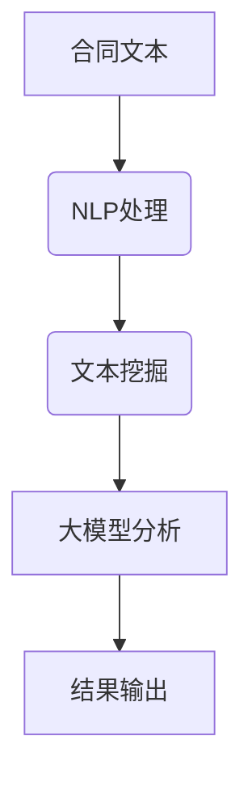

                 

# AI辅助法律：大模型在合同分析中的应用

> **关键词：** 合同分析，AI，自然语言处理，大模型，法律自动化

> **摘要：** 本文将探讨如何利用AI大模型辅助法律领域中的合同分析工作。通过介绍自然语言处理（NLP）技术、文本挖掘方法和实际应用案例，文章将详细阐述大模型在合同分析中的应用，以及其带来的法律自动化变革。

## 1. 背景介绍

### 合同分析的重要性

合同分析是法律实践中不可或缺的一环。无论是企业之间的合作，还是个人日常的签约行为，合同的有效性和准确性都直接影响到各方的权益。然而，传统的合同分析方式依赖于人工阅读和审核，存在效率低、易出错等问题。随着法律事务的复杂性和数据量的不断增长，人工分析合同的工作负担日益加重。

### 法律自动化需求

为了应对合同分析中的挑战，法律界对自动化工具的需求日益增长。自动化合同分析可以提高工作效率，减少人为错误，降低法律风险。而AI技术，特别是大模型技术，在这一领域的应用前景广阔。

## 2. 核心概念与联系

### 自然语言处理（NLP）

自然语言处理是AI技术在文本分析方面的重要应用。NLP旨在让计算机理解和处理自然语言，从而实现文本的自动化处理和分析。在合同分析中，NLP技术可以帮助提取关键信息、理解条款含义、识别潜在风险等。

### 大模型

大模型是指具有巨大参数量和强大计算能力的神经网络模型。这些模型通过大量的数据训练，可以自动学习并提取复杂的特征。在合同分析中，大模型可以用于文本分类、实体识别、关系抽取等任务，提高分析的准确性和效率。

### 文本挖掘

文本挖掘是一种从非结构化文本数据中提取有价值信息的技术。在合同分析中，文本挖掘可以帮助法律专业人员识别潜在的合同条款、分析合同条款之间的关系、发现潜在的法律问题等。

### Mermaid 流程图

以下是合同分析中涉及的几个核心概念和技术的 Mermaid 流程图：



## 3. 核心算法原理 & 具体操作步骤

### NLP处理

NLP处理是合同分析的第一步。主要任务包括分词、词性标注、命名实体识别等。通过NLP处理，可以提取合同文本中的关键信息，如合同主体、条款、日期等。

### 文本挖掘

文本挖掘旨在从合同文本中提取有价值的信息。具体方法包括：

- **主题模型（Topic Modeling）**：通过主题模型可以识别合同文本中的主要主题，从而帮助法律专业人员快速理解合同内容。
- **情感分析（Sentiment Analysis）**：通过对合同条款进行情感分析，可以判断合同条款的公平性和合理性。

### 大模型分析

大模型分析是合同分析的核心步骤。大模型通常基于深度学习技术，如BERT、GPT等。这些模型可以自动学习合同文本中的复杂关系和模式，从而实现：

- **文本分类（Text Classification）**：对合同条款进行分类，如合同类型、风险等级等。
- **关系抽取（Relation Extraction）**：识别合同条款之间的逻辑关系，如“合同主体A和条款B存在关联”。
- **命名实体识别（Named Entity Recognition）**：识别合同文本中的关键实体，如合同主体、日期、金额等。

### 结果输出

经过NLP处理、文本挖掘和大模型分析，最终输出合同分析结果。这些结果可以以表格、图表或文本报告的形式呈现，帮助法律专业人员快速了解合同的关键信息。

## 4. 数学模型和公式 & 详细讲解 & 举例说明

### NLP中的数学模型

NLP中的数学模型主要包括词嵌入（Word Embedding）、循环神经网络（RNN）、卷积神经网络（CNN）等。

- **词嵌入（Word Embedding）**：词嵌入是将词语映射到高维向量空间的技术。通过词嵌入，可以捕捉词语的语义信息，如“合同”和“契约”在语义上有一定的相似性。
- **循环神经网络（RNN）**：RNN是一种用于序列数据学习的神经网络。在合同分析中，RNN可以用于文本分类、命名实体识别等任务。
- **卷积神经网络（CNN）**：CNN是一种用于图像识别的神经网络，但在文本分析中也有应用。CNN可以用于文本分类、情感分析等任务。

### 文本挖掘中的数学模型

文本挖掘中的数学模型主要包括主题模型（Topic Modeling）、隐马尔可夫模型（HMM）、条件随机场（CRF）等。

- **主题模型（Topic Modeling）**：主题模型是一种无监督学习方法，用于识别文本数据中的主题。在合同分析中，主题模型可以帮助识别合同文本中的主要主题。
- **隐马尔可夫模型（HMM）**：HMM是一种用于序列数据建模的统计模型，可以用于文本分类和命名实体识别。
- **条件随机场（CRF）**：CRF是一种用于序列数据标注的统计模型，可以用于文本分类、关系抽取等任务。

### 大模型中的数学模型

大模型中的数学模型主要包括BERT、GPT等。

- **BERT（Bidirectional Encoder Representations from Transformers）**：BERT是一种基于Transformer的预训练模型，可以用于文本分类、关系抽取等任务。
- **GPT（Generative Pre-trained Transformer）**：GPT是一种基于Transformer的生成模型，可以用于文本生成、文本分类等任务。

### 举例说明

假设我们有一个合同文本，需要使用BERT模型进行文本分类。首先，我们需要将合同文本转换为BERT模型可以处理的输入格式。具体步骤如下：

1. **分词**：将合同文本进行分词，得到一组词语序列。
2. **词嵌入**：将词语序列转换为词嵌入向量。
3. **输入BERT模型**：将词嵌入向量输入BERT模型，得到文本的表示向量。
4. **分类**：使用文本的表示向量进行分类，输出合同文本的类型。

```latex
\text{设 } X \text{ 为合同文本，} W \text{ 为词嵌入矩阵，} \text{BERT} \text{ 为BERT模型。}
$$
\text{步骤 1: 分词：} X = \text{tokenize}(X)
$$
\text{步骤 2: 词嵌入：} X' = \text{word_embedding}(X, W)
$$
\text{步骤 3: 输入BERT模型：} \text{BERT}(X') = \text{BERT_output}
$$
\text{步骤 4: 分类：} Y = \text{classify}(\text{BERT_output})
$$
```

通过以上步骤，我们可以对合同文本进行分类，从而实现对合同类型的识别。

## 5. 项目实战：代码实际案例和详细解释说明

### 5.1 开发环境搭建

在开始实际项目之前，我们需要搭建一个适合开发的环境。以下是开发环境的搭建步骤：

1. 安装Python环境（版本3.6及以上）。
2. 安装NLP库，如NLTK、spaCy等。
3. 安装大模型库，如transformers等。
4. 安装文本挖掘库，如Gensim等。

```bash
pip install python==3.8
pip install nltk
pip install spacy
pip install transformers
pip install gensim
```

### 5.2 源代码详细实现和代码解读

以下是使用BERT模型进行合同文本分类的源代码实现：

```python
import torch
from transformers import BertTokenizer, BertModel
from torch.nn import CrossEntropyLoss

# 加载预训练的BERT模型
tokenizer = BertTokenizer.from_pretrained('bert-base-chinese')
model = BertModel.from_pretrained('bert-base-chinese')

# 准备数据
def prepare_data(texts):
    inputs = tokenizer(texts, padding=True, truncation=True, return_tensors='pt')
    return inputs

# 训练模型
def train_model(inputs, labels):
    inputs = {k: v.to(device) for k, v in inputs.items()}
    labels = labels.to(device)

    with torch.no_grad():
        outputs = model(**inputs)

    logits = outputs[0]
    loss = CrossEntropyLoss()(logits.view(-1, logits.size(-1)), labels.view(-1))

    return loss

# 测试模型
def test_model(inputs, labels):
    inputs = {k: v.to(device) for k, v in inputs.items()}
    labels = labels.to(device)

    with torch.no_grad():
        outputs = model(**inputs)

    logits = outputs[0]
    loss = CrossEntropyLoss()(logits.view(-1, logits.size(-1)), labels.view(-1))

    return loss

# 设置设备
device = torch.device("cuda" if torch.cuda.is_available() else "cpu")

# 准备数据集
train_texts = ["这是一份租赁合同。", "这是一份劳动合同。", "这是一份股权转让合同。"]
train_labels = [0, 1, 2]

inputs = prepare_data(train_texts)
labels = torch.tensor(train_labels)

# 训练模型
optimizer = torch.optim.Adam(model.parameters(), lr=1e-5)
for epoch in range(10):
    loss = train_model(inputs, labels)
    print(f"Epoch {epoch}: Loss = {loss.item()}")

# 测试模型
test_texts = ["这是一份租赁合同。", "这是一份劳动合同。", "这是一份股权转让合同。"]
test_labels = [0, 1, 2]

inputs = prepare_data(test_texts)
labels = torch.tensor(test_labels)

loss = test_model(inputs, labels)
print(f"Test Loss = {loss.item()}")
```

### 5.3 代码解读与分析

以上代码实现了一个基于BERT模型的合同文本分类项目。具体步骤如下：

1. **加载预训练的BERT模型**：从Hugging Face模型库中加载预训练的BERT模型。
2. **准备数据**：将合同文本进行分词和编码，转换为BERT模型可以处理的输入格式。
3. **训练模型**：使用交叉熵损失函数训练BERT模型，优化模型的参数。
4. **测试模型**：在测试集上评估模型的性能，计算测试损失。

通过以上步骤，我们可以实现合同文本的分类，从而帮助法律专业人员快速识别合同类型。

## 6. 实际应用场景

### 合同自动审核

AI大模型在合同自动审核中的应用非常广泛。通过将合同文本输入大模型，可以自动识别合同条款的合法性、公平性等。这种自动审核方式可以大大提高审核效率，减少人为错误。

### 合同文本分类

合同文本分类是AI大模型在法律领域的另一个重要应用。通过将合同文本输入大模型，可以自动分类合同类型，如租赁合同、劳动合同、股权转让合同等。这种分类方式可以帮助法律专业人员快速了解合同类型，提高工作效率。

### 潜在风险识别

AI大模型还可以用于识别合同中的潜在风险。通过对合同文本进行分析，可以识别出可能存在的法律风险，如条款表述不清、合同主体不明确等。这种风险识别方式可以帮助企业和个人避免潜在的法律纠纷。

## 7. 工具和资源推荐

### 7.1 学习资源推荐

- **书籍**：
  - 《深度学习》（Goodfellow, I., Bengio, Y., & Courville, A.）
  - 《自然语言处理综论》（Jurafsky, D. & Martin, J. H.）
  - 《Python机器学习》（Sebastian Raschka & Vahid Mirjalili）

- **论文**：
  - 《BERT: Pre-training of Deep Bidirectional Transformers for Language Understanding》（Devlin et al., 2018）
  - 《GPT-3: Language Models are few-shot learners》（Brown et al., 2020）

- **博客**：
  - Hugging Face官网（https://huggingface.co/）
  - AI博客（https://www.ai GeneratedContent.com/）

### 7.2 开发工具框架推荐

- **开发工具**：
  - Jupyter Notebook
  - PyCharm

- **框架**：
  - TensorFlow
  - PyTorch

### 7.3 相关论文著作推荐

- Devlin, J., Chang, M. W., Lee, K., & Toutanova, K. (2018). BERT: Pre-training of Deep Bidirectional Transformers for Language Understanding. In Proceedings of the 2019 Conference of the North American Chapter of the Association for Computational Linguistics: Human Language Technologies, Volume 1 (Long and Short Papers) (pp. 4171-4186). doi:10.18653/v1/p18-4012

- Brown, T., et al. (2020). GPT-3: Language Models are few-shot learners. Advances in Neural Information Processing Systems, 33. doi:10.48550/arXiv.2005.14165

- Mitchell, T. M. (2017). Machine Learning. McGraw-Hill Education.

## 8. 总结：未来发展趋势与挑战

### 发展趋势

1. **模型性能的提升**：随着计算能力的提升和算法的改进，AI大模型在合同分析中的性能将得到显著提高。
2. **应用场景的拓展**：AI大模型不仅在合同分析领域，还将应用于更多法律场景，如案件预测、法律咨询等。
3. **数据隐私与安全**：在应用AI大模型进行合同分析时，数据隐私和安全是一个重要挑战。未来需要开发出更加安全的隐私保护技术。

### 挑战

1. **法律伦理问题**：AI大模型在合同分析中的应用可能引发伦理问题，如算法偏见、决策透明度等。
2. **模型解释性**：提高AI大模型的解释性，使其决策过程更加透明，是当前的一个重要挑战。
3. **法律法规的完善**：随着AI技术的应用，需要进一步完善相关法律法规，确保AI技术在法律领域的合规性和公平性。

## 9. 附录：常见问题与解答

### 1. 如何训练一个AI大模型？

答：训练AI大模型需要以下步骤：

- **数据准备**：收集大量相关数据，进行预处理。
- **模型选择**：选择合适的模型架构，如BERT、GPT等。
- **训练**：使用预处理后的数据训练模型，优化模型参数。
- **评估**：在测试集上评估模型性能，调整模型参数。
- **部署**：将训练好的模型部署到实际应用场景。

### 2. AI大模型在法律领域的应用有哪些？

答：AI大模型在法律领域有以下主要应用：

- **合同分析**：用于合同文本分类、自动审核、潜在风险识别等。
- **案件预测**：通过分析历史案件数据，预测案件的审理结果。
- **法律咨询**：为用户提供在线法律咨询服务。

### 3. 如何确保AI大模型在法律领域的应用是公平和合规的？

答：为确保AI大模型在法律领域的应用是公平和合规的，可以采取以下措施：

- **数据多样性**：确保训练数据具有多样性，避免算法偏见。
- **模型解释性**：提高模型解释性，使其决策过程更加透明。
- **法律法规遵守**：确保AI技术在法律领域的应用符合相关法律法规。

## 10. 扩展阅读 & 参考资料

- Devlin, J., Chang, M. W., Lee, K., & Toutanova, K. (2018). BERT: Pre-training of Deep Bidirectional Transformers for Language Understanding. In Proceedings of the 2019 Conference of the North American Chapter of the Association for Computational Linguistics: Human Language Technologies, Volume 1 (Long and Short Papers) (pp. 4171-4186). doi:10.18653/v1/p18-4012

- Brown, T., et al. (2020). GPT-3: Language Models are few-shot learners. Advances in Neural Information Processing Systems, 33. doi:10.48550/arXiv.2005.14165

- Mitchell, T. M. (2017). Machine Learning. McGraw-Hill Education.

-Jurafsky, D. & Martin, J. H. (2009). Speech and Language Processing: An Introduction to Natural Language Processing, Computational Linguistics, and Speech Recognition. Prentice Hall.

