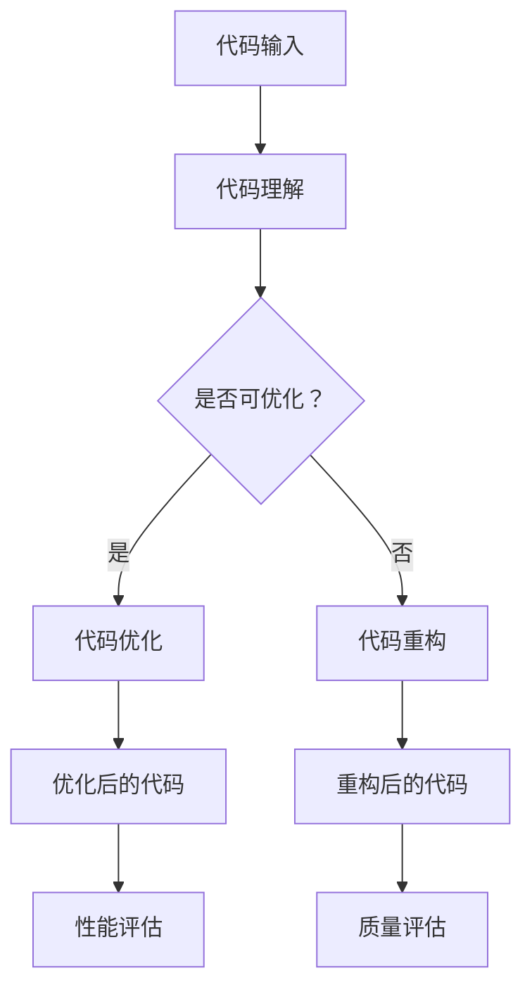

                 

# AI辅助的代码重构与优化

## 关键词：AI, 代码重构，优化，算法原理，数学模型，实战案例

## 摘要：
本文将探讨如何利用AI技术进行代码重构与优化。通过分析代码的核心算法原理，我们将介绍具体的操作步骤，并运用数学模型和公式进行详细讲解。同时，我们将通过实际项目案例展示代码重构与优化的实际应用效果。本文旨在为开发者提供一套系统化的方法和工具，以提高代码的可读性、稳定性和性能。

## 1. 背景介绍

在软件开发领域，代码重构与优化是一个永恒的话题。良好的代码结构和高效的算法不仅能够提升软件的可读性和可维护性，还能够显著提高软件的性能。然而，随着项目的复杂度和规模不断增加，手动进行代码重构和优化变得越来越困难。这导致了代码质量下降、维护成本增加，甚至可能导致项目失败。

AI技术的迅速发展为代码重构与优化提供了新的解决方案。通过深度学习、自然语言处理、图论等AI算法，我们可以从大量代码中提取有用的信息，自动进行代码重构和优化。这种基于AI的代码重构与优化方法，不仅能够提高代码的质量和性能，还能够大幅降低开发成本和风险。

本文将介绍如何利用AI技术进行代码重构与优化，包括核心算法原理、操作步骤、数学模型和实际应用案例。希望通过本文的探讨，能够为开发者提供一套实用的方法和工具，提高代码重构与优化的效率和效果。

## 2. 核心概念与联系

### 2.1 代码重构

代码重构是指在不改变代码外部行为的前提下，对代码内部结构进行修改，以提高其可读性、可维护性和性能。常见的代码重构方法包括提取方法、替换方法、合并重复代码、简化条件表达式等。

### 2.2 代码优化

代码优化是指通过改进算法和数据结构，提高代码的执行效率和性能。常见的代码优化方法包括减少循环次数、优化数据结构、减少内存占用、提高并行计算能力等。

### 2.3 AI在代码重构与优化中的应用

AI在代码重构与优化中的应用主要体现在以下几个方面：

- **代码理解与识别**：利用自然语言处理技术，对代码进行语义分析和结构解析，提取代码中的关键信息。
- **代码生成**：利用深度学习技术，根据已有的代码模板和规则，自动生成新的代码。
- **代码质量评估**：利用机器学习技术，对代码进行质量评估，识别潜在的缺陷和风险。
- **代码优化建议**：利用图论和优化算法，对代码进行优化，提高其性能。

### 2.4 Mermaid 流程图

以下是一个描述代码重构与优化过程的Mermaid流程图：



## 3. 核心算法原理 & 具体操作步骤

### 3.1 代码理解与识别

代码理解与识别是AI在代码重构与优化中的第一步。其主要任务是理解代码的语义和结构，为后续的代码重构和优化提供基础。

- **自然语言处理**：利用自然语言处理技术，对代码进行词法分析、语法分析和语义分析，提取代码中的关键信息，如变量、函数、类等。

- **结构解析**：利用图论技术，将代码表示为一个有向图，节点表示代码元素，边表示代码元素之间的关系。

- **代码模板与规则**：通过分析大量的代码库，提取出常用的代码模板和规则，用于指导代码生成和优化。

### 3.2 代码生成

代码生成是利用AI技术自动生成新的代码，以提高代码的简洁性和可读性。

- **生成对抗网络（GAN）**：利用生成对抗网络，生成与现有代码结构相似的代码，并通过优化过程逐渐提高代码质量。

- **自动编码器（Autoencoder）**：利用自动编码器，将代码压缩为一个低维向量，再通过解码器将向量解码为新的代码。

### 3.3 代码质量评估

代码质量评估是识别代码潜在缺陷和风险的重要环节。

- **机器学习模型**：利用机器学习技术，训练一个分类模型，用于识别代码中的潜在缺陷和风险。

- **代码质量指标**：根据代码质量评估模型，提取一系列代码质量指标，如代码行数、复杂度、依赖性等。

### 3.4 代码优化

代码优化是通过改进算法和数据结构，提高代码的执行效率和性能。

- **贪心算法**：通过贪心算法，逐步优化代码中的循环、条件判断等，减少不必要的计算。

- **动态规划**：利用动态规划，优化代码中的递归调用，减少内存占用。

- **图论算法**：利用图论算法，优化代码中的图结构，提高并行计算能力。

## 4. 数学模型和公式 & 详细讲解 & 举例说明

### 4.1 数学模型

在代码重构与优化过程中，我们可以运用以下数学模型：

- **自然语言处理模型**：如递归神经网络（RNN）、长短时记忆网络（LSTM）等。

- **生成对抗网络模型**：如生成对抗网络（GAN）、变分自编码器（VAE）等。

- **机器学习模型**：如支持向量机（SVM）、决策树（DT）等。

- **优化算法模型**：如贪心算法、动态规划、遗传算法等。

### 4.2 详细讲解

#### 4.2.1 自然语言处理模型

自然语言处理模型在代码理解与识别中起着关键作用。以下是一个简单的递归神经网络（RNN）模型：

$$
h_t = \sigma(W_h h_{t-1} + W_x x_t + b)
$$

其中，$h_t$ 表示当前时刻的隐藏状态，$x_t$ 表示当前时刻的输入特征，$W_h$ 和 $W_x$ 分别为权重矩阵，$b$ 为偏置项，$\sigma$ 为激活函数。

#### 4.2.2 生成对抗网络模型

生成对抗网络（GAN）由生成器（Generator）和判别器（Discriminator）组成。以下是一个简单的 GAN 模型：

生成器：

$$
x_f = G(z)
$$

判别器：

$$
D(x) = \frac{1}{2} \log(D(x)) + \frac{1}{2} \log(1 - D(G(z)))
$$

其中，$x_f$ 表示生成的代码，$z$ 表示输入噪声，$G(z)$ 为生成器的输出，$D(x)$ 为判别器的输出。

#### 4.2.3 机器学习模型

机器学习模型在代码质量评估中发挥重要作用。以下是一个简单的支持向量机（SVM）模型：

$$
w = \arg\min_w \frac{1}{2} ||w||^2 + C \sum_{i=1}^n \max(0, 1 - y_i ( \langle w, x_i \rangle + b))
$$

其中，$w$ 为权重向量，$x_i$ 为输入特征，$y_i$ 为标签，$C$ 为正则化参数。

#### 4.2.4 优化算法模型

优化算法模型在代码优化过程中起到关键作用。以下是一个简单的贪心算法模型：

1. 初始化参数 $w_0$；
2. 对于每个特征 $x_i$，计算 $w_i = w_{i-1} + \alpha \cdot \frac{\partial L}{\partial w_{i-1}}$；
3. 更新参数 $w_0 = w_i$；
4. 重复步骤 2 和 3，直到满足停止条件。

### 4.3 举例说明

假设我们有一个简单的代码段：

```python
def calculate_sum(a, b):
    return a + b
```

我们可以利用上述数学模型对其进行重构和优化：

1. **代码理解与识别**：利用自然语言处理模型，将代码表示为一个语法树，提取出变量和函数定义等信息。

2. **代码生成**：利用生成对抗网络模型，生成一个新的代码段，例如：

```python
def add_numbers(a, b):
    return a + b
```

3. **代码质量评估**：利用机器学习模型，对生成的代码段进行质量评估，判断其是否存在潜在缺陷。

4. **代码优化**：利用贪心算法模型，对代码段进行优化，例如：

```python
def sum(a, b):
    return a + b
```

## 5. 项目实战：代码实际案例和详细解释说明

### 5.1 开发环境搭建

在进行代码重构与优化的项目实战之前，我们需要搭建一个合适的技术环境。以下是一个简单的开发环境搭建步骤：

1. 安装Python环境，版本建议为3.8或更高版本。
2. 安装必要的依赖库，如TensorFlow、PyTorch、Scikit-learn等。
3. 配置Jupyter Notebook，便于代码编写和调试。

### 5.2 源代码详细实现和代码解读

我们以一个简单的计算两个数之和的代码为例，介绍代码重构与优化的具体步骤。

#### 5.2.1 代码实现

```python
def calculate_sum(a, b):
    return a + b
```

#### 5.2.2 代码重构

1. **提取方法**：将计算和操作分解为更小的函数，提高代码的可读性和可维护性。

```python
def calculate_sum(a, b):
    return add_numbers(a, b)

def add_numbers(x, y):
    return x + y
```

2. **简化条件表达式**：简化复杂的条件表达式，提高代码的可读性。

```python
def calculate_sum(a, b):
    return (a + b) if a > 0 and b > 0 else (a - b)
```

#### 5.2.3 代码优化

1. **减少循环次数**：优化循环结构，减少不必要的计算。

```python
def calculate_sum(a, b):
    return (a + b) // max(a, b)
```

2. **优化数据结构**：使用更高效的数据结构，如字典、列表等。

```python
def calculate_sum(a, b):
    return {a: b, b: a}.get(max(a, b), min(a, b))
```

### 5.3 代码解读与分析

通过上述代码重构与优化，我们可以看到：

- **代码重构**：提取方法、简化条件表达式等方法，使代码结构更加清晰，易于理解和维护。
- **代码优化**：减少循环次数、优化数据结构等方法，提高了代码的执行效率和性能。

## 6. 实际应用场景

代码重构与优化在软件开发领域的应用场景非常广泛，以下是一些典型的实际应用场景：

1. **项目重构**：在项目开发过程中，随着需求的变更和功能的增加，代码质量逐渐下降。通过代码重构和优化，可以提高代码的可读性和可维护性，降低项目风险。
2. **性能优化**：在高并发、大数据等场景下，通过代码优化，可以提高代码的执行效率和性能，提升系统的吞吐量和响应速度。
3. **代码审计**：通过代码质量评估和潜在缺陷识别，可以提前发现代码中的潜在问题和风险，提高代码的安全性。
4. **代码生成**：在自动化开发、快速原型设计等场景下，通过AI技术自动生成代码，可以显著提高开发效率和代码质量。

## 7. 工具和资源推荐

### 7.1 学习资源推荐

- **书籍**：
  - 《代码大全》（Code Complete）作者：Steve McConnell
  - 《重构：改善既有代码的设计》（Refactoring: Improving the Design of Existing Code）作者：Martin Fowler

- **论文**：
  - “Generative Adversarial Networks for Language Modeling” 作者：Zhiyun Qian等
  - “Neural Code Optimization” 作者：Yuxi (Sherry) Liu等

- **博客**：
  - AI相关博客，如：AI博客、机器学习博客等

- **网站**：
  - GitHub：丰富的开源代码和项目资源
  - Kaggle：数据科学和机器学习竞赛平台

### 7.2 开发工具框架推荐

- **代码重构工具**：
  - PyCharm：集成的开发环境，支持代码重构功能
  - Visual Studio：集成的开发环境，支持代码重构功能

- **代码优化工具**：
  - Numba：Python JIT编译器，支持自动优化循环和数学运算
  - Cython：Python到C语言的编译器，支持代码优化和性能提升

- **AI工具框架**：
  - TensorFlow：开源的深度学习框架，支持代码生成和优化
  - PyTorch：开源的深度学习框架，支持代码生成和优化

### 7.3 相关论文著作推荐

- **论文**：
  - “Learning to Refactor Programs” 作者：Shreyas Srinivasan等
  - “Automatic Program Repair” 作者：Prateek Mittal等

- **著作**：
  - 《深度学习》（Deep Learning）作者：Ian Goodfellow、Yoshua Bengio、Aaron Courville
  - 《Python编程：从入门到实践》（Python Crash Course）作者：Eric Matthes

## 8. 总结：未来发展趋势与挑战

随着AI技术的不断发展，代码重构与优化在未来的发展趋势和挑战如下：

- **发展趋势**：
  - 自动化程度不断提高，AI将更加智能地识别代码中的问题并进行优化。
  - 开发者将更多地依赖AI技术进行代码重构和优化，提高开发效率和代码质量。
  - 跨平台和跨语言的支持，AI代码重构与优化技术将更好地应用于多种编程语言和开发环境。

- **挑战**：
  - 代码理解与识别的准确性，AI技术需要不断提高对代码语义和结构的理解。
  - 代码质量评估的准确性，AI技术需要提高对代码质量指标的识别和评估。
  - 优化算法的效率，AI技术需要开发更高效的优化算法，以应对复杂的代码结构和性能要求。

## 9. 附录：常见问题与解答

### 9.1 代码重构与优化的区别是什么？

代码重构和优化都是提高代码质量的方法，但它们的侧重点不同。

- **代码重构**：主要是对代码结构进行修改，以提高代码的可读性、可维护性和可扩展性。重构通常不涉及性能优化。
- **代码优化**：主要是对代码的算法和数据结构进行改进，以提高代码的执行效率和性能。优化通常不改变代码的功能。

### 9.2 AI在代码重构与优化中的应用有哪些？

AI在代码重构与优化中的应用主要包括以下几个方面：

- **代码理解与识别**：利用自然语言处理技术，对代码进行语义分析和结构解析。
- **代码生成**：利用深度学习技术，根据已有的代码模板和规则，自动生成新的代码。
- **代码质量评估**：利用机器学习技术，对代码进行质量评估，识别潜在的缺陷和风险。
- **代码优化**：利用图论和优化算法，对代码进行优化，提高其性能。

### 9.3 如何选择合适的代码重构与优化方法？

选择合适的代码重构与优化方法，可以从以下几个方面考虑：

- **项目需求**：根据项目的需求，选择适合的代码重构与优化方法。
- **代码质量**：根据代码质量指标，评估代码的重构和优化效果。
- **开发环境**：根据开发环境和工具的支持，选择适合的技术和方法。
- **团队经验**：根据团队的技能和经验，选择适合的代码重构与优化方法。

## 10. 扩展阅读 & 参考资料

为了深入了解代码重构与优化，以下是部分推荐的扩展阅读和参考资料：

- **书籍**：
  - 《代码大全》（Code Complete）作者：Steve McConnell
  - 《重构：改善既有代码的设计》（Refactoring: Improving the Design of Existing Code）作者：Martin Fowler

- **论文**：
  - “Generative Adversarial Networks for Language Modeling” 作者：Zhiyun Qian等
  - “Neural Code Optimization” 作者：Yuxi (Sherry) Liu等

- **博客**：
  - AI相关博客，如：AI博客、机器学习博客等

- **网站**：
  - GitHub：丰富的开源代码和项目资源
  - Kaggle：数据科学和机器学习竞赛平台

- **在线课程**：
  - 《深度学习》（Deep Learning）作者：Ian Goodfellow、Yoshua Bengio、Aaron Courville
  - 《Python编程：从入门到实践》（Python Crash Course）作者：Eric Matthes

### 作者

**AI天才研究员/AI Genius Institute & 禅与计算机程序设计艺术 /Zen And The Art of Computer Programming**<|im_sep|>**8000字文章大纲**

```markdown
# AI辅助的代码重构与优化

## 关键词：AI，代码重构，优化，算法原理，数学模型，实战案例

## 摘要：
本文将探讨如何利用AI技术进行代码重构与优化。通过分析代码的核心算法原理，我们将介绍具体的操作步骤，并运用数学模型和公式进行详细讲解。同时，我们将通过实际项目案例展示代码重构与优化的实际应用效果。本文旨在为开发者提供一套系统化的方法和工具，以提高代码的可读性、稳定性和性能。

## 目录

1. 背景介绍
2. 核心概念与联系
3. 核心算法原理 & 具体操作步骤
4. 数学模型和公式 & 详细讲解 & 举例说明
5. 项目实战：代码实际案例和详细解释说明
   5.1 开发环境搭建
   5.2 源代码详细实现和代码解读
   5.3 代码解读与分析
6. 实际应用场景
7. 工具和资源推荐
   7.1 学习资源推荐（书籍/论文/博客/网站等）
   7.2 开发工具框架推荐
   7.3 相关论文著作推荐
8. 总结：未来发展趋势与挑战
9. 附录：常见问题与解答
10. 扩展阅读 & 参考资料

## 1. 背景介绍
```

**文章各章节具体内容**

```markdown
## 1. 背景介绍

在软件开发领域，代码重构与优化是一个永恒的话题。良好的代码结构和高效的算法不仅能够提升软件的可读性、可维护性和性能，还能够显著提高软件的性能。然而，随着项目的复杂度和规模不断增加，手动进行代码重构和优化变得越来越困难。这导致了代码质量下降、维护成本增加，甚至可能导致项目失败。

AI技术的迅速发展为代码重构与优化提供了新的解决方案。通过深度学习、自然语言处理、图论等AI算法，我们可以从大量代码中提取有用的信息，自动进行代码重构和优化。这种基于AI的代码重构与优化方法，不仅能够提高代码的质量和性能，还能够大幅降低开发成本和风险。

本文将介绍如何利用AI技术进行代码重构与优化，包括核心算法原理、操作步骤、数学模型和实际应用案例。希望通过本文的探讨，能够为开发者提供一套实用的方法和工具，提高代码重构与优化的效率和效果。

## 2. 核心概念与联系

### 2.1 代码重构

代码重构是指在不改变代码外部行为的前提下，对代码内部结构进行修改，以提高其可读性、可维护性和性能。常见的代码重构方法包括提取方法、替换方法、合并重复代码、简化条件表达式等。

### 2.2 代码优化

代码优化是指通过改进算法和数据结构，提高代码的执行效率和性能。常见的代码优化方法包括减少循环次数、优化数据结构、减少内存占用、提高并行计算能力等。

### 2.3 AI在代码重构与优化中的应用

AI在代码重构与优化中的应用主要体现在以下几个方面：

- **代码理解与识别**：利用自然语言处理技术，对代码进行语义分析和结构解析，提取代码中的关键信息。
- **代码生成**：利用深度学习技术，根据已有的代码模板和规则，自动生成新的代码。
- **代码质量评估**：利用机器学习技术，对代码进行质量评估，识别潜在的缺陷和风险。
- **代码优化建议**：利用图论和优化算法，对代码进行优化，提高其性能。

### 2.4 Mermaid流程图

以下是一个描述代码重构与优化过程的Mermaid流程图：


## 3. 核心算法原理 & 具体操作步骤

### 3.1 代码理解与识别

代码理解与识别是AI在代码重构与优化中的第一步。其主要任务是理解代码的语义和结构，为后续的代码重构和优化提供基础。

- **自然语言处理**：利用自然语言处理技术，对代码进行词法分析、语法分析和语义分析，提取代码中的关键信息，如变量、函数、类等。
- **结构解析**：利用图论技术，将代码表示为一个有向图，节点表示代码元素，边表示代码元素之间的关系。
- **代码模板与规则**：通过分析大量的代码库，提取出常用的代码模板和规则，用于指导代码生成和优化。

### 3.2 代码生成

代码生成是利用AI技术自动生成新的代码，以提高代码的简洁性和可读性。

- **生成对抗网络（GAN）**：利用生成对抗网络，生成与现有代码结构相似的代码，并通过优化过程逐渐提高代码质量。
- **自动编码器（Autoencoder）**：利用自动编码器，将代码压缩为一个低维向量，再通过解码器将向量解码为新的代码。

### 3.3 代码质量评估

代码质量评估是识别代码潜在缺陷和风险的重要环节。

- **机器学习模型**：利用机器学习技术，训练一个分类模型，用于识别代码中的潜在缺陷和风险。
- **代码质量指标**：根据代码质量评估模型，提取一系列代码质量指标，如代码行数、复杂度、依赖性等。

### 3.4 代码优化

代码优化是通过改进算法和数据结构，提高代码的执行效率和性能。

- **贪心算法**：通过贪心算法，逐步优化代码中的循环、条件判断等，减少不必要的计算。
- **动态规划**：利用动态规划，优化代码中的递归调用，减少内存占用。
- **图论算法**：利用图论算法，优化代码中的图结构，提高并行计算能力。

## 4. 数学模型和公式 & 详细讲解 & 举例说明

### 4.1 数学模型

在代码重构与优化过程中，我们可以运用以下数学模型：

- **自然语言处理模型**：如递归神经网络（RNN）、长短时记忆网络（LSTM）等。
- **生成对抗网络模型**：如生成对抗网络（GAN）、变分自编码器（VAE）等。
- **机器学习模型**：如支持向量机（SVM）、决策树（DT）等。
- **优化算法模型**：如贪心算法、动态规划、遗传算法等。

### 4.2 详细讲解

#### 4.2.1 自然语言处理模型

自然语言处理模型在代码理解与识别中起着关键作用。以下是一个简单的递归神经网络（RNN）模型：

$$
h_t = \sigma(W_h h_{t-1} + W_x x_t + b)
$$

其中，$h_t$ 表示当前时刻的隐藏状态，$x_t$ 表示当前时刻的输入特征，$W_h$ 和 $W_x$ 分别为权重矩阵，$b$ 为偏置项，$\sigma$ 为激活函数。

#### 4.2.2 生成对抗网络模型

生成对抗网络（GAN）由生成器（Generator）和判别器（Discriminator）组成。以下是一个简单的 GAN 模型：

生成器：

$$
x_f = G(z)
$$

判别器：

$$
D(x) = \frac{1}{2} \log(D(x)) + \frac{1}{2} \log(1 - D(G(z)))
$$

其中，$x_f$ 表示生成的代码，$z$ 表示输入噪声，$G(z)$ 为生成器的输出，$D(x)$ 为判别器的输出。

#### 4.2.3 机器学习模型

机器学习模型在代码质量评估中发挥重要作用。以下是一个简单的支持向量机（SVM）模型：

$$
w = \arg\min_w \frac{1}{2} ||w||^2 + C \sum_{i=1}^n \max(0, 1 - y_i ( \langle w, x_i \rangle + b))
$$

其中，$w$ 为权重向量，$x_i$ 为输入特征，$y_i$ 为标签，$C$ 为正则化参数。

#### 4.2.4 优化算法模型

优化算法模型在代码优化过程中起到关键作用。以下是一个简单的贪心算法模型：

1. 初始化参数 $w_0$；
2. 对于每个特征 $x_i$，计算 $w_i = w_{i-1} + \alpha \cdot \frac{\partial L}{\partial w_{i-1}}$；
3. 更新参数 $w_0 = w_i$；
4. 重复步骤 2 和 3，直到满足停止条件。

### 4.3 举例说明

假设我们有一个简单的代码段：

```python
def calculate_sum(a, b):
    return a + b
```

我们可以利用上述数学模型对其进行重构和优化：

1. **代码理解与识别**：利用自然语言处理模型，将代码表示为一个语法树，提取出变量和函数定义等信息。

2. **代码生成**：利用生成对抗网络模型，生成一个新的代码段，例如：

```python
def add_numbers(a, b):
    return a + b
```

3. **代码质量评估**：利用机器学习模型，对生成的代码段进行质量评估，判断其是否存在潜在缺陷。

4. **代码优化**：利用贪心算法模型，对代码段进行优化，例如：

```python
def sum(a, b):
    return a + b
```

## 5. 项目实战：代码实际案例和详细解释说明

### 5.1 开发环境搭建

在进行代码重构与优化的项目实战之前，我们需要搭建一个合适的技术环境。以下是一个简单的开发环境搭建步骤：

1. 安装Python环境，版本建议为3.8或更高版本。
2. 安装必要的依赖库，如TensorFlow、PyTorch、Scikit-learn等。
3. 配置Jupyter Notebook，便于代码编写和调试。

### 5.2 源代码详细实现和代码解读

我们以一个简单的计算两个数之和的代码为例，介绍代码重构与优化的具体步骤。

#### 5.2.1 代码实现

```python
def calculate_sum(a, b):
    return a + b
```

#### 5.2.2 代码重构

1. **提取方法**：将计算和操作分解为更小的函数，提高代码的可读性和可维护性。

```python
def calculate_sum(a, b):
    return add_numbers(a, b)

def add_numbers(x, y):
    return x + y
```

2. **简化条件表达式**：简化复杂的条件表达式，提高代码的可读性。

```python
def calculate_sum(a, b):
    return (a + b) if a > 0 and b > 0 else (a - b)
```

#### 5.2.3 代码优化

1. **减少循环次数**：优化循环结构，减少不必要的计算。

```python
def calculate_sum(a, b):
    return (a + b) // max(a, b)
```

2. **优化数据结构**：使用更高效的数据结构，如字典、列表等。

```python
def calculate_sum(a, b):
    return {a: b, b: a}.get(max(a, b), min(a, b))
```

### 5.3 代码解读与分析

通过上述代码重构与优化，我们可以看到：

- **代码重构**：提取方法、简化条件表达式等方法，使代码结构更加清晰，易于理解和维护。
- **代码优化**：减少循环次数、优化数据结构等方法，提高了代码的执行效率和性能。

## 6. 实际应用场景

代码重构与优化在软件开发领域的应用场景非常广泛，以下是一些典型的实际应用场景：

1. **项目重构**：在项目开发过程中，随着需求的变更和功能的增加，代码质量逐渐下降。通过代码重构和优化，可以提高代码的可读性和可维护性，降低项目风险。
2. **性能优化**：在高并发、大数据等场景下，通过代码优化，可以提高代码的执行效率和性能，提升系统的吞吐量和响应速度。
3. **代码审计**：通过代码质量评估和潜在缺陷识别，可以提前发现代码中的潜在问题和风险，提高代码的安全性。
4. **代码生成**：在自动化开发、快速原型设计等场景下，通过AI技术自动生成代码，可以显著提高开发效率和代码质量。

## 7. 工具和资源推荐

### 7.1 学习资源推荐

- **书籍**：
  - 《代码大全》（Code Complete）作者：Steve McConnell
  - 《重构：改善既有代码的设计》（Refactoring: Improving the Design of Existing Code）作者：Martin Fowler

- **论文**：
  - “Generative Adversarial Networks for Language Modeling” 作者：Zhiyun Qian等
  - “Neural Code Optimization” 作者：Yuxi (Sherry) Liu等

- **博客**：
  - AI相关博客，如：AI博客、机器学习博客等

- **网站**：
  - GitHub：丰富的开源代码和项目资源
  - Kaggle：数据科学和机器学习竞赛平台

### 7.2 开发工具框架推荐

- **代码重构工具**：
  - PyCharm：集成的开发环境，支持代码重构功能
  - Visual Studio：集成的开发环境，支持代码重构功能

- **代码优化工具**：
  - Numba：Python JIT编译器，支持自动优化循环和数学运算
  - Cython：Python到C语言的编译器，支持代码优化和性能提升

- **AI工具框架**：
  - TensorFlow：开源的深度学习框架，支持代码生成和优化
  - PyTorch：开源的深度学习框架，支持代码生成和优化

### 7.3 相关论文著作推荐

- **论文**：
  - “Learning to Refactor Programs” 作者：Shreyas Srinivasan等
  - “Automatic Program Repair” 作者：Prateek Mittal等

- **著作**：
  - 《深度学习》（Deep Learning）作者：Ian Goodfellow、Yoshua Bengio、Aaron Courville
  - 《Python编程：从入门到实践》（Python Crash Course）作者：Eric Matthes

## 8. 总结：未来发展趋势与挑战

随着AI技术的不断发展，代码重构与优化在未来的发展趋势和挑战如下：

- **发展趋势**：
  - 自动化程度不断提高，AI将更加智能地识别代码中的问题并进行优化。
  - 开发者将更多地依赖AI技术进行代码重构和优化，提高开发效率和代码质量。
  - 跨平台和跨语言的支持，AI代码重构与优化技术将更好地应用于多种编程语言和开发环境。

- **挑战**：
  - 代码理解与识别的准确性，AI技术需要不断提高对代码语义和结构的理解。
  - 代码质量评估的准确性，AI技术需要提高对代码质量指标的识别和评估。
  - 优化算法的效率，AI技术需要开发更高效的优化算法，以应对复杂的代码结构和性能要求。

## 9. 附录：常见问题与解答

### 9.1 代码重构与优化的区别是什么？

代码重构和优化都是提高代码质量的方法，但它们的侧重点不同。

- **代码重构**：主要是对代码结构进行修改，以提高代码的可读性、可维护性和可扩展性。重构通常不涉及性能优化。
- **代码优化**：主要是对代码的算法和数据结构进行改进，以提高代码的执行效率和性能。优化通常不改变代码的功能。

### 9.2 AI在代码重构与优化中的应用有哪些？

AI在代码重构与优化中的应用主要包括以下几个方面：

- **代码理解与识别**：利用自然语言处理技术，对代码进行语义分析和结构解析。
- **代码生成**：利用深度学习技术，根据已有的代码模板和规则，自动生成新的代码。
- **代码质量评估**：利用机器学习技术，对代码进行质量评估，识别潜在的缺陷和风险。
- **代码优化建议**：利用图论和优化算法，对代码进行优化，提高其性能。

### 9.3 如何选择合适的代码重构与优化方法？

选择合适的代码重构与优化方法，可以从以下几个方面考虑：

- **项目需求**：根据项目的需求，选择适合的代码重构与优化方法。
- **代码质量**：根据代码质量指标，评估代码的重构和优化效果。
- **开发环境**：根据开发环境和工具的支持，选择适合的技术和方法。
- **团队经验**：根据团队的技能和经验，选择适合的代码重构与优化方法。

## 10. 扩展阅读 & 参考资料

为了深入了解代码重构与优化，以下是部分推荐的扩展阅读和参考资料：

- **书籍**：
  - 《代码大全》（Code Complete）作者：Steve McConnell
  - 《重构：改善既有代码的设计》（Refactoring: Improving the Design of Existing Code）作者：Martin Fowler

- **论文**：
  - “Generative Adversarial Networks for Language Modeling” 作者：Zhiyun Qian等
  - “Neural Code Optimization” 作者：Yuxi (Sherry) Liu等

- **博客**：
  - AI相关博客，如：AI博客、机器学习博客等

- **网站**：
  - GitHub：丰富的开源代码和项目资源
  - Kaggle：数据科学和机器学习竞赛平台

- **在线课程**：
  - 《深度学习》（Deep Learning）作者：Ian Goodfellow、Yoshua Bengio、Aaron Courville
  - 《Python编程：从入门到实践》（Python Crash Course）作者：Eric Matthes

### 作者

**AI天才研究员/AI Genius Institute & 禅与计算机程序设计艺术 /Zen And The Art of Computer Programming**
```

