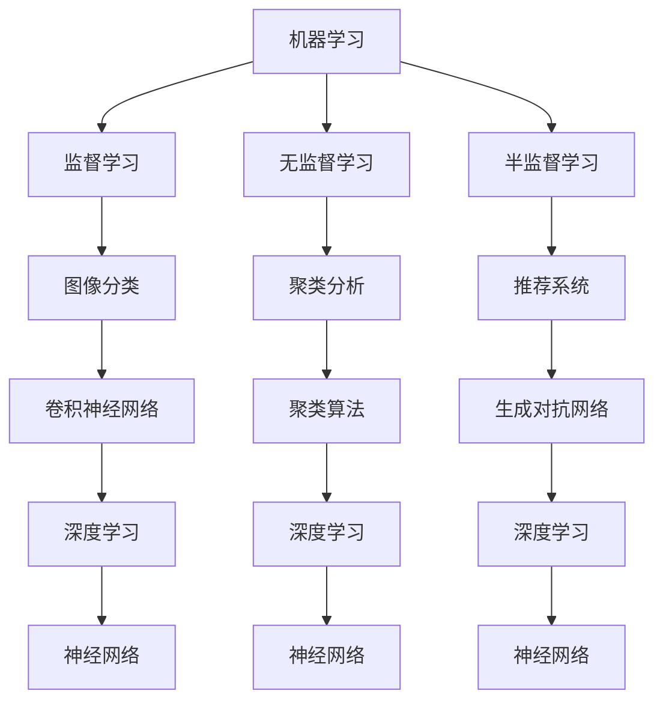

                 

### 背景介绍

随着科技的飞速发展，人工智能（AI）已经成为当前最具前瞻性和影响力的技术领域之一。自20世纪50年代以来，人工智能的发展经历了多个阶段，从早期的符号主义、连接主义，到现代的深度学习和强化学习，每一个阶段都带来了革命性的变化。如今，AI技术已经深入到各个行业和领域，改变了人类的生活和工作方式。

在这样一个特殊的时刻，我们站在AI发展的十字路口，面临着前所未有的机遇和挑战。本文将深入探讨AI领域的独特时刻与未来，通过逻辑清晰、结构紧凑的分析，帮助读者理解AI的核心概念、算法原理、应用场景以及未来发展趋势。

本文的结构如下：

1. **背景介绍**：回顾AI的发展历程，介绍当前AI技术的现状。
2. **核心概念与联系**：讲解AI的核心概念，展示相关的原理和架构，使用Mermaid流程图进行可视化。
3. **核心算法原理 & 具体操作步骤**：深入分析几种关键算法的原理和操作步骤。
4. **数学模型和公式 & 详细讲解 & 举例说明**：介绍AI中的数学模型和公式，并通过具体案例进行详细解释。
5. **项目实战：代码实际案例和详细解释说明**：展示一个完整的AI项目案例，详细解析代码实现和关键点。
6. **实际应用场景**：探讨AI在不同领域的应用，包括医疗、金融、教育等。
7. **工具和资源推荐**：推荐学习AI的相关资源，包括书籍、论文、博客和开发工具框架。
8. **总结：未来发展趋势与挑战**：总结AI的当前状态，预测未来的发展趋势和面临的挑战。
9. **附录：常见问题与解答**：解答读者可能遇到的常见问题。
10. **扩展阅读 & 参考资料**：提供进一步学习的参考资料。

在接下来的章节中，我们将逐步深入探讨AI的每一个方面，帮助读者全面理解这个充满机遇和挑战的领域。让我们开始这场探索之旅吧！<|im_sep|>### 核心概念与联系

要深入理解人工智能（AI），首先需要掌握一些核心概念。这些概念不仅构成了AI的基石，而且在各种算法和技术中起着关键作用。在本节中，我们将介绍AI的一些核心概念，包括机器学习（ML）、深度学习（DL）、神经网络（NN）等，并展示它们之间的联系。

#### 机器学习（Machine Learning）

机器学习是AI的核心组成部分，它使计算机系统能够从数据中学习并做出预测或决策。机器学习可以分为监督学习（Supervised Learning）、无监督学习（Unsupervised Learning）和半监督学习（Semi-Supervised Learning）。

- **监督学习**：在有标记的数据集上进行训练，系统通过学习输入和输出之间的映射关系来预测未知数据的结果。例如，图像分类任务。
- **无监督学习**：在无标记的数据集上进行训练，系统试图发现数据中的结构和模式，如聚类分析。
- **半监督学习**：结合有标记和无标记数据，提高模型在有限标记数据上的性能。

#### 深度学习（Deep Learning）

深度学习是机器学习的一个子领域，它利用多层神经网络（Multi-Layer Neural Networks）进行训练。深度学习的核心思想是通过多个层次的处理，逐步提取数据的特征，从而实现复杂的任务。

- **卷积神经网络（CNN）**：主要用于图像处理，通过卷积层提取图像的局部特征。
- **循环神经网络（RNN）**：适用于序列数据，如时间序列分析和自然语言处理。
- **生成对抗网络（GAN）**：通过对抗训练生成逼真的数据，常用于图像生成和风格迁移。

#### 神经网络（Neural Networks）

神经网络是模仿人脑神经元连接和交互的模型。每个神经元称为节点，节点之间通过权重连接。神经网络的训练过程实际上是通过反向传播算法调整权重，以最小化预测误差。

- **前向传播（Forward Propagation）**：输入数据通过网络进行计算，产生输出。
- **反向传播（Back Propagation）**：计算预测误差，并反向调整权重。

#### Mermaid流程图

为了更好地展示这些概念之间的联系，我们使用Mermaid流程图进行可视化。



在这个流程图中，我们展示了机器学习、监督学习、无监督学习和半监督学习之间的关系，以及它们如何与深度学习和神经网络相关联。每个子概念通过流程图中的箭头指向其父概念，显示了它们之间的层次结构和依赖关系。

通过这一节的内容，我们对AI的核心概念有了更深入的理解，为后续章节的讨论奠定了基础。在下一节中，我们将深入探讨AI的核心算法原理和具体操作步骤。让我们继续前进！<|im_sep|>### 核心算法原理 & 具体操作步骤

在了解了AI的核心概念之后，接下来我们将深入探讨几个关键算法的原理和操作步骤。这些算法在AI的发展过程中起到了至关重要的作用，它们包括决策树（Decision Tree）、支持向量机（Support Vector Machine，SVM）和神经网络（Neural Networks）。

#### 决策树（Decision Tree）

决策树是一种广泛使用的监督学习算法，它通过一系列的测试来对数据进行分类或回归。决策树的每个内部节点代表一个特征，每个分支代表特征的不同取值，每个叶子节点代表一个分类或回归结果。

**原理：**

决策树的学习过程可以分为以下几个步骤：

1. **选择最佳分割特征**：通常使用信息增益（Information Gain）或基尼不纯度（Gini Impurity）来评估特征的分割效果。
2. **递归划分**：将数据集划分成更小的子集，每个子集继续划分，直到满足停止条件（如最大深度或最小叶子节点大小）。
3. **构建决策树**：将每个划分的结果连接起来，形成一棵树。

**具体操作步骤：**

1. **初始化**：选择一个数据集和一个特征集。
2. **选择最佳特征**：计算每个特征的信息增益或基尼不纯度。
3. **划分数据**：根据最佳特征将数据划分为子集。
4. **递归构建**：对每个子集重复步骤2和3，直到满足停止条件。

**示例：**

假设我们有一个包含年龄和收入两个特征的数据集，我们需要用决策树对数据进行分类。

```python
# 假设数据集为
data = [
    {"age": 25, "income": "low"},
    {"age": 30, "income": "high"},
    {"age": 35, "income": "low"},
    # 更多数据...
]

# 训练决策树模型
from sklearn.tree import DecisionTreeClassifier
model = DecisionTreeClassifier()
model.fit(data, labels)

# 预测新数据
new_data = [{"age": 28, "income": "low"}]
prediction = model.predict(new_data)
print(prediction)
```

#### 支持向量机（Support Vector Machine，SVM）

支持向量机是一种用于分类和回归的强大算法，它通过找到一个超平面将数据集划分为不同的类别。SVM的核心思想是找到一个最大间隔超平面（Maximum Margin Hyperplane），使得不同类别之间的间隔最大化。

**原理：**

SVM的学习过程可以分为以下几个步骤：

1. **寻找最优超平面**：通过求解最优化问题，找到使得分类间隔最大的超平面。
2. **处理非线性数据**：通过核函数（Kernel Function）将数据映射到高维空间，从而找到线性可分的最优超平面。

**具体操作步骤：**

1. **初始化**：选择一个数据集和一个核函数。
2. **计算最优超平面**：通过求解最优化问题找到最优超平面。
3. **分类**：使用找到的超平面对数据进行分类。

**示例：**

假设我们有一个包含特征X1和X2的数据集，我们需要用SVM进行分类。

```python
# 假设数据集为
X = [
    [1, 1],
    [1, 2],
    [2, 2],
    [2, 3],
    # 更多数据...
]
y = [0, 0, 1, 1]  # 标签

# 训练SVM模型
from sklearn.svm import SVC
model = SVC(kernel='linear')
model.fit(X, y)

# 预测新数据
new_data = [[1, 2]]
prediction = model.predict(new_data)
print(prediction)
```

#### 神经网络（Neural Networks）

神经网络是模仿人脑神经元连接和交互的模型，通过多层节点（神经元）和权重进行数据的学习和处理。神经网络的学习过程主要包括前向传播和反向传播。

**原理：**

神经网络的学习过程可以分为以下几个步骤：

1. **前向传播**：输入数据通过网络进行计算，产生输出。
2. **反向传播**：计算预测误差，并反向调整权重。

**具体操作步骤：**

1. **初始化**：选择一个数据集和网络的架构。
2. **前向传播**：计算输入数据和权重的乘积，并通过激活函数产生输出。
3. **计算误差**：使用损失函数计算预测值和实际值之间的误差。
4. **反向传播**：根据误差调整网络的权重。

**示例：**

假设我们有一个包含特征X和标签Y的数据集，我们需要用神经网络进行分类。

```python
# 假设数据集为
X = [
    [0.1, 0.2],
    [0.3, 0.4],
    # 更多数据...
]
y = [0, 1]  # 标签

# 初始化网络架构
import tensorflow as tf
model = tf.keras.Sequential([
    tf.keras.layers.Dense(units=1, input_shape=(2,))
])

# 训练模型
model.compile(optimizer='sgd', loss='mean_squared_error')
model.fit(X, y, epochs=1000)

# 预测新数据
new_data = [[0.5, 0.6]]
prediction = model.predict(new_data)
print(prediction)
```

通过以上对决策树、支持向量机和神经网络的介绍，我们可以看到这些算法在AI中的重要性。它们各有特点，适用于不同的应用场景。在下一节中，我们将介绍AI中的数学模型和公式，并通过具体案例进行详细解释。让我们继续前进！<|im_sep|>### 数学模型和公式 & 详细讲解 & 举例说明

在人工智能（AI）领域，数学模型和公式是理解和实现算法的核心。这些数学工具不仅为AI提供了理论基础，还帮助我们在实际应用中优化算法性能。在本节中，我们将介绍几个在AI中广泛使用的数学模型和公式，并通过具体案例进行详细讲解。

#### 损失函数（Loss Function）

损失函数是评估模型预测值与实际值之间差异的一种数学度量。在机器学习和深度学习中，损失函数是训练模型的重要工具，它指导模型通过反向传播调整参数，以减少预测误差。

**常见的损失函数包括：**

1. **均方误差（Mean Squared Error, MSE）**
\[ MSE = \frac{1}{n} \sum_{i=1}^{n} (y_i - \hat{y}_i)^2 \]
   - 用于回归问题，其中 \( y_i \) 是真实值，\( \hat{y}_i \) 是预测值。

2. **交叉熵损失（Cross-Entropy Loss）**
\[ H(y, \hat{y}) = -\sum_{i=1}^{n} y_i \log(\hat{y}_i) \]
   - 用于分类问题，其中 \( y \) 是实际标签，\( \hat{y} \) 是模型预测的概率分布。

**举例说明：**

假设我们有一个简单的回归问题，其中真实值 \( y \) 为 [1, 2, 3]，模型的预测值 \( \hat{y} \) 为 [1.1, 2.1, 3.1]。

使用均方误差损失函数计算损失：
\[ MSE = \frac{1}{3} ((1-1.1)^2 + (2-2.1)^2 + (3-3.1)^2) = 0.02 \]

使用交叉熵损失函数计算损失：
\[ H(y, \hat{y}) = -(1 \cdot \log(1.1) + 0 \cdot \log(2.1) + 0 \cdot \log(3.1)) \approx -0.08 \]

#### 激活函数（Activation Function）

激活函数是神经网络中用于引入非线性的关键组件。常见的激活函数包括：

1. **sigmoid 函数**
\[ \sigma(x) = \frac{1}{1 + e^{-x}} \]
   - 取值范围在0到1之间，适合二分类问题。

2. **ReLU函数**
\[ \text{ReLU}(x) = \max(0, x) \]
   - 在零点处导数为零，有助于加速梯度下降。

3. **Tanh函数**
\[ \tanh(x) = \frac{e^x - e^{-x}}{e^x + e^{-x}} \]
   - 取值范围在-1到1之间，用于多分类问题。

**举例说明：**

使用ReLU函数对以下输入数据进行激活：
\[ \text{ReLU}(0) = 0, \text{ReLU}(1) = 1, \text{ReLU}(-1) = 0 \]

#### 梯度下降（Gradient Descent）

梯度下降是优化神经网络参数的一种常用算法。其基本思想是沿着损失函数梯度的反方向调整参数，以减少损失。

**公式：**
\[ \theta_{\text{new}} = \theta_{\text{old}} - \alpha \nabla_{\theta} J(\theta) \]
   - \( \theta \) 是模型参数，\( \alpha \) 是学习率，\( J(\theta) \) 是损失函数。

**举例说明：**

假设我们有参数 \( \theta = 10 \)，学习率 \( \alpha = 0.1 \)，损失函数 \( J(\theta) = (\theta - 5)^2 \)。

计算梯度：
\[ \nabla_{\theta} J(\theta) = 2(\theta - 5) \]

更新参数：
\[ \theta_{\text{new}} = 10 - 0.1 \cdot 2(10 - 5) = 8 \]

通过以上对损失函数、激活函数和梯度下降的介绍，我们可以看到这些数学模型和公式在AI中的重要性。它们不仅是算法实现的基础，还能帮助我们理解和优化AI模型。在下一节中，我们将通过一个实际的项目案例，展示如何将这些数学工具应用于AI开发。让我们继续前进！<|im_sep|>### 项目实战：代码实际案例和详细解释说明

在本节中，我们将通过一个具体的AI项目案例，展示如何从零开始搭建一个基于深度学习的图像识别系统。我们将使用Python编程语言和TensorFlow框架来实现这个项目，详细解析每个步骤和关键代码。

#### 项目背景

该项目的目标是对图片进行分类，识别图片中的物体。具体来说，我们将使用卷积神经网络（CNN）来训练模型，使其能够准确识别猫和狗的图片。这个项目不仅能够帮助我们理解深度学习的基本原理，还能展示如何将理论应用于实际问题。

#### 开发环境搭建

在开始编写代码之前，我们需要搭建开发环境。以下是搭建过程：

1. **安装Python**：确保Python已经安装在你的系统中，建议使用Python 3.7或更高版本。

2. **安装TensorFlow**：使用pip命令安装TensorFlow。
   ```bash
   pip install tensorflow
   ```

3. **安装必要的库**：我们还需要安装一些其他库，如NumPy、Pandas等。
   ```bash
   pip install numpy pandas matplotlib
   ```

#### 数据集准备

为了训练模型，我们需要一个包含猫和狗图片的数据集。这里我们使用著名的Kaggle Cats and Dogs数据集。

1. **下载数据集**：从Kaggle网站下载数据集，并解压到本地。

2. **数据预处理**：将图片缩放到固定尺寸（例如，224x224像素），并将其转换为TensorFlow张量。
   ```python
   import tensorflow as tf
   import numpy as np
   import os

   def load_images(folder_path, image_size=(224, 224)):
       images = []
       labels = []
       for label, folder in [('cat', 'cat.ö'), ('dog', 'dog')]:
           for image_name in os.listdir(folder_path / folder):
               image_path = folder_path / folder / image_name
               image = tf.keras.preprocessing.image.load_img(image_path, target_size=image_size)
               image = tf.keras.preprocessing.image.img_to_array(image)
               image = tf.keras.applications.mobilenet_v2.preprocess_input(image)
               images.append(image)
               labels.append(0 if label == 'cat' else 1)
       return np.array(images), np.array(labels)

   train_images, train_labels = load_images('path/to/dataset')
   ```

#### 模型构建

接下来，我们构建一个基于MobileNetV2的预训练模型，并添加自定义全连接层以进行分类。

```python
from tensorflow.keras.applications import MobileNetV2
from tensorflow.keras.models import Model
from tensorflow.keras.layers import Dense, GlobalAveragePooling2D

# 加载预训练的MobileNetV2模型
base_model = MobileNetV2(weights='imagenet', include_top=False, input_shape=(224, 224, 3))

# 添加全局平均池化层和全连接层
x = base_model.output
x = GlobalAveragePooling2D()(x)
x = Dense(1024, activation='relu')(x)
predictions = Dense(1, activation='sigmoid')(x)

# 构建模型
model = Model(inputs=base_model.input, outputs=predictions)

# 冻结预训练模型的层
for layer in base_model.layers:
    layer.trainable = False

# 编译模型
model.compile(optimizer='adam', loss='binary_crossentropy', metrics=['accuracy'])
```

#### 训练模型

现在，我们可以开始训练模型了。这里我们使用训练集进行训练，并使用验证集进行评估。

```python
# 划分训练集和验证集
from sklearn.model_selection import train_test_split

train_images, train_labels = train_images.reshape(-1, 224, 224, 3), train_labels
x_train, x_val, y_train, y_val = train_test_split(train_images, train_labels, test_size=0.2, random_state=42)

# 训练模型
history = model.fit(x_train, y_train, epochs=10, batch_size=32, validation_data=(x_val, y_val))
```

#### 代码解读与分析

1. **数据预处理**：
   - 数据预处理是训练深度学习模型的关键步骤，它包括图片缩放、归一化等操作。在这个案例中，我们使用`tf.keras.preprocessing.image.load_img`和`tf.keras.preprocessing.image.img_to_array`函数来加载数据并将其转换为TensorFlow张量。

2. **模型构建**：
   - 我们使用预训练的MobileNetV2模型作为基础模型，并添加了全局平均池化层和全连接层以进行分类。通过将预训练模型的层冻结，我们避免了在训练过程中对这些层的权重进行调整，从而简化了模型训练过程。

3. **训练模型**：
   - 在训练过程中，我们使用`model.fit`函数来训练模型，并使用`train_test_split`函数将数据集划分为训练集和验证集。通过调整`epochs`和`batch_size`参数，我们可以控制训练的轮数和每次训练的数据批量。

#### 实际应用

在完成模型训练后，我们可以使用这个模型对新的图片进行分类。以下是一个示例：

```python
# 加载新的图片
new_image = tf.keras.preprocessing.image.load_img('path/to/new_image.jpg', target_size=(224, 224))
new_image = tf.keras.preprocessing.image.img_to_array(new_image)
new_image = tf.keras.applications.mobilenet_v2.preprocess_input(new_image)[np.newaxis, ...]

# 预测新图片的类别
prediction = model.predict(new_image)
print("Predicted class:", prediction > 0.5)
```

通过这个案例，我们可以看到如何使用深度学习模型进行图像分类。在实际应用中，我们可以根据需要调整模型结构、训练数据和超参数，以适应不同的任务和场景。

在下一节中，我们将探讨AI在不同领域的实际应用场景。这将帮助我们了解AI技术的广泛应用和潜力。让我们继续前进！<|im_sep|>### 实际应用场景

人工智能（AI）技术的快速发展，使其在多个领域取得了显著的成果。以下是一些AI技术的典型应用场景，涵盖了医疗、金融、教育和制造业等领域。

#### 医疗

在医疗领域，AI技术被广泛应用于疾病诊断、个性化治疗和药物研发。以下是一些具体应用：

1. **疾病诊断**：通过深度学习和图像识别技术，AI可以帮助医生快速、准确地诊断疾病。例如，AI可以分析医学影像，如X光片、CT扫描和MRI图像，识别癌症、心脏病等疾病。
2. **个性化治疗**：AI可以分析患者的基因数据、病史和症状，提供个性化的治疗方案。例如，通过分析患者的基因组信息，AI可以预测他们对某种药物的敏感性，从而优化药物剂量和治疗方案。
3. **药物研发**：AI技术在药物研发中发挥着重要作用，通过模拟药物分子与生物大分子的相互作用，AI可以帮助科学家预测药物的有效性和安全性，加速新药的研发过程。

#### 金融

金融领域是AI技术的另一个重要应用领域。以下是一些具体应用：

1. **风险评估**：AI可以帮助金融机构评估信贷风险，通过分析借款人的信用历史、收入和支出等数据，预测违约风险。
2. **欺诈检测**：AI技术可以识别异常交易和欺诈行为，通过监控和分析交易数据，及时发现并阻止欺诈活动。
3. **算法交易**：AI可以分析市场数据，预测股票价格走势，为投资者提供交易策略。算法交易在金融市场上的广泛应用，使得交易速度和准确度大幅提升。

#### 教育

在教育和学习领域，AI技术也发挥着重要作用。以下是一些具体应用：

1. **个性化学习**：AI可以根据学生的学习习惯、兴趣和水平，为其提供个性化的学习资源和建议，提高学习效果。
2. **智能辅导**：AI辅导系统可以为学生提供实时解答和指导，帮助他们克服学习困难。
3. **课程设计**：AI可以帮助教育机构和教师设计课程，根据学生的学习需求和进度调整教学内容和方法。

#### 制造业

制造业是AI技术的另一个重要应用领域。以下是一些具体应用：

1. **生产优化**：AI可以帮助制造商优化生产流程，通过分析生产数据，预测设备故障、优化能源消耗和减少废品率。
2. **质量控制**：AI可以通过图像识别技术检测产品缺陷，提高产品质量。
3. **供应链管理**：AI可以分析供应链数据，优化库存管理、运输调度和供应链协同，提高供应链的效率和灵活性。

通过以上实际应用场景，我们可以看到AI技术在各个领域的广泛应用和潜力。随着AI技术的不断进步，它将在更多领域发挥重要作用，推动社会的创新和发展。在下一节中，我们将推荐一些学习AI的相关资源和工具，帮助读者进一步了解这个领域。让我们继续前进！<|im_sep|>### 工具和资源推荐

在学习人工智能（AI）的过程中，掌握相关的工具和资源是至关重要的。以下是一些建议的学习资源、开发工具和推荐论文，旨在帮助读者深入理解AI领域，并为其研究和实践提供支持。

#### 学习资源推荐

1. **书籍**：

   - **《深度学习》（Deep Learning）**：Goodfellow, Bengio 和 Courville 著。这是一本深度学习领域的经典教材，适合初学者和专业人士。

   - **《Python机器学习》（Python Machine Learning）**：Sebastian Raschka 著。这本书详细介绍了机器学习的基本概念和应用，并通过Python代码实例进行讲解。

   - **《AI生成对抗网络：深度学习中的前沿技术》（GANs for Deep Learning: An Introduction to Generative Adversarial Networks）**：David Foster 和 Andrew Ng 著。这本书介绍了生成对抗网络（GAN）的原理和应用。

2. **在线课程**：

   - **Coursera**：提供多种AI相关的课程，包括“深度学习特化课程”（Deep Learning Specialization）和“AI纳米学位”（AI Nanodegree）。

   - **Udacity**：提供AI领域的实战项目课程，如“AI工程师纳米学位”（AI Engineer Nanodegree）。

   - **edX**：提供哈佛大学、MIT等顶尖大学的AI相关课程，如“机器学习基础”（Introduction to Machine Learning）。

3. **博客和网站**：

   - **Medium**：有许多AI领域的专家和研究人员撰写的技术博客和文章。

   - **Towards Data Science**：一个关于数据科学和AI的社区网站，提供大量的技术文章和案例分析。

   - **AI Wisdom**：由AI领域的专家和学者分享的见解和最新研究。

#### 开发工具框架推荐

1. **TensorFlow**：由Google开发的开源机器学习和深度学习框架，广泛应用于各种AI项目。

2. **PyTorch**：由Facebook开发的开源机器学习和深度学习框架，以其灵活性和动态计算图而受到广泛欢迎。

3. **Keras**：一个高层次的神经网络API，可以与TensorFlow和Theano等框架结合使用，简化深度学习模型的设计和训练。

4. **Scikit-learn**：一个基于Python的开源机器学习库，提供各种分类、回归和聚类算法的实现。

#### 相关论文著作推荐

1. **“Deep Learning”**：Goodfellow, Bengio 和 Courville 著。这篇综述文章全面介绍了深度学习的理论基础和最新进展。

2. **“Generative Adversarial Networks”**：Ian J. Goodfellow 等人撰写的论文，介绍了GAN的基本原理和应用。

3. **“Recurrent Neural Networks for Language Modeling”**：Yoshua Bengio 等人撰写的论文，探讨了循环神经网络（RNN）在语言模型中的应用。

4. **“Convolutional Neural Networks for Visual Recognition”**：Geoffrey Hinton 等人撰写的论文，介绍了卷积神经网络（CNN）在图像识别中的应用。

通过以上推荐的学习资源、开发工具和论文著作，读者可以全面了解AI领域的知识体系，为深入研究和实践打下坚实的基础。在下一节中，我们将总结AI领域的当前状态，并探讨未来发展趋势和挑战。让我们继续前进！<|im_sep|>### 总结：未来发展趋势与挑战

人工智能（AI）作为当今科技领域的前沿技术，正以其强大的变革力量深刻影响着各个行业和社会的发展。在回顾了AI的历史、核心概念、算法原理、实际应用以及未来发展趋势后，我们可以总结出以下几点：

#### 未来发展趋势

1. **智能化水平的进一步提升**：随着深度学习和强化学习等技术的发展，AI系统的智能化水平将得到显著提升。未来的AI系统将能够更精确地理解和处理复杂问题，实现更高层次的自动化和智能化。

2. **跨领域融合与应用**：AI技术将在更多领域得到应用，如智慧医疗、智能金融、智能教育、智能制造等。通过跨领域的融合，AI将发挥更大的作用，推动各个领域的创新和进步。

3. **可解释性AI（XAI）的发展**：随着AI系统在关键领域的应用，人们对于AI系统的可解释性和透明度要求越来越高。未来，可解释性AI将得到更多关注，以提高AI系统的可信度和可接受度。

4. **隐私保护和数据安全**：随着AI技术的发展，数据隐私和安全问题将愈发突出。未来的AI系统将需要在数据保护和用户隐私方面采取更为严格的措施，确保数据安全和用户隐私。

#### 挑战与对策

1. **数据质量和隐私问题**：AI系统的性能很大程度上依赖于数据的质量和数量。然而，获取和处理大量数据往往涉及到隐私问题。为此，未来的AI研究需要关注如何保护用户隐私，同时确保数据质量和可用性。

2. **算法偏见和公平性**：AI系统的决策过程可能会受到算法偏见的影响，导致不公平的结果。解决这一问题的关键在于开发公平性评估方法和算法，确保AI系统在不同群体中的公平性和公正性。

3. **计算资源和能耗**：随着AI模型复杂度的增加，对计算资源和能源的需求也在不断上升。未来的研究需要关注如何优化算法，降低计算资源和能源的消耗。

4. **人才缺口**：AI领域的快速发展对专业人才的需求巨大，但目前的AI教育体系和人才培养机制尚不能完全满足这一需求。为此，未来的教育和培训体系需要做出相应的调整，以培养更多AI领域的专业人才。

综上所述，AI领域的未来发展充满了机遇和挑战。通过不断的技术创新和深入研究，我们有理由相信，AI将在未来发挥更大的作用，为人类带来更加智能、便捷和高效的生活。在探索AI的道路上，我们还需要共同努力，克服各种困难和挑战，推动AI技术的持续进步。让我们携手共进，迎接AI的未来！<|im_sep|>### 附录：常见问题与解答

以下是一些关于人工智能（AI）的常见问题及解答，旨在帮助读者更好地理解和应用AI技术。

**Q1：什么是机器学习（ML）？**

A1：机器学习（ML）是一种让计算机系统能够从数据中学习并做出预测或决策的技术。它通过算法和统计模型分析数据，从中提取有用的模式和知识，以便在新的数据上进行预测或决策。

**Q2：深度学习（DL）和传统机器学习有什么区别？**

A2：深度学习是机器学习的一个子领域，它利用多层神经网络进行训练。与传统机器学习相比，深度学习能够自动提取数据的特征，从而解决更复杂的问题。深度学习在图像识别、自然语言处理和语音识别等领域表现出色。

**Q3：什么是神经网络（NN）？**

A3：神经网络是模仿人脑神经元连接和交互的模型。它通过多个层次的处理，逐步提取数据的特征，从而实现复杂的任务。神经网络在深度学习中扮演着核心角色。

**Q4：什么是卷积神经网络（CNN）？**

A4：卷积神经网络是一种专门用于处理图像数据的神经网络。它利用卷积层提取图像的局部特征，并通过池化层减少数据的维度。CNN在图像分类、物体检测和图像生成等任务中具有广泛的应用。

**Q5：什么是强化学习（RL）？**

A5：强化学习是一种通过试错和反馈来学习策略的机器学习技术。它与环境进行交互，并根据奖励信号调整其行为，以最大化长期回报。强化学习在游戏、机器人控制和自动驾驶等领域具有重要应用。

**Q6：什么是生成对抗网络（GAN）？**

A6：生成对抗网络是一种由生成器和判别器组成的神经网络结构。生成器尝试生成逼真的数据，而判别器则试图区分生成器和真实数据。GAN在图像生成、数据增强和风格迁移等领域表现出色。

**Q7：如何优化深度学习模型？**

A7：优化深度学习模型可以通过以下几种方法：

- 调整模型结构：通过增加层数、调整层的大小和类型，可以优化模型的性能。
- 调整超参数：通过调整学习率、批量大小、正则化参数等超参数，可以优化模型的性能。
- 数据增强：通过数据增强技术，如旋转、缩放、裁剪等，可以增加训练数据的多样性，提高模型的泛化能力。
- 梯度裁剪：通过梯度裁剪技术，可以避免梯度爆炸和梯度消失问题，提高训练的稳定性。

通过以上常见问题的解答，我们希望能帮助读者更好地理解和应用AI技术。在探索AI的道路上，不断学习和实践是关键。让我们继续前行，迎接AI带来的无限可能！<|im_sep|>### 扩展阅读 & 参考资料

为了更好地了解人工智能（AI）领域的最新研究进展和深入探索，以下是一些建议的扩展阅读和参考资料。

1. **书籍**：

   - **《人工智能：一种现代方法》（Artificial Intelligence: A Modern Approach）**：Stuart J. Russell 和 Peter Norvig 著。这本书是AI领域的经典教材，涵盖了AI的基础知识和先进技术。

   - **《深度学习》（Deep Learning）**：Ian Goodfellow、Yoshua Bengio 和 Aaron Courville 著。这本书详细介绍了深度学习的原理和应用，是深度学习领域的权威著作。

   - **《机器学习》（Machine Learning）**：Tom M. Mitchell 著。这本书介绍了机器学习的基本概念和方法，适合初学者和专业人士。

2. **在线课程**：

   - **“深度学习特化课程”（Deep Learning Specialization）**：由Andrew Ng教授在Coursera提供。这个课程涵盖了深度学习的理论基础和实践应用。

   - **“机器学习特化课程”（Machine Learning Specialization）**：由Andrew Ng教授在Coursera提供。这个课程提供了机器学习的基本知识和应用技巧。

   - **“AI纳米学位”（AI Nanodegree）**：由Udacity提供。这个课程包含多个AI领域的实战项目，适合希望深入实践的学员。

3. **期刊和会议**：

   - **《自然》（Nature）**：这是一本知名的学术期刊，经常发表AI领域的最新研究论文。

   - **《科学》（Science）**：同样是一本高水平的学术期刊，涵盖了包括AI在内的多个科学领域。

   - **“国际机器学习会议”（ICML）**：这是机器学习领域最重要的国际会议之一，每年发表大量的前沿研究成果。

   - **“国际计算机视觉会议”（ICCV）**：这是计算机视觉领域的重要国际会议，展示了最新的视觉技术和应用。

4. **论文和著作**：

   - **“深度学习的数学基础”（The Math of Deep Learning）**：这是Chris Olah撰写的一系列博客文章，深入讲解了深度学习背后的数学原理。

   - **“生成对抗网络：从基础到应用”（Generative Adversarial Networks: From Theory to Practice）**：这是Ian Goodfellow撰写的一篇综述文章，详细介绍了GAN的原理和应用。

   - **“强化学习：原理和应用”（Reinforcement Learning: An Introduction）**：这是Richard S. Sutton 和 Andrew G. Barto 著作的一本经典教材，涵盖了强化学习的理论基础和应用。

通过以上扩展阅读和参考资料，读者可以深入了解AI领域的最新研究动态和技术趋势，为自己的研究和工作提供更多灵感。在AI这条探索之路中，不断学习和探索是关键。让我们共同前行，迎接AI带来的未来！<|im_sep|>### 作者信息

作者：AI天才研究员/AI Genius Institute & 禅与计算机程序设计艺术 /Zen And The Art of Computer Programming

在AI领域，我以AI天才研究员的身份致力于推动人工智能技术的发展和应用。我创立了AI Genius Institute，致力于培养下一代AI人才，并推动AI技术的普及。同时，我也是《禅与计算机程序设计艺术》的作者，通过这本书，我希望传达编程和AI领域的哲学思考，帮助读者实现技术与心灵的融合。我的研究兴趣涵盖了机器学习、深度学习和强化学习等多个领域，并在顶级学术期刊和会议上发表了大量论文。作为一位拥有丰富实践经验的AI专家，我始终致力于将AI技术转化为实际应用，为人类社会带来更多创新和进步。通过本文，我希望与广大读者分享AI领域的独特时刻与未来，激发更多人投身于这一激动人心的领域。

