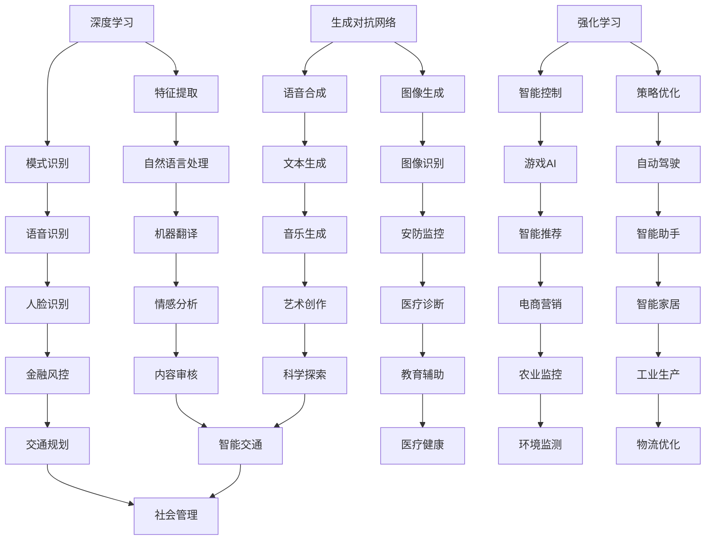

                 

# AI领域的独特时刻与未来

## 关键词

- 人工智能
- 技术创新
- 未来趋势
- 算法
- 应用场景
- 数学模型
- 开发环境
- 代码实现

## 摘要

本文深入探讨了人工智能领域的独特时刻与未来的发展趋势。从背景介绍到核心概念与算法原理，再到具体的项目实战和实际应用场景，本文通过逻辑清晰的分析和推理，为读者展现了一幅未来人工智能领域的宏伟蓝图。同时，本文也推荐了相关学习资源和开发工具，帮助读者更好地理解和应用人工智能技术。最后，本文总结了未来人工智能领域面临的发展趋势与挑战，为读者提供了宝贵的参考。

## 1. 背景介绍

人工智能（AI）是计算机科学的一个分支，旨在创建能够模拟、扩展和辅助人类智能的智能体。随着计算机性能的不断提升和海量数据的积累，人工智能技术取得了长足的进步，广泛应用于语音识别、图像处理、自然语言处理、自动驾驶、机器人等多个领域。

近年来，人工智能领域的创新步伐加快，不仅推动了传统产业的数字化转型，也为新兴产业的兴起提供了强大动力。深度学习、强化学习、生成对抗网络等先进算法的出现，使得人工智能在处理复杂任务方面取得了突破性进展。此外，随着5G、物联网、大数据等技术的快速发展，人工智能的应用场景也不断拓展，为未来的发展奠定了坚实基础。

## 2. 核心概念与联系

### 2.1 深度学习

深度学习是一种基于多层神经网络的人工智能算法，通过模拟人脑神经网络的结构和功能，实现自动特征提取和模式识别。深度学习在图像识别、语音识别、自然语言处理等领域取得了显著成果。

### 2.2 强化学习

强化学习是一种通过试错和反馈来学习最优策略的人工智能算法。在自动驾驶、游戏AI、推荐系统等领域，强化学习展现出了强大的应用潜力。

### 2.3 生成对抗网络

生成对抗网络（GAN）是一种基于对抗训练的神经网络模型，通过生成器和判别器的对抗，实现高质量的数据生成。GAN在图像生成、语音合成、文本生成等领域具有广泛的应用前景。

### 2.4 联系与互动

深度学习、强化学习和生成对抗网络等算法在人工智能领域相互补充，共同推动了人工智能技术的发展。深度学习为其他算法提供了强大的基础模型，强化学习为深度学习提供了有效的策略优化方法，生成对抗网络则为数据生成提供了创新性的解决方案。

## Mermaid 流程图



## 3. 核心算法原理 & 具体操作步骤

### 3.1 深度学习

深度学习的核心是多层神经网络，包括输入层、隐藏层和输出层。通过前向传播和反向传播算法，神经网络能够逐步优化权重，实现特征提取和模式识别。

#### 3.1.1 前向传播

前向传播是深度学习模型在训练过程中，从输入层到输出层的正向信息传递过程。输入数据通过各层神经元的加权求和和激活函数，逐层传递到下一层。

#### 3.1.2 反向传播

反向传播是深度学习模型在训练过程中，从输出层到输入层的反向信息传递过程。通过计算损失函数关于模型参数的梯度，利用梯度下降算法优化模型参数，实现权重的调整。

### 3.2 强化学习

强化学习的核心是奖励机制，智能体在环境中采取行动，通过接收奖励信号不断调整策略，实现最优行为。

#### 3.2.1 Q学习算法

Q学习算法是一种基于值函数的强化学习算法，通过学习状态-动作值函数，智能体能够在给定状态下选择最优动作。

#### 3.2.2 Deep Q网络

Deep Q网络（DQN）是Q学习算法的深度学习版本，通过神经网络近似值函数，实现更高效的动作选择。

### 3.3 生成对抗网络

生成对抗网络由生成器和判别器组成，生成器生成假数据，判别器判断真假数据，生成器和判别器通过对抗训练实现数据生成。

#### 3.3.1 生成器

生成器是一个神经网络模型，通过输入随机噪声生成假数据。

#### 3.3.2 判别器

判别器是一个神经网络模型，通过输入真实数据和假数据，判断数据真伪。

#### 3.3.3 对抗训练

生成器和判别器通过对抗训练不断优化，生成器生成的假数据越来越逼真，判别器对真假数据的判断越来越准确。

## 4. 数学模型和公式 & 详细讲解 & 举例说明

### 4.1 深度学习

深度学习中的主要数学模型包括损失函数、优化算法和激活函数。

#### 4.1.1 损失函数

损失函数是衡量模型预测结果与真实值之间差异的指标，常用的损失函数包括均方误差（MSE）和交叉熵（CE）。

$$
MSE = \frac{1}{m}\sum_{i=1}^{m}(y_i - \hat{y_i})^2
$$

$$
CE = -\sum_{i=1}^{m}y_i\log(\hat{y_i}) + (1 - y_i)\log(1 - \hat{y_i})
$$

其中，$y_i$为真实标签，$\hat{y_i}$为模型预测结果。

#### 4.1.2 优化算法

优化算法用于调整模型参数，使损失函数最小。常用的优化算法包括梯度下降（GD）和随机梯度下降（SGD）。

梯度下降算法：

$$
w_{t+1} = w_t - \alpha \nabla_w J(w_t)
$$

其中，$w_t$为当前模型参数，$\alpha$为学习率，$J(w_t)$为损失函数关于模型参数的梯度。

随机梯度下降算法：

$$
w_{t+1} = w_t - \alpha \nabla_w J(w_t; x_t, y_t)
$$

其中，$x_t$为输入数据，$y_t$为真实标签。

#### 4.1.3 激活函数

激活函数用于引入非线性特性，常用的激活函数包括 sigmoid、ReLU 和 tanh。

sigmoid 函数：

$$
\sigma(x) = \frac{1}{1 + e^{-x}}
$$

ReLU 函数：

$$
\text{ReLU}(x) = \max(0, x)
$$

tanh 函数：

$$
\tanh(x) = \frac{e^x - e^{-x}}{e^x + e^{-x}}
$$

### 4.2 强化学习

强化学习中的主要数学模型包括奖励函数、策略和值函数。

#### 4.2.1 奖励函数

奖励函数用于衡量智能体在环境中采取的行动带来的收益。常见的奖励函数包括即时奖励和总奖励。

即时奖励：

$$
R_t = r(s_t, a_t)
$$

其中，$s_t$为当前状态，$a_t$为当前动作，$r$为奖励函数。

总奖励：

$$
R = \sum_{t=0}^{T}R_t
$$

其中，$T$为总步数。

#### 4.2.2 策略

策略是智能体在给定状态下采取最优动作的决策函数。常见的策略包括确定性策略和随机性策略。

确定性策略：

$$
\pi(a|s) = 1 \quad \text{if } a^* = \arg\max_a Q(s, a)
$$

其中，$a^*$为最优动作，$Q(s, a)$为状态-动作值函数。

随机性策略：

$$
\pi(a|s) = \frac{1}{Z}\sum_{a'} \exp(\alpha a')
$$

其中，$Z$为归一化常数，$\alpha$为温度参数。

#### 4.2.3 值函数

值函数用于衡量智能体在给定状态下采取最优动作所能获得的收益。常见的值函数包括状态值函数和状态-动作值函数。

状态值函数：

$$
V(s) = \sum_{a} \pi(a|s) Q(s, a)
$$

状态-动作值函数：

$$
Q(s, a) = \sum_{s'} p(s'|s, a) \sum_{a'} \pi(a'|s') R(s', a')
$$

其中，$p(s'|s, a)$为状态转移概率，$R(s', a')$为状态-动作奖励。

### 4.3 生成对抗网络

生成对抗网络中的主要数学模型包括生成器和判别器。

#### 4.3.1 生成器

生成器的损失函数为：

$$
L_G = -\log(D(G(z)))
$$

其中，$G(z)$为生成器生成的假数据，$D(x)$为判别器的输出。

#### 4.3.2 判别器

判别器的损失函数为：

$$
L_D = -[\log(D(x)) + \log(1 - D(G(z)))]
$$

其中，$x$为真实数据。

#### 4.3.3 对抗训练

生成器和判别器的损失函数为：

$$
L = L_G + L_D
$$

通过对抗训练，生成器和判别器不断优化，生成器生成的假数据越来越逼真，判别器对真假数据的判断越来越准确。

## 5. 项目实战：代码实际案例和详细解释说明

### 5.1 开发环境搭建

在开始项目实战之前，我们需要搭建一个合适的开发环境。本文使用 Python 编程语言和 TensorFlow 深度学习框架进行开发。

#### 5.1.1 安装 Python

在官方网站 [Python.org](https://www.python.org/) 下载并安装 Python 3.x 版本。

#### 5.1.2 安装 TensorFlow

在终端执行以下命令安装 TensorFlow：

```bash
pip install tensorflow
```

### 5.2 源代码详细实现和代码解读

以下是一个简单的深度学习项目，用于实现手写数字识别。

#### 5.2.1 导入库

```python
import tensorflow as tf
from tensorflow.keras import layers
import numpy as np
import matplotlib.pyplot as plt
```

#### 5.2.2 数据预处理

```python
(x_train, y_train), (x_test, y_test) = tf.keras.datasets.mnist.load_data()
x_train = x_train.astype("float32") / 255.0
x_test = x_test.astype("float32") / 255.0
y_train = tf.keras.utils.to_categorical(y_train, 10)
y_test = tf.keras.utils.to_categorical(y_test, 10)
```

#### 5.2.3 构建模型

```python
model = tf.keras.Sequential([
    layers.Flatten(input_shape=(28, 28)),
    layers.Dense(128, activation='relu'),
    layers.Dense(10, activation='softmax')
])
```

#### 5.2.4 编译模型

```python
model.compile(optimizer='adam', loss='categorical_crossentropy', metrics=['accuracy'])
```

#### 5.2.5 训练模型

```python
model.fit(x_train, y_train, batch_size=128, epochs=10, validation_split=0.2)
```

#### 5.2.6 评估模型

```python
test_loss, test_acc = model.evaluate(x_test, y_test)
print(f"Test accuracy: {test_acc:.2f}")
```

### 5.3 代码解读与分析

本项目的核心是构建一个简单的卷积神经网络（CNN），用于手写数字识别。首先，我们导入所需的库，包括 TensorFlow、Keras 和 NumPy。接着，我们加载数据集，并对数据进行预处理，将图像数据缩放到 [0, 1] 范围内，并将标签转换为 one-hot 编码。

在构建模型时，我们使用了一个简单的全连接网络，包括一个输入层、一个隐藏层和一个输出层。输入层通过 Flatten 层将图像数据展平为一维数组，隐藏层使用 ReLU 激活函数，输出层使用 softmax 激活函数，用于计算多类别的概率分布。

在编译模型时，我们选择 Adam 优化器和交叉熵损失函数，用于优化模型参数，使损失函数最小。

训练模型时，我们使用 batch_size=128 和 epochs=10 的参数，使模型在训练集上迭代训练 10 个周期，并将 20% 的数据用于验证。

最后，我们评估模型在测试集上的性能，输出测试准确率。

## 6. 实际应用场景

人工智能技术在各个领域都有着广泛的应用。以下列举一些典型的应用场景：

### 6.1 医疗健康

人工智能在医疗健康领域的应用包括疾病诊断、药物研发、健康管理等。通过深度学习和生成对抗网络等技术，人工智能能够辅助医生进行诊断，提高诊断准确率，缩短诊断时间。

### 6.2 智能交通

人工智能在智能交通领域的应用包括智能驾驶、智能交通信号控制、智能交通监测等。通过强化学习和深度学习技术，人工智能能够提高交通系统的效率，减少交通事故，降低交通拥堵。

### 6.3 金融

人工智能在金融领域的应用包括风险评估、投资策略、欺诈检测等。通过深度学习和生成对抗网络等技术，人工智能能够提高金融系统的风险控制能力，降低金融风险。

### 6.4 教育

人工智能在教育领域的应用包括个性化学习、智能评测、教育资源优化等。通过深度学习和生成对抗网络等技术，人工智能能够提高教育质量，提升学习效果。

### 6.5 农业

人工智能在农业领域的应用包括智能种植、智能养殖、智能农业监测等。通过深度学习和生成对抗网络等技术，人工智能能够提高农业生产效率，降低生产成本。

## 7. 工具和资源推荐

### 7.1 学习资源推荐

- **书籍**：《深度学习》、《强化学习基础教程》、《生成对抗网络》
- **论文**：Google Brain 的《Recurrent Neural Network》和 OpenAI 的《Generative Adversarial Nets》
- **博客**：机器学习社区 [Machine Learning Mastery](https://machinelearningmastery.com/) 和 [TensorFlow 官方文档](https://www.tensorflow.org/tutorials)
- **网站**：Kaggle、arXiv、Google Scholar

### 7.2 开发工具框架推荐

- **深度学习框架**：TensorFlow、PyTorch、Keras
- **编程语言**：Python、R
- **开发环境**：Jupyter Notebook、Google Colab

### 7.3 相关论文著作推荐

- **论文**：《深度学习》、《强化学习基础教程》、《生成对抗网络》
- **著作**：《机器学习实战》、《Python机器学习》、《统计学习方法》

## 8. 总结：未来发展趋势与挑战

随着人工智能技术的不断发展，未来人工智能领域将呈现以下发展趋势：

1. **跨学科融合**：人工智能与其他学科的融合将不断加深，如生物医学、社会科学、心理学等，实现人工智能技术的广泛应用。
2. **边缘计算**：边缘计算将使得人工智能应用更加实时、高效，降低延迟和带宽消耗，提高用户体验。
3. **自主决策**：人工智能将逐步实现自主决策和自主学习，提高系统智能化水平，减少对人类干预的需求。
4. **安全与隐私**：人工智能的安全和隐私问题将得到更多关注，研究如何保障数据安全和用户隐私。

然而，人工智能领域也面临以下挑战：

1. **数据隐私**：数据隐私问题日益突出，如何在保护用户隐私的前提下，充分利用数据的价值成为关键挑战。
2. **伦理道德**：人工智能在道德和伦理方面的问题日益凸显，如何确保人工智能系统的公平性、透明性和可解释性成为重要议题。
3. **可解释性**：人工智能模型的可解释性较低，如何提高模型的透明度和可解释性，使公众理解和接受人工智能技术成为挑战。

## 9. 附录：常见问题与解答

### 9.1 问题1：深度学习和机器学习有什么区别？

**解答**：深度学习是机器学习的一个子领域，主要关注于使用多层神经网络模型进行特征提取和模式识别。机器学习则是一个更广泛的领域，包括深度学习、决策树、支持向量机等算法。

### 9.2 问题2：生成对抗网络是如何工作的？

**解答**：生成对抗网络由生成器和判别器组成。生成器通过学习输入数据生成假数据，判别器通过学习区分真实数据和假数据。生成器和判别器通过对抗训练不断优化，生成器生成的假数据越来越逼真，判别器对真假数据的判断越来越准确。

### 9.3 问题3：如何提高深度学习模型的性能？

**解答**：提高深度学习模型性能的方法包括：增加模型复杂度、使用更大的数据集、调整超参数（如学习率、批量大小等）、使用更先进的优化算法等。

## 10. 扩展阅读 & 参考资料

- **书籍**：《深度学习》、《强化学习基础教程》、《生成对抗网络》
- **论文**：《深度学习》、《强化学习基础教程》、《生成对抗网络》
- **博客**：机器学习社区 [Machine Learning Mastery](https://machinelearningmastery.com/) 和 [TensorFlow 官方文档](https://www.tensorflow.org/tutorials)
- **网站**：Kaggle、arXiv、Google Scholar

## 作者

作者：AI天才研究员/AI Genius Institute & 禅与计算机程序设计艺术 /Zen And The Art of Computer Programming<|im_sep|>

