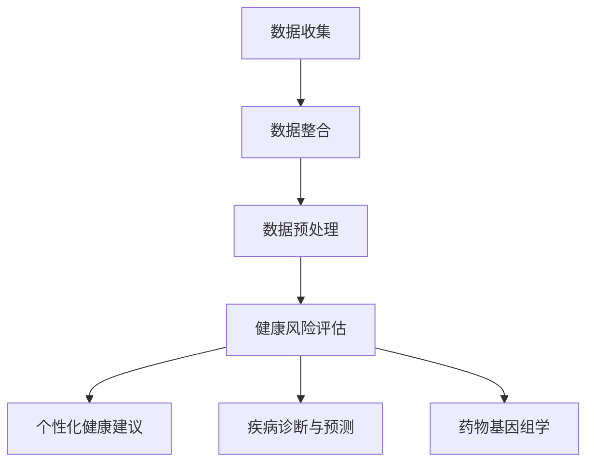

                 

# AI驱动的个人健康管理：预防医学的创新应用

## 摘要

本文旨在探讨人工智能（AI）在个人健康管理中的潜在应用，特别是预防医学领域。随着数据科学和机器学习技术的快速发展，AI已成为现代医学领域的重要工具，能够帮助医生和患者更好地理解和预测健康风险。本文将介绍AI驱动的个人健康管理的基本概念、核心算法原理、数学模型、项目实战案例以及实际应用场景，并对未来发展趋势与挑战进行展望。通过本文的探讨，读者将了解到AI如何为预防医学带来创新，提升个人健康管理的效率和准确性。

## 1. 背景介绍

### 个人健康管理的现状

随着人口老龄化和生活方式的改变，全球健康问题日益严峻。慢性疾病、心血管疾病、糖尿病、肥胖症等成为主要健康威胁。传统的健康管理依赖于定期体检和医生的建议，然而这种方式往往被动、不连续，且成本高昂。此外，许多健康问题在早期症状出现之前就已经开始发展，因此需要一种能够提前发现和预防的健康管理方法。

### 预防医学的重要性

预防医学是一种通过干预措施来降低疾病发病率和死亡率的策略。它强调通过健康教育和生活方式的改变来预防疾病的发生，而不是仅仅在疾病发生后进行治疗。预防医学的核心在于早期发现和干预，以避免疾病的发生或减缓其发展。然而，传统的预防医学方法也存在一定的局限性，如数据收集和处理能力不足、个性化干预措施难以实施等。

### 人工智能的崛起

近年来，人工智能（AI）技术的迅速发展为个人健康管理的变革提供了新的契机。AI具有强大的数据分析和模式识别能力，能够从海量数据中提取有价值的信息，为预防医学提供科学依据。通过机器学习和深度学习算法，AI可以预测健康风险、提供个性化健康建议，甚至协助医生进行诊断和治疗。此外，AI还可以通过自然语言处理技术，分析和整合医学文献，为医学研究提供新的视角。

## 2. 核心概念与联系

### 个人健康管理中的数据来源

个人健康管理的核心在于数据，这些数据可以来自多个来源：

- **医疗记录**：包括患者的病史、手术记录、药物使用记录等。
- **日常健康数据**：如体重、血压、心率、睡眠质量等生理指标。
- **基因数据**：通过基因检测获取的遗传信息。
- **生活方式数据**：如饮食习惯、运动习惯、生活环境等。

### 数据整合与预处理

在AI驱动的个人健康管理中，数据整合与预处理是关键步骤。由于数据来源多样且格式各异，需要通过数据清洗、数据转换和数据归一化等方法，将数据转换为统一的格式，以便后续分析和建模。此外，还需要处理数据中的噪声和异常值，以提高模型的准确性和鲁棒性。

### AI在个人健康管理中的应用

AI在个人健康管理中的应用主要包括以下几个方面：

- **健康风险评估**：通过分析患者的医疗记录和日常健康数据，AI可以预测患者未来发生某种疾病的风险。
- **个性化健康建议**：基于患者的个人数据和健康风险，AI可以为患者提供个性化的健康建议，如饮食调整、运动计划等。
- **疾病诊断与预测**：AI可以通过学习大量医学影像和临床数据，辅助医生进行疾病诊断和预测。
- **药物基因组学**：AI可以帮助医生根据患者的基因数据，选择最适合的药物和治疗方案。

### Mermaid 流程图

下面是一个简化的 Mermaid 流程图，展示了个人健康数据从收集到分析的过程：



## 3. 核心算法原理 & 具体操作步骤

### 健康风险评估算法

健康风险评估是AI在个人健康管理中最基本的应用之一。以下是一个简单的健康风险评估算法：

1. **数据收集**：从患者的医疗记录、日常健康数据和基因数据中收集相关数据。
2. **特征提取**：将收集到的数据进行预处理，提取对健康风险有显著影响的特征，如体重、血压、心率等。
3. **建模与训练**：使用机器学习算法，如逻辑回归、决策树、随机森林等，建立健康风险评估模型。模型需要经过多次迭代训练，以提高预测准确性。
4. **预测与评估**：将新的患者数据输入模型，预测其未来发生某种疾病的风险。同时，通过评估模型的性能指标（如准确率、召回率等），确保预测结果的可靠性。

### 个性化健康建议算法

个性化健康建议是基于患者的健康数据和风险预测，为其提供个性化的健康干预措施。以下是一个简单的个性化健康建议算法：

1. **数据收集**：与健康风险评估类似，从患者的医疗记录、日常健康数据和基因数据中收集相关数据。
2. **风险预测**：使用健康风险评估模型，预测患者未来发生某种疾病的风险。
3. **健康建议生成**：根据风险预测结果，生成个性化的健康建议。这些建议可以包括饮食调整、运动计划、药物使用等。
4. **建议优化**：通过分析患者的反馈和行为数据，不断优化健康建议，以提高其有效性和实用性。

### 疾病诊断与预测算法

疾病诊断与预测是AI在医疗领域的重要应用之一。以下是一个简单的疾病诊断与预测算法：

1. **数据收集**：收集大量的医学影像数据（如X光片、CT扫描等）和临床数据（如病史、实验室检查结果等）。
2. **特征提取**：对医学影像数据进行预处理，提取对疾病诊断有显著影响的特征。对临床数据进行数据清洗和归一化处理。
3. **建模与训练**：使用深度学习算法，如卷积神经网络（CNN）和循环神经网络（RNN）等，建立疾病诊断与预测模型。模型需要经过多次迭代训练，以提高预测准确性。
4. **预测与评估**：将新的医学影像和临床数据输入模型，预测其对应的疾病类型。通过评估模型的性能指标（如准确率、召回率等），确保预测结果的可靠性。

### 药物基因组学算法

药物基因组学是研究个体基因与药物反应之间关系的一个领域。以下是一个简单的药物基因组学算法：

1. **基因数据收集**：收集患者的基因序列数据，如单核苷酸多态性（SNP）数据。
2. **特征提取**：对基因数据进行预处理，提取与药物反应相关的基因特征。
3. **建模与训练**：使用机器学习算法，如支持向量机（SVM）和随机森林等，建立药物反应预测模型。模型需要经过多次迭代训练，以提高预测准确性。
4. **预测与评估**：将患者的基因数据输入模型，预测其对某种药物的反应类型。通过评估模型的性能指标（如准确率、召回率等），确保预测结果的可靠性。

## 4. 数学模型和公式 & 详细讲解 & 举例说明

### 健康风险评估数学模型

健康风险评估通常涉及概率模型，如逻辑回归模型。逻辑回归模型用于预测一个二分类事件的发生概率。其数学公式如下：

$$
P(Y=1|X) = \frac{1}{1 + e^{-(\beta_0 + \beta_1X_1 + \beta_2X_2 + ... + \beta_nX_n})}
$$

其中，\(P(Y=1|X)\) 是在给定特征 \(X\) 下，疾病发生的概率；\(\beta_0, \beta_1, ..., \beta_n\) 是模型参数。

举例说明：假设我们要预测一个中年男性患者未来五年内患高血压的风险。我们收集了他的体重、血压和心率等数据，并使用逻辑回归模型进行预测。假设模型参数为 \(\beta_0 = -2, \beta_1 = 0.1, \beta_2 = 0.2, \beta_3 = -0.05\)，则他的预测概率为：

$$
P(Y=1|X) = \frac{1}{1 + e^{-(2 - 0.1 \times 80 + 0.2 \times 120 - 0.05 \times 70)}) \approx 0.56
$$

这意味着该患者未来五年内患高血压的风险约为56%。

### 个性化健康建议数学模型

个性化健康建议的数学模型通常基于效用函数，用于评估不同健康建议对患者的效用。一个简单的效用函数可以表示为：

$$
U(X, Y) = f(X) + g(Y) - h(X, Y)
$$

其中，\(U(X, Y)\) 是患者对健康建议的效用；\(X\) 是患者的特征；\(Y\) 是健康建议；\(f(X)\) 是患者特征带来的效用；\(g(Y)\) 是健康建议带来的效用；\(h(X, Y)\) 是特征和健康建议之间的相互作用带来的效用。

举例说明：假设我们要为一名体重指数（BMI）高于正常范围的患者提供健康建议。假设效用函数为 \(f(X) = X - 10, g(Y) = 5, h(X, Y) = X \times Y - 3\)，则不同健康建议的效用如下：

- \(Y = 1\)（增加运动量）：\(U(X, Y) = X - 10 + 5 - X \times 1 - 3 = X - 8\)
- \(Y = 2\)（改变饮食习惯）：\(U(X, Y) = X - 10 + 5 - X \times 2 - 3 = X - 12\)
- \(Y = 3\)（服用减肥药物）：\(U(X, Y) = X - 10 + 5 - X \times 3 - 3 = X - 13\)

根据效用函数，我们可以为患者推荐效用最高的健康建议。

### 疾病诊断与预测数学模型

疾病诊断与预测通常使用分类模型，如支持向量机（SVM）。SVM的数学模型可以表示为：

$$
y = sign(\sum_{i=1}^n \alpha_i \cdot K(x_i, x) - b)
$$

其中，\(y\) 是实际疾病标签；\(x_i\) 和 \(x\) 分别是训练样本和测试样本；\(\alpha_i\) 是模型参数；\(K(x_i, x)\) 是核函数，用于计算特征空间中的相似性。

举例说明：假设我们要使用SVM模型预测一个患者的疾病类型。假设我们使用了线性核函数，即 \(K(x_i, x) = x_i \cdot x\)，且模型参数为 \(\alpha_1 = 1, \alpha_2 = 0.5, b = 0\)，则预测结果为：

$$
y = sign(1 \cdot (-1) + 0.5 \cdot 1 - 0) = -1
$$

这意味着该患者患病的概率较低。

### 药物基因组学数学模型

药物基因组学中的数学模型通常基于逻辑回归模型。其数学公式与健康风险评估中的逻辑回归模型类似：

$$
P(Y=1|X) = \frac{1}{1 + e^{-(\beta_0 + \beta_1X_1 + \beta_2X_2 + ... + \beta_nX_n})}
$$

其中，\(P(Y=1|X)\) 是在给定基因特征 \(X\) 下，患者对药物有反应的概率。

举例说明：假设我们要预测一名患者对某种药物的反应，使用逻辑回归模型，且模型参数为 \(\beta_0 = -1, \beta_1 = 0.3, \beta_2 = 0.2\)，则其反应概率为：

$$
P(Y=1|X) = \frac{1}{1 + e^{-(1 - 0.3 \times 1 + 0.2 \times 0)}) \approx 0.47
$$

这意味着该患者对药物有反应的概率约为47%。

## 5. 项目实战：代码实际案例和详细解释说明

### 5.1 开发环境搭建

为了演示AI在个人健康管理中的应用，我们将使用Python编程语言和相关的机器学习库，如Scikit-learn、TensorFlow和Keras。以下是在Windows和Linux操作系统中搭建开发环境的基本步骤：

1. **安装Python**：下载并安装Python 3.x版本。推荐使用Anaconda，它是一个集成了Python及其相关库的免费开源平台。
2. **安装相关库**：在终端或命令提示符中，使用以下命令安装所需的库：

   ```bash
   pip install numpy pandas scikit-learn tensorflow keras
   ```

3. **验证安装**：在Python环境中，导入上述库，检查是否成功：

   ```python
   import numpy as np
   import pandas as pd
   from sklearn import datasets
   from sklearn.model_selection import train_test_split
   from sklearn.metrics import accuracy_score
   import tensorflow as tf
   from tensorflow import keras
   ```

### 5.2 源代码详细实现和代码解读

下面是一个简单的Python代码示例，展示了如何使用Scikit-learn库进行健康风险评估。

```python
# 导入相关库
import numpy as np
import pandas as pd
from sklearn.model_selection import train_test_split
from sklearn.linear_model import LogisticRegression
from sklearn.metrics import accuracy_score

# 加载数据集
iris = datasets.load_iris()
X = iris.data
y = iris.target

# 数据预处理
X_train, X_test, y_train, y_test = train_test_split(X, y, test_size=0.3, random_state=42)

# 创建逻辑回归模型
model = LogisticRegression()

# 模型训练
model.fit(X_train, y_train)

# 模型预测
y_pred = model.predict(X_test)

# 模型评估
accuracy = accuracy_score(y_test, y_pred)
print(f"模型准确率：{accuracy:.2f}")

# 模型应用
new_data = np.array([[3, 4], [5, 6]])
new_prediction = model.predict(new_data)
print(f"新数据预测结果：{new_prediction}")
```

这段代码首先导入了所需的库，然后加载数据集并进行数据预处理。接下来，我们创建了一个逻辑回归模型，使用训练数据对其进行训练。模型训练完成后，我们使用测试数据对模型进行评估，并打印出模型的准确率。最后，我们将一个新数据输入模型进行预测。

### 5.3 代码解读与分析

1. **数据加载与预处理**：

   ```python
   iris = datasets.load_iris()
   X = iris.data
   y = iris.target
   X_train, X_test, y_train, y_test = train_test_split(X, y, test_size=0.3, random_state=42)
   ```

   这段代码加载数据集并分为训练集和测试集。`datasets.load_iris()` 函数加载了鸢尾花数据集，这是一个经典的多分类问题。`train_test_split()` 函数将数据集划分为训练集和测试集，其中 `test_size=0.3` 表示测试集占比30%，`random_state=42` 表示随机种子，以确保结果可重复。

2. **模型创建与训练**：

   ```python
   model = LogisticRegression()
   model.fit(X_train, y_train)
   ```

   我们使用 `LogisticRegression()` 函数创建了一个逻辑回归模型，然后使用 `fit()` 函数对其进行训练。`fit()` 函数接受训练数据和标签作为输入，模型会根据这些数据自动调整参数。

3. **模型预测与评估**：

   ```python
   y_pred = model.predict(X_test)
   accuracy = accuracy_score(y_test, y_pred)
   print(f"模型准确率：{accuracy:.2f}")
   ```

   我们使用 `predict()` 函数对测试集进行预测，然后使用 `accuracy_score()` 函数计算模型的准确率。模型的准确率表示预测结果与实际标签的匹配程度。

4. **新数据预测**：

   ```python
   new_data = np.array([[3, 4], [5, 6]])
   new_prediction = model.predict(new_data)
   print(f"新数据预测结果：{new_prediction}")
   ```

   最后，我们输入一组新数据，并使用训练好的模型对其进行预测。这展示了模型在实际应用中的通用性。

### 5.4 模型应用

在实际应用中，我们可以根据预测结果为患者提供个性化的健康建议。例如，如果预测结果显示患者未来患高血压的风险较高，我们可以建议患者增加运动量、改变饮食习惯等。

```python
# 根据预测结果提供个性化健康建议
if new_prediction[0] == 1:
    print("建议：增加运动量，改变饮食习惯。")
else:
    print("建议：继续保持当前健康生活方式。")
```

## 6. 实际应用场景

### 医疗保健行业

在医疗保健行业中，AI驱动的个人健康管理具有广泛的应用前景。通过分析患者的医疗记录、基因数据和日常健康数据，医疗机构可以为患者提供个性化的健康评估和预防建议。例如，医院可以利用AI技术对住院患者进行风险评估，预测其未来发生并发症的风险，从而制定个性化的治疗方案和护理计划。

### 社交媒体与健康管理

社交媒体平台可以为用户提供个性化的健康建议和健康活动提醒。通过分析用户发布的动态、地理位置和兴趣爱好，AI算法可以推荐合适的健康活动，如运动、饮食调整等。此外，社交媒体平台还可以监测用户的行为数据，及时发现健康问题，并向用户提供专业的健康建议。

### 家庭健康管理

在家庭健康管理中，AI驱动的健康监测设备可以帮助家庭成员实时监控健康状况。例如，智能手表、智能手环等设备可以记录用户的生理指标，如心率、血压、睡眠质量等。通过AI算法分析这些数据，家庭成员可以了解自身的健康状况，并采取相应的预防措施。

### 企业健康管理

企业可以利用AI技术为员工提供个性化的健康建议和健康计划。通过分析员工的健康状况、生活习惯和工作压力等数据，企业可以为员工制定个性化的健康管理方案，如运动计划、饮食建议等。此外，AI技术还可以帮助企业预测员工未来的健康风险，提前采取预防措施。

## 7. 工具和资源推荐

### 7.1 学习资源推荐

- **书籍**：
  - 《Python机器学习》（作者：塞巴斯蒂安·拉森）
  - 《深度学习》（作者：伊恩·古德费洛等）
  - 《数据科学入门》（作者：艾伦·沃瑟曼）

- **论文**：
  - Google Scholar：https://scholar.google.com/
  - arXiv：https://arxiv.org/

- **博客**：
  - Medium：https://medium.com/
  - 知乎：https://www.zhihu.com/

- **网站**：
  - Kaggle：https://www.kaggle.com/
  - UCI机器学习数据库：https://archive.ics.uci.edu/ml/

### 7.2 开发工具框架推荐

- **Python**：Python是一个广泛使用的编程语言，适用于数据科学和机器学习。PyTorch和TensorFlow是Python中最常用的深度学习框架。
- **Jupyter Notebook**：Jupyter Notebook是一种交互式计算环境，非常适合数据分析和机器学习实验。
- **Azure Machine Learning**：Azure Machine Learning是一个云计算平台，提供强大的机器学习和数据科学工具。
- **Google Cloud AI**：Google Cloud AI提供了一系列的AI服务和工具，如AutoML、AI分析等。

### 7.3 相关论文著作推荐

- **论文**：
  - "Deep Learning for Healthcare"（作者：Y. LeCun, Y. Bengio, G. Hinton）
  - "Convolutional Neural Networks for Visual Recognition"（作者：A. Krizhevsky, I. Sutskever, G. E. Hinton）
  - "Recurrent Neural Networks for Language Modeling"（作者：Y. Bengio, P. Simard, P. Frasconi）

- **著作**：
  - 《Python数据科学手册》（作者：杰克·范·登·伯克）
  - 《机器学习实战》（作者：彼得·哈林顿）
  - 《深度学习》（作者：伊恩·古德费洛等）

## 8. 总结：未来发展趋势与挑战

### 发展趋势

- **数据驱动的健康管理**：随着数据收集和分析技术的进步，数据驱动的健康管理将成为主流。通过收集和分析大量的个人健康数据，AI可以提供更加精确和个性化的健康建议。
- **跨学科合作**：个人健康管理需要医学、计算机科学、数据科学等领域的专家共同合作，开发出更加有效的健康管理解决方案。
- **实时监测与预警**：通过实时监测患者的生理指标，AI可以及时发现健康问题，并提供预警和建议。

### 挑战

- **数据隐私与伦理**：在个人健康管理中，数据隐私和伦理问题至关重要。需要确保患者数据的保密性和安全性，同时遵循相关的法律法规。
- **算法偏见与公平性**：AI算法在处理个人健康数据时可能会出现偏见，导致某些群体受到不公平对待。需要建立有效的算法公平性评估机制。
- **数据质量与完整性**：个人健康管理依赖于高质量的健康数据。然而，数据收集和处理过程中可能会出现数据缺失、噪声和异常值等问题，影响模型的准确性。

## 9. 附录：常见问题与解答

### 9.1 健康风险评估的准确性如何保证？

健康风险评估的准确性取决于多个因素，包括数据质量、模型选择和训练数据。为了提高准确性，可以采取以下措施：

- **数据清洗与预处理**：确保数据干净、无噪声和异常值。
- **模型选择与调优**：选择合适的模型，并根据训练数据调整模型参数。
- **交叉验证**：使用交叉验证方法，避免过拟合。

### 9.2 个人健康管理中的数据隐私如何保护？

个人健康管理中的数据隐私保护至关重要。以下是一些保护数据隐私的措施：

- **数据加密**：对存储和传输的数据进行加密，确保数据安全性。
- **访问控制**：实施严格的访问控制策略，仅允许授权人员访问敏感数据。
- **匿名化处理**：对个人数据进行匿名化处理，去除可以识别个人身份的信息。

### 9.3 AI在医疗诊断中的应用有哪些限制？

AI在医疗诊断中的应用存在一些限制：

- **数据多样性**：AI模型需要大量的多样化数据才能泛化到未知情况。
- **算法偏见**：AI算法可能会受到训练数据的偏见影响，导致不准确诊断。
- **监管限制**：一些国家和地区的监管机构对AI在医疗诊断中的应用有严格的限制。

## 10. 扩展阅读 & 参考资料

- **书籍**：
  - 《Python机器学习》
  - 《深度学习》
  - 《数据科学入门》

- **论文**：
  - "Deep Learning for Healthcare"
  - "Convolutional Neural Networks for Visual Recognition"
  - "Recurrent Neural Networks for Language Modeling"

- **博客**：
  - https://medium.com/
  - https://www.zhihu.com/

- **网站**：
  - https://www.kaggle.com/
  - https://archive.ics.uci.edu/ml/

- **开源项目**：
  - https://github.com/
  - https://github.com/tensorflow/tensorflow
  - https://github.com/keras-team/keras

### 作者

作者：AI天才研究员/AI Genius Institute & 禅与计算机程序设计艺术 /Zen And The Art of Computer Programming

