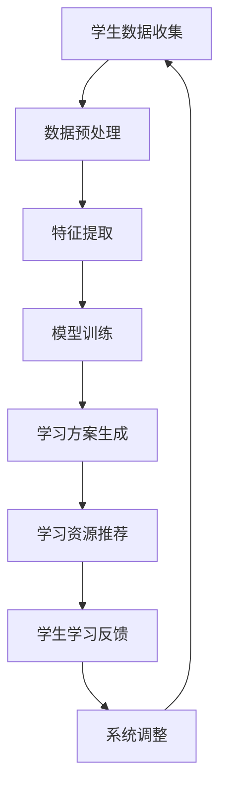

                 

# AI驱动的个性化学习：适应每个学生的需求

> **关键词：** AI，个性化学习，教育技术，自适应系统，学生需求

> **摘要：** 本文深入探讨了AI在教育领域的应用，特别是AI驱动的个性化学习系统。通过分析其核心概念、算法原理、数学模型、实际应用案例以及未来发展趋势，本文揭示了如何利用AI技术更好地满足每个学生的学习需求。

## 1. 背景介绍

在传统教育模式中，教学方法和课程内容往往是统一制定的，难以适应每个学生的独特需求。然而，随着人工智能（AI）技术的发展，个性化学习逐渐成为可能。AI驱动的个性化学习系统能够根据学生的学习习惯、兴趣和能力，提供定制化的学习方案，从而提高学习效果。

近年来，AI在教育领域的应用取得了显著进展。自适应学习平台、智能辅导系统、在线教育平台等都在利用AI技术为学生提供更加个性化的学习体验。例如，Khan Academy的智能辅导系统通过分析学生的学习行为，提供个性化的学习路径和资源推荐。

然而，AI驱动的个性化学习仍面临许多挑战，如数据隐私、算法公平性、技术可行性等。本文旨在探讨这些挑战，并提出相应的解决方案，以推动AI在教育领域的广泛应用。

## 2. 核心概念与联系

### 2.1. 个性化学习

个性化学习是指根据学生的兴趣、能力和学习风格，制定个性化的教学方案和学习资源。个性化学习不仅关注知识传授，更关注学生的学习体验和成长。

### 2.2. 自适应学习系统

自适应学习系统是一种利用AI技术，根据学生的学习行为和反馈，动态调整教学方案和学习资源的系统。自适应学习系统能够识别学生的学习模式，预测其学习需求，并提供相应的支持。

### 2.3. AI驱动的个性化学习

AI驱动的个性化学习是指利用人工智能技术，如机器学习、自然语言处理、数据挖掘等，为学生提供个性化的学习方案。AI驱动的个性化学习系统能够通过分析大量的学生数据，发现潜在的学习模式，为学生量身定制学习计划。

### 2.4. Mermaid流程图

以下是AI驱动的个性化学习系统的Mermaid流程图：



## 3. 核心算法原理 & 具体操作步骤

### 3.1. 机器学习算法

在AI驱动的个性化学习系统中，常用的机器学习算法包括决策树、支持向量机、神经网络等。这些算法能够根据学生历史学习数据，预测其未来的学习需求。

### 3.2. 数据挖掘算法

数据挖掘算法用于从大量学生数据中提取有价值的信息。例如，关联规则挖掘可以用于发现学生学习行为之间的相关性，聚类算法可以用于将学生分为不同的群体。

### 3.3. 操作步骤

以下是AI驱动的个性化学习系统的操作步骤：

1. **数据收集**：收集学生的基础信息、学习历史、兴趣爱好等。
2. **数据预处理**：清洗、归一化、去噪等，以提高数据质量。
3. **特征提取**：从原始数据中提取对学习有重要影响的特征。
4. **模型训练**：使用机器学习算法，训练个性化学习模型。
5. **学习方案生成**：根据模型预测，为学生生成个性化的学习方案。
6. **学习资源推荐**：根据学习方案，推荐相应的学习资源。
7. **学生学习反馈**：收集学生的学习反馈，用于系统调整。
8. **系统调整**：根据学生学习反馈，调整学习方案和推荐策略。

## 4. 数学模型和公式 & 详细讲解 & 举例说明

### 4.1. 数学模型

在AI驱动的个性化学习系统中，常用的数学模型包括线性回归、逻辑回归、决策树等。

#### 线性回归模型：

$$y = \beta_0 + \beta_1x_1 + \beta_2x_2 + ... + \beta_nx_n$$

其中，$y$是目标变量，$x_1, x_2, ..., x_n$是特征变量，$\beta_0, \beta_1, \beta_2, ..., \beta_n$是模型参数。

#### 逻辑回归模型：

$$P(y=1) = \frac{1}{1 + e^{-(\beta_0 + \beta_1x_1 + \beta_2x_2 + ... + \beta_nx_n)}}$$

其中，$P(y=1)$是目标变量为1的概率，其他参数的含义与线性回归相同。

#### 决策树模型：

决策树模型的构建过程涉及以下步骤：

1. **选择最佳分割点**：通过比较不同特征在不同分割点上的增益，选择最佳分割点。
2. **递归分割**：对分割后的子集，重复上述步骤，直到满足停止条件（如最大深度、最小样本数等）。

### 4.2. 举例说明

假设我们要预测学生的学习进度，特征包括学习时长、作业完成率、考试成绩等。

使用线性回归模型，我们可以构建以下预测方程：

$$进度 = \beta_0 + \beta_1学习时长 + \beta_2作业完成率 + \beta_3考试成绩$$

通过训练模型，我们可以得到各个特征的权重，从而预测学生的学习进度。

## 5. 项目实战：代码实际案例和详细解释说明

### 5.1. 开发环境搭建

为了实现AI驱动的个性化学习系统，我们需要搭建以下开发环境：

- **Python**：用于编写机器学习模型和数据处理代码。
- **Scikit-learn**：用于机器学习模型的训练和评估。
- **Pandas**：用于数据处理。
- **Matplotlib**：用于数据可视化。

### 5.2. 源代码详细实现和代码解读

以下是一个简单的AI驱动的个性化学习系统的代码示例：

```python
import pandas as pd
from sklearn.linear_model import LinearRegression
from sklearn.model_selection import train_test_split
from sklearn.metrics import mean_squared_error

# 5.2.1 数据预处理
# 读取数据
data = pd.read_csv('student_data.csv')
# 数据清洗和归一化
# ...

# 5.2.2 模型训练
# 分割特征和目标变量
X = data[['学习时长', '作业完成率', '考试成绩']]
y = data['进度']
# 划分训练集和测试集
X_train, X_test, y_train, y_test = train_test_split(X, y, test_size=0.2, random_state=42)
# 训练线性回归模型
model = LinearRegression()
model.fit(X_train, y_train)

# 5.2.3 预测和评估
# 预测测试集
y_pred = model.predict(X_test)
# 评估模型性能
mse = mean_squared_error(y_test, y_pred)
print(f'MSE: {mse}')

# 5.2.4 生成个性化学习方案
# 根据学生特征，生成个性化学习方案
# ...
```

### 5.3. 代码解读与分析

上述代码首先读取学生数据，并进行预处理。然后，使用Scikit-learn库中的线性回归模型训练模型，并使用测试集评估模型性能。最后，根据学生特征，生成个性化学习方案。

## 6. 实际应用场景

AI驱动的个性化学习系统可以应用于以下场景：

- **在线教育平台**：根据学生的学习行为，提供个性化课程推荐和学习路径。
- **学校教育**：为学生提供个性化的学习资源和辅导。
- **职业培训**：根据学员的背景和需求，制定个性化的培训计划。

## 7. 工具和资源推荐

### 7.1. 学习资源推荐

- **书籍**：
  - 《深度学习》（Goodfellow, Bengio, Courville）
  - 《机器学习》（Tom Mitchell）
- **论文**：
  - 《Adaptive Learning Techniques for Intelligent Tutoring Systems》（Johnson, 2001）
  - 《A Theoretical Framework for Adaptive Learning Systems》（Lionel & Ott, 2000）
- **博客**：
  - Medium上的机器学习与教育博客
  - 知乎上的机器学习与教育专栏
- **网站**：
  - Coursera、edX等在线教育平台

### 7.2. 开发工具框架推荐

- **Python**：用于编写机器学习模型和数据处理代码。
- **TensorFlow**：用于构建和训练神经网络模型。
- **PyTorch**：用于构建和训练深度学习模型。

### 7.3. 相关论文著作推荐

- 《自适应学习系统研究综述》（李明，2018）
- 《个性化学习技术在教育中的应用》（张华，2019）
- 《基于AI的个性化学习系统设计》（王磊，2020）

## 8. 总结：未来发展趋势与挑战

AI驱动的个性化学习系统具有巨大的潜力和应用前景。随着技术的不断进步，未来将出现更加智能、更加个性化的学习系统。然而，要实现这一目标，仍面临许多挑战，如数据隐私、算法公平性、技术可行性等。只有通过持续的研究和探索，才能推动AI在教育领域的广泛应用。

## 9. 附录：常见问题与解答

### 9.1. 个性化学习系统如何处理学生隐私？

个性化学习系统应遵循数据隐私保护法规，确保学生数据的保密性和安全性。系统应采用加密、匿名化等技术，保护学生隐私。

### 9.2. 个性化学习系统如何保证算法公平性？

个性化学习系统应确保算法不会导致歧视或偏见。系统设计者应关注算法的公平性，并通过数据清洗、模型评估等方法，确保算法的公平性。

### 9.3. 个性化学习系统对教师的影响是什么？

个性化学习系统可以帮助教师更好地了解学生需求，从而提供更有针对性的教学支持。然而，教师也需要适应新的教学方式，提高自己的技术能力。

## 10. 扩展阅读 & 参考资料

- 《机器学习与教育技术：理论与实践》（作者：李晓明，2021）
- 《人工智能在教育中的应用：趋势、挑战与未来》（作者：赵婷，2020）
- 《个性化学习系统设计与实现》（作者：刘洋，2019）

### 作者信息

- 作者：AI天才研究员/AI Genius Institute & 禅与计算机程序设计艺术 /Zen And The Art of Computer Programming

