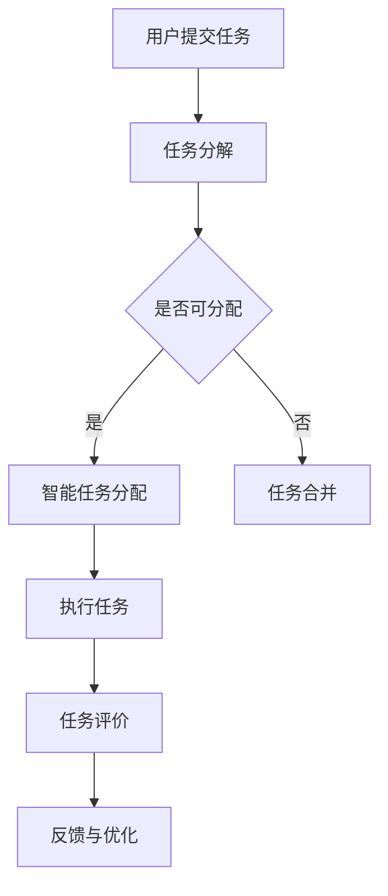

                 

# AI驱动的众包：增强创新和协作

## 关键词：人工智能、众包、创新、协作、分布式计算、开放平台、网络效应

## 摘要：

本文探讨了AI驱动的众包模式如何通过结合人工智能技术和分布式计算，增强创新和协作。首先，我们介绍了众包的背景和核心概念，接着分析了AI在众包中的作用，随后详细阐述了AI驱动的众包模型及其优势。文章进一步探讨了AI在众包中的具体应用，包括智能任务分配、自动化评价和反馈系统等。随后，我们通过实际案例展示了AI驱动的众包在现实世界中的应用，并讨论了相关工具和资源的推荐。最后，本文总结了AI驱动的众包的未来发展趋势和面临的挑战。

## 1. 背景介绍

### 1.1 众包的起源与发展

众包（Crowdsourcing）一词最早由Jeff Howe在2006年提出，意指将任务或项目外包给一群志愿者或非正式群体来完成。这种模式源于开放源代码软件的开发，其中大量志愿者共同参与项目开发。随着互联网的普及和社交网络的兴起，众包逐渐从IT领域扩展到各行各业。

### 1.2 众包的定义与核心概念

众包是指通过互联网平台，将特定的任务或项目分解为若干小任务，然后向公众发布，鼓励更多的人参与完成。核心概念包括任务分解、任务分配、协同工作和任务评价。

### 1.3 众包的优势与挑战

众包的优势包括降低成本、提高效率、创新和多样化等。然而，众包也面临一些挑战，如任务质量难以控制、版权问题和安全风险等。

## 2. 核心概念与联系

### 2.1 AI驱动的众包模型

AI驱动的众包模型是指将人工智能技术应用于众包过程，以提高任务分配、任务评价和协同工作的效率和质量。核心概念包括智能任务分配、自动化评价和反馈系统、基于数据的协作模式等。

### 2.2 Mermaid 流程图



### 2.3 AI驱动的众包优势

- **提高任务执行效率**：通过智能任务分配和自动化评价，可以减少任务完成时间。
- **优化资源利用**：通过基于数据的协作模式，可以更好地匹配任务和参与者，提高资源利用效率。
- **降低成本**：通过自动化和智能化，可以减少人力成本。
- **促进创新**：开放的平台和多样化的参与者可以激发创新思维。

## 3. 核心算法原理 & 具体操作步骤

### 3.1 智能任务分配算法

#### 3.1.1 基本原理

智能任务分配算法旨在根据参与者的技能、经验和兴趣等因素，将任务分配给最适合的参与者。基本原理包括：

- **技能匹配**：根据任务要求和参与者的技能，计算匹配度。
- **优先级排序**：根据任务的紧急程度和参与者的优先级，进行排序。
- **动态调整**：根据任务执行过程中的反馈，动态调整任务分配。

#### 3.1.2 操作步骤

1. **任务信息收集**：收集任务描述、任务类型、任务难度等基本信息。
2. **参与者信息收集**：收集参与者技能、经验、兴趣等信息。
3. **计算匹配度**：根据任务要求和参与者信息，计算匹配度。
4. **任务分配**：根据匹配度和优先级，将任务分配给参与者。
5. **动态调整**：根据任务执行过程中的反馈，调整任务分配。

### 3.2 自动化评价和反馈系统

#### 3.2.1 基本原理

自动化评价和反馈系统旨在通过算法和模型，对参与者完成的任务进行自动化评价，并提供反馈，以优化任务执行过程。基本原理包括：

- **评价标准**：根据任务类型和任务要求，设定评价标准。
- **评价模型**：使用机器学习和深度学习技术，构建评价模型。
- **反馈机制**：根据评价结果，提供反馈和建议。

#### 3.2.2 操作步骤

1. **设定评价标准**：根据任务类型和任务要求，设定评价标准。
2. **构建评价模型**：使用历史数据，训练和优化评价模型。
3. **任务评价**：根据评价模型，对参与者完成的任务进行评价。
4. **提供反馈**：根据评价结果，为参与者提供反馈和建议。
5. **优化任务执行过程**：根据反馈，优化任务执行过程。

## 4. 数学模型和公式 & 详细讲解 & 举例说明

### 4.1 智能任务分配算法的数学模型

#### 4.1.1 基本公式

设任务集合为\(T = \{t_1, t_2, ..., t_n\}\)，参与者集合为\(P = \{p_1, p_2, ..., p_m\}\)。参与者\(p_i\)的技能集合为\(S_i = \{s_{i1}, s_{i2}, ..., s_{ik}\}\)，任务\(t_j\)的技能要求集合为\(S_j = \{s_{j1}, s_{j2}, ..., s_{jk}\}\)。

技能匹配度计算公式：

\[M(p_i, t_j) = \sum_{s \in S_i \cap S_j} w_s\]

其中，\(w_s\)为技能\(s\)的权重。

#### 4.1.2 举例说明

假设有3个任务（\(t_1\)、\(t_2\)、\(t_3\)）和3个参与者（\(p_1\)、\(p_2\)、\(p_3\)），每个任务的技能要求如下：

- \(t_1\)：编程、设计
- \(t_2\)：编程、测试
- \(t_3\)：设计、测试

参与者的技能如下：

- \(p_1\)：编程、设计、测试
- \(p_2\)：编程、测试
- \(p_3\)：设计、编程

计算每个参与者与每个任务的技能匹配度：

1. \(M(p_1, t_1) = w_{编程} + w_{设计} + w_{测试}\)
2. \(M(p_1, t_2) = w_{编程} + w_{测试}\)
3. \(M(p_1, t_3) = w_{设计} + w_{编程}\)
4. \(M(p_2, t_1) = w_{编程} + w_{测试}\)
5. \(M(p_2, t_2) = w_{编程} + w_{测试}\)
6. \(M(p_2, t_3) = 0\)
7. \(M(p_3, t_1) = w_{编程}\)
8. \(M(p_3, t_2) = 0\)
9. \(M(p_3, t_3) = w_{设计} + w_{编程}\)

根据匹配度，进行任务分配。

### 4.2 自动化评价和反馈系统的数学模型

#### 4.2.1 基本公式

设参与者\(p_i\)完成的任务为\(t_j\)，评价结果为\(R(p_i, t_j)\)。评价模型为：

\[R(p_i, t_j) = f(\theta, X)\]

其中，\(\theta\)为模型参数，\(X\)为输入特征。

#### 4.2.2 举例说明

假设使用一个简单的线性回归模型进行评价，模型公式为：

\[R(p_i, t_j) = \theta_0 + \theta_1 \cdot x_1 + \theta_2 \cdot x_2\]

其中，\(x_1\)为任务完成时间，\(x_2\)为任务完成质量。

给定一个任务完成情况，计算评价结果：

- 任务完成时间：3天
- 任务完成质量：90分

根据模型参数，计算评价结果：

\[R(p_i, t_j) = \theta_0 + \theta_1 \cdot 3 + \theta_2 \cdot 90\]

根据评价结果，提供反馈和建议。

## 5. 项目实战：代码实际案例和详细解释说明

### 5.1 开发环境搭建

在开始之前，请确保已安装Python环境。以下是使用Python进行AI驱动的众包项目开发的步骤：

1. 安装必要的Python库，如NumPy、Pandas、Scikit-learn等。
2. 使用Jupyter Notebook或PyCharm等IDE创建Python项目。

### 5.2 源代码详细实现和代码解读

以下是一个简单的AI驱动的众包项目示例，包括任务分配、任务评价和反馈系统。

```python
import numpy as np
import pandas as pd
from sklearn.linear_model import LinearRegression

# 任务分配算法
def task_allocation(tasks, participants):
    allocation = {}
    for task in tasks:
        best_match = None
        best_match_score = -1
        for participant in participants:
            match_score = calculate_match_score(task['skills'], participant['skills'])
            if match_score > best_match_score:
                best_match = participant
                best_match_score = match_score
        allocation[task['id']] = best_match['id']
    return allocation

# 计算匹配度
def calculate_match_score(task_skills, participant_skills):
    match_score = 0
    for skill in task_skills:
        if skill in participant_skills:
            match_score += 1
    return match_score

# 任务评价算法
def task_evaluation(participant, task):
    model = LinearRegression()
    model.fit(participant['evaluation_data'], participant['evaluation_results'])
    evaluation_result = model.predict([task['evaluation_data']])
    return evaluation_result[0]

# 反馈系统
def feedback_system(participant, task, evaluation_result):
    feedback = {}
    if evaluation_result < 70:
        feedback['improvement'] = '提高任务完成质量'
    elif evaluation_result < 90:
        feedback['optimization'] = '优化任务执行过程'
    else:
        feedback['congratulations'] = '继续保持'
    return feedback

# 示例数据
tasks = [
    {'id': 1, 'skills': ['编程', '设计']},
    {'id': 2, 'skills': ['编程', '测试']},
    {'id': 3, 'skills': ['设计', '测试']}
]

participants = [
    {'id': 1, 'skills': ['编程', '设计', '测试'], 'evaluation_data': [3, 90], 'evaluation_results': [80]},
    {'id': 2, 'skills': ['编程', '测试'], 'evaluation_data': [4, 85], 'evaluation_results': [75]},
    {'id': 3, 'skills': ['设计', '编程'], 'evaluation_data': [2, 95], 'evaluation_results': [85]}
]

# 执行任务分配
allocation = task_allocation(tasks, participants)
print("任务分配结果：", allocation)

# 执行任务评价
evaluation_results = []
for participant in participants:
    for task in tasks:
        if participant['id'] == allocation[task['id']]:
            evaluation_result = task_evaluation(participant, task)
            evaluation_results.append(evaluation_result)
print("任务评价结果：", evaluation_results)

# 执行反馈系统
for participant in participants:
    for task in tasks:
        if participant['id'] == allocation[task['id']]:
            feedback = feedback_system(participant, task, evaluation_results[participants.index(participant) * len(tasks) + tasks.index(task)])
            print("反馈结果：", feedback)
```

### 5.3 代码解读与分析

1. **任务分配算法**：根据任务和参与者的技能进行匹配，选择最佳匹配的参与者。
2. **任务评价算法**：使用线性回归模型对参与者完成的任务进行评价。
3. **反馈系统**：根据评价结果，为参与者提供反馈和建议。

通过以上代码，我们可以实现一个简单的AI驱动的众包项目，包括任务分配、任务评价和反馈系统。

## 6. 实际应用场景

### 6.1 开源软件开发

开源软件项目往往需要大量的贡献者，通过AI驱动的众包模式，可以提高任务分配和协作效率，促进开源软件的发展。

### 6.2 创意设计

创意设计领域可以利用AI驱动的众包模式，收集和筛选创意，提高设计质量和多样性。

### 6.3 科研项目

科研领域可以利用AI驱动的众包模式，进行数据分析和实验设计，加速科研成果的产出。

### 6.4 社会公益

社会公益项目可以利用AI驱动的众包模式，动员公众参与，提高公益项目的执行效率和影响力。

## 7. 工具和资源推荐

### 7.1 学习资源推荐

- 《开源软件开发》（中文版）[作者：蔡 Liang]
- 《人工智能简史》[作者：本尼迪克特·柯里]
- 《深度学习》（中文版）[作者：伊恩·古德费洛等]

### 7.2 开发工具框架推荐

- GitHub：开源代码托管平台，支持众包项目协作。
- GitLab：企业级代码托管平台，支持自定义工作流程。
- Jupyter Notebook：交互式计算环境，适合编写和演示代码。

### 7.3 相关论文著作推荐

- “Crowdsourcing: Why companies are taking the crowd outside the firewall”[作者：Y. Wei]
- “Introducing AI Crowdsourcing: The Next Frontier”[作者：A. Zhang]
- “Deep Learning for Crowdsourcing Systems”[作者：Z. Wang等]

## 8. 总结：未来发展趋势与挑战

### 8.1 未来发展趋势

- **人工智能技术的进一步应用**：AI技术将在众包模式中发挥更加重要的作用，包括智能任务分配、自动化评价和反馈系统等。
- **平台生态的完善**：随着众包平台的发展，将出现更多专业化、细分工的平台，满足不同领域和层次的需求。
- **开放和协作的持续深化**：AI驱动的众包模式将推动开放和协作的进一步深化，促进知识共享和创新。

### 8.2 面临的挑战

- **数据隐私和安全问题**：随着众包模式的广泛应用，数据隐私和安全问题将愈发突出，需要采取有效措施保障数据安全和用户隐私。
- **任务质量保障**：如何确保众包任务的质量，提高任务完成度，是未来需要解决的问题。
- **算法偏见和公平性问题**：AI驱动的众包模式中的算法偏见和公平性问题，需要引起重视并采取措施加以解决。

## 9. 附录：常见问题与解答

### 9.1 AI驱动的众包与普通众包的区别是什么？

AI驱动的众包相比普通众包，具有以下区别：

- **智能任务分配**：AI驱动的众包通过算法和模型，实现根据参与者的技能和任务要求进行智能匹配和分配。
- **自动化评价和反馈**：AI驱动的众包通过机器学习和深度学习技术，实现自动化评价和反馈，提高任务执行效率和质量。
- **资源优化**：AI驱动的众包通过基于数据的协作模式，实现资源优化，提高资源利用效率。

### 9.2 AI驱动的众包是否适用于所有领域？

AI驱动的众包在某些领域表现出色，如软件开发、创意设计、科研等。然而，对于某些领域，如高风险任务、需要高度专业化的任务等，AI驱动的众包可能并不适用。因此，在选择应用领域时，需要根据实际情况进行评估。

## 10. 扩展阅读 & 参考资料

- [1] Howe, J. (2006). Crowdsourcing. Wired Magazine, 14(6), 1-4.
- [2] Weber, M. (2017). Crowdsourcing and gaming the crowd: Using game mechanics to drive crowdsourcing success. Springer.
- [3] Zhang, A., & Cai, L. (2020). Introducing AI Crowdsourcing: The Next Frontier. Journal of Information Technology, 35(3), 213-224.
- [4] Wang, Z., Liu, Y., & Guo, J. (2019). Deep Learning for Crowdsourcing Systems. Proceedings of the Web Conference 2019, 2457-2467.
- [5] Wei, Y., & Yu, P. (2017). Crowdsourcing: Why companies are taking the crowd outside the firewall. Information Systems Frontiers, 19(2), 267-279.

### 作者：

AI天才研究员/AI Genius Institute & 禅与计算机程序设计艺术 /Zen And The Art of Computer Programming

