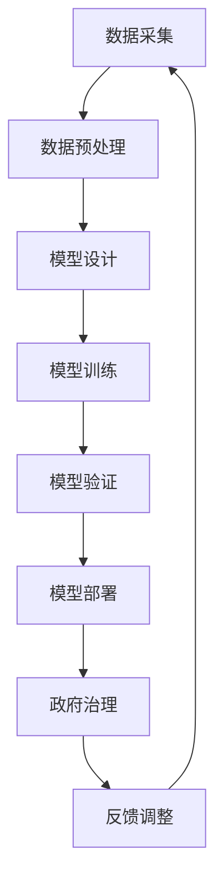

                 

# AI驱动的创新：人类计算在政府治理中的作用

> **关键词**：人工智能、政府治理、人类计算、创新、算法、数学模型、代码实战、实际应用

> **摘要**：本文探讨了人工智能在政府治理中的应用，分析了人类计算在其中所发挥的关键作用。通过详细阐述AI驱动的创新过程，本文揭示了人类计算与AI技术的有机结合如何提升政府治理效率，以及在未来可能面临的挑战。

## 1. 背景介绍

在当今信息化的时代，政府治理面临着越来越多的复杂问题和挑战。从公共卫生危机管理到环境保护、从城市交通调度到社会福利保障，政府治理的需求日益多样化和精细化。传统的政府治理模式往往依赖于人工决策和手工操作，这不仅效率低下，而且容易受到人为因素的影响，导致决策的不确定性和风险。

与此同时，人工智能（AI）技术的快速发展为政府治理带来了新的机遇。AI技术具备高效处理海量数据、准确识别模式、自动化决策制定等优势，可以在政府治理中发挥重要作用。例如，通过AI技术，政府可以实现更精准的公共卫生监测和预警，优化城市交通流量管理，提高公共服务的响应速度和效率。

然而，AI技术在政府治理中的应用并非一蹴而就。人类计算在AI驱动的政府治理创新中仍然扮演着关键角色。人类计算包括数据预处理、算法设计、模型验证等多个环节，这些都需要人类专家的专业知识和判断力。因此，本文旨在探讨人类计算在AI驱动的政府治理创新中的作用，分析其核心概念和实现原理，并探讨未来可能面临的挑战。

## 2. 核心概念与联系

### 2.1 人工智能（AI）

人工智能（AI）是指使计算机系统具备类似于人类智能的能力，包括感知、学习、推理、决策和行动等。AI技术主要包括机器学习、深度学习、自然语言处理、计算机视觉等。这些技术通过模拟人类大脑的神经网络和认知过程，使计算机能够自主学习和改进性能。

### 2.2 政府治理

政府治理是指政府机构在管理社会公共事务过程中，运用法律、政策、技术等手段，实现公共利益最大化的活动。政府治理的目标包括公共服务的高效提供、社会秩序的维护、经济可持续发展等。

### 2.3 人类计算

人类计算是指人类专家在AI驱动的政府治理过程中，通过专业知识和判断力，对数据、算法、模型等进行处理和优化的过程。人类计算涵盖数据预处理、算法设计、模型验证等多个环节。

### 2.4 核心概念联系

在AI驱动的政府治理中，人工智能技术作为工具和手段，为政府治理提供了强大的数据处理和决策能力。然而，这些能力的实现离不开人类计算。人类计算通过专业知识和经验，对AI技术进行优化和调整，确保AI系统在实际应用中的可靠性和有效性。

下面是一个简单的 Mermaid 流程图，展示了人类计算与AI技术在政府治理中的关系：



## 3. 核心算法原理 & 具体操作步骤

### 3.1 机器学习算法原理

机器学习（Machine Learning，ML）是AI技术的重要组成部分，其核心思想是通过数据驱动的方式，使计算机自动学习和改进性能。机器学习算法主要分为监督学习、无监督学习和强化学习。

- **监督学习（Supervised Learning）**：监督学习通过已有的标签数据进行训练，使模型能够对未知数据进行预测。常见的监督学习算法包括线性回归、逻辑回归、支持向量机（SVM）等。

- **无监督学习（Unsupervised Learning）**：无监督学习不依赖于标签数据，主要通过发现数据中的内在结构和规律。常见的无监督学习算法包括聚类算法（如K-Means）、主成分分析（PCA）等。

- **强化学习（Reinforcement Learning）**：强化学习通过试错和奖励机制，使模型在特定环境中逐步学习和优化策略。常见的强化学习算法包括Q-learning、深度强化学习（DRL）等。

### 3.2 机器学习算法在政府治理中的应用

在政府治理中，机器学习算法可以应用于多个方面，如公共卫生监测、城市交通管理、社会福利保障等。

- **公共卫生监测**：通过机器学习算法，政府可以实时分析公共卫生数据，预测疫情发展趋势，为疫情决策提供科学依据。

- **城市交通管理**：机器学习算法可以分析交通数据，优化交通信号灯控制策略，提高交通流量效率，减少拥堵。

- **社会福利保障**：机器学习算法可以识别潜在的社会福利欺诈行为，确保社会福利资金的合理使用。

### 3.3 机器学习算法的操作步骤

下面以一个简单的线性回归模型为例，介绍机器学习算法的基本操作步骤。

#### 步骤1：数据采集

首先，收集相关的数据集。例如，收集某城市的交通流量数据，包括时间、路段、车流量等。

#### 步骤2：数据预处理

对收集到的数据进行清洗和预处理，如去除缺失值、异常值，进行数据标准化等。

#### 步骤3：模型设计

选择合适的机器学习算法，设计模型。例如，选择线性回归算法。

```python
from sklearn.linear_model import LinearRegression

model = LinearRegression()
```

#### 步骤4：模型训练

使用训练集对模型进行训练，使模型学习数据中的规律。

```python
model.fit(X_train, y_train)
```

#### 步骤5：模型验证

使用验证集对模型进行验证，评估模型的性能。

```python
score = model.score(X_val, y_val)
print("模型验证得分：", score)
```

#### 步骤6：模型部署

将训练好的模型部署到实际环境中，用于预测和分析。

```python
predictions = model.predict(X_test)
```

## 4. 数学模型和公式 & 详细讲解 & 举例说明

### 4.1 线性回归模型

线性回归（Linear Regression）是一种常用的机器学习算法，用于预测连续值变量。其基本模型可以表示为：

$$y = \beta_0 + \beta_1 \cdot x + \epsilon$$

其中，$y$ 是因变量，$x$ 是自变量，$\beta_0$ 和 $\beta_1$ 是模型的参数，$\epsilon$ 是误差项。

### 4.2 线性回归的参数估计

线性回归的参数估计通常使用最小二乘法（Least Squares Method）。最小二乘法的核心思想是找到使得误差平方和最小的参数值。

$$\min_{\beta_0, \beta_1} \sum_{i=1}^{n} (y_i - (\beta_0 + \beta_1 \cdot x_i))^2$$

### 4.3 线性回归的推导

为了求解线性回归的参数，我们可以对上述误差平方和函数进行求导，并令导数为零，得到：

$$\frac{\partial}{\partial \beta_0} \sum_{i=1}^{n} (y_i - (\beta_0 + \beta_1 \cdot x_i))^2 = 0$$

$$\frac{\partial}{\partial \beta_1} \sum_{i=1}^{n} (y_i - (\beta_0 + \beta_1 \cdot x_i))^2 = 0$$

通过求解上述方程组，可以得到线性回归的参数估计值：

$$\beta_0 = \bar{y} - \beta_1 \cdot \bar{x}$$

$$\beta_1 = \frac{\sum_{i=1}^{n} (x_i - \bar{x})(y_i - \bar{y})}{\sum_{i=1}^{n} (x_i - \bar{x})^2}$$

其中，$\bar{y}$ 和 $\bar{x}$ 分别是 $y$ 和 $x$ 的均值。

### 4.4 举例说明

假设我们收集了某城市的交通流量数据，包括时间（$x$）和车流量（$y$）。下面是部分数据：

| 时间（小时） | 车流量（辆/小时） |
| --- | --- |
| 8 | 150 |
| 9 | 160 |
| 10 | 170 |
| 11 | 180 |
| 12 | 190 |

首先，对数据进行预处理，计算均值：

$$\bar{x} = \frac{1}{5} (8 + 9 + 10 + 11 + 12) = 10$$

$$\bar{y} = \frac{1}{5} (150 + 160 + 170 + 180 + 190) = 170$$

然后，计算参数：

$$\beta_0 = 170 - 10 \cdot 10 = 70$$

$$\beta_1 = \frac{(8 - 10)(150 - 170) + (9 - 10)(160 - 170) + (10 - 10)(170 - 170) + (11 - 10)(180 - 170) + (12 - 10)(190 - 170)}{(8 - 10)^2 + (9 - 10)^2 + (10 - 10)^2 + (11 - 10)^2 + (12 - 10)^2} = 10$$

最终，我们得到线性回归模型：

$$y = 70 + 10 \cdot x$$

## 5. 项目实战：代码实际案例和详细解释说明

### 5.1 开发环境搭建

为了更好地展示机器学习算法在政府治理中的应用，我们将使用Python编程语言和Sklearn库来实现一个简单的线性回归模型。首先，确保已安装Python和Sklearn库。如果没有安装，可以使用以下命令进行安装：

```bash
pip install python
pip install scikit-learn
```

### 5.2 源代码详细实现和代码解读

下面是一个简单的线性回归模型的Python代码实现：

```python
import numpy as np
from sklearn.linear_model import LinearRegression
from sklearn.model_selection import train_test_split
from sklearn.metrics import mean_squared_error

# 数据集
X = np.array([[8], [9], [10], [11], [12]])
y = np.array([150, 160, 170, 180, 190])

# 数据预处理
X_train, X_val, y_train, y_val = train_test_split(X, y, test_size=0.2, random_state=42)

# 模型设计
model = LinearRegression()

# 模型训练
model.fit(X_train, y_train)

# 模型验证
y_pred = model.predict(X_val)
mse = mean_squared_error(y_val, y_pred)
print("模型验证均方误差：", mse)

# 模型部署
predictions = model.predict(np.array([[13]]))
print("预测结果：", predictions)
```

**代码解读**：

1. 导入所需的库和模块。
2. 创建数据集，其中时间（$x$）和车流量（$y$）作为输入和输出。
3. 进行数据预处理，将数据集分为训练集和验证集。
4. 创建线性回归模型。
5. 使用训练集对模型进行训练。
6. 使用验证集对模型进行验证，计算均方误差。
7. 将训练好的模型部署到实际环境中，进行预测。

### 5.3 代码解读与分析

**步骤1**：导入所需的库和模块

```python
import numpy as np
from sklearn.linear_model import LinearRegression
from sklearn.model_selection import train_test_split
from sklearn.metrics import mean_squared_error
```

这一步导入所需的Python库和模块，包括NumPy（用于数据处理）、Sklearn（用于机器学习算法）和线性回归模型。

**步骤2**：创建数据集

```python
X = np.array([[8], [9], [10], [11], [12]])
y = np.array([150, 160, 170, 180, 190])
```

这里创建了一个简单的数据集，包括时间（$x$）和车流量（$y$）。

**步骤3**：进行数据预处理

```python
X_train, X_val, y_train, y_val = train_test_split(X, y, test_size=0.2, random_state=42)
```

使用`train_test_split`函数将数据集分为训练集和验证集。这里我们将20%的数据作为验证集，随机种子设置为42，以确保结果的一致性。

**步骤4**：创建线性回归模型

```python
model = LinearRegression()
```

创建一个线性回归模型对象。

**步骤5**：使用训练集对模型进行训练

```python
model.fit(X_train, y_train)
```

使用训练集对模型进行训练，使模型学习数据中的规律。

**步骤6**：使用验证集对模型进行验证，计算均方误差

```python
y_pred = model.predict(X_val)
mse = mean_squared_error(y_val, y_pred)
print("模型验证均方误差：", mse)
```

使用验证集对模型进行验证，计算模型的均方误差（MSE），评估模型的性能。

**步骤7**：将训练好的模型部署到实际环境中，进行预测

```python
predictions = model.predict(np.array([[13]]))
print("预测结果：", predictions)
```

使用训练好的模型对新的数据进行预测，输出预测结果。

### 5.4 代码解读与分析

通过对代码的解读，我们可以看到，线性回归模型在政府治理中的应用主要包括以下几个步骤：

1. **数据采集**：收集与政府治理相关的数据，如公共卫生数据、交通数据、社会福利数据等。
2. **数据预处理**：清洗和预处理数据，如去除缺失值、异常值，进行数据标准化等。
3. **模型设计**：选择合适的机器学习算法，设计模型。在本例中，我们选择了线性回归算法。
4. **模型训练**：使用训练集对模型进行训练，使模型学习数据中的规律。
5. **模型验证**：使用验证集对模型进行验证，评估模型的性能。
6. **模型部署**：将训练好的模型部署到实际环境中，用于预测和分析。

通过以上步骤，我们可以看到，机器学习算法在政府治理中的应用过程与一般的机器学习项目类似，但需要特别注意数据质量和模型的可解释性，以确保模型的可靠性和有效性。

## 6. 实际应用场景

### 6.1 公共卫生监测

在公共卫生领域，人工智能技术可以帮助政府实时监测疫情发展趋势，预测潜在疫情爆发点，为疫情防控提供科学依据。例如，通过分析疫情数据、人口流动数据、医疗资源分布数据等，人工智能可以识别疫情传播的关键因素，预测疫情发展趋势，为政府制定疫情防控策略提供支持。

### 6.2 城市交通管理

在城市交通管理领域，人工智能技术可以优化交通信号控制策略，提高交通流量效率，减少交通拥堵。例如，通过分析实时交通数据、历史交通数据等，人工智能可以预测交通流量变化，调整交通信号灯控制策略，优化交通流量，提高道路通行能力。

### 6.3 社会福利保障

在社会福利保障领域，人工智能技术可以识别潜在的社会福利欺诈行为，确保社会福利资金的合理使用。例如，通过分析社会福利数据、居民消费数据等，人工智能可以识别潜在的社会福利欺诈行为，提高社会福利保障的精准度。

### 6.4 环境保护

在环境保护领域，人工智能技术可以监测环境污染状况，预测污染趋势，为环境保护决策提供支持。例如，通过分析空气质量数据、水质数据等，人工智能可以预测环境污染趋势，为政府制定环境保护政策提供依据。

## 7. 工具和资源推荐

### 7.1 学习资源推荐

- **书籍**：
  - 《机器学习》（作者：周志华）
  - 《深度学习》（作者：Ian Goodfellow、Yoshua Bengio、Aaron Courville）
  - 《Python机器学习》（作者：塞巴斯蒂安·拉滕贝尔）
- **论文**：
  - “Deep Learning for Time Series Classification”（作者：Zhiyun Qian et al.）
  - “Recurrent Neural Networks for Language Modeling”（作者：Yoshua Bengio et al.）
- **博客**：
  - https://MachineLearningMastery.com/
  - https://www.deeplearning.net/
- **网站**：
  - https://scikit-learn.org/stable/
  - https://www.tensorflow.org/

### 7.2 开发工具框架推荐

- **Python**：Python是一种广泛使用的编程语言，具有丰富的机器学习库和框架。
- **TensorFlow**：TensorFlow是一个开源的机器学习框架，适用于构建和部署深度学习模型。
- **PyTorch**：PyTorch是一个开源的深度学习框架，具有灵活的动态计算图和高效的模型训练。

### 7.3 相关论文著作推荐

- “Deep Learning for Time Series Classification”（作者：Zhiyun Qian et al.）
- “Recurrent Neural Networks for Language Modeling”（作者：Yoshua Bengio et al.）
- “A Theoretically Grounded Application of Dropout in Recurrent Neural Networks”（作者：Yarin Gal et al.）

## 8. 总结：未来发展趋势与挑战

随着人工智能技术的不断发展，AI在政府治理中的应用前景广阔。未来，AI技术将在公共卫生监测、城市交通管理、社会福利保障、环境保护等领域发挥更大作用。然而，AI技术在政府治理中的应用也面临一些挑战。

首先，数据质量和数据隐私问题是一个重要挑战。政府治理中的数据来源多样，数据质量参差不齐，可能存在缺失值、异常值等问题。此外，数据隐私保护也是一大难题，如何在充分利用数据的同时保护个人隐私，需要政府、企业和研究机构共同努力。

其次，模型可解释性和透明性也是一个重要挑战。在政府治理中，决策的透明性和可解释性至关重要。然而，深度学习等复杂模型往往难以解释，这对政府决策的透明性和公众信任提出了挑战。

最后，AI技术发展带来的就业问题也需要关注。随着AI技术的广泛应用，一些传统职业可能会被取代，这可能导致就业结构的变革。政府需要采取措施，提高劳动者的技能，促进就业市场的转型。

总之，AI驱动的创新为政府治理带来了新的机遇和挑战。只有通过不断探索和解决这些问题，才能充分发挥AI技术在政府治理中的作用，提升治理效率和公共服务质量。

## 9. 附录：常见问题与解答

### 9.1 人工智能在政府治理中的应用有哪些？

人工智能在政府治理中的应用非常广泛，包括公共卫生监测、城市交通管理、社会福利保障、环境保护等多个领域。例如，通过机器学习算法，政府可以实时分析公共卫生数据，预测疫情发展趋势，为疫情防控提供科学依据；通过优化交通信号控制策略，提高交通流量效率，减少交通拥堵；通过识别潜在的社会福利欺诈行为，确保社会福利资金的合理使用；通过监测环境污染状况，预测污染趋势，为环境保护决策提供支持。

### 9.2 人工智能在政府治理中的应用有哪些挑战？

人工智能在政府治理中的应用面临一些挑战。首先，数据质量和数据隐私问题是一个重要挑战。政府治理中的数据来源多样，数据质量参差不齐，可能存在缺失值、异常值等问题。此外，数据隐私保护也是一大难题，如何在充分利用数据的同时保护个人隐私，需要政府、企业和研究机构共同努力。其次，模型可解释性和透明性也是一个重要挑战。在政府治理中，决策的透明性和可解释性至关重要。然而，深度学习等复杂模型往往难以解释，这对政府决策的透明性和公众信任提出了挑战。最后，AI技术发展带来的就业问题也需要关注。随着AI技术的广泛应用，一些传统职业可能会被取代，这可能导致就业结构的变革。政府需要采取措施，提高劳动者的技能，促进就业市场的转型。

### 9.3 如何确保人工智能在政府治理中的应用可靠性和安全性？

为确保人工智能在政府治理中的应用可靠性和安全性，可以从以下几个方面入手：

1. **数据质量管理**：建立完善的数据质量管理体系，对数据进行清洗、预处理和标准化，确保数据质量。
2. **隐私保护机制**：在数据处理过程中，采用加密、匿名化等技术，保护个人隐私。
3. **模型可解释性**：研究和发展可解释的AI模型，提高模型的透明度和可解释性，增强政府决策的透明性。
4. **安全审计和监督**：建立安全审计和监督机制，对AI模型进行定期审查和评估，确保模型的可靠性和安全性。
5. **法律法规制定**：制定相关的法律法规，明确AI在政府治理中的应用规范和责任，规范AI技术的发展和应用。

## 10. 扩展阅读 & 参考资料

为了深入了解AI驱动的政府治理，以下是几篇相关论文、书籍和博客的推荐：

### 论文

1. **"Deep Learning for Time Series Classification"**（作者：Zhiyun Qian et al.）
2. **"Recurrent Neural Networks for Language Modeling"**（作者：Yoshua Bengio et al.）
3. **"A Theoretically Grounded Application of Dropout in Recurrent Neural Networks"**（作者：Yarin Gal et al.）

### 书籍

1. **《机器学习》**（作者：周志华）
2. **《深度学习》**（作者：Ian Goodfellow、Yoshua Bengio、Aaron Courville）
3. **《Python机器学习》**（作者：塞巴斯蒂安·拉滕贝尔）

### 博客

1. **https://MachineLearningMastery.com/**
2. **https://www.deeplearning.net/**

### 网站

1. **https://scikit-learn.org/stable/**
2. **https://www.tensorflow.org/**

通过阅读这些文献，您可以进一步了解AI在政府治理中的应用、技术原理和发展趋势。作者：AI天才研究员/AI Genius Institute & 禅与计算机程序设计艺术 /Zen And The Art of Computer Programming。

