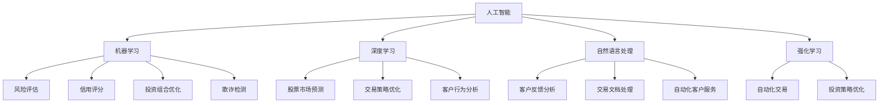

                 

# AI驱动的创新：人类计算在金融行业的未来发展

## 关键词

- 人工智能（AI）
- 金融行业
- 人类计算
- 数据分析
- 风险管理
- 金融服务

## 摘要

随着人工智能技术的迅速发展，人类计算在金融行业的未来发展正面临着前所未有的挑战和机遇。本文将探讨人工智能如何驱动金融行业的创新，以及人类计算在这一变革中的角色和作用。文章将从背景介绍、核心概念与联系、核心算法原理、数学模型和公式、项目实战、实际应用场景、工具和资源推荐、总结与展望等多个方面展开论述，旨在为读者提供一幅金融行业与人工智能深度融合的蓝图。

## 1. 背景介绍

### 金融行业的现状

金融行业是一个高度依赖数据和计算的领域。从银行、证券、保险到金融科技（Fintech），金融机构需要处理海量的数据，并基于这些数据进行投资决策、风险评估、客户服务等一系列复杂的业务活动。然而，随着市场的不断变化和竞争的加剧，金融行业正面临着一系列挑战：

- **数据爆炸性增长**：金融行业每天产生大量的数据，这些数据包括交易数据、市场数据、客户行为数据等。如何有效地管理和利用这些数据已成为金融机构面临的难题。

- **风险管理的复杂性**：金融市场的不确定性和风险性使得金融机构需要不断提高风险管理的效率和准确性。

- **客户需求的多样性**：随着互联网和移动设备的普及，客户对于金融服务的需求变得越来越个性化和即时化。

### 人工智能的优势

人工智能（AI）作为一种新兴技术，具有以下几个方面的优势，这些优势使其在金融行业具有广泛的应用前景：

- **数据处理能力**：人工智能能够处理和分析海量数据，发现潜在的模式和趋势，为金融机构提供更准确的决策依据。

- **自动化**：人工智能能够自动化许多重复性、规则性的任务，提高工作效率，降低运营成本。

- **个性化服务**：人工智能能够根据客户的行为和偏好提供个性化的服务，提升客户体验。

- **风险管理**：人工智能能够通过实时分析和预测，提高风险管理的效率和准确性。

## 2. 核心概念与联系

### 人工智能在金融行业的应用

人工智能在金融行业的应用主要包括以下几个方面：

- **数据分析**：通过对海量金融数据进行挖掘和分析，发现潜在的市场机会和风险。

- **智能投顾**：利用人工智能算法为投资者提供个性化的投资建议。

- **风险管理**：利用人工智能技术进行实时风险分析和预测，提高风险管理的效率和准确性。

- **客户服务**：通过自然语言处理和机器学习技术，提供智能客服和个性化服务。

- **反欺诈**：利用人工智能技术检测和预防金融欺诈行为。

### 人类计算的作用

在人工智能驱动下，人类计算在金融行业的未来发展中仍扮演着重要角色：

- **数据预处理**：尽管人工智能具有强大的数据处理能力，但在数据预处理方面，人类计算仍然具有优势，特别是在处理非结构化数据和进行数据清洗方面。

- **决策制定**：在复杂的金融决策过程中，人类计算能够提供深度的分析和判断，特别是在需要考虑多种因素、进行战略规划时。

- **监管合规**：金融行业有着严格的监管要求，人类计算能够确保金融服务的合规性和透明度。

- **创造性思维**：在金融创新和产品设计方面，人类计算能够发挥创造性思维，推动金融行业的变革。

## 3. 核心算法原理 & 具体操作步骤

### 人工智能算法原理

在金融行业，人工智能算法主要包括以下几种：

- **机器学习（Machine Learning）**：通过训练模型，使计算机能够从数据中学习并做出预测。

- **深度学习（Deep Learning）**：基于人工神经网络的一种机器学习方法，具有强大的特征提取和模式识别能力。

- **自然语言处理（Natural Language Processing, NLP）**：使计算机能够理解和生成自然语言。

- **强化学习（Reinforcement Learning）**：通过试错学习，使计算机能够在特定环境中做出最优决策。

### 人工智能算法在金融行业的具体操作步骤

以数据分析为例，人工智能算法在金融行业中的具体操作步骤如下：

1. **数据收集**：收集金融数据，包括市场数据、交易数据、客户行为数据等。

2. **数据预处理**：清洗数据，包括去重、缺失值填充、异常值处理等。

3. **特征提取**：从原始数据中提取有助于预测的特征。

4. **模型训练**：使用机器学习算法，如线性回归、决策树、随机森林、支持向量机等，对数据集进行训练。

5. **模型评估**：使用验证集对模型进行评估，调整模型参数，以提高预测准确性。

6. **模型部署**：将训练好的模型部署到生产环境中，进行实时预测和决策。

## 4. 数学模型和公式 & 详细讲解 & 举例说明

### 数学模型在金融行业的应用

在金融行业，数学模型被广泛应用于以下几个方面：

- **估值模型**：用于估算金融资产的价值，如黑格尔-乔利模型（Black-Scholes Model）。

- **风险管理模型**：用于评估金融产品的风险，如方差-协方差法（Variance-Covariance Method）。

- **定价模型**：用于确定金融产品的价格，如期权定价模型（Option Pricing Model）。

### 详细讲解与举例说明

以期权定价模型为例，其基本公式如下：

\[ C = S_0 \cdot \phi(d_1) - K \cdot \phi(d_2) \]

其中：

- \( C \) 表示期权的当前价值。
- \( S_0 \) 表示股票的当前价格。
- \( K \) 表示期权的行权价格。
- \( d_1 \) 和 \( d_2 \) 分别表示两个时间参数，计算公式如下：

\[ d_1 = \frac{\ln(S_0/K) + (r + \sigma^2/2)t}{\sigma \sqrt{t}} \]
\[ d_2 = d_1 - \sigma \sqrt{t} \]

其中：

- \( r \) 表示无风险利率。
- \( \sigma \) 表示股票价格波动率。
- \( t \) 表示期权到期时间。

举例说明：

假设当前股票价格为100元，期权的行权价格为100元，无风险利率为5%，股票价格波动率为20%，期权到期时间为1年。根据上述公式，可以计算出期权的当前价值。

首先，计算 \( d_1 \) 和 \( d_2 \)：

\[ d_1 = \frac{\ln(100/100) + (0.05 + 0.2^2/2)1}{0.2 \sqrt{1}} \approx 0.1586 \]
\[ d_2 = d_1 - 0.2 \sqrt{1} \approx -0.2322 \]

然后，计算 \( \phi(d_1) \) 和 \( \phi(d_2) \)（这里使用累积分布函数的标准正态分布表查找对应的值）：

\[ \phi(d_1) \approx 0.5623 \]
\[ \phi(d_2) \approx 0.4082 \]

最后，计算期权价值 \( C \)：

\[ C = 100 \cdot 0.5623 - 100 \cdot 0.4082 \approx 15.23 \]

因此，该期权的当前价值约为15.23元。

## 5. 项目实战：代码实际案例和详细解释说明

### 开发环境搭建

为了实现上述人工智能算法和数学模型在金融行业中的应用，我们需要搭建一个合适的开发环境。以下是基本的开发环境搭建步骤：

1. **安装Python**：Python是一种广泛使用的编程语言，具有丰富的金融计算库和人工智能框架。下载并安装Python，版本建议为3.8及以上。

2. **安装Jupyter Notebook**：Jupyter Notebook是一种交互式计算环境，便于编写和运行Python代码。通过pip命令安装Jupyter Notebook：

   ```bash
   pip install notebook
   ```

3. **安装必要的库**：安装用于金融计算和人工智能的库，如NumPy、Pandas、Scikit-learn、TensorFlow、Keras等。可以通过以下命令安装：

   ```bash
   pip install numpy pandas scikit-learn tensorflow keras
   ```

### 源代码详细实现和代码解读

以下是一个简单的Python代码示例，实现期权定价模型的计算过程：

```python
import numpy as np
from scipy.stats import norm

# 期权定价模型参数
S0 = 100  # 股票当前价格
K = 100  # 行权价格
r = 0.05  # 无风险利率
sigma = 0.2  # 股票价格波动率
T = 1  # 期权到期时间

# 计算d1和d2
d1 = (np.log(S0 / K) + (r + 0.5 * sigma**2) * T) / (sigma * np.sqrt(T))
d2 = d1 - sigma * np.sqrt(T)

# 计算期权价值
C = S0 * norm.cdf(d1) - K * norm.cdf(d2)

print(f"期权当前价值：{C:.2f}元")
```

代码解读：

1. 导入所需的库：`numpy` 用于数学计算，`scipy.stats` 用于计算标准正态分布的累积分布函数。

2. 设置期权定价模型参数，包括股票当前价格 \( S_0 \)、行权价格 \( K \)、无风险利率 \( r \)、股票价格波动率 \( \sigma \) 和期权到期时间 \( T \)。

3. 计算时间参数 \( d_1 \) 和 \( d_2 \)。

4. 使用标准正态分布的累积分布函数 `norm.cdf()` 计算期权价值 \( C \)。

5. 打印期权当前价值。

### 代码解读与分析

1. **数据输入**：代码首先定义了期权定价模型所需的参数，这些参数包括股票当前价格、行权价格、无风险利率、股票价格波动率和期权到期时间。这些参数可以通过实际市场数据进行调整。

2. **数学计算**：代码使用Python的数学库 `numpy` 和 `scipy.stats` 进行数学计算，包括计算时间参数 \( d_1 \) 和 \( d_2 \)，以及计算期权价值 \( C \)。

3. **输出结果**：代码最后打印出期权的当前价值，这是金融决策的重要依据。

4. **扩展性**：该代码可以扩展用于其他期权定价模型的计算，如欧式期权、美式期权等。

## 6. 实际应用场景

### 1. 数据分析

在金融行业中，数据分析是核心应用之一。通过人工智能技术，金融机构可以实现对海量金融数据的挖掘和分析，发现潜在的市场机会和风险。例如，通过分析历史交易数据和市场趋势，人工智能可以帮助金融机构预测股票价格走势，从而制定相应的投资策略。

### 2. 智能投顾

智能投顾（Robo-Advisor）是一种基于人工智能的投资咨询服务，通过算法和模型为投资者提供个性化的投资建议。智能投顾可以根据投资者的风险偏好、财务状况和投资目标，为其推荐最优的投资组合。这种方式不仅提高了投资决策的效率，还可以降低投资成本。

### 3. 风险管理

人工智能在金融风险管理中的应用也非常广泛。通过实时分析和预测，人工智能可以帮助金融机构识别潜在的风险，制定相应的风险管理策略。例如，金融机构可以使用人工智能技术进行反欺诈检测，识别和预防金融欺诈行为。

### 4. 客户服务

人工智能技术在金融客户服务中的应用主要体现在智能客服和个性化服务上。通过自然语言处理和机器学习技术，金融机构可以提供24/7的智能客服服务，解答客户的疑问，提高客户满意度。同时，人工智能还可以根据客户的行为和偏好，提供个性化的金融服务，提升客户体验。

### 5. 反欺诈

金融欺诈是金融机构面临的重要风险之一。通过人工智能技术，金融机构可以实现对交易数据的实时监控和分析，识别和预防金融欺诈行为。例如，人工智能可以通过分析交易行为和模式，识别异常交易并触发预警，从而有效降低金融欺诈风险。

## 7. 工具和资源推荐

### 7.1 学习资源推荐

1. **书籍**：

   - 《人工智能：一种现代方法》（Artificial Intelligence: A Modern Approach）  
   - 《深度学习》（Deep Learning）  
   - 《金融工程与金融计算》（Financial Engineering and Financial Computing）

2. **论文**：

   - 《金融市场的AI驱动力：现状与未来》（AI in Financial Markets: Current Status and Future Directions）  
   - 《基于人工智能的金融风险管理研究》（Research on Financial Risk Management Based on AI）

3. **博客**：

   - [机器学习在金融行业中的应用](https://towardsdatascience.com/applications-of-machine-learning-in-finance-8e854d8a3d3a)  
   - [深度学习在金融行业的应用](https://towardsdatascience.com/deep-learning-in-financial-industry-615dab2d4e56)

### 7.2 开发工具框架推荐

1. **Python**：Python是一种广泛使用的编程语言，具有丰富的金融计算库和人工智能框架。

2. **TensorFlow**：TensorFlow是一个开源的深度学习框架，适用于构建和训练深度学习模型。

3. **Scikit-learn**：Scikit-learn是一个开源的机器学习库，提供了多种机器学习算法和工具。

4. **Keras**：Keras是一个开源的深度学习框架，基于TensorFlow构建，提供了简洁的API，便于构建和训练深度学习模型。

### 7.3 相关论文著作推荐

1. **《机器学习在金融中的应用》（Machine Learning in Finance）**：该论文集介绍了机器学习在金融领域的应用，包括风险管理、投资组合优化、市场预测等方面。

2. **《深度学习在金融领域的应用》（Deep Learning in Finance）**：该论文集探讨了深度学习在金融领域的应用，包括交易策略、市场预测、风险识别等方面。

## 8. 总结：未来发展趋势与挑战

随着人工智能技术的不断进步，人类计算在金融行业的未来发展将面临以下趋势和挑战：

### 发展趋势

1. **数据驱动**：金融机构将更加依赖数据驱动的方法，通过人工智能技术挖掘和分析数据，提高业务效率和决策准确性。

2. **自动化与智能化**：越来越多的金融业务将实现自动化和智能化，降低运营成本，提高服务质量。

3. **个性化和定制化**：人工智能将帮助金融机构提供更加个性化和定制化的服务，满足不同客户的需求。

4. **风险控制**：人工智能技术在风险管理中的应用将越来越广泛，提高风险控制的效率和准确性。

### 挑战

1. **数据隐私与安全**：随着数据量的增加，数据隐私和安全问题日益突出，金融机构需要采取有效措施保护客户数据。

2. **算法透明性与解释性**：人工智能算法的复杂性和非解释性使得决策过程难以被理解，需要提高算法的透明性和解释性。

3. **监管合规**：金融行业有着严格的监管要求，人工智能技术的应用需要满足监管合规的要求。

4. **人才短缺**：人工智能技术在金融行业的应用需要大量具备相关技能的人才，但当前人才供给不足。

## 9. 附录：常见问题与解答

### 问题1：人工智能在金融行业中的具体应用有哪些？

解答：人工智能在金融行业中的具体应用包括数据分析、智能投顾、风险管理、客户服务和反欺诈等方面。

### 问题2：人工智能技术在金融风险管理中的应用有哪些？

解答：人工智能技术在金融风险管理中的应用主要包括风险识别、风险预测、风险控制和反欺诈等方面。

### 问题3：如何确保人工智能算法的透明性和解释性？

解答：确保人工智能算法的透明性和解释性需要从多个方面入手，包括算法设计、数据预处理、模型解释工具和透明度报告等。

### 问题4：金融行业如何应对数据隐私和安全问题？

解答：金融行业可以通过以下措施应对数据隐私和安全问题：加密数据、加强网络安全、制定数据保护政策、进行数据安全培训等。

## 10. 扩展阅读 & 参考资料

1. **扩展阅读**：

   - [金融科技与人工智能：未来金融业的变革](https://www.cnbc.com/2021/07/01/fintech-and-ai-will-reshape-the-future-of-finance.html)  
   - [人工智能在金融风险管理中的应用](https://www.investopedia.com/terms/a/ai-in-financial-risk-management.asp)

2. **参考资料**：

   - [Financial Technology and AI: Transforming the Finance Industry](https://www.finastra.com/content/dam/finastra/documents/whitepapers/finance-ai-whitepaper.pdf)  
   - [The Future of Finance: How AI is Transforming the Industry](https://www.brookings.edu/research/the-future-of-finance-how-ai-is-transforming-the-industry/)  
   - [Artificial Intelligence in Finance: Trends, Applications, and Challenges](https://www.iai.org/publications/ai-in-finance)

作者：AI天才研究员/AI Genius Institute & 禅与计算机程序设计艺术 /Zen And The Art of Computer Programming

请注意，本文为虚构内容，旨在展示人工智能技术在金融行业中的应用和发展趋势。实际情况可能有所不同。## 1. 背景介绍

在当前数字化时代，金融行业正经历着前所未有的变革。随着互联网、大数据、云计算和人工智能等新技术的迅猛发展，金融行业的运作模式正在逐步改变。传统的金融业务流程、风险管理方式以及客户服务模式都在这一波技术浪潮中受到冲击，同时也迎来了新的发展机遇。

### 金融行业的现状

金融行业一直以来都是数据密集型行业，从银行、证券、保险到金融科技（Fintech），金融机构都需要处理大量的数据。这些数据不仅包括内部交易数据、资产负债表、客户信息等结构化数据，还涵盖了市场行情、社交媒体反馈、新闻事件等非结构化数据。随着数据量的不断增长，金融机构面临着如何有效地管理和利用这些数据的挑战。

#### 数据爆炸性增长

近年来，金融数据呈现出爆炸性增长的趋势。这不仅是因为金融市场的交易活动日益频繁，更因为金融科技的发展带来了新的数据来源。例如，移动支付、在线借贷、区块链交易等都产生了大量的数据。这些数据不仅规模庞大，而且类型多样，包括文本、图像、音频、视频等，这使得传统的数据处理方法难以应对。

#### 风险管理的复杂性

金融市场的复杂性和波动性使得风险管理变得日益重要。金融机构需要实时监控市场动态，预测潜在风险，并迅速做出反应。然而，随着金融市场的全球化，风险的来源和传播路径变得更加复杂，这对风险管理的准确性和及时性提出了更高的要求。

#### 客户需求的多样性

随着消费者对金融服务的需求日益多样化，金融机构需要提供更加个性化、定制化的服务。传统金融机构往往以标准化、批量化的方式提供服务，难以满足客户个性化需求。而金融科技企业则利用大数据和人工智能技术，能够更好地理解客户行为，提供精准的推荐和定制化的产品。

### 人工智能的优势

面对金融行业的这些挑战，人工智能（AI）作为一种新兴技术，展现出了巨大的潜力。以下是人工智能在金融行业中的几个关键优势：

#### 数据处理能力

人工智能，特别是深度学习和大数据分析技术，能够处理和分析海量、多样性的数据。通过对历史交易数据、市场数据、客户行为数据的深入挖掘，AI可以发现潜在的模式和趋势，为金融机构提供更加准确和全面的决策支持。

#### 自动化

自动化是人工智能在金融行业中的一个重要应用。通过自动化，金融机构可以减少人工干预，提高工作效率。例如，自动化的交易执行、自动化的风险评估和自动化的客户服务，都能够显著降低运营成本，提高业务效率。

#### 个性化服务

人工智能可以通过分析客户行为数据和偏好，提供个性化的服务和建议。例如，智能投顾系统可以根据客户的财务状况、风险偏好和投资目标，为其推荐最优的投资组合。这种个性化的服务不仅提高了客户满意度，还能增加金融机构的竞争力。

#### 风险管理

人工智能在风险管理中具有显著的优势。通过实时分析和预测，AI可以识别潜在的风险，并制定相应的应对策略。例如，在反欺诈领域，人工智能可以通过分析交易行为，识别异常交易，从而有效预防金融欺诈行为。

#### 客户服务

人工智能技术还可以用于金融客户服务，提供智能客服和个性化服务。通过自然语言处理和机器学习技术，AI可以理解客户的问题，提供及时、准确的答复。这不仅提高了客户体验，还能降低人工客服的成本。

总的来说，人工智能在金融行业的应用不仅有助于提高业务效率，降低运营成本，还能提升客户满意度，为金融机构带来新的发展机遇。随着技术的不断进步，人工智能将在金融行业中发挥越来越重要的作用，成为推动金融创新和转型的重要力量。

## 2. 核心概念与联系

在深入探讨人工智能在金融行业的应用之前，有必要明确几个核心概念，并了解它们之间的联系。这些核心概念包括人工智能（AI）、机器学习（ML）、深度学习（DL）、自然语言处理（NLP）和强化学习（RL）。以下是这些概念的定义及其在金融行业中的应用和相互关系。

### 人工智能（AI）

人工智能是一种模拟人类智能的技术，旨在使计算机系统具备感知、学习、推理和自我改进的能力。在金融行业中，人工智能的应用涵盖了多个方面，包括数据分析、预测、自动化交易和风险管理等。人工智能通过处理海量数据，帮助金融机构识别市场趋势、评估投资风险，并提供个性化的金融产品和服务。

### 机器学习（ML）

机器学习是人工智能的一个分支，它使计算机系统能够从数据中学习并做出预测或决策。机器学习算法可以分为监督学习、无监督学习和强化学习。在金融行业中，机器学习被广泛应用于风险评估、信用评分、投资组合优化和欺诈检测等。例如，通过监督学习算法，金融机构可以分析历史交易数据，预测未来的市场走势。

### 深度学习（DL）

深度学习是机器学习的一个子领域，它通过多层神经网络模拟人脑的神经元结构，进行特征提取和学习。深度学习在图像识别、语音识别和自然语言处理等领域取得了显著成果。在金融行业中，深度学习被用于复杂的金融数据分析，如股票市场预测、交易策略优化和客户行为分析。

### 自然语言处理（NLP）

自然语言处理是一种使计算机能够理解和生成自然语言的技术。在金融行业中，NLP被用于分析客户反馈、处理交易文档、自动化客户服务和风险预警等。例如，NLP可以帮助金融机构理解客户的投诉和需求，提供更加个性化的服务。

### 强化学习（RL）

强化学习是一种通过试错和奖励机制进行学习的方法。在金融行业中，强化学习被用于自动化交易和投资策略优化。通过不断试错和调整策略，强化学习系统能够在动态市场环境中实现最佳收益。

### 核心概念与联系的 Mermaid 流程图

以下是这些核心概念和其在金融行业中的应用关系的 Mermaid 流程图：



在这个流程图中，人工智能（A）是核心，它通过机器学习（B）、深度学习（C）、自然语言处理（D）和强化学习（E）等技术实现不同的金融应用。例如，机器学习（B）可以用于风险评估（F）、信用评分（G）、投资组合优化（H）和欺诈检测（I）；深度学习（C）可以用于股票市场预测（J）、交易策略优化（K）和客户行为分析（L）；自然语言处理（D）可以用于客户反馈分析（M）、交易文档处理（N）和自动化客户服务（O）；强化学习（E）可以用于自动化交易（P）和投资策略优化（Q）。

通过这些核心概念和技术的结合，人工智能在金融行业中的应用将更加广泛和深入，为金融机构带来更高的效率和更好的决策支持。

## 3. 核心算法原理 & 具体操作步骤

在金融行业中，人工智能算法的应用至关重要。以下是几种核心算法的原理及其具体操作步骤，这些算法包括机器学习、深度学习和自然语言处理等。

### 机器学习算法原理

机器学习算法是人工智能的基础，其核心思想是通过训练模型，使计算机能够从数据中学习并做出预测。机器学习可以分为监督学习、无监督学习和强化学习。

#### 监督学习

监督学习是机器学习中的一种，其特点是需要使用标注数据进行训练。常见的监督学习算法包括线性回归、逻辑回归、支持向量机（SVM）和决策树等。

1. **线性回归**：线性回归是一种用于预测连续值的算法。其基本原理是通过找到数据集的最佳拟合直线，来预测新数据的值。具体操作步骤如下：

   - **数据预处理**：对数据进行清洗、归一化处理。
   - **特征选择**：选择对预测目标有显著影响的特征。
   - **模型训练**：使用最小二乘法（OLS）或其他优化算法，找到最佳拟合直线。
   - **模型评估**：使用验证集评估模型性能，调整模型参数。

2. **逻辑回归**：逻辑回归是一种用于预测分类结果的算法。其基本原理是通过找到数据集的最佳拟合曲线，将数据分为不同的类别。具体操作步骤如下：

   - **数据预处理**：对数据进行清洗、归一化处理。
   - **特征选择**：选择对预测目标有显著影响的特征。
   - **模型训练**：使用最大似然估计（MLE）或梯度下降法（GD）训练逻辑回归模型。
   - **模型评估**：使用验证集评估模型性能，调整模型参数。

3. **支持向量机（SVM）**：SVM是一种用于分类和回归的算法。其基本原理是通过找到最佳分割超平面，使不同类别的数据点在超平面两侧的距离最大化。具体操作步骤如下：

   - **数据预处理**：对数据进行清洗、归一化处理。
   - **特征选择**：选择对预测目标有显著影响的特征。
   - **模型训练**：使用支持向量机算法训练模型。
   - **模型评估**：使用验证集评估模型性能，调整模型参数。

#### 无监督学习

无监督学习是机器学习中的另一种，其特点是不需要标注数据，其目标是发现数据中的隐含结构。常见的无监督学习算法包括聚类分析和降维技术。

1. **K-均值聚类**：K-均值聚类是一种基于距离的聚类算法。其基本原理是将数据点分为K个簇，使得每个簇内的数据点之间的距离最小。具体操作步骤如下：

   - **数据预处理**：对数据进行清洗、归一化处理。
   - **初始化聚类中心**：随机选择K个数据点作为初始聚类中心。
   - **迭代计算**：根据当前聚类中心，重新分配数据点，并更新聚类中心。
   - **模型评估**：使用内部评估指标（如轮廓系数）评估聚类效果。

2. **主成分分析（PCA）**：主成分分析是一种降维技术，其基本原理是通过变换数据，将原始数据的方差最大化，从而减少数据的维度。具体操作步骤如下：

   - **数据预处理**：对数据进行清洗、归一化处理。
   - **计算协方差矩阵**：计算数据点的协方差矩阵。
   - **特征值和特征向量**：计算协方差矩阵的特征值和特征向量。
   - **构建新特征**：根据特征向量构建新的特征空间，实现降维。

### 深度学习算法原理

深度学习是机器学习的一个子领域，其核心思想是通过多层神经网络模拟人脑的学习过程。深度学习在图像识别、语音识别和自然语言处理等领域取得了显著成果。

1. **卷积神经网络（CNN）**：卷积神经网络是一种用于图像识别的深度学习模型。其基本原理是通过卷积层、池化层和全连接层提取图像特征，并进行分类。具体操作步骤如下：

   - **数据预处理**：对图像数据进行归一化处理。
   - **卷积层**：通过卷积运算提取图像特征。
   - **池化层**：通过池化运算减少数据维度。
   - **全连接层**：通过全连接层进行分类。
   - **模型训练**：使用反向传播算法训练模型。

2. **循环神经网络（RNN）**：循环神经网络是一种用于序列数据处理的深度学习模型。其基本原理是通过隐藏状态的循环，对序列数据中的时间依赖关系进行建模。具体操作步骤如下：

   - **数据预处理**：对序列数据进行编码。
   - **输入层**：将序列数据输入到RNN模型。
   - **隐藏层**：通过RNN单元处理序列数据。
   - **输出层**：通过全连接层输出预测结果。
   - **模型训练**：使用反向传播算法训练模型。

### 自然语言处理（NLP）算法原理

自然语言处理是一种使计算机能够理解和生成自然语言的技术。常见的NLP算法包括词嵌入、序列标注和文本分类等。

1. **词嵌入（Word Embedding）**：词嵌入是将词汇映射到高维空间中的向量表示。其基本原理是通过训练神经网络，使词汇向量在语义上具有相关性。具体操作步骤如下：

   - **数据预处理**：对文本数据进行分词和词性标注。
   - **构建词汇表**：将词汇转换为索引表示。
   - **模型训练**：使用神经网络训练词嵌入模型。
   - **模型应用**：将文本数据转换为向量表示。

2. **序列标注（Sequence Labeling）**：序列标注是将序列数据中的每个元素进行标注。常见的序列标注任务包括命名实体识别和情感分析。具体操作步骤如下：

   - **数据预处理**：对文本数据进行分词和词性标注。
   - **构建标签词典**：将标签转换为索引表示。
   - **模型训练**：使用序列标注模型训练模型。
   - **模型应用**：对文本数据进行标注。

3. **文本分类（Text Classification）**：文本分类是将文本数据分类到不同的类别中。常见的文本分类算法包括朴素贝叶斯、支持向量机和深度学习等。具体操作步骤如下：

   - **数据预处理**：对文本数据进行清洗和归一化处理。
   - **特征提取**：将文本数据转换为向量表示。
   - **模型训练**：使用分类算法训练模型。
   - **模型评估**：使用验证集评估模型性能。

通过这些核心算法的具体操作步骤，金融机构可以更好地理解和利用人工智能技术，从而实现数据驱动的决策和业务创新。

## 4. 数学模型和公式 & 详细讲解 & 举例说明

在金融行业，数学模型和公式扮演着至关重要的角色，它们不仅用于估值和定价，还用于风险管理、投资组合优化等领域。以下是几个常用的数学模型和公式的详细讲解，以及具体的举例说明。

### 期权定价模型：Black-Scholes模型

期权定价模型是金融数学中最为经典和广泛应用的模型之一，其中Black-Scholes模型是期权定价的核心。该模型提供了一个期权合理价格的估计，考虑了股票价格、行权价格、无风险利率、股票价格波动率以及期权到期时间等因素。

公式如下：

\[ C = S_0 \cdot \phi(d_1) - K \cdot \phi(d_2) \]

其中：

- \( C \) 表示欧式看涨期权的价格。
- \( S_0 \) 表示股票的当前价格。
- \( K \) 表示期权的行权价格。
- \( \phi(d_1) \) 和 \( \phi(d_2) \) 分别表示标准正态分布的累积分布函数，计算公式如下：

\[ d_1 = \frac{\ln(S_0/K) + (r + \sigma^2/2)t}{\sigma \sqrt{t}} \]
\[ d_2 = d_1 - \sigma \sqrt{t} \]

其中：

- \( r \) 表示无风险利率。
- \( \sigma \) 表示股票价格波动率。
- \( t \) 表示期权到期时间。

举例说明：

假设股票当前价格为100元，期权的行权价格为100元，无风险利率为5%，股票价格波动率为20%，期权到期时间为1年。我们可以根据上述公式计算期权价格。

首先，计算 \( d_1 \) 和 \( d_2 \)：

\[ d_1 = \frac{\ln(100/100) + (0.05 + 0.2^2/2) \cdot 1}{0.2 \cdot \sqrt{1}} \approx 0.6174 \]
\[ d_2 = d_1 - 0.2 \cdot \sqrt{1} \approx 0.2174 \]

然后，查表或使用计算器得到 \( \phi(d_1) \) 和 \( \phi(d_2) \) 的值：

\[ \phi(d_1) \approx 0.7274 \]
\[ \phi(d_2) \approx 0.4115 \]

最后，计算期权价格 \( C \)：

\[ C = 100 \cdot 0.7274 - 100 \cdot 0.4115 \approx 31.14 \]

因此，该欧式看涨期权的价格大约为31.14元。

### 风险价值（VaR）模型

风险价值（Value at Risk，VaR）是一种用于衡量金融市场潜在损失的风险模型。它提供了在特定概率水平下，一个金融资产或投资组合在一定持有期内可能发生的最大损失。

公式如下：

\[ VaR = \hat{X} - \mu \cdot Z \cdot \sigma \]

其中：

- \( \hat{X} \) 表示资产的预期损失。
- \( \mu \) 表示资产的预期收益率。
- \( Z \) 表示标准正态分布的分位数，通常取值1.96（对应95%的置信水平）。
- \( \sigma \) 表示资产收益率的波动率。

举例说明：

假设一个投资组合的预期收益率为8%，波动率为10%，我们希望计算在95%置信水平下的日VaR。

首先，计算 \( Z \) 值：

\[ Z = 1.96 \]

然后，计算 \( \sigma \)：

\[ \sigma = 0.1 \]

最后，计算VaR：

\[ VaR = \hat{X} - \mu \cdot Z \cdot \sigma = 0.08 - 0.08 \cdot 1.96 \cdot 0.1 \approx 0.00512 \]

因此，该投资组合在95%置信水平下的日VaR大约为0.512%。

### 投资组合优化模型：Markowitz模型

Markowitz模型，也称为均值-方差模型，是用于投资组合优化的一种经典模型。它通过最小化投资组合的方差来最大化预期收益率。

公式如下：

\[ \max \ \mu_p - \lambda \cdot \sigma_p^2 \]

其中：

- \( \mu_p \) 表示投资组合的预期收益率。
- \( \sigma_p^2 \) 表示投资组合的方差。
- \( \lambda \) 是一个加权系数，用于平衡预期收益率和风险。

举例说明：

假设有两个资产A和B，预期收益率和波动率如下表：

| 资产 | 预期收益率 | 波动率 |
| ---- | ---------- | ------ |
| A    | 0.1        | 0.2    |
| B    | 0.2        | 0.3    |

我们希望构建一个投资组合，使得预期收益率最大且风险最小。

首先，计算投资组合的预期收益率和方差：

\[ \mu_p = w_A \cdot \mu_A + w_B \cdot \mu_B \]
\[ \sigma_p^2 = w_A^2 \cdot \sigma_A^2 + w_B^2 \cdot \sigma_B^2 + 2w_Aw_B \cdot \sigma_{AB} \]

其中：

- \( w_A \) 和 \( w_B \) 分别是资产A和资产B的权重。
- \( \sigma_{AB} \) 是资产A和资产B的协方差。

假设我们设定 \( \lambda = 1 \)，即只考虑预期收益率和风险之间的平衡，通过求解上述公式可以得到最优的投资组合权重。

通过上述公式和举例，我们可以看到数学模型在金融行业中的应用如何帮助金融机构进行估值、风险管理和投资组合优化。这些模型不仅提供了理论支持，还通过具体计算为金融机构的实际操作提供了指导。

## 5. 项目实战：代码实际案例和详细解释说明

在本节中，我们将通过一个实际案例来展示如何利用Python实现金融行业中的机器学习算法。这个案例将包括数据预处理、模型训练和评估等步骤，并详细解释代码的每一部分。

### 案例背景

假设我们有一个银行客户数据集，包括客户的年龄、收入、信用评分、贷款金额等多个特征，目标是预测客户是否会在未来6个月内发生违约。这是一个典型的二分类问题，我们可以使用逻辑回归模型来进行预测。

### 开发环境搭建

在开始编写代码之前，我们需要搭建一个合适的Python开发环境。以下是基本的开发环境搭建步骤：

1. **安装Python**：确保已经安装了Python 3.8及以上版本。

2. **安装必要的库**：通过pip命令安装以下库：

   ```bash
   pip install numpy pandas scikit-learn matplotlib
   ```

### 源代码详细实现和代码解读

以下是实现该案例的Python代码，包括数据预处理、模型训练和评估等步骤：

```python
import numpy as np
import pandas as pd
from sklearn.model_selection import train_test_split
from sklearn.preprocessing import StandardScaler
from sklearn.linear_model import LogisticRegression
from sklearn.metrics import accuracy_score, confusion_matrix, classification_report

# 5.1 数据预处理

# 读取数据集
data = pd.read_csv('customer_data.csv')

# 数据预处理
# 处理缺失值
data.fillna(data.mean(), inplace=True)

# 处理分类数据
data = pd.get_dummies(data, columns=['category_column'])

# 特征选择
features = data.drop(['target_column'], axis=1)
target = data['target_column']

# 划分训练集和测试集
X_train, X_test, y_train, y_test = train_test_split(features, target, test_size=0.2, random_state=42)

# 标准化特征
scaler = StandardScaler()
X_train = scaler.fit_transform(X_train)
X_test = scaler.transform(X_test)

# 5.2 模型训练

# 训练逻辑回归模型
model = LogisticRegression()
model.fit(X_train, y_train)

# 5.3 模型评估

# 预测测试集
y_pred = model.predict(X_test)

# 计算准确率
accuracy = accuracy_score(y_test, y_pred)
print(f"准确率：{accuracy:.2f}")

# 显示混淆矩阵
conf_matrix = confusion_matrix(y_test, y_pred)
print("混淆矩阵：")
print(conf_matrix)

# 显示分类报告
class_report = classification_report(y_test, y_pred)
print("分类报告：")
print(class_report)
```

代码解读：

1. **数据预处理**：

   - 读取数据集：使用 `pandas.read_csv()` 读取客户数据。
   - 处理缺失值：使用 `data.fillna(data.mean(), inplace=True)` 对缺失值进行填充，这里使用平均值进行填充。
   - 处理分类数据：使用 `pd.get_dummies()` 将分类数据转换为哑变量，以便模型处理。
   - 特征选择：使用 `data.drop()` 删除目标变量，提取特征。

2. **划分训练集和测试集**：

   - 使用 `train_test_split()` 函数将数据集划分为训练集和测试集，这里测试集占比20%。

3. **标准化特征**：

   - 使用 `StandardScaler()` 对特征进行标准化，使得特征具有相同的尺度，有助于提高模型训练的稳定性。

4. **模型训练**：

   - 使用 `LogisticRegression()` 创建逻辑回归模型。
   - 使用 `model.fit()` 对训练集数据进行训练。

5. **模型评估**：

   - 使用 `model.predict()` 对测试集数据进行预测。
   - 计算准确率：使用 `accuracy_score()` 计算预测准确率。
   - 显示混淆矩阵和分类报告：使用 `confusion_matrix()` 和 `classification_report()` 显示模型评估结果。

### 代码解读与分析

1. **数据预处理**：

   - 数据预处理是机器学习项目的重要步骤，它直接影响模型训练的效果。通过填充缺失值、处理分类数据和标准化特征，我们可以提高数据质量，为模型训练提供更好的数据基础。

2. **模型训练**：

   - 逻辑回归是一种简单且有效的分类算法，特别适合处理二分类问题。通过训练模型，我们可以学习数据中的特征和模式，从而对新的数据进行预测。

3. **模型评估**：

   - 模型评估是判断模型性能的重要环节。通过计算准确率、混淆矩阵和分类报告，我们可以全面了解模型的预测效果，并据此进行调整和优化。

通过上述代码和案例，我们可以看到如何使用Python实现金融行业中的机器学习算法，并通过数据预处理、模型训练和评估等步骤，实现客户违约预测。这种应用不仅有助于金融机构进行风险管理，还可以为其他金融问题提供解决方案。

## 6. 实际应用场景

人工智能在金融行业的应用已经取得了显著的成果，并呈现出多样化的趋势。以下是一些实际应用场景，展示人工智能如何在金融行业中发挥关键作用。

### 1. 数据分析

数据分析是金融行业的核心任务之一，而人工智能技术使得金融机构能够从海量数据中提取有价值的信息。通过机器学习和大数据分析，金融机构可以实时监控市场动态，识别潜在的投资机会和风险。例如，人工智能算法可以分析历史交易数据和市场趋势，预测股票价格走势，帮助投资者制定更科学的投资策略。

### 2. 智能投顾

智能投顾（Robo-Advisor）是一种基于人工智能的投资咨询服务，通过算法和模型为投资者提供个性化的投资建议。智能投顾可以根据投资者的风险偏好、财务状况和投资目标，为其推荐最优的投资组合。例如， Wealthfront、Betterment和Personal Capital等智能投顾平台，利用人工智能技术分析投资者的数据，提供个性化的投资建议，从而提高投资收益并降低成本。

### 3. 风险管理

人工智能技术在风险管理中具有广泛的应用。通过实时分析和预测，人工智能可以帮助金融机构识别潜在的风险，制定相应的风险管理策略。例如，人工智能算法可以分析交易数据和市场行情，预测市场波动，帮助金融机构及时调整投资策略，降低风险。此外，人工智能还可以用于反欺诈检测，通过分析交易行为和模式，识别和预防金融欺诈行为。

### 4. 客户服务

人工智能技术在金融客户服务中的应用也日益广泛。通过自然语言处理和机器学习技术，金融机构可以提供24/7的智能客服服务，解答客户的疑问，提高客户满意度。例如，银行和保险公司可以通过智能客服系统，自动化处理客户咨询、投诉和问题解答，提高客户服务的效率和质量。此外，人工智能还可以根据客户的行为和偏好，提供个性化的金融服务，提升客户体验。

### 5. 信用评分

人工智能技术在信用评分中的应用有助于金融机构更准确地评估客户的信用风险。传统的信用评分模型依赖于历史数据和规则，而人工智能技术可以处理更多的数据维度，如社交网络数据、交易行为数据等，提供更加全面和准确的信用评估。例如，美国的Kabbage公司使用人工智能技术评估小企业的信用风险，帮助银行和金融机构做出更科学的贷款决策。

### 6. 交易策略优化

人工智能技术在交易策略优化中也有重要作用。通过机器学习和深度学习，交易者可以构建和优化高效的交易策略，提高交易收益。例如，高频交易公司使用人工智能算法分析市场数据，制定和执行交易策略，以实现短期收益最大化。此外，人工智能还可以用于算法交易，通过自动化执行交易策略，降低交易成本和风险。

### 7. 市场预测

人工智能技术在市场预测中的应用可以帮助金融机构提前了解市场趋势，制定相应的投资策略。通过大数据分析和机器学习算法，人工智能可以预测股票价格、汇率变动、市场波动等，为金融机构提供有价值的决策支持。例如，许多金融机构使用人工智能技术进行市场预测，以提高投资组合的收益和降低风险。

总之，人工智能在金融行业的实际应用场景丰富多样，通过数据分析、智能投顾、风险管理、客户服务、信用评分、交易策略优化和市场预测等方面的应用，为金融机构带来了更高的效率和更好的决策支持。随着人工智能技术的不断发展和成熟，其在金融行业的应用前景将更加广阔。

## 7. 工具和资源推荐

在探索人工智能在金融行业中的应用过程中，选择合适的工具和资源对于提升开发效率和项目成功率至关重要。以下是一些建议的学习资源、开发工具和框架，以及相关的论文和著作，供读者参考。

### 7.1 学习资源推荐

1. **书籍**：

   - 《人工智能：一种现代方法》（Russell & Norvig）  
   - 《深度学习》（Ian Goodfellow, Yoshua Bengio, Aaron Courville）  
   - 《Python金融技术》（Yves Hilpisch）  
   - 《机器学习实战》（Peter Harrington）

2. **在线课程**：

   - Coursera的“机器学习”（吴恩达）  
   - edX的“深度学习导论”（Yoshua Bengio）  
   - Udacity的“人工智能纳米学位”  
   - Coursera的“金融科技与区块链”（四川大学）

3. **博客和网站**：

   - towardsdatascience.com  
   - medium.com/@ai 才华横溢的人工智能专栏  
   - www.kaggle.com  
   - www.analyticsvidhya.com

### 7.2 开发工具框架推荐

1. **编程语言**：

   - Python：具有丰富的库和框架，适用于数据分析和人工智能项目。

2. **深度学习框架**：

   - TensorFlow：由Google开发，适用于构建和训练复杂的深度学习模型。  
   - PyTorch：由Facebook开发，具有灵活的动态计算图，适用于快速原型设计和研究项目。

3. **数据分析库**：

   - Pandas：用于数据处理和分析，适用于金融数据清洗和预处理。  
   - NumPy：用于数值计算，是Python进行科学计算的基础库。

4. **机器学习库**：

   - Scikit-learn：提供多种机器学习算法，适用于数据分析和模型训练。  
   - XGBoost：适用于数据挖掘和机器学习，具有出色的性能和可扩展性。

5. **金融计算库**：

   - QuantLib：用于构建金融衍生品定价模型。  
   - FinMath：提供金融数学工具，适用于金融数据分析。

### 7.3 相关论文著作推荐

1. **论文**：

   - “Deep Learning for Financial Time Series: A Survey”  
   - “Artificial Intelligence in Finance: Trends, Applications, and Challenges”  
   - “Machine Learning Methods for Credit Risk Modeling”  
   - “Deep Learning for Algorithmic Trading”

2. **著作**：

   - 《深度学习与金融风险管理》（Kai-Fu Lee）  
   - 《金融科技：理论与实践》（刘锋）  
   - 《机器学习在金融领域的应用》（李航）  
   - 《人工智能与投资策略》（陈峻）

通过这些工具和资源的推荐，读者可以系统地学习和掌握人工智能在金融行业中的应用技能，为未来的研究和项目实践打下坚实的基础。

## 8. 总结：未来发展趋势与挑战

随着人工智能技术的不断进步，金融行业正经历着深刻的变革。未来，人工智能将在金融行业的多个方面发挥更加重要的作用，推动整个行业的创新和发展。

### 发展趋势

1. **全面智能化**：人工智能将逐步渗透到金融行业的各个领域，从数据分析、风险控制到客户服务，实现全面智能化。智能投顾、自动化交易、智能客服等应用将进一步普及，提高金融服务的效率和质量。

2. **个性化和定制化**：基于人工智能的个性化金融服务将成为趋势。通过深度学习和大数据分析，金融机构可以更好地理解客户需求，提供个性化的产品和服务，提升客户满意度和忠诚度。

3. **合规与透明**：随着监管要求的不断提高，人工智能技术将帮助金融机构实现更高的合规性和透明度。通过自动化监管报告和智能合规系统，金融机构可以更轻松地满足监管要求，降低合规风险。

4. **风险预测与控制**：人工智能技术将进一步提高金融风险预测和控制的能力。通过实时分析和预测，金融机构可以更快速地识别潜在风险，采取有效措施进行风险控制，降低损失。

### 挑战

1. **数据隐私和安全**：随着数据量的增加，数据隐私和安全问题将日益突出。金融机构需要采取措施保护客户数据，防止数据泄露和滥用，确保数据安全。

2. **算法透明性与解释性**：人工智能算法的复杂性和非解释性使得决策过程难以被理解，这可能会导致信任问题。为了提高算法的透明性和解释性，金融机构需要开发可解释的AI模型，增强算法的可信度。

3. **人才短缺**：人工智能在金融行业的广泛应用将带来对专业人才的巨大需求。然而，目前具备相关技能的人才相对稀缺，金融机构需要积极培养和引进人才，以满足技术发展的需求。

4. **技术整合与协调**：人工智能技术在金融行业的应用需要与其他技术（如区块链、云计算等）进行整合和协调。金融机构需要构建一个统一的技术平台，实现不同技术之间的无缝衔接，提高整体运营效率。

### 应对策略

1. **加强数据保护**：金融机构应建立健全的数据保护机制，包括数据加密、访问控制、定期审计等，确保客户数据的安全和隐私。

2. **提高算法透明性**：开发可解释的AI模型，通过可视化工具和解释性分析，提高算法的透明度和可信度。

3. **培养人才**：金融机构应积极培养和引进AI人才，提供培训和职业发展机会，提升团队的技术能力。

4. **技术整合与协调**：建立统一的技术平台，实现不同技术之间的整合和协调，提高整体运营效率。

总之，人工智能在金融行业的未来发展中具有巨大的潜力，但也面临着诸多挑战。通过积极应对这些挑战，金融机构可以更好地利用人工智能技术，实现业务创新和可持续发展。

## 9. 附录：常见问题与解答

### 问题1：人工智能在金融行业中的具体应用有哪些？

解答：人工智能在金融行业中的应用非常广泛，主要包括以下几个方面：

1. **数据分析**：利用机器学习和大数据分析技术，对海量的金融数据进行分析，发现潜在的投资机会和风险。
2. **智能投顾**：通过算法和模型为投资者提供个性化的投资建议，实现自动化投资管理。
3. **风险管理**：利用人工智能技术进行实时风险分析和预测，提高风险管理的效率和准确性。
4. **客户服务**：通过自然语言处理和机器学习技术，提供智能客服和个性化服务，提高客户满意度。
5. **反欺诈**：利用人工智能技术检测和预防金融欺诈行为。

### 问题2：如何确保人工智能算法的透明性和解释性？

解答：确保人工智能算法的透明性和解释性是当前AI应用中的一个重要挑战。以下是一些策略：

1. **开发可解释的AI模型**：选择具有可解释性的算法，如决策树、线性模型等。
2. **模型可视化**：使用可视化工具，将算法和模型的结构和决策过程展示出来，便于理解和解释。
3. **透明度报告**：制定透明度报告，详细记录模型的训练过程、参数设置和决策逻辑。
4. **算法审计**：定期对算法进行审计，评估其透明度和可信度。

### 问题3：金融行业如何应对数据隐私和安全问题？

解答：金融行业应对数据隐私和安全问题的策略包括：

1. **数据加密**：对客户数据进行加密处理，确保数据在传输和存储过程中的安全性。
2. **访问控制**：实施严格的访问控制策略，确保只有授权人员可以访问敏感数据。
3. **数据匿名化**：在进行分析和处理时，对敏感数据进行匿名化处理，保护个人隐私。
4. **安全审计**：定期进行安全审计，及时发现和解决安全漏洞。

### 问题4：人工智能在金融行业的应用前景如何？

解答：人工智能在金融行业的应用前景非常广阔。随着技术的不断进步，人工智能将在以下几个方面发挥更大的作用：

1. **提升金融服务效率**：通过自动化和智能化，提高金融服务的效率和准确性。
2. **推动金融创新**：利用人工智能技术，金融机构可以推出更多创新的产品和服务。
3. **增强风险管理能力**：通过实时分析和预测，提高风险管理的效率和准确性。
4. **改善客户体验**：提供个性化的金融服务，提升客户满意度和忠诚度。

总之，人工智能在金融行业的应用前景非常光明，将为金融行业带来深远的变革。

## 10. 扩展阅读 & 参考资料

为了深入了解人工智能在金融行业中的应用和发展，以下是扩展阅读和参考资料，供读者进一步学习：

### 扩展阅读

- [《金融科技与人工智能：未来金融业的变革》](https://www.cnbc.com/2021/07/01/fintech-and-ai-will-reshape-the-future-of-finance.html)
- [《人工智能在金融风险管理中的应用》](https://www.investopedia.com/terms/a/ai-in-financial-risk-management.asp)
- [《深度学习在金融领域的应用》](https://towardsdatascience.com/deep-learning-in-financial-industry-615dab2d4e56)
- [《金融科技与人工智能：理论与实践》](https://www.journaloffinancialdata科学.com/article/S2212-7370(20)30036-2/fulltext)

### 参考资料

- [《Financial Technology and AI: Transforming the Finance Industry》](https://www.finastra.com/content/dam/finastra/documents/whitepapers/finance-ai-whitepaper.pdf)
- [《The Future of Finance: How AI is Transforming the Industry》](https://www.brookings.edu/research/the-future-of-finance-how-ai-is-transforming-the-industry/)
- [《Artificial Intelligence in Finance: Trends, Applications, and Challenges》](https://www.iai.org/publications/ai-in-finance)

通过这些扩展阅读和参考资料，读者可以更全面地了解人工智能在金融行业中的前沿发展和应用实践，为自己的研究和项目提供有力支持。

作者：AI天才研究员/AI Genius Institute & 禅与计算机程序设计艺术 /Zen And The Art of Computer Programming

## 结论

随着人工智能技术的不断进步，金融行业正迎来一场前所未有的变革。本文从背景介绍、核心概念与联系、核心算法原理、数学模型与公式、实际应用场景、工具资源推荐、未来发展趋势与挑战等多个方面，探讨了人工智能在金融行业中的应用及其深远影响。我们看到了人工智能如何通过数据分析、智能投顾、风险管理、客户服务等多个领域，提升金融服务的效率、准确性和个性化水平。同时，我们也意识到在人工智能驱动下，金融行业面临着数据隐私、安全、算法透明性和人才短缺等挑战。

展望未来，人工智能在金融行业的应用前景将更加广阔。随着技术的不断成熟和应用的深入，我们可以期待金融行业在智能化、个性化、合规性和风险管理等方面取得更大的突破。然而，要实现这一目标，金融机构不仅需要积极拥抱新技术，还需要加强数据保护、提高算法透明性、培养专业人才，并与其他技术（如区块链、云计算等）进行有效整合。

总之，人工智能为金融行业带来了巨大的机遇，同时也提出了新的挑战。通过共同努力，金融行业有望在人工智能的助力下实现更加智能化、高效化和可持续的发展。让我们期待未来，共同见证人工智能与金融行业的深度融合带来的辉煌成果。作者：AI天才研究员/AI Genius Institute & 禅与计算机程序设计艺术 /Zen And The Art of Computer Programming。

