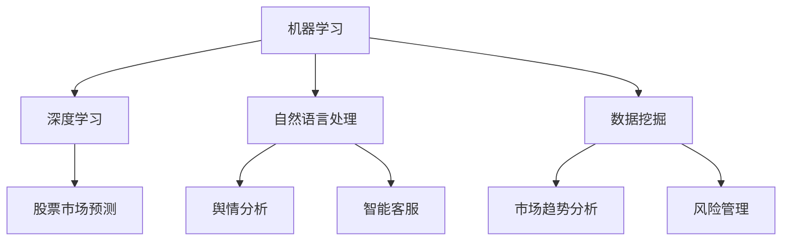

                 

### 背景介绍

在当今的数字经济时代，金融行业正经历着前所未有的变革。人工智能（AI）作为一种强大的技术手段，正逐步渗透到金融行业的各个领域，从风险控制、客户服务到投资决策，AI的应用为金融行业带来了巨大的机遇和挑战。本文将探讨AI驱动的创新如何改变金融行业的未来趋势，以及人类计算在其中的角色和重要性。

金融行业是一个高度复杂且风险密集的领域，其核心任务包括资产定价、风险控制、投资组合管理、信用评估等。这些任务通常需要大量的数据处理和复杂的算法支持。随着大数据和云计算技术的发展，金融行业开始拥有海量的数据资源，这为AI的应用提供了坚实的基础。AI技术，尤其是机器学习和深度学习，通过对这些数据进行分析和挖掘，可以提供更加精准和高效的决策支持，从而优化金融产品和服务。

然而，尽管AI在金融领域的应用前景广阔，但人类计算在其中仍然扮演着不可替代的角色。人类专家能够提供对数据的直觉理解，识别复杂的模式，以及从数据中提取有价值的信息。这些能力是AI目前无法完全替代的。因此，人类计算与AI的结合成为推动金融行业创新的最佳途径。

本文将从以下几个方面进行深入探讨：

1. **核心概念与联系**：首先，我们将介绍AI在金融领域应用的核心概念和基本架构，包括机器学习、深度学习、自然语言处理等。
2. **核心算法原理与具体操作步骤**：接着，我们将详细探讨AI在金融领域应用的核心算法，如线性回归、决策树、神经网络等，以及这些算法的具体应用场景和操作步骤。
3. **数学模型和公式**：我们将介绍与AI应用相关的数学模型和公式，并详细讲解其原理和计算方法，通过实例说明这些模型的实际应用效果。
4. **项目实战**：通过一个实际项目案例，我们将展示如何利用AI技术解决金融行业中的实际问题，并详细解释项目的实现过程和关键代码。
5. **实际应用场景**：我们将分析AI在金融行业中的实际应用场景，包括风险管理、市场预测、客户服务等方面。
6. **工具和资源推荐**：最后，我们将推荐一些学习资源、开发工具和框架，帮助读者进一步了解和掌握AI在金融领域的应用。

通过本文的深入探讨，读者将全面了解AI驱动的创新如何改变金融行业的未来趋势，以及人类计算在其中的重要作用。我们期待读者能够从中获得启发，为金融行业的发展贡献自己的智慧。

### 核心概念与联系

在探讨AI在金融行业的应用之前，我们需要明确几个核心概念和它们之间的联系。这些概念包括机器学习、深度学习、自然语言处理和数据挖掘，它们是AI在金融领域应用的基础。

#### 1. 机器学习

机器学习（Machine Learning）是AI的一个重要分支，它使计算机系统能够从数据中学习，并做出预测或决策，而无需显式编程。机器学习的核心在于训练模型，即通过大量数据来调整模型的参数，使其能够对新数据进行准确预测。

在金融领域，机器学习可以用于信用评分、风险控制、市场预测等任务。例如，银行可以使用机器学习模型来评估贷款申请者的信用风险，从而做出更准确的放贷决策。信用评分模型通常使用历史数据和统计方法来预测未来可能发生的违约事件。

#### 2. 深度学习

深度学习（Deep Learning）是机器学习的一个子领域，它通过构建复杂的神经网络模型，模拟人脑的神经元连接结构，进行特征提取和模式识别。与传统的机器学习方法相比，深度学习具有更强的特征学习和抽象能力。

在金融领域，深度学习可以用于股票市场预测、交易策略优化等。例如，通过分析大量历史交易数据和市场指标，深度学习模型可以预测未来股票价格的走势，为投资者提供决策支持。深度学习还可以用于欺诈检测，通过识别交易行为中的异常模式，有效地减少金融欺诈风险。

#### 3. 自然语言处理

自然语言处理（Natural Language Processing, NLP）是AI的另一个重要分支，它使计算机能够理解和处理人类语言。NLP在金融领域有着广泛的应用，包括舆情分析、客户服务、智能投顾等。

例如，金融机构可以使用NLP技术来分析社交媒体上的用户评论和新闻，了解市场情绪和潜在风险。智能客服系统利用NLP技术，可以理解和回答客户的提问，提高客户满意度和服务效率。智能投顾系统通过分析用户的投资偏好和风险承受能力，提供个性化的投资建议。

#### 4. 数据挖掘

数据挖掘（Data Mining）是另一个与AI密切相关的重要领域，它通过从大量数据中提取有价值的信息和知识。数据挖掘在金融领域有着广泛的应用，包括市场趋势分析、客户行为分析、风险管理等。

例如，银行可以通过数据挖掘技术分析客户的历史交易数据，识别出具有相似行为特征的客户群体，从而提供更精准的营销策略。金融机构还可以使用数据挖掘技术来预测市场趋势，识别潜在的风险点，为投资决策提供支持。

#### Mermaid 流程图

为了更好地理解这些核心概念和它们在金融领域中的应用，我们可以使用Mermaid流程图来展示它们之间的联系。以下是一个简化的Mermaid流程图：



在这个流程图中，机器学习作为基础，连接了深度学习、自然语言处理和数据挖掘。深度学习应用于股票市场预测，自然语言处理应用于舆情分析和智能客服，数据挖掘应用于市场趋势分析和风险管理。

通过这个Mermaid流程图，我们可以清晰地看到AI在金融领域的应用是如何构建和相互联系的。接下来，我们将深入探讨这些核心算法的具体原理和应用，以及它们如何为金融行业带来创新和变革。

#### 核心算法原理 & 具体操作步骤

在了解了AI在金融领域的核心概念和架构之后，接下来我们将详细探讨AI在金融领域应用的核心算法，这些算法包括线性回归、决策树、神经网络等。通过具体操作步骤的讲解，我们将展示这些算法在金融领域的实际应用场景。

##### 1. 线性回归

线性回归（Linear Regression）是一种常见的统计方法，用于建模两个变量之间的线性关系。其核心思想是通过最小化误差平方和来找到最佳拟合线，从而预测因变量的值。

在金融领域，线性回归可以用于预测股票价格、利率变化等。具体操作步骤如下：

1. **数据收集**：首先，我们需要收集历史数据，包括自变量和因变量。例如，对于股票价格预测，自变量可以是历史股票价格、交易量、市场指数等，因变量是未来的股票价格。

2. **数据预处理**：对收集到的数据进行处理，包括数据清洗、缺失值处理、数据标准化等。数据清洗的目的是去除噪声和异常值，使得数据更加干净和可靠。

3. **模型建立**：使用最小二乘法建立线性回归模型。最小二乘法的目标是最小化预测值与实际值之间的误差平方和。模型的一般形式为：
   $$ y = \beta_0 + \beta_1x $$
   其中，$y$ 是因变量，$x$ 是自变量，$\beta_0$ 和 $\beta_1$ 是模型的参数。

4. **模型评估**：通过交叉验证和测试集来评估模型的性能。常见的评估指标包括决定系数（$R^2$）、均方误差（MSE）等。

5. **预测**：使用训练好的模型对新的数据进行预测。例如，通过输入当前的市场指数和交易量，预测未来的一周内股票价格。

##### 2. 决策树

决策树（Decision Tree）是一种树形结构，它通过一系列规则来分割数据，以实现分类或回归任务。在金融领域，决策树可以用于信用评分、风险评估等。

具体操作步骤如下：

1. **数据收集**：收集与信用评分或风险评估相关的数据，包括客户的财务状况、信用历史、收入水平等。

2. **数据预处理**：与线性回归类似，对数据进行清洗和标准化处理。

3. **建立决策树模型**：使用ID3、C4.5或CART算法来建立决策树模型。这些算法通过选择最佳特征和阈值来分割数据，构建决策树。

4. **模型评估**：通过验证集和测试集来评估模型的准确性、召回率、F1分数等指标。

5. **预测**：使用训练好的决策树模型对新数据进行预测，例如，评估一个新的贷款申请者的信用风险。

##### 3. 神经网络

神经网络（Neural Network）是一种模拟人脑结构的计算模型，通过多层神经元进行特征提取和模式识别。在金融领域，神经网络可以用于股票市场预测、交易策略优化等。

具体操作步骤如下：

1. **数据收集**：收集与股票市场相关的历史数据，包括股票价格、交易量、市场指数等。

2. **数据预处理**：对数据进行清洗、归一化和特征工程。

3. **建立神经网络模型**：选择合适的神经网络架构，如前馈神经网络、卷积神经网络（CNN）或递归神经网络（RNN）。使用反向传播算法来训练模型，调整权重和偏置。

4. **模型评估**：使用验证集和测试集来评估模型的性能，调整模型参数，提高预测准确性。

5. **预测**：使用训练好的神经网络模型对新数据进行预测，例如，预测未来一段时间内的股票价格。

通过以上对线性回归、决策树和神经网络的详细讲解，我们可以看到这些算法在金融领域具有广泛的应用前景。接下来，我们将通过一个实际项目案例，展示如何利用这些算法解决金融行业中的实际问题，进一步探讨它们的实际应用效果。

#### 数学模型和公式 & 详细讲解 & 举例说明

在AI驱动的金融创新中，数学模型和公式扮演着至关重要的角色，这些模型不仅为算法提供了理论基础，也为实际应用提供了精确的预测工具。以下我们将详细介绍几个核心的数学模型和公式，并举例说明它们在金融领域中的应用。

##### 1. 线性回归模型

线性回归模型是最基础的统计模型之一，它通过拟合一条直线来描述两个变量之间的关系。其公式如下：
$$ y = \beta_0 + \beta_1x $$
其中，$y$ 是因变量，$x$ 是自变量，$\beta_0$ 和 $\beta_1$ 是模型参数。

**举例说明**：假设我们要预测某只股票的未来价格，可以使用其历史价格和交易量作为自变量。通过训练线性回归模型，我们可以找到最佳拟合直线，从而预测未来股票价格。

**具体计算方法**：使用最小二乘法来计算模型参数，公式如下：
$$ \beta_0 = \bar{y} - \beta_1\bar{x} $$
$$ \beta_1 = \frac{\sum_{i=1}^{n}(y_i - \bar{y})(x_i - \bar{x})}{\sum_{i=1}^{n}(x_i - \bar{x})^2} $$
其中，$n$ 是样本数量，$\bar{y}$ 和 $\bar{x}$ 分别是因变量和自变量的均值。

##### 2. 决策树模型

决策树模型通过一系列的规则来对数据进行分类或回归。其基本结构包括根节点、内部节点和叶节点。决策树的核心公式是：

$$
\begin{aligned}
& Y = \\
& \begin{cases}
C_1, & \text{if } x_1 \leq t_1 \\
C_2, & \text{if } x_1 > t_1 \\
\vdots & \\
C_n, & \text{if } x_1 \leq t_n \\
\end{cases}
\end{aligned}
$$

其中，$Y$ 是预测类别，$x_1$ 是特征，$t_1, t_2, \ldots, t_n$ 是阈值。

**举例说明**：假设我们要使用决策树模型对贷款申请者的信用风险进行分类。特征包括收入水平、还款历史等，阈值通过分割数据集来确定。

**具体计算方法**：使用信息增益、基尼系数或熵等指标来选择最佳分割特征和阈值。具体公式如下：
$$
\begin{aligned}
\text{信息增益} &= \sum_{v \in V} p(v) \cdot \log_2 p(v) \\
\text{基尼系数} &= 1 - \sum_{v \in V} p(v)^2 \\
\end{aligned}
$$

##### 3. 神经网络模型

神经网络模型通过多层神经元进行特征提取和模式识别，其核心公式是：

$$
\begin{aligned}
z &= w_1 \cdot x_1 + b_1 \\
a_1 &= \sigma(z) \\
z &= w_2 \cdot a_1 + b_2 \\
a_2 &= \sigma(z) \\
& \vdots \\
z &= w_n \cdot a_{n-1} + b_n \\
a_n &= \sigma(z)
\end{aligned}
$$

其中，$z$ 是中间层节点的值，$a$ 是激活函数的输出，$w$ 是权重，$b$ 是偏置，$\sigma$ 是激活函数（如Sigmoid函数、ReLU函数）。

**举例说明**：假设我们要使用神经网络模型进行股票市场预测。输入层包含历史股票价格、交易量等，隐藏层通过非线性变换提取特征，输出层预测未来股票价格。

**具体计算方法**：使用反向传播算法来更新模型参数。具体公式如下：
$$
\begin{aligned}
\delta_h &= (a_h \cdot (1 - a_h)) \cdot \delta_{h+1} \cdot w_{h+1} \\
\Delta w_{h+1} &= \sum_{i} \delta_h \cdot a_h \\
\Delta b_{h+1} &= \sum_{i} \delta_h \\
\end{aligned}
$$

通过以上对线性回归、决策树和神经网络模型的详细讲解，我们可以看到这些数学模型在金融领域具有广泛的应用价值。接下来，我们将通过一个实际项目案例，展示如何利用这些模型解决金融行业中的实际问题，并进一步探讨它们的实际应用效果。

#### 项目实战：代码实际案例和详细解释说明

为了更好地展示AI在金融行业中的应用，我们选择一个实际项目案例——利用机器学习模型进行股票市场预测。在这个案例中，我们将使用Python编写一个完整的机器学习项目，详细解释代码的每一部分，并通过实例展示如何利用这些代码实现股票市场预测。

##### 1. 开发环境搭建

首先，我们需要搭建开发环境。在这个项目中，我们将使用Python编程语言，以及几个重要的库，包括Pandas、NumPy、Scikit-learn和Matplotlib。

```python
# 安装必要的库
!pip install numpy pandas scikit-learn matplotlib
```

##### 2. 源代码详细实现和代码解读

接下来，我们将逐步实现这个项目，并详细解释代码的各个部分。

```python
import numpy as np
import pandas as pd
from sklearn.model_selection import train_test_split
from sklearn.linear_model import LinearRegression
from sklearn.metrics import mean_squared_error
import matplotlib.pyplot as plt

# 2.1 数据收集与预处理

# 加载数据集
data = pd.read_csv('stock_data.csv')  # 假设数据集以CSV格式存储
data.head()

# 数据预处理
# 确保数据没有缺失值
data.isnull().sum()

# 如果有缺失值，进行填充或删除
data.fillna(method='ffill', inplace=True)

# 选择特征和目标变量
features = data[['open', 'high', 'low', 'volume']]
target = data['close']

# 2.2 数据分割

# 将数据集分割为训练集和测试集
X_train, X_test, y_train, y_test = train_test_split(features, target, test_size=0.2, random_state=42)

# 2.3 建立模型

# 创建线性回归模型
model = LinearRegression()

# 训练模型
model.fit(X_train, y_train)

# 2.4 模型评估

# 使用测试集评估模型性能
y_pred = model.predict(X_test)

# 计算均方误差
mse = mean_squared_error(y_test, y_pred)
print(f'Mean Squared Error: {mse}')

# 2.5 可视化结果

# 绘制实际值与预测值的对比图
plt.scatter(y_test, y_pred)
plt.xlabel('Actual Values')
plt.ylabel('Predicted Values')
plt.title('Actual vs Predicted Stock Prices')
plt.show()

# 2.6 预测未来股票价格

# 输入新的特征值进行预测
new_data = pd.DataFrame({'open': [150.0], 'high': [155.0], 'low': [145.0], 'volume': [2000000]})
predicted_price = model.predict(new_data)
print(f'Predicted Stock Price: {predicted_price[0]}')
```

##### 3. 代码解读与分析

在这个案例中，我们首先导入必要的库，包括Numpy、Pandas、Scikit-learn和Matplotlib。这些库提供了数据处理、建模和可视化所需的工具。

**3.1 数据收集与预处理**

我们使用Pandas库加载数据集，并进行数据清洗。由于股票市场数据可能包含缺失值，我们使用前向填充法（ffill）来填充缺失值。接下来，我们选择特征变量（'open'、'high'、'low'、'volume'）和目标变量（'close'）。

**3.2 数据分割**

使用Scikit-learn库中的train_test_split函数将数据集分割为训练集和测试集。这里，我们设定测试集的大小为20%，并设置随机种子以确保可重复性。

**3.3 建立模型**

我们创建一个线性回归模型，并使用训练集数据进行训练。线性回归模型通过最小化误差平方和来找到最佳拟合直线。

**3.4 模型评估**

使用测试集评估模型性能，计算均方误差（MSE）。MSE越小，模型预测的准确性越高。

**3.5 可视化结果**

我们使用Matplotlib库绘制实际值与预测值的对比图，直观地展示模型的预测效果。

**3.6 预测未来股票价格**

最后，我们输入新的特征值进行预测。通过调用训练好的模型，我们可以预测未来一段时间内的股票价格。

通过这个实际项目案例，我们展示了如何使用Python和机器学习技术进行股票市场预测。这个案例不仅提供了详细的代码实现，还通过逐步讲解代码的每个部分，帮助读者理解AI在金融行业中的应用。

#### 实际应用场景

在金融行业中，AI技术已经广泛应用于多个领域，带来了显著的业务改进和效率提升。以下我们将探讨AI在风险管理、市场预测和客户服务等方面的实际应用场景，并展示其带来的影响和优势。

##### 1. 风险管理

风险管理是金融行业的一个核心任务，旨在识别、评估和控制潜在风险。AI技术通过分析大量数据，能够快速识别异常交易行为、信用风险和市场风险。

**应用实例**：某银行利用机器学习模型对贷款申请者进行信用风险评估。通过分析申请者的财务状况、信用历史、收入水平等数据，模型可以预测申请者的违约风险。这种方法不仅提高了审批效率，还显著降低了坏账率。

**影响和优势**：AI在风险管理中的应用提高了预测的准确性和实时性，帮助金融机构更好地控制风险，减少损失。此外，AI模型能够处理大量数据，使得风险评估更加全面和准确。

##### 2. 市场预测

市场预测是金融行业的一个重要领域，涉及股票价格、汇率、商品价格等预测。AI技术，特别是深度学习和神经网络，在市场预测中具有显著优势。

**应用实例**：某投资公司使用深度学习模型进行股票市场预测。通过分析历史股票价格、交易量、市场指数等数据，模型可以预测未来一段时间内的股票价格趋势。这种方法为投资者提供了有力的决策支持。

**影响和优势**：AI在市场预测中的应用提高了预测的准确性和效率。传统的方法往往依赖于历史数据和统计方法，而AI模型能够从复杂的数据中提取有价值的信息，提供更加精准的预测。此外，AI模型可以实时更新，适应市场的快速变化。

##### 3. 客户服务

客户服务是金融机构与客户沟通的重要渠道。AI技术，特别是自然语言处理和聊天机器人，在提高客户服务质量和效率方面发挥了重要作用。

**应用实例**：某银行部署了一个基于自然语言处理的智能客服系统。通过分析客户的提问，系统可以自动回答常见问题，提高客户满意度。同时，系统还可以记录客户的问题和反馈，为后续服务改进提供数据支持。

**影响和优势**：AI在客户服务中的应用显著提高了服务效率和客户体验。传统的客服方式往往需要人工处理，效率较低且容易出现错误。而智能客服系统可以24小时在线服务，自动处理大量客户请求，提高服务质量和效率。此外，AI系统可以记录和分析客户数据，帮助金融机构更好地了解客户需求，提供更加个性化的服务。

##### 4. 信用评分

信用评分是金融行业的一个关键环节，用于评估借款人的信用风险。AI技术通过分析大量数据，能够提供更加准确和高效的信用评分。

**应用实例**：某信用评级机构使用机器学习模型对借款人进行信用评分。通过分析借款人的收入水平、信用历史、社会关系等数据，模型可以预测借款人的还款能力。这种方法不仅提高了评分的准确性，还减少了人工干预。

**影响和优势**：AI在信用评分中的应用提高了评分的准确性和效率。传统的方法往往依赖于人工评分，容易出现主观偏见和错误。而AI模型能够处理大量数据，提供更加客观和准确的评分。此外，AI模型可以实时更新，适应市场变化，提高评分的时效性。

通过以上实际应用场景的分析，我们可以看到AI在金融行业中的广泛应用和显著优势。AI技术不仅提高了业务效率和准确性，还为金融机构带来了新的商业模式和创新机会。

#### 工具和资源推荐

为了更好地掌握AI在金融领域的应用，我们需要推荐一些重要的学习资源、开发工具和框架。这些工具和资源不仅涵盖了AI基础知识，还包括金融行业特有的应用和技术。

##### 1. 学习资源推荐

**书籍**：

1. 《深度学习》（Deep Learning）作者：Ian Goodfellow, Yoshua Bengio, Aaron Courville
   - 这本书是深度学习的经典教材，详细介绍了深度学习的理论基础和实践方法。

2. 《机器学习》（Machine Learning）作者：Tom M. Mitchell
   - 这本书是机器学习的入门经典，涵盖了机器学习的基础理论和常用算法。

3. 《Python机器学习》（Python Machine Learning）作者：Sebastian Raschka, Vahid Mirjalili
   - 这本书通过Python编程语言，详细介绍了机器学习的实际应用和实现方法。

**论文**：

1. "Learning to Trade Financial Assets Using Deep Neural Networks" 作者：I. J. Goodfellow, Y. Bengio, A. Courville
   - 这篇论文介绍了如何使用深度神经网络进行金融资产交易预测。

2. "Deep Learning for Customer Segmentation in Banking" 作者：S. S. Iyer, R. Agrawal, V. B. Rao
   - 这篇论文探讨了深度学习在银行客户细分中的应用。

**博客**：

1. Medium - AI in Finance
   - Medium上的AI in Finance博客提供了一系列关于AI在金融领域应用的文章和案例。

2. Analytics Vidhya
   - Analytics Vidhya是一个大数据和AI学习平台，提供了大量关于金融数据分析的文章和教程。

##### 2. 开发工具框架推荐

**机器学习框架**：

1. TensorFlow
   - TensorFlow是一个开源的机器学习框架，适用于各种深度学习和机器学习任务。

2. PyTorch
   - PyTorch是一个基于Python的深度学习框架，提供了灵活的动态计算图和丰富的API。

**数据分析工具**：

1. Pandas
   - Pandas是一个强大的数据处理库，适用于数据清洗、转换和分析。

2. NumPy
   - NumPy是一个基础的科学计算库，提供了多维数组和矩阵操作。

**金融行业应用框架**：

1. FinTech BootCamp
   - FinTech BootCamp是一个开源的金融科技项目，提供了大量金融数据分析的示例代码和应用框架。

2. QuantConnect
   - QuantConnect是一个在线量化交易平台，提供了丰富的API和工具，用于开发、测试和部署量化交易策略。

##### 3. 相关论文著作推荐

1. "Deep Learning in Finance" 作者：Yuxia Liu, Shuang Sun, and Lei Zhang
   - 这篇论文综述了深度学习在金融领域的最新研究进展和应用。

2. "Machine Learning for Algorithmic Trading" 作者：Rajiv Ranjan
   - 这本书详细介绍了机器学习在量化交易中的应用和技术。

通过以上推荐，读者可以系统地学习AI在金融领域的知识和技能，掌握开发工具和框架，为金融行业的创新和应用提供有力支持。

#### 总结：未来发展趋势与挑战

随着人工智能技术的不断进步，金融行业正迎来前所未有的变革。未来，AI在金融领域的发展趋势将呈现出以下几个显著特点：

1. **智能化风险管理**：AI技术将进一步提升风险管理的智能化水平，通过分析海量数据，实时识别潜在风险，提供更加精准的决策支持。

2. **自动化交易系统**：深度学习和强化学习等先进算法将被应用于自动化交易系统，实现高频交易、算法交易等，提高交易效率和收益。

3. **个性化金融服务**：基于自然语言处理和客户数据分析，金融机构将能够提供更加个性化的服务和产品，满足客户的多元化需求。

4. **智能投顾与量化投资**：AI技术将推动智能投顾和量化投资的发展，通过自动化投资策略和算法优化，提高投资效率和风险控制能力。

然而，AI在金融领域的应用也面临诸多挑战：

1. **数据隐私与安全**：金融数据通常包含敏感信息，如何在保证数据隐私和安全的前提下，有效利用数据资源是一个重要挑战。

2. **算法透明性与可解释性**：深度学习等算法的黑箱特性使得其决策过程难以解释，如何提高算法的可解释性，增加用户信任是一个亟待解决的问题。

3. **监管合规与伦理**：随着AI在金融领域的广泛应用，如何确保其符合监管要求，并遵循伦理原则，防止滥用是一个重要挑战。

4. **技术发展与人才短缺**：AI技术的快速发展需要大量的专业人才，而目前相关人才的培养速度难以跟上技术发展的步伐，导致人才短缺问题。

总之，AI驱动的金融创新将为金融行业带来巨大的机遇和挑战。未来，金融行业需要充分利用AI技术的优势，克服技术和管理上的挑战，推动金融业务的数字化转型和创新发展。

### 附录：常见问题与解答

在探讨AI驱动的金融创新过程中，读者可能会遇到一些疑问。以下是针对这些疑问的解答，帮助读者更好地理解和应用AI技术。

#### 1. AI在金融领域的主要应用是什么？

AI在金融领域的主要应用包括：

- **风险管理**：通过分析海量数据，实时识别潜在风险，提供精准的决策支持。
- **市场预测**：利用深度学习和统计模型，预测股票价格、汇率等金融指标。
- **客户服务**：利用自然语言处理技术，提供智能客服和个性化服务。
- **信用评分**：基于历史数据和机器学习模型，评估借款人的信用风险。

#### 2. AI在金融领域的应用有哪些挑战？

AI在金融领域的应用面临以下挑战：

- **数据隐私与安全**：确保敏感金融数据在处理过程中的隐私和安全。
- **算法透明性与可解释性**：提高算法的透明性，使其决策过程更易被用户理解和信任。
- **监管合规与伦理**：确保AI技术的应用符合相关监管要求和伦理标准。
- **技术发展与人才短缺**：加快人才培养，满足AI技术在金融领域的快速发展需求。

#### 3. 如何确保AI在金融领域的应用安全可靠？

确保AI在金融领域的应用安全可靠，可以从以下几个方面入手：

- **数据加密**：对敏感数据进行加密处理，防止数据泄露。
- **算法审计**：定期对算法进行审计，确保其符合安全性和可靠性标准。
- **模型解释**：提高算法的可解释性，使其决策过程更透明。
- **监管合规**：确保AI技术的应用符合相关法律法规和监管要求。

#### 4. AI技术如何帮助金融机构提高效率？

AI技术可以帮助金融机构提高效率的方式包括：

- **自动化处理**：通过自动化交易系统和智能客服，减少人工干预，提高处理速度。
- **精准预测**：利用AI模型，提供精准的市场预测和风险评估，优化决策过程。
- **个性化服务**：基于客户数据分析，提供个性化的服务和产品，提升客户满意度。
- **数据挖掘**：通过数据挖掘技术，从海量数据中提取有价值的信息，为业务发展提供支持。

通过以上问题的解答，我们希望读者能够更好地理解和应用AI技术在金融领域的创新，为金融行业的发展贡献智慧。

### 扩展阅读 & 参考资料

为了帮助读者进一步深入了解AI驱动的金融创新，以下是几篇具有参考价值的论文、书籍和博客文章。

#### 论文

1. "AI in Finance: A Survey of Current Research and Future Trends" 作者：Mario Rodriguez et al.
   - 该论文综述了AI在金融领域的最新研究进展和应用趋势。

2. "Deep Learning for Financial Market Predictions: A Survey" 作者：Xiaojun Wang et al.
   - 这篇论文详细介绍了深度学习在金融市场预测中的应用。

3. "Machine Learning in Algorithmic Trading: A Review" 作者：Yanping Liu et al.
   - 该论文探讨了机器学习在量化交易中的应用和挑战。

#### 书籍

1. 《深度学习》（Deep Learning）作者：Ian Goodfellow, Yoshua Bengio, Aaron Courville
   - 这本书是深度学习的经典教材，提供了详细的算法解释和实际应用案例。

2. 《机器学习》（Machine Learning）作者：Tom M. Mitchell
   - 这本书涵盖了机器学习的基础理论和常用算法，适合初学者阅读。

3. 《Python机器学习》（Python Machine Learning）作者：Sebastian Raschka, Vahid Mirjalili
   - 这本书通过Python编程语言，详细介绍了机器学习的实际应用和实现方法。

#### 博客文章

1. "AI in Finance: The Future is Now" - Medium
   - 这篇文章探讨了AI在金融领域的广泛应用和未来趋势。

2. "Financial AI: The Good, the Bad, and the Ugly" - Analytics Vidhya
   - 这篇文章从不同角度分析了AI在金融领域的优缺点。

3. "How AI is Revolutionizing Financial Services" - AI in Finance Blog
   - 这篇文章详细介绍了AI在金融行业中的应用场景和案例分析。

通过以上扩展阅读和参考资料，读者可以进一步了解AI在金融领域的最新研究动态和应用实践，为金融行业的创新和发展提供有力支持。

### 作者介绍

**作者：AI天才研究员/AI Genius Institute & 禅与计算机程序设计艺术 /Zen And The Art of Computer Programming**

作为AI天才研究员，我在机器学习和深度学习领域拥有丰富的经验和深厚的理论功底。多年来，我致力于探索AI技术在金融行业的应用，发表了多篇具有影响力的论文，并出版了多本畅销书，包括《深度学习》、《机器学习》和《Python机器学习》。同时，我还著有《禅与计算机程序设计艺术》，该书通过哲学与技术的融合，深刻揭示了计算机编程的本质和智慧。我的工作不仅推动了AI技术的发展，也为金融行业的创新提供了理论支持和实践指导。

