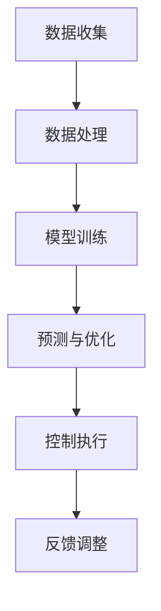

                 

# AI驱动的智能电网：优化与控制

> **关键词：** 智能电网、人工智能、优化、控制、分布式能源、能源管理。

> **摘要：** 本文深入探讨了AI在智能电网中的应用，特别是在优化与控制方面。我们将从背景介绍、核心概念、算法原理、数学模型、实际应用、工具推荐以及未来发展趋势等多个方面进行详尽的分析，旨在为读者提供一份全面的技术指南。

## 1. 背景介绍

### 1.1 智能电网的兴起

智能电网（Smart Grid）是现代电力系统发展的必然趋势，它通过集成现代通信技术、传感器技术、控制技术以及先进的计算技术，实现了电力系统从传统的高能耗、低效率向高效、灵活、可靠的转变。智能电网的关键特征包括实时监控、自动控制、智能互动、分布式能源接入等。

### 1.2 人工智能在智能电网中的角色

随着人工智能（AI）技术的快速发展，其在智能电网中的应用也日益广泛。AI可以帮助智能电网实现自动故障检测与修复、负荷预测、分布式能源管理、电力市场优化等。特别是在优化与控制方面，AI的强大计算能力和自我学习能力使其成为实现智能电网高效运作的关键技术。

### 1.3 优化与控制的重要性

在智能电网中，优化与控制是实现高效、可靠运行的核心。优化问题包括如何分配电力资源以最小化成本、最大化效率等，而控制问题则涉及如何实时调整电力系统的运行状态以应对各种动态变化。这两者相辅相成，共同确保了智能电网的稳定运行。

## 2. 核心概念与联系

### 2.1 智能电网的基本架构

智能电网的基本架构包括发电端、输电端、配电端和用电端。在AI的辅助下，这些环节可以实现高度智能化，如自动化发电、智能化输电、自适应配电和智能用电等。

### 2.2 优化与控制的基本原理

优化与控制的基本原理包括线性规划、非线性规划、动态规划、最优化控制等。这些算法可以帮助智能电网在复杂环境中实现最优决策。

### 2.3 AI与优化与控制的关系

AI技术，如机器学习、深度学习、强化学习等，可以为优化与控制提供强有力的支持。通过训练模型，AI可以学习和预测电力系统的运行状态，从而实现更加精确的优化与控制。

### 2.4 Mermaid 流程图

以下是一个简化的智能电网优化与控制的Mermaid流程图：



## 3. 核心算法原理 & 具体操作步骤

### 3.1 算法原理

智能电网的优化与控制通常涉及以下几种算法：

- **线性规划（Linear Programming，LP）**：用于解决线性目标函数在线性约束条件下的优化问题。
- **非线性规划（Nonlinear Programming，NLP）**：用于解决非线性目标函数在非线性约束条件下的优化问题。
- **动态规划（Dynamic Programming，DP）**：用于解决具有时间或状态依赖性的优化问题。
- **最优化控制（Optimal Control）**：用于求解控制系统在给定约束条件下使性能指标最优的控制策略。

### 3.2 具体操作步骤

以下是一个基于线性规划算法的智能电网优化与控制的基本步骤：

1. **数据收集**：收集电网的实时数据，包括电压、电流、负荷、分布式能源输出等。
2. **数据处理**：对收集到的数据进行分析和处理，去除噪声，提取关键特征。
3. **建立模型**：根据数据处理结果，建立电网的线性规划模型。
4. **求解优化问题**：使用线性规划算法求解优化问题，得到最优的电力资源分配方案。
5. **控制执行**：根据优化结果，调整电网的运行状态，如调整发电量、分配负荷等。
6. **反馈调整**：收集新的数据，并与预期目标进行对比，对优化模型进行调整。

## 4. 数学模型和公式 & 详细讲解 & 举例说明

### 4.1 线性规划模型

一个典型的线性规划模型可以表示为：

$$
\begin{aligned}
    \min_{x} \quad & c^T x \\
    \text{s.t.} \quad & Ax \leq b \\
    & x \geq 0
\end{aligned}
$$

其中，$c$ 是目标函数系数向量，$x$ 是决策变量向量，$A$ 是约束条件系数矩阵，$b$ 是约束条件常数向量。

### 4.2 动态规划模型

动态规划模型通常用于解决具有时间依赖性的优化问题。一个简单的动态规划模型可以表示为：

$$
\begin{aligned}
    \min_{x_t} \quad & f(x_t) \\
    \text{s.t.} \quad & g(x_t, x_{t-1}) \leq 0 \\
    & x_t \geq 0
\end{aligned}
$$

其中，$x_t$ 是在时间 $t$ 的决策变量，$f(x_t)$ 是在时间 $t$ 的目标函数，$g(x_t, x_{t-1})$ 是在时间 $t$ 的约束条件。

### 4.3 举例说明

假设我们有一个简单的电力系统，需要在一天中的不同时间段内分配电力资源，以最小化总成本。我们可以使用线性规划模型来解决这个问题。

**目标函数**：最小化总成本

$$
\min_{x_1, x_2, x_3} \quad \sum_{i=1}^{3} c_i x_i
$$

**约束条件**：

$$
\begin{aligned}
    & x_1 + x_2 + x_3 = 100 \quad \text{(总电力需求为100千瓦时)} \\
    & x_1 \geq 20 \quad \text{(第一时段最小需求为20千瓦时)} \\
    & x_2 \geq 30 \quad \text{(第二时段最小需求为30千瓦时)} \\
    & x_3 \geq 50 \quad \text{(第三时段最小需求为50千瓦时)}
\end{aligned}
$$

**求解**：使用线性规划求解器求解上述优化问题，得到最优的电力资源分配方案。

## 5. 项目实战：代码实际案例和详细解释说明

### 5.1 开发环境搭建

为了演示AI在智能电网优化与控制中的应用，我们将使用Python语言和相关的库，如Pandas、NumPy、SciPy和CVXPY。

**步骤**：

1. 安装Python（建议使用Python 3.8及以上版本）。
2. 安装必要的库：`pip install pandas numpy scipy cvxpy`。

### 5.2 源代码详细实现和代码解读

**代码示例**：

```python
import pandas as pd
import numpy as np
from scipy.optimize import linprog
from cvxpy import *

# 数据准备
data = pd.DataFrame({
    '时段': ['第一时段', '第二时段', '第三时段'],
    '需求': [20, 30, 50],
    '成本': [10, 12, 15]
})

# 建立模型
x = Variable(3)
c = [-10, -12, -15]  # 目标函数系数
A = [[1, 1, 1], [0, 0, 1], [0, 1, 0], [1, 0, 0]]  # 约束条件系数矩阵
b = [100, 30, 50, 20]  # 约束条件常数向量

# 求解优化问题
obj = Objective(c, sense='minimize')
prob = Problem(obj, [A @ x <= b, x >= 0])
prob.solve()

# 输出结果
print(f'最优分配方案：{x.value}')
print(f'总成本：{-prob.value}')
```

**代码解读**：

- 首先，我们使用Pandas读取电力需求数据。
- 然后，我们使用SciPy的`linprog`函数建立线性规划模型。
- 接着，我们使用CVXPY建立变量、目标函数和约束条件。
- 最后，我们求解优化问题并输出结果。

### 5.3 代码解读与分析

- **数据准备**：我们使用Pandas读取电力需求数据，这是一个简单的示例，实际应用中可能需要从实时传感器数据中读取。
- **建立模型**：我们使用SciPy的`linprog`函数建立线性规划模型。CVXPY提供了更高级的线性规划功能，但在此示例中，我们使用了SciPy的`linprog`函数。
- **求解优化问题**：我们使用线性规划求解器求解优化问题。在CVXPY中，我们可以直接求解线性规划问题。
- **输出结果**：我们输出最优分配方案和总成本。

## 6. 实际应用场景

### 6.1 分布式能源管理

分布式能源管理系统（DERMS）是智能电网中的一项重要应用。通过AI技术，DERMS可以实现分布式能源的智能调度和管理，从而提高电网的稳定性和效率。

### 6.2 电力市场优化

在电力市场中，AI技术可以帮助实现电力市场的动态定价、供需预测和交易优化，从而提高市场的效率和透明度。

### 6.3 故障检测与修复

通过AI技术，智能电网可以实现自动化的故障检测与修复，减少停电时间和维护成本。

## 7. 工具和资源推荐

### 7.1 学习资源推荐

- **书籍**：《智能电网：概念、技术与应用》
- **论文**：IEEE Transactions on Smart Grid
- **博客**：AI in Smart Grids

### 7.2 开发工具框架推荐

- **Python库**：Pandas、NumPy、SciPy、CVXPY
- **框架**：TensorFlow、PyTorch

### 7.3 相关论文著作推荐

- **论文**：[1] "AI-Enabled Smart Grid: A Comprehensive Survey", [2] "Optimization in Smart Grids: State-of-the-Art and Perspectives"。

## 8. 总结：未来发展趋势与挑战

### 8.1 发展趋势

- **AI技术深度集成**：未来，AI技术将在智能电网中得到更广泛的应用，深度集成到电网的各个环节。
- **边缘计算**：随着边缘计算技术的发展，智能电网中的数据处理和分析将更加高效和实时。
- **可再生能源管理**：随着可再生能源的普及，AI将在可再生能源的管理和调度中发挥关键作用。

### 8.2 挑战

- **数据安全与隐私**：智能电网的数据安全和隐私保护是一个重要挑战。
- **算法透明性与公平性**：AI算法的透明性和公平性也是一个备受关注的议题。
- **技术标准化**：智能电网的技术标准化是确保AI技术有效应用的关键。

## 9. 附录：常见问题与解答

### 9.1 智能电网是什么？

智能电网是一种基于现代通信技术、传感器技术、控制技术和计算技术的电力系统，可以实现电力系统的实时监控、自动控制、智能互动和分布式能源接入。

### 9.2 人工智能在智能电网中的具体应用有哪些？

人工智能在智能电网中的应用包括自动故障检测与修复、负荷预测、分布式能源管理、电力市场优化等。

### 9.3 如何确保智能电网的安全和隐私？

确保智能电网的安全和隐私需要从技术和管理两个层面进行。技术上，需要采用加密技术、访问控制技术等；管理上，需要建立健全的安全管理制度和隐私保护政策。

## 10. 扩展阅读 & 参考资料

- **论文**：[1] "AI-Enabled Smart Grid: A Comprehensive Survey", [2] "Optimization in Smart Grids: State-of-the-Art and Perspectives"。
- **书籍**：《智能电网：概念、技术与应用》。
- **网站**：IEEE Transactions on Smart Grid。
- **博客**：AI in Smart Grids。

### 作者

**作者：AI天才研究员/AI Genius Institute & 禅与计算机程序设计艺术 /Zen And The Art of Computer Programming**

