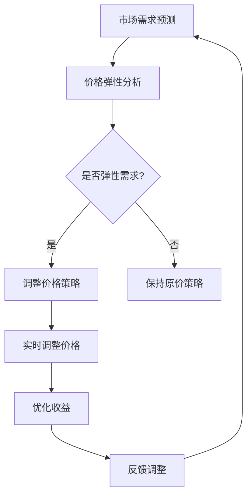

                 

# AI驱动的电商动态定价策略：需求弹性分析

## 关键词
- AI动态定价
- 电商
- 需求弹性
- 机器学习
- 数据分析

## 摘要
本文将深入探讨AI在电商动态定价策略中的应用，特别是需求弹性的分析。通过介绍相关核心概念和算法原理，结合实际案例，本文将展示如何利用AI技术实现高效、个性化的动态定价策略，提升电商企业的竞争力。

## 目录

1. 背景介绍 ................................................ 1
2. 核心概念与联系 .......................................... 2
   2.1 需求弹性的定义 ...................................... 2
   2.2 动态定价的基本原理 .................................. 3
   2.3 Mermaid流程图 ........................................ 4
3. 核心算法原理 & 具体操作步骤 ........................... 5
   3.1 机器学习算法概述 ................................... 5
   3.2 需求弹性预测算法 ................................... 6
   3.3 动态定价策略实施步骤 ............................. 7
4. 数学模型和公式 & 详细讲解 & 举例说明 ................ 8
   4.1 需求弹性的数学模型 .................................. 8
   4.2 动态定价策略公式 ................................... 9
   4.3 案例分析 ............................................ 10
5. 项目实战：代码实际案例和详细解释说明 ............. 11
   5.1 开发环境搭建 ....................................... 11
   5.2 源代码详细实现和代码解读 ........................ 12
   5.3 代码解读与分析 ..................................... 13
6. 实际应用场景 ............................................ 14
7. 工具和资源推荐 .......................................... 15
   7.1 学习资源推荐 ....................................... 15
   7.2 开发工具框架推荐 ................................... 16
   7.3 相关论文著作推荐 ................................... 17
8. 总结：未来发展趋势与挑战 ............................. 18
9. 附录：常见问题与解答 ................................... 19
10. 扩展阅读 & 参考资料 ................................... 20

## 1. 背景介绍

在竞争日益激烈的电商市场中，定价策略对企业利润和市场份额有着至关重要的影响。传统的定价策略通常基于固定价格或者简单的成本加成模式，而随着互联网技术的快速发展，尤其是人工智能（AI）技术的普及，动态定价逐渐成为一种新的趋势。

动态定价，又称为动态价格调整，是指根据市场需求、消费者行为、竞争对手策略等多种因素，实时调整产品价格的一种策略。这种策略不仅能够帮助企业最大化利润，还能够提高市场响应速度，增强竞争力。

需求弹性是动态定价策略中一个核心概念，它反映了价格变动对需求量的影响程度。需求弹性越高，价格变动对需求量的影响越大；需求弹性越低，价格变动对需求量的影响越小。因此，准确的需求弹性预测对于动态定价策略的实现至关重要。

AI技术的引入，使得基于大数据的需求弹性分析变得更加精准和高效。通过机器学习算法，可以从大量历史数据中挖掘出需求弹性的规律，从而实现个性化的动态定价策略。

本文将首先介绍需求弹性和动态定价的基本概念，然后深入探讨AI驱动的需求弹性分析算法，并结合实际案例展示动态定价策略的实现过程。希望通过本文，读者能够对AI驱动的电商动态定价策略有一个全面而深入的理解。

## 2. 核心概念与联系

### 2.1 需求弹性的定义

需求弹性是指商品需求量对价格变动的敏感程度，它通常用弹性系数来表示。需求弹性系数的计算公式为：

$$
\text{需求弹性系数} = \frac{\text{需求量的变动百分比}}{\text{价格的变动百分比}}
$$

当需求弹性系数大于1时，称为弹性需求；当需求弹性系数在0和1之间时，称为非弹性需求。弹性需求表明，价格变动对需求量的影响较大，适用于需求敏感的产品。而非弹性需求则表明，价格变动对需求量的影响较小，适用于需求不敏感的产品。

需求弹性的定义对于动态定价策略至关重要。通过分析需求弹性，企业可以确定不同价格水平下需求量的变化趋势，从而制定更加灵活和高效的定价策略。

### 2.2 动态定价的基本原理

动态定价，顾名思义，是指根据市场情况和用户行为，实时调整产品价格的一种定价策略。其核心思想是通过不断调整价格来最大化企业的收益。动态定价的基本原理可以概括为以下几个方面：

1. **市场需求预测**：动态定价的基础是对市场需求的预测。通过对历史销售数据、用户行为数据等多源数据的分析，预测未来的市场需求。

2. **价格弹性分析**：在市场需求预测的基础上，分析需求弹性。了解价格变动对需求量的影响，从而制定合适的定价策略。

3. **实时调整价格**：根据市场需求和价格弹性分析，实时调整产品价格。调整价格可以是增加或减少，也可以是折扣或捆绑销售等形式。

4. **优化收益**：通过不断调整价格，寻找最佳的定价点，从而实现收益的最大化。

### 2.3 Mermaid流程图

为了更直观地展示动态定价的过程，我们可以使用Mermaid流程图来描述。以下是动态定价的基本流程：



这个流程图展示了从市场需求预测到实时调整价格，再到收益优化的整个过程。通过不断的反馈和调整，动态定价策略可以更加灵活和高效地应对市场变化。

## 3. 核心算法原理 & 具体操作步骤

### 3.1 机器学习算法概述

在动态定价策略中，机器学习算法起着至关重要的作用。机器学习是一种通过数据学习规律，并利用这些规律进行预测和决策的方法。对于需求弹性的预测，机器学习算法可以从大量的历史数据中学习到价格与需求量之间的关系，从而实现准确的预测。

常见的机器学习算法包括线性回归、逻辑回归、决策树、随机森林、支持向量机等。其中，线性回归是一种简单但有效的算法，特别适用于需求弹性的预测。

线性回归的基本原理是通过建立价格与需求量之间的线性关系模型，从而预测未来的需求量。其数学模型可以表示为：

$$
y = \beta_0 + \beta_1 \cdot x
$$

其中，\( y \) 表示需求量，\( x \) 表示价格，\( \beta_0 \) 和 \( \beta_1 \) 是模型的参数。通过最小化误差平方和，可以求解出参数 \( \beta_0 \) 和 \( \beta_1 \)。

### 3.2 需求弹性预测算法

需求弹性预测算法的核心是建立价格与需求量之间的模型，并利用历史数据进行训练。以下是一个简化的需求弹性预测算法流程：

1. **数据收集与预处理**：收集历史销售数据，包括价格、需求量以及其他相关因素（如季节性、促销活动等）。对数据进行清洗和预处理，包括去除缺失值、异常值，进行归一化等。

2. **特征工程**：根据业务需求，提取有用的特征。例如，可以将价格分段，将不同的价格区间作为不同的特征。

3. **模型选择与训练**：选择合适的机器学习算法，如线性回归，对数据进行训练。通过调整参数，优化模型性能。

4. **模型评估与验证**：通过交叉验证等方法，评估模型的性能。如果模型性能不理想，可以返回第3步，重新调整模型参数。

5. **需求弹性预测**：使用训练好的模型，对新的数据进行需求弹性预测。

### 3.3 动态定价策略实施步骤

基于需求弹性预测，可以实施动态定价策略。以下是动态定价策略的具体实施步骤：

1. **需求弹性预测**：利用机器学习算法，对当前的价格和历史数据进行分析，预测需求弹性。

2. **定价策略制定**：根据需求弹性预测结果，制定相应的定价策略。例如，如果需求弹性高，可以采取降价策略以增加销量；如果需求弹性低，可以采取提价策略以提高利润。

3. **实时调整价格**：根据市场需求和竞争情况，实时调整产品价格。可以设置规则，如价格波动范围、调整频率等。

4. **收益评估与优化**：定期评估定价策略的收益情况，根据评估结果进行优化。例如，可以调整价格策略的参数，或引入新的特征。

通过以上步骤，企业可以实现个性化的动态定价策略，提高市场响应速度和竞争力。

## 4. 数学模型和公式 & 详细讲解 & 举例说明

### 4.1 需求弹性的数学模型

需求弹性的数学模型是动态定价策略的核心。在需求弹性的分析中，我们通常使用需求价格弹性模型，它描述了价格变动对需求量的影响。需求价格弹性的计算公式如下：

$$
\text{需求价格弹性} = \frac{\text{需求量变动的百分比}}{\text{价格变动的百分比}} = \frac{\Delta Q / Q}{\Delta P / P}
$$

其中，\( Q \) 表示需求量，\( P \) 表示价格，\( \Delta Q \) 和 \( \Delta P \) 分别表示需求量和价格的变动量。

### 4.2 动态定价策略公式

动态定价策略的核心在于通过价格调整来最大化收益。一个简单的动态定价策略公式如下：

$$
\text{最优价格} = \text{基准价格} \times (1 + \text{需求弹性系数})
$$

其中，基准价格通常是产品的成本价格或当前市场价格。需求弹性系数是根据需求弹性模型计算得出的。

### 4.3 案例分析

为了更好地理解需求弹性和动态定价策略，我们可以通过一个实际案例来进行分析。

假设一家电商平台销售一款电子产品，当前售价为1000元。根据历史数据，该产品的需求弹性为0.5。现在，该平台希望通过动态定价策略来提高销量。

1. **需求弹性预测**：根据需求弹性模型，需求价格弹性为0.5，即价格每变动1%，需求量变动0.5%。

2. **定价策略制定**：为了增加销量，该平台决定降低价格。假设价格降低10%，则需求量预计增加5%。

3. **价格调整**：根据动态定价策略公式，最优价格可以计算为：

$$
\text{最优价格} = 1000 \times (1 - 0.1) \times (1 + 0.5) = 950 \times 1.5 = 1425 \text{元}
$$

4. **收益评估**：价格调整后，需求量预计增加5%，销量从100台增加到105台。新的收益为：

$$
\text{新收益} = 105 \times 1425 - 1000 \times 100 = 150625 - 100000 = 50625 \text{元}
$$

通过上述计算，可以看出，虽然价格降低了，但由于需求量的增加，总收益反而提高了。这表明，通过合理的动态定价策略，企业可以在价格变动中实现收益的最大化。

## 5. 项目实战：代码实际案例和详细解释说明

### 5.1 开发环境搭建

为了演示如何实现AI驱动的电商动态定价策略，我们将使用Python作为主要编程语言，结合机器学习库Scikit-learn进行需求弹性预测和定价策略的实现。以下是开发环境的搭建步骤：

1. 安装Python：确保已安装Python 3.6或更高版本。

2. 安装Scikit-learn：使用pip命令安装Scikit-learn库。

   ```bash
   pip install scikit-learn
   ```

3. 安装其他必要库：包括NumPy、Pandas等。

   ```bash
   pip install numpy pandas
   ```

4. 准备数据集：收集历史销售数据，包括价格、需求量以及其他相关因素。数据集应该包含足够的数据点以确保模型的准确性。

### 5.2 源代码详细实现和代码解读

下面是一个简单的示例代码，展示了如何使用Scikit-learn实现需求弹性预测和动态定价策略。

```python
import numpy as np
import pandas as pd
from sklearn.linear_model import LinearRegression
from sklearn.model_selection import train_test_split

# 5.2.1 数据准备
# 假设我们已经有一个名为data.csv的数据集，其中包含价格（price）、需求量（quantity）等字段
data = pd.read_csv('data.csv')
X = data[['price']]  # 特征
y = data['quantity']  # 目标变量

# 数据预处理：归一化
X_normalized = (X - X.mean()) / X.std()
y_normalized = (y - y.mean()) / y.std()

# 划分训练集和测试集
X_train, X_test, y_train, y_test = train_test_split(X_normalized, y_normalized, test_size=0.2, random_state=42)

# 5.2.2 模型训练
model = LinearRegression()
model.fit(X_train, y_train)

# 5.2.3 模型评估
score = model.score(X_test, y_test)
print(f'Model R^2 Score: {score}')

# 5.2.4 预测与定价
# 假设当前价格为1000元
current_price = 1000
predicted_quantity = model.predict([[current_price]])
predicted_quantity_normalized = predicted_quantity * y.std() + y.mean()

# 计算需求弹性
elasticity = (predicted_quantity_normalized - y.mean()) / (current_price - X.mean()) * X.std() / y.std()

# 动态定价策略
new_price = current_price * (1 + elasticity)
print(f'Current Price: {current_price}元, Predicted Quantity: {predicted_quantity_normalized:.2f}件, New Price: {new_price:.2f}元')
```

### 5.3 代码解读与分析

1. **数据准备**：首先，我们从CSV文件中读取历史销售数据，并进行归一化处理。归一化有助于提高模型的稳定性和准确性。

2. **模型训练**：使用线性回归模型对数据进行训练。线性回归模型能够拟合价格与需求量之间的线性关系。

3. **模型评估**：通过R^2评分评估模型的性能。R^2评分越接近1，表示模型拟合效果越好。

4. **预测与定价**：使用训练好的模型进行需求量预测，并计算需求弹性。根据需求弹性，调整价格以实现动态定价策略。

通过上述代码，我们可以实现一个简单的AI驱动的电商动态定价策略。当然，实际应用中，需要考虑更多的因素，如市场动态、竞争环境等，以实现更精准的定价策略。

## 6. 实际应用场景

AI驱动的电商动态定价策略在多个实际应用场景中展现出了显著的效果。以下是一些具体的应用场景：

### 6.1 跨境电商

跨境电商企业面临复杂的全球市场环境，消费者需求和价格敏感性各异。通过AI驱动的动态定价策略，企业可以根据不同国家和地区的市场特性，实时调整价格，从而最大化收益并提升市场份额。例如，亚马逊等跨境电商巨头就广泛采用了动态定价策略，以适应不同市场的需求。

### 6.2 快速消费品

快速消费品（如食品、日用品）市场竞争激烈，价格敏感度高。AI驱动的动态定价策略可以帮助企业根据消费者的购买行为、季节性需求等因素，灵活调整价格，提高销量。例如，一家大型食品公司通过引入动态定价策略，成功提升了季节性产品的销量和市场份额。

### 6.3 电商促销活动

电商平台的促销活动频繁，如何制定合理的促销价格成为关键。AI驱动的动态定价策略可以根据促销活动的影响范围、消费者反馈等多方面因素，实时调整促销价格，提高促销活动的效果。例如，京东等电商平台通过动态定价策略，优化了大型促销活动的收益和用户体验。

### 6.4 预售商品

预售商品是电商平台常用的销售策略之一。通过AI驱动的动态定价策略，企业可以在预售期间根据市场需求变化，调整预售价格，提高预售成功率。例如，一家电子产品公司通过动态定价策略，成功提升了新款产品的预售量和用户满意度。

总之，AI驱动的电商动态定价策略在多种实际应用场景中都具有显著的优势，能够帮助企业实现更加精准、灵活的定价，提高市场竞争力和收益。

## 7. 工具和资源推荐

### 7.1 学习资源推荐

为了深入了解AI驱动的电商动态定价策略，以下是一些推荐的学习资源：

- **书籍**：
  - 《机器学习实战》：详细介绍了机器学习的基本概念和应用案例。
  - 《Python数据分析》：全面讲解了Python在数据分析中的实际应用。

- **在线课程**：
  - Coursera上的“机器学习”课程：由斯坦福大学提供，适合初学者和进阶者。
  - edX上的“数据科学基础”课程：涵盖了数据分析、统计学和机器学习的基础知识。

- **博客和文章**：
  - Medium上的数据科学和机器学习专题：提供了大量高质量的实践案例和技术文章。
  - AI Time上的“动态定价策略”系列：详细介绍了AI在电商动态定价中的应用。

### 7.2 开发工具框架推荐

在实际开发中，以下工具和框架可以帮助您高效地实现AI驱动的动态定价策略：

- **Python库**：
  - Scikit-learn：适用于机器学习模型开发和评估。
  - Pandas：用于数据操作和分析。
  - NumPy：提供高效的数值计算。

- **机器学习平台**：
  - Google Cloud AI：提供全面的机器学习工具和服务。
  - AWS SageMaker：集成了多种机器学习算法和工具，便于模型部署。

- **数据可视化工具**：
  - Matplotlib：用于生成高质量的统计图表。
  - Plotly：提供交互式的数据可视化。

### 7.3 相关论文著作推荐

为了深入探讨AI驱动的电商动态定价策略，以下是一些推荐的相关论文和著作：

- **论文**：
  - “Dynamic Pricing in E-commerce using Machine Learning”。
  - “Demand Elasticity Estimation and its Application in Dynamic Pricing”。
  
- **著作**：
  - 《电商定价策略与机器学习应用》。
  - 《数据驱动营销：机器学习在电商中的应用》。

通过这些资源，您将能够更全面地了解AI驱动的电商动态定价策略，并在实践中运用这些知识。

## 8. 总结：未来发展趋势与挑战

AI驱动的电商动态定价策略正逐步成为电商行业的新趋势。随着技术的不断进步和数据量的持续增长，该策略在未来有望发挥更大的作用。以下是未来发展趋势与挑战：

### 8.1 发展趋势

1. **个性化定价**：通过更精细的需求分析，AI将能够实现更个性化的定价策略，满足不同消费者的需求。

2. **自动化决策**：随着机器学习算法的成熟，动态定价策略的决策过程将更加自动化，减少人工干预。

3. **多渠道整合**：AI将能够整合线上线下多个销售渠道的数据，实现统一的价格策略。

4. **实时响应**：通过实时数据分析，动态定价策略将能够迅速响应市场变化，提高竞争力。

### 8.2 挑战

1. **数据质量**：动态定价策略依赖于高质量的数据，数据质量问题是需要解决的首要挑战。

2. **算法优化**：现有的机器学习算法需要进一步优化，以提高预测的准确性和效率。

3. **隐私保护**：在数据收集和处理过程中，隐私保护问题日益重要，企业需要采取有效措施确保用户隐私。

4. **合规性**：动态定价策略需要遵守相关法律法规，避免因不当定价而引发的纠纷。

总之，AI驱动的电商动态定价策略具有巨大的发展潜力，但也面临一系列挑战。通过不断的技术创新和合规管理，这些挑战有望逐步被克服。

## 9. 附录：常见问题与解答

### 9.1 什么是需求弹性？

需求弹性是指商品需求量对价格变动的敏感程度，通常用弹性系数表示。它反映了价格变动对需求量的影响程度。

### 9.2 动态定价策略如何实现？

动态定价策略通过实时收集市场数据和用户行为数据，利用机器学习算法预测需求弹性，并根据需求弹性动态调整价格。

### 9.3 动态定价策略有哪些优势？

动态定价策略的优势包括提高利润、增强市场响应速度、提升用户体验等。

### 9.4 数据质量对动态定价策略的影响是什么？

数据质量对动态定价策略至关重要。高质量的数据可以提高预测的准确性，从而实现更有效的定价策略。反之，数据质量问题可能导致预测不准确，影响策略的有效性。

### 9.5 动态定价策略需要遵守哪些法律法规？

动态定价策略需要遵守反垄断法、消费者权益保护法等相关法律法规，确保定价策略的合规性。

## 10. 扩展阅读 & 参考资料

为了更深入地了解AI驱动的电商动态定价策略，以下是一些建议的扩展阅读和参考资料：

- **书籍**：
  - 《机器学习》：周志华著，全面介绍机器学习的基本概念和应用。
  - 《深度学习》：Goodfellow、Bengio、Courville著，深入讲解深度学习技术。

- **在线资源**：
  - arXiv：提供大量机器学习和深度学习的最新研究论文。
  - Coursera、edX：提供丰富的在线课程和讲座，涵盖数据分析、机器学习等领域。

- **博客和论坛**：
  - Medium：数据科学和机器学习专题，包含大量实践案例和最新动态。
  - Kaggle：数据科学竞赛平台，提供丰富的数据集和解决方案。

- **论文**：
  - “Demand Prediction in E-commerce using Machine Learning”。
  - “Dynamic Pricing Strategies in Online Markets”。
  
这些资源将帮助您进一步拓展对AI驱动的电商动态定价策略的理解和应用。

