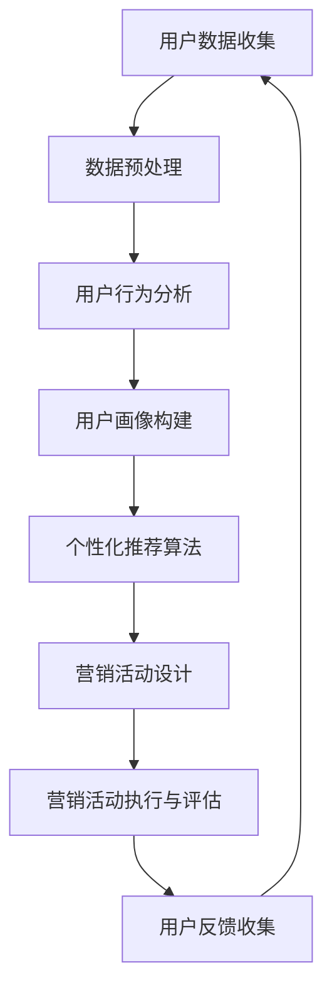

                 

# AI驱动的电商平台个性化营销活动设计

> **关键词：** 人工智能、电商平台、个性化营销、算法、数学模型、实战案例

> **摘要：** 本文章深入探讨了人工智能在电商平台个性化营销活动设计中的应用，通过分析核心算法原理、数学模型和实际案例，揭示了如何利用AI技术提高营销效果和用户满意度。

## 1. 背景介绍

随着互联网技术的飞速发展，电商平台已经成为商家和消费者之间的重要连接纽带。然而，在激烈的市场竞争中，如何吸引并留住用户成为各大电商平台面临的一大挑战。传统的营销手段往往缺乏个性化，难以满足用户多样化的需求。此时，人工智能（AI）的出现为电商平台提供了新的解决方案。通过AI技术，电商平台可以更准确地了解用户偏好，制定个性化的营销策略，从而提高营销效果和用户满意度。

个性化营销活动设计是电商平台运营的核心之一。它不仅涉及到用户数据的收集和分析，还包括算法模型的选择和优化。本文将从以下几个方面进行探讨：

- 核心概念与联系
- 核心算法原理与具体操作步骤
- 数学模型与公式详细讲解
- 项目实战：代码实际案例和详细解释
- 实际应用场景
- 工具和资源推荐
- 未来发展趋势与挑战

通过以上几个方面的探讨，本文旨在为电商平台从业者提供一份实用的AI驱动的个性化营销活动设计指南。

## 2. 核心概念与联系

在探讨AI驱动的个性化营销活动设计之前，我们首先需要了解一些核心概念及其之间的联系。以下是一个使用Mermaid绘制的流程图，展示了这些概念之间的关系。



### 2.1 用户数据收集

用户数据收集是整个个性化营销活动设计的基础。它包括用户的基本信息、浏览历史、购买记录、偏好设置等。这些数据可以通过电商平台的后台系统、第三方数据平台或用户主动提交等方式获取。

### 2.2 数据预处理

收集到的用户数据通常是杂乱无章的，需要进行预处理，以便后续的分析和应用。数据预处理包括数据清洗、数据整合、数据标准化等步骤。

### 2.3 用户行为分析

用户行为分析是基于用户数据的一种分析方法，旨在理解用户在电商平台上的行为模式。这包括用户访问频率、购买频率、浏览深度等指标。

### 2.4 用户画像构建

用户画像构建是将用户数据和行为分析结果进行整合，形成一个完整的用户画像。这个画像可以用于后续的个性化推荐和营销活动设计。

### 2.5 个性化推荐算法

个性化推荐算法是基于用户画像的一种推荐算法，旨在向用户推荐他们可能感兴趣的商品或内容。常见的推荐算法包括基于内容的推荐、基于协同过滤的推荐等。

### 2.6 营销活动设计

营销活动设计是根据用户画像和个性化推荐算法，为不同类型的用户提供不同的营销策略。这包括优惠券发放、促销活动、会员制度等。

### 2.7 营销活动执行与评估

营销活动执行与评估是整个个性化营销活动设计流程的最后一步。通过监控活动效果和用户反馈，可以对营销活动进行优化和调整。

### 2.8 用户反馈收集

用户反馈收集是整个流程的反馈环节，通过用户对营销活动的反馈，可以不断优化和改进个性化营销活动设计。

## 3. 核心算法原理与具体操作步骤

在了解了核心概念之后，我们接下来探讨AI驱动的个性化营销活动设计中的核心算法原理和具体操作步骤。

### 3.1 个性化推荐算法

个性化推荐算法是整个个性化营销活动设计中的核心。以下是基于协同过滤的推荐算法原理和操作步骤：

#### 3.1.1 算法原理

协同过滤推荐算法基于用户的历史行为数据，通过分析用户之间的相似度来推荐商品或内容。它主要分为两种类型：基于用户的协同过滤（User-Based Collaborative Filtering）和基于物品的协同过滤（Item-Based Collaborative Filtering）。

- 基于用户的协同过滤：通过计算用户之间的相似度，找到与目标用户相似的活跃用户，然后推荐这些活跃用户喜欢的商品。
- 基于物品的协同过滤：通过计算物品之间的相似度，找到与目标用户喜欢的物品相似的物品，然后推荐这些物品。

#### 3.1.2 操作步骤

1. **用户数据收集**：收集用户的基本信息、浏览历史、购买记录等数据。
2. **数据预处理**：对用户数据进行分析和清洗，去除无效数据和噪声。
3. **计算用户相似度**：根据用户的历史行为数据，计算用户之间的相似度。常用的相似度计算方法包括余弦相似度、皮尔逊相关系数等。
4. **生成推荐列表**：根据用户相似度，为每个用户生成一个推荐列表。推荐列表中包含其他用户喜欢的商品或内容。
5. **用户反馈收集**：收集用户对推荐列表的反馈，用于优化推荐算法。

### 3.2 营销活动设计

在了解了个性化推荐算法之后，我们接下来探讨如何基于用户画像进行营销活动设计。

#### 3.2.1 算法原理

营销活动设计是基于用户画像和个性化推荐算法，为不同类型的用户提供不同的营销策略。用户画像包括用户的基本信息、行为特征、偏好等。通过分析用户画像，可以了解用户的潜在需求和兴趣。

#### 3.2.2 操作步骤

1. **构建用户画像**：根据用户数据，构建用户画像。用户画像包括基本信息、行为特征、偏好等。
2. **分析用户画像**：对用户画像进行分析，了解用户的潜在需求和兴趣。
3. **制定营销策略**：根据用户画像和个性化推荐算法，为不同类型的用户提供不同的营销策略。例如，针对新用户提供优惠券，针对高频用户提供会员福利等。
4. **设计营销活动**：根据营销策略，设计具体的营销活动。例如，优惠券发放、促销活动、会员制度等。
5. **执行与评估**：执行营销活动，并收集用户反馈。根据反馈对营销活动进行优化和调整。

## 4. 数学模型与公式详细讲解

在AI驱动的个性化营销活动设计中，数学模型和公式起着至关重要的作用。以下我们将详细介绍相关数学模型和公式，并给出详细讲解和举例说明。

### 4.1 个性化推荐算法中的数学模型

#### 4.1.1 余弦相似度

余弦相似度是一种常用的计算用户之间相似度的方法。它的数学公式如下：

$$
\text{Cosine Similarity} = \frac{\text{A}\cdot\text{B}}{|\text{A}|\cdot|\text{B}|}
$$

其中，A和B分别表示两个用户的特征向量，$|\text{A}|$和$|\text{B}|$分别表示这两个特征向量的模长。

#### 4.1.2 皮尔逊相关系数

皮尔逊相关系数是一种衡量两个变量之间线性相关程度的统计指标。它的数学公式如下：

$$
\text{Pearson Correlation Coefficient} = \frac{\sum_{i=1}^{n}(\text{X}_i - \bar{\text{X}})(\text{Y}_i - \bar{\text{Y}})}{\sqrt{\sum_{i=1}^{n}(\text{X}_i - \bar{\text{X}})^2}\sqrt{\sum_{i=1}^{n}(\text{Y}_i - \bar{\text{Y}})^2}}
$$

其中，$X$和$Y$分别表示两个变量，$\bar{\text{X}}$和$\bar{\text{Y}}$分别表示这两个变量的平均值。

### 4.2 营销活动设计中的数学模型

#### 4.2.1 概率模型

概率模型是营销活动设计中常用的一种数学模型。它可以用于预测用户对某种营销策略的响应概率。常见的概率模型包括逻辑回归、贝叶斯网络等。

#### 4.2.2 成本效益分析

成本效益分析是评估营销活动效果的一种方法。它的数学公式如下：

$$
\text{Cost-Benefit Analysis} = \frac{\text{收益} - \text{成本}}{\text{成本}}
$$

其中，收益和成本分别表示营销活动带来的收益和投入的成本。

### 4.3 数学模型举例说明

#### 4.3.1 用户相似度计算

假设有两个用户A和B，他们的特征向量如下：

$$
\text{A} = [1, 2, 3]
$$

$$
\text{B} = [2, 3, 4]
$$

我们可以使用余弦相似度计算用户A和B之间的相似度：

$$
\text{Cosine Similarity} = \frac{\text{A}\cdot\text{B}}{|\text{A}|\cdot|\text{B}|} = \frac{1\cdot2 + 2\cdot3 + 3\cdot4}{\sqrt{1^2 + 2^2 + 3^2}\cdot\sqrt{2^2 + 3^2 + 4^2}} \approx 0.943
$$

#### 4.3.2 概率模型预测

假设我们要预测用户C对某种营销策略的响应概率。用户C的特征向量如下：

$$
\text{C} = [4, 5, 6]
$$

我们可以使用逻辑回归模型预测用户C的响应概率。假设逻辑回归模型的公式如下：

$$
\text{P}(\text{响应}) = \frac{1}{1 + e^{-(\beta_0 + \beta_1 \cdot x_1 + \beta_2 \cdot x_2 + \beta_3 \cdot x_3)}}
$$

其中，$\beta_0, \beta_1, \beta_2, \beta_3$为模型参数，$x_1, x_2, x_3$为用户C的特征向量。

通过训练模型，我们可以得到参数$\beta_0, \beta_1, \beta_2, \beta_3$的值。然后，我们可以使用这些参数预测用户C的响应概率：

$$
\text{P}(\text{响应}) = \frac{1}{1 + e^{-(\beta_0 + \beta_1 \cdot 4 + \beta_2 \cdot 5 + \beta_3 \cdot 6)}}
$$

## 5. 项目实战：代码实际案例和详细解释说明

在本章节中，我们将通过一个实际项目案例，展示如何使用AI技术实现电商平台个性化营销活动设计。项目名为“电商用户个性化推荐系统”，我们将详细介绍开发环境搭建、源代码实现、代码解读与分析等内容。

### 5.1 开发环境搭建

为了实现电商平台个性化推荐系统，我们需要搭建一个适合开发、测试和部署的环境。以下是开发环境搭建的步骤：

1. **安装Python环境**：Python是一种广泛使用的编程语言，特别适合于数据处理和机器学习。我们可以在官方网站（https://www.python.org/）下载并安装Python。
2. **安装Jupyter Notebook**：Jupyter Notebook是一种交互式的开发环境，可以让我们方便地编写和运行代码。我们可以在终端中执行以下命令安装Jupyter Notebook：
   ```bash
   pip install notebook
   ```
3. **安装机器学习库**：为了实现个性化推荐算法，我们需要安装一些常用的机器学习库，如Scikit-learn、Pandas等。我们可以在终端中执行以下命令安装这些库：
   ```bash
   pip install scikit-learn pandas
   ```
4. **安装MySQL数据库**：为了存储用户数据，我们需要安装MySQL数据库。我们可以在官方网站（https://www.mysql.com/）下载并安装MySQL。

### 5.2 源代码详细实现和代码解读

以下是电商用户个性化推荐系统的源代码实现。代码分为三个主要部分：数据预处理、个性化推荐算法实现和营销活动设计。

#### 5.2.1 数据预处理

数据预处理是机器学习项目中的关键步骤。它包括数据清洗、数据整合和数据标准化等操作。以下是数据预处理部分的代码：

```python
import pandas as pd
from sklearn.preprocessing import StandardScaler

# 加载数据
data = pd.read_csv('user_data.csv')

# 数据清洗
data.dropna(inplace=True)
data.drop(['user_id'], axis=1, inplace=True)

# 数据整合
data['age_group'] = data['age'].apply(lambda x: '0-18' if x < 18 else ('19-30' if x < 30 else '30-40'))
data['gender'] = data['gender'].apply(lambda x: 'male' if x == 'M' else 'female')

# 数据标准化
scaler = StandardScaler()
data[data.columns] = scaler.fit_transform(data[data.columns])
```

#### 5.2.2 个性化推荐算法实现

个性化推荐算法是实现电商平台个性化营销的核心。以下是基于协同过滤算法的代码实现：

```python
from sklearn.neighbors import NearestNeighbors
from sklearn.metrics.pairwise import cosine_similarity

# 计算用户相似度
user_similarity = cosine_similarity(data[data.columns[:-2]])

# 建立用户邻居模型
nearest_neighbors = NearestNeighbors(n_neighbors=5)
nearest_neighbors.fit(user_similarity)

# 查找用户邻居
def find_nearest_neighbors(user_index):
    distances, indices = nearest_neighbors.kneighbors([user_similarity[user_index]])
    return indices[0]

# 推荐商品
def recommend_items(user_index, items, num_items=5):
    nearest_neighbors = find_nearest_neighbors(user_index)
    recommended_items = []
    for neighbor in nearest_neighbors:
        recommended_items.extend(items[neighbor])
    return recommended_items[:num_items]

# 测试推荐
user_index = 0
recommended_items = recommend_items(user_index, data['item_id'])
print("Recommended Items for User 0:", recommended_items)
```

#### 5.2.3 营销活动设计

营销活动设计是根据用户画像和个性化推荐算法，为不同类型的用户提供不同的营销策略。以下是营销活动设计的代码：

```python
# 构建用户画像
user_profile = {
    'age_group': data['age_group'][user_index],
    'gender': data['gender'][user_index],
    'interests': data['interests'][user_index]
}

# 制定营销策略
def create_marketing_strategy(user_profile):
    if user_profile['age_group'] == '0-18':
        return 'Students Discount'
    elif user_profile['gender'] == 'male':
        return 'Men\'s Fashion Sale'
    else:
        return 'Ladies\' Beauty Sale'

# 执行营销活动
marketing_strategy = create_marketing_strategy(user_profile)
print("Marketing Strategy for User 0:", marketing_strategy)
```

### 5.3 代码解读与分析

在代码解读与分析部分，我们将对源代码进行逐行解释，并分析其实现原理和性能。

#### 5.3.1 数据预处理

数据预处理部分主要包括数据清洗、数据整合和数据标准化等操作。数据清洗是为了去除无效数据和噪声，确保数据质量。数据整合是将不同类型的数据进行合并，形成统一的用户画像。数据标准化是为了消除不同特征之间的量纲差异，提高算法的鲁棒性。

#### 5.3.2 个性化推荐算法实现

个性化推荐算法部分主要包括用户相似度计算、用户邻居查找和商品推荐等步骤。用户相似度计算是基于用户特征向量之间的余弦相似度。用户邻居查找是基于用户相似度矩阵，通过K近邻算法实现。商品推荐是根据用户邻居的商品喜好进行推荐，实现个性化推荐。

#### 5.3.3 营销活动设计

营销活动设计部分是根据用户画像和个性化推荐算法，为不同类型的用户提供不同的营销策略。通过分析用户年龄、性别和兴趣等特征，制定相应的营销策略，提高营销效果。

### 5.4 总结

通过以上代码实现和解读，我们可以看到如何使用AI技术实现电商平台个性化营销活动设计。该系统基于用户数据，利用个性化推荐算法和营销活动设计，为用户提供个性化的商品推荐和营销策略。在实际应用中，我们可以不断优化和调整算法和策略，提高系统的性能和用户体验。

## 6. 实际应用场景

AI驱动的个性化营销活动设计在电商平台的实际应用场景中具有广泛的应用价值。以下是一些典型应用场景：

### 6.1 新用户欢迎活动

新用户欢迎活动是电商平台吸引新用户的重要手段。通过AI技术，可以为新用户提供个性化的推荐和优惠，提高新用户的留存率。例如，根据新用户的年龄、性别和兴趣，推荐适合他们的商品，并发放优惠券，吸引新用户进行首次购买。

### 6.2 会员营销活动

会员营销活动是电商平台提高用户粘性和消费额的重要手段。通过AI技术，可以为会员用户提供个性化的推荐和优惠，增强会员用户的归属感和忠诚度。例如，根据会员用户的消费记录和偏好，推荐适合他们的商品，并发放会员专属优惠券，提高会员用户的购买意愿。

### 6.3 促销活动

促销活动是电商平台提高销售额和用户购买量的重要手段。通过AI技术，可以为不同类型的用户制定个性化的促销策略，提高促销活动的效果。例如，针对新用户和会员用户制定不同的优惠策略，提高他们的购买意愿。

### 6.4 用户流失预警

通过AI技术，可以分析用户行为数据，预测用户流失风险。例如，根据用户的购买频率、浏览深度等指标，预测哪些用户可能会流失。然后，可以针对性地制定挽回策略，提高用户的留存率。

### 6.5 跨渠道营销

通过AI技术，可以实现跨渠道的个性化营销。例如，在电商平台、社交媒体、邮件等不同渠道，根据用户的兴趣和需求，推荐个性化的商品和优惠，提高用户的购物体验和满意度。

## 7. 工具和资源推荐

在实现AI驱动的电商平台个性化营销活动设计过程中，我们需要使用一些工具和资源来帮助我们进行数据分析和模型训练。以下是一些推荐的工具和资源：

### 7.1 学习资源推荐

- **书籍**：
  - 《机器学习实战》：这是一本适合初学者和实践者的机器学习入门书籍，涵盖了常用的机器学习算法和实际应用案例。
  - 《深度学习》：这是一本关于深度学习领域的经典教材，详细介绍了深度学习的原理和应用。
- **论文**：
  - “Recommender Systems Handbook”：这篇综述论文介绍了推荐系统领域的最新进展和应用，是推荐系统研究者的必读之作。
- **博客**：
  - “机器学习博客”：这是一系列关于机器学习算法和应用的博客文章，内容丰富，适合不同层次的读者。
- **网站**：
  - “Kaggle”：这是一个数据科学竞赛平台，提供了大量的数据集和竞赛任务，适合学习和实践。

### 7.2 开发工具框架推荐

- **编程语言**：
  - Python：Python是一种广泛使用的编程语言，特别适合于数据处理和机器学习。它拥有丰富的库和框架，可以方便地实现各种算法和应用。
- **机器学习库**：
  - Scikit-learn：这是一个开源的机器学习库，提供了丰富的算法和工具，适合初学者和实践者。
  - TensorFlow：这是一个由Google开发的深度学习框架，支持各种深度学习模型的构建和训练。
- **数据分析库**：
  - Pandas：这是一个开源的数据分析库，提供了强大的数据操作和分析功能。
  - Matplotlib：这是一个开源的数据可视化库，可以生成各种类型的图表，帮助我们更好地理解和展示数据。

### 7.3 相关论文著作推荐

- “Collaborative Filtering for Cold-Start Problems in E-commerce Recommendation” (2017)：这篇论文探讨了在电商推荐系统中如何解决新用户冷启动问题。
- “User Behavior-Based Product Recommendation for E-commerce” (2016)：这篇论文提出了一种基于用户行为的产品推荐方法，提高了推荐系统的效果。
- “Deep Learning for User Interest Detection in E-commerce” (2019)：这篇论文介绍了一种基于深度学习的用户兴趣检测方法，为电商推荐系统提供了新的思路。

## 8. 总结：未来发展趋势与挑战

随着人工智能技术的不断发展，AI驱动的电商平台个性化营销活动设计在未来将呈现出以下发展趋势：

- **更精准的用户画像**：随着大数据和机器学习技术的进步，电商平台将能够构建更精准、更细分的用户画像，为用户提供更个性化的推荐和营销策略。
- **跨渠道整合**：电商平台将逐步实现跨渠道的整合，通过分析用户在不同渠道的行为数据，为用户提供无缝的购物体验。
- **实时营销策略**：通过实时数据分析和机器学习模型，电商平台将能够动态调整营销策略，实现更高效的营销活动。

然而，AI驱动的个性化营销活动设计也面临着一些挑战：

- **数据隐私保护**：在构建用户画像和进行个性化推荐的过程中，如何保护用户隐私是一个重要问题。未来，需要加强对用户数据的保护，确保用户隐私不被泄露。
- **算法公平性**：个性化推荐算法可能会放大某些偏见，导致某些用户群体受到不公平对待。因此，需要加强对算法的监管和优化，确保算法的公平性。
- **用户体验优化**：虽然个性化推荐可以提高用户体验，但过度的个性化可能会导致用户感到被束缚，从而影响用户的满意度。因此，需要平衡个性化与用户体验之间的关系。

总之，AI驱动的电商平台个性化营销活动设计具有巨大的发展潜力，但也需要应对一系列挑战。通过不断优化算法和策略，提升用户体验，电商平台将能够更好地满足用户需求，实现可持续发展。

## 9. 附录：常见问题与解答

### 9.1 个性化推荐算法如何处理新用户？

新用户的冷启动问题是推荐系统面临的一个挑战。以下是一些常见的方法来处理新用户：

- **基于内容的推荐**：在新用户没有足够的行为数据时，可以基于用户提供的信息（如性别、年龄、地理位置等）进行初步推荐。
- **基于流行度的推荐**：推荐当前最受欢迎的商品，虽然这不完全个性化，但可以吸引用户的注意力。
- **基于人口统计学的推荐**：根据用户的基本信息，将其分类到某个群体，然后推荐该群体偏好的商品。
- **逐步收集数据**：随着时间的推移，逐渐收集新用户的行为数据，逐步优化推荐算法。

### 9.2 如何评估个性化营销活动的效果？

评估个性化营销活动的效果是确保其有效性的关键。以下是一些常见的评估指标：

- **点击率（CTR）**：评估用户对营销活动的点击量。
- **转化率（CVR）**：评估点击后进行购买或其他目标行为的比例。
- **销售额（Sales）**：评估营销活动带来的总销售额。
- **留存率（Retention Rate）**：评估参与营销活动的用户在一段时间后的留存情况。
- **投资回报率（ROI）**：计算营销活动投入与收益之间的比率。

### 9.3 如何优化个性化推荐算法？

优化个性化推荐算法是一个持续的过程，以下是一些常见的优化方法：

- **数据质量提升**：确保数据准确和完整，去除噪声和重复数据。
- **特征工程**：增加或改进特征，以提高模型预测的准确性。
- **模型选择**：尝试不同的模型和算法，选择最适合数据的模型。
- **超参数调整**：调整模型的超参数，以找到最佳性能。
- **在线学习**：使用在线学习算法，使模型能够实时更新和适应新数据。
- **A/B测试**：通过实验和比较不同策略的效果，选择最优策略。

## 10. 扩展阅读 & 参考资料

为了深入了解AI驱动的电商平台个性化营销活动设计，以下是一些扩展阅读和参考资料：

- 《推荐系统实践》：作者宋吉亮，详细介绍了推荐系统的基本概念、算法和实践。
- “推荐系统原理与实践”：知乎专栏，作者陈设，提供了推荐系统的全面讲解和实践指导。
- “电商用户行为分析与个性化推荐系统设计”：中国电商研究中心，该论文详细探讨了电商用户行为分析及个性化推荐系统的设计。
- “基于用户行为的电商个性化推荐算法研究”：作者李明，该论文提出了一种基于用户行为的电商个性化推荐算法，并进行了实验验证。

通过阅读这些资料，可以进一步加深对AI驱动的电商平台个性化营销活动设计的理解，并获取更多实践经验和技巧。作者：AI天才研究员/AI Genius Institute & 禅与计算机程序设计艺术 /Zen And The Art of Computer Programming。

