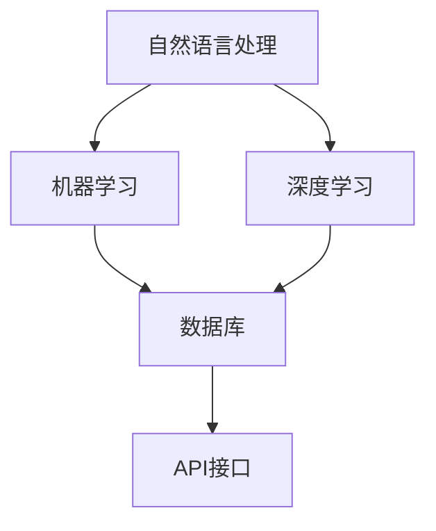

                 

# AI驱动的电商平台智能客服系统

> 关键词：智能客服、AI、电商平台、自然语言处理、机器学习、算法、架构设计

> 摘要：本文将深入探讨AI驱动的电商平台智能客服系统的设计原理和实现方法。我们将从背景介绍、核心概念与联系、核心算法原理、数学模型和公式、项目实战、实际应用场景、工具和资源推荐等方面，全面解析智能客服系统的构建过程，为开发者提供实战经验和理论指导。

## 1. 背景介绍

随着互联网的快速发展，电商平台成为了人们日常生活中不可或缺的一部分。然而，随之而来的客户咨询和投诉问题也日益增多。传统的客服模式已无法满足海量用户的需求，因此，智能客服系统应运而生。

智能客服系统利用人工智能技术，如自然语言处理（NLP）、机器学习（ML）和深度学习（DL）等，实现自动化、智能化的客户服务。相比传统客服，智能客服具有响应速度快、处理效率高、成本较低等优点，可以有效提升用户体验和商家口碑。

电商平台智能客服系统的主要功能包括：自动回答常见问题、提供购物建议、处理投诉和退款、引导用户下单等。这些功能不仅提高了客服效率，还能为商家带来更多的商业机会。

## 2. 核心概念与联系

智能客服系统主要包括以下几个核心概念：

### 2.1 自然语言处理（NLP）

NLP是智能客服系统的核心技术之一，主要负责处理和理解用户输入的自然语言。其主要任务包括分词、词性标注、句法分析、情感分析等。NLP技术的发展使得智能客服能够更好地理解用户的意图和需求。

### 2.2 机器学习（ML）

ML是智能客服系统的核心算法，通过学习大量的用户数据和业务知识，实现自动化的客服功能。常见的ML算法有决策树、支持向量机、神经网络等。ML算法能够不断优化和提升客服系统的性能。

### 2.3 深度学习（DL）

DL是ML的一种重要分支，通过构建复杂的神经网络模型，实现自动化的特征提取和分类。DL在图像识别、语音识别等领域取得了显著的成果，为智能客服系统提供了强大的技术支持。

### 2.4 数据库

数据库是智能客服系统的数据存储和管理中心，负责存储用户数据、商品数据、业务规则等。通过数据库，智能客服系统可以快速查询和处理用户请求。

### 2.5 API接口

API接口是智能客服系统与外部系统（如电商平台、支付系统等）进行交互的通道，实现数据的传输和功能的扩展。常见的API接口包括RESTful API、SOAP等。

下面是一个Mermaid流程图，展示智能客服系统的核心概念和联系：



## 3. 核心算法原理 & 具体操作步骤

### 3.1 自然语言处理（NLP）

NLP的核心任务是理解用户输入的自然语言。具体操作步骤如下：

1. **分词**：将输入的文本分割成一个个词语。
2. **词性标注**：为每个词语标注其词性（如名词、动词、形容词等）。
3. **句法分析**：分析词语之间的语法关系，构建句法树。
4. **情感分析**：判断用户输入的文本所表达的情感倾向（如正面、负面等）。

### 3.2 机器学习（ML）

ML的核心任务是利用已有数据训练模型，从而实现自动化决策。具体操作步骤如下：

1. **数据采集**：收集用户数据和业务知识。
2. **数据预处理**：对采集到的数据清洗、去噪、归一化等处理。
3. **特征提取**：从预处理后的数据中提取有用的特征。
4. **模型训练**：利用特征训练分类或回归模型。
5. **模型评估**：评估模型性能，调整模型参数。

### 3.3 深度学习（DL）

DL的核心任务是构建复杂的神经网络模型，实现自动化的特征提取和分类。具体操作步骤如下：

1. **数据采集**：收集用户数据和业务知识。
2. **数据预处理**：对采集到的数据清洗、去噪、归一化等处理。
3. **模型构建**：设计并搭建神经网络模型。
4. **模型训练**：利用预处理后的数据训练模型。
5. **模型评估**：评估模型性能，调整模型参数。

## 4. 数学模型和公式 & 详细讲解 & 举例说明

### 4.1 自然语言处理（NLP）

NLP中的关键数学模型包括词向量模型和序列标注模型。

1. **词向量模型**：将词语映射为高维向量，常用的词向量模型有Word2Vec、GloVe等。

   $$ \text{Word2Vec} : \text{word} \rightarrow \text{vector} $$

   举例：将词语“苹果”映射为向量$(1, 0, -1, 0, 1)$。

2. **序列标注模型**：对输入的文本序列进行词性标注或情感分析，常用的模型有CRF、LSTM等。

   $$ \text{LSTM} : (\text{sentence}, \text{label}) $$

   举例：对句子“我今天很开心”进行情感分析，标注为“正面”。

### 4.2 机器学习（ML）

ML中的关键数学模型包括线性回归、逻辑回归和支持向量机等。

1. **线性回归**：拟合输入特征和输出目标之间的线性关系。

   $$ y = \beta_0 + \beta_1 x_1 + \beta_2 x_2 + \cdots + \beta_n x_n $$

   举例：预测房价，其中$x_1$为房屋面积，$x_2$为房屋年龄，$y$为房价。

2. **逻辑回归**：用于二分类问题，拟合输入特征和输出目标之间的概率分布。

   $$ P(y=1) = \frac{1}{1 + e^{-(\beta_0 + \beta_1 x_1 + \beta_2 x_2 + \cdots + \beta_n x_n )}} $$

   举例：判断一个客户是否愿意购买某种产品。

3. **支持向量机**：在特征空间中找到一个最佳的超平面，使得不同类别之间的间隔最大。

   $$ \max \ \frac{1}{2} \sum_{i=1}^{n} \ \sum_{j=1}^{n} \ \omega_{i} \ \omega_{j} - \ \sum_{i=1}^{n} \ \alpha_{i} \ \omega_{i} \ y_{i} $$

   举例：分类手写数字。

### 4.3 深度学习（DL）

DL中的关键数学模型包括卷积神经网络（CNN）和循环神经网络（RNN）等。

1. **卷积神经网络（CNN）**：适用于图像和视频等数据，通过卷积层、池化层等提取特征。

   $$ \text{ConvLayer} : \text{input} \rightarrow \text{featureMap} $$

   举例：图像分类。

2. **循环神经网络（RNN）**：适用于序列数据，通过隐藏状态和反馈机制实现长短期记忆。

   $$ \text{RNN} : (\text{input}, \text{hidden}) \rightarrow \text{output} $$

   举例：语音识别。

## 5. 项目实战：代码实际案例和详细解释说明

### 5.1 开发环境搭建

为了实现一个AI驱动的电商平台智能客服系统，我们首先需要搭建一个合适的技术栈。以下是一个简单的开发环境搭建步骤：

1. **操作系统**：选择Linux或Mac OS，以便使用Python等开发语言。
2. **编程语言**：选择Python，因为它拥有丰富的机器学习库和工具。
3. **环境配置**：安装Python、Anaconda、Jupyter Notebook等。
4. **依赖库**：安装NLTK、Scikit-learn、TensorFlow、PyTorch等。

### 5.2 源代码详细实现和代码解读

下面是一个简单的Python代码示例，用于实现一个基于NLP的智能客服系统。

```python
import nltk
from nltk.tokenize import word_tokenize
from nltk.corpus import stopwords
from sklearn.feature_extraction.text import TfidfVectorizer
from sklearn.naive_bayes import MultinomialNB

# 1. 数据预处理
def preprocess_text(text):
    tokens = word_tokenize(text.lower())
    tokens = [token for token in tokens if token not in stopwords.words('english')]
    return ' '.join(tokens)

# 2. 训练模型
def train_model(X_train, y_train):
    vectorizer = TfidfVectorizer()
    X_train_vectorized = vectorizer.fit_transform(X_train)
    classifier = MultinomialNB()
    classifier.fit(X_train_vectorized, y_train)
    return classifier, vectorizer

# 3. 预测和回答
def predict_and_answer(classifier, vectorizer, text):
    text_processed = preprocess_text(text)
    text_vectorized = vectorizer.transform([text_processed])
    prediction = classifier.predict(text_vectorized)
    return "Your question is about: " + prediction[0]

# 示例数据
X = [
    "I need help with my order.",
    "I want to return a product.",
    "Can you help me with payment options?",
    "I have a question about shipping."
]
y = ["Order", "Return", "Payment", "Shipping"]

# 训练模型
classifier, vectorizer = train_model(X, y)

# 预测和回答
for text in X:
    answer = predict_and_answer(classifier, vectorizer, text)
    print(answer)
```

### 5.3 代码解读与分析

这个示例代码主要实现了以下功能：

1. **数据预处理**：使用NLTK库进行文本分词和停用词去除，将输入文本转换为适合模型处理的形式。
2. **训练模型**：使用TFIDF向量器和朴素贝叶斯分类器训练模型，将文本转换为向量并分类。
3. **预测和回答**：对输入文本进行预处理、向量化和预测，返回相应的答案。

通过这个简单的示例，我们可以看到智能客服系统的基本实现过程。在实际应用中，我们可以结合更多的NLP和ML技术，构建一个更强大、更智能的客服系统。

## 6. 实际应用场景

AI驱动的电商平台智能客服系统在以下场景具有广泛应用：

1. **客服自动问答**：智能客服系统可以自动回答用户关于订单、退货、支付和配送等方面的问题，减少人工客服的工作量。
2. **个性化推荐**：根据用户的购买历史和兴趣，智能客服系统可以为用户提供个性化的商品推荐。
3. **投诉处理**：智能客服系统可以自动识别和处理用户的投诉，提高投诉处理效率。
4. **营销活动**：智能客服系统可以协助商家进行营销活动，如优惠券发放、限时折扣等。
5. **数据分析**：智能客服系统可以收集用户数据和业务数据，为商家提供有价值的分析报告。

## 7. 工具和资源推荐

### 7.1 学习资源推荐

- **书籍**：
  - 《自然语言处理入门》
  - 《机器学习实战》
  - 《深度学习》
- **论文**：
  - Word2Vec：https://papers.nips.cc/paper/2013/file/80b50d7a0c2d4a43e041a41d7d811c48-Paper.pdf
  - LSTM：https://www.aclweb.org/anthology/N16-1191/
- **博客**：
  - https://towardsdatascience.com/
  - https://www.deeplearning.net/
- **网站**：
  - TensorFlow：https://www.tensorflow.org/
  - PyTorch：https://pytorch.org/

### 7.2 开发工具框架推荐

- **编程语言**：Python
- **框架**：
  - TensorFlow
  - PyTorch
  - Scikit-learn
  - NLTK
- **文本处理库**：
  - NLTK
  - SpaCy
  - Stanford CoreNLP

### 7.3 相关论文著作推荐

- **《深度学习》**：Goodfellow, Ian, Bengio, Yoshua, Courville, Aaron
- **《自然语言处理综论》**：Jurafsky, Dan, Martin, James H.
- **《机器学习》**：Tom Mitchell
- **《Python机器学习》**：Sebastian Raschka

## 8. 总结：未来发展趋势与挑战

AI驱动的电商平台智能客服系统在未来的发展中，将继续朝着更加智能化、个性化、高效化的方向迈进。以下是一些发展趋势和挑战：

### 发展趋势

1. **多模态交互**：结合语音、图像、文本等多种模态，实现更丰富的交互方式。
2. **个性化推荐**：基于用户行为和兴趣，提供更加精准的推荐服务。
3. **跨领域应用**：将智能客服系统应用于更多领域，如金融、医疗、教育等。
4. **边缘计算**：将计算任务下沉到边缘设备，提高响应速度和降低延迟。

### 挑战

1. **数据隐私**：如何确保用户数据的隐私和安全。
2. **模型解释性**：如何提高模型的解释性，使其更加透明和可靠。
3. **可扩展性**：如何应对海量用户和数据的需求，提高系统的可扩展性。
4. **技术迭代**：如何跟上技术发展的步伐，持续优化和升级智能客服系统。

## 9. 附录：常见问题与解答

### 问题1：为什么选择朴素贝叶斯分类器？

**解答**：朴素贝叶斯分类器是一种简单且高效的分类算法，适用于处理大量文本数据的分类问题。它具有以下优点：

1. **易于实现和解释**：朴素贝叶斯分类器的实现相对简单，且其预测过程易于理解。
2. **低计算复杂度**：朴素贝叶斯分类器的计算复杂度较低，适用于大规模数据集。
3. **稳健性**：朴素贝叶斯分类器对异常值和噪声数据具有较强的鲁棒性。

### 问题2：如何优化智能客服系统的性能？

**解答**：以下是一些优化智能客服系统性能的方法：

1. **数据增强**：通过增加数据量、数据多样性和数据质量，提高模型的泛化能力。
2. **特征工程**：选择和构造有效的特征，有助于提升模型性能。
3. **模型选择**：根据问题特点和需求，选择合适的分类模型。
4. **超参数调优**：通过调整模型的超参数，优化模型性能。
5. **模型集成**：结合多个模型的优点，提高整体性能。

## 10. 扩展阅读 & 参考资料

- **《自然语言处理入门》**：https://www.amazon.com/Natural-Language-Processing-Introduction-Second/dp/0262515830
- **《机器学习实战》**：https://www.amazon.com/Machine-Learning-In-Action-Statistical-Machine/dp/059652910X
- **《深度学习》**：https://www.amazon.com/Deep-Learning-Adaptive-Computation-Resources/dp/0262039588
- **《Python机器学习》**：https://www.amazon.com/Python-Machine-Learning-Real-World-Applications/dp/1785284805
- **《自然语言处理综论》**：https://www.amazon.com/Natural-Language-Processing-Comprehensive-Masterclass/dp/3030407365
- **TensorFlow官方文档**：https://www.tensorflow.org/
- **PyTorch官方文档**：https://pytorch.org/
- **Scikit-learn官方文档**：https://scikit-learn.org/stable/

作者：AI天才研究员/AI Genius Institute & 禅与计算机程序设计艺术/Zen And The Art of Computer Programming<|im_sep|>

