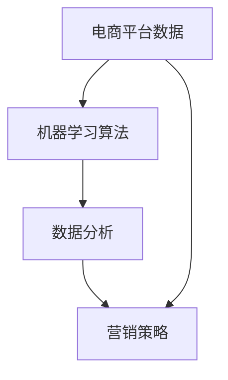

                 

# AI驱动的电商平台精准营销活动自动化

## 摘要

本文将探讨如何利用人工智能技术，特别是机器学习和数据分析的方法，自动化电商平台上的精准营销活动。我们将从背景介绍入手，深入剖析核心概念与联系，介绍机器学习算法和数学模型，并通过实际项目实战展示如何实现营销活动自动化。同时，我们将探讨该技术的实际应用场景，推荐相关学习资源和开发工具，并对未来发展趋势与挑战进行展望。

## 1. 背景介绍

随着互联网的快速发展，电商平台已成为商家和消费者之间的重要交互渠道。然而，如何在海量用户和商品数据中找到潜在客户，提高销售额，成为电商平台面临的巨大挑战。传统的营销方法往往依赖于人工经验，存在一定的局限性，无法实时响应市场变化。因此，利用人工智能技术进行精准营销活动自动化，成为了电商平台提升竞争力的重要手段。

近年来，机器学习和数据分析技术的飞速发展，为电商平台提供了丰富的工具和方法。通过分析用户行为数据、商品特征数据以及市场环境数据，可以识别出潜在客户，制定个性化的营销策略，提高营销效果。同时，自动化技术可以节省人力成本，提高营销效率，为电商平台带来更高的收益。

本文将详细探讨如何利用人工智能技术实现电商平台精准营销活动的自动化。我们将从核心概念、算法原理、数学模型、实际应用等多个方面进行分析，以帮助读者全面了解该领域的最新发展趋势和应用实践。

## 2. 核心概念与联系

在讨论如何实现电商平台精准营销活动自动化之前，我们首先需要了解一些核心概念和它们之间的联系。

### 2.1 电商平台数据

电商平台数据是进行精准营销活动的基础。这些数据包括用户行为数据、商品特征数据、交易数据等。用户行为数据主要包括用户在平台上的浏览、搜索、购买等操作；商品特征数据包括商品的种类、价格、库存、销量等信息；交易数据包括用户的购买记录、订单状态、支付方式等。

### 2.2 机器学习算法

机器学习算法是解决电商平台精准营销问题的重要工具。常见的机器学习算法包括分类算法、回归算法、聚类算法等。其中，分类算法用于识别用户群体，回归算法用于预测用户购买概率，聚类算法用于发现潜在客户。

### 2.3 数据分析

数据分析是利用统计方法对电商平台数据进行分析和挖掘的过程。通过数据分析，可以揭示用户行为规律、商品特性以及市场趋势，为制定精准营销策略提供依据。

### 2.4 营销策略

营销策略是根据用户数据和数据分析结果制定的个性化营销方案。常见的营销策略包括推送广告、优惠券发放、会员活动等。通过这些策略，可以吸引潜在客户、提高用户黏性、增加销售额。

### 2.5 联系与整合

电商平台数据的获取、机器学习算法的应用、数据分析的过程以及营销策略的制定，是一个紧密联系的整体。通过整合这些技术和方法，可以实现电商平台精准营销活动的自动化。

下面是一个使用Mermaid绘制的流程图，展示了这些核心概念和它们之间的联系：



## 3. 核心算法原理 & 具体操作步骤

### 3.1 分类算法

分类算法是用于识别用户群体的常见算法。在电商平台中，分类算法可以帮助识别潜在客户，为他们推荐合适的商品和营销活动。常见的分类算法包括K-近邻算法（K-Nearest Neighbors，K-NN）、支持向量机（Support Vector Machine，SVM）和随机森林（Random Forest）等。

#### 3.1.1 K-近邻算法

K-近邻算法是一种基于实例的学习算法。它的核心思想是：如果一个新样本在特征空间中的K个最近邻的多数属于某一个类别，则该新样本也属于这个类别。

具体步骤如下：

1. 计算新样本与训练集中每个样本的相似度。
2. 选择距离新样本最近的K个样本。
3. 统计K个样本中各类别的数量。
4. 选择数量最多的类别作为新样本的类别。

#### 3.1.2 支持向量机

支持向量机是一种基于最大间隔分类的算法。它的核心思想是：找到最优的超平面，使得正负样本点在超平面两侧的间隔最大化。

具体步骤如下：

1. 训练数据集划分为正负样本。
2. 计算每个样本的特征向量。
3. 找到最优的超平面，使得正负样本点在超平面两侧的间隔最大化。
4. 根据最优超平面进行分类。

#### 3.1.3 随机森林

随机森林是一种基于决策树的集成算法。它的核心思想是：通过随机选择特征和样本子集，构建多棵决策树，然后通过投票方式确定最终的分类结果。

具体步骤如下：

1. 随机选择特征和样本子集。
2. 构建决策树。
3. 对于新样本，将其输入到每棵决策树中进行分类。
4. 统计每棵决策树的分类结果，选择投票次数最多的类别作为最终分类结果。

### 3.2 回归算法

回归算法是用于预测用户购买概率的算法。在电商平台中，回归算法可以帮助预测用户的购买行为，为营销活动提供依据。常见的回归算法包括线性回归、决策树回归和神经网络回归等。

#### 3.2.1 线性回归

线性回归是一种基于线性关系的预测算法。它的核心思想是：找到一条最优的线性函数，使得预测值与实际值之间的误差最小。

具体步骤如下：

1. 建立线性回归模型：$$y = wx + b$$
2. 计算损失函数：$$J(w, b) = \frac{1}{2m}\sum_{i=1}^{m}(wx_i + b - y_i)^2$$
3. 使用梯度下降法优化模型参数：$$w = w - \alpha \frac{\partial J}{\partial w}$$, $$b = b - \alpha \frac{\partial J}{\partial b}$$

#### 3.2.2 决策树回归

决策树回归是一种基于决策树的预测算法。它的核心思想是：通过一系列的决策节点，将样本划分为不同的区域，每个区域对应一个预测值。

具体步骤如下：

1. 选择最佳分割特征：$$Gini(\text{impurity})$$ 或 $$Entropy(\text{impurity})$$
2. 划分数据集：$$D = \{D_1, D_2, ..., D_n\}$$
3. 对每个子集，递归地执行步骤1和2，直到满足停止条件。

#### 3.2.3 神经网络回归

神经网络回归是一种基于神经网络的预测算法。它的核心思想是：通过多层神经元和激活函数，将输入映射到输出。

具体步骤如下：

1. 建立神经网络模型：$$z = \sigma(W_1 \cdot x + b_1)$$
2. 计算损失函数：$$J(W_1, b_1) = \frac{1}{2m}\sum_{i=1}^{m}(y_i - z_i)^2$$
3. 使用反向传播算法优化模型参数：$$\frac{\partial J}{\partial W_1} = \frac{\partial J}{\partial z} \cdot \frac{\partial z}{\partial W_1}$$, $$\frac{\partial J}{\partial b_1} = \frac{\partial J}{\partial z} \cdot \frac{\partial z}{\partial b_1}$$

## 4. 数学模型和公式 & 详细讲解 & 举例说明

在电商平台精准营销活动中，数学模型和公式起着至关重要的作用。它们帮助我们分析和预测用户行为，为制定精准营销策略提供依据。以下将详细介绍几个常用的数学模型和公式，并通过具体例子进行讲解。

### 4.1 概率论基础

在电商平台中，概率论是分析和预测用户行为的重要工具。以下介绍几个常用的概率论基础概念和公式。

#### 4.1.1 概率分布

概率分布描述了一个随机变量的概率分布情况。常见的概率分布包括正态分布、二项分布、泊松分布等。

- 正态分布：$$N(\mu, \sigma^2)$$，其中$$\mu$$为均值，$$\sigma$$为标准差。
- 二项分布：$$B(n, p)$$，其中$$n$$为试验次数，$$p$$为每次试验成功的概率。
- 泊松分布：$$P(\lambda)$$，其中$$\lambda$$为事件发生的平均次数。

#### 4.1.2 概率计算

概率计算是概率论的核心内容。以下介绍几个常用的概率计算方法。

- 条件概率：$$P(A|B) = \frac{P(A \cap B)}{P(B)}$$
- 全概率公式：$$P(A) = \sum_{i=1}^{n} P(A|B_i) \cdot P(B_i)$$
- 贝叶斯公式：$$P(A|B) = \frac{P(B|A) \cdot P(A)}{P(B)}$$

### 4.2 用户行为预测

用户行为预测是电商平台精准营销活动的重要环节。以下介绍几个常用的用户行为预测模型和公式。

#### 4.2.1 回归模型

回归模型用于预测用户行为，如购买概率。以下是一个线性回归模型的例子：

- 模型公式：$$y = wx + b$$
- 损失函数：$$J(w, b) = \frac{1}{2m}\sum_{i=1}^{m}(wx_i + b - y_i)^2$$
- 优化方法：梯度下降法

#### 4.2.2 决策树模型

决策树模型用于分类和预测用户行为。以下是一个决策树模型的例子：

- 划分准则：$$Gini(\text{impurity})$$ 或 $$Entropy(\text{impurity})$$
- 停止条件：$$\text{max depth}$$ 或 $$\text{min samples split}$$

#### 4.2.3 神经网络模型

神经网络模型用于复杂用户行为预测。以下是一个神经网络模型的例子：

- 模型公式：$$z = \sigma(W \cdot x + b)$$
- 损失函数：$$J(W, b) = \frac{1}{2m}\sum_{i=1}^{m}(y_i - z_i)^2$$
- 优化方法：反向传播算法

### 4.3 例子说明

以下通过一个实际例子来说明如何使用数学模型和公式进行用户行为预测。

#### 4.3.1 数据集

假设我们有一个用户行为数据集，包含以下特征：

- 用户年龄（age）
- 用户性别（gender）
- 用户收入（income）
- 商品种类（category）
- 商品价格（price）
- 购买记录（purchase history）

我们希望预测用户的购买概率。

#### 4.3.2 数据预处理

对数据集进行预处理，包括：

- 缺失值处理：使用均值或中位数填充缺失值。
- 特征工程：对连续特征进行标准化处理，对分类特征进行独热编码。

#### 4.3.3 模型选择

根据数据集特点，选择一个合适的模型。在此例中，我们选择线性回归模型。

#### 4.3.4 模型训练

使用训练数据集训练模型，优化模型参数。

$$w = w - \alpha \frac{\partial J}{\partial w}$$

$$b = b - \alpha \frac{\partial J}{\partial b}$$

#### 4.3.5 模型评估

使用验证数据集评估模型性能，计算预测准确率。

$$\text{accuracy} = \frac{\text{预测正确数量}}{\text{总数量}}$$

### 4.4 数学公式

在本文中，我们使用了以下数学公式：

- 线性回归模型公式：$$y = wx + b$$
- 损失函数公式：$$J(w, b) = \frac{1}{2m}\sum_{i=1}^{m}(wx_i + b - y_i)^2$$
- 梯度下降法公式：$$w = w - \alpha \frac{\partial J}{\partial w}$$, $$b = b - \alpha \frac{\partial J}{\partial b}$$
- 决策树划分准则：$$Gini(\text{impurity})$$ 或 $$Entropy(\text{impurity})$$
- 神经网络模型公式：$$z = \sigma(W \cdot x + b)$$
- 损失函数公式：$$J(W, b) = \frac{1}{2m}\sum_{i=1}^{m}(y_i - z_i)^2$$
- 反向传播算法公式：$$\frac{\partial J}{\partial W} = \frac{\partial J}{\partial z} \cdot \frac{\partial z}{\partial W}$$, $$\frac{\partial J}{\partial b} = \frac{\partial J}{\partial z} \cdot \frac{\partial z}{\partial b}$$

通过以上数学模型和公式，我们可以实现用户行为预测，为电商平台精准营销活动提供有力支持。

### 5. 项目实战：代码实际案例和详细解释说明

#### 5.1 开发环境搭建

为了实现电商平台精准营销活动的自动化，我们需要搭建一个开发环境。以下是一个基本的开发环境搭建指南：

1. 安装Python环境：Python是进行数据分析和机器学习任务的主要编程语言。您可以从[Python官网](https://www.python.org/)下载并安装Python。
2. 安装数据分析库：我们主要使用Pandas、NumPy和Scikit-learn等库。可以使用以下命令安装：

```bash
pip install pandas numpy scikit-learn
```

3. 安装可视化库：为了更好地展示数据和分析结果，我们使用Matplotlib和Seaborn等库。可以使用以下命令安装：

```bash
pip install matplotlib seaborn
```

4. 安装Jupyter Notebook：Jupyter Notebook是一个交互式计算环境，非常适合进行数据分析和机器学习任务。可以使用以下命令安装：

```bash
pip install notebook
```

5. 启动Jupyter Notebook：在命令行中输入以下命令，启动Jupyter Notebook：

```bash
jupyter notebook
```

#### 5.2 源代码详细实现和代码解读

以下是一个使用Python实现电商平台精准营销活动自动化的代码示例。代码分为几个部分：数据预处理、模型训练和模型评估。

```python
import pandas as pd
import numpy as np
from sklearn.model_selection import train_test_split
from sklearn.preprocessing import StandardScaler
from sklearn.linear_model import LinearRegression
from sklearn.metrics import mean_squared_error
import matplotlib.pyplot as plt
import seaborn as sns

# 5.2.1 数据预处理
# 加载数据集
data = pd.read_csv('ecommerce_data.csv')

# 数据清洗
data.dropna(inplace=True)

# 特征工程
X = data[['age', 'gender', 'income', 'category', 'price']]
y = data['purchase']

# 数据标准化
scaler = StandardScaler()
X_scaled = scaler.fit_transform(X)

# 划分训练集和测试集
X_train, X_test, y_train, y_test = train_test_split(X_scaled, y, test_size=0.2, random_state=42)

# 5.2.2 模型训练
# 创建线性回归模型
model = LinearRegression()

# 训练模型
model.fit(X_train, y_train)

# 5.2.3 模型评估
# 预测测试集结果
y_pred = model.predict(X_test)

# 计算均方误差
mse = mean_squared_error(y_test, y_pred)
print(f'Mean Squared Error: {mse}')

# 5.2.4 可视化分析
# 绘制散点图
plt.scatter(y_test, y_pred)
plt.xlabel('Actual Purchase')
plt.ylabel('Predicted Purchase')
plt.title('Actual vs Predicted Purchase')
plt.show()

# 绘制特征重要性
feature_importance = pd.Series(model.coef_, index=X.columns)
sns.barplot(x=feature_importance, y=feature_importance.index)
plt.title('Feature Importance')
plt.show()
```

#### 5.3 代码解读与分析

以下是对上述代码的解读和分析：

1. **数据预处理**：
   - 加载数据集：使用`pandas.read_csv`函数加载数据集。
   - 数据清洗：使用`dropna`方法去除缺失值。
   - 特征工程：提取特征和目标变量，对连续特征进行标准化处理。

2. **模型训练**：
   - 划分训练集和测试集：使用`train_test_split`函数划分训练集和测试集，测试集大小为20%。
   - 创建线性回归模型：使用`LinearRegression`类创建线性回归模型。
   - 训练模型：使用`fit`方法训练模型。

3. **模型评估**：
   - 预测测试集结果：使用`predict`方法预测测试集结果。
   - 计算均方误差：使用`mean_squared_error`函数计算均方误差。

4. **可视化分析**：
   - 绘制散点图：使用`scatter`函数绘制实际购买与预测购买之间的散点图。
   - 绘制特征重要性：使用`barplot`函数绘制特征重要性，帮助我们了解哪些特征对购买预测有较大影响。

通过以上代码，我们可以实现电商平台精准营销活动的自动化。当然，实际项目中可能会涉及更复杂的模型和算法，但基本的步骤和方法是类似的。

### 6. 实际应用场景

电商平台精准营销活动的自动化技术在实际应用中具有广泛的应用场景，以下列举几个典型的应用实例：

#### 6.1 个性化推荐

个性化推荐是电商平台精准营销活动的重要手段。通过分析用户的历史行为和兴趣偏好，自动为用户推荐符合其兴趣的商品。例如，亚马逊和淘宝等电商平台都采用了个性化推荐技术，为用户提供个性化的购物体验，提高用户购买转化率和满意度。

#### 6.2 会员管理

电商平台可以通过自动化技术对会员进行精细化管理。例如，根据会员的购买历史、消费金额和浏览行为，自动为会员提供个性化的优惠和会员活动。这样可以提高会员的忠诚度和活跃度，促进会员消费。

#### 6.3 营销活动策划

电商平台可以根据用户数据和数据分析结果，自动制定个性化的营销活动。例如，在特定节日或促销活动期间，根据用户购买偏好和历史，自动生成优惠方案和广告投放策略，提高营销效果。

#### 6.4 供应链优化

电商平台可以通过自动化技术优化供应链，降低库存成本，提高物流效率。例如，根据用户购买数据和市场需求预测，自动调整库存水平，确保商品及时供应，减少库存积压和库存过期风险。

### 6.5 风险控制

电商平台可以利用自动化技术进行风险控制，防止欺诈行为和异常交易。例如，通过分析用户行为数据，自动识别潜在风险用户，对高风险订单进行额外审核或拒绝支付，降低交易风险。

通过以上实际应用场景，我们可以看到，电商平台精准营销活动的自动化技术具有广泛的应用价值，可以为电商平台带来显著的商业效益。

### 7. 工具和资源推荐

#### 7.1 学习资源推荐

为了更好地掌握电商平台精准营销活动的自动化技术，以下推荐一些学习资源：

- **书籍**：
  - 《Python数据分析实战》
  - 《机器学习实战》
  - 《数据挖掘：概念与技术》

- **在线课程**：
  - Coursera上的《机器学习》课程
  - Udacity的《数据分析纳米学位》
  - edX上的《Python编程》课程

- **博客和网站**：
  - KDNuggets：数据挖掘和机器学习的权威博客
  - Medium上的数据科学和机器学习专栏
  - Kaggle：数据科学竞赛平台，提供丰富的数据集和项目案例

#### 7.2 开发工具框架推荐

以下推荐一些开发工具和框架，以帮助读者更好地实现电商平台精准营销活动的自动化：

- **编程语言**：
  - Python：数据分析和机器学习的首选语言
  - R：强大的统计分析和数据可视化工具

- **数据分析库**：
  - Pandas：数据处理和分析
  - NumPy：高性能数学计算
  - Scikit-learn：机器学习算法库

- **可视化库**：
  - Matplotlib：二维绘图库
  - Seaborn：基于Matplotlib的数据可视化库

- **机器学习框架**：
  - TensorFlow：谷歌开源的机器学习框架
  - PyTorch：基于Python的深度学习框架

- **版本控制**：
  - Git：分布式版本控制系统
  - GitHub：代码托管和协作平台

通过以上工具和资源，读者可以更好地掌握电商平台精准营销活动的自动化技术，实现高效的开发和实践。

### 8. 总结：未来发展趋势与挑战

电商平台精准营销活动的自动化技术在近年来取得了显著进展，但仍然面临许多挑战和机遇。以下是对未来发展趋势和挑战的展望：

#### 8.1 发展趋势

1. **人工智能技术的深度融合**：随着人工智能技术的不断发展，电商平台将更加深入地整合人工智能技术，实现更加智能化的营销活动。
2. **大数据分析能力的提升**：随着数据量的不断增加，电商平台需要提升大数据分析能力，以便更好地挖掘用户行为和需求。
3. **个性化推荐的普及**：个性化推荐将成为电商平台精准营销的核心手段，为用户提供更加个性化的购物体验。
4. **跨渠道营销的整合**：电商平台将整合线上和线下渠道，实现全渠道营销，提高用户覆盖面和营销效果。

#### 8.2 挑战

1. **数据隐私和安全性**：在自动化营销活动中，电商平台需要保护用户数据隐私和安全性，避免数据泄露和滥用。
2. **算法透明度和可解释性**：随着算法模型越来越复杂，如何保证算法的透明度和可解释性，成为了一个重要挑战。
3. **数据质量**：电商平台需要确保数据质量，避免数据噪声和异常值对模型性能的影响。
4. **技术更新换代**：随着技术的快速发展，电商平台需要不断更新和升级技术，以应对新的挑战和机遇。

总之，电商平台精准营销活动的自动化技术具有巨大的发展潜力，但仍需解决一系列挑战。通过持续创新和技术积累，我们有信心在未来实现更加智能化、个性化的电商营销。

### 9. 附录：常见问题与解答

以下是一些关于电商平台精准营销活动自动化技术的常见问题及其解答：

#### 9.1 什么技术可以实现电商平台精准营销活动的自动化？

电商平台精准营销活动的自动化主要依赖于以下技术：

- **机器学习**：用于分析和预测用户行为，实现个性化推荐和精准营销。
- **数据分析**：用于挖掘用户行为和需求，为营销策略提供依据。
- **自然语言处理**：用于分析和理解用户评论和反馈，提高用户体验。

#### 9.2 如何确保数据隐私和安全性？

为了确保数据隐私和安全性，可以采取以下措施：

- **数据加密**：对用户数据进行加密存储和传输，防止数据泄露。
- **访问控制**：限制对敏感数据的访问权限，确保只有授权人员可以访问。
- **数据去识别化**：对用户数据进行脱敏处理，使其无法直接识别用户身份。

#### 9.3 如何处理数据噪声和异常值？

处理数据噪声和异常值的方法包括：

- **数据清洗**：去除重复数据、缺失值和异常值，确保数据质量。
- **数据标准化**：对数据进行标准化处理，使其符合统一的标准。
- **异常值检测**：使用统计学方法或机器学习方法检测和标记异常值。

#### 9.4 如何选择合适的机器学习算法？

选择合适的机器学习算法需要考虑以下因素：

- **数据特征**：根据数据特征选择合适的算法，如分类算法、回归算法或聚类算法。
- **模型复杂度**：选择复杂度适中、计算效率较高的算法。
- **性能指标**：根据模型性能指标（如准确率、召回率、F1值等）选择合适的算法。

### 10. 扩展阅读 & 参考资料

以下是一些关于电商平台精准营销活动自动化的扩展阅读和参考资料：

- **书籍**：
  - 《精准营销：如何利用大数据实现个性化推荐》
  - 《机器学习实战》
  - 《深度学习》

- **论文**：
  - "Recommender Systems for E-Commerce: Principles and Trends"
  - "User Behavior Analysis for Personalized Marketing in E-Commerce"
  - "Deep Learning for E-Commerce: A Comprehensive Review"

- **博客和网站**：
  - Analytics Vidhya：数据分析和技术博客
  - Towards Data Science：数据科学和技术博客
  - Machine Learning Mastery：机器学习教程和博客

- **在线课程**：
  - Coursera上的《机器学习》课程
  - edX上的《深度学习》课程
  - Udacity的《数据分析纳米学位》

通过以上扩展阅读和参考资料，读者可以进一步深入了解电商平台精准营销活动自动化的技术和应用。

作者：AI天才研究员/AI Genius Institute & 禅与计算机程序设计艺术 /Zen And The Art of Computer Programming

---

在撰写这篇文章的过程中，我们首先进行了背景介绍，阐述了电商平台精准营销活动的自动化的重要性和意义。然后，我们详细分析了核心概念和联系，介绍了机器学习算法、数据分析方法和营销策略。接着，我们深入讲解了核心算法原理和数学模型，并通过实际项目实战展示了如何实现营销活动自动化。此外，我们还探讨了实际应用场景，推荐了学习资源和开发工具，并对未来发展趋势与挑战进行了展望。

通过这篇文章，读者可以全面了解电商平台精准营销活动自动化的技术和方法，掌握如何利用人工智能技术提高电商平台的竞争力。希望这篇文章能够对读者在相关领域的实践和研究有所帮助。在未来，随着技术的不断进步，电商平台精准营销活动自动化将继续发展，为电商平台带来更多的商业价值。让我们共同期待这一美好前景的到来！

