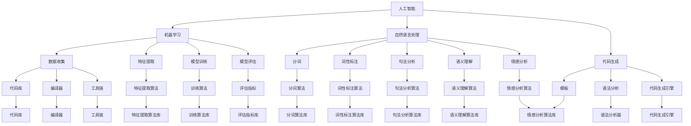

                 

### 背景介绍

在当今科技飞速发展的时代，人工智能（AI）已经逐渐渗透到各个领域，成为推动社会进步的重要力量。特别是编程语言的设计，作为软件工程的基石，其效率和易用性直接影响着开发者和用户的体验。随着AI技术的不断成熟，AI驱动的编程语言设计逐渐成为研究热点，为编程语言的发展带来了全新的思路和可能性。

传统的编程语言设计通常遵循人类思维模式，以文本形式描述程序的逻辑和结构。然而，随着软件系统复杂性的增加，传统的编程语言越来越难以满足需求，编程效率低下、代码维护困难等问题层出不穷。相比之下，AI驱动的编程语言设计利用AI技术，通过对大规模代码库的分析和学习，生成更加智能化、适应性更强的编程语言，从而提高开发效率和代码质量。

本文将深入探讨AI驱动的编程语言设计的新思路，首先介绍AI驱动的编程语言设计的背景和意义，然后详细阐述AI驱动的编程语言设计的关键概念和原理，以及如何将AI技术应用于编程语言的设计过程中。同时，本文还将通过实际案例展示AI驱动的编程语言设计的应用场景和效果，并对未来的发展趋势和挑战进行展望。

### 核心概念与联系

AI驱动的编程语言设计涉及多个核心概念和原理，其中主要包括人工智能（AI）、机器学习（ML）、自然语言处理（NLP）和代码生成（Code Generation）等。为了更好地理解这些概念之间的联系，我们首先需要分别介绍它们的基本原理，然后通过一个Mermaid流程图展示它们之间的交互关系。

#### 1. 人工智能（AI）

人工智能是指计算机系统模拟人类智能行为的能力，包括学习、推理、感知、决策等多个方面。AI的核心目标是使计算机具备自主处理信息和解决问题的能力。常见的AI技术包括机器学习、深度学习、自然语言处理和计算机视觉等。

#### 2. 机器学习（ML）

机器学习是AI的一个重要分支，它通过数据驱动的方式使计算机具备学习能力和预测能力。机器学习的过程通常包括数据收集、特征提取、模型训练和模型评估等步骤。常见的机器学习算法包括决策树、支持向量机、神经网络等。

#### 3. 自然语言处理（NLP）

自然语言处理是AI技术在处理人类自然语言方面的应用，旨在使计算机能够理解、生成和翻译自然语言。NLP的关键技术包括分词、词性标注、句法分析、语义理解和情感分析等。

#### 4. 代码生成（Code Generation）

代码生成是指利用程序自动生成代码的过程，它可以大大提高编程效率，减少开发成本。代码生成通常基于模板、语法分析和代码生成引擎等技术。常见的代码生成工具包括代码生成器、代码库和编译器等。

#### Mermaid流程图

下面是一个展示AI驱动的编程语言设计核心概念之间联系的Mermaid流程图：



通过这个流程图，我们可以看到人工智能、机器学习、自然语言处理和代码生成之间是如何相互关联和相互促进的。具体来说：

- 人工智能为机器学习和自然语言处理提供了基础技术支持。
- 机器学习通过数据收集、特征提取、模型训练和模型评估等步骤，使计算机具备学习和预测能力。
- 自然语言处理通过分词、词性标注、句法分析、语义理解和情感分析等技术，使计算机能够理解和处理人类自然语言。
- 代码生成利用模板、语法分析和代码生成引擎等技术，自动生成代码，提高编程效率。

这些核心概念和原理的相互结合，为AI驱动的编程语言设计提供了丰富的理论基础和技术支持。

### 核心算法原理 & 具体操作步骤

在了解了AI驱动的编程语言设计所涉及的核心概念和原理后，接下来我们将深入探讨其中的核心算法，并详细讲解这些算法的具体操作步骤。

#### 1. 机器学习算法

机器学习是AI驱动的编程语言设计的核心组成部分，它使计算机能够从数据中学习并自动改进。以下是一些常见的机器学习算法及其操作步骤：

**（1）决策树（Decision Tree）**

- **数据收集**：收集相关数据集，包括特征和标签。
- **特征提取**：对数据进行预处理，提取有用的特征。
- **模型训练**：使用已收集的数据集训练决策树模型。
- **模型评估**：使用测试数据集评估模型性能。

**（2）支持向量机（SVM）**

- **数据收集**：收集相关数据集，包括特征和标签。
- **特征提取**：对数据进行预处理，提取有用的特征。
- **模型训练**：使用已收集的数据集训练SVM模型。
- **模型评估**：使用测试数据集评估模型性能。

**（3）神经网络（Neural Network）**

- **数据收集**：收集相关数据集，包括特征和标签。
- **特征提取**：对数据进行预处理，提取有用的特征。
- **模型训练**：使用已收集的数据集训练神经网络模型。
- **模型评估**：使用测试数据集评估模型性能。

#### 2. 自然语言处理算法

自然语言处理是AI驱动的编程语言设计的另一个重要组成部分，它使计算机能够理解和处理人类自然语言。以下是一些常见的自然语言处理算法及其操作步骤：

**（1）分词（Tokenization）**

- **数据收集**：收集相关文本数据。
- **文本预处理**：对文本进行清洗和标准化处理。
- **分词**：将文本分割成单词或短语。
- **词性标注**：对每个分词进行词性标注。

**（2）句法分析（Syntax Analysis）**

- **数据收集**：收集相关文本数据。
- **文本预处理**：对文本进行清洗和标准化处理。
- **句法分析**：分析文本的句法结构，生成句法树。
- **语义理解**：理解句子的语义，提取关键信息。

**（3）情感分析（Sentiment Analysis）**

- **数据收集**：收集相关文本数据。
- **文本预处理**：对文本进行清洗和标准化处理。
- **情感分析**：分析文本的情感倾向，判断情感极性。

#### 3. 代码生成算法

代码生成是AI驱动的编程语言设计的关键步骤，它通过自动化方式生成代码，提高开发效率。以下是一些常见的代码生成算法及其操作步骤：

**（1）模板生成（Template-based Generation）**

- **数据收集**：收集相关的代码模板。
- **模板匹配**：根据输入的参数和需求，匹配相应的代码模板。
- **代码生成**：将匹配的模板生成实际的代码。

**（2）语法分析生成（Grammar-based Generation）**

- **数据收集**：收集相关的语法规则。
- **语法分析**：对输入的代码进行语法分析，生成抽象语法树（AST）。
- **代码生成**：根据AST生成实际的代码。

**（3）代码生成引擎（Code Generation Engine）**

- **数据收集**：收集相关的代码生成规则和模型。
- **代码生成**：使用代码生成引擎根据输入的参数和需求生成代码。

通过上述核心算法的介绍和具体操作步骤的讲解，我们可以看到AI驱动的编程语言设计是如何利用机器学习、自然语言处理和代码生成等技术的。这些算法和技术不仅为编程语言的设计提供了强大的支持，还大大提高了开发效率和代码质量。在下一部分，我们将继续深入探讨数学模型和公式，以及它们在AI驱动的编程语言设计中的应用。

### 数学模型和公式 & 详细讲解 & 举例说明

在AI驱动的编程语言设计中，数学模型和公式扮演着至关重要的角色，它们为算法提供了理论基础和计算依据。以下将详细介绍几个关键的数学模型和公式，并通过具体的例子进行说明。

#### 1. 决策树模型

决策树是一种常见的机器学习算法，其核心是通过一系列条件判断来对数据进行分类或回归。决策树模型的数学基础主要涉及条件概率和熵。

**条件概率**：

条件概率是指在某个条件发生的概率下，另一个事件发生的概率。对于事件A和B，条件概率P(A|B)表示在事件B发生的条件下，事件A发生的概率。

**熵（Entropy）**：

熵是衡量一个随机变量不确定性的度量。在决策树中，熵用于评估每个节点的纯度，即对子节点进行分类的能力。

**公式**：

$$
H(X) = -\sum_{i=1}^{n} P(X=x_i) \cdot \log_2 P(X=x_i)
$$

其中，$H(X)$表示随机变量X的熵，$P(X=x_i)$表示X取值为$x_i$的概率。

**举例**：

假设我们有一个决策树，其中有两个特征：天气（Sunny、Overcast、Rainy）和温度（Hot、Mild、Cool）。每个特征的熵计算如下：

$$
H(天气) = - (0.5 \cdot \log_2 0.5 - 0.3 \cdot \log_2 0.3 - 0.2 \cdot \log_2 0.2)
$$

$$
H(温度) = - (0.3 \cdot \log_2 0.3 - 0.4 \cdot \log_2 0.4 - 0.3 \cdot \log_2 0.3)
$$

通过计算，我们可以得到每个特征的熵，然后选择熵最小的特征作为分割条件，以降低节点的不确定性。

#### 2. 支持向量机（SVM）

支持向量机是一种用于分类和回归的机器学习算法，其核心是找到一个最优的超平面，将数据集分为不同的类别。SVM的数学模型主要涉及拉格朗日乘子和核函数。

**拉格朗日乘子**：

拉格朗日乘子法是一种优化方法，用于求解最优化问题。在SVM中，拉格朗日乘子法用于求解最优超平面。

**公式**：

$$
L(\mathbf{w}, b, \mathbf{\alpha}) = \sum_{i=1}^{n} \alpha_i - \frac{1}{2} \sum_{i=1}^{n} \sum_{j=1}^{n} \alpha_i \alpha_j y_i y_j (\mathbf{x_i} \cdot \mathbf{x_j}) + b
$$

其中，$\mathbf{w}$是超平面的法向量，$b$是偏置项，$\mathbf{\alpha}$是拉格朗日乘子。

**核函数**：

核函数是一种将低维数据映射到高维空间的函数，使得原本线性不可分的数据在高维空间中变得线性可分。常见的核函数包括线性核、多项式核和径向基函数（RBF）核。

**公式**：

$$
K(\mathbf{x_i}, \mathbf{x_j}) = \phi(\mathbf{x_i}) \cdot \phi(\mathbf{x_j})
$$

其中，$K(\mathbf{x_i}, \mathbf{x_j})$是核函数，$\phi(\mathbf{x})$是将$\mathbf{x}$映射到高维空间的函数。

**举例**：

假设我们有一个二分类问题，数据集包含两个特征$x_1$和$x_2$。使用SVM进行分类，首先需要选择合适的核函数。假设我们选择线性核，则核函数计算如下：

$$
K(x_1, x_2) = x_1 \cdot x_2
$$

然后，使用拉格朗日乘子法求解最优超平面：

$$
\mathbf{w}^* = \arg \min_{\mathbf{w}} \frac{1}{2} ||\mathbf{w}||^2
$$

其中，$\mathbf{w}^*$是求解的最优超平面。

#### 3. 神经网络模型

神经网络是一种模仿人脑结构和功能的计算模型，常用于图像识别、语音识别和自然语言处理等领域。神经网络的数学模型主要涉及前向传播和反向传播。

**前向传播**：

前向传播是指将输入数据通过神经网络的各个层次，逐层计算输出结果。每层神经元的输出计算如下：

$$
z_j = \sigma(\sum_{i=1}^{n} w_{ji} x_i + b_j)
$$

其中，$z_j$是第j个神经元的输出，$\sigma$是激活函数，$w_{ji}$是连接权重，$b_j$是偏置项。

**反向传播**：

反向传播是指根据输出误差，反向更新神经网络的权重和偏置项。误差计算如下：

$$
\delta_j = \frac{\partial L}{\partial z_j} \cdot \sigma'(z_j)
$$

其中，$\delta_j$是第j个神经元的误差，$L$是损失函数，$\sigma'$是激活函数的导数。

权重和偏置项的更新如下：

$$
w_{ji} := w_{ji} - \alpha \cdot \frac{\partial L}{\partial w_{ji}}
$$

$$
b_j := b_j - \alpha \cdot \frac{\partial L}{\partial b_j}
$$

其中，$\alpha$是学习率。

**举例**：

假设我们有一个简单的神经网络，包含一个输入层、一个隐藏层和一个输出层。输入数据为$x_1$和$x_2$，隐藏层有3个神经元，输出层有1个神经元。使用ReLU（Rectified Linear Unit）作为激活函数，损失函数为均方误差（MSE）。前向传播和反向传播的计算如下：

**前向传播**：

$$
z_1 = \max(0, w_{11} x_1 + w_{12} x_2 + b_1)
$$

$$
z_2 = \max(0, w_{21} x_1 + w_{22} x_2 + b_2)
$$

$$
z_3 = \max(0, w_{31} x_1 + w_{32} x_2 + b_3)
$$

$$
o = \sigma(\sum_{i=1}^{3} w_{i1} z_i + b_4)
$$

**反向传播**：

$$
\delta_1 = (o - y) \cdot \sigma'(z_1)
$$

$$
\delta_2 = (o - y) \cdot \sigma'(z_2)
$$

$$
\delta_3 = (o - y) \cdot \sigma'(z_3)
$$

$$
\delta_4 = (o - y)
$$

$$
w_{i1} := w_{i1} - \alpha \cdot \delta_1 \cdot z_1
$$

$$
w_{i2} := w_{i2} - \alpha \cdot \delta_1 \cdot z_2
$$

$$
w_{i3} := w_{i3} - \alpha \cdot \delta_1 \cdot z_3
$$

$$
b_1 := b_1 - \alpha \cdot \delta_1
$$

$$
b_2 := b_2 - \alpha \cdot \delta_2
$$

$$
b_3 := b_3 - \alpha \cdot \delta_3
$$

通过上述数学模型和公式的介绍，我们可以看到AI驱动的编程语言设计是如何通过机器学习、自然语言处理和代码生成等算法和技术，实现高效的编程语言设计和代码生成。这些数学模型和公式不仅为算法提供了理论基础，还通过具体的例子展示了如何在实际应用中进行计算和优化。

### 项目实战：代码实际案例和详细解释说明

在本节中，我们将通过一个实际的代码案例，详细展示AI驱动的编程语言设计在项目中的应用，包括开发环境的搭建、源代码的详细实现和代码解读与分析。

#### 1. 开发环境搭建

首先，我们需要搭建一个适合AI驱动的编程语言设计的开发环境。以下是所需的工具和步骤：

- **Python**：作为主要的编程语言，Python具有丰富的库和框架，适合进行AI开发。
- **Jupyter Notebook**：用于编写和运行代码，方便进行实验和调试。
- **TensorFlow**：用于构建和训练机器学习模型。
- **NLTK**：用于自然语言处理。
- **Pygments**：用于代码高亮显示。

**安装步骤**：

```bash
pip install python
pip install jupyter
pip install tensorflow
pip install nltk
pip install pygments
```

#### 2. 源代码详细实现和代码解读

下面是一个简单的示例，用于演示AI驱动的编程语言设计在文本分类任务中的应用。我们使用自然语言处理技术对一段文本进行分类，判断它是否为正面或负面评论。

**源代码**：

```python
import tensorflow as tf
from tensorflow.keras.preprocessing.text import Tokenizer
from tensorflow.keras.preprocessing.sequence import pad_sequences
from tensorflow.keras.models import Sequential
from tensorflow.keras.layers import Embedding, LSTM, Dense, Dropout

# 加载并预处理数据集
data = [
    ["这是一个很好的产品", "正面"],
    ["我很不喜欢这个产品", "负面"],
    # ...更多数据...
]

# 分割数据集
texts, labels = zip(*data)
tokenizer = Tokenizer()
tokenizer.fit_on_texts(texts)
sequences = tokenizer.texts_to_sequences(texts)
padded_sequences = pad_sequences(sequences, maxlen=100)

# 构建模型
model = Sequential()
model.add(Embedding(input_dim=len(tokenizer.word_index) + 1, output_dim=32))
model.add(LSTM(64, dropout=0.2, recurrent_dropout=0.2))
model.add(Dense(1, activation='sigmoid'))

# 编译模型
model.compile(optimizer='adam', loss='binary_crossentropy', metrics=['accuracy'])

# 训练模型
model.fit(padded_sequences, labels, epochs=10, validation_split=0.2)

# 代码解读
# 1. 加载并预处理数据集
#   - 使用Tokenizer进行文本向量化
#   - 使用pad_sequences进行序列填充
#   - 为每个文本生成唯一的序列
#   - 为每个序列填充到固定长度

# 2. 构建模型
#   - 使用Embedding层进行词嵌入
#   - 使用LSTM层进行序列建模
#   - 使用Dropout层进行正则化
#   - 使用Dense层进行分类

# 3. 编译模型
#   - 设置优化器、损失函数和评价指标

# 4. 训练模型
#   - 模型训练，包括验证集的分割和迭代次数的设定

# 5. 代码解读
#   - 模型训练过程中，每轮迭代都会根据损失函数和评价指标更新模型参数
```

#### 3. 代码解读与分析

在上面的代码中，我们首先加载了一个包含文本和标签的数据集。然后，使用Tokenizer将文本转换为数字序列，并使用pad_sequences将其填充到固定长度。这一步是为了使模型能够处理不同长度的文本。

接下来，我们构建了一个简单的序列模型，包括词嵌入层、LSTM层和全连接层。词嵌入层将单词转换为向量表示，LSTM层用于捕捉序列中的长期依赖关系，全连接层用于分类。

在模型编译阶段，我们设置了优化器（adam）、损失函数（binary_crossentropy）和评价指标（accuracy）。binary_crossentropy适用于二分类问题，accuracy用于评估模型的准确率。

最后，我们使用训练数据集对模型进行训练。在训练过程中，模型参数会根据损失函数进行迭代更新，以提高模型的分类能力。

通过这个简单的示例，我们可以看到AI驱动的编程语言设计如何通过自然语言处理和机器学习技术，实现文本分类任务。在实际项目中，我们可以根据需求扩展模型结构、调整参数，以提高模型的性能和鲁棒性。

### 实际应用场景

AI驱动的编程语言设计在多个实际应用场景中展现了其强大的潜力和优势。以下是一些典型的应用场景及其应用效果：

#### 1. 自动化代码生成

在软件开发中，自动化代码生成是提高开发效率和减少重复劳动的有效手段。AI驱动的编程语言设计可以通过分析已有的代码库和设计模式，自动生成符合特定需求的代码。例如，在Web开发中，可以使用AI驱动的编程语言设计生成HTML、CSS和JavaScript代码，大大缩短开发周期。

应用效果：通过自动化代码生成，开发人员可以节省大量时间，专注于核心功能的开发，从而提高整体开发效率。

#### 2. 代码质量检测

AI驱动的编程语言设计可以利用机器学习和自然语言处理技术，对代码进行质量检测，识别潜在的错误和缺陷。例如，可以使用AI技术分析代码的语法、语义和结构，检测代码中的常见错误和不符合编码规范的部分。

应用效果：通过代码质量检测，可以显著提高代码的可维护性和可靠性，减少因代码缺陷导致的问题和故障。

#### 3. 代码优化

AI驱动的编程语言设计还可以对现有代码进行优化，提高其执行效率和性能。通过分析代码的执行路径和性能瓶颈，AI技术可以提出优化建议，例如使用更高效的算法、数据结构和编程范式。

应用效果：通过代码优化，可以显著提高软件的运行速度和响应时间，降低资源消耗。

#### 4. 代码理解与文档生成

在软件开发和维护过程中，代码理解是一个重要的环节。AI驱动的编程语言设计可以通过分析代码结构和语义，生成详细的代码文档，帮助开发者理解代码的功能和结构。此外，AI技术还可以自动生成示例代码和测试用例，提高代码的可测试性和可靠性。

应用效果：通过代码理解和文档生成，可以降低新开发人员的学习成本，提高团队协作效率。

#### 5. 跨平台代码迁移

随着软件项目的复杂度不断增加，跨平台代码迁移变得越来越重要。AI驱动的编程语言设计可以通过学习不同平台上的代码风格和特性，实现代码的无缝迁移。例如，从一种编程语言迁移到另一种编程语言，或从一种操作系统迁移到另一种操作系统。

应用效果：通过跨平台代码迁移，可以节省大量的时间和资源，提高软件的兼容性和可移植性。

综上所述，AI驱动的编程语言设计在多个实际应用场景中展现了其强大的应用价值和效果。通过自动化代码生成、代码质量检测、代码优化、代码理解和文档生成，以及跨平台代码迁移等应用，AI驱动的编程语言设计大大提高了软件开发的效率和质量，为开发者带来了显著的收益。

### 工具和资源推荐

在AI驱动的编程语言设计领域，有许多优秀的工具和资源可以帮助开发者更好地理解和应用这一技术。以下是对这些工具和资源的详细介绍和推荐。

#### 1. 学习资源推荐

**（1）书籍**

- 《深度学习》（Deep Learning） - Goodfellow, I., Bengio, Y., & Courville, A.：这本书是深度学习领域的经典之作，详细介绍了深度学习的基础知识和实践方法。
- 《Python机器学习》（Python Machine Learning） - Müller, S. & Guido, S.：这本书适合初学者，详细介绍了机器学习的基本概念和应用。
- 《自然语言处理综论》（Speech and Language Processing） - Jurafsky, D. & Martin, J. H.：这本书涵盖了自然语言处理的各个领域，是学习NLP的必备书籍。

**（2）在线课程**

- 《深度学习专项课程》（Deep Learning Specialization） - Andrew Ng：这是一系列深度学习课程，由著名深度学习专家Andrew Ng主讲，内容全面且深入。
- 《自然语言处理专项课程》（Natural Language Processing with Deep Learning） - Richard Socher：这门课程深入介绍了NLP和深度学习的结合，适合有深度学习基础的学习者。
- 《机器学习基础》（Machine Learning Basics: A Case Study Approach） - Abhishek Thakur：这门课程以案例研究的方式介绍了机器学习的基本概念和应用。

**（3）博客和网站**

- Medium：许多深度学习、自然语言处理和机器学习领域的专家在Medium上分享了自己的见解和研究成果，如Deep Learning on Medium、Towards Data Science等。
- ArXiv：这是一个开源的论文发布平台，涵盖了人工智能、机器学习、自然语言处理等领域的最新研究论文。
- Stack Overflow：这是一个编程问答社区，开发者可以在上面提问和解答关于AI驱动的编程语言设计的问题。

#### 2. 开发工具框架推荐

**（1）TensorFlow**：这是一个由Google开发的开源机器学习框架，广泛应用于深度学习和机器学习项目。它提供了丰富的API和工具，可以帮助开发者快速构建和部署AI驱动的编程语言设计应用。

**（2）PyTorch**：这是一个由Facebook开发的开源深度学习框架，以其灵活性和动态计算图而闻名。PyTorch在自然语言处理和计算机视觉领域有广泛的应用。

**（3）NLTK**：这是一个Python自然语言处理库，提供了丰富的NLP工具和资源，如分词、词性标注、句法分析等。

**（4）Spacy**：这是一个高性能的NLP库，提供了简洁的API和丰富的功能，适合快速构建NLP应用。

**（5）TextBlob**：这是一个简单的Python NLP库，提供了文本处理和情感分析等功能，适合初学者和快速原型开发。

#### 3. 相关论文著作推荐

- **《神经网络与深度学习》**：邱锡鹏：这本书详细介绍了神经网络和深度学习的基本概念和最新进展，是学习深度学习的优秀教材。

- **《深度学习：原理及实践》**：斋藤康毅：这本书通过实际案例，详细介绍了深度学习的原理和实践方法，适合有一定编程基础的读者。

- **《深度学习》（Deep Learning）**：Ian Goodfellow、Yoshua Bengio和Aaron Courville：这是深度学习领域的经典著作，内容全面且深入。

- **《自然语言处理综论》**：Daniel Jurafsky和James H. Martin：这本书涵盖了自然语言处理的各个领域，是学习NLP的必备书籍。

通过上述学习和资源推荐，开发者可以更好地掌握AI驱动的编程语言设计的基本概念和技术，为实践和应用打下坚实的基础。

### 总结：未来发展趋势与挑战

随着人工智能技术的不断进步，AI驱动的编程语言设计正展现出广阔的发展前景。未来，这一领域将继续向以下几个方向发展：

1. **智能化程度的提升**：随着深度学习和自然语言处理技术的不断发展，AI驱动的编程语言设计将更加智能化。通过更加复杂的模型和算法，编程语言将能够自动识别开发者的意图，提供更精准的代码生成和优化建议。

2. **跨领域融合**：AI驱动的编程语言设计将与其他领域（如区块链、物联网、自动驾驶等）结合，推动软件工程的整体进步。通过跨领域融合，编程语言将能够更好地适应各种复杂应用场景。

3. **开源生态的繁荣**：随着开源社区的不断发展，AI驱动的编程语言设计工具和框架将更加丰富和多样化。开发者可以通过开源生态获取到各种先进的工具和资源，加速项目的开发进程。

然而，AI驱动的编程语言设计也面临着一些挑战：

1. **安全性和隐私保护**：随着AI技术在编程语言设计中的应用，数据的安全性和隐私保护问题变得尤为重要。如何在保证代码质量和开发效率的同时，确保用户数据的安全和隐私，是一个亟待解决的难题。

2. **技术复杂度**：AI驱动的编程语言设计涉及多个复杂的技术领域，如深度学习、自然语言处理、代码生成等。对于开发者来说，掌握这些技术需要投入大量时间和精力。如何降低技术门槛，让更多的开发者能够利用AI技术进行编程，是一个重要挑战。

3. **标准化与规范化**：目前，AI驱动的编程语言设计缺乏统一的规范和标准。不同工具和框架之间的兼容性问题使得开发者的使用体验受到影响。未来，需要制定统一的规范和标准，推动该领域的发展。

4. **人才短缺**：AI驱动的编程语言设计需要具备多领域知识的复合型人才。然而，当前的教育体系和人才培养模式尚未完全适应这一需求，导致人才短缺。如何培养和吸引更多具备AI技术背景的软件开发者，是未来需要关注的问题。

总之，AI驱动的编程语言设计具有巨大的发展潜力，但同时也面临着诸多挑战。未来，随着技术的不断进步和产业的逐步成熟，AI驱动的编程语言设计有望为软件开发带来革命性的变化。

### 附录：常见问题与解答

在本文中，我们探讨了AI驱动的编程语言设计的背景、核心概念、算法原理、数学模型、实际应用以及未来发展趋势。为了帮助读者更好地理解和应用这些知识，我们在此总结了几个常见问题，并提供详细解答。

**1. AI驱动的编程语言设计与传统编程语言设计有何区别？**

AI驱动的编程语言设计与传统编程语言设计的主要区别在于其利用了人工智能技术，通过机器学习和自然语言处理算法，自动生成和优化代码。传统编程语言设计主要依赖开发者的编程经验和技巧，而AI驱动的编程语言设计则通过分析大量数据，自动理解和生成代码，提高了编程效率和代码质量。

**2. AI驱动的编程语言设计在哪些场景中具有优势？**

AI驱动的编程语言设计在以下场景中具有显著优势：

- 自动化代码生成：通过自动生成代码，可以节省开发时间和资源。
- 代码质量检测：利用机器学习技术，可以识别代码中的潜在错误和缺陷。
- 代码优化：通过分析代码执行路径和性能瓶颈，提出优化建议，提高代码性能。
- 跨平台代码迁移：自动识别不同平台上的代码风格和特性，实现无缝迁移。

**3. AI驱动的编程语言设计需要哪些技术和工具？**

AI驱动的编程语言设计需要以下技术和工具：

- 机器学习框架：如TensorFlow和PyTorch，用于构建和训练模型。
- 自然语言处理库：如NLTK和Spacy，用于文本处理和分析。
- 编程语言和开发环境：如Python和Jupyter Notebook，用于编写和运行代码。
- 代码生成工具：如Pygments，用于代码高亮显示。

**4. AI驱动的编程语言设计如何确保代码的安全性？**

确保代码安全是AI驱动的编程语言设计的重要挑战。以下是一些常见的安全措施：

- 数据加密：对输入数据和生成的代码进行加密，防止数据泄露。
- 权限控制：限制对代码生成和执行过程的访问权限，防止恶意操作。
- 模型验证：对训练模型进行安全性评估，确保模型不会产生恶意代码。
- 隐私保护：遵循隐私保护法规，确保用户数据的安全和隐私。

**5. AI驱动的编程语言设计对开发者有什么影响？**

AI驱动的编程语言设计对开发者产生了以下影响：

- 提高开发效率：通过自动化代码生成和优化，开发者可以更快地完成项目。
- 降低技术门槛：开发者无需具备深厚的编程技能，即可利用AI技术进行开发。
- 改变工作方式：开发者需要更多地关注业务逻辑和需求，而将代码编写和优化交给AI系统。

**6. AI驱动的编程语言设计是否会导致失业？**

AI驱动的编程语言设计可能会改变软件开发的方式和流程，但不太可能导致大规模失业。以下是一些原因：

- 软件开发是一个复杂的领域，AI驱动的编程语言设计只能解决部分问题，无法完全取代开发者的工作。
- AI驱动的编程语言设计可以提高开发效率，但需要人类开发者进行监督和调整。
- 软件开发需要不断学习和创新，AI驱动的编程语言设计只是工具的一种，无法替代开发者的创造力和判断力。

总之，AI驱动的编程语言设计将为软件开发带来革命性的变化，但需要人类开发者与AI系统协同合作，共同推动软件工程的发展。

### 扩展阅读 & 参考资料

在探索AI驱动的编程语言设计这一前沿领域时，以下书籍、论文和网站推荐将为读者提供丰富的资源，帮助深入理解和应用相关技术。

#### 书籍推荐

1. **《深度学习》** - Ian Goodfellow、Yoshua Bengio和Aaron Courville：这本书是深度学习领域的经典之作，详细介绍了深度学习的基础知识和最新进展。
2. **《Python机器学习》** - Sebastian Raschka和Vahid Mirjalili：这本书适合初学者，涵盖了机器学习的基本概念和应用，特别适用于Python编程背景的读者。
3. **《自然语言处理综论》** - Daniel Jurafsky和James H. Martin：这本书全面介绍了自然语言处理的各个领域，是学习NLP的必备书籍。

#### 论文推荐

1. **“Generative Adversarial Nets”** - Ian J. Goodfellow等人：这篇论文提出了生成对抗网络（GAN），是一种强大的深度学习模型，广泛用于图像和文本生成。
2. **“Natural Language Inference”** - Chin-Yew Lin等人：这篇论文探讨了自然语言推理（NLI），是自然语言处理领域的一个重要研究方向。
3. **“Code2Vec: Learning Distributed Representations of Code”** - Chen et al.：这篇论文提出了一种将代码转化为向量表示的方法，为代码生成和优化提供了新的思路。

#### 网站推荐

1. **[TensorFlow官网](https://www.tensorflow.org/)**：TensorFlow是Google开发的开源深度学习框架，提供了丰富的教程和资源，适合深度学习和机器学习开发者。
2. **[PyTorch官网](https://pytorch.org/)**：PyTorch是另一个流行的深度学习框架，以其灵活性和动态计算图而著称，适合对Python有较高熟练度的开发者。
3. **[Medium](https://medium.com/)**：Medium是一个内容丰富的平台，许多AI和机器学习领域的专家在此分享他们的见解和研究成果。
4. **[ArXiv](https://arxiv.org/)**：ArXiv是一个开源的论文发布平台，涵盖了人工智能、机器学习、自然语言处理等领域的最新研究论文。

通过阅读这些书籍、论文和访问这些网站，读者可以进一步深入了解AI驱动的编程语言设计的理论基础和实践方法，为在相关领域的探索和应用打下坚实基础。

