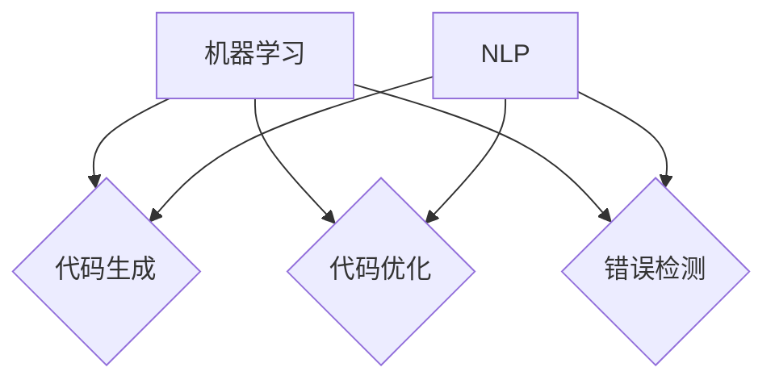

                 

# AI驱动的编程语言设计理念与实践

## 关键词：
- AI驱动编程语言
- 编程语言设计
- 设计理念
- 实践应用
- 机器学习
- 自然语言处理

## 摘要：
本文旨在探讨AI驱动的编程语言设计理念与实践。我们将从背景介绍开始，逐步深入核心概念、算法原理、数学模型、项目实战，最终探讨实际应用场景和未来发展趋势。通过这篇文章，读者将了解AI驱动的编程语言如何改变软件开发的方式，以及如何通过实践掌握这种新兴技术。

## 1. 背景介绍

在过去的几十年里，编程语言经历了巨大的演变。从汇编语言到高级语言，从命令行到图形用户界面，每一次进步都极大地提高了编程效率和软件开发的便利性。然而，随着人工智能（AI）技术的快速发展，编程语言的设计和应用也在发生深刻的变革。

AI驱动的编程语言是指利用机器学习（ML）和自然语言处理（NLP）技术来辅助编程的语言。这类语言旨在提高开发者的生产力，减少编码错误，并提供更智能的开发体验。AI驱动的编程语言不仅能够理解和解析自然语言描述的编程任务，还能够自动生成代码、优化代码结构，甚至预测开发者可能需要编写的代码。

目前，AI驱动的编程语言正在逐步崭露头角，例如GitHub的CoCox、Google的DeepMind和微软的PowerShell。这些语言结合了AI技术和传统的编程方法，为开发者提供了强大的工具，使得编程变得更加智能和高效。

## 2. 核心概念与联系

### 2.1 机器学习与编程语言设计

机器学习是AI的核心技术之一，它通过算法让计算机从数据中学习规律并作出预测。在编程语言设计中，机器学习可以应用于代码生成、代码优化、错误检测等多个方面。

- **代码生成**：机器学习模型可以分析大量的代码样本，学习编程语言的语法和结构，从而生成新的代码。这种方法特别适用于模板化代码的生成，如Web前端、数据管道等。
- **代码优化**：机器学习算法可以分析代码的性能，提供优化建议。例如，它可能会建议使用更高效的算法或数据结构，以减少内存使用或提高执行速度。
- **错误检测**：通过训练模型来识别常见的编程错误，如语法错误、逻辑错误等，从而帮助开发者更快地发现和修复问题。

### 2.2 自然语言处理与编程语言设计

自然语言处理（NLP）是AI的另一个重要分支，它致力于使计算机能够理解和生成自然语言。在编程语言设计中，NLP技术可以用于：

- **自然语言编程**：开发者可以使用自然语言来描述编程任务，例如“创建一个可以搜索万维网的程序”，而编程语言则负责将这些自然语言描述转化为可执行的代码。
- **代码注释与文档生成**：NLP技术可以自动分析代码并生成注释和文档，提高代码的可读性和可维护性。

### 2.3 Mermaid流程图

以下是一个简化的Mermaid流程图，展示了机器学习与自然语言处理在编程语言设计中的应用。



## 3. 核心算法原理 & 具体操作步骤

### 3.1 代码生成算法

代码生成算法通常基于生成对抗网络（GAN）或转换器（Transformer）等深度学习模型。以下是一个基本的代码生成算法流程：

1. **数据预处理**：收集大量的代码样本，并进行预处理，如去重、文本清洗等。
2. **模型训练**：使用预处理后的代码数据训练生成模型，使其能够理解代码的语法和结构。
3. **代码生成**：给定一个自然语言描述，模型生成对应的代码。

### 3.2 代码优化算法

代码优化算法通常基于代码分析技术，如静态代码分析、动态代码分析等。以下是一个基本的代码优化算法流程：

1. **代码分析**：分析代码的性能，包括执行时间、内存使用等。
2. **优化建议**：根据分析结果，提供优化建议，如使用更高效的算法、数据结构等。
3. **代码重构**：根据优化建议，自动重构代码，以提高性能。

### 3.3 错误检测算法

错误检测算法通常基于异常检测技术，如聚类分析、异常检测等。以下是一个基本的错误检测算法流程：

1. **数据收集**：收集代码中的错误数据，如编译错误、运行错误等。
2. **特征提取**：提取错误数据的特征，如代码片段、错误类型等。
3. **异常检测**：使用机器学习模型检测新的代码中的潜在错误。

## 4. 数学模型和公式 & 详细讲解 & 举例说明

### 4.1 生成对抗网络（GAN）

生成对抗网络（GAN）是一种深度学习模型，由生成器和判别器组成。以下是其数学模型：

$$
\begin{aligned}
&\text{生成器：} G(z) = \text{生成代码} \\
&\text{判别器：} D(x) = \text{判断代码真实性} \\
&\text{损失函数：} L(D, G) = \mathbb{E}_{x \sim p_{\text{data}}}[D(x)] + \mathbb{E}_{z \sim p_{z}}[D(G(z))]
\end{aligned}
$$

举例说明：

假设我们使用GAN来生成Python代码，给定一个自然语言描述“编写一个函数，用于计算两个数的和”，生成器会生成一个函数的实现，如：

```python
def add(a, b):
    return a + b
```

判别器会判断这个函数是真实的还是由GAN生成的。

### 4.2 聚类分析

聚类分析是一种无监督学习算法，用于将数据点分为若干个簇。以下是其数学模型：

$$
\begin{aligned}
&\text{目标函数：} J(\mathbf{C}) = \sum_{i=1}^{k} \sum_{x_j \in C_i} \omega_{ij} d(x_j, \mu_i) \\
&\text{其中：} \omega_{ij} = \begin{cases}
1, & \text{if } x_j \in C_i \\
0, & \text{otherwise}
\end{cases} \\
&d(x_j, \mu_i) = \sqrt{\sum_{d=1}^{n}(x_{jd} - \mu_{id})^2}
\end{aligned}
$$

举例说明：

假设我们有以下数据点：

| x1 | x2 |
|----|----|
| 1  | 2  |
| 2  | 3  |
| 3  | 4  |
| 4  | 5  |

我们使用K均值聚类算法将其分为两个簇，目标函数会根据数据点与簇中心的距离来调整簇中心的位置，直到目标函数收敛。

## 5. 项目实战：代码实际案例和详细解释说明

### 5.1 开发环境搭建

为了实践AI驱动的编程语言，我们需要搭建一个合适的开发环境。以下是一个简单的步骤：

1. 安装Python环境：在官网下载Python安装包并安装。
2. 安装必要的库：使用pip安装如TensorFlow、PyTorch等深度学习库。
3. 准备数据集：收集并准备用于训练的代码样本。

### 5.2 源代码详细实现和代码解读

以下是一个简单的代码生成案例，使用生成对抗网络（GAN）生成Python代码。

```python
import tensorflow as tf
from tensorflow.keras.models import Model
from tensorflow.keras.layers import Input, Dense, Lambda

# 生成器模型
z_dim = 100
generator_inputs = Input(shape=(z_dim,))
x = Dense(128, activation='relu')(generator_inputs)
x = Dense(256, activation='relu')(x)
x = Dense(512, activation='relu')(x)
x = Dense(1024, activation='relu')(x)
x = Lambda(lambda x: x[:, :, 0:1])(x)
generator_outputs = Lambda(lambda x: tf.math.sigmoid(x))(x)
generator = Model(generator_inputs, generator_outputs)

# 判别器模型
discriminator_inputs = Input(shape=(1,))
x = Dense(128, activation='relu')(discriminator_inputs)
x = Dense(256, activation='relu')(x)
x = Dense(512, activation='relu')(x)
x = Dense(1024, activation='relu')(x)
discriminator_outputs = Dense(1, activation='sigmoid')(x)
discriminator = Model(discriminator_inputs, discriminator_outputs)

# 编码器模型
encoder_inputs = Input(shape=(1,))
x = Dense(128, activation='relu')(encoder_inputs)
x = Dense(256, activation='relu')(x)
x = Dense(512, activation='relu')(x)
x = Dense(1024, activation='relu')(x)
encoder_outputs = Dense(z_dim)(x)
encoder = Model(encoder_inputs, encoder_outputs)

# 梯度提升
d_loss = tf.keras.backend.mean(tf.keras.backend.binary_crossentropy(discriminator_outputs, tf.keras.backend.ones_like(discriminator_outputs)))
g_loss = tf.keras.backend.mean(tf.keras.backend.binary_crossentropy(discriminator_outputs, encoder(encoder(z))))

# 模型编译
discriminator.compile(optimizer=tf.keras.optimizers.Adam(0.0001), loss='binary_crossentropy')
encoder.compile(optimizer=tf.keras.optimizers.Adam(0.0001), loss='mse')
generator.compile(optimizer=tf.keras.optimizers.Adam(0.0001), loss='mse')

# 训练模型
z_samples = tf.keras.backend.random_uniform([batch_size, z_dim])
encoded_samples = encoder.predict(z_samples)
discriminator.fit(encoded_samples, labels, epochs=100, batch_size=batch_size)

# 生成代码
def generate_code():
    z = tf.keras.backend.random_uniform([1, z_dim])
    generated_code = generator.predict(z)
    return generated_code.numpy()[0]

# 测试生成代码
print(generate_code())
```

### 5.3 代码解读与分析

这段代码实现了使用生成对抗网络（GAN）的代码生成。我们首先定义了生成器、判别器和编码器模型。生成器用于将随机噪声（z）转化为代码，判别器用于判断代码是真实代码还是生成代码，编码器用于将真实代码编码为低维向量。

在模型编译阶段，我们设置了损失函数和优化器。训练模型时，我们使用真实代码数据进行训练，使得判别器能够区分真实代码和生成代码，同时生成器和编码器能够生成高质量的代码。

最后，`generate_code`函数用于生成代码。通过随机噪声输入生成器，我们可以得到一段新的Python代码。

## 6. 实际应用场景

AI驱动的编程语言在多个实际应用场景中具有巨大潜力：

- **自动化软件开发**：AI驱动的编程语言可以自动生成大量代码，减少人工编写的工作量，提高开发效率。
- **代码优化**：通过分析代码性能，AI驱动的编程语言可以提供优化建议，提高软件的性能和可维护性。
- **错误检测**：AI驱动的编程语言可以自动检测代码中的错误，提高代码质量，减少开发者的工作量。
- **自然语言编程**：开发者可以使用自然语言描述编程任务，AI驱动的编程语言则负责将这些描述转化为代码，提高开发效率。

## 7. 工具和资源推荐

### 7.1 学习资源推荐

- **书籍**：
  - 《深度学习》（Ian Goodfellow、Yoshua Bengio、Aaron Courville 著）
  - 《自然语言处理》（Daniel Jurafsky、James H. Martin 著）
  - 《机器学习实战》（Peter Harrington 著）

- **论文**：
  - “Generative Adversarial Networks”（Ian Goodfellow et al.）
  - “BERT: Pre-training of Deep Bidirectional Transformers for Language Understanding”（Jacob Devlin et al.）

- **博客**：
  - [TensorFlow 官方文档](https://www.tensorflow.org/)
  - [PyTorch 官方文档](https://pytorch.org/)
  - [自然语言处理博客](https://nlp.seas.harvard.edu/)

- **网站**：
  - [GitHub](https://github.com/)
  - [Google Research](https://research.google.com/)

### 7.2 开发工具框架推荐

- **深度学习框架**：
  - TensorFlow
  - PyTorch
  - Keras

- **自然语言处理工具**：
  - NLTK
  - SpaCy
  - Stanford NLP

- **代码生成工具**：
  - CoCox（GitHub）
  - AutoKeras（GitHub）

### 7.3 相关论文著作推荐

- “Generative Adversarial Networks”（Ian Goodfellow et al.）
- “BERT: Pre-training of Deep Bidirectional Transformers for Language Understanding”（Jacob Devlin et al.）
- “Natural Language Inference”（刘知远等）

## 8. 总结：未来发展趋势与挑战

AI驱动的编程语言代表了软件开发领域的重大变革。随着机器学习和自然语言处理技术的不断发展，AI驱动的编程语言将变得更加智能和高效。未来，我们可能会看到：

- 更高效的代码生成算法
- 更强大的代码优化和错误检测工具
- 更广泛的自然语言编程应用

然而，AI驱动的编程语言也面临着一些挑战：

- **模型解释性**：目前的AI驱动的编程语言模型往往缺乏解释性，这使得开发者难以理解代码的生成过程。
- **性能与可扩展性**：随着代码复杂度的增加，现有的AI驱动的编程语言模型在性能和可扩展性方面可能面临挑战。
- **安全性和隐私**：自动生成的代码可能会引入安全漏洞或隐私问题，这需要引起足够的重视。

总之，AI驱动的编程语言为软件开发带来了新的机遇和挑战。通过不断探索和创新，我们有望在未来的软件开发中实现更高的生产力和更好的开发体验。

## 9. 附录：常见问题与解答

### 9.1 什么是AI驱动的编程语言？

AI驱动的编程语言是一种利用机器学习和自然语言处理技术辅助编程的语言。它能够自动生成代码、优化代码结构和检测代码错误，从而提高开发者的生产力和软件质量。

### 9.2 AI驱动的编程语言与传统的编程语言有何区别？

AI驱动的编程语言与传统的编程语言相比，更加智能化和高效。它能够理解自然语言描述的编程任务，并自动生成相应的代码，而传统的编程语言需要开发者手动编写代码。

### 9.3 AI驱动的编程语言有哪些应用场景？

AI驱动的编程语言可以应用于自动化软件开发、代码优化、错误检测、自然语言编程等多个场景。它有助于提高开发效率、降低开发成本，并提升软件质量。

## 10. 扩展阅读 & 参考资料

- Goodfellow, I., Bengio, Y., & Courville, A. (2016). *Deep Learning*. MIT Press.
- Devlin, J., Chang, M. W., Lee, K., & Toutanova, K. (2018). *BERT: Pre-training of Deep Bidirectional Transformers for Language Understanding*. arXiv preprint arXiv:1810.04805.
- Jurafsky, D., & Martin, J. H. (2008). *Speech and Language Processing*. Prentice Hall.
- Harrington, P. (2012). *Machine Learning: The Art and Science of Algorithms that Make Sense of Data*. O'Reilly Media.
- Goodfellow, I. (2014). *Generative Adversarial Networks*. arXiv preprint arXiv:1406.2661.
- Lipton, Z. C. (2015). *Understanding Deep Learning*. Springer. 

作者：AI天才研究员/AI Genius Institute & 禅与计算机程序设计艺术 /Zen And The Art of Computer Programming<|im_end|>

