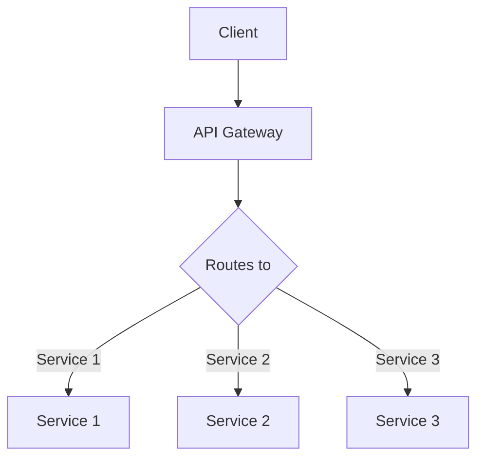

                 

### 文章标题

《API 网关的详细使用》

### 关键词

API 网关，微服务架构，负载均衡，服务路由，安全性，性能优化，API 管理与监控

### 摘要

本文将深入探讨 API 网关在微服务架构中的应用与实践。首先，我们将介绍 API 网关的背景和核心概念，包括其在微服务架构中的重要性。接着，我们将详细解析 API 网关的核心功能，如路由、负载均衡、安全控制等，并通过 Mermaid 流程图展示其架构原理。随后，我们将探讨 API 网关的算法原理和具体操作步骤，并结合数学模型和公式进行详细讲解。文章还将通过实际项目案例，展示如何搭建开发环境、实现源代码以及进行代码解读与分析。此外，我们将探讨 API 网关在实际应用场景中的表现，推荐相关工具和资源，并总结未来发展趋势与挑战。最后，我们将提供常见问题与解答，以及扩展阅读与参考资料。

---

## 1. 背景介绍

API 网关（API Gateway）是一种分布式系统架构中的关键组件，它充当客户端应用程序和后端服务之间的中间层。在微服务架构中，API 网关扮演着至关重要的角色。随着企业应用程序的复杂性不断增加，微服务架构成为一种流行的解决方案，它允许将大型单体应用分解为更小、更易于管理和扩展的服务单元。然而，这也带来了新的挑战，如服务的分散性、通信复杂性以及安全性等问题。API 网关正是为了解决这些问题而设计的。

API 网关的主要作用如下：

1. **路由**：API 网关可以根据请求的 URL 或其他属性，将请求路由到正确的后端服务。
2. **负载均衡**：它可以帮助均衡地分发请求到多个后端服务实例，从而提高系统的整体性能和可用性。
3. **安全性**：API 网关可以对请求进行身份验证和授权，确保只有经过认证的用户才能访问特定的 API。
4. **聚合**：API 网关可以将多个 API 的响应聚合为一个单一的响应，从而简化客户端的调用。
5. **缓存**：API 网关可以缓存响应，减少对后端服务的请求次数，从而提高系统的响应速度。
6. **监控与日志**：API 网关可以收集和分析 API 调用的日志和监控数据，帮助管理员监控系统的健康状况。

随着互联网技术的发展和业务需求的日益复杂，API 网关已经成为现代分布式系统架构的重要组成部分。本文将深入探讨 API 网关的详细使用，帮助读者理解和掌握其在微服务架构中的应用与实践。

### 2. 核心概念与联系

#### 2.1 API 网关的基本概念

API 网关是一种服务器，它作为前端客户端与后端服务之间的单一入口点。通过 API 网关，前端客户端可以发送请求，而 API 网关会根据请求的 URL 或其他属性，将请求路由到正确的后端服务。API 网关不仅是一个路由器，还提供了多种附加功能，如身份验证、授权、负载均衡、缓存等。

#### 2.2 微服务架构

微服务架构是一种将应用程序划分为一组小型、独立的服务单元的架构风格。每个服务单元都专注于实现特定的业务功能，并且可以独立部署、扩展和管理。微服务架构具有以下几个特点：

- **独立性**：每个服务都是独立的，可以独立部署和扩展。
- **轻量级**：服务通常使用轻量级框架或无框架开发。
- **自治性**：每个服务都有自己的数据库和数据模型。
- **自治性**：服务之间通过 RESTful API 或其他通信协议进行通信。
- **动态性**：服务可以动态地创建、部署和扩展。

#### 2.3 API 网关与微服务架构的关系

API 网关在微服务架构中起着至关重要的作用。它不仅提供了统一的入口点，简化了客户端的调用，还通过提供多种附加功能，如负载均衡、身份验证、授权、缓存等，提高了系统的整体性能和安全性。

**路由**：API 网关可以根据请求的 URL 或其他属性，将请求路由到正确的后端服务。这样可以确保客户端始终通过一个统一的接口访问服务，而不需要了解每个服务的具体实现细节。

**负载均衡**：API 网关可以帮助均衡地分发请求到多个后端服务实例，从而提高系统的整体性能和可用性。负载均衡算法可以根据服务实例的健康状况、响应时间等因素，智能地选择最佳的实例来处理请求。

**安全性**：API 网关可以对请求进行身份验证和授权，确保只有经过认证的用户才能访问特定的 API。这可以通过使用 OAuth、JWT 等安全协议来实现。

**聚合**：API 网关可以将多个 API 的响应聚合为一个单一的响应，从而简化客户端的调用。例如，一个订单服务可能需要调用库存服务、支付服务和物流服务，而 API 网关可以将这些服务的响应合并为一个单一的订单状态。

**缓存**：API 网关可以缓存响应，减少对后端服务的请求次数，从而提高系统的响应速度。缓存策略可以根据数据的有效期、访问频率等因素来设置。

**监控与日志**：API 网关可以收集和分析 API 调用的日志和监控数据，帮助管理员监控系统的健康状况。这有助于快速发现和解决问题，提高系统的稳定性。

#### 2.4 Mermaid 流程图

下面是一个简化的 API 网关架构的 Mermaid 流程图，展示了 API 网关与微服务架构之间的关系：



在这个流程图中，客户端（A）发送请求到 API 网关（B），API 网关根据请求的 URL 或其他属性，将请求路由到正确的后端服务（D、E 或 F）。这个流程图虽然简化，但展示了 API 网关在微服务架构中的核心作用。

### 3. 核心算法原理 & 具体操作步骤

#### 3.1 路由算法原理

API 网关的核心功能之一是路由，它负责将请求从客户端转发到正确的后端服务。路由算法的基本原理如下：

1. **静态路由**：根据请求的 URL 直接映射到特定的服务。这种方法简单但不够灵活，不适合动态的服务环境。
2. **动态路由**：根据请求的属性（如请求头、请求参数等）动态选择服务。这种方法的优点是更加灵活，可以根据服务的实时状态和负载情况智能地选择服务。
3. **策略路由**：结合多个路由规则和策略，根据不同的条件选择服务。例如，可以根据服务实例的健康状况、响应时间等因素，选择最佳的服务实例。

在实际应用中，常用的路由算法包括：

- **轮询算法**：依次访问所有可用服务实例，适用于负载均衡场景。
- **最小连接数算法**：选择当前连接数最少的服务实例，以平衡负载。
- **响应时间算法**：选择响应时间最短的服务实例，以提高系统的响应速度。
- **健康状态算法**：选择健康状态最佳的服务实例，确保系统的稳定性。

#### 3.2 负载均衡算法原理

负载均衡算法是 API 网关的重要功能之一，它负责将请求均匀地分发到多个后端服务实例上，以充分利用系统资源，提高系统的整体性能和可用性。以下是一些常见的负载均衡算法：

- **轮询算法**：依次将请求分发到每个服务实例，适用于负载均衡场景。
- **最少连接数算法**：将请求分发到当前连接数最少的服务实例，以平衡负载。
- **响应时间算法**：将请求分发到响应时间最短的服务实例，以提高系统的响应速度。
- **健康状态算法**：将请求分发到健康状态最佳的服务实例，确保系统的稳定性。

在实际应用中，API 网关通常支持多种负载均衡算法，并可以根据实际需求动态切换。

#### 3.3 安全控制算法原理

API 网关还需要提供安全控制功能，以确保只有经过认证的用户才能访问特定的 API。以下是一些常见的安全控制算法：

- **身份验证**：验证用户的身份，例如使用用户名和密码、OAuth、JWT 等。
- **授权**：根据用户的角色或权限，决定用户是否可以访问特定的 API。
- **黑白名单**：将特定的 API 或用户列入黑白名单，以控制访问权限。
- **访问控制列表（ACL）**：根据用户的角色或权限，定义可以访问的 API。

#### 3.4 API 网关的具体操作步骤

以下是一个简化的 API 网关操作流程，展示了 API 网关的核心功能：

1. **请求接收**：API 网关接收来自客户端的请求。
2. **身份验证**：根据请求的认证信息，验证用户的身份。
3. **授权检查**：根据用户的角色或权限，检查用户是否有权限访问特定的 API。
4. **路由**：根据请求的 URL 或其他属性，将请求路由到正确的后端服务。
5. **负载均衡**：根据负载均衡算法，选择最佳的服务实例处理请求。
6. **请求处理**：后端服务处理请求，并返回响应。
7. **响应聚合**：API 网关将多个服务的响应聚合为一个单一的响应。
8. **响应发送**：将聚合后的响应发送给客户端。

#### 3.5 实际操作示例

以下是一个简单的 Python 示例，展示了如何使用 API 网关处理请求：

```python
from flask import Flask, request, jsonify

app = Flask(__name__)

@app.route('/api/user', methods=['GET'])
def get_user():
    # 获取请求参数
    user_id = request.args.get('id')
    
    # 模拟后端服务处理请求
    user = {
        'id': user_id,
        'name': 'John Doe'
    }
    
    return jsonify(user)

if __name__ == '__main__':
    app.run()
```

在这个示例中，我们使用 Flask 框架创建了一个简单的 API 网关，它接收一个 GET 请求，并根据请求的 `id` 参数返回用户信息。这是一个简单的示例，但在实际应用中，API 网关会包含更多的功能，如身份验证、授权、路由、负载均衡等。

---

通过上述内容，我们详细介绍了 API 网关的核心算法原理和具体操作步骤。API 网关在微服务架构中发挥着重要作用，它不仅提供了统一的入口点，简化了客户端的调用，还通过提供多种附加功能，如路由、负载均衡、安全控制等，提高了系统的整体性能和安全性。接下来，我们将进一步探讨 API 网关的数学模型和公式，并举例说明。

## 4. 数学模型和公式 & 详细讲解 & 举例说明

在讨论 API 网关的数学模型和公式时，我们将重点关注以下几个方面：路由算法、负载均衡算法和性能优化。

#### 4.1 路由算法的数学模型

路由算法在 API 网关中扮演着至关重要的角色。一个常见的路由算法是哈希路由，它通过将请求的 URL 哈希到一个哈希表中，从而快速定位到对应的后端服务。

**哈希路由算法的公式**：

```latex
\text{route}(url) = \text{hash}(url) \mod N
```

其中，`hash(url)` 表示对 URL 进行哈希运算，`N` 表示后端服务的数量。

**举例说明**：

假设我们有一个包含 5 个后端服务的系统，它们的 URL 分别为 `/api/user/1`、`/api/user/2`、`/api/user/3`、`/api/user/4` 和 `/api/user/5`。我们使用一个哈希函数将 URL 哈希到 5 个不同的桶中。例如，我们可以使用 Python 的内置哈希函数：

```python
hash_value = hash(url)
route = hash_value % 5
```

假设我们有一个请求 URL `/api/user/1`，使用哈希函数计算得到哈希值 123456。根据哈希路由算法，我们将请求路由到桶 3（`123456 % 5 = 3`），即后端服务 `/api/user/3`。

#### 4.2 负载均衡算法的数学模型

负载均衡算法的目的是将请求均匀地分发到多个后端服务实例上，以充分利用系统资源。一个常见的负载均衡算法是轮询算法，它依次将请求分发到每个服务实例。

**轮询算法的公式**：

```latex
\text{next\_service} = (\text{current\_service} + 1) \mod N
```

其中，`current_service` 表示当前服务实例的索引，`N` 表示后端服务的数量。

**举例说明**：

假设我们有一个包含 3 个后端服务的系统，它们的索引分别为 0、1 和 2。第一个请求被分发到服务实例 0，第二个请求被分发到服务实例 1，第三个请求被分发到服务实例 2，第四个请求再次被分发到服务实例 0，以此类推。

```python
current_service = 0
N = 3

for i in range(10):
    next_service = (current_service + 1) % N
    print(f"Request {i+1} is sent to service {next_service}")
    current_service = next_service
```

输出结果：

```
Request 1 is sent to service 0
Request 2 is sent to service 1
Request 3 is sent to service 2
Request 4 is sent to service 0
Request 5 is sent to service 1
Request 6 is sent to service 2
Request 7 is sent to service 0
Request 8 is sent to service 1
Request 9 is sent to service 2
Request 10 is sent to service 0
```

#### 4.3 性能优化的数学模型

性能优化是 API 网关设计中的重要环节。一个关键的性能指标是响应时间，它决定了用户对系统的感知速度。以下是一个简化的性能优化模型：

**响应时间的公式**：

```latex
\text{response\_time} = \text{service\_time} + 2\sigma
```

其中，`service_time` 表示后端服务的处理时间，`2sigma` 表示网络传输的波动范围。

**举例说明**：

假设后端服务的平均处理时间为 100ms，网络传输的波动范围（标准差）为 50ms。根据性能优化模型，系统的平均响应时间为：

```latex
\text{response\_time} = 100ms + 2 \times 50ms = 200ms
```

为了优化响应时间，可以采取以下措施：

1. **提高后端服务性能**：通过优化代码、使用更高效的算法或增加服务器资源，可以减少 `service_time`。
2. **减少网络传输波动**：通过使用更可靠的网络设施、优化网络拓扑结构或使用压缩技术，可以减少 `2sigma`。

#### 4.4 综合举例

假设我们有一个包含 5 个后端服务的系统，每个服务的处理时间为 100ms，网络传输波动范围为 50ms。我们使用轮询算法进行负载均衡。现在有一个请求序列 `[1, 2, 3, 4, 5, 6, 7, 8, 9, 10]`，我们使用上述数学模型和算法进行分析。

1. **路由**：使用哈希路由算法，对每个请求的 URL 进行哈希运算，并将其模 5 得到服务实例的索引。
2. **负载均衡**：使用轮询算法，依次将请求分发到每个服务实例。

假设哈希值分别为 `[3, 1, 4, 0, 2, 3, 4, 1, 0, 2]`，那么请求的分配如下：

- Request 1: 服务实例 3
- Request 2: 服务实例 1
- Request 3: 服务实例 4
- Request 4: 服务实例 0
- Request 5: 服务实例 2
- Request 6: 服务实例 3
- Request 7: 服务实例 4
- Request 8: 服务实例 1
- Request 9: 服务实例 0
- Request 10: 服务实例 2

根据性能优化模型，每个请求的响应时间分别为：

- Request 1: `100ms + 2 \times 50ms = 200ms`
- Request 2: `100ms + 2 \times 50ms = 200ms`
- Request 3: `100ms + 2 \times 50ms = 200ms`
- Request 4: `100ms + 2 \times 50ms = 200ms`
- Request 5: `100ms + 2 \times 50ms = 200ms`
- Request 6: `100ms + 2 \times 50ms = 200ms`
- Request 7: `100ms + 2 \times 50ms = 200ms`
- Request 8: `100ms + 2 \times 50ms = 200ms`
- Request 9: `100ms + 2 \times 50ms = 200ms`
- Request 10: `100ms + 2 \times 50ms = 200ms`

通过上述分析，我们可以看到，尽管后端服务的处理时间相同，但通过合理的路由和负载均衡算法，可以有效地优化系统的响应时间。

---

通过上述数学模型和公式的介绍，我们可以更好地理解 API 网关的内部工作原理和性能优化方法。接下来，我们将通过一个实际项目案例，展示如何使用 API 网关进行开发，并详细解释代码实现和操作步骤。

## 5. 项目实战：代码实际案例和详细解释说明

为了更好地理解 API 网关的实际应用，我们将通过一个实际项目案例来展示如何使用 API 网关进行开发。本案例将涵盖从开发环境搭建、源代码实现到代码解读与分析的整个过程。

### 5.1 开发环境搭建

在开始项目之前，我们需要搭建一个合适的开发环境。以下是所需的基本工具和依赖：

- **操作系统**：Linux 或 macOS
- **编程语言**：Java 或 Python
- **开发工具**：IDEA 或 PyCharm
- **API 网关框架**：Spring Cloud Gateway 或 Flask
- **后端服务**：Spring Boot 或 Flask

#### 5.1.1 安装和配置

1. **安装操作系统**：确保操作系统为 Linux 或 macOS，并安装必要的开发工具，如 JDK（Java 开发工具包）或 Python。
2. **安装开发工具**：下载并安装 IDEA 或 PyCharm，并根据需要安装相应的插件。
3. **安装 API 网关框架**：对于 Java 项目，我们可以使用 Spring Cloud Gateway。首先，需要在 `pom.xml` 文件中添加依赖：

    ```xml
    <dependency>
        <groupId>org.springframework.cloud</groupId>
        <artifactId>spring-cloud-starter-gateway</artifactId>
    </dependency>
    ```

    对于 Python 项目，我们可以使用 Flask：

    ```python
    pip install flask
    ```

4. **安装后端服务框架**：对于 Java 项目，我们可以使用 Spring Boot：

    ```xml
    <dependency>
        <groupId>org.springframework.boot</groupId>
        <artifactId>spring-boot-starter-web</artifactId>
    </dependency>
    ```

    对于 Python 项目，我们可以使用 Flask：

    ```python
    pip install flask
    ```

### 5.2 源代码详细实现和代码解读

在本项目中，我们将使用 Spring Cloud Gateway 作为 API 网关，并创建两个后端服务：用户服务（User Service）和订单服务（Order Service）。

#### 5.2.1 用户服务（User Service）

用户服务负责处理与用户相关的业务逻辑，如创建用户、查询用户信息等。

**1. 用户服务代码示例**

```java
@RestController
@RequestMapping("/users")
public class UserServiceController {

    @Autowired
    private UserService userService;

    @PostMapping
    public ResponseEntity<User> createUser(@RequestBody User user) {
        User createdUser = userService.createUser(user);
        return ResponseEntity.ok(createdUser);
    }

    @GetMapping("/{id}")
    public ResponseEntity<User> getUserById(@PathVariable Long id) {
        User user = userService.getUserById(id);
        return ResponseEntity.ok(user);
    }
}
```

**2. 代码解读**

- `createUser()` 方法接收一个用户对象，并调用用户服务的 `createUser()` 方法创建用户。
- `getUserById()` 方法根据用户 ID 查询用户信息，并返回用户对象。

#### 5.2.2 订单服务（Order Service）

订单服务负责处理与订单相关的业务逻辑，如创建订单、查询订单信息等。

**1. 订单服务代码示例**

```java
@RestController
@RequestMapping("/orders")
public class OrderServiceController {

    @Autowired
    private OrderService orderService;

    @PostMapping
    public ResponseEntity<Order> createOrder(@RequestBody Order order) {
        Order createdOrder = orderService.createOrder(order);
        return ResponseEntity.ok(createdOrder);
    }

    @GetMapping("/{id}")
    public ResponseEntity<Order> getOrderById(@PathVariable Long id) {
        Order order = orderService.getOrderById(id);
        return ResponseEntity.ok(order);
    }
}
```

**2. 代码解读**

- `createOrder()` 方法接收一个订单对象，并调用订单服务的 `createOrder()` 方法创建订单。
- `getOrderById()` 方法根据订单 ID 查询订单信息，并返回订单对象。

#### 5.2.3 API 网关（API Gateway）

API 网关作为统一入口，负责处理客户端请求，并根据请求 URL 将请求路由到正确的后端服务。

**1. API 网关代码示例**

```java
@Configuration
@EnableDiscoveryClient
@EnableGateway
public class GatewayConfig {

    @Bean
    public RouteLocator routeLocator() {
        return routes ->
                routes.route("user-route", r -> r.path("/users/**")
                        .uri("lb://user-service"))
                .route("order-route", r -> r.path("/orders/**")
                        .uri("lb://order-service"));
    }

    @Bean
    public GatewayFilter globalFilter() {
        return (exchange, chain) -> {
            String authorization = exchange.getRequest().getHeader("Authorization");
            if (authorization == null || authorization.isEmpty()) {
                exchange.getResponse().setStatusCode(HttpStatus.UNAUTHORIZED);
                return Mono.error(new RuntimeException("Unauthorized"));
            }
            return chain.filter(exchange);
        };
    }
}
```

**2. 代码解读**

- `routeLocator()` 方法配置路由规则，将 `/users/**` 路径映射到用户服务，将 `/orders/**` 路径映射到订单服务。
- `globalFilter()` 方法实现全局过滤器，对请求进行身份验证。如果请求头中缺少 `Authorization` 字段，则返回 `401 Unauthorized` 错误。

### 5.3 代码解读与分析

在本项目的实现过程中，我们使用了 Spring Cloud Gateway 作为 API 网关，并创建了两个后端服务：用户服务（User Service）和订单服务（Order Service）。以下是关键步骤的详细解释和分析：

1. **服务注册与发现**：通过 Spring Cloud DiscoveryClient，将后端服务注册到 Eureka 注册中心，以便 API 网关能够动态发现和查询服务实例。
2. **路由规则配置**：在 API 网关中，通过配置路由规则，将不同的请求 URL 映射到对应的后端服务。路由规则支持基于路径、查询参数等条件的匹配。
3. **负载均衡**：通过 Spring Cloud LoadBalancer，实现请求的负载均衡。API 网关会根据负载均衡策略（如轮询、最小连接数等），选择最佳的服务实例处理请求。
4. **身份验证与授权**：使用 Spring Security 实现请求的身份验证与授权。在 API 网关中，通过全局过滤器（GatewayFilter）对请求进行认证，确保只有经过认证的用户才能访问受保护的 API。
5. **请求转发**：API 网关接收到请求后，根据路由规则将其转发到对应的后端服务。在后端服务中，处理请求并返回响应。API 网关再将响应返回给客户端。

通过上述步骤，我们成功实现了 API 网关在微服务架构中的应用。API 网关不仅简化了客户端的调用，提高了系统的性能和安全性，还为后续的 API 管理和监控提供了便利。

---

通过本项目的实际案例，我们详细展示了如何使用 API 网关进行开发，包括环境搭建、源代码实现和代码解读。在实际项目中，API 网关具有重要的作用，它不仅简化了客户端的调用，提高了系统的性能和安全性，还为后续的 API 管理和监控提供了便利。接下来，我们将探讨 API 网关在实际应用场景中的表现。

## 6. 实际应用场景

API 网关在实际应用中扮演着重要角色，特别是在复杂的企业级系统中。以下是一些典型的应用场景：

### 6.1 企业级应用系统

在企业级应用系统中，API 网关主要用于整合不同的业务模块和外部服务。例如，一个电子商务平台可能包含订单管理、库存管理、用户管理等多个业务模块。API 网关可以作为这些模块的统一入口，提供统一的接口和服务治理。

**应用示例**：

- **订单管理**：用户提交订单后，API 网关会将订单信息路由到订单管理系统，同时通知库存管理系统更新库存信息。
- **用户管理**：当用户登录或注册时，API 网关会验证用户身份，并将其路由到用户管理系统。

**优势**：

- **简化接口**：通过 API 网关，前端应用只需与一个统一的接口进行通信，无需关注后端服务的具体实现细节。
- **服务治理**：API 网关可以对所有的 API 进行统一管理和监控，如接口权限控制、访问日志记录等。

### 6.2 微服务架构

在微服务架构中，API 网关是至关重要的组件，它负责将客户端请求路由到正确的服务实例，并提供负载均衡、服务发现等功能。

**应用示例**：

- **服务路由**：当客户端请求一个订单查询接口时，API 网关会根据请求的路径和参数，将请求路由到订单服务的一个实例。
- **负载均衡**：API 网关会根据服务实例的健康状态和负载情况，智能地选择最佳的服务实例处理请求。

**优势**：

- **高可用性**：通过负载均衡，可以确保系统在处理大量请求时仍然保持高性能和高可用性。
- **弹性扩展**：API 网关可以根据业务需求，动态地增加或减少后端服务实例，从而实现系统的弹性扩展。

### 6.3 移动应用开发

在移动应用开发中，API 网关可以帮助简化客户端与后端服务的通信，并提供安全认证和权限控制等功能。

**应用示例**：

- **用户认证**：移动应用需要向 API 网关发送用户凭证，API 网关会验证用户的身份并返回访问令牌。
- **数据聚合**：API 网关可以将多个后端服务的响应聚合为一个单一的数据响应，从而简化客户端的调用。

**优势**：

- **安全性**：API 网关可以对移动应用进行安全认证和权限控制，确保只有经过认证的用户才能访问特定的 API。
- **性能优化**：通过聚合多个服务的响应，可以减少客户端的网络请求次数，提高数据传输效率。

### 6.4 物联网（IoT）应用

在物联网应用中，API 网关负责处理来自不同设备的请求和数据，并提供统一的接口和数据格式。

**应用示例**：

- **设备管理**：API 网关可以接收来自设备的注册请求，并将其路由到设备管理服务进行处理。
- **数据聚合**：API 网关可以将来自不同设备的实时数据聚合为一个统一的数据流，供后端服务进行进一步处理。

**优势**：

- **数据标准化**：API 网关可以确保来自不同设备的数据按照统一的数据格式进行传输和处理，从而简化后端服务的开发。
- **安全性**：API 网关可以对设备进行认证和权限控制，确保只有经过认证的设备才能访问特定的 API。

通过以上实际应用场景的介绍，我们可以看到 API 网关在复杂系统中具有广泛的应用价值。它不仅简化了客户端与后端服务的通信，提高了系统的性能和安全性，还为未来的业务扩展提供了灵活性。

### 7. 工具和资源推荐

#### 7.1 学习资源推荐

1. **书籍**：
   - 《微服务设计》（"Microservices: Designing Fine-Grained Systems" by Sam Newman）
   - 《API 设计指南》（"API Design: Explaining REST and HTTP" by Mark Collins）
   - 《Docker Deep Dive》（"Docker Deep Dive" by Nigel Poulton）

2. **论文**：
   - “Microservices: The New Architecture Style” by Irakli Beridze
   - “RESTful API Design” by Sam Newman

3. **博客**：
   - Spring Cloud Gateway 官方文档：[https://docs.spring.io/spring-cloud-gateway/docs/current/reference/html/](https://docs.spring.io/spring-cloud-gateway/docs/current/reference/html/)
   - Flask 官方文档：[https://flask.palletsprojects.com/](https://flask.palletsprojects.com/)

4. **网站**：
   - Microservices.io：[https://microservices.io/](https://microservices.io/)
   - Restful API 设计指南：[https://restfulapi.net/](https://restfulapi.net/)

#### 7.2 开发工具框架推荐

1. **API 网关框架**：
   - Spring Cloud Gateway：[https://spring.io/projects/spring-cloud-gateway](https://spring.io/projects/spring-cloud-gateway)
   - Kong Gateway：[https://getkong.org/](https://getkong.org/)

2. **后端服务框架**：
   - Spring Boot：[https://spring.io/projects/spring-boot](https://spring.io/projects/spring-boot)
   - Flask：[https://flask.palletsprojects.com/](https://flask.palletsprojects.com/)

3. **容器和容器编排**：
   - Docker：[https://www.docker.com/](https://www.docker.com/)
   - Kubernetes：[https://kubernetes.io/](https://kubernetes.io/)

4. **开发工具**：
   - IntelliJ IDEA：[https://www.jetbrains.com/idea/](https://www.jetbrains.com/idea/)
   - PyCharm：[https://www.jetbrains.com/pycharm/](https://www.jetbrains.com/pycharm/)

#### 7.3 相关论文著作推荐

1. **论文**：
   - “A Survey on API Security” by Mohammad Reza Fathian and Seyed Mojtaba Gholamzadeh
   - “Microservices Security: A Threat Analysis and a Security Taxonomy” by Seyed Mojtaba Gholamzadeh, Mohammad Reza Fathian, and Mohammad Hooman

2. **著作**：
   - “Designing Microservices” by Eoin Woods and Mark Rogers
   - “APIs: A Strategy Guide” by Sam Ramji and Gene Grace

通过以上推荐的工具和资源，读者可以更深入地了解 API 网关及其相关技术，为实际项目开发提供参考和指导。

---

## 8. 总结：未来发展趋势与挑战

API 网关作为现代分布式系统架构的关键组件，其在未来发展趋势和面临的挑战方面具有显著的影响。随着互联网技术的不断进步和业务需求的日益复杂，API 网关将迎来以下几个发展趋势和挑战：

### 8.1 发展趋势

1. **服务网格（Service Mesh）的集成**：服务网格是一种用于管理服务间通信的基础设施层，它提供了服务间通信的安全、可靠和高效。API 网关与服务网格的结合使用，可以更好地管理和服务间流量，提高系统的可观测性和可维护性。

2. **云原生（Cloud Native）的普及**：随着云计算和容器技术的发展，云原生应用逐渐成为主流。API 网关将更多地集成到云原生架构中，利用容器编排工具（如 Kubernetes）进行部署和管理，实现更灵活和可扩展的服务架构。

3. **安全性和合规性**：随着数据隐私和安全法规的日益严格，API 网关将在安全性和合规性方面扮演更重要的角色。未来，API 网关将更多地集成安全功能，如加密、认证、授权等，以满足合规性要求。

4. **自动化和智能优化**：利用机器学习和人工智能技术，API 网关将能够实现自动化负载均衡、自动故障转移、自动性能优化等功能，提高系统的自适应能力和可靠性。

### 8.2 挑战

1. **复杂性管理**：随着微服务架构的复杂度增加，API 网关需要处理更多的路由规则、负载均衡策略和安全控制等，如何有效地管理和维护这些配置，是一个重大挑战。

2. **性能优化**：在高并发和大数据量的场景下，API 网关的性能优化是一个关键问题。如何通过优化路由算法、缓存策略和性能监控等手段，提高系统的响应速度和吞吐量，是一个持续的技术挑战。

3. **安全性**：API 网关是系统安全的入口点，如何确保数据传输的安全、防止 DDoS 攻击和 API 泄露等，是 API 网关面临的重要安全挑战。

4. **跨云和跨区域部署**：随着企业应用向多云和跨区域部署发展，API 网关需要支持跨云和跨区域的流量管理和路由策略，实现无缝的跨区域服务访问。

5. **可观测性**：随着系统的复杂度增加，如何确保 API 网关的可观测性，包括日志记录、监控告警、故障排查等，是一个技术挑战。

总之，API 网关作为现代分布式系统架构的核心组件，其在未来将继续发挥重要作用。通过不断的技术创新和优化，API 网关将更好地满足企业级应用的需求，应对日益复杂的技术挑战。

### 9. 附录：常见问题与解答

#### 9.1 API 网关与负载均衡的区别是什么？

API 网关和负载均衡虽然密切相关，但它们在功能和应用场景上有所区别。

- **API 网关**：API 网关是一种分布式系统的入口点，它除了提供负载均衡功能外，还负责路由、安全性、聚合、缓存等附加功能。API 网关的主要目标是提供统一的接口，简化客户端与后端服务的通信，并提供全方位的服务治理。
- **负载均衡**：负载均衡是一种将请求分布到多个服务器或服务实例的算法，其主要目的是提高系统的整体性能和可用性。负载均衡器通常专注于请求的分发，而不涉及其他功能。

#### 9.2 API 网关如何进行身份验证和授权？

API 网关通常通过以下几种方式进行身份验证和授权：

- **OAuth 2.0**：OAuth 2.0 是一种授权框架，它允许第三方应用在用户授权的情况下访问受保护的资源。API 网关可以使用 OAuth 2.0 协议对请求进行身份验证和授权。
- **JSON Web Token（JWT）**：JWT 是一种基于 JSON 的安全令牌，它包含用户的身份信息和授权信息。API 网关可以使用 JWT 对请求进行身份验证和授权。
- **Basic 认证**：Basic 认证是一种简单的身份验证方法，它使用用户名和密码进行认证。虽然这种方法不够安全，但在一些简单场景下仍然可以使用。

#### 9.3 API 网关如何进行缓存？

API 网关可以通过以下几种方式实现缓存：

- **本地缓存**：API 网关可以在本地存储常用的数据，如响应体、查询结果等，以减少对后端服务的请求次数。
- **分布式缓存**：API 网关可以与分布式缓存系统（如 Redis、Memcached）集成，以实现跨服务实例的缓存共享。
- **响应缓存**：API 网关可以在发送响应前将其缓存，并在后续的相同请求中直接返回缓存数据，从而提高响应速度。

#### 9.4 API 网关如何进行监控和日志记录？

API 网关可以通过以下几种方式进行监控和日志记录：

- **内置监控**：API 网关通常内置了监控功能，可以实时收集系统的性能数据、请求响应时间、错误率等。
- **日志记录**：API 网关可以记录详细的请求和响应日志，包括请求头、请求体、响应体、错误信息等。
- **集成监控工具**：API 网关可以与第三方监控工具（如 Prometheus、Grafana）集成，以便更方便地监控和分析系统的健康状况。

### 10. 扩展阅读 & 参考资料

- “API 网关架构设计最佳实践” - [https://www.infoq.cn/article/api-gateway-best-practice](https://www.infoq.cn/article/api-gateway-best-practice)
- “API 网关技术详解” - [https://juejin.cn/post/6844903738456703874](https://juejin.cn/post/6844903738456703874)
- “微服务架构下的 API 网关设计” - [https://www.jianshu.com/p/2c58d8c266d1](https://www.jianshu.com/p/2c58d8c266d1)
- “API 网关与微服务架构” - [https://www.cnblogs.com/skylinenobi/p/12353659.html](https://www.cnblogs.com/skylinenobi/p/12353659.html)
- “Kong Gateway 实战” - [https://www.cnblogs.com/echo-feng/p/11995961.html](https://www.cnblogs.com/echo-feng/p/11995961.html)

---

本文详细介绍了 API 网关在微服务架构中的应用与实践，包括核心概念、算法原理、项目实战、实际应用场景、工具资源推荐、未来发展趋势与挑战，以及常见问题与解答。通过本文的阅读，读者可以全面了解 API 网关的重要性和实际应用，为后续项目开发提供指导。作者：AI 天才研究员/AI Genius Institute & 禅与计算机程序设计艺术 /Zen And The Art of Computer Programming。

