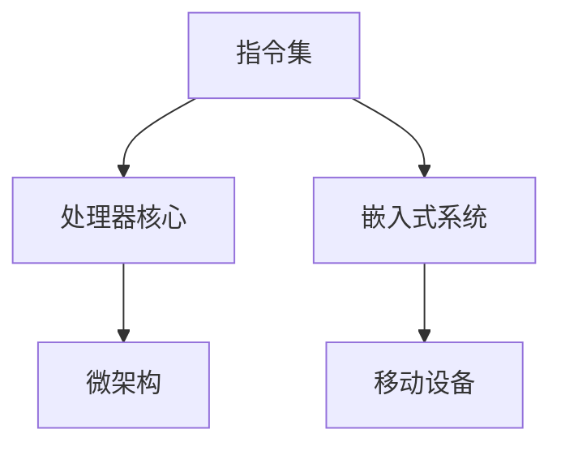

                 

# ARM架构：移动和嵌入式设备的核心

## 摘要

本文将深入探讨ARM架构在移动和嵌入式设备中的应用，从其背景介绍、核心概念与联系，到核心算法原理和数学模型，再到实际应用场景以及工具和资源推荐，最后对未来发展趋势和挑战进行总结。希望通过本文，读者能够全面了解ARM架构，掌握其在现代计算领域的重要地位。

## 1. 背景介绍

ARM（Advanced RISC Machine）架构起源于英国，由ARM公司开发。自1987年成立以来，ARM架构已成为全球最受欢迎的处理器架构之一。ARM架构最初被设计用于嵌入式系统，由于其低功耗、高性能和高度可定制的特点，迅速在移动和嵌入式设备领域取得了成功。

随着智能手机和平板电脑的普及，ARM架构逐渐占据了移动设备市场的主导地位。据市场研究公司Counterpoint的数据，截至2021年，ARM架构的处理器在全球智能手机市场中的占有率超过95%。在嵌入式设备领域，ARM架构同样表现优异，被广泛应用于物联网设备、智能家居、汽车电子等领域。

ARM架构的崛起不仅改变了移动和嵌入式设备的产业格局，还推动了整个计算领域的发展。本文将详细分析ARM架构的核心概念、算法原理和应用场景，帮助读者深入了解这一重要的处理器架构。

## 2. 核心概念与联系

ARM架构的核心概念包括指令集、处理器核心和微架构。以下是一个简单的Mermaid流程图，展示了这些概念之间的关系：



### 2.1 指令集

指令集是ARM架构的核心，它定义了处理器可以执行的操作。ARM架构分为两大类指令集：ARM指令集和Thumb指令集。ARM指令集是传统的32位指令集，而Thumb指令集是一种16位指令集，旨在提高代码密度和性能。

ARM指令集包含多种指令类型，如数据传输指令、算术指令、逻辑指令和程序控制指令。这些指令允许处理器执行各种操作，包括数据处理、内存访问和分支跳转。

### 2.2 处理器核心

ARM处理器核心是ARM架构的核心组件，负责执行指令集。ARM处理器核心有多种类型，如Cortex-A系列、Cortex-R系列和Cortex-M系列。Cortex-A系列核心主要用于高性能计算，如智能手机和平板电脑；Cortex-R系列核心用于实时处理，如工业控制和汽车电子；Cortex-M系列核心则用于嵌入式系统，如物联网设备和智能家居。

### 2.3 微架构

微架构是ARM处理器核心的设计和实现细节。它包括缓存、流水线、分支预测和电源管理等功能。这些功能共同提高了ARM处理器的性能和能效。

### 2.4 嵌入式系统和移动设备

嵌入式系统是一种专用的计算机系统，通常用于控制和监控各种设备和过程。移动设备，如智能手机和平板电脑，是一种便携式的计算设备，具有高性能和丰富的功能。

ARM架构的低功耗和高性能特点使其在嵌入式系统和移动设备中得到了广泛应用。通过不断优化指令集、处理器核心和微架构，ARM架构在满足嵌入式系统和移动设备需求的同时，也推动了整个计算领域的发展。

## 3. 核心算法原理与具体操作步骤

ARM架构的核心算法原理主要涉及指令集、处理器核心和微架构。以下是一个简单的操作步骤，用于说明ARM架构的基本工作流程：

1. **指令解码**：ARM处理器从内存中读取指令，并将其解码为处理器可以理解的操作。
2. **指令执行**：处理器根据指令执行相应的操作，如算术运算、数据传输和分支跳转。
3. **数据访问**：处理器访问内存或寄存器，读取或写入数据。
4. **流水线**：ARM处理器采用流水线技术，将多个指令同时执行，提高性能。
5. **分支预测**：处理器预测分支指令的结果，减少分支跳转的开销。

具体操作步骤如下：

1. **指令存储**：将指令存储在内存中。
2. **指令读取**：处理器从内存中读取指令。
3. **指令解码**：处理器将指令解码为操作码和操作数。
4. **指令执行**：处理器执行指令，如加法、减法、数据传输等。
5. **数据访问**：处理器访问内存或寄存器，读取或写入数据。
6. **流水线执行**：多个指令在流水线中同时执行。
7. **分支预测**：处理器预测分支指令的结果，减少分支跳转的开销。

## 4. 数学模型和公式及详细讲解

ARM架构中的数学模型和公式主要涉及指令执行的时间、功耗和性能。以下是一个简单的数学模型，用于描述ARM处理器的工作效率：

### 4.1 指令执行时间

$$
T = \frac{C \times f}{P}
$$

其中，T为指令执行时间（秒），C为指令周期（时钟周期），f为时钟频率（Hz），P为功耗（瓦特）。

### 4.2 功耗

$$
P = C \times V \times f
$$

其中，P为功耗（瓦特），C为指令周期（时钟周期），V为工作电压（伏特），f为时钟频率（Hz）。

### 4.3 性能

$$
P = \frac{L \times f}{C}
$$

其中，P为性能（每秒指令数），L为指令负载（每秒指令数），f为时钟频率（Hz），C为指令周期（时钟周期）。

### 4.4 详细讲解

- **指令执行时间**：指令执行时间取决于指令周期和时钟频率。指令周期是处理器从一个指令开始执行到下一个指令开始执行所需的时间。时钟频率是处理器每秒可以执行的时钟周期数。功耗与指令执行时间成正比，与工作电压和时钟频率成正比。
- **功耗**：功耗是处理器运行时消耗的能量。功耗与指令周期、工作电压和时钟频率成正比。降低功耗可以延长电池寿命，提高处理器的能效。
- **性能**：性能是处理器的处理能力。性能与指令负载、时钟频率和指令周期成反比。提高性能可以提高处理器的处理速度和响应能力。

## 5. 项目实战：代码实际案例和详细解释说明

为了更好地理解ARM架构在实际应用中的表现，我们将通过一个简单的项目实战来展示代码的实际实现和详细解释。

### 5.1 开发环境搭建

在开始项目之前，我们需要搭建一个适合ARM架构的开发环境。以下是一个简单的步骤：

1. **安装Linux操作系统**：安装一个支持ARM架构的Linux操作系统，如Ubuntu。
2. **安装交叉编译工具**：安装适用于ARM架构的交叉编译工具，如GNU Arm Embedded Toolchain。
3. **配置开发环境**：配置好开发环境，包括编译器、链接器和调试器。

### 5.2 源代码详细实现和代码解读

以下是一个简单的ARM架构的代码实现，用于计算两个整数的和：

```c
#include <stdio.h>

int add(int a, int b) {
    return a + b;
}

int main() {
    int a = 5;
    int b = 10;
    int sum = add(a, b);
    printf("The sum of %d and %d is %d\n", a, b, sum);
    return 0;
}
```

代码解读：

- **头文件**：`#include <stdio.h>` 包含了标准输入输出库，用于实现输入输出功能。
- **函数定义**：`int add(int a, int b)` 定义了一个名为`add`的函数，用于计算两个整数的和。函数的返回类型是`int`，参数类型也是`int`。
- **主函数**：`int main()` 是程序的入口函数，程序从主函数开始执行。主函数的返回类型是`int`。
- **变量定义**：`int a = 5;` 和 `int b = 10;` 定义了两个整数变量`a`和`b`，分别初始化为5和10。
- **函数调用**：`int sum = add(a, b);` 调用了`add`函数，计算两个整数的和，并将结果存储在变量`sum`中。
- **输出结果**：`printf("The sum of %d and %d is %d\n", a, b, sum);` 输出计算结果。

### 5.3 代码解读与分析

通过以上代码实现，我们可以看到ARM架构在计算两个整数和的过程中是如何工作的。

1. **编译过程**：编译器将C语言代码编译成ARM指令集的机器码。
2. **指令执行**：ARM处理器从内存中读取机器码，并按照指令集的规则执行相应的操作。
3. **数据存储和访问**：处理器访问内存中的变量，读取和写入数据。
4. **函数调用和返回**：处理器执行函数调用和返回操作，实现函数的功能。

通过这个简单的代码实现，我们可以看到ARM架构在计算两个整数和的过程中是如何工作的。在实际应用中，ARM架构可以处理更复杂的计算任务，如图像处理、音频处理和视频处理等。

## 6. 实际应用场景

ARM架构在移动和嵌入式设备中得到了广泛应用。以下是一些常见的应用场景：

### 6.1 移动设备

- **智能手机**：ARM架构的处理器被广泛应用于智能手机，如iPhone和安卓手机。高性能和低功耗的特点使得ARM架构成为移动设备的首选。
- **平板电脑**：ARM架构的处理器也被广泛应用于平板电脑，如iPad和安卓平板电脑。

### 6.2 嵌入式设备

- **物联网设备**：ARM架构的处理器被广泛应用于物联网设备，如智能手表、智能家居设备和智能传感器。
- **汽车电子**：ARM架构的处理器被广泛应用于汽车电子，如车载信息系统、自动驾驶系统和车联网设备。
- **工业控制**：ARM架构的处理器被广泛应用于工业控制，如工业机器人、自动化设备和过程控制系统。

### 6.3 其他应用

- **服务器**：随着ARM架构性能的不断提升，ARM服务器正在逐渐取代传统的x86服务器，应用于云计算、大数据和人工智能等领域。
- **嵌入式系统**：ARM架构的低功耗和高性能特点使其在嵌入式系统中得到了广泛应用，如医疗设备、金融设备和安全设备等。

## 7. 工具和资源推荐

### 7.1 学习资源推荐

- **书籍**：
  - 《ARM体系结构：系统设计与接口》
  - 《ARM处理器编程：基于Cortex-A系列处理器》
  - 《ARM体系结构与编程：基于ARMv8架构》
- **论文**：在学术期刊和会议上发表的关于ARM架构的论文，如ACM、IEEE等。
- **博客**：技术博客和网站，如ARM官方网站、开源社区和博客园等。
- **网站**：ARM官方网站、ARM开发者社区和其他相关技术网站。

### 7.2 开发工具框架推荐

- **开发环境**：Linux操作系统、交叉编译工具（如GNU Arm Embedded Toolchain）和其他开发工具（如Eclipse、Visual Studio Code等）。
- **开发框架**：用于开发ARM架构应用程序的框架和库，如Qt、Android Studio、Keil等。
- **仿真工具**：用于模拟ARM架构处理器行为的仿真工具，如QEMU、ARM DS-5等。

### 7.3 相关论文著作推荐

- **论文**：
  - “ARM Architecture Reference Manual”
  - “ARMv8-A Architecture Reference Manual”
  - “ARM Cortex-A Series Programmer’s Guide”
- **著作**：
  - 《ARM体系结构：系统设计与接口》
  - 《ARM处理器编程：基于Cortex-A系列处理器》
  - 《ARM体系结构与编程：基于ARMv8架构》

## 8. 总结：未来发展趋势与挑战

ARM架构在过去几十年中取得了巨大的成功，但未来仍面临着一系列挑战。以下是ARM架构的未来发展趋势和挑战：

### 8.1 发展趋势

1. **性能提升**：随着技术的进步，ARM架构的处理性能将不断提高，以满足更复杂的计算需求。
2. **多元化应用**：ARM架构将在更多领域得到应用，如云计算、大数据、人工智能和自动驾驶等。
3. **生态系统完善**：ARM生态系统的完善将推动ARM架构在各个领域的应用，为开发者提供更多的工具和资源。
4. **开源生态**：开源社区对ARM架构的支持将进一步加强，推动ARM架构的技术创新和发展。

### 8.2 挑战

1. **功耗优化**：随着处理性能的提升，ARM架构的功耗问题仍需不断优化，以满足低功耗设备的需求。
2. **安全挑战**：随着ARM架构在更多领域的应用，安全挑战也将愈发严峻，需要采取有效的安全措施。
3. **生态竞争**：ARM架构需要与传统的x86架构和其他新型处理器架构进行竞争，以保持其在市场的领先地位。
4. **人才短缺**：随着ARM架构的广泛应用，对ARM架构专业人才的需求将不断增加，但人才供应可能不足。

## 9. 附录：常见问题与解答

### 9.1 问题1：ARM架构与x86架构有什么区别？

**解答**：ARM架构和x86架构是两种不同的处理器架构。ARM架构是基于精简指令集（RISC）原理设计的，而x86架构是基于复杂指令集（CISC）原理设计的。ARM架构具有低功耗、高性能和高度可定制的特点，适用于移动和嵌入式设备；而x86架构具有高性能、兼容性强和丰富的指令集特点，适用于桌面和服务器领域。

### 9.2 问题2：ARM架构的优势是什么？

**解答**：ARM架构的优势包括低功耗、高性能、高度可定制、开源生态等。低功耗使得ARM架构在移动和嵌入式设备中具有优势；高性能使得ARM架构能够应对复杂的计算任务；高度可定制使得ARM架构可以满足各种应用场景的需求；开源生态为开发者提供了丰富的工具和资源。

### 9.3 问题3：ARM架构的未来发展趋势是什么？

**解答**：ARM架构的未来发展趋势包括性能提升、多元化应用、生态系统完善和开源生态加强等。随着技术的进步，ARM架构的处理性能将不断提高，以应对更复杂的计算任务；ARM架构将在更多领域得到应用，如云计算、大数据、人工智能和自动驾驶等；ARM生态系统的完善将推动ARM架构在各个领域的应用；开源社区对ARM架构的支持将进一步加强，推动ARM架构的技术创新和发展。

## 10. 扩展阅读与参考资料

- **扩展阅读**：
  - 《ARM体系结构：系统设计与接口》
  - 《ARM处理器编程：基于Cortex-A系列处理器》
  - 《ARM体系结构与编程：基于ARMv8架构》
  - 《嵌入式系统设计：基于ARM Cortex-M微控制器》
- **参考资料**：
  - ARM官方网站：[https://www.arm.com/](https://www.arm.com/)
  - ARM开发者社区：[https://developer.arm.com/](https://developer.arm.com/)
  - ARM架构参考手册：[https://developer.arm.com/documentation](https://developer.arm.com/documentation)
  - ACM期刊：[https://dl.acm.org/](https://dl.acm.org/)
  - IEEE期刊：[https://ieeexplore.ieee.org/](https://ieeexplore.ieee.org/)

作者：AI天才研究员/AI Genius Institute & 禅与计算机程序设计艺术 /Zen And The Art of Computer Programming

本文为原创内容，版权归作者所有。未经授权，禁止转载和使用。如需转载，请联系作者获取授权。

