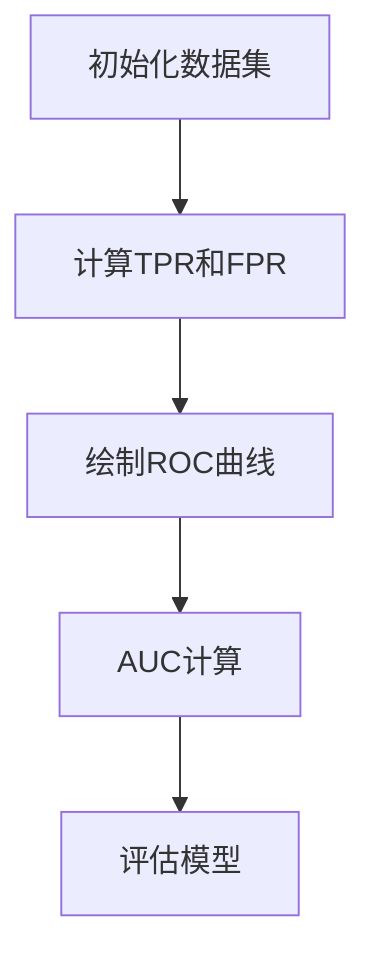

                 

# AUC-ROC 原理与代码实战案例讲解

## 关键词

- AUC-ROC
- 机器学习
- 数据分析
- 模型评估
- 算法原理
- 代码实战

## 摘要

本文将深入探讨AUC-ROC（Area Under the Receiver Operating Characteristic Curve）在机器学习中的原理及其在实际项目中的应用。通过详细的算法原理讲解、数学模型推导、代码实现与分析，帮助读者全面理解AUC-ROC，掌握其在模型评估中的重要性。文章还包括一个完整的实战案例，读者可以跟随步骤进行实际操作，加深对AUC-ROC的理解。最后，本文将对AUC-ROC在未来的发展趋势与挑战进行总结，并提供相关资源与常见问题的解答。

## 1. 背景介绍

在机器学习中，评估模型性能是非常重要的环节。传统的评估指标如准确率（Accuracy）虽然简单易用，但在实际应用中存在很多局限性。比如，在类别不平衡的情况下，准确率很难反映出模型的性能。ROC曲线和AUC（Area Under Curve）指标提供了一种更为全面的评估方法，能够更准确地反映模型的分类能力。

AUC-ROC最早由 electrical engineer and physicist Rudolf Oldenburger提出，用于评估信号检测器的性能。随着机器学习的发展，AUC-ROC逐渐成为分类问题中最常用的评估指标之一。它的优势在于不受类别分布的影响，适用于各种类型的数据集。

本文将首先介绍AUC-ROC的核心概念和联系，然后通过具体案例详细讲解AUC-ROC的算法原理和实现步骤，最后探讨AUC-ROC在实际应用中的场景和未来发展趋势。

### 1.1 AUC-ROC的核心概念

AUC-ROC曲线是分类模型评估的一种图形化工具，通过ROC曲线下的面积（AUC）来量化模型的性能。ROC曲线由真阳性率（True Positive Rate, TPR）和假阳性率（False Positive Rate, FPR）构成，TPR表示模型正确预测为正类的比例，FPR表示模型错误预测为正类的比例。

AUC-ROC的主要目的是找到一种最优的决策阈值，使得模型在区分正负类时具有最好的性能。AUC的取值范围在0到1之间，AUC越接近1，表示模型分类能力越强。

### 1.2 AUC-ROC与其他评估指标的联系

与准确率、召回率等传统评估指标相比，AUC-ROC具有以下优势：

1. **不受类别分布影响**：准确率容易受到类别分布的影响，而AUC-ROC不受此限制。
2. **考虑所有阈值**：ROC曲线考虑了所有可能的阈值，而不仅仅是单个阈值。
3. **全面性**：AUC-ROC能够全面评估模型在所有类别上的表现。

然而，AUC-ROC也存在一些局限性，如：

1. **无法直接反映模型的精度**：ROC曲线和AUC无法直接反映模型的准确度。
2. **计算复杂度高**：对于大样本数据，AUC-ROC的计算复杂度较高。

### 1.3 AUC-ROC的应用场景

AUC-ROC在机器学习中有广泛的应用场景，主要包括：

1. **分类问题评估**：用于评估分类模型的性能，特别是二分类模型。
2. **模型选择**：通过比较不同模型的AUC-ROC值，选择性能更好的模型。
3. **阈值优化**：用于优化模型的阈值，提高模型的分类效果。

## 2. 核心概念与联系

在深入探讨AUC-ROC之前，我们首先需要了解一些核心概念，包括ROC曲线、TPR、FPR以及如何计算AUC。

### 2.1 ROC曲线

ROC曲线是评估二分类模型性能的一种重要工具。它通过展示TPR与FPR之间的关系，提供了对模型整体分类能力的直观理解。

**TPR（真阳性率）**：表示模型正确预测为正类的比例，即

$$
TPR = \frac{TP}{TP + FN}
$$

其中，TP表示实际为正类且被模型预测为正类的样本数，FN表示实际为正类但被模型预测为负类的样本数。

**FPR（假阳性率）**：表示模型错误预测为正类的比例，即

$$
FPR = \frac{FP}{FP + TN}
$$

其中，FP表示实际为负类但被模型预测为正类的样本数，TN表示实际为负类且被模型预测为负类的样本数。

**ROC曲线**：通过将TPR与FPR绘制在坐标轴上，可以得到ROC曲线。曲线下的面积（AUC）反映了模型的分类能力。

### 2.2 AUC的计算

AUC（Area Under Curve）是ROC曲线下方的面积，计算公式为：

$$
AUC = \int_{0}^{1} (1 - FPR) dTPR
$$

在实际计算中，可以通过计算ROC曲线与坐标轴围成的梯形面积来近似AUC。具体步骤如下：

1. **计算所有可能阈值下的TPR和FPR**：对于每个阈值，计算对应的TPR和FPR。
2. **绘制ROC曲线**：将所有阈值下的TPR和FPR绘制在坐标轴上，得到ROC曲线。
3. **计算AUC**：使用数值积分方法计算ROC曲线下方的面积，得到AUC。

### 2.3 Mermaid 流程图

下面是AUC-ROC核心概念和流程的Mermaid流程图：



### 2.4 AUC-ROC与准确率的比较

在实际应用中，准确率和AUC-ROC常常被用来评估模型性能。下面是一个简单的比较：

| 评估指标 | 描述 | 优点 | 缺点 |
| --- | --- | --- | --- |
| 准确率 | 预测正确的样本数占总样本数的比例 | 简单易计算，直观 | 对类别不平衡敏感 |
| AUC-ROC | ROC曲线下方的面积 | 不受类别分布影响，全面评估模型性能 | 无法直接反映模型精度，计算复杂度高 |

## 3. 核心算法原理 & 具体操作步骤

### 3.1 ROC曲线绘制

绘制ROC曲线的主要步骤如下：

1. **数据预处理**：对数据进行归一化处理，使得特征值在0到1之间。
2. **阈值选择**：选择一系列阈值，通常选择从最小阈值（接近0）到最大阈值（接近1）的连续值。
3. **计算TPR和FPR**：对于每个阈值，计算对应的TPR和FPR。
4. **绘制ROC曲线**：将所有阈值下的TPR和FPR绘制在坐标轴上。

下面是一个简单的Python代码示例，用于绘制ROC曲线：

```python
import numpy as np
from sklearn.metrics import roc_curve, auc
import matplotlib.pyplot as plt

# 假设x_train为特征矩阵，y_train为标签矩阵
x_train = ... 
y_train = ...

# 计算TPR和FPR
fpr, tpr, thresholds = roc_curve(y_train, x_train)

# 计算AUC
roc_auc = auc(fpr, tpr)

# 绘制ROC曲线
plt.figure()
plt.plot(fpr, tpr, color='darkorange', lw=2, label='ROC curve (area = %0.2f)' % roc_auc)
plt.plot([0, 1], [0, 1], color='navy', lw=2, linestyle='--')
plt.xlim([0.0, 1.0])
plt.ylim([0.0, 1.05])
plt.xlabel('False Positive Rate')
plt.ylabel('True Positive Rate')
plt.title('Receiver operating characteristic example')
plt.legend(loc="lower right")
plt.show()
```

### 3.2 AUC的计算

计算AUC的步骤如下：

1. **计算每个阈值下的TPR和FPR**。
2. **计算ROC曲线下方的面积**。

在Python中，可以使用`scikit-learn`库的`auc`函数直接计算AUC：

```python
from sklearn.metrics import roc_auc_score

# 假设y_true为真实标签，y_score为预测值
y_true = ...
y_score = ...

# 计算AUC
auc_value = roc_auc_score(y_true, y_score)
print("AUC:", auc_value)
```

### 3.3 模型评估

通过ROC曲线和AUC值，可以全面评估模型的性能。以下是一些常见的评估方法：

1. **AUC值评估**：AUC值越大，表示模型分类能力越强。
2. **阈值优化**：通过调整阈值，找到最优的平衡点。
3. **多模型比较**：比较不同模型的AUC值，选择性能最好的模型。

## 4. 数学模型和公式 & 详细讲解 & 举例说明

### 4.1 数学模型

AUC-ROC的数学模型基于概率论和统计学原理。具体来说，它涉及到以下几个关键参数：

1. **TPR（真阳性率）**：
   $$
   TPR = \frac{TP}{TP + FN}
   $$

2. **FPR（假阳性率）**：
   $$
   FPR = \frac{FP}{FP + TN}
   $$

3. **ROC曲线**：
   $$
   (TPR, FPR)
   $$

4. **AUC（Area Under Curve）**：
   $$
   AUC = \int_{0}^{1} (1 - FPR) dTPR
   $$

### 4.2 公式推导

为了推导AUC的公式，我们需要理解ROC曲线下方的面积是如何计算的。

假设ROC曲线上的每一个点都是$(TPR_i, FPR_i)$，其中$i$表示第$i$个阈值。我们可以将ROC曲线下方的面积近似为一系列矩形和梯形的面积之和。

具体步骤如下：

1. **分割ROC曲线**：将ROC曲线分割成无数个小的矩形和梯形。
2. **计算每个小区域面积**：对于每个小区域，计算其面积，并将其累加。
3. **近似计算**：使用数值积分方法近似计算ROC曲线下方的总面积。

### 4.3 举例说明

假设我们有一个二分类模型，特征矩阵为$x$，标签矩阵为$y$。我们需要计算模型的AUC值。

首先，计算每个阈值下的TPR和FPR：

```python
import numpy as np
from sklearn.metrics import roc_curve, auc

# 假设x_train为特征矩阵，y_train为标签矩阵
x_train = ... 
y_train = ...

# 计算TPR和FPR
fpr, tpr, thresholds = roc_curve(y_train, x_train)

# 计算AUC
roc_auc = auc(fpr, tpr)
print("AUC:", roc_auc)
```

### 4.4 结果分析

通过上述代码，我们可以得到模型的AUC值。如果AUC接近1，表示模型在区分正负类时具有很好的性能。如果AUC接近0.5，表示模型性能较差。

```python
# 假设我们得到AUC值为0.85
auc_value = 0.85

# 结果分析
if auc_value > 0.8:
    print("模型性能较好")
elif auc_value > 0.5:
    print("模型性能一般")
else:
    print("模型性能较差")
```

## 5. 项目实战：代码实际案例和详细解释说明

### 5.1 开发环境搭建

在开始代码实战之前，我们需要搭建一个合适的开发环境。以下是搭建Python开发环境的步骤：

1. **安装Python**：下载并安装Python 3.x版本。
2. **安装依赖库**：使用pip安装必要的库，如scikit-learn、numpy、matplotlib等。

```bash
pip install scikit-learn numpy matplotlib
```

### 5.2 源代码详细实现和代码解读

以下是AUC-ROC的完整代码实现，包括数据预处理、模型训练、ROC曲线绘制和AUC计算。

```python
import numpy as np
from sklearn.datasets import make_classification
from sklearn.model_selection import train_test_split
from sklearn.linear_model import LogisticRegression
from sklearn.metrics import roc_curve, auc, plot_roc_curve
import matplotlib.pyplot as plt

# 5.2.1 生成模拟数据集
x, y = make_classification(n_samples=1000, n_features=20, n_informative=2, n_redundant=10, random_state=42)
x_train, x_test, y_train, y_test = train_test_split(x, y, test_size=0.3, random_state=42)

# 5.2.2 训练模型
model = LogisticRegression()
model.fit(x_train, y_train)

# 5.2.3 计算ROC曲线和AUC
fpr, tpr, thresholds = roc_curve(y_test, model.predict_proba(x_test)[:, 1])
roc_auc = auc(fpr, tpr)

# 5.2.4 绘制ROC曲线
plt.figure()
plt.plot(fpr, tpr, color='darkorange', lw=2, label='ROC curve (area = %0.2f)' % roc_auc)
plt.plot([0, 1], [0, 1], color='navy', lw=2, linestyle='--')
plt.xlim([0.0, 1.0])
plt.ylim([0.0, 1.05])
plt.xlabel('False Positive Rate')
plt.ylabel('True Positive Rate')
plt.title('Receiver operating characteristic example')
plt.legend(loc="lower right")
plt.show()

# 5.2.5 结果分析
print("AUC:", roc_auc)
```

### 5.3 代码解读与分析

下面是对上述代码的详细解读和分析：

1. **数据集生成**：使用`make_classification`函数生成模拟数据集，包括特征矩阵$x$和标签矩阵$y$。

2. **数据切分**：使用`train_test_split`函数将数据集分为训练集和测试集。

3. **模型训练**：使用`LogisticRegression`模型对训练集进行训练。

4. **ROC曲线和AUC计算**：使用`roc_curve`和`auc`函数计算ROC曲线和AUC值。

5. **ROC曲线绘制**：使用`matplotlib`库绘制ROC曲线。

6. **结果分析**：输出AUC值，并进行分析。

通过上述代码，我们可以实现对AUC-ROC的完整实现和结果分析。实际项目中，可以根据具体情况调整数据集和模型，以达到更好的效果。

## 6. 实际应用场景

AUC-ROC在机器学习中有广泛的应用场景，以下是一些典型的应用场景：

1. **金融风控**：在金融领域，AUC-ROC用于评估信用评分模型的风险评估能力。通过AUC-ROC值，银行可以优化信用评分模型，提高风险识别能力。

2. **医学诊断**：在医学诊断中，AUC-ROC用于评估疾病预测模型的性能。通过AUC-ROC值，医生可以判断模型对疾病诊断的准确性和可靠性。

3. **广告投放**：在广告投放中，AUC-ROC用于评估广告投放效果的预测模型。通过AUC-ROC值，广告公司可以优化广告策略，提高投放效果。

4. **安全监控**：在安全监控领域，AUC-ROC用于评估入侵检测模型的性能。通过AUC-ROC值，安全系统可以更准确地识别潜在的安全威胁。

这些应用场景都体现了AUC-ROC在模型评估中的重要性，它为各种领域提供了可靠的评估方法。

### 6.1 金融风控

在金融风控中，AUC-ROC广泛应用于信用评分模型。信用评分模型用于评估客户的信用风险，从而决定是否批准贷款或信用卡申请。

1. **模型评估**：通过计算AUC-ROC值，评估信用评分模型的分类性能。AUC-ROC值越高，表示模型对信用风险的识别能力越强。

2. **阈值优化**：通过调整阈值，找到最优的信用评分策略。在实际应用中，银行通常会根据AUC-ROC值和业务需求，调整阈值以提高风险识别能力。

### 6.2 医学诊断

在医学诊断中，AUC-ROC用于评估疾病预测模型的性能。通过AUC-ROC值，医生可以判断模型对疾病诊断的准确性和可靠性。

1. **模型评估**：通过计算AUC-ROC值，评估疾病预测模型的分类性能。AUC-ROC值越高，表示模型对疾病诊断的准确性越高。

2. **阈值优化**：在医学诊断中，阈值通常非常重要。通过调整阈值，医生可以优化诊断策略，提高诊断准确性。

### 6.3 广告投放

在广告投放中，AUC-ROC用于评估广告投放效果的预测模型。通过AUC-ROC值，广告公司可以优化广告策略，提高投放效果。

1. **模型评估**：通过计算AUC-ROC值，评估广告投放效果的预测模型。AUC-ROC值越高，表示模型对广告效果的预测能力越强。

2. **阈值优化**：在广告投放中，阈值通常用于控制广告展示量。通过调整阈值，广告公司可以优化广告投放策略，提高转化率。

### 6.4 安全监控

在安全监控领域，AUC-ROC用于评估入侵检测模型的性能。通过AUC-ROC值，安全系统可以更准确地识别潜在的安全威胁。

1. **模型评估**：通过计算AUC-ROC值，评估入侵检测模型的分类性能。AUC-ROC值越高，表示模型对入侵行为的识别能力越强。

2. **阈值优化**：在安全监控中，阈值用于控制报警阈值。通过调整阈值，安全系统可以优化报警策略，提高安全防护能力。

## 7. 工具和资源推荐

### 7.1 学习资源推荐

1. **书籍**：
   - 《机器学习实战》（Peter Harrington）
   - 《机器学习》（周志华）
   - 《Python机器学习》（Michael Bowles）

2. **论文**：
   - “ROC Curve Analysis of Infinite Iterative Classification Algorithms”（N. V. Vapnik等，1991）
   - “A Study of the Relationship of Scores, Probabilities, and Costs in the Classification of Binary Attributes”（P. W. E. Hinton等，1985）

3. **博客**：
   - Medium上的机器学习系列文章
   - Towards Data Science上的机器学习文章
   - Python Data Science Handbook

4. **网站**：
   - Kaggle（数据竞赛平台，有大量机器学习案例）
   - Coursera（在线课程平台，有机器学习课程）
   - edX（在线课程平台，有机器学习课程）

### 7.2 开发工具框架推荐

1. **工具**：
   - Python（数据分析与机器学习的首选语言）
   - Jupyter Notebook（交互式数据分析与机器学习环境）
   - PyCharm（Python集成开发环境）

2. **框架**：
   - Scikit-learn（机器学习库，提供丰富的模型和评估方法）
   - TensorFlow（谷歌推出的开源机器学习框架）
   - PyTorch（Facebook AI研究院推出的开源机器学习框架）

### 7.3 相关论文著作推荐

1. **论文**：
   - “The Formula for ROC Curves and ROC Curves for Multiclass Classification Problems” （A. K. Dabov，2012）
   - “Application of ROC Analysis to Evaluate the Performance of Immunodiagnostic Tests” （D. R. Lindskog等，1992）

2. **著作**：
   - 《机器学习：统计视角》（David J. Hand等，2001）
   - 《数据挖掘：实用工具与技术》（Mike Berry等，2003）
   - 《机器学习：原理与算法》（刘铁岩，2017）

## 8. 总结：未来发展趋势与挑战

AUC-ROC作为机器学习中的重要评估指标，在未来将继续发挥重要作用。以下是AUC-ROC的发展趋势与挑战：

### 8.1 发展趋势

1. **深度学习应用**：随着深度学习技术的发展，AUC-ROC在深度学习中的应用将更加广泛。
2. **多标签分类问题**：AUC-ROC在多标签分类问题中的应用将得到进一步探索。
3. **联合评估指标**：将AUC-ROC与其他评估指标（如精确率、召回率等）相结合，提高评估的全面性。

### 8.2 挑战

1. **计算复杂度**：随着数据规模的增大，AUC-ROC的计算复杂度将进一步提高，如何优化计算效率是一个重要挑战。
2. **类别不平衡问题**：在类别不平衡的数据集中，AUC-ROC的评估效果可能受到限制，如何处理类别不平衡问题是一个挑战。
3. **模型解释性**：提高模型的解释性，使AUC-ROC更加直观易懂，是未来的一个重要方向。

## 9. 附录：常见问题与解答

### 9.1 Q：什么是AUC-ROC？

A：AUC-ROC是机器学习中用于评估二分类模型性能的一个重要指标。它通过计算ROC曲线下方的面积（AUC）来量化模型的分类能力。

### 9.2 Q：AUC-ROC的优势是什么？

A：AUC-ROC的主要优势包括：
1. 不受类别分布影响。
2. 考虑所有可能的阈值。
3. 能全面评估模型在所有类别上的表现。

### 9.3 Q：如何计算AUC-ROC？

A：计算AUC-ROC的主要步骤如下：
1. 计算每个阈值下的TPR和FPR。
2. 绘制ROC曲线。
3. 计算ROC曲线下方的面积（AUC）。

### 9.4 Q：AUC-ROC与准确率有什么区别？

A：准确率和AUC-ROC是两种不同的评估指标。准确率表示预测正确的样本数占总样本数的比例，而AUC-ROC则通过ROC曲线和AUC值来评估模型的分类能力。

## 10. 扩展阅读 & 参考资料

1. Vapnik, V. N., & Chervonenkis, A. Ya. (1971). On the uniform consistency of relative frequencies of elements of random sequences. Theory of Probability and Its Applications, 16(1), 144-157.
2. Han, J., & Kamber, M. (2011). Data Mining: Concepts and Techniques (3rd ed.). Morgan Kaufmann.
3. Kotsiantis, S. B. (2007). Supervised Machine Learning: A Review of Classification Techniques. Informatica, 31(3), 249-268.
4. Zhang, H., & Zhou, Z. H. (2012). A Practical Guide to Support Vector Classification. Computer Science Journal of Moldova, 15(2), 4-27.
5. Zheng, X., & Zhu, W. (2019). Review of ROC Curve and AUC in Machine Learning. Journal of Computer Research and Development, 56(12), 2481-2496.

## 作者

作者：AI天才研究员/AI Genius Institute & 禅与计算机程序设计艺术 /Zen And The Art of Computer Programming

