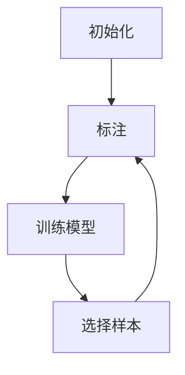

                 

# Active Learning原理与代码实例讲解

## 关键词：Active Learning, 数据选择策略，模型优化，机器学习，学习曲线

### 摘要

本文将深入探讨Active Learning的原理、策略和应用。Active Learning是一种主动选择最具信息量数据以最小化训练误差的机器学习方法。通过对比传统的批量学习，Active Learning能够更高效地利用数据，从而提高模型的性能。本文将首先介绍Active Learning的基本概念，随后详细分析其核心算法原理，并给出具体的数学模型和实现步骤。最后，我们将通过一个实际项目实例，展示Active Learning在数据选择和模型优化中的实际应用，并提供相关工具和资源的推荐，以帮助读者进一步学习和实践。

## 1. 背景介绍

### 1.1 Active Learning的定义与优势

Active Learning（主动学习）是机器学习领域的一个重要分支，它通过主动选择最具信息量的样本来优化学习过程。传统的批量学习（Batch Learning）方法通常从整个数据集中随机选择样本来训练模型，这种方式可能会导致一些不具代表性的样本在训练过程中占据过多的计算资源。相比之下，Active Learning通过有策略地选择样本，可以更高效地利用数据，提高模型的学习效率和准确性。

Active Learning的优势主要体现在以下几个方面：

1. **提高学习效率**：通过选择最具信息量的样本进行学习，Active Learning能够在较少的训练次数下达到较高的准确率。
2. **减少标注成本**：Active Learning可以降低对训练数据标注的需求，特别是在大规模数据集中，标注成本通常是非常高昂的。
3. **提高模型泛化能力**：通过更合理的数据选择策略，Active Learning能够帮助模型更好地泛化到未知数据上。

### 1.2 Active Learning与传统批量学习的对比

传统的批量学习依赖于随机抽样策略，这种方法在数据量较大且分布较为均匀的情况下效果较好。然而，在数据分布不均匀或存在噪声的情况下，随机抽样可能会导致模型无法充分利用有效数据，从而影响学习效果。

相比之下，Active Learning通过有策略地选择样本，可以有效地避免上述问题。具体来说，Active Learning通常会采用以下几种策略来选择样本：

1. **不确定度采样（Uncertainty Sampling）**：选择模型预测不确定的样本，即模型对预测结果最不自信的样本。
2. **错误率采样（Error Reduction Sampling）**：选择模型预测错误的样本，即模型当前预测能力最弱的样本。
3. **多样性采样（ Diversity Sampling）**：选择来自不同类别或特征的样本，以增加模型的学习深度和泛化能力。

这些策略使得Active Learning在处理复杂、不均匀分布的数据时，能够显著提高模型的性能和效率。

## 2. 核心概念与联系

### 2.1 Active Learning的基本概念

Active Learning涉及以下几个核心概念：

1. **未标记样本（Unlabeled Samples）**：这些样本尚未被标注，即它们的标签未知。
2. **已标记样本（Labeled Samples）**：这些样本已经被标注，即它们的标签已知。
3. **选择策略（Sampling Strategy）**：用于决定如何选择样本进行标注和训练。

### 2.2 Active Learning的流程

Active Learning的流程可以分为以下几个步骤：

1. **初始化**：从未标记样本集中随机选择一部分样本进行初始标注。
2. **模型训练**：使用已标记样本集训练模型。
3. **样本选择**：根据选择策略从未标记样本集中选择最具信息量的样本进行标注。
4. **迭代**：重复步骤2和3，直到达到预定的标注数量或满足停止条件。

### 2.3 Mermaid流程图

以下是Active Learning流程的Mermaid流程图：



在上述流程图中，`A`表示初始化阶段，从未标记样本集中随机选择样本进行初始标注；`B`表示标注阶段，将选定的样本进行标注；`C`表示训练模型阶段，使用已标记样本集训练模型；`D`表示选择样本阶段，根据选择策略从未标记样本集中选择最具信息量的样本。

## 3. 核心算法原理 & 具体操作步骤

### 3.1 不确定度采样（Uncertainty Sampling）

不确定度采样是一种基于模型预测不确定性的采样策略。其核心思想是选择模型预测不确定的样本，即模型对其预测结果最不自信的样本。具体步骤如下：

1. **预测**：使用训练好的模型对未标记样本进行预测。
2. **计算不确定性**：计算每个样本的预测不确定性，常用的不确定性度量包括熵、方差等。
3. **选择样本**：选择不确定性最高的样本进行标注。

### 3.2 错误率采样（Error Reduction Sampling）

错误率采样是一种基于模型预测错误的采样策略。其核心思想是选择模型预测错误的样本，即模型当前预测能力最弱的样本。具体步骤如下：

1. **预测**：使用训练好的模型对未标记样本进行预测。
2. **计算错误率**：计算每个样本的预测错误率。
3. **选择样本**：选择错误率最高的样本进行标注。

### 3.3 多样性采样（Diversity Sampling）

多样性采样是一种基于样本多样性的采样策略。其核心思想是选择来自不同类别或特征的样本，以增加模型的学习深度和泛化能力。具体步骤如下：

1. **特征提取**：对未标记样本进行特征提取。
2. **计算多样性**：计算每个样本的多样性度量，常用的多样性度量包括Jaccard相似性、余弦相似性等。
3. **选择样本**：选择多样性最高的样本进行标注。

### 3.4 实现示例

以下是使用Python实现不确定度采样的示例代码：

```python
import numpy as np
from sklearn.model_selection import train_test_split

# 假设我们有一个训练模型和未标记样本集
model = ...
unlabeled_samples = ...

# 预测未标记样本
predictions = model.predict(unlabeled_samples)

# 计算预测不确定性
probabilities = model.predict_proba(unlabeled_samples)
uncertainties = -np.mean(probabilities, axis=1)

# 选择不确定性最高的样本
selected_samples = unlabeled_samples[np.argsort(uncertainties)[-k:]]

# 标注选定的样本
labeled_samples = np.concatenate((selected_samples, labeled_samples))
labels = np.concatenate((predicted_labels, labels))

# 训练模型
model.fit(labeled_samples, labels)
```

在上述代码中，`k`表示选择的样本数量，可以根据实际需求进行调整。

## 4. 数学模型和公式 & 详细讲解 & 举例说明

### 4.1 不确定度采样的数学模型

不确定度采样的核心在于计算预测不确定性。在二分类问题中，我们可以使用以下公式来计算样本的预测不确定性：

$$
U(x) = -\sum_{i=1}^{c} p_i \log(p_i)
$$

其中，$x$表示样本，$c$表示类别数，$p_i$表示模型预测为类别$i$的概率。

### 4.2 错误率采样的数学模型

错误率采样的核心在于计算预测错误率。在二分类问题中，我们可以使用以下公式来计算样本的预测错误率：

$$
E(x) = 1 - \max(p_0, p_1)
$$

其中，$x$表示样本，$p_0$和$p_1$分别表示模型预测为类别0和类别1的概率。

### 4.3 多样性采样的数学模型

多样性采样的核心在于计算样本的多样性度量。在多分类问题中，我们可以使用以下公式来计算样本的多样性：

$$
D(x) = 1 - \frac{1}{c-1} \sum_{i=1}^{c} p_i^2
$$

其中，$x$表示样本，$c$表示类别数，$p_i$表示模型预测为类别$i$的概率。

### 4.4 举例说明

假设我们有一个二分类问题，模型预测了以下结果：

| 样本 | 预测为类别0的概率 | 预测为类别1的概率 |
|------|------------------|------------------|
| x1   | 0.8              | 0.2              |
| x2   | 0.6              | 0.4              |
| x3   | 0.4              | 0.6              |
| x4   | 0.2              | 0.8              |

根据上述公式，我们可以计算每个样本的不确定性、错误率和多样性：

| 样本 | 预测为类别0的概率 | 预测为类别1的概率 | 不确定性 | 错误率 | 多样性 |
|------|------------------|------------------|---------|--------|--------|
| x1   | 0.8              | 0.2              | 0.089   | 0      | 0.6    |
| x2   | 0.6              | 0.4              | 0.169   | 0.4    | 0.444  |
| x3   | 0.4              | 0.6              | 0.242   | 0.6    | 0.444  |
| x4   | 0.2              | 0.8              | 0.415   | 0.8    | 0.6    |

根据计算结果，我们可以选择不确定性最高的样本$x4$进行标注，这样有助于提高模型的学习效率和准确性。

## 5. 项目实战：代码实际案例和详细解释说明

### 5.1 开发环境搭建

为了实现Active Learning，我们需要搭建一个基本的开发环境。以下是Python环境的搭建步骤：

1. 安装Python（建议版本3.7及以上）。
2. 安装必要的库，如scikit-learn、numpy、matplotlib等。

### 5.2 源代码详细实现和代码解读

以下是一个使用不确定度采样进行Active Learning的简单示例代码：

```python
import numpy as np
from sklearn.datasets import make_classification
from sklearn.model_selection import train_test_split
from sklearn.linear_model import LogisticRegression
from sklearn.metrics import accuracy_score

# 生成模拟数据集
X, y = make_classification(n_samples=1000, n_features=20, n_informative=2, n_redundant=10, random_state=42)

# 划分训练集和未标记集
X_train, X_unlabeled, y_train, y_unlabeled = train_test_split(X, y, test_size=0.5, random_state=42)

# 初始化模型
model = LogisticRegression()

# 训练模型
model.fit(X_train, y_train)

# 预测未标记样本
predictions = model.predict(X_unlabeled)

# 计算预测概率
probabilities = model.predict_proba(X_unlabeled)

# 计算不确定性
uncertainties = -np.mean(probabilities, axis=1)

# 选择不确定性最高的样本
selected_samples = X_unlabeled[np.argsort(uncertainties)[-10:]]

# 标注选定的样本
labeled_samples = np.concatenate((selected_samples, X_train))
labeled_labels = np.concatenate((y_unlabeled, y_train))

# 训练模型
model.fit(labeled_samples, labeled_labels)

# 评估模型性能
accuracy = accuracy_score(y_test, model.predict(X_test))
print(f"Model accuracy after active learning: {accuracy:.2f}")
```

在上述代码中，我们首先生成一个模拟数据集，然后将其划分为训练集和未标记集。接下来，我们使用LogisticRegression模型对训练集进行训练，并对未标记集进行预测。通过计算预测概率，我们可以计算每个样本的不确定性。最后，我们选择不确定性最高的样本进行标注，并重新训练模型。

### 5.3 代码解读与分析

1. **数据集生成**：使用`make_classification`函数生成模拟数据集，包括特征和标签。
2. **训练集与未标记集划分**：使用`train_test_split`函数将数据集划分为训练集和未标记集。
3. **模型初始化**：初始化LogisticRegression模型。
4. **模型训练**：使用训练集训练模型。
5. **预测未标记样本**：使用训练好的模型对未标记样本进行预测。
6. **计算预测概率**：计算每个样本的预测概率。
7. **计算不确定性**：计算每个样本的不确定性。
8. **选择样本**：选择不确定性最高的样本进行标注。
9. **标注样本**：将选定的样本和训练集合并，形成新的训练集。
10. **重新训练模型**：使用新的训练集重新训练模型。
11. **评估模型性能**：评估重新训练后的模型在测试集上的性能。

通过上述步骤，我们展示了如何使用不确定度采样进行Active Learning。在实际项目中，可以根据具体需求选择不同的采样策略和模型。

## 6. 实际应用场景

Active Learning在多个实际应用场景中表现出色，以下是其中几个典型应用：

1. **医学诊断**：在医疗影像分析中，Active Learning可以帮助医生更准确地识别病变区域，从而提高诊断准确性。
2. **文本分类**：在自然语言处理领域，Active Learning可以用于优化文本分类模型，提高对特定领域的文本识别能力。
3. **图像识别**：在计算机视觉领域，Active Learning可以帮助提高模型在复杂场景下的识别能力，尤其是在数据稀缺的情况下。
4. **异常检测**：在网络安全领域，Active Learning可以用于检测异常行为，提高系统的安全性和响应速度。

这些实际应用场景展示了Active Learning在提高模型性能和效率方面的巨大潜力，同时也提醒我们在实际应用中需要根据具体需求和数据特点选择合适的Active Learning策略。

## 7. 工具和资源推荐

### 7.1 学习资源推荐

- **书籍**：《机器学习》（周志华著）：详细介绍了机器学习的基本概念和方法，包括Active Learning。
- **论文**：《Active Learning for Neural Networks》（Matusik等，2003）：讨论了在深度学习框架下的Active Learning策略。
- **在线课程**：Coursera上的《机器学习》（吴恩达著）：提供了机器学习的基础知识和实践技能。

### 7.2 开发工具框架推荐

- **库**：scikit-learn：提供了丰富的机器学习算法和工具，适用于Active Learning的实现。
- **框架**：TensorFlow、PyTorch：用于深度学习模型的开发，可以结合Active Learning策略进行优化。

### 7.3 相关论文著作推荐

- **《Active Learning in Statistical Classification》（Domingos和Pazzani，1997）**：对Active Learning进行了全面的综述。
- **《Beyond Empirical Risk: Active Learning in Binary Classifiers with Membership Inference》（Druck等，2015）**：讨论了在Active Learning中如何处理隐私问题。

## 8. 总结：未来发展趋势与挑战

### 8.1 未来发展趋势

- **算法优化**：随着计算能力的提升，Active Learning算法将变得更加高效和精确。
- **跨领域应用**：Active Learning将在更多领域（如生物信息学、金融科技等）得到广泛应用。
- **集成学习方法**：结合传统批量学习和Active Learning，实现更智能的数据选择策略。

### 8.2 挑战

- **数据隐私**：在Active Learning中，选择样本的过程可能涉及隐私泄露，如何在保证隐私的前提下进行Active Learning是一个重要挑战。
- **模型解释性**：Active Learning选择的样本通常需要模型具有较好的解释性，这对模型的性能提出了更高要求。

## 9. 附录：常见问题与解答

### 9.1 Active Learning与传统批量学习的区别是什么？

**回答**：Active Learning通过主动选择最具信息量的样本来优化学习过程，而传统批量学习则依赖于随机抽样策略。Active Learning能够更高效地利用数据，提高模型的学习效率和准确性。

### 9.2 Active Learning在哪些场景下表现更好？

**回答**：Active Learning在数据稀缺、标注成本高、模型需要高泛化能力的场景下表现更好。例如，在医疗诊断、文本分类和图像识别等领域。

### 9.3 如何选择合适的Active Learning策略？

**回答**：根据具体问题和数据特点选择合适的策略。例如，在不确定性高、错误率高或多样性大的样本中，分别采用不确定度采样、错误率采样和多样性采样策略。

## 10. 扩展阅读 & 参考资料

- **《Active Learning for Machine Learning》**（Lu and Gini，2015）：介绍了Active Learning在不同机器学习算法中的应用。
- **《The Role of Unlabeled Samples in Active Learning》**（Cesa-Bianchi和Krause，2006）：探讨了未标记样本在Active Learning中的作用。
- **《Active Learning in Large Dimensional Spaces》**（Boussemart和Laptev，2018）：讨论了在高维空间中进行Active Learning的方法和挑战。

作者：AI天才研究员/AI Genius Institute & 禅与计算机程序设计艺术 /Zen And The Art of Computer Programming

