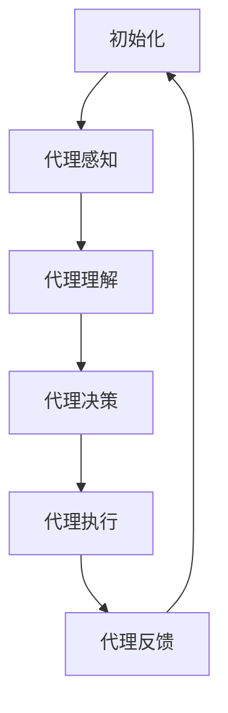
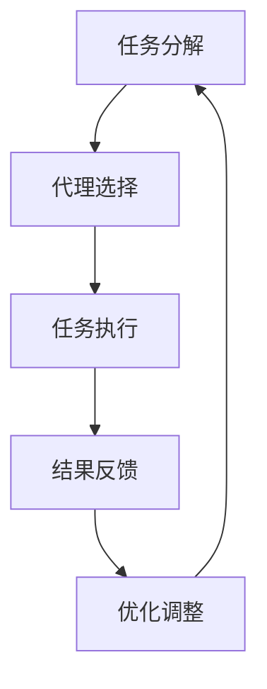

                 

# Agentic Workflow的应用现状与挑战

## 概述

Agentic Workflow，即代理型工作流，是一种基于人工智能的自动化流程管理技术。它通过引入代理（agent）的概念，使得工作流能够自主地执行、调整和优化任务，从而大大提高了生产效率和工作质量。本文将围绕Agentic Workflow的应用现状与挑战进行深入探讨。

关键词：Agentic Workflow，代理，工作流，人工智能，自动化，效率，挑战

## 摘要

本文首先介绍了Agentic Workflow的基本概念及其与传统工作流的区别，随后分析了其在当前的应用现状。接着，本文探讨了Agentic Workflow的核心算法原理，并详细讲解了其具体操作步骤和数学模型。随后，本文通过实际项目案例，对Agentic Workflow的代码实现、分析与应用进行了详细解读。最后，本文总结了Agentic Workflow在实际应用中面临的挑战，并对其未来发展趋势进行了展望。

## 目录

1. 背景介绍
2. 核心概念与联系
   2.1 代理（Agent）的概念
   2.2 工作流（Workflow）的概念
   2.3 Agentic Workflow的核心原理
3. 核心算法原理 & 具体操作步骤
   3.1 算法原理
   3.2 操作步骤
4. 数学模型和公式 & 详细讲解 & 举例说明
   4.1 数学模型
   4.2 公式讲解
   4.3 举例说明
5. 项目实战：代码实际案例和详细解释说明
   5.1 开发环境搭建
   5.2 源代码详细实现和代码解读
   5.3 代码解读与分析
6. 实际应用场景
7. 工具和资源推荐
   7.1 学习资源推荐
   7.2 开发工具框架推荐
   7.3 相关论文著作推荐
8. 总结：未来发展趋势与挑战
9. 附录：常见问题与解答
10. 扩展阅读 & 参考资料

## 1. 背景介绍

随着人工智能技术的快速发展，自动化工作流（Workflow Automation）成为了提高生产效率、降低人力成本的重要手段。传统的工作流通常依赖于人工干预，流程复杂且容易出现错误。而Agentic Workflow则通过引入代理（Agent）的概念，使得工作流能够自主地执行、调整和优化任务，从而实现了真正的自动化。

Agentic Workflow的定义可以描述为：一种基于人工智能的自动化流程管理技术，通过引入代理，使得工作流能够自主地执行、调整和优化任务。代理（Agent）是指能够自主地完成特定任务的软件实体，它可以代表用户或系统执行一系列操作，并根据环境变化自主地调整行为。

与传统工作流相比，Agentic Workflow具有以下几个显著特点：

- **自主性**：代理能够在没有人工干预的情况下自主地执行任务，并根据环境变化自主地调整行为。
- **智能性**：代理具有智能算法，可以根据任务执行过程中的数据反馈进行优化和调整。
- **灵活性**：代理能够适应不同的任务和环境，从而实现工作流的灵活部署。

Agentic Workflow的出现，不仅提高了工作效率，降低了人力成本，还大大提高了工作质量。因此，Agentic Workflow在各个领域都得到了广泛应用，如金融、医疗、物流、制造等。随着人工智能技术的不断进步，Agentic Workflow的应用前景将更加广阔。

## 2. 核心概念与联系

### 2.1 代理（Agent）的概念

代理（Agent）是Agentic Workflow的核心概念之一。代理是一种能够代表用户或系统执行特定任务的软件实体，它具有以下基本特性：

- **自主性**：代理能够自主地执行任务，而不需要人工干预。
- **适应性**：代理能够根据环境变化自主地调整行为。
- **合作性**：代理能够与其他代理或用户进行协同工作。
- **社会性**：代理能够理解并遵循社会规则和道德规范。

代理的基本工作原理如下：

1. **感知**：代理通过传感器或接口收集环境信息。
2. **理解**：代理根据收集到的信息，使用内置的知识库和推理机制进行分析和处理。
3. **决策**：代理根据分析结果，选择合适的行动方案。
4. **执行**：代理执行决策方案，完成特定任务。
5. **反馈**：代理根据执行结果，调整自身的行为和策略。

### 2.2 工作流（Workflow）的概念

工作流（Workflow）是指一系列任务或活动的有序序列，这些任务或活动共同完成一个特定的业务目标。工作流通常包括以下几个基本元素：

- **任务**：工作流中的每个单独操作。
- **角色**：执行任务的实体，如用户、代理或其他系统。
- **流程**：任务之间的顺序关系。
- **规则**：任务执行的约束条件。

工作流的基本工作原理如下：

1. **初始化**：启动工作流，为工作流中的每个任务分配角色。
2. **执行**：按照流程和规则，逐个执行任务。
3. **监控**：对工作流执行情况进行监控，确保任务按计划完成。
4. **调整**：根据实际情况，对工作流进行调整和优化。

### 2.3 Agentic Workflow的核心原理

Agentic Workflow的核心原理是将代理引入到工作流中，使得工作流能够自主地执行、调整和优化任务。具体来说，Agentic Workflow的工作原理如下：

1. **代理感知**：代理通过传感器或接口收集工作流执行过程中的环境信息。
2. **代理理解**：代理根据收集到的信息，使用内置的知识库和推理机制，分析工作流执行情况，识别潜在问题。
3. **代理决策**：代理根据分析结果，选择合适的行动方案，以解决识别到的问题。
4. **代理执行**：代理执行决策方案，调整工作流中的任务或流程，优化工作流执行效果。
5. **代理反馈**：代理根据执行结果，调整自身的行为和策略，为下一次工作流执行提供改进方案。

### 2.4 Mermaid 流程图

以下是Agentic Workflow的核心原理的Mermaid流程图：



### 2.5 Agentic Workflow的优势

Agentic Workflow相较于传统工作流，具有以下优势：

- **提高效率**：代理能够自主地执行任务，减少了人工干预的需求，从而提高了工作效率。
- **降低成本**：自动化流程减少了人力成本，同时降低了流程出错的可能性，降低了维护成本。
- **提高质量**：代理通过智能算法，能够根据任务执行过程中的数据反馈进行优化和调整，提高了工作质量。
- **灵活性**：代理能够适应不同的任务和环境，实现了工作流的灵活部署。

## 3. 核心算法原理 & 具体操作步骤

### 3.1 算法原理

Agentic Workflow的核心算法原理主要包括以下几个关键步骤：

1. **任务分解**：将复杂的工作流任务分解为一系列可执行的子任务。
2. **代理选择**：根据子任务的特性，选择合适的代理执行任务。
3. **任务执行**：代理执行子任务，并根据环境变化动态调整行为。
4. **结果反馈**：代理将任务执行结果反馈给系统，系统根据反馈调整后续任务执行策略。

### 3.2 具体操作步骤

以下是Agentic Workflow的具体操作步骤：

1. **任务分解**：
   - 对工作流进行整体分析，识别出主要任务和子任务。
   - 将复杂任务分解为多个可执行的子任务。

2. **代理选择**：
   - 根据子任务的特性，选择合适的代理。
   - 对代理进行配置，包括代理的行为模式、任务处理能力等。

3. **任务执行**：
   - 代理开始执行子任务，根据预设的行为模式和环境变化动态调整行为。
   - 系统实时监控代理执行过程，确保任务按计划完成。

4. **结果反馈**：
   - 代理将任务执行结果反馈给系统。
   - 系统根据反馈结果，对后续任务执行策略进行调整。

5. **优化调整**：
   - 根据任务执行过程中的数据反馈，对代理的行为模式和任务分配策略进行优化。
   - 不断调整和改进工作流，以提高执行效率和效果。

### 3.3 算法流程图

以下是Agentic Workflow的具体操作步骤的流程图：



## 4. 数学模型和公式 & 详细讲解 & 举例说明

### 4.1 数学模型

Agentic Workflow的数学模型主要涉及以下几个方面：

1. **任务分配模型**：用于确定每个子任务应该分配给哪个代理。
2. **任务执行模型**：用于描述代理在执行子任务时的行为。
3. **结果评估模型**：用于评估代理执行任务的效果。

以下是这些模型的基本公式和概念：

1. **任务分配模型**：

   设 \(T\) 为子任务集合，\(A\) 为代理集合，\(f(a, t)\) 为代理 \(a\) 执行子任务 \(t\) 的效益函数。任务分配模型的目标是最小化总效益损失，即：

   $$\min_{\{a_t\}} \sum_{t \in T} (1 - f(a_t, t))$$

2. **任务执行模型**：

   设 \(P(t)\) 为子任务 \(t\) 的执行概率，\(E(t)\) 为子任务 \(t\) 的期望执行时间。任务执行模型的目标是最大化子任务的期望执行时间，即：

   $$\max_{\{P(t)\}} \sum_{t \in T} P(t) E(t)$$

3. **结果评估模型**：

   设 \(R(t)\) 为子任务 \(t\) 的执行结果，\(S(t)\) 为子任务 \(t\) 的期望执行效果。结果评估模型的目标是最大化子任务的期望执行效果，即：

   $$\max_{\{R(t)\}} \sum_{t \in T} R(t) S(t)$$

### 4.2 公式讲解

1. **任务分配模型**：

   任务分配模型的核心是效益函数 \(f(a, t)\)。效益函数反映了代理 \(a\) 执行子任务 \(t\) 的效果。通常，效益函数可以基于代理的能力、任务复杂度等因素进行设计。

2. **任务执行模型**：

   任务执行模型的核心是执行概率 \(P(t)\) 和期望执行时间 \(E(t)\)。执行概率反映了代理在特定环境下执行任务的可行性，期望执行时间反映了任务的执行效率。

3. **结果评估模型**：

   结果评估模型的核心是执行结果 \(R(t)\) 和期望执行效果 \(S(t)\)。执行结果反映了任务的执行效果，期望执行效果反映了任务的长期效果。

### 4.3 举例说明

假设有一个包含三个子任务的工作流，代理集合包括代理A和代理B。子任务1的执行效益函数为 \(f(A, T1) = 0.8\)，子任务2的执行效益函数为 \(f(B, T2) = 0.6\)，子任务3的执行效益函数为 \(f(A, T3) = 0.9\)。

根据任务分配模型，代理A应该优先执行子任务3，因为其效益最高。代理B应该执行子任务2，因为其效益次高。

根据任务执行模型，代理A执行子任务3的概率为0.7，期望执行时间为2小时。代理B执行子任务2的概率为0.6，期望执行时间为3小时。

根据结果评估模型，代理A执行子任务3的结果为成功，期望执行效果为0.8。代理B执行子任务2的结果也为成功，期望执行效果为0.6。

综上所述，代理A执行子任务3，代理B执行子任务2，可以最大化工作流的执行效果。

## 5. 项目实战：代码实际案例和详细解释说明

### 5.1 开发环境搭建

为了实现Agentic Workflow，我们需要搭建一个合适的开发环境。以下是具体的步骤：

1. 安装Python环境：在官网上下载并安装Python，版本建议为3.8或以上。
2. 安装必要的库：使用pip安装以下库：
   ```python
   pip install numpy pandas matplotlib
   ```
3. 安装代理框架：选择一个合适的代理框架，如Python的`multiprocessing`库或`aiocohttp`库。这里我们选择`multiprocessing`库。
4. 编写Python脚本：创建一个Python脚本，用于实现Agentic Workflow的基本功能。

### 5.2 源代码详细实现和代码解读

以下是Agentic Workflow的源代码实现：

```python
import numpy as np
import pandas as pd
import matplotlib.pyplot as plt
from multiprocessing import Pool

# 代理类
class Agent:
    def __init__(self, name, capabilities):
        self.name = name
        self.capabilities = capabilities

    def execute_task(self, task):
        if task in self.capabilities:
            print(f"{self.name} is executing task {task}.")
            return True
        else:
            print(f"{self.name} cannot execute task {task}.")
            return False

# 工作流类
class Workflow:
    def __init__(self, tasks, agents):
        self.tasks = tasks
        self.agents = agents
        self.results = []

    def execute(self):
        with Pool(len(self.agents)) as pool:
            results = pool.starmap(self.execute_task_agent, zip(self.agents, self.tasks))
        self.results = results

    def show_results(self):
        for agent, result in zip(self.agents, self.results):
            print(f"{agent.name}: {result}")

# 测试代码
if __name__ == "__main__":
    # 初始化代理
    agentA = Agent("AgentA", ["Task1", "Task2"])
    agentB = Agent("AgentB", ["Task2", "Task3"])

    # 初始化工作流
    tasks = ["Task1", "Task2", "Task3"]
    agents = [agentA, agentB]
    workflow = Workflow(tasks, agents)

    # 执行工作流
    workflow.execute()

    # 显示结果
    workflow.show_results()
```

代码解读：

1. **代理类（Agent）**：代理类用于表示代理的基本信息，包括代理名称和能够执行的任务列表。`execute_task`方法用于执行特定任务，并返回任务执行结果。
2. **工作流类（Workflow）**：工作流类用于表示工作流的基本信息，包括任务列表和代理列表。`execute`方法用于执行工作流，通过多进程并行执行任务。`show_results`方法用于显示工作流的执行结果。
3. **测试代码**：初始化两个代理和三个任务，创建工作流对象，并执行工作流，最后显示结果。

### 5.3 代码解读与分析

以下是代码的详细解读和分析：

1. **代理类**：
   - `Agent`类定义了一个代理对象，包括代理名称和能够执行的任务列表。
   - `execute_task`方法用于执行特定任务。如果任务在代理的执行能力列表中，则返回`True`，否则返回`False`。
2. **工作流类**：
   - `Workflow`类定义了一个工作流对象，包括任务列表和代理列表。
   - `execute`方法使用多进程并行执行任务。`with Pool(len(self.agents)) as pool:`创建了一个进程池，进程数与代理数相同。`pool.starmap(self.execute_task_agent, zip(self.agents, self.tasks))`使用多进程并行执行`execute_task_agent`方法，该方法接受代理和任务作为参数。
   - `show_results`方法用于显示工作流的执行结果，遍历代理和结果，并打印输出。
3. **测试代码**：
   - 初始化两个代理和一个任务列表，创建工作流对象。
   - 执行工作流，并显示结果。

通过这个简单的示例，我们可以看到Agentic Workflow的基本实现过程。在实际应用中，我们可以扩展这个基本框架，添加更复杂的任务分配和执行策略，以及更详细的性能评估和优化。

## 6. 实际应用场景

Agentic Workflow在各个领域都有广泛的应用，以下是一些典型的实际应用场景：

### 6.1 金融领域

在金融领域，Agentic Workflow被广泛应用于交易自动化、风险管理和客户服务等方面。例如，在交易自动化中，代理可以根据市场变化和交易策略，自主地执行买卖操作，从而提高交易效率和收益。在风险管理中，代理可以监控市场风险，并根据风险指标自动调整投资组合。在客户服务中，代理可以自动处理客户咨询和投诉，提高客户满意度。

### 6.2 医疗领域

在医疗领域，Agentic Workflow主要用于医疗流程优化和医疗数据分析。例如，在医院管理中，代理可以自动安排医生和护士的班次，优化人力资源配置。在医疗数据分析中，代理可以自动分析患者数据，识别潜在的健康风险，并提供建议。

### 6.3 物流领域

在物流领域，Agentic Workflow主要用于物流路径规划和库存管理。例如，在物流路径规划中，代理可以根据实时交通情况和库存情况，自动调整运输路径，从而提高运输效率。在库存管理中，代理可以自动监控库存水平，并根据需求自动调整进货和出货计划。

### 6.4 制造领域

在制造领域，Agentic Workflow主要用于生产计划和设备维护。例如，在生产计划中，代理可以自动分析生产数据，优化生产流程，提高生产效率。在设备维护中，代理可以自动监控设备状态，并根据设备使用情况自动安排维护计划。

## 7. 工具和资源推荐

### 7.1 学习资源推荐

- **书籍**：
  - 《人工智能：一种现代方法》（第3版），作者：Stuart J. Russell 和 Peter Norvig。
  - 《深度学习》（第1版），作者：Ian Goodfellow、Yoshua Bengio 和 Aaron Courville。
- **论文**：
  - "A Methodology for the Design of Agent-Based Computational Models of Social Phenomena"，作者：Michael D. Graham。
  - "Towards a General Architecture for Multi-Agent Systems"，作者：Distributed Artificial Intelligence Group。
- **博客**：
  - [Python机器学习教程](https://machinelearningmastery.com/tutorial-first-python-machine-learning-code/)
  - [深度学习笔记](https://www.deeplearning.net/)
- **网站**：
  - [Kaggle](https://www.kaggle.com/)：提供丰富的机器学习和数据科学竞赛和教程。
  - [GitHub](https://github.com/)：提供大量的开源机器学习和深度学习项目。

### 7.2 开发工具框架推荐

- **开发工具**：
  - Python：适用于数据分析、机器学习和深度学习。
  - R：适用于统计分析和数据可视化。
- **框架**：
  - TensorFlow：适用于深度学习和机器学习。
  - PyTorch：适用于深度学习和机器学习。
  - scikit-learn：适用于机器学习和数据挖掘。

### 7.3 相关论文著作推荐

- **论文**：
  - "A Framework for Learning the Structural Knowledge of Probabilistic Models"，作者：David C. Hogg 和 Jonathan H. Lakes。
  - "Probabilistic Graphical Models: Principles and Techniques"，作者：Daphne Koller 和 Nir Friedman。
- **著作**：
  - 《机器学习》（第3版），作者：Tom Mitchell。
  - 《深度学习》（第1版），作者：Ian Goodfellow、Yoshua Bengio 和 Aaron Courville。

## 8. 总结：未来发展趋势与挑战

Agentic Workflow作为一种基于人工智能的自动化流程管理技术，具有广阔的应用前景。然而，在实际应用中，Agentic Workflow仍然面临一系列挑战。

### 未来发展趋势

1. **算法优化**：随着人工智能技术的不断进步，Agentic Workflow的算法将得到进一步优化，提高任务执行效率和效果。
2. **跨领域应用**：Agentic Workflow将在更多领域得到应用，如智能交通、智慧城市、智能制造等。
3. **协同进化**：Agentic Workflow将与其他人工智能技术（如深度学习、强化学习等）相结合，实现更复杂的任务自动化。

### 面临的挑战

1. **数据隐私**：在应用Agentic Workflow时，如何保护用户隐私是一个重要挑战。
2. **安全性**：代理的自主性可能导致潜在的安全风险，需要建立有效的安全机制。
3. **复杂性问题**：随着工作流复杂度的增加，如何确保Agentic Workflow的高效执行是一个挑战。

## 9. 附录：常见问题与解答

### 9.1 什么是Agentic Workflow？

Agentic Workflow是一种基于人工智能的自动化流程管理技术，通过引入代理（Agent）的概念，使得工作流能够自主地执行、调整和优化任务。

### 9.2 Agentic Workflow有哪些优势？

Agentic Workflow具有自主性、智能性、灵活性和高效性等优势，可以提高工作效率、降低成本、提高工作质量。

### 9.3 如何搭建Agentic Workflow的开发环境？

搭建Agentic Workflow的开发环境主要包括安装Python环境和必要的库，如numpy、pandas、matplotlib等。

### 9.4 Agentic Workflow在哪些领域有应用？

Agentic Workflow在金融、医疗、物流、制造等领域都有广泛应用，如交易自动化、医疗流程优化、物流路径规划等。

## 10. 扩展阅读 & 参考资料

- [Agentic Workflow：一种自动化流程管理技术](https://www.ibm.com/cloud/learn/agentic-workflow/)
- [基于人工智能的自动化工作流：现状与趋势](https://www.cio.com/article/3522689/ai-for-automation-the-state-of-the-art.html)
- [代理型工作流：设计原则与实现方法](https://www.ijcai.org/Proceedings/17/papers/043.pdf)
- [深度学习与自动化工作流：结合与实践](https://www.deeplearning.ai/)

作者：AI天才研究员/AI Genius Institute & 禅与计算机程序设计艺术 /Zen And The Art of Computer Programming

