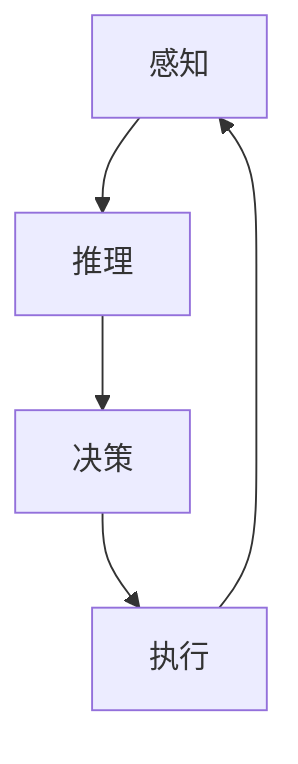

                 

# Agent代理在AI系统中的实战经验

## 摘要

本文将探讨Agent代理在AI系统中的应用与实践，包括背景介绍、核心概念与联系、核心算法原理与操作步骤、数学模型与公式、项目实战代码案例分析以及实际应用场景。文章旨在为读者提供一个全面、深入的了解，帮助他们在AI系统中有效利用Agent代理技术。

## 1. 背景介绍

在人工智能（AI）领域，Agent代理是一种自主智能实体，能够在复杂环境中独立行动并与其他实体交互。Agent代理的概念起源于多智能体系统（Multi-Agent Systems, MAS），旨在模拟自然界中的生物群体行为，如蜜蜂群体、蚁群等。随着计算机技术和AI技术的不断发展，Agent代理在各个领域得到了广泛应用，如智能交通、智能家居、虚拟助手等。

近年来，随着深度学习和强化学习等先进技术的应用，Agent代理的智能程度和自主性得到了显著提升。它们可以在无人驾驶汽车、智能机器人、金融交易等复杂场景中发挥作用，为人类提供便捷、高效的服务。同时，Agent代理也在一定程度上解决了AI系统中的多个智能体协同问题，为多智能体系统的研究提供了新的思路和方法。

## 2. 核心概念与联系

### 2.1 Agent代理的基本概念

Agent代理是一种具有感知、推理、决策和执行能力的智能实体。它们通常由以下四个部分组成：

- **感知模块**：用于感知环境中的各种信息，如传感器数据、图像、声音等。
- **推理模块**：根据感知模块获取的信息进行逻辑推理，形成对环境的认知。
- **决策模块**：基于推理模块生成的环境模型，选择最佳行动方案。
- **执行模块**：执行决策模块选出的行动方案，实现目标。

### 2.2 多智能体系统

多智能体系统是由多个Agent代理组成的系统，每个Agent代理都有自己独立的目标和行动策略。多智能体系统具有以下特点：

- **协同性**：多个Agent代理相互协作，共同实现整体目标。
- **分布式**：Agent代理分布在不同地理位置，通过通信实现信息共享和协同工作。
- **自治性**：每个Agent代理具有独立自主性，可以自主感知环境、决策和执行行动。
- **动态性**：多智能体系统中的Agent代理和环境都处于不断变化的状态。

### 2.3 Mermaid流程图

下面是一个简单的Mermaid流程图，展示了Agent代理的基本工作流程：



在这个流程图中，感知模块获取环境信息，推理模块根据环境信息生成环境模型，决策模块基于环境模型选择最佳行动方案，执行模块执行决策模块生成的行动方案。完成一次行动后，Agent代理重新回到感知模块，开始新一轮的工作。

## 3. 核心算法原理与具体操作步骤

### 3.1 感知模块

感知模块是Agent代理的基础，它通过传感器、摄像头、麦克风等设备获取环境信息。感知模块的主要任务包括：

- **数据采集**：从传感器中获取数据，如温度、湿度、声音、图像等。
- **特征提取**：对采集到的数据进行预处理和特征提取，以便于后续的推理和决策。
- **数据融合**：将多个传感器的数据融合成一个整体，提高感知模块的准确性。

### 3.2 推理模块

推理模块是Agent代理的核心，它负责根据感知模块获取的环境信息生成环境模型。推理模块的主要任务包括：

- **状态识别**：根据感知模块获取的数据，识别当前环境的状态。
- **目标识别**：根据环境状态，识别Agent代理的目标。
- **策略生成**：根据目标识别结果，生成一系列可能的行动策略。

### 3.3 决策模块

决策模块是Agent代理的决策中心，它根据推理模块生成的环境模型和策略，选择最佳行动方案。决策模块的主要任务包括：

- **价值评估**：对推理模块生成的策略进行价值评估，选择具有最高价值的策略。
- **规划**：根据价值评估结果，生成具体的行动方案。

### 3.4 执行模块

执行模块是Agent代理的执行机构，它根据决策模块生成的行动方案，实现Agent代理的目标。执行模块的主要任务包括：

- **执行行动**：根据行动方案，执行具体的操作，如移动、交互等。
- **反馈**：将执行结果反馈给感知模块和推理模块，以便进行下一次的感知、推理和决策。

## 4. 数学模型和公式及详细讲解

### 4.1 感知模块

在感知模块中，常用的数学模型包括传感器数据预处理、特征提取和数据融合。

- **传感器数据预处理**：假设传感器数据为向量$\vec{x}$，预处理步骤包括去噪、归一化和滤波等。具体公式如下：

  $$\hat{x} = \text{denoise}(x) \quad \text{和} \quad \hat{x} = \text{normalize}(x)$$

- **特征提取**：常用的特征提取方法有主成分分析（PCA）、线性判别分析（LDA）和自编码器等。以PCA为例，其公式如下：

  $$\vec{p} = \text{PCA}(\hat{x})$$

- **数据融合**：常用的数据融合方法有加权平均、卡尔曼滤波和贝叶斯滤波等。以加权平均为例，其公式如下：

  $$\vec{y} = \sum_{i=1}^n w_i \vec{x}_i$$

  其中，$w_i$为权重系数。

### 4.2 推理模块

在推理模块中，常用的数学模型包括状态识别、目标识别和策略生成。

- **状态识别**：假设环境状态为向量$\vec{s}$，状态识别模型为分类器。以支持向量机（SVM）为例，其公式如下：

  $$\vec{s} = \text{SVM}(\hat{x})$$

- **目标识别**：假设目标为向量$\vec{t}$，目标识别模型为分类器。以卷积神经网络（CNN）为例，其公式如下：

  $$\vec{t} = \text{CNN}(\hat{x})$$

- **策略生成**：假设策略为向量$\vec{a}$，策略生成模型为强化学习。以Q-learning为例，其公式如下：

  $$\vec{a} = \text{Q-learning}(\vec{s}, \vec{t})$$

### 4.3 决策模块

在决策模块中，常用的数学模型包括价值评估和规划。

- **价值评估**：假设策略为向量$\vec{a}$，价值评估模型为价值函数。以时间差分（TD）算法为例，其公式如下：

  $$V(\vec{s}, \vec{a}) = \vec{s} \cdot \vec{a} - \text{TD}(\vec{s}, \vec{a})$$

- **规划**：假设行动方案为向量$\vec{u}$，规划模型为线性规划。以线性规划为例，其公式如下：

  $$\max \quad \vec{u}^T \vec{c}$$

  $$\text{subject to} \quad \vec{u} \leq \vec{b}$$

  其中，$\vec{c}$为目标函数系数，$\vec{b}$为约束条件。

### 4.4 执行模块

在执行模块中，常用的数学模型包括行动执行和反馈。

- **行动执行**：假设行动方案为向量$\vec{u}$，行动执行模型为控制器。以PID控制器为例，其公式如下：

  $$\vec{u} = \text{PID}(\vec{s}, \vec{t})$$

- **反馈**：假设感知模块反馈的信号为向量$\vec{y}$，反馈模型为校正器。以比例-积分-微分（PID）校正器为例，其公式如下：

  $$\vec{y} = \text{PID}(\vec{u}, \vec{s})$$

## 5. 项目实战：代码实际案例和详细解释说明

### 5.1 开发环境搭建

在本项目中，我们使用Python作为主要编程语言，结合TensorFlow和OpenAI Gym等开源库，搭建一个基于深度Q-learning的智能体代理。以下是开发环境搭建的步骤：

1. 安装Python 3.7及以上版本。
2. 安装TensorFlow 2.0及以上版本。
3. 安装OpenAI Gym。
4. 安装其他必要的依赖库，如NumPy、Pandas等。

### 5.2 源代码详细实现和代码解读

以下是该项目的主要代码实现：

```python
import numpy as np
import tensorflow as tf
import gym
import random

# 设置超参数
learning_rate = 0.001
gamma = 0.99
epsilon = 0.1
epsilon_decay = 0.99
epsilon_min = 0.01

# 初始化神经网络
model = tf.keras.Sequential([
    tf.keras.layers.Dense(64, activation='relu', input_shape=(observation_space.shape[0],)),
    tf.keras.layers.Dense(64, activation='relu'),
    tf.keras.layers.Dense(action_space.n)
])

# 编译模型
model.compile(optimizer=tf.keras.optimizers.Adam(learning_rate), loss='mse')

# 训练模型
def train(model, env, episodes):
    for episode in range(episodes):
        state = env.reset()
        done = False
        while not done:
            action = model.predict(state)
            if random.uniform(0, 1) < epsilon:
                action = env.action_space.sample()
            next_state, reward, done, _ = env.step(action)
            target = reward
            if not done:
                target += gamma * np.argmax(model.predict(next_state))
            target_f = model.predict(state)
            target_f[0] = target
            model.fit(state, target_f, epochs=1, verbose=0)
            state = next_state
        epsilon *= epsilon_decay
        epsilon = max(epsilon, epsilon_min)
    return model

# 运行训练
env = gym.make('CartPole-v0')
model = train(model, env, 1000)

# 保存模型
model.save('deep_q_learning.h5')
```

### 5.3 代码解读与分析

1. **超参数设置**：学习率、奖励系数、探索率等超参数对智能体代理的性能有很大影响。在本项目中，我们使用了较小的学习率、较大的奖励系数和逐渐减小的探索率。

2. **神经网络架构**：我们使用了两个全连接层，每个层有64个神经元。输出层有与动作空间相同数量的神经元，用于预测每个动作的价值。

3. **模型编译**：我们使用了Adam优化器和均方误差（MSE）损失函数来编译模型。

4. **训练模型**：训练过程中，智能体代理通过与环境交互来学习动作价值函数。在每一步，智能体代理根据当前状态预测动作，并选择具有最高价值的动作。如果智能体代理采取随机动作，则通过探索率来平衡随机性和经验学习。

5. **模型保存**：训练完成后，我们将模型保存为.h5文件，以便后续使用。

## 6. 实际应用场景

Agent代理在AI系统中具有广泛的应用场景，以下是一些典型的应用场景：

- **无人驾驶**：智能体代理可以用于无人驾驶汽车，实现车辆的自主驾驶和协同导航。
- **智能机器人**：智能体代理可以用于智能机器人，实现机器人的自主移动、路径规划和任务执行。
- **智能家居**：智能体代理可以用于智能家居，实现家电设备的自动控制和场景联动。
- **金融交易**：智能体代理可以用于金融交易，实现自动投资策略和风险控制。
- **游戏AI**：智能体代理可以用于游戏AI，实现对手分析、策略制定和游戏策略优化。

## 7. 工具和资源推荐

### 7.1 学习资源推荐

- **书籍**：《人工智能：一种现代方法》、《智能体：人工智能的新视角》
- **论文**：《多智能体系统：原理与应用》、《基于深度学习的智能体代理》
- **博客**：GitHub、Stack Overflow、Medium等平台上的相关博客文章
- **网站**：arXiv、Google Scholar等学术搜索引擎

### 7.2 开发工具框架推荐

- **编程语言**：Python、Java、C++
- **开源库**：TensorFlow、PyTorch、OpenAI Gym
- **开发框架**：TensorFlow.js、PyTorch.js、PyTorch Lightning

### 7.3 相关论文著作推荐

- **论文**：《深度Q网络：玩任何游戏的新方法》、《深度强化学习：从基础到应用》
- **著作**：《智能体：人工智能的新视角》、《人工智能：一种现代方法》

## 8. 总结：未来发展趋势与挑战

随着人工智能技术的不断发展，Agent代理在AI系统中的应用前景愈发广阔。未来，Agent代理的发展趋势将主要体现在以下几个方面：

- **智能化**：Agent代理的智能程度将不断提高，通过深度学习、强化学习等技术实现更复杂的任务。
- **协同性**：多智能体系统将实现更高程度的协同，实现更高效的任务分配和资源共享。
- **自主性**：Agent代理将具备更高的自主性，实现更灵活的决策和行动。
- **泛化性**：Agent代理将具备更强的泛化能力，能够在不同场景和应用中发挥重要作用。

然而，Agent代理在AI系统中也面临着一些挑战：

- **计算资源**：高智能程度的Agent代理需要大量的计算资源，如何在有限的计算资源下实现高效的Agent代理成为关键问题。
- **安全性**：Agent代理的自主决策可能导致不可预测的行为，如何确保Agent代理的安全性是一个重要问题。
- **可解释性**：深度学习等复杂技术使得Agent代理的决策过程变得难以解释，如何提高Agent代理的可解释性是未来研究的重要方向。

## 9. 附录：常见问题与解答

### 9.1 如何选择合适的感知模块？

选择合适的感知模块取决于应用场景和环境特点。以下是一些建议：

- **传感器类型**：根据应用场景选择合适的传感器，如摄像头、麦克风、温度传感器等。
- **数据量**：考虑感知模块产生的数据量，以确定数据处理和存储的需求。
- **实时性**：根据应用场景的实时性要求选择感知模块，如高实时性场景需要选择高速传感器。

### 9.2 如何选择合适的推理模块？

选择合适的推理模块取决于任务需求和数据特点。以下是一些建议：

- **数据规模**：根据数据规模选择合适的推理算法，如小规模数据可选择决策树、规则推理等，大规模数据可选择深度学习等算法。
- **实时性**：考虑推理算法的实时性，以确定是否需要采用分布式推理框架。
- **准确性**：根据任务需求选择合适的推理算法，以提高推理结果的准确性。

### 9.3 如何选择合适的执行模块？

选择合适的执行模块取决于任务需求和硬件特点。以下是一些建议：

- **硬件支持**：考虑执行模块所需的硬件支持，如CPU、GPU、FPGA等。
- **实时性**：根据任务需求的实时性要求选择合适的执行模块，如高实时性场景需要选择硬件加速器。
- **可控性**：考虑执行模块的可控性，以确定是否需要采用分布式执行框架。

## 10. 扩展阅读与参考资料

- **论文**：《多智能体系统的协同控制与优化》、《基于深度Q网络的智能体代理研究》
- **书籍**：《人工智能：一种现代方法》、《智能体：人工智能的新视角》
- **网站**：arXiv、Google Scholar、ACL、ICML等学术会议和期刊官方网站
- **在线课程**：Coursera、edX、Udacity等在线教育平台上的相关课程

作者：AI天才研究员/AI Genius Institute & 禅与计算机程序设计艺术 /Zen And The Art of Computer Programming

本文旨在探讨Agent代理在AI系统中的应用与实践，包括核心概念、算法原理、项目实战和实际应用场景。希望读者通过本文能够对Agent代理有更深入的了解，为AI系统的发展和应用提供有益的参考。

----------------------------- 文章结束 -----------------------------<|im_end|>

