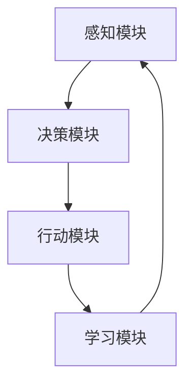
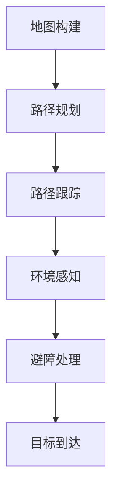

                 

### 文章标题

**Agent代理在AI系统中的实战经验**

> **关键词：** 代理（Agent）、人工智能（AI）、系统架构、实战经验、算法原理、数学模型、项目实战、应用场景、工具资源

> **摘要：** 本文将深入探讨代理（Agent）在人工智能（AI）系统中的应用与实践。通过详细解析代理的概念、架构、核心算法原理以及数学模型，结合实际项目案例，本文旨在为读者提供全面且实用的实战经验，帮助理解代理在AI系统中的重要作用和未来发展挑战。

### 目录

1. **背景介绍**
2. **核心概念与联系**
   1. 代理（Agent）的定义与分类
   2. 代理在AI系统中的应用
   3. 代理架构的基本组件
3. **核心算法原理 & 具体操作步骤**
   1. 代理学习算法概述
   2. 强化学习与代理
   3. 自主导航与规划
4. **数学模型和公式 & 详细讲解 & 举例说明**
   1. 代理优化模型
   2. 代理行为预测模型
   3. 代理协作模型
5. **项目实战：代码实际案例和详细解释说明**
   1. 开发环境搭建
   2. 源代码详细实现和代码解读
   3. 代码解读与分析
6. **实际应用场景**
7. **工具和资源推荐**
   1. 学习资源推荐
   2. 开发工具框架推荐
   3. 相关论文著作推荐
8. **总结：未来发展趋势与挑战**
9. **附录：常见问题与解答**
10. **扩展阅读 & 参考资料**

### 1. 背景介绍

随着人工智能（AI）技术的迅猛发展，AI系统在各个领域的应用越来越广泛。从自动驾驶汽车到智能家居，从智能客服到金融风险管理，AI技术正在深刻改变我们的生活和工作方式。在这个背景下，代理（Agent）成为了一个重要的概念。代理是一种能够代表用户或系统执行特定任务的实体，具有自主性、反应性、适应性等特征。在AI系统中，代理不仅能够执行预定义的任务，还能够通过学习与适应，优化其行为，提高系统整体性能。

代理的概念源于人工智能的早期研究，最早可以追溯到20世纪50年代。随着AI技术的不断发展，代理逐渐成为AI系统中的一个核心组成部分。在AI系统中，代理通常扮演着任务执行者、决策者、信息处理者等多重角色，能够根据环境和目标自动调整行为，实现智能化的系统控制。

本文将详细探讨代理在AI系统中的应用与实践，包括代理的定义与分类、代理架构的基本组件、核心算法原理、数学模型以及实际项目案例。通过本文的阅读，读者可以全面了解代理在AI系统中的重要作用，掌握代理的实战经验，并为未来的AI系统开发提供参考。

### 2. 核心概念与联系

#### 2.1 代理（Agent）的定义与分类

代理（Agent）是人工智能（AI）中的一个核心概念，指的是能够代表用户或系统执行特定任务的实体。代理具有自主性、反应性、适应性等特征，能够根据环境和目标自动调整行为，实现智能化的系统控制。

根据代理的自主性程度，可以将代理分为以下几类：

1. **被动代理（Passive Agent）**：被动代理只能执行预定义的任务，无法根据环境变化调整行为。它们通常用于执行简单的任务，如数据采集、数据传输等。

2. **主动代理（Active Agent）**：主动代理不仅能够执行预定义的任务，还能够根据环境和目标自动调整行为。它们通常用于复杂任务的执行，如路径规划、资源调度等。

3. **智能代理（Intelligent Agent）**：智能代理具有高度自主性，能够通过学习和适应，优化其行为，提高系统整体性能。智能代理通常采用机器学习、深度学习等技术，实现智能决策和执行。

#### 2.2 代理在AI系统中的应用

在AI系统中，代理的应用非常广泛，主要包括以下几个方面：

1. **任务执行**：代理可以代表用户或系统执行各种任务，如数据采集、数据处理、任务分配等。通过代理的执行，可以降低系统的复杂度，提高任务的执行效率。

2. **决策支持**：代理可以根据环境和目标，自动调整行为，实现智能化的决策支持。例如，在自动驾驶系统中，代理可以根据道路状况、车辆状态等因素，实时调整行驶策略，提高行驶安全性。

3. **信息处理**：代理可以收集、处理和分析大量信息，为系统提供数据支持。例如，在智能客服系统中，代理可以分析用户的提问，提供合适的回答，提高用户体验。

4. **资源调度**：代理可以优化系统资源的分配和使用，提高系统整体性能。例如，在云计算系统中，代理可以根据负载情况，动态调整服务器资源，提高资源利用率。

#### 2.3 代理架构的基本组件

代理架构通常包括以下几个基本组件：

1. **感知模块（Perception Module）**：感知模块负责收集环境信息，如传感器数据、用户输入等。感知模块是代理与外部环境交互的桥梁，为代理提供决策所需的输入信息。

2. **决策模块（Decision Module）**：决策模块根据感知模块收集到的信息，结合预定义的策略或学习到的知识，生成具体的行动指令。决策模块是代理的核心，负责代理的行为控制。

3. **行动模块（Action Module）**：行动模块根据决策模块生成的指令，执行具体的任务或操作。行动模块是代理的执行者，将决策转化为实际效果。

4. **学习模块（Learning Module）**：学习模块负责代理的学习与适应。通过机器学习、深度学习等技术，代理可以不断优化其行为，提高系统性能。

#### 2.4 代理架构的 Mermaid 流程图



在上述流程图中，感知模块收集环境信息，传递给决策模块；决策模块根据信息生成行动指令，传递给行动模块；行动模块执行指令，产生结果，同时将结果反馈给学习模块；学习模块根据反馈信息，优化代理行为，再次传递给感知模块，形成一个闭环。这个过程展示了代理架构的基本工作流程。

### 3. 核心算法原理 & 具体操作步骤

代理在AI系统中的作用不仅依赖于其架构设计，更重要的是其核心算法的实现。以下将介绍几个核心算法原理，并详细描述其具体操作步骤。

#### 3.1 代理学习算法概述

代理学习算法是代理在AI系统中的核心，负责代理的行为优化和决策能力提升。常见的代理学习算法包括强化学习（Reinforcement Learning，RL）、监督学习（Supervised Learning，SL）和无监督学习（Unsupervised Learning，UL）。

1. **强化学习（Reinforcement Learning）**：强化学习是一种通过奖励机制来驱动代理学习的过程。代理通过与环境互动，不断调整行为策略，以最大化长期奖励。具体操作步骤如下：

   - **初始化**：设定代理的初始状态和行动策略。
   - **环境交互**：代理根据当前状态选择一个动作，并执行该动作。
   - **状态更新**：环境根据代理的动作产生新的状态和奖励。
   - **策略调整**：代理根据奖励和当前策略，调整其行动策略。

2. **监督学习（Supervised Learning）**：监督学习是一种通过已有标记数据训练代理的过程。代理通过学习标记数据，预测未知数据的标签。具体操作步骤如下：

   - **数据准备**：收集和准备标记数据集。
   - **模型训练**：使用标记数据训练代理模型。
   - **模型评估**：使用验证数据评估代理模型性能。
   - **模型优化**：根据评估结果调整模型参数，提高模型性能。

3. **无监督学习（Unsupervised Learning）**：无监督学习是一种不依赖于标记数据的训练过程。代理通过自动发现数据中的模式，学习数据分布。具体操作步骤如下：

   - **数据准备**：收集无标记数据集。
   - **模型训练**：使用无标记数据训练代理模型。
   - **模型评估**：评估代理模型发现的数据模式。
   - **模型优化**：根据评估结果调整模型参数，提高模型性能。

#### 3.2 强化学习与代理

强化学习（Reinforcement Learning，RL）是一种基于奖励机制的机器学习范式，特别适用于训练代理。在强化学习中，代理通过与环境的交互，学习到最优的行为策略。以下是强化学习与代理的具体操作步骤：

1. **环境定义**：定义代理所处的环境，包括状态空间、动作空间和奖励函数。

2. **状态观察**：代理通过感知模块观察当前环境的状态。

3. **行为选择**：代理根据当前状态，选择一个动作。

4. **执行动作**：代理执行选定的动作，并更新环境状态。

5. **奖励反馈**：环境根据代理的动作，产生一个奖励，并反馈给代理。

6. **策略调整**：代理根据奖励和当前策略，调整其行为策略，以实现最优行为。

#### 3.3 自主导航与规划

自主导航与规划（Autonomous Navigation and Planning）是代理在AI系统中的一项重要任务，特别是在自动驾驶和智能机器人领域。以下是自主导航与规划的具体操作步骤：

1. **地图构建**：代理通过感知模块获取环境信息，构建环境地图。

2. **路径规划**：代理根据目标位置和当前地图，规划一条最优路径。

3. **路径跟踪**：代理根据规划的路径，控制机器人或车辆进行自主导航。

4. **环境感知**：代理持续感知周围环境，更新地图信息，调整导航策略。

5. **避障处理**：代理在导航过程中，检测并避免障碍物，确保安全行驶。

6. **目标到达**：代理到达目标位置后，根据任务要求，进行任务执行或目标调整。

#### 3.4 自主导航与规划的 Mermaid 流程图



在上述流程图中，代理首先构建环境地图，然后根据目标位置规划最优路径，进行路径跟踪。在导航过程中，代理持续感知周围环境，处理避障问题，并最终到达目标位置。

### 4. 数学模型和公式 & 详细讲解 & 举例说明

在代理算法中，数学模型起着至关重要的作用。以下将介绍几个常用的数学模型，包括代理优化模型、代理行为预测模型和代理协作模型，并详细讲解其公式和具体操作步骤。

#### 4.1 代理优化模型

代理优化模型用于优化代理的行为策略，以提高系统性能。以下是一个简单的代理优化模型：

1. **目标函数**：目标函数定义了代理希望优化的目标。例如，在路径规划中，目标函数可以是总路程最短或总时间最少。

   $$ J = \sum_{t=1}^{T} w_t f(s_t, a_t) $$

   其中，$J$表示目标函数值，$w_t$表示权重，$f(s_t, a_t)$表示状态和动作的函数。

2. **策略更新**：代理通过迭代更新策略，以找到最优策略。常用的更新方法包括梯度下降法和模拟退火法。

   - **梯度下降法**：

     $$ \theta_{t+1} = \theta_{t} - \alpha \nabla_\theta J(\theta_t) $$

     其中，$\theta_t$表示当前策略参数，$\alpha$表示学习率，$\nabla_\theta J(\theta_t)$表示目标函数的梯度。

   - **模拟退火法**：

     $$ \theta_{t+1} = \theta_t + \alpha \cdot \text{sign}(\nabla_\theta J(\theta_t)) $$

     其中，$\text{sign}(\cdot)$表示符号函数，用于确定参数更新的方向。

#### 4.2 代理行为预测模型

代理行为预测模型用于预测代理的未来行为，以便进行有效的决策。以下是一个基于马尔可夫决策过程（MDP）的代理行为预测模型：

1. **状态转移概率**：状态转移概率表示代理在当前状态采取某一动作后，转移到下一状态的概率。

   $$ P(s_{t+1} | s_t, a_t) $$

2. **奖励函数**：奖励函数表示代理在某一状态下采取某一动作后，获得的奖励。

   $$ R(s_t, a_t) $$

3. **策略值函数**：策略值函数表示代理在给定策略下，从某一状态开始获得的总期望奖励。

   $$ V^*(s_t) = \sum_{s_{t+1}} p(s_{t+1} | s_t, \pi(s_t)) \cdot [R(s_t, \pi(s_t)) + \gamma V^*(s_{t+1})] $$

   其中，$\pi(s_t)$表示代理的策略，$\gamma$表示折扣因子。

4. **策略迭代**：代理通过迭代更新策略，以找到最优策略。

   $$ \pi_{t+1}(a_t | s_t) = \begin{cases} 
   1, & \text{if } a_t = \arg\max_a [R(s_t, a_t) + \gamma V^*(s_{t+1})] \\
   0, & \text{otherwise}
   \end{cases} $$

#### 4.3 代理协作模型

代理协作模型用于多个代理之间的协作，以提高整体系统性能。以下是一个基于多代理系统的协同优化模型：

1. **效用函数**：效用函数表示代理协作的整体性能。

   $$ U = \sum_{i=1}^{N} u_i $$

   其中，$u_i$表示第$i$个代理的效用值。

2. **代理效用最大化**：每个代理通过优化自身效用函数，以实现整体效用最大化。

   $$ \max u_i = \max f_i(\theta_i) $$

3. **协同优化**：代理通过协同优化，调整自身策略，实现整体效用最大化。

   $$ \min \sum_{i=1}^{N} f_i(\theta_i) $$

   其中，$\theta_i$表示第$i$个代理的策略参数。

#### 4.4 数学模型的举例说明

以下是一个简单的例子，说明如何使用代理优化模型进行路径规划。

**问题**：给定一个地图，起点为$S$，目标点为$G$。要求找到一条从$S$到$G$的最优路径，使得总路程最短。

**解决方案**：

1. **定义状态和动作**：状态表示代理在地图上的位置，动作表示代理的移动方向。例如，状态空间可以表示为$S = \{ (x, y) \}$，动作空间可以表示为$A = \{ \text{上}, \text{下}, \text{左}, \text{右} \}$。

2. **定义目标函数**：目标函数为总路程，即

   $$ J = \sum_{t=1}^{T} w_t |s_{t+1} - s_t| $$

   其中，$w_t$为权重，表示时间因素。

3. **定义策略**：策略表示代理在给定状态下选择的最优动作。可以使用梯度下降法或模拟退火法，迭代更新策略参数。

4. **路径规划**：代理从起点$S$开始，根据当前策略选择一个动作，执行动作后更新状态。重复此过程，直到到达目标点$G$。

5. **结果**：最终生成的路径为从$S$到$G$的最优路径。

### 5. 项目实战：代码实际案例和详细解释说明

在本章节中，我们将通过一个实际项目案例，详细讲解代理在AI系统中的应用，并解析项目的代码实现和关键步骤。

#### 5.1 开发环境搭建

首先，我们需要搭建一个适合代理开发的编程环境。以下是一个基本的开发环境配置：

1. **操作系统**：Ubuntu 20.04 或 Windows 10
2. **编程语言**：Python 3.8
3. **依赖库**：NumPy、Pandas、Matplotlib、TensorFlow、PyTorch

安装步骤如下：

```bash
# 安装Python 3.8
sudo apt-get install python3.8

# 安装依赖库
pip3 install numpy pandas matplotlib tensorflow torch
```

#### 5.2 源代码详细实现和代码解读

下面是一个简单的代理学习算法——Q-Learning的源代码实现，用于解决一个简单的网格世界问题。

```python
import numpy as np
import random

# 定义环境
class GridWorld:
    def __init__(self, size):
        self.size = size
        self.state = (0, 0)  # 起始位置
        self.goal = (size - 1, size - 1)  # 目标位置
        self.reward = np.zeros((size, size))
        self.reward[self.goal] = 1

    def step(self, action):
        # 处理上下左右动作
        if action == 0:
            self.state = (max(self.state[0] - 1, 0), self.state[1])
        elif action == 1:
            self.state = (min(self.state[0] + 1, self.size - 1), self.state[1])
        elif action == 2:
            self.state = (self.state[0], max(self.state[1] - 1, 0))
        elif action == 3:
            self.state = (self.state[0], min(self.state[1] + 1, self.size - 1))
        
        # 获取奖励
        reward = self.reward[self.state]
        
        # 获取下一个状态
        next_state = self.state
        
        return next_state, reward

# 定义代理
class Agent:
    def __init__(self, size, alpha=0.1, gamma=0.9):
        self.size = size
        self.alpha = alpha
        self.gamma = gamma
        self.q_table = np.zeros((size, size, 4))

    def act(self, state):
        if random.random() < 0.1:
            action = random.choice([0, 1, 2, 3])  # 探索动作
        else:
            action = np.argmax(self.q_table[state])  # 利用动作
        return action

    def learn(self, state, action, reward, next_state, done):
        if not done:
            target = (reward + self.gamma * np.max(self.q_table[next_state]))
        else:
            target = reward

        # 更新Q值
        current_q = self.q_table[state + (action,)]
        new_q = current_q + self.alpha * (target - current_q)
        self.q_table[state + (action,)] = new_q

# 主函数
def main():
    size = 5
    env = GridWorld(size)
    agent = Agent(size)

    for episode in range(1000):
        state = env.state
        done = False

        while not done:
            action = agent.act(state)
            next_state, reward = env.step(action)
            agent.learn(state, action, reward, next_state, done)
            
            state = next_state
            if state == env.goal:
                done = True

    # 打印Q表
    print(agent.q_table)

if __name__ == "__main__":
    main()
```

**代码解读：**

1. **环境（GridWorld）**：定义了一个简单的网格世界环境，包含状态空间、动作空间和奖励函数。

2. **代理（Agent）**：定义了一个Q-Learning代理，包含探索动作和利用动作的选择，以及Q值的更新过程。

3. **主函数（main）**：运行了一个1000个回合的强化学习过程，训练代理找到从起始位置到目标位置的最优路径。

#### 5.3 代码解读与分析

以下是代码的详细解读和分析：

1. **环境（GridWorld）**：

   ```python
   class GridWorld:
       def __init__(self, size):
           self.size = size
           self.state = (0, 0)
           self.goal = (size - 1, size - 1)
           self.reward = np.zeros((size, size))
           self.reward[self.goal] = 1
       
       def step(self, action):
           if action == 0:
               self.state = (max(self.state[0] - 1, 0), self.state[1])
           elif action == 1:
               self.state = (min(self.state[0] + 1, self.size - 1), self.state[1])
           elif action == 2:
               self.state = (self.state[0], max(self.state[1] - 1, 0))
           elif action == 3:
               self.state = (self.state[0], min(self.state[1] + 1, self.size - 1))
           
           reward = self.reward[self.state]
           next_state = self.state
           return next_state, reward
   ```

   这个类定义了一个简单的网格世界环境，包含状态空间（二维坐标）、动作空间（上下左右）和奖励函数（到达目标位置获得奖励）。`step`方法用于处理代理的动作，更新状态并返回奖励。

2. **代理（Agent）**：

   ```python
   class Agent:
       def __init__(self, size, alpha=0.1, gamma=0.9):
           self.size = size
           self.alpha = alpha
           self.gamma = gamma
           self.q_table = np.zeros((size, size, 4))
       
       def act(self, state):
           if random.random() < 0.1:
               action = random.choice([0, 1, 2, 3])
           else:
               action = np.argmax(self.q_table[state])
           return action
   
       def learn(self, state, action, reward, next_state, done):
           if not done:
               target = (reward + self.gamma * np.max(self.q_table[next_state]))
           else:
               target = reward
   
           current_q = self.q_table[state + (action,)]
           new_q = current_q + self.alpha * (target - current_q)
           self.q_table[state + (action,)] = new_q
   ```

   这个类定义了一个Q-Learning代理，包含探索动作（epsilon-greedy策略）和Q值的更新过程。`act`方法用于选择动作，`learn`方法用于更新Q值。

3. **主函数（main）**：

   ```python
   def main():
       size = 5
       env = GridWorld(size)
       agent = Agent(size)

       for episode in range(1000):
           state = env.state
           done = False

           while not done:
               action = agent.act(state)
               next_state, reward = env.step(action)
               agent.learn(state, action, reward, next_state, done)
               
               state = next_state
               if state == env.goal:
                   done = True

   if __name__ == "__main__":
       main()
   ```

   主函数运行了一个1000个回合的强化学习过程，训练代理找到从起始位置到目标位置的最优路径。在每个回合中，代理通过探索和利用策略，不断更新Q值，优化行为策略。

通过上述代码和分析，我们可以看到如何使用代理在AI系统中实现强化学习，并找到最优路径。在实际项目中，我们可以根据需求，扩展和优化这个简单的代理算法，实现更复杂的任务。

### 6. 实际应用场景

代理在AI系统中具有广泛的应用场景，以下列举几个典型的应用领域：

#### 6.1 自动驾驶

自动驾驶是代理在AI系统中最重要的应用之一。自动驾驶代理需要处理复杂的道路状况、车辆动态和交通规则，实现自主导航和驾驶。自动驾驶代理通常采用强化学习、路径规划和传感器数据处理等技术，通过不断学习和优化，提高驾驶的安全性和效率。典型的自动驾驶代理包括特斯拉的Autopilot、谷歌的Waymo等。

#### 6.2 智能家居

智能家居代理用于管理家庭设备和系统，实现自动化控制和智能响应。智能家居代理可以根据用户习惯和环境变化，调整家电设置、照明和温度等，提高居住舒适度和能源利用率。常见的智能家居代理包括苹果的HomeKit、亚马逊的Alexa等。

#### 6.3 智能客服

智能客服代理用于处理客户咨询和投诉，提供即时响应和解决方案。智能客服代理通过自然语言处理和机器学习技术，分析客户问题，提供合适的回答和建议。常见的智能客服代理包括微软的Cortana、苹果的Siri等。

#### 6.4 金融风险管理

金融风险管理代理用于监测市场动态、预测风险和制定投资策略。金融风险管理代理通过分析历史数据和市场信息，识别潜在风险，调整投资组合，实现风险控制和收益最大化。典型的金融风险管理代理包括高频交易系统、量化投资平台等。

#### 6.5 健康医疗

健康医疗代理用于辅助医生进行诊断和治疗，提供个性化健康建议和治疗方案。健康医疗代理通过分析患者病历、基因数据和环境信息，提供准确的诊断和个性化的治疗建议。常见的健康医疗代理包括智能诊断系统、健康监测平台等。

通过上述实际应用场景，我们可以看到代理在AI系统中的重要作用和广泛的应用前景。随着AI技术的不断发展和成熟，代理将在更多的领域发挥关键作用，推动人工智能技术的发展和应用。

### 7. 工具和资源推荐

#### 7.1 学习资源推荐

1. **书籍**：

   - 《人工智能：一种现代方法》（Artificial Intelligence: A Modern Approach）  
   - 《强化学习》（Reinforcement Learning: An Introduction）  
   - 《深度学习》（Deep Learning）  
   - 《人工智能简史》（A Brief History of Artificial Intelligence）

2. **论文**：

   - “Q-Learning” by Richard S. Sutton and Andrew G. Barto  
   - “Deep Q-Network” by Volodymyr Mnih et al.  
   - “Human-Level Control Through Deep Reinforcement Learning” by Volodymyr Mnih et al.

3. **博客和网站**：

   - [机器学习 Mastery](https://machinelearningmastery.com/)  
   - [Deep Learning AI](https://www.deeplearning.ai/)  
   - [AI世代](https://www.ais世代.com/)

#### 7.2 开发工具框架推荐

1. **编程语言**：

   - Python：广泛应用于AI和代理开发，具有丰富的库和框架。

2. **深度学习框架**：

   - TensorFlow：由谷歌开发，支持多种深度学习模型和算法。

   - PyTorch：由Facebook开发，提供灵活的动态计算图和丰富的API。

3. **强化学习框架**：

   - OpenAI Gym：提供各种经典和自定义的强化学习环境。

   - Stable Baselines：提供多种经典的强化学习算法实现。

4. **数据可视化工具**：

   - Matplotlib：用于生成高质量的统计图表。

   - Seaborn：提供高级的统计图表和可视化功能。

#### 7.3 相关论文著作推荐

1. **论文**：

   - “Algorithms for Reinforcement Learning” by Csaba Szepesvári  
   - “Deep Reinforcement Learning: An Overview” by David Silver et al.  
   - “Multi-Agent Reinforcement Learning: A Technical Survey” by Georgios P. Kammenidis et al.

2. **著作**：

   - 《深度强化学习》（Deep Reinforcement Learning）  
   - 《强化学习实战》（Reinforcement Learning in Action）  
   - 《多智能体强化学习导论》（An Introduction to Multi-Agent Reinforcement Learning）

通过这些学习和资源工具，读者可以深入了解代理在AI系统中的应用和实践，掌握相关的技术和方法，为AI系统的开发和研究提供有力支持。

### 8. 总结：未来发展趋势与挑战

代理在AI系统中的应用已经取得了显著的成果，随着AI技术的不断进步，代理的发展前景也愈发广阔。以下将总结代理在未来发展趋势和面临的挑战。

#### 发展趋势

1. **智能化与自主性提升**：随着深度学习和强化学习技术的不断发展，代理的智能化和自主性将进一步提高。代理将能够通过更复杂的算法和模型，实现更高效、更准确的决策和行为。

2. **多智能体系统**：在多智能体系统（Multi-Agent Systems）中，代理的协作和交互将变得更加普遍和重要。未来的AI系统将更加注重多代理之间的协作和合作，实现系统整体性能的优化。

3. **应用领域的拓展**：代理将在更多领域得到广泛应用，如智能制造、智能医疗、智能交通等。随着AI技术的普及，代理的应用场景将不断拓展，带来更多的商业和社会价值。

4. **可解释性与透明度**：随着代理的智能化程度提高，用户对代理的可解释性和透明度要求也将增加。未来，研究者将致力于提高代理算法的可解释性，使其行为更加透明和可靠。

#### 挑战

1. **数据隐私与安全**：代理在AI系统中的应用涉及大量数据的收集和处理，如何保护用户数据隐私和安全成为一大挑战。未来，研究者需要开发更加安全和可靠的数据处理和存储方案。

2. **算法公平性与伦理**：代理的决策和行为可能会带来公平性和伦理问题。例如，在自动驾驶和智能医疗等领域，代理的决策可能会对人类生命和财产造成影响。因此，研究者需要关注算法的公平性和伦理问题，确保代理的行为符合社会道德规范。

3. **资源消耗与效率**：代理的智能化和自主性提升往往伴随着更高的计算和资源消耗。如何优化算法和模型，提高代理的效率和资源利用率，是未来研究的一个重要方向。

4. **环境复杂性与适应性**：代理在复杂多变的现实环境中进行决策和行动，需要具备更高的适应性和鲁棒性。未来，研究者需要开发更加先进的算法和技术，提高代理在复杂环境中的表现。

总之，代理在AI系统中的应用具有广阔的发展前景，同时也面临着一系列挑战。通过不断的研究和创新，我们可以期待代理在未来AI系统中发挥更大的作用，推动AI技术的发展和应用。

### 9. 附录：常见问题与解答

在本文中，我们介绍了代理在AI系统中的应用，包括核心概念、算法原理、实际项目案例等。以下是关于代理在AI系统中的一些常见问题及解答。

#### Q：什么是代理（Agent）？

A：代理是一种能够代表用户或系统执行特定任务的实体，具有自主性、反应性、适应性等特征。在AI系统中，代理通常扮演着任务执行者、决策者、信息处理者等多重角色，能够根据环境和目标自动调整行为，实现智能化的系统控制。

#### Q：代理在AI系统中的核心算法有哪些？

A：代理在AI系统中的核心算法主要包括强化学习（Reinforcement Learning，RL）、监督学习（Supervised Learning，SL）和无监督学习（Unsupervised Learning，UL）。强化学习通过奖励机制驱动代理学习，监督学习通过已有标记数据训练代理，无监督学习通过自动发现数据中的模式训练代理。

#### Q：代理优化模型的公式是什么？

A：代理优化模型的目标函数通常表示为：

$$ J = \sum_{t=1}^{T} w_t f(s_t, a_t) $$

其中，$J$表示目标函数值，$w_t$表示权重，$f(s_t, a_t)$表示状态和动作的函数。代理通过迭代更新策略，以找到最优策略。

#### Q：如何实现Q-Learning代理？

A：实现Q-Learning代理通常需要以下步骤：

1. 初始化Q表，表示状态和动作的Q值。
2. 选择动作，可以采用epsilon-greedy策略。
3. 执行动作，更新状态和奖励。
4. 更新Q值，根据奖励和目标Q值调整当前Q值。

#### Q：代理在自动驾驶中的应用有哪些？

A：代理在自动驾驶中的应用主要包括路径规划、避障处理、车辆控制等。代理通过感知模块收集环境信息，利用强化学习或路径规划算法，生成最优行驶策略，实现自主导航和驾驶。

#### Q：代理在智能家居中的应用有哪些？

A：代理在智能家居中的应用主要包括家电控制、环境监测、用户交互等。代理可以根据用户习惯和环境变化，调整家居设备设置，提供智能化的家居体验。

### 10. 扩展阅读 & 参考资料

为了深入了解代理在AI系统中的应用与实践，以下推荐一些扩展阅读和参考资料：

1. **书籍**：

   - 《人工智能：一种现代方法》（Artificial Intelligence: A Modern Approach）  
   - 《强化学习》（Reinforcement Learning: An Introduction）  
   - 《深度学习》（Deep Learning）  
   - 《多智能体系统：设计与实现》（Multi-Agent Systems: A Methodological Introduction）

2. **论文**：

   - “Q-Learning” by Richard S. Sutton and Andrew G. Barto  
   - “Deep Q-Network” by Volodymyr Mnih et al.  
   - “Human-Level Control Through Deep Reinforcement Learning” by Volodymyr Mnih et al.  
   - “Multi-Agent Reinforcement Learning: A Technical Survey” by Georgios P. Kammenidis et al.

3. **博客和网站**：

   - [机器学习 Mastery](https://machinelearningmastery.com/)  
   - [Deep Learning AI](https://www.deeplearning.ai/)  
   - [AI世代](https://www.ais世代.com/)

4. **在线课程**：

   - [强化学习课程](https://www.coursera.org/specializations/reinforcement-learning)  
   - [深度学习课程](https://www.deeplearning.ai/)

通过阅读这些扩展资料，读者可以更深入地了解代理在AI系统中的应用，掌握相关的技术和方法，为AI系统的开发和研究提供有力支持。

