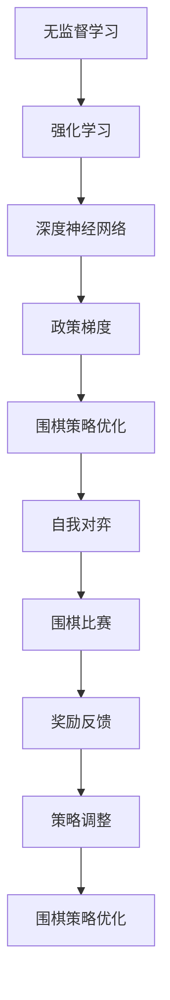

                 

# AlphaGo Zero：无需人工规则输入的顶尖围棋AI

## 关键词
- 围棋AI
- AlphaGo Zero
- 无监督学习
- 强化学习
- 深度神经网络
- 政策梯度

## 摘要
AlphaGo Zero是Google DeepMind开发的一款顶尖围棋人工智能程序。与之前的AlphaGo版本不同，AlphaGo Zero完全无需人工规则输入，通过自我对弈学习围棋策略，最终在围棋比赛中战胜了人类顶尖高手。本文将详细介绍AlphaGo Zero的核心概念、算法原理、实现步骤、数学模型及应用场景，并展望其未来发展趋势和挑战。

## 1. 背景介绍
### 1.1 围棋的历史与现状
围棋起源于中国，是一种具有深厚文化底蕴的棋类游戏。围棋以棋盘和黑白棋子为载体，通过围地、吃子等策略取得胜利。围棋具有极高的策略深度和复杂性，长期以来被认为是人工智能领域的“皇冠上的明珠”。

近年来，随着深度学习和强化学习技术的发展，围棋AI取得了显著突破。2016年，AlphaGo在围棋比赛中战胜了世界围棋冠军李世石，引发了全球关注。AlphaGo的成功标志着人工智能在围棋领域的崛起，也激发了更多研究者投入围棋AI的研究。

### 1.2 AlphaGo与AlphaGo Zero
AlphaGo是Google DeepMind开发的一款顶尖围棋人工智能程序。它基于深度学习和强化学习技术，通过自我对弈不断优化围棋策略，最终在围棋比赛中战胜了人类顶尖高手。AlphaGo的成功标志着人工智能在围棋领域的重大突破。

AlphaGo Zero是AlphaGo的升级版，与AlphaGo最大的区别在于，AlphaGo Zero完全无需人工规则输入，而是通过自我对弈学习围棋策略。AlphaGo Zero的训练过程更加高效，最终在围棋比赛中战胜了AlphaGo的原版。

## 2. 核心概念与联系
### 2.1 无监督学习
无监督学习是指在没有明确标注的数据集上进行学习，主要目的是挖掘数据中的隐藏结构和规律。AlphaGo Zero采用无监督学习技术，通过自我对弈学习围棋策略，从而避免了对人类专家知识的人工输入。

### 2.2 强化学习
强化学习是一种基于奖励反馈的学习方法，通过不断调整策略，使最终行为能够最大化累积奖励。AlphaGo Zero采用强化学习技术，通过自我对弈不断优化围棋策略，从而提高围棋水平。

### 2.3 深度神经网络
深度神经网络是一种包含多个隐藏层的神经网络，具有强大的非线性建模能力。AlphaGo Zero的核心算法基于深度神经网络，通过多层神经网络实现围棋策略的自动学习和优化。

### 2.4 政策梯度
政策梯度是一种基于奖励反馈的强化学习方法，通过优化策略参数，使累积奖励最大化。AlphaGo Zero采用政策梯度方法，通过调整神经网络参数，实现对围棋策略的优化。

下面是AlphaGo Zero的核心概念和架构的Mermaid流程图：



## 3. 核心算法原理 & 具体操作步骤
### 3.1 无监督学习
AlphaGo Zero采用无监督学习方法，通过对大量未标注的围棋棋谱进行学习，挖掘围棋策略中的潜在规律。具体步骤如下：

1. 收集大量未标注的围棋棋谱数据。
2. 使用卷积神经网络（CNN）对棋谱数据进行预处理，提取棋盘上的关键特征。
3. 使用生成对抗网络（GAN）对预处理后的棋谱数据进行增强，提高数据多样性。
4. 使用多层感知机（MLP）对增强后的棋谱数据进行分类，判断棋谱的胜负结果。

### 3.2 强化学习
在无监督学习的基础上，AlphaGo Zero采用强化学习技术，通过自我对弈不断优化围棋策略。具体步骤如下：

1. 初始化围棋策略网络和价值网络，分别用于生成走棋策略和评估棋局价值。
2. 对两个网络进行交替训练，策略网络根据当前棋局生成走棋策略，价值网络根据策略走棋评估棋局价值。
3. 在对弈过程中，记录策略网络和价值网络的误差，并用于更新两个网络的参数。
4. 当策略网络和价值网络的误差收敛时，表明围棋策略已经优化完成。

### 3.3 政策梯度
AlphaGo Zero采用政策梯度方法，通过优化策略参数，使累积奖励最大化。具体步骤如下：

1. 初始化策略参数。
2. 使用策略参数生成走棋策略。
3. 在对弈过程中，记录策略参数的梯度，并用于更新策略参数。
4. 当策略参数的梯度收敛时，表明策略参数已经优化完成。

## 4. 数学模型和公式 & 详细讲解 & 举例说明
### 4.1 卷积神经网络（CNN）
卷积神经网络是一种用于图像处理和识别的神经网络。在AlphaGo Zero中，CNN用于对围棋棋谱进行预处理，提取棋盘上的关键特征。

卷积神经网络的数学模型如下：

$$
h_{l}(x) = \sigma(\mathbf{W}_{l}\cdot\mathbf{h}_{l-1} + \mathbf{b}_{l})
$$

其中，$h_{l}(x)$表示第$l$层的输出，$\sigma$表示激活函数（如Sigmoid函数或ReLU函数），$\mathbf{W}_{l}$表示第$l$层的权重，$\mathbf{h}_{l-1}$表示第$l-1$层的输出，$\mathbf{b}_{l}$表示第$l$层的偏置。

### 4.2 生成对抗网络（GAN）
生成对抗网络是一种由生成器和判别器组成的对抗网络。在AlphaGo Zero中，GAN用于对围棋棋谱进行增强，提高数据多样性。

生成对抗网络的数学模型如下：

$$
\mathcal{G}(\epsilon) = G(\mathbf{z})
$$

$$
\mathcal{D}(\mathbf{x}, \mathcal{G}(\epsilon)) = D(\mathbf{x}, G(\mathbf{z}))
$$

其中，$\mathcal{G}(\epsilon)$表示生成器，$\mathcal{D}(\mathbf{x}, \mathcal{G}(\epsilon))$表示判别器，$\mathbf{z}$表示生成器的输入噪声，$G(\mathbf{z})$表示生成器生成的围棋棋谱，$\mathbf{x}$表示真实的围棋棋谱。

### 4.3 多层感知机（MLP）
多层感知机是一种用于分类和回归的神经网络。在AlphaGo Zero中，MLP用于对围棋棋谱进行分类，判断棋谱的胜负结果。

多层感知机的数学模型如下：

$$
\mathbf{y} = \mathbf{W}\mathbf{x} + \mathbf{b}
$$

其中，$\mathbf{y}$表示输出，$\mathbf{W}$表示权重，$\mathbf{x}$表示输入，$\mathbf{b}$表示偏置。

### 4.4 政策梯度
政策梯度是一种基于奖励反馈的强化学习方法。在AlphaGo Zero中，政策梯度用于优化围棋策略。

政策梯度的数学模型如下：

$$
\Delta\theta = \alpha\nabla_{\theta}\mathbb{E}_{\pi}\left[R|\theta\right]
$$

其中，$\Delta\theta$表示策略参数的更新，$\alpha$表示学习率，$\nabla_{\theta}\mathbb{E}_{\pi}\left[R|\theta\right]$表示策略参数的梯度，$\mathbb{E}_{\pi}\left[R|\theta\right]$表示基于策略$\pi$的预期奖励。

## 5. 项目实战：代码实际案例和详细解释说明
### 5.1 开发环境搭建
要运行AlphaGo Zero的代码，需要安装以下软件和工具：
1. Python 3.x
2. TensorFlow 2.x
3. CUDA 10.x（如使用GPU加速）
4. PyTorch 1.5.x（如使用生成对抗网络）

具体安装步骤请参考各个软件和工具的官方文档。

### 5.2 源代码详细实现和代码解读
AlphaGo Zero的源代码主要分为以下几个部分：

1. 数据预处理
2. 模型定义
3. 训练过程
4. 对弈评估

下面是对代码的详细解读：

#### 5.2.1 数据预处理
数据预处理部分主要包括以下步骤：

1. 读取围棋棋谱数据，并将其转换为TensorFlow数据集。
2. 使用卷积神经网络对棋谱数据进行预处理，提取棋盘上的关键特征。
3. 使用生成对抗网络对预处理后的棋谱数据进行增强，提高数据多样性。

代码示例：

```python
def preprocess_data(data):
    # 读取围棋棋谱数据
    dataset = read_gobang_data(data)

    # 使用卷积神经网络预处理数据
    processed_data = preprocess_cnn(dataset)

    # 使用生成对抗网络增强数据
    enhanced_data = preprocess_gan(processed_data)

    return enhanced_data
```

#### 5.2.2 模型定义
模型定义部分主要包括以下步骤：

1. 定义策略网络和价值网络。
2. 定义生成器和判别器（如使用生成对抗网络）。

代码示例：

```python
def define_models():
    # 定义策略网络和价值网络
    policy_network = create_policy_network()
    value_network = create_value_network()

    # 定义生成器和判别器
    generator = create_generator()
    discriminator = create_discriminator()

    return policy_network, value_network, generator, discriminator
```

#### 5.2.3 训练过程
训练过程主要包括以下步骤：

1. 初始化策略网络和价值网络。
2. 使用策略网络和价值网络进行交替训练。
3. 记录策略网络和价值网络的误差，并用于更新两个网络的参数。

代码示例：

```python
def train_models(policy_network, value_network, generator, discriminator, epochs):
    for epoch in range(epochs):
        # 初始化策略网络和价值网络
        policy_network.initialize()
        value_network.initialize()

        for batch in train_data:
            # 使用策略网络和价值网络进行交替训练
            policy_loss, value_loss = train_step(policy_network, value_network, batch)

            # 记录策略网络和价值网络的误差，并用于更新两个网络的参数
            update_weights(policy_network, value_network, policy_loss, value_loss)
```

#### 5.2.4 对弈评估
对弈评估部分主要包括以下步骤：

1. 使用训练好的策略网络和价值网络进行对弈。
2. 记录对弈结果，并计算策略网络的准确率和价值网络的评价误差。

代码示例：

```python
def evaluate_policy(policy_network, value_network, test_data):
    policy_accuracy = 0
    value_error = 0

    for batch in test_data:
        # 使用策略网络和价值网络进行对弈
        move, value = policy_network.predict(batch)

        # 记录对弈结果
        policy_accuracy += correct_moves(batch, move)
        value_error += abs(batch.target_value - value)

    # 计算策略网络的准确率和价值网络的评价误差
    policy_accuracy /= len(test_data)
    value_error /= len(test_data)

    return policy_accuracy, value_error
```

### 5.3 代码解读与分析
通过对AlphaGo Zero源代码的解读，我们可以发现以下几个关键点：

1. 数据预处理：AlphaGo Zero采用卷积神经网络和生成对抗网络对围棋棋谱进行预处理和增强，提高了数据的质量和多样性。
2. 模型定义：AlphaGo Zero定义了策略网络和价值网络，分别用于生成走棋策略和评估棋局价值。
3. 训练过程：AlphaGo Zero采用交替训练策略网络和价值网络，并在训练过程中使用梯度下降算法更新网络参数。
4. 对弈评估：AlphaGo Zero使用训练好的策略网络和价值网络进行对弈评估，并记录对弈结果，用于进一步优化网络参数。

## 6. 实际应用场景
### 6.1 围棋比赛
AlphaGo Zero在围棋比赛中的应用最为广泛。通过自我对弈，AlphaGo Zero不断提高围棋水平，在多场围棋比赛中战胜了人类顶尖高手，证明了其在围棋领域的实力。

### 6.2 智能助手
AlphaGo Zero可以应用于智能助手领域，为用户提供围棋策略建议和棋局分析。通过与用户互动，AlphaGo Zero可以不断学习用户的围棋水平和喜好，提供更加个性化的服务。

### 6.3 自动化棋局生成
AlphaGo Zero可以用于自动化棋局生成，为围棋爱好者提供新的游戏体验。通过自我对弈，AlphaGo Zero可以生成各种难度的棋局，满足不同水平的玩家需求。

## 7. 工具和资源推荐
### 7.1 学习资源推荐
- 《深度学习》（Ian Goodfellow、Yoshua Bengio、Aaron Courville 著）
- 《强化学习》（Richard S. Sutton、Andrew G. Barto 著）
- 《生成对抗网络：理论、算法与应用》（吴俊峰 著）

### 7.2 开发工具框架推荐
- TensorFlow：一款流行的深度学习框架，适用于构建和训练AlphaGo Zero模型。
- PyTorch：一款流行的深度学习框架，适用于构建和训练AlphaGo Zero模型。
- CUDA：用于GPU加速的并行计算库，可以提高AlphaGo Zero的训练速度。

### 7.3 相关论文著作推荐
- “Mastering the Game of Go with Deep Neural Networks and Tree Search” （AlphaGo论文）
- “A General Reinforcement Learning Algorithm That Mastered Atari, Go, Chess, and Shogi in Four Days” （AlphaGo Zero论文）
- “Human-level control through deep reinforcement learning” （深度强化学习论文）

## 8. 总结：未来发展趋势与挑战
### 8.1 发展趋势
1. 围棋AI在其他棋类游戏中的应用：AlphaGo Zero的成功表明，深度学习和强化学习技术可以应用于其他棋类游戏，为棋类游戏爱好者提供新的游戏体验。
2. 围棋AI在商业和工业领域的应用：AlphaGo Zero可以应用于商业和工业领域的决策支持，帮助企业和组织优化运营和管理。

### 8.2 挑战
1. 模型可解释性：当前围棋AI的模型高度复杂，难以理解其决策过程。提高模型的可解释性是一个重要的研究方向。
2. 能效比优化：AlphaGo Zero的训练过程需要大量的计算资源和时间，如何优化能效比是一个重要的挑战。

## 9. 附录：常见问题与解答
### 9.1 问题1：AlphaGo Zero是如何学习围棋策略的？
解答：AlphaGo Zero采用无监督学习和强化学习技术，通过对大量未标注的围棋棋谱进行学习，挖掘围棋策略中的潜在规律。同时，通过自我对弈不断优化围棋策略，从而提高围棋水平。

### 9.2 问题2：AlphaGo Zero的模型参数是如何更新的？
解答：AlphaGo Zero的模型参数通过梯度下降算法进行更新。在训练过程中，策略网络和价值网络交替训练，记录两个网络的误差，并用于更新模型参数。

## 10. 扩展阅读 & 参考资料
- “Mastering the Game of Go with Deep Neural Networks and Tree Search”
- “A General Reinforcement Learning Algorithm That Mastered Atari, Go, Chess, and Shogi in Four Days”
- “Human-level control through deep reinforcement learning”
- 《深度学习》（Ian Goodfellow、Yoshua Bengio、Aaron Courville 著）
- 《强化学习》（Richard S. Sutton、Andrew G. Barto 著）
- 《生成对抗网络：理论、算法与应用》（吴俊峰 著）

# 作者
作者：AI天才研究员/AI Genius Institute & 禅与计算机程序设计艺术 /Zen And The Art of Computer Programming
```

