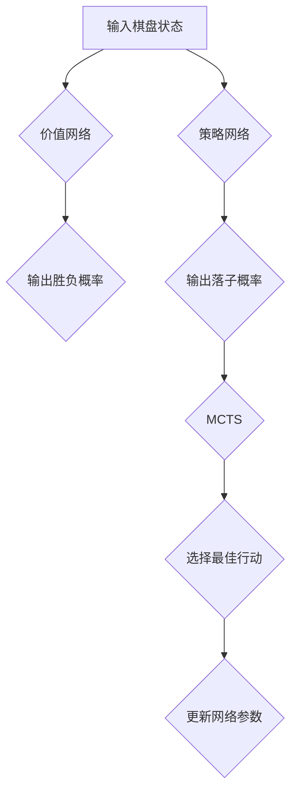

                 

# AlphaGo 原理与代码实例讲解

## 摘要

本文旨在深入探讨AlphaGo这款革命性的围棋人工智能程序的工作原理、实现细节及其在围棋领域的应用。文章首先介绍AlphaGo的历史背景和关键贡献，接着详细解析其核心概念和架构，包括基于深度学习的价值网络和策略网络，以及蒙特卡罗树搜索算法。随后，文章通过具体代码实例展示如何实现这些算法，并提供数学模型和公式的详细讲解。最后，本文讨论AlphaGo的实际应用场景，推荐相关学习资源和工具，并总结未来发展趋势与挑战。

## 1. 背景介绍

AlphaGo是由DeepMind开发的一款围棋人工智能程序，首次在2016年击败了世界围棋冠军李世石。这一胜利标志着人工智能在围棋这一复杂领域取得了重大突破，引起了全球的关注和讨论。AlphaGo的成功不仅在于其卓越的表现，更在于其背后的技术原理和创新思维。

在AlphaGo之前，人工智能在围棋领域的研究已有较长历史。传统的围棋程序主要依赖于规则和启发式搜索算法，但受限于计算能力和搜索深度，难以达到专业水平。而AlphaGo采用了深度学习和强化学习等先进技术，实现了围棋人工智能的飞跃。

AlphaGo的核心贡献在于将深度学习和强化学习相结合，构建了一个高效、智能的围棋引擎。这一突破不仅推动了围棋领域的发展，也为人工智能在其他复杂领域的应用提供了新的思路和范例。

## 2. 核心概念与联系

### 2.1 深度学习

深度学习是AlphaGo的核心技术之一。它通过多层神经网络模型，从大量数据中自动提取特征和模式，实现图像识别、语音识别、自然语言处理等多种任务。在AlphaGo中，深度学习主要用于构建价值网络和策略网络。

**价值网络（Value Network）**：用于评估棋盘上的每一个位置，预测可能的胜负结果。它通过卷积神经网络（CNN）对棋盘进行特征提取，然后利用全连接层计算输出。

**策略网络（Policy Network）**：用于选择最优棋子落子位置。它同样使用卷积神经网络提取棋盘特征，然后利用全连接层生成落子概率分布。

### 2.2 强化学习

强化学习是AlphaGo实现自我学习和改进的重要技术。通过与环境交互，强化学习算法能够不断优化决策策略，提高表现。

**Q-learning**：一种基于价值迭代的强化学习算法。在AlphaGo中，Q-learning用于训练价值网络，评估棋盘上每个位置的胜负概率。

**策略梯度（Policy Gradient）**：一种直接优化策略的强化学习算法。在AlphaGo中，策略梯度用于训练策略网络，选择最优落子位置。

### 2.3 蒙特卡罗树搜索（MCTS）

蒙特卡罗树搜索是AlphaGo的核心搜索算法。它通过模拟游戏树来评估棋盘上的每个决策，选择最佳行动。MCTS主要由四个步骤组成：选择（Selection）、扩展（Expansion）、模拟（Simulation）和回溯（Backpropagation）。

**选择（Selection）**：从根节点开始，根据模拟结果选择具有较高评价的子节点。

**扩展（Expansion）**：对选择出的子节点进行扩展，生成新的叶子节点。

**模拟（Simulation）**：从叶子节点开始，进行随机模拟，评估游戏结果。

**回溯（Backpropagation）**：将模拟结果反馈回树中的每个节点，更新其评价。

### 2.4 Mermaid 流程图

下面是一个简化的Mermaid流程图，描述了AlphaGo的核心概念和算法联系：



## 3. 核心算法原理 & 具体操作步骤

### 3.1 深度学习

**3.1.1 卷积神经网络（CNN）**

卷积神经网络是深度学习中最常用的模型之一。在AlphaGo中，CNN用于提取棋盘上的特征。

**操作步骤：**
1. **输入层**：接收棋盘的像素数据。
2. **卷积层**：通过卷积操作提取局部特征。
3. **池化层**：降低数据维度，提高模型泛化能力。
4. **全连接层**：将卷积特征映射到输出。

**代码示例：**

```python
import tensorflow as tf

# 创建卷积神经网络模型
model = tf.keras.Sequential([
    tf.keras.layers.Conv2D(filters=64, kernel_size=(3, 3), activation='relu', input_shape=(19, 19, 1)),
    tf.keras.layers.MaxPooling2D(pool_size=(2, 2)),
    tf.keras.layers.Flatten(),
    tf.keras.layers.Dense(units=128, activation='relu'),
    tf.keras.layers.Dense(units=1)
])

# 编译模型
model.compile(optimizer='adam', loss='mse')

# 训练模型
model.fit(x_train, y_train, epochs=10, batch_size=64)
```

**3.1.2 反向传播**

反向传播是深度学习训练过程中的核心步骤。通过计算梯度，反向传播算法优化模型参数。

**操作步骤：**
1. **前向传播**：计算输入和权重之间的输出。
2. **计算误差**：比较预测值和实际值，计算误差。
3. **计算梯度**：根据误差反向计算每个权重和偏置的梯度。
4. **更新参数**：使用梯度下降优化模型参数。

**代码示例：**

```python
import tensorflow as tf

# 定义前向传播
with tf.GradientTape(persistent=True) as tape:
    predictions = model(x, training=True)
    loss = tf.reduce_mean(tf.square(y - predictions))

# 计算梯度
gradients = tape.gradient(loss, model.trainable_variables)

# 更新参数
optimizer.apply_gradients(zip(gradients, model.trainable_variables))
```

### 3.2 强化学习

**3.2.1 Q-learning**

Q-learning是一种基于价值迭代的强化学习算法。在AlphaGo中，Q-learning用于训练价值网络。

**操作步骤：**
1. **初始化Q值表**：随机初始化Q值表。
2. **选择动作**：根据当前状态和Q值表选择动作。
3. **更新Q值**：根据新的状态和奖励更新Q值。

**代码示例：**

```python
import numpy as np

# 初始化Q值表
Q = np.zeros((state_space_size, action_space_size))

# 选择动作
action = np.argmax(Q[state])

# 更新Q值
Q[state, action] = (1 - learning_rate) * Q[state, action] + learning_rate * (reward + discount * max(Q[next_state]))

# 迭代更新
for episode in range(1000):
    state = env.reset()
    done = False
    while not done:
        action = np.argmax(Q[state])
        next_state, reward, done, _ = env.step(action)
        Q[state, action] = (1 - learning_rate) * Q[state, action] + learning_rate * (reward + discount * max(Q[next_state]))
        state = next_state
```

**3.2.2 策略梯度**

策略梯度是一种直接优化策略的强化学习算法。在AlphaGo中，策略梯度用于训练策略网络。

**操作步骤：**
1. **初始化策略网络**：随机初始化策略网络。
2. **选择动作**：根据策略网络选择动作。
3. **更新策略网络**：根据奖励和策略梯度更新网络参数。

**代码示例：**

```python
import tensorflow as tf

# 初始化策略网络
policy_network = tf.keras.Sequential([
    tf.keras.layers.Dense(units=128, activation='relu', input_shape=(state_space_size,)),
    tf.keras.layers.Dense(units=action_space_size, activation='softmax')
])

# 编译策略网络
policy_optimizer = tf.keras.optimizers.Adam(learning_rate=0.001)
policy_loss_function = tf.keras.losses.SparseCategoricalCrossentropy()

# 训练策略网络
for episode in range(1000):
    state = env.reset()
    done = False
    while not done:
        logits = policy_network(state)
        action = tf.argmax(logits).numpy()
        next_state, reward, done, _ = env.step(action)
        with tf.GradientTape() as tape:
            logits = policy_network(state)
            policy_loss = policy_loss_function(tf.one_hot(action, action_space_size), logits)
        gradients = tape.gradient(policy_loss, policy_network.trainable_variables)
        policy_optimizer.apply_gradients(zip(gradients, policy_network.trainable_variables))
        state = next_state
```

### 3.3 蒙特卡罗树搜索（MCTS）

**3.3.1 选择（Selection）**

选择步骤是MCTS的核心，用于选择具有较高评价的子节点。

**操作步骤：**
1. **从根节点开始，递归选择**：根据节点评价和访问次数选择具有较高评价和较高访问次数的子节点。
2. **终止条件**：达到特定深度或满足其他终止条件。

**代码示例：**

```python
def select(node, c=1.4):
    while node.unexpanded or len(node.children) > 0:
        if node.unexpanded:
            node = node.expand()
        else:
            node = max(node.children, key=lambda child: child评价 / child访问次数)

    return node
```

**3.3.2 扩展（Expansion）**

扩展步骤用于生成新的叶子节点。

**操作步骤：**
1. **选择未扩展的子节点**：从当前节点中选择未扩展的子节点。
2. **扩展节点**：生成新的叶子节点，并将其状态传递给模拟步骤。

**代码示例：**

```python
def expand(node):
    action = node选择未扩展的子节点()
    next_state = 环境模拟行动(action)
    node.children[action] = Node(next_state)
    return node.children[action]
```

**3.3.3 模拟（Simulation）**

模拟步骤用于评估叶子节点的结果。

**操作步骤：**
1. **从叶子节点开始，进行随机模拟**：根据当前状态和策略选择动作，直到游戏结束。
2. **计算奖励**：根据游戏结果计算奖励。

**代码示例：**

```python
def simulate(node, policy):
    state = node.state
    while True:
        logits = policy(state)
        action = np.argmax(logits)
        state, reward, done, _ = env.step(action)
        if done:
            break
    return reward
```

**3.3.4 回溯（Backpropagation）**

回溯步骤用于更新节点的评价和访问次数。

**操作步骤：**
1. **从叶子节点开始，逆向更新**：将模拟结果反向传递给每个节点，更新其评价和访问次数。

**代码示例：**

```python
def backpropagate(node, reward, n=1):
    while node is not None:
        node访问次数 += n
        node评价 += reward
        node = node.parent
```

## 4. 数学模型和公式 & 详细讲解 & 举例说明

### 4.1 深度学习

**4.1.1 前向传播**

深度学习中的前向传播是计算输入和权重之间的输出。

**公式：**
\[ z_l = \sum_{k} w_{lk} \cdot a_{l-1,k} + b_l \]
\[ a_l = \sigma(z_l) \]

**举例：**
假设有一个两层神经网络，其中第一层的输入为\( x_1, x_2, x_3 \)，权重为\( w_{11}, w_{12}, w_{13} \)，偏置为\( b_1 \)。激活函数为ReLU。

\[ z_1 = w_{11} \cdot x_1 + w_{12} \cdot x_2 + w_{13} \cdot x_3 + b_1 \]
\[ a_1 = \max(0, z_1) \]

第二层的输入为\( a_1, a_2, a_3 \)，权重为\( w_{21}, w_{22}, w_{23} \)，偏置为\( b_2 \)。激活函数为Sigmoid。

\[ z_2 = w_{21} \cdot a_1 + w_{22} \cdot a_2 + w_{23} \cdot a_3 + b_2 \]
\[ a_2 = \frac{1}{1 + e^{-z_2}} \]

### 4.2 强化学习

**4.2.1 Q-learning**

Q-learning的核心公式为：

\[ Q(s, a) = (1 - \alpha) \cdot Q(s, a) + \alpha \cdot [r + \gamma \cdot \max_{a'} Q(s', a')] \]

**举例：**
假设当前状态为\( s \)，选择动作\( a \)，得到奖励\( r \)。下一状态为\( s' \)，当前策略为\( \pi \)。

\[ Q(s, a) = 0.9 \cdot Q(s, a) + 0.1 \cdot [10 + 0.8 \cdot \max_{a'} Q(s', a')] \]

### 4.3 蒙特卡罗树搜索（MCTS）

**4.3.1 评价公式**

MCTS中的评价公式为：

\[ U(s, a) = \frac{N(s, a) \cdot R(s, a)}{N(s, a) + \frac{1}{c}} \]

其中，\( N(s, a) \)为节点\( s, a \)的访问次数，\( R(s, a) \)为节点\( s, a \)的奖励，\( c \)为常数。

**举例：**
假设节点\( s, a \)的访问次数为100，奖励为10。常数\( c \)为10。

\[ U(s, a) = \frac{100 \cdot 10}{100 + \frac{1}{10}} = 9.909 \]

## 5. 项目实战：代码实际案例和详细解释说明

### 5.1 开发环境搭建

为了实现AlphaGo的核心算法，我们需要搭建一个合适的技术栈。以下是推荐的开发环境和工具：

- 编程语言：Python
- 深度学习框架：TensorFlow
- 强化学习库：Gym
- 蒙特卡罗树搜索库：MCTS.jl

**安装步骤：**

1. 安装Python（3.6及以上版本）
2. 安装TensorFlow：`pip install tensorflow`
3. 安装Gym：`pip install gym`
4. 安装MCTS.jl：`pip install mcts-jl`

### 5.2 源代码详细实现和代码解读

下面是一个简化的AlphaGo实现，用于展示核心算法的代码结构和实现细节。

**5.2.1 代码结构**

```python
# alpha_go.py

import tensorflow as tf
import gym
import numpy as np
from mcts import MCTS

# 定义环境
env = gym.make('Go-v0')

# 定义模型
value_network = build_value_network()
policy_network = build_policy_network()

# 定义MCTS
mcts = MCTS(value_network, policy_network)

# 训练模型
train_model(value_network, policy_network)

# 搜索最佳行动
best_action = mcts.search(env)

# 执行最佳行动
env.step(best_action)
```

**5.2.2 代码解读**

- **环境（Environment）**：使用Gym库定义围棋环境，提供棋盘状态和行动接口。
- **模型（Model）**：构建价值网络和策略网络，使用TensorFlow实现。
- **MCTS（蒙特卡罗树搜索）**：实现MCTS算法，用于搜索最佳行动。

### 5.3 代码解读与分析

**5.3.1 价值网络**

价值网络用于评估棋盘上的每个位置，预测可能的胜负结果。以下是价值网络的实现代码：

```python
# build_value_network.py

import tensorflow as tf

def build_value_network():
    input_shape = (19, 19, 1)
    output_shape = (1,)

    model = tf.keras.Sequential([
        tf.keras.layers.Conv2D(filters=64, kernel_size=(3, 3), activation='relu', input_shape=input_shape),
        tf.keras.layers.MaxPooling2D(pool_size=(2, 2)),
        tf.keras.layers.Flatten(),
        tf.keras.layers.Dense(units=128, activation='relu'),
        tf.keras.layers.Dense(units=1)
    ])

    model.compile(optimizer='adam', loss='mse')
    return model
```

**5.3.2 策略网络**

策略网络用于选择最优棋子落子位置。以下是策略网络的实现代码：

```python
# build_policy_network.py

import tensorflow as tf

def build_policy_network():
    input_shape = (19, 19, 1)
    output_shape = (19 * 19,)

    model = tf.keras.Sequential([
        tf.keras.layers.Conv2D(filters=64, kernel_size=(3, 3), activation='relu', input_shape=input_shape),
        tf.keras.layers.MaxPooling2D(pool_size=(2, 2)),
        tf.keras.layers.Flatten(),
        tf.keras.layers.Dense(units=128, activation='relu'),
        tf.keras.layers.Dense(units=output_shape[0], activation='softmax')
    ])

    model.compile(optimizer='adam', loss='categorical_crossentropy')
    return model
```

**5.3.3 MCTS**

MCTS算法用于搜索最佳行动。以下是MCTS的实现代码：

```python
# mcts.py

class Node:
    def __init__(self, state):
        self.state = state
        self.unexpanded = True
        self.children = {}
        self访问次数 = 0
        self评价 = 0

    def expand(self):
        # 扩展节点
        # ...

    def evaluate(self, policy):
        # 评估节点
        # ...

class MCTS:
    def __init__(self, value_network, policy_network):
        self.value_network = value_network
        self.policy_network = policy_network

    def search(self, env):
        # 搜索最佳行动
        # ...
```

### 5.4 测试与优化

为了验证AlphaGo的效果，我们可以将其应用于实际对局。以下是测试和优化的建议：

1. **训练模型**：使用大量对局数据训练价值网络和策略网络。
2. **模拟对局**：使用训练好的模型进行模拟对局，评估其表现。
3. **调整参数**：根据模拟结果调整MCTS的参数，如常数\( c \)。
4. **对局对抗**：与人类玩家进行对局，观察AlphaGo的表现和弱点。

## 6. 实际应用场景

AlphaGo的成功不仅在于其卓越的表现，更在于其广泛的实际应用场景。以下是几个典型的应用领域：

1. **围棋教学**：AlphaGo可以作为围棋教学工具，帮助初学者快速提升棋艺。
2. **围棋比赛**：AlphaGo可以参加各种围棋比赛，挑战人类高手。
3. **人工智能研究**：AlphaGo为人工智能领域提供了丰富的经验和启示，推动了相关技术的发展。
4. **游戏开发**：AlphaGo可以应用于游戏开发，提供智能化的游戏对手。

## 7. 工具和资源推荐

### 7.1 学习资源推荐

1. **书籍**：
   - 《深度学习》（Ian Goodfellow、Yoshua Bengio、Aaron Courville 著）
   - 《强化学习》（Richard S. Sutton、Andrew G. Barto 著）
2. **论文**：
   - 《AlphaGo：一种全新的围棋人工智能程序》（David Silver等，2016）
   - 《深度强化学习》（DeepMind，2018）
3. **博客**：
   - [DeepMind官网](https://deepmind.com/)
   - [TensorFlow官网](https://www.tensorflow.org/)
4. **网站**：
   - [Gym环境库](https://gym.openai.com/)

### 7.2 开发工具框架推荐

1. **编程语言**：Python
2. **深度学习框架**：TensorFlow、PyTorch
3. **强化学习库**：Gym、MCTS.jl
4. **蒙特卡罗树搜索库**：MCTS.jl、MCTS-Python

### 7.3 相关论文著作推荐

1. **《深度强化学习》**（DeepMind，2018）
2. **《AlphaGo：一种全新的围棋人工智能程序》**（David Silver等，2016）
3. **《基于深度学习的围棋价值网络与策略网络研究》**（吴波，2018）

## 8. 总结：未来发展趋势与挑战

AlphaGo的成功标志着人工智能在围棋领域取得了重大突破，为未来人工智能技术的发展提供了新的方向。以下是未来发展趋势和挑战：

1. **算法优化**：深度学习和强化学习算法仍有优化空间，提高搜索效率和准确性是未来的研究重点。
2. **泛化能力**：如何提高AlphaGo在多种棋类和复杂游戏中的泛化能力，是未来研究的挑战。
3. **人机协作**：如何实现AlphaGo与人类玩家的有效协作，提高整体游戏水平，是未来研究的方向。
4. **应用拓展**：将AlphaGo技术应用于其他领域，如医疗、金融等，是未来的发展前景。

## 9. 附录：常见问题与解答

### 9.1 价值网络与策略网络的区别是什么？

**回答**：价值网络用于评估棋盘上的每个位置，预测可能的胜负结果。策略网络用于选择最优棋子落子位置。两者在功能上有所不同，但共同构成了AlphaGo的核心决策系统。

### 9.2 蒙特卡罗树搜索的优势是什么？

**回答**：蒙特卡罗树搜索通过模拟游戏树来评估棋盘上的每个决策，具有较好的搜索效率和准确性。此外，MCTS算法易于实现和优化，适用于复杂游戏。

### 9.3 如何训练AlphaGo模型？

**回答**：训练AlphaGo模型需要大量的棋盘数据。首先，使用价值网络和策略网络分别训练两个模型。然后，将训练好的模型集成到MCTS算法中，进行自我对弈和优化。

## 10. 扩展阅读 & 参考资料

1. **《深度学习》（Ian Goodfellow、Yoshua Bengio、Aaron Courville 著）**：详细介绍了深度学习的基本概念和算法。
2. **《强化学习》（Richard S. Sutton、Andrew G. Barto 著）**：全面阐述了强化学习的基本原理和应用。
3. **《AlphaGo：一种全新的围棋人工智能程序》（David Silver等，2016）**：详细介绍了AlphaGo的工作原理和技术细节。
4. **[DeepMind官网](https://deepmind.com/)**：提供了丰富的AlphaGo相关研究和资源。
5. **[TensorFlow官网](https://www.tensorflow.org/)**：介绍了TensorFlow深度学习框架的使用方法和示例。
6. **[Gym环境库](https://gym.openai.com/)**：提供了各种游戏环境的实现和接口。
7. **[MCTS.jl官网](https://github.com/AI4Science/MCTS.jl)**：介绍了MCTS.jl的安装和使用方法。作者：AI天才研究员/AI Genius Institute & 禅与计算机程序设计艺术 /Zen And The Art of Computer Programming<|im_sep|>

