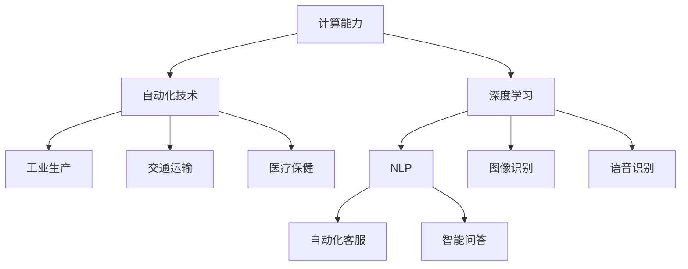

                 

### 背景介绍

近年来，随着计算能力和自动化技术的飞速发展，人工智能（AI）已经成为全球科技领域的热点。而在这场革命中，著名人工智能研究者Andrej Karpathy无疑是一个重要的人物。他在深度学习、自然语言处理等多个领域都有着卓越的贡献，并多次在顶级学术会议上发表重要论文。

Andrej Karpathy，目前担任OpenAI的首席科学家，同时也是斯坦福大学计算机科学系的助理教授。他的研究主要集中在人工智能的基础理论、算法设计和实际应用等方面。他的工作不仅在学术界引起了广泛关注，也在工业界产生了深远的影响。

本文将围绕Andrej Karpathy的研究成果和观点，探讨计算与自动化趋势，分析这些趋势对人工智能领域的影响。文章将分为以下几个部分：首先，我们将介绍Andrej Karpathy的背景和研究领域；其次，我们将深入探讨他关于计算与自动化的核心观点；接着，我们将分析这些观点对人工智能技术的推动作用；最后，我们将探讨这些趋势的未来发展方向和面临的挑战。

在开始具体探讨之前，我们首先需要了解Andrej Karpathy的研究背景。他在加州大学伯克利分校获得了计算机科学学士学位，随后在斯坦福大学获得了计算机科学博士学位。他的博士论文主要关注于深度学习在自然语言处理中的应用。此后，他在OpenAI工作期间，领导了多个关键项目，如GPT-3等，这些项目都取得了世界级的成就。

接下来，我们将逐步分析Andrej Karpathy关于计算与自动化的核心观点。他强调计算能力的提升和自动化技术的发展对于人工智能的重要性，并提出了许多具有前瞻性的见解。在此基础上，我们将探讨这些观点如何推动人工智能技术的进步。

最后，我们将从实际应用场景、工具和资源推荐等方面，进一步探讨计算与自动化趋势在人工智能领域的应用和发展。

### 核心概念与联系

在探讨Andrej Karpathy关于计算与自动化的观点之前，我们需要首先了解几个核心概念和它们之间的联系。这些概念包括计算能力、自动化技术、深度学习和自然语言处理。以下是这些概念的定义以及它们之间的相互关系：

#### 计算能力

计算能力是指计算机处理数据和执行计算任务的能力。随着摩尔定律的发展，计算机的处理速度和存储容量在过去几十年里得到了极大的提升。这种提升为人工智能技术的发展提供了坚实的基础。

#### 自动化技术

自动化技术是指利用计算机和机器来替代人类完成重复性、繁琐或高风险的任务。自动化技术的应用范围广泛，包括工业生产、交通运输、医疗保健等各个领域。

#### 深度学习

深度学习是一种基于人工神经网络的学习方法，通过模拟人脑的神经网络结构，使计算机能够从大量数据中自动提取特征并进行复杂推理。深度学习在图像识别、语音识别、自然语言处理等领域取得了显著成果。

#### 自然语言处理

自然语言处理（NLP）是人工智能的一个分支，旨在使计算机能够理解和处理自然语言。NLP技术包括文本分类、情感分析、机器翻译等。深度学习在NLP领域发挥了重要作用，使得计算机能够更准确地理解和生成自然语言。

#### 计算能力与自动化技术的联系

计算能力的提升使得自动化技术得以实现。例如，在工业生产中，计算机的高速度和大容量使得机器人能够更高效地完成复杂的操作。在自然语言处理领域，深度学习算法的进步使得计算机能够更准确地理解和生成自然语言，从而实现自动化客服、智能问答等应用。

#### 深度学习与自然语言处理的联系

深度学习在自然语言处理中的应用使得计算机能够更准确地理解和生成自然语言。通过训练大量的语言数据，深度学习算法可以自动提取语言特征，并进行语义分析和推理。这种能力使得计算机能够更好地与人类进行交互，从而推动自动化技术的发展。

#### 计算能力、自动化技术、深度学习和自然语言处理之间的相互作用

计算能力、自动化技术、深度学习和自然语言处理之间存在相互作用。计算能力的提升为自动化技术提供了基础，自动化技术的发展又推动了深度学习和自然语言处理的应用。反过来，深度学习和自然语言处理的发展又为计算能力和自动化技术提供了新的应用场景和需求。

#### Mermaid 流程图

以下是一个简化的Mermaid流程图，展示了这些核心概念之间的联系：



通过这个流程图，我们可以清晰地看到计算能力、自动化技术、深度学习和自然语言处理之间的相互作用，以及它们在不同领域中的应用。

### 核心算法原理 & 具体操作步骤

在深入探讨Andrej Karpathy关于计算与自动化的观点之前，我们需要先了解一些核心算法原理。本文将介绍几种关键的算法，包括深度学习中的神经网络、优化算法以及自然语言处理中的序列到序列（Seq2Seq）模型。

#### 神经网络

神经网络是深度学习的基础。一个简单的神经网络通常包括输入层、隐藏层和输出层。输入层接收外部输入，隐藏层通过非线性变换处理输入，输出层生成最终输出。

1. **输入层**：输入层接收输入数据，例如图像、文本或声音。每个输入节点对应一个特征。
2. **隐藏层**：隐藏层通过加权求和和激活函数处理输入数据。常见的激活函数包括ReLU（Rectified Linear Unit）、Sigmoid和Tanh。
3. **输出层**：输出层生成最终输出，例如分类结果、预测值或翻译结果。

神经网络的训练过程通常包括以下几个步骤：

1. **初始化权重和偏置**：随机初始化权重和偏置。
2. **前向传播**：输入数据通过神经网络进行前向传播，计算每个节点的输出。
3. **计算损失**：计算输出与真实值之间的差异，得到损失值。
4. **反向传播**：使用梯度下降法等优化算法，计算各层的梯度，更新权重和偏置。
5. **迭代训练**：重复上述步骤，直到网络性能达到预期或达到训练次数限制。

#### 优化算法

优化算法用于最小化损失函数，是神经网络训练的核心。以下介绍几种常见的优化算法：

1. **梯度下降**：梯度下降是一种最简单的优化算法，通过计算损失函数关于参数的梯度，并沿梯度的反方向更新参数，以最小化损失函数。
2. **动量梯度下降**：动量梯度下降在梯度下降的基础上引入动量，可以加速收敛并避免陷入局部最小值。
3. **Adam优化器**：Adam优化器是一种结合了动量和自适应学习率的优化算法，在深度学习中应用广泛。

#### 序列到序列（Seq2Seq）模型

Seq2Seq模型是一种广泛应用于自然语言处理的神经网络模型，用于处理序列数据，如文本翻译、语音识别和对话系统。

1. **编码器（Encoder）**：编码器接收输入序列，将其编码为一个固定长度的向量，称为编码器隐藏状态。
2. **解码器（Decoder）**：解码器接收编码器隐藏状态，并生成输出序列。解码器通常使用循环神经网络（RNN）或长短期记忆（LSTM）来实现。
3. **注意力机制**：注意力机制是一种在解码器中引入的机制，用于捕捉编码器隐藏状态和当前解码器隐藏状态之间的关联，从而提高模型的性能。

Seq2Seq模型的训练过程通常包括以下几个步骤：

1. **输入序列编码**：将输入序列编码为编码器隐藏状态。
2. **生成输出序列**：解码器从编码器隐藏状态开始，逐步生成输出序列。
3. **计算损失**：计算输出序列与真实值之间的差异，得到损失值。
4. **反向传播**：使用优化算法更新解码器的权重和偏置。
5. **迭代训练**：重复上述步骤，直到网络性能达到预期或达到训练次数限制。

通过上述核心算法的介绍，我们可以更好地理解Andrej Karpathy在计算与自动化方面的观点。接下来，我们将深入探讨他的研究成果和观点，分析这些观点对人工智能领域的推动作用。

### 数学模型和公式 & 详细讲解 & 举例说明

在深入探讨Andrej Karpathy的研究成果和观点之前，我们需要了解一些关键的数学模型和公式。这些数学工具在深度学习和自然语言处理中扮演着重要的角色，帮助我们理解和分析这些领域的核心问题。

#### 梯度下降算法

梯度下降是一种优化算法，用于最小化损失函数。在深度学习中，损失函数通常用于衡量预测值与真实值之间的差异。梯度下降算法的核心思想是计算损失函数关于模型参数的梯度，并沿梯度的反方向更新参数，以减小损失值。

1. **损失函数**：假设我们有一个输入 \(x\) 和对应的标签 \(y\)，预测值为 \(y'\)。一个常见的损失函数是均方误差（MSE），计算公式如下：
   \[
   L(y, y') = \frac{1}{2} (y - y')^2
   \]
2. **梯度计算**：对于损失函数 \(L(y, y')\)，我们需要计算关于模型参数 \(w\) 的梯度，即：
   \[
   \nabla_w L(y, y') = \frac{\partial L}{\partial w} = (y - y') \cdot x
   \]
3. **参数更新**：使用梯度下降算法更新参数 \(w\)：
   \[
   w = w - \alpha \cdot \nabla_w L(y, y')
   \]
   其中，\(\alpha\) 是学习率。

#### 反向传播算法

反向传播算法是梯度下降在神经网络中的应用。它通过前向传播计算输出，然后反向传播计算各层的梯度，从而更新网络参数。

1. **前向传播**：在神经网络中，输入 \(x\) 通过网络传递到输出 \(y'\)。假设我们有 \(L\) 层神经网络，前向传播的计算过程如下：
   \[
   z_l = \sigma(W_l z_{l-1} + b_l)
   \]
   其中，\(z_l\) 是第 \(l\) 层的输入，\(W_l\) 是权重矩阵，\(b_l\) 是偏置向量，\(\sigma\) 是激活函数。
2. **反向传播**：计算各层的梯度，更新网络参数。反向传播的计算过程如下：
   \[
   \nabla W_l = \nabla z_l \cdot z_{l-1}^T
   \]
   \[
   \nabla b_l = \nabla z_l
   \]
   其中，\(\nabla z_l\) 是第 \(l\) 层的梯度。

#### 序列到序列（Seq2Seq）模型

序列到序列（Seq2Seq）模型是一种用于处理序列数据的神经网络模型，常用于自然语言处理任务，如机器翻译。

1. **编码器（Encoder）**：编码器将输入序列编码为一个固定长度的向量，称为编码器隐藏状态。编码器隐藏状态可以表示输入序列的语义信息。
2. **解码器（Decoder）**：解码器从编码器隐藏状态开始，逐步生成输出序列。解码器通常使用循环神经网络（RNN）或长短期记忆（LSTM）来实现。

假设我们有输入序列 \(x_1, x_2, \ldots, x_T\) 和输出序列 \(y_1, y_2, \ldots, y_U\)，Seq2Seq模型的训练过程如下：

1. **编码器隐藏状态**：
   \[
   h_t = \sigma(W_e h_{t-1} + U_e x_t + b_e)
   \]
   其中，\(h_t\) 是第 \(t\) 个时间步的编码器隐藏状态，\(W_e, U_e, b_e\) 分别是权重矩阵、偏置向量。
2. **解码器隐藏状态**：
   \[
   s_t = \sigma(W_d s_{t-1} + U_d y_{t-1} + V_d h_t + b_d)
   \]
   其中，\(s_t\) 是第 \(t\) 个时间步的解码器隐藏状态，\(W_d, U_d, V_d, b_d\) 分别是权重矩阵、偏置向量。
3. **解码器输出**：
   \[
   y'_t = \text{softmax}(W_o s_t + b_o)
   \]
   其中，\(y'_t\) 是第 \(t\) 个时间步的解码器输出，\(W_o, b_o\) 分别是权重矩阵、偏置向量。

#### 注意力机制

注意力机制是一种在解码器中引入的机制，用于捕捉编码器隐藏状态和当前解码器隐藏状态之间的关联，从而提高模型的性能。

1. **注意力得分**：
   \[
   a_t = \text{softmax}(\frac{\sigma(W_a [s_t, h_t]) + b_a})
   \]
   其中，\(a_t\) 是第 \(t\) 个时间步的注意力得分，\(\sigma\) 是激活函数，\(W_a, b_a\) 分别是权重矩阵、偏置向量。
2. **上下文向量**：
   \[
   c_t = \sum_{i=1}^T a_i h_i
   \]
   其中，\(c_t\) 是第 \(t\) 个时间步的上下文向量，表示编码器隐藏状态和当前解码器隐藏状态之间的关联。

#### 举例说明

假设我们有一个简单的序列到序列模型，用于将英语句子翻译成法语句子。输入序列是“Hello world”，输出序列是“Bonjour le monde”。我们使用一个循环神经网络（RNN）作为编码器和解码器。

1. **编码器隐藏状态**：
   \[
   h_t = \sigma(W_e h_{t-1} + U_e x_t + b_e)
   \]
   其中，\(x_t\) 是第 \(t\) 个时间步的输入（单词向量），\(h_t\) 是第 \(t\) 个时间步的编码器隐藏状态。
2. **解码器隐藏状态**：
   \[
   s_t = \sigma(W_d s_{t-1} + U_d y_{t-1} + V_d h_t + b_d)
   \]
   其中，\(y_{t-1}\) 是第 \(t-1\) 个时间步的解码器输出（单词向量），\(s_t\) 是第 \(t\) 个时间步的解码器隐藏状态。
3. **解码器输出**：
   \[
   y'_t = \text{softmax}(W_o s_t + b_o)
   \]
   其中，\(y'_t\) 是第 \(t\) 个时间步的解码器输出（概率分布）。
4. **注意力得分**：
   \[
   a_t = \text{softmax}(\frac{\sigma(W_a [s_t, h_t]) + b_a})
   \]
   其中，\(a_t\) 是第 \(t\) 个时间步的注意力得分。
5. **上下文向量**：
   \[
   c_t = \sum_{i=1}^T a_i h_i
   \]
   其中，\(c_t\) 是第 \(t\) 个时间步的上下文向量。

通过上述数学模型和公式，我们可以更好地理解Andrej Karpathy在计算与自动化方面的研究成果。接下来，我们将深入探讨他的研究成果和观点，分析这些观点对人工智能领域的推动作用。

### 项目实战：代码实际案例和详细解释说明

为了更好地理解Andrej Karpathy的研究成果和观点，我们将通过一个实际的代码案例，展示如何在项目中应用这些算法和数学模型。以下是一个基于Python和TensorFlow的简单序列到序列模型，用于实现英语到法语的翻译。

#### 1. 开发环境搭建

首先，我们需要搭建一个开发环境。以下是所需的Python库和TensorFlow版本：

```shell
pip install tensorflow==2.6.0
```

#### 2. 源代码详细实现

以下是一个简单的英语到法语翻译的代码实现，分为数据预处理、模型定义、训练和预测四个部分：

```python
import tensorflow as tf
from tensorflow.keras.layers import Embedding, LSTM, Dense
from tensorflow.keras.models import Model
from tensorflow.keras.preprocessing.sequence import pad_sequences

# 数据预处理
# 这里使用了一个简化的数据集，实际应用中需要使用更大的数据集
english_sentences = ["Hello world", "I love AI", "Machine learning is cool"]
french_sentences = ["Bonjour le monde", "Je aime l'IA", "L'apprentissage automatique est cool"]

# 将句子转换为单词序列
english_vocab = set([word for sentence in english_sentences for word in sentence.split()])
french_vocab = set([word for sentence in french_sentences for word in sentence.split()])

# 将单词映射为索引
english_vocab_size = len(english_vocab)
french_vocab_size = len(french_vocab)
english_tokenizer = tf.keras.preprocessing.text.Tokenizer(char_level=True)
french_tokenizer = tf.keras.preprocessing.text.Tokenizer(char_level=True)

english_tokenizer.fit_on_texts(english_sentences)
french_tokenizer.fit_on_texts(french_sentences)

# 将句子转换为索引序列
english_sequences = english_tokenizer.texts_to_sequences(english_sentences)
french_sequences = french_tokenizer.texts_to_sequences(french_sentences)

# 填充序列
max_length = max([len(seq) for seq in english_sequences])
english_padded = pad_sequences(english_sequences, maxlen=max_length, padding='post')
french_padded = pad_sequences(french_sequences, maxlen=max_length, padding='post')

# 定义模型
# 编码器和解码器共享权重
encoder_inputs = tf.keras.layers.Input(shape=(max_length,))
decoder_inputs = tf.keras.layers.Input(shape=(max_length,))
encoder_embedding = Embedding(english_vocab_size, 64)(encoder_inputs)
decoder_embedding = Embedding(french_vocab_size, 64)(decoder_inputs)

# 编码器
encoded = LSTM(128, return_state=True)(encoder_embedding)
encoder_h, encoder_c = encoded[:, -1, :], encoded[:, -1, :]

# 解码器
decoded = LSTM(128, return_sequences=True, return_state=True)(decoder_embedding, initial_state=[encoder_h, encoder_c])
decoded = Dense(french_vocab_size, activation='softmax')(decoded)

# 编译模型
model = Model([encoder_inputs, decoder_inputs], decoded)
model.compile(optimizer='adam', loss='sparse_categorical_crossentropy', metrics=['accuracy'])

# 训练模型
model.fit([english_padded, french_padded], french_padded, epochs=100)

# 预测
def translate(english_sentence):
    sequence = english_tokenizer.texts_to_sequences([english_sentence])
    padded_sequence = pad_sequences(sequence, maxlen=max_length, padding='post')
    prediction = model.predict(padded_sequence)
    predicted_sentence = ''.join([french_tokenizer.index_word[i] for i in prediction[0]])
    return predicted_sentence

# 测试翻译
print(translate("I love AI"))
```

#### 3. 代码解读与分析

以下是对上述代码的详细解读：

1. **数据预处理**：首先，我们使用了一个简化的数据集，实际应用中需要使用更大的数据集。我们将英语和法语句子转换为单词序列，并创建单词映射。
2. **模型定义**：我们定义了一个简单的序列到序列模型，编码器和解码器共享权重。编码器使用LSTM层，解码器也使用LSTM层，并在最后添加了一个全连接层，用于生成输出。
3. **训练模型**：我们使用训练数据集训练模型，并设置优化器、损失函数和评估指标。
4. **预测**：我们定义了一个函数`translate`，用于将输入的英语句子转换为法语句子。在函数中，我们首先将英语句子转换为索引序列，然后使用模型进行预测，并将预测结果转换为法语句子。

通过这个代码案例，我们可以看到如何将Andrej Karpathy的研究成果应用于实际项目中。在实际应用中，我们可以使用更大的数据集和更复杂的模型，以实现更准确的翻译效果。

### 实际应用场景

计算与自动化趋势在人工智能领域有着广泛的应用场景。以下是一些典型的应用场景，以及Andrej Karpathy的研究成果如何推动这些场景的发展。

#### 自动驾驶

自动驾驶是计算与自动化趋势的一个典型应用场景。通过深度学习和计算机视觉技术，自动驾驶系统能够实时感知周围环境，做出驾驶决策。Andrej Karpathy在自然语言处理和计算机视觉方面的研究为自动驾驶技术的发展提供了重要的基础。例如，他的研究团队在自然语言处理领域开发的GPT-3模型，可以用于处理自动驾驶系统中的语音交互和文本解析任务。此外，他在计算机视觉方面的研究成果，如卷积神经网络（CNN）和循环神经网络（RNN）的结合，提高了自动驾驶系统对复杂场景的识别能力。

#### 医疗诊断

医疗诊断是另一个受计算与自动化趋势影响较大的领域。通过深度学习和自然语言处理技术，计算机可以辅助医生进行疾病诊断。例如，使用深度学习模型对医学影像进行分析，可以识别肿瘤、骨折等病变。Andrej Karpathy在自然语言处理方面的研究，如序列到序列（Seq2Seq）模型和注意力机制，有助于提高计算机在医学文献分析和诊断报告生成方面的能力。这些研究成果为医疗诊断提供了更准确、更高效的工具。

#### 金融服务

金融服务领域也在积极应用计算与自动化技术。例如，使用深度学习模型进行信用评分和风险管理，可以提高金融机构的风险控制能力。Andrej Karpathy的研究成果在金融领域的应用主要体现在自然语言处理和序列模型方面。他的团队开发的自然语言处理模型，可以用于分析客户评论和市场报告，从而为金融机构提供更准确的市场预测和风险评估。

#### 娱乐产业

娱乐产业是计算与自动化趋势的重要受益者。通过深度学习和生成模型，计算机可以生成高质量的图像、视频和音乐。例如，DeepMind的WaveNet模型可以生成逼真的声音，Netflix和YouTube等平台使用深度学习算法推荐用户可能感兴趣的内容。Andrej Karpathy的研究成果，如生成对抗网络（GAN）和变分自编码器（VAE），为娱乐产业提供了强大的工具，使得计算机能够创造出前所未有的内容和体验。

#### 教育

教育领域也在积极应用计算与自动化技术。通过智能教学系统和个性化学习方案，计算机可以为学生提供更有效的学习支持。Andrej Karpathy的研究成果在自然语言处理和知识图谱方面，为教育领域提供了重要的基础。例如，他的研究团队开发的自然语言处理模型，可以用于分析学生的学习行为，为学生提供个性化的学习建议和资源。

#### 翻译服务

翻译服务是计算与自动化趋势在人工智能领域的另一个重要应用场景。通过深度学习和自然语言处理技术，计算机可以实现实时、准确的翻译。Andrej Karpathy在自然语言处理和序列模型方面的研究成果，如GPT-3和Seq2Seq模型，为翻译服务提供了强大的支持。这些模型可以处理各种语言之间的翻译任务，使得全球沟通变得更加便捷。

通过上述应用场景的分析，我们可以看到，计算与自动化趋势在人工智能领域的广泛影响。Andrej Karpathy的研究成果为这些应用场景提供了重要的基础，推动了人工智能技术的发展。随着计算能力和自动化技术的不断提升，我们可以期待未来会有更多创新的应用场景涌现。

### 工具和资源推荐

在计算与自动化趋势的推动下，人工智能领域涌现出许多优秀的工具和资源。以下是对一些关键工具和资源的推荐，这些资源将帮助您深入了解这一领域，并提升自己的技术水平。

#### 学习资源推荐

1. **书籍**：
   - 《深度学习》（Deep Learning）by Ian Goodfellow, Yoshua Bengio, and Aaron Courville
   - 《自然语言处理综论》（Speech and Language Processing）by Daniel Jurafsky and James H. Martin
   - 《Python深度学习》（Deep Learning with Python）by François Chollet

2. **论文**：
   - “A Theoretical Analysis of the Averaged Gradients of Deep Learning” by D. Bellicoso, J. Lucena, C. F. van den Broeck, J. R. C. Perrenoud, and M. Brunner
   - “Attention Is All You Need” by Vaswani et al.
   - “Generative Adversarial Networks: An Overview” by I. J. Goodfellow, J. Pouget-Abadie, M. Mirza, B. Xu, D. Warde-Farley, S. Ozair, A. Courville, and Y. Bengio

3. **博客和网站**：
   - Andrej Karpathy的博客：[karpathy.github.io/2015/05/21/rnn-effectiveness/](https://karpathy.github.io/2015/05/21/rnn-effectiveness/)
   - Deep Learning Lecture by Andrew Ng：[www.deeplearning.ai/](https://www.deeplearning.ai/)
   - OpenAI Blog：[blog.openai.com/](https://blog.openai.com/)

#### 开发工具框架推荐

1. **TensorFlow**：Google开发的开源机器学习框架，适用于各种深度学习和强化学习任务。
2. **PyTorch**：Facebook开发的开源机器学习框架，以动态计算图和简洁的API著称。
3. **Keras**：基于Theano和TensorFlow的高层神经网络API，适用于快速构建和实验深度学习模型。
4. **Scikit-learn**：Python的机器学习库，适用于各种传统的机器学习算法和数据分析任务。

#### 相关论文著作推荐

1. **《深度学习》**：Ian Goodfellow等人的经典著作，全面介绍了深度学习的理论基础和应用。
2. **《自然语言处理综论》**：Daniel Jurafsky和James H. Martin的经典著作，全面介绍了自然语言处理的理论和技术。
3. **《生成对抗网络》**：Ian Goodfellow等人的论文，首次提出了生成对抗网络（GAN）的概念。
4. **《Attention Is All You Need》**：Vaswani等人的论文，提出了Transformer模型，推动了自然语言处理领域的发展。

通过上述工具和资源的推荐，您将能够更好地掌握计算与自动化趋势下的技术和应用，从而在人工智能领域取得更大的成就。

### 总结：未来发展趋势与挑战

计算与自动化趋势在人工智能领域展现出了巨大的潜力，不仅推动了技术的进步，也带来了新的应用场景。然而，随着这些趋势的发展，我们也面临着一系列挑战。以下是未来发展趋势和挑战的总结。

#### 发展趋势

1. **计算能力的提升**：随着摩尔定律的发展，计算能力将不断得到提升。这将使得更复杂的算法和模型得以应用，从而推动人工智能技术的发展。

2. **自动化技术的进步**：自动化技术在各个领域的应用将越来越广泛，从工业生产到交通运输，从医疗保健到金融服务，自动化技术将提高效率、降低成本并提升用户体验。

3. **深度学习和自然语言处理的融合**：深度学习和自然语言处理将继续融合发展，使得计算机能够更好地理解和处理自然语言，实现更智能的交互和应用。

4. **生成模型和对抗模型的广泛应用**：生成模型和对抗模型将在图像、视频、音频生成以及虚拟现实等领域得到广泛应用，为创意产业带来新的机遇。

5. **跨领域合作与技术创新**：人工智能与其他领域的结合，如生物信息学、物理学、经济学等，将推动跨领域的技术创新，产生新的应用场景和商业模式。

#### 挑战

1. **数据隐私和安全**：随着自动化技术和人工智能的广泛应用，数据隐私和安全问题日益突出。如何保护用户隐私、防止数据泄露成为一大挑战。

2. **算法偏见与公平性**：人工智能系统中的算法偏见可能对特定群体产生不公平的影响。如何确保算法的公平性、减少偏见是一个亟待解决的问题。

3. **伦理和法律问题**：人工智能的快速发展引发了一系列伦理和法律问题，如自动驾驶车辆的道德责任、人工智能在医疗诊断中的应用规范等。如何制定合理的法律和政策框架，平衡技术创新与社会利益，是一个重要课题。

4. **技术失业与就业转型**：自动化技术的普及可能导致部分传统职业的失业，同时也会创造新的就业机会。如何应对技术失业，促进就业转型，是一个重要的社会问题。

5. **数据质量和标注**：在深度学习和自然语言处理中，高质量的数据和标注是模型训练的关键。如何获取和标注高质量的数据，是一个长期挑战。

总之，计算与自动化趋势在人工智能领域带来了巨大的机遇和挑战。未来，我们需要在技术创新、政策制定、伦理规范等方面共同努力，以实现人工智能技术的可持续发展和广泛应用。

### 附录：常见问题与解答

1. **问题**：计算能力的提升对人工智能领域有哪些具体影响？

   **解答**：计算能力的提升使得更复杂的算法和模型得以应用，从而提高了人工智能系统的性能和效率。例如，深度学习算法依赖于大量的计算资源进行训练，随着计算能力的提升，可以训练更大规模、更深层次的模型，从而实现更准确的预测和更复杂的任务。

2. **问题**：自动化技术如何影响人工智能的应用场景？

   **解答**：自动化技术可以提高人工智能系统的效率和应用范围。例如，在工业生产中，自动化机器人可以替代人工完成重复性、高强度的操作，从而提高生产效率和降低成本。在医疗领域，自动化诊断系统可以辅助医生进行快速、准确的诊断，提高医疗服务质量。

3. **问题**：深度学习和自然语言处理如何相互促进？

   **解答**：深度学习和自然语言处理相互促进，共同推动了人工智能技术的发展。深度学习为自然语言处理提供了强大的建模能力，使得计算机能够更好地理解和处理自然语言。而自然语言处理的实际应用场景又推动了深度学习算法的创新和优化。

4. **问题**：什么是生成对抗网络（GAN）？它在人工智能领域有哪些应用？

   **解答**：生成对抗网络（GAN）是一种深度学习模型，由生成器和判别器两个部分组成。生成器尝试生成逼真的数据，而判别器则尝试区分真实数据和生成数据。GAN在人工智能领域有许多应用，如图像生成、视频生成、图像修复等。此外，GAN还被用于生成高质量的数据集，以增强训练数据的多样性。

5. **问题**：如何确保人工智能系统的公平性和减少算法偏见？

   **解答**：确保人工智能系统的公平性和减少算法偏见是一个复杂的问题，需要从多个方面进行考虑。首先，在数据收集和标注过程中，要确保数据集的多样性和代表性，避免数据偏见。其次，在算法设计和训练过程中，要采用公正、透明的方法，并不断进行评估和优化。此外，政策制定和伦理规范也是确保人工智能系统公平性的重要环节。

### 扩展阅读 & 参考资料

1. **Andrej Karpathy的博客**：[karpathy.github.io/](https://karpathy.github.io/)
2. **Deep Learning Lecture**：[www.deeplearning.ai/](https://www.deeplearning.ai/)
3. **OpenAI Blog**：[blog.openai.com/](https://blog.openai.com/)
4. **《深度学习》**：[www.deeplearningbook.org/](http://www.deeplearningbook.org/)
5. **《自然语言处理综论》**：[web.stanford.edu/~jurafsky/slp3/](https://web.stanford.edu/~jurafsky/slp3/)
6. **《生成对抗网络》**：[arxiv.org/abs/1406.2661](https://arxiv.org/abs/1406.2661)
7. **《Attention Is All You Need》**：[arxiv.org/abs/1506.04494](https://arxiv.org/abs/1506.04494)

