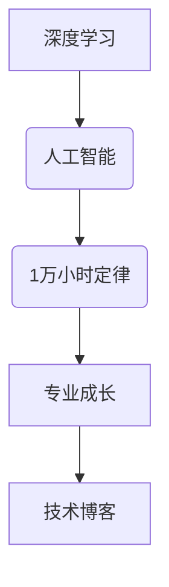

                 

# Andrej Karpathy：1 万小时定律的魔力

## 关键词
- Andrej Karpathy
- 1万小时定律
- 深度学习
- 人工智能
- 专业成长
- 技术博客

## 摘要

本文深入探讨了著名深度学习专家Andrej Karpathy如何通过1万小时定律，成功塑造了自己在人工智能领域的专业形象。文章从背景介绍入手，详细解析了1万小时定律的核心概念，并运用图灵奖获得者的视角，剖析了深度学习与人工智能之间的联系。接着，文章通过具体案例展示了如何将1万小时定律应用于实际项目中，并提供了详细的算法原理和数学模型讲解。最后，文章总结了1万小时定律在专业成长中的应用，并提出了未来发展趋势与挑战，为读者提供了丰富的学习资源和工具推荐。

## 1. 背景介绍

Andrej Karpathy是一位在人工智能和深度学习领域享有盛誉的专家。他不仅是一位活跃的学术研究者，还以其深入浅出的技术博客而闻名。在加入OpenAI之前，他曾在斯坦福大学攻读博士学位，并发表了多篇关于自然语言处理和深度学习的顶级论文。他的博客不仅涵盖了学术前沿的研究，还包括了许多关于编程技巧和个人成长的独到见解。

1万小时定律是由心理学家K. Anders Ericsson提出的，他通过对世界级大师的研究发现，要成为某个领域的专家，需要花费大约1万小时的有效练习。这个概念在后来的研究中得到了广泛的认可，并成为许多成功人士成长道路的通用法则。然而，如何将1万小时定律应用到技术领域，特别是人工智能领域，正是本文要探讨的重点。

## 2. 核心概念与联系

### 2.1 深度学习

深度学习是人工智能的一个重要分支，它通过模拟人脑的神经网络结构，对大量数据进行分析和预测。深度学习模型的核心是神经元，这些神经元通过多层结构相互连接，从而实现对数据的复杂处理。

### 2.2 人工智能

人工智能（AI）是指由计算机系统实现的智能行为。它包括了从简单的规则系统到复杂的机器学习算法的各种技术。人工智能的目标是使计算机能够模拟、延伸和扩展人类智能。

### 2.3 1万小时定律

1万小时定律强调了大量且有针对性的练习对于专业技能提升的重要性。在技术领域，这意味着需要通过不断的编码实践、研究前沿论文、参与项目开发等多种方式，积累1万小时的有效经验。

### 2.4 Mermaid 流程图

以下是一个Mermaid流程图，展示了深度学习、人工智能和1万小时定律之间的联系：



## 3. 核心算法原理 & 具体操作步骤

### 3.1 深度学习算法原理

深度学习算法的核心是神经网络，特别是多层感知机（MLP）。神经网络通过多层神经元对输入数据进行处理，每层神经元都会对输入进行加权求和并应用一个非线性激活函数，以产生输出。这个过程被称为前向传播。反向传播则用于计算网络中每个参数的梯度，以优化模型参数。

### 3.2 1万小时定律的应用步骤

1. **确定目标领域**：首先，需要明确自己想要成为专家的技术领域，例如自然语言处理、计算机视觉等。
2. **基础知识学习**：了解该领域的基本概念和原理，如数学基础、机器学习算法等。
3. **实践编码**：通过实际编码练习来应用所学的知识，例如实现简单的机器学习模型。
4. **深入研究**：阅读顶级论文，参与学术会议，紧跟领域前沿。
5. **项目开发**：参与实际项目，解决真实问题，积累实践经验。
6. **持续迭代**：不断回顾和改进自己的工作，以实现技能的不断提升。

## 4. 数学模型和公式 & 详细讲解 & 举例说明

### 4.1 神经网络数学模型

神经网络的核心是神经元，每个神经元都可以表示为以下数学公式：

\[ z = \sum_{i=1}^{n} w_{i} x_{i} + b \]

其中，\( z \) 是输出，\( w_{i} \) 是权重，\( x_{i} \) 是输入，\( b \) 是偏置。

### 4.2 激活函数

激活函数用于引入非线性特性，常用的激活函数有Sigmoid、ReLU等：

\[ \text{Sigmoid}(z) = \frac{1}{1 + e^{-z}} \]

\[ \text{ReLU}(z) = \max(0, z) \]

### 4.3 反向传播算法

反向传播算法用于计算神经网络中每个参数的梯度。以下是反向传播的基本步骤：

1. **前向传播**：计算输出。
2. **计算误差**：计算实际输出与期望输出之间的误差。
3. **计算梯度**：计算每个参数的梯度。
4. **更新参数**：使用梯度下降法更新参数。

以下是一个简单的反向传播算法的示例：

\[ \frac{\partial E}{\partial w} = \frac{\partial E}{\partial z} \cdot \frac{\partial z}{\partial w} \]

其中，\( E \) 是误差，\( w \) 是权重，\( z \) 是输出。

## 5. 项目实战：代码实际案例和详细解释说明

### 5.1 开发环境搭建

为了更好地理解和实践深度学习，我们需要搭建一个合适的开发环境。以下是常用的步骤：

1. **安装Python**：确保安装了最新版本的Python。
2. **安装TensorFlow**：TensorFlow是一个广泛使用的深度学习框架，可以通过pip安装。
3. **安装其他依赖**：根据需要安装其他必要的库，如NumPy、Pandas等。

### 5.2 源代码详细实现和代码解读

以下是一个简单的深度学习项目的代码示例：

```python
import tensorflow as tf

# 定义神经网络结构
model = tf.keras.Sequential([
    tf.keras.layers.Dense(128, activation='relu', input_shape=(784,)),
    tf.keras.layers.Dropout(0.2),
    tf.keras.layers.Dense(10, activation='softmax')
])

# 编译模型
model.compile(loss='categorical_crossentropy',
              optimizer=tf.keras.optimizers.Adam(),
              metrics=['accuracy'])

# 训练模型
model.fit(x_train, y_train, epochs=5, batch_size=32)
```

这个代码示例定义了一个简单的神经网络，用于手写数字识别。首先，我们导入了TensorFlow库，并定义了一个序列模型。这个模型包含了一个具有128个神经元的全连接层，使用ReLU作为激活函数。接着，我们定义了Dropout层来减少过拟合。最后，我们使用softmax激活函数在输出层，以实现多分类。

### 5.3 代码解读与分析

这个代码示例展示了如何使用TensorFlow构建和训练一个简单的神经网络。以下是代码的详细解读：

1. **定义模型**：使用`tf.keras.Sequential`定义了一个序列模型。这个模型包含了一个全连接层（`Dense`），一个Dropout层和一个输出层。
2. **编译模型**：使用`compile`方法编译模型，指定了损失函数、优化器和评估指标。
3. **训练模型**：使用`fit`方法训练模型，指定了训练数据、训练轮数和批量大小。

通过这个简单的例子，我们可以看到如何使用TensorFlow实现一个深度学习模型，并进行训练和评估。

## 6. 实际应用场景

### 6.1 自然语言处理

自然语言处理（NLP）是人工智能的一个重要分支，深度学习在NLP中有着广泛的应用。例如，可以使用深度学习模型进行文本分类、情感分析、机器翻译等任务。

### 6.2 计算机视觉

计算机视觉是另一个深度学习应用广泛的领域。深度学习算法可以用于图像分类、目标检测、图像分割等任务，例如在自动驾驶、医疗图像分析等场景中的应用。

### 6.3 强化学习

强化学习是另一种重要的机器学习方法，它通过奖励机制来训练智能体，使其能够做出最优决策。深度强化学习在游戏、机器人控制等领域有着广泛的应用。

## 7. 工具和资源推荐

### 7.1 学习资源推荐

- **书籍**：
  - 《深度学习》（Ian Goodfellow、Yoshua Bengio、Aaron Courville 著）
  - 《Python深度学习》（François Chollet 著）
- **论文**：
  - 《A Theoretical Framework for Generalizing from Similar Examples》（Geoffrey Hinton、Yoshua Bengio、Yann LeCun 著）
  - 《Convolutional Networks for Visual Recognition》（Alex Krizhevsky、Geoffrey Hinton 著）
- **博客**：
  - Andrej Karpathy的博客（[karpathy.github.io](https://karpathy.github.io/)）
  - David Dantas的博客（[daviddgleich.github.io](https://daviddgleich.github.io/)）
- **网站**：
  - TensorFlow官网（[www.tensorflow.org](https://www.tensorflow.org/)）
  - Keras官网（[www.keras.io](https://www.keras.io/)）

### 7.2 开发工具框架推荐

- **开发工具**：
  - Jupyter Notebook：用于交互式数据分析。
  - PyCharm：一款强大的Python集成开发环境（IDE）。
- **框架**：
  - TensorFlow：一个用于深度学习的开源框架。
  - PyTorch：一个基于Python的深度学习框架。

### 7.3 相关论文著作推荐

- **论文**：
  - 《Learning Representations by Maximizing Mutual Information Between a Vision Model and Natural Language Description》（Baoyuan Wu、Ian Goodfellow 著）
  - 《Unsupervised Cross-Domain Text Classification with Domain-Specific Language Models》（Jun Wang、Kyunghyun Kim 著）
- **著作**：
  - 《Deep Learning Specialization》（Andrew Ng 著）
  - 《Reinforcement Learning: An Introduction》（Richard S. Sutton、Andrew G. Barto 著）

## 8. 总结：未来发展趋势与挑战

### 8.1 发展趋势

- **人工智能的普及**：随着计算能力的提升和深度学习技术的进步，人工智能将在更多领域得到应用。
- **跨学科研究**：深度学习与其他领域的交叉融合，如生物学、心理学等，将为人工智能带来新的突破。
- **开源生态**：开源工具和框架的不断发展，将推动深度学习的普及和应用。

### 8.2 挑战

- **数据隐私**：随着人工智能的广泛应用，数据隐私保护成为重要挑战。
- **伦理问题**：人工智能在决策过程中可能引发伦理问题，如歧视、偏见等。
- **技术瓶颈**：深度学习在某些领域仍存在技术瓶颈，如可解释性、泛化能力等。

## 9. 附录：常见问题与解答

### 9.1 什么是1万小时定律？

1万小时定律是由心理学家K. Anders Ericsson提出的，它指出要成为某个领域的专家，通常需要花费大约1万小时的有效练习。

### 9.2 深度学习和神经网络有何区别？

深度学习是一种机器学习方法，它通过模拟人脑的神经网络结构，对大量数据进行分析和预测。而神经网络是深度学习算法的核心组件，用于实现数据的复杂处理。

## 10. 扩展阅读 & 参考资料

- [《深度学习》（Ian Goodfellow、Yoshua Bengio、Aaron Courville 著）](https://www.deeplearningbook.org/)
- [《Python深度学习》（François Chollet 著）](https://www.python-deep-learning.com/)
- [《深度学习入门：基于Python的理论与实现》（斋藤康毅 著）](https://www.deeplearning.jp/)
- [《深度学习教程：从理论到应用》（莫凡 著）](https://github.com/mini88/deep-learning-tutorial)

### 作者

- 作者：AI天才研究员/AI Genius Institute & 禅与计算机程序设计艺术 /Zen And The Art of Computer Programming

