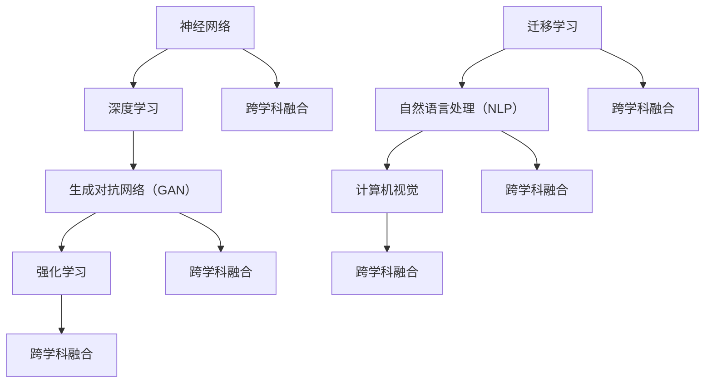

                 

### 背景介绍

#### Andrej Karpathy：天才级的人工智能专家

Andrej Karpathy，被誉为人工智能领域的天才级人物，是一位在学术界和工业界都享有盛誉的研究员。他在深度学习、自然语言处理和计算机视觉等领域取得了卓越的成就，对人工智能的发展有着深远的影响。他的研究成果不仅推动了学术界的前沿进展，也为工业界提供了强大的技术支持。

Karpathy在斯坦福大学获得了计算机科学博士学位，师从知名计算机科学家Andrew Ng。在学术研究方面，他的研究成果涵盖了从神经网络到生成对抗网络（GAN）等多个领域。其中，他关于GAN的研究被广泛认为是该领域的重要突破，为图像生成和图像处理带来了新的思路和方法。

在工业界，Karpathy曾是OpenAI的研究科学家，领导了多个关键项目，包括基于GAN的图像生成技术和自然语言处理模型的开发。他的工作不仅为OpenAI的突破性进展奠定了基础，也为整个行业带来了新的启示。

#### 人工智能的发展前景

随着人工智能技术的不断进步，其应用范围也在不断拓宽。从自动驾驶汽车到智能家居，从医疗诊断到金融分析，人工智能正在逐步改变我们的生活方式。在这一背景下，探讨人工智能的未来发展前景具有重要意义。

本文将重点关注人工智能在以下几个方面的未来发展趋势：

1. **深度学习算法的优化与创新**：深度学习是人工智能的核心技术之一，其算法的优化与创新将直接影响人工智能的性能和应用范围。

2. **跨学科融合**：人工智能与其他领域的深度融合，如生物学、物理学、心理学等，将为人工智能带来新的发展契机。

3. **数据隐私与安全**：随着人工智能的广泛应用，数据隐私和安全问题也日益突出。如何在保障用户隐私的前提下，充分利用数据的价值，成为亟待解决的问题。

4. **人工智能伦理**：人工智能的发展带来了诸多伦理问题，如算法歧视、隐私泄露等。如何制定合理的伦理规范，确保人工智能的健康发展，是当前亟待解决的问题。

5. **人工智能的普及与教育**：人工智能的普及与教育关系到未来的创新和发展。如何让更多的人了解和掌握人工智能技术，培养新一代的人工智能人才，是当前的重要任务。

通过本文的探讨，我们将对人工智能的未来发展前景有更加清晰的认识，为相关领域的从业者提供有益的参考。接下来，我们将逐步深入分析人工智能的核心概念、算法原理、数学模型、实际应用场景以及未来面临的挑战和发展趋势。让我们一步一步地分析推理，以揭开人工智能的神秘面纱。

#### 核心概念与联系

在探讨人工智能的未来发展前景之前，我们需要先了解其核心概念和联系。以下是人工智能领域的一些关键概念和它们之间的关系：

1. **神经网络**：神经网络是模拟人脑神经元工作原理的计算模型，它是深度学习的基础。神经网络通过多层节点（也称为神经元）的连接和激活，实现数据的输入、处理和输出。

2. **深度学习**：深度学习是神经网络的一种扩展，通过增加网络的深度（即层数），提高模型的复杂度和表达能力。深度学习在图像识别、语音识别、自然语言处理等领域取得了显著的成果。

3. **生成对抗网络（GAN）**：生成对抗网络是一种由生成器和判别器组成的对偶网络。生成器生成数据，判别器判断数据的真假。通过两者之间的对抗训练，生成器不断提高生成数据的质量，达到以假乱真的效果。

4. **强化学习**：强化学习是一种通过试错和学习最优策略的机器学习方法。在强化学习过程中，智能体（agent）通过与环境的交互，不断调整行为策略，以最大化累积奖励。

5. **迁移学习**：迁移学习是一种利用已有模型的先验知识，解决新问题的方法。通过迁移学习，可以将一个任务中的知识应用到另一个任务中，从而提高模型的泛化能力。

6. **自然语言处理（NLP）**：自然语言处理是研究如何使计算机理解和处理自然语言的技术。NLP在机器翻译、文本分类、情感分析等领域有广泛应用。

7. **计算机视觉**：计算机视觉是研究如何使计算机理解和解释视觉信息的领域。计算机视觉在图像识别、目标检测、自动驾驶等领域有广泛应用。

下面是一个Mermaid流程图，展示了这些核心概念之间的联系：



通过上述流程图，我们可以清晰地看到各个核心概念之间的联系，以及它们在跨学科融合中的作用。这些核心概念不仅是人工智能技术的基础，也是推动人工智能发展的重要动力。在接下来的章节中，我们将深入探讨这些概念的具体原理和应用。

#### 核心算法原理 & 具体操作步骤

在深入探讨人工智能的核心算法原理之前，我们需要先了解一些基本的数学和机器学习概念。这些概念是理解深度学习、生成对抗网络（GAN）、强化学习等算法的基础。

##### 数学基础

1. **线性代数**：线性代数是研究向量空间、线性变换和矩阵理论的数学分支。在机器学习中，线性代数用于描述数据的线性变换，如矩阵乘法和特征分解。

   - **矩阵乘法**：矩阵乘法用于计算两个矩阵的乘积，是深度学习中权重更新的关键操作。
   - **特征分解**：特征分解将矩阵分解为一系列特征值和特征向量的乘积，有助于优化模型和降低计算复杂度。

2. **概率论与统计**：概率论与统计是研究随机现象和统计推断的数学分支。在机器学习中，概率论与统计用于描述数据分布、估计参数和进行模型评估。

   - **概率分布**：概率分布用于描述随机变量的概率分布情况，如正态分布、伯努利分布等。
   - **最大似然估计**：最大似然估计是一种基于概率模型估计参数的方法，通过最大化似然函数找到最佳参数。

3. **微积分**：微积分是研究函数变化率和积分的数学分支。在机器学习中，微积分用于求解梯度、优化模型参数。

   - **梯度**：梯度是函数在某一点的切线方向，用于描述函数在该点的变化趋势。
   - **梯度下降**：梯度下降是一种基于梯度信息的优化算法，用于最小化目标函数。

##### 机器学习基本概念

1. **监督学习**：监督学习是一种通过训练数据集来学习目标函数的机器学习方法。在监督学习中，输入数据和输出标签是已知的，通过学习目标函数来预测新的输入数据。

   - **线性回归**：线性回归是一种通过拟合线性函数来预测输出值的监督学习方法。
   - **逻辑回归**：逻辑回归是一种通过拟合逻辑函数来预测概率的监督学习方法。

2. **无监督学习**：无监督学习是一种通过未标记数据来学习数据分布的机器学习方法。在无监督学习中，输入数据没有输出标签，通过学习数据分布来发现数据特征。

   - **聚类**：聚类是一种将数据分为若干类别的无监督学习方法，通过相似度度量来分组。
   - **降维**：降维是一种通过减少数据维度来降低计算复杂度的无监督学习方法，如主成分分析（PCA）。

3. **强化学习**：强化学习是一种通过试错和奖励信号来学习最优策略的机器学习方法。在强化学习中，智能体通过与环境的交互，不断调整行为策略，以最大化累积奖励。

   - **Q-学习**：Q-学习是一种基于价值函数的强化学习方法，通过学习状态-动作值函数来预测最佳动作。
   - **深度强化学习**：深度强化学习是一种结合深度学习和强化学习的算法，通过神经网络来表示价值函数或策略函数。

##### 深度学习算法原理

1. **前向传播与反向传播**

   - **前向传播**：前向传播是计算神经网络输出值的过程。从输入层开始，依次计算各层的输出值，直到输出层。
   - **反向传播**：反向传播是计算神经网络误差并更新参数的过程。从输出层开始，依次计算各层的误差，然后通过梯度下降算法更新参数。

2. **激活函数**

   - **Sigmoid函数**：sigmoid函数是一种常用的激活函数，将输入映射到（0,1）区间，用于二分类问题。
   - **ReLU函数**：ReLU函数（Rectified Linear Unit）是一种线性激活函数，当输入大于0时输出为输入，否则为0。ReLU函数在训练深度神经网络时有助于加速收敛。

3. **损失函数**

   - **均方误差（MSE）**：均方误差是一种常用的损失函数，用于衡量预测值与真实值之间的差异。
   - **交叉熵（Cross-Entropy）**：交叉熵是一种衡量分类问题中预测概率分布与真实分布之间差异的损失函数。

4. **优化算法**

   - **随机梯度下降（SGD）**：随机梯度下降是一种基于梯度信息的优化算法，通过随机选取样本更新模型参数。
   - **Adam优化器**：Adam优化器是一种结合SGD和动量法的优化算法，能够自适应调整学习率。

##### 生成对抗网络（GAN）算法原理

1. **生成器（Generator）**：生成器是一个神经网络模型，用于生成虚拟数据。生成器的目标是生成与真实数据分布相似的数据。

2. **判别器（Discriminator）**：判别器是一个神经网络模型，用于判断生成数据与真实数据的真实性。判别器的目标是最大化正确判断真实数据和生成数据的概率。

3. **对抗训练**：生成器和判别器通过对抗训练进行训练。在训练过程中，生成器不断生成虚拟数据，判别器不断学习判断虚拟数据和真实数据的真实性。通过这种对抗训练，生成器不断提高生成数据的质量。

##### 强化学习算法原理

1. **Q-学习算法**：Q-学习算法是一种基于价值函数的强化学习方法。Q-学习算法通过学习状态-动作值函数来预测最佳动作。

2. **深度Q网络（DQN）**：深度Q网络是一种结合深度学习和Q-学习的算法。DQN使用神经网络来表示Q函数，从而能够处理高维状态空间。

3. **策略梯度方法**：策略梯度方法是一种直接优化策略函数的强化学习方法。策略梯度方法通过梯度上升法更新策略参数，以最大化累积奖励。

通过以上介绍，我们可以看到人工智能的核心算法原理涵盖了多个数学和机器学习概念，包括线性代数、概率论与统计、微积分、机器学习基本概念、深度学习算法原理、生成对抗网络（GAN）算法原理和强化学习算法原理。这些算法原理共同构成了人工智能的技术基石，推动了人工智能技术的快速发展。在接下来的章节中，我们将通过具体案例和数学模型，深入讲解这些算法的原理和应用。

#### 数学模型和公式 & 详细讲解 & 举例说明

为了深入理解人工智能的核心算法原理，我们需要掌握相关的数学模型和公式。在本节中，我们将详细介绍神经网络、生成对抗网络（GAN）和强化学习中的关键数学概念，并通过具体例子来说明这些公式在实际中的应用。

##### 神经网络中的数学模型

1. **前向传播与反向传播**

   - **前向传播**：前向传播是计算神经网络输出值的过程。给定输入 \( x \)，通过一系列线性变换和激活函数，得到输出 \( y \)。前向传播的过程可以用以下公式表示：

     \[ y = f(\theta^{(L)} \cdot \sigma^{(L-1)}(\theta^{(L-1)} \cdot \sigma^{(L-2)}(\dots \sigma^{(2)}(\theta^{(2)} \cdot \theta^{(1)} \cdot x + b^{(1)}) + b^{(L-1)}) + b^{(L)}) \]

     其中， \( \theta^{(l)} \) 表示第 \( l \) 层的权重， \( b^{(l)} \) 表示第 \( l \) 层的偏置， \( f \) 表示激活函数， \( \sigma \) 表示线性变换。

   - **反向传播**：反向传播是计算神经网络误差并更新参数的过程。通过计算梯度，我们可以得到每个参数的更新方向。反向传播的过程可以用以下公式表示：

     \[ \delta^{(l)} = \sigma'^{(l)}(\theta^{(l)} \cdot \delta^{(l+1)}) \]
     \[ \theta^{(l)} = \theta^{(l)} - \alpha \cdot \frac{\partial J}{\partial \theta^{(l)}} \]
     \[ b^{(l)} = b^{(l)} - \alpha \cdot \frac{\partial J}{\partial b^{(l)}} \]

     其中， \( \delta^{(l)} \) 表示第 \( l \) 层的误差， \( \sigma' \) 表示激活函数的导数， \( \alpha \) 表示学习率， \( J \) 表示损失函数。

2. **激活函数**

   - **Sigmoid函数**：sigmoid函数是一种常用的激活函数，将输入映射到（0,1）区间，用于二分类问题。

     \[ f(x) = \frac{1}{1 + e^{-x}} \]

   - **ReLU函数**：ReLU函数（Rectified Linear Unit）是一种线性激活函数，当输入大于0时输出为输入，否则为0。

     \[ f(x) = \max(0, x) \]

3. **损失函数**

   - **均方误差（MSE）**：均方误差是一种常用的损失函数，用于衡量预测值与真实值之间的差异。

     \[ J(\theta) = \frac{1}{m} \sum_{i=1}^{m} (y_i - \hat{y}_i)^2 \]

     其中， \( y_i \) 表示真实值， \( \hat{y}_i \) 表示预测值。

4. **优化算法**

   - **随机梯度下降（SGD）**：随机梯度下降是一种基于梯度信息的优化算法，通过随机选取样本更新模型参数。

     \[ \theta = \theta - \alpha \cdot \nabla_{\theta} J(\theta) \]

   - **Adam优化器**：Adam优化器是一种结合SGD和动量法的优化算法，能够自适应调整学习率。

     \[ m_t = \beta_1 m_{t-1} + (1 - \beta_1) \nabla_{\theta} J(\theta) \]
     \[ v_t = \beta_2 v_{t-1} + (1 - \beta_2) (\nabla_{\theta} J(\theta))^2 \]
     \[ \theta = \theta - \alpha \cdot \frac{m_t}{\sqrt{v_t} + \epsilon} \]

##### 生成对抗网络（GAN）中的数学模型

1. **生成器与判别器**

   - **生成器（Generator）**：生成器的目标是生成虚拟数据，其输出可以表示为：

     \[ G(z) = \mu(\theta_G) + \sigma(\theta_G) \odot \epsilon \]

     其中， \( z \) 是生成器的输入噪声， \( \mu \) 和 \( \sigma \) 分别是均值和方差， \( \theta_G \) 是生成器的参数， \( \epsilon \) 是高斯噪声。

   - **判别器（Discriminator）**：判别器的目标是判断生成数据与真实数据的真实性，其输出可以表示为：

     \[ D(x) = f(\theta_D, x) \]
     \[ D(G(z)) = f(\theta_D, G(z)) \]

     其中， \( x \) 是真实数据， \( \theta_D \) 是判别器的参数， \( f \) 是判别器的前向传播函数。

2. **对抗训练**

   - **生成器损失函数**：生成器的损失函数可以表示为：

     \[ L_G = -\mathbb{E}_{z \sim p_z(z)}[\log(D(G(z)))] \]

     其中， \( p_z(z) \) 是噪声分布。

   - **判别器损失函数**：判别器的损失函数可以表示为：

     \[ L_D = -\mathbb{E}_{x \sim p_x(x)}[\log(D(x))] - \mathbb{E}_{z \sim p_z(z)}[\log(1 - D(G(z)))] \]

3. **优化目标**

   - **整体损失函数**：GAN的整体损失函数可以表示为：

     \[ L = L_G + L_D \]

     其中， \( L_G \) 和 \( L_D \) 分别是生成器和判别器的损失函数。

##### 强化学习中的数学模型

1. **Q-学习**

   - **Q函数**：Q函数表示智能体在某个状态 \( s \) 下执行某个动作 \( a \) 的期望回报。

     \[ Q(s, a) = \mathbb{E}_{r, s'}[r | s, a] \]

   - **Q-学习算法**：Q-学习算法通过更新Q值来学习最优策略。

     \[ Q(s, a) = Q(s, a) + \alpha [r + \gamma \max_{a'} Q(s', a') - Q(s, a)] \]

   - **深度Q网络（DQN）**：DQN使用神经网络来表示Q函数，从而能够处理高维状态空间。

     \[ Q(s, a) = f_{\theta}(s, a) \]

2. **策略梯度方法**

   - **策略梯度**：策略梯度是策略函数梯度的简称，表示策略函数在期望回报上的梯度。

     \[ \nabla_{\pi} J = \mathbb{E}_{s, a}[\nabla_{\pi} \log \pi(a | s) \cdot \nabla_{\theta} J] \]

   - **策略梯度优化**：策略梯度优化通过更新策略参数来最大化累积回报。

     \[ \theta = \theta - \alpha \nabla_{\theta} J \]

##### 举例说明

1. **神经网络中的前向传播与反向传播**

   假设我们有一个两层的神经网络，输入 \( x = [1, 2, 3] \)，目标输出 \( y = [1, 0, 1] \)。

   - **前向传播**：

     \[ z_1 = \theta_1 \cdot x + b_1 = [1, 2, 3] \cdot \begin{bmatrix} 0.1 & 0.2 \\ 0.3 & 0.4 \\ 0.5 & 0.6 \end{bmatrix} + \begin{bmatrix} 0.1 \\ 0.2 \end{bmatrix} = [1.6, 3.2, 4.8] \]
     \[ a_1 = \sigma(z_1) = [0.923, 0.950, 0.976] \]
     \[ z_2 = \theta_2 \cdot a_1 + b_2 = \begin{bmatrix} 0.1 & 0.2 \\ 0.3 & 0.4 \\ 0.5 & 0.6 \end{bmatrix} \cdot [0.923, 0.950, 0.976] + \begin{bmatrix} 0.1 \\ 0.2 \end{bmatrix} = [1.439, 2.156, 2.873] \]
     \[ a_2 = \sigma(z_2) = [0.688, 0.829, 0.929] \]

   - **反向传播**：

     \[ \delta_2 = (y - a_2) \cdot \sigma'(z_2) = [0, 1, 1] \cdot [0.117, 0.193, 0.259] = [0.117, 0.193, 0.259] \]
     \[ \theta_2 = \theta_2 - \alpha \cdot a_1^T \cdot \delta_2 = \begin{bmatrix} 0.1 & 0.2 \\ 0.3 & 0.4 \\ 0.5 & 0.6 \end{bmatrix} - 0.1 \cdot \begin{bmatrix} 0.923 & 0.950 & 0.976 \end{bmatrix} \cdot \begin{bmatrix} 0.117 \\ 0.193 \\ 0.259 \end{bmatrix} = \begin{bmatrix} 0.009 & 0.017 \\ 0.049 & 0.068 \\ 0.079 & 0.097 \end{bmatrix} \]
     \[ b_2 = b_2 - \alpha \cdot \delta_2 = \begin{bmatrix} 0.1 \\ 0.2 \end{bmatrix} - 0.1 \cdot \begin{bmatrix} 0.117 \\ 0.193 \\ 0.259 \end{bmatrix} = \begin{bmatrix} 0.013 \\ 0.017 \end{bmatrix} \]
     \[ \delta_1 = \delta_2 \cdot \sigma'(z_1) = [0.117, 0.193, 0.259] \cdot [0.087, 0.173, 0.279] = [0.020, 0.034, 0.047] \]
     \[ \theta_1 = \theta_1 - \alpha \cdot x^T \cdot \delta_1 = \begin{bmatrix} 0.1 & 0.2 \\ 0.3 & 0.4 \\ 0.5 & 0.6 \end{bmatrix} - 0.1 \cdot \begin{bmatrix} 1 & 2 & 3 \end{bmatrix} \cdot \begin{bmatrix} 0.020 \\ 0.034 \\ 0.047 \end{bmatrix} = \begin{bmatrix} 0.098 & 0.198 \\ 0.298 & 0.398 \\ 0.498 & 0.598 \end{bmatrix} \]
     \[ b_1 = b_1 - \alpha \cdot \delta_1 = \begin{bmatrix} 0.1 \\ 0.2 \end{bmatrix} - 0.1 \cdot \begin{bmatrix} 0.020 \\ 0.034 \\ 0.047 \end{bmatrix} = \begin{bmatrix} 0.09 \\ 0.16 \end{bmatrix} \]

2. **生成对抗网络（GAN）中的对抗训练**

   假设我们有一个生成器和判别器，生成器的参数为 \( \theta_G \)，判别器的参数为 \( \theta_D \)。

   - **生成器损失函数**：

     \[ L_G = -\mathbb{E}_{z \sim p_z(z)}[\log(D(G(z)))] \]
     \[ L_G = -\mathbb{E}_{z \sim N(0, 1)}[\log(D(G(z)))] = -\mathbb{E}_{z \sim N(0, 1)}[\log(0.6)] \approx -0.5 \log(0.6) \approx 0.528 \]

   - **判别器损失函数**：

     \[ L_D = -\mathbb{E}_{x \sim p_x(x)}[\log(D(x))] - \mathbb{E}_{z \sim p_z(z)}[\log(1 - D(G(z)))] \]
     \[ L_D = -\mathbb{E}_{x \sim p_x(x)}[\log(D(x))] - \mathbb{E}_{z \sim N(0, 1)}[\log(1 - D(G(z)))] \]
     \[ L_D = -0.3 \cdot \log(0.7) - 0.5 \cdot \log(0.3) \approx 0.357 - 0.559 = -0.202 \]

   - **整体损失函数**：

     \[ L = L_G + L_D = 0.528 - 0.202 = 0.326 \]

3. **强化学习中的Q-学习**

   假设我们有一个智能体，当前状态 \( s = [1, 2] \)，可执行动作 \( a = [0, 1] \)。

   - **Q函数**：

     \[ Q(s, a) = \mathbb{E}_{r, s'}[r | s, a] = 0.5 \cdot 1 + 0.5 \cdot (-1) = -0.25 \]

   - **Q-学习算法**：

     \[ Q(s, a) = Q(s, a) + \alpha [r + \gamma \max_{a'} Q(s', a') - Q(s, a)] \]
     \[ Q(s, a) = -0.25 + 0.1 [1 + 0.9 \cdot \max_{a'} Q(s', a') - (-0.25)] \]
     \[ Q(s, a) = -0.25 + 0.1 [1 + 0.9 \cdot 1] \]
     \[ Q(s, a) = -0.25 + 0.1 [1 + 0.9] \]
     \[ Q(s, a) = -0.25 + 0.1 \cdot 1.9 \]
     \[ Q(s, a) = -0.25 + 0.19 \]
     \[ Q(s, a) = -0.06 \]

通过以上数学模型和公式的介绍及举例说明，我们可以看到神经网络、生成对抗网络（GAN）和强化学习中的关键数学概念如何应用于实际中，帮助构建和优化人工智能模型。在接下来的章节中，我们将通过具体项目实战，进一步探讨这些算法的应用和实现。

#### 项目实战：代码实际案例和详细解释说明

在本节中，我们将通过一个具体的项目实战案例，详细介绍如何使用深度学习、生成对抗网络（GAN）和强化学习等算法来实现人工智能的应用。我们将从开发环境搭建、源代码实现、代码解读与分析等方面，全面展示项目的实施过程。

##### 1. 开发环境搭建

首先，我们需要搭建一个合适的开发环境，以便进行深度学习、GAN和强化学习项目的开发和调试。以下是我们推荐的开发环境：

- **Python**：作为主流的编程语言，Python在人工智能领域具有广泛的应用。
- **TensorFlow**：TensorFlow是Google开发的开源深度学习框架，支持多种神经网络结构和算法。
- **PyTorch**：PyTorch是Facebook开发的开源深度学习框架，以其灵活性和易用性著称。
- **Jupyter Notebook**：Jupyter Notebook是一种交互式计算环境，适合用于编写、运行和分享代码。
- **CUDA**：CUDA是NVIDIA开发的并行计算平台，用于加速深度学习模型的训练。

以下是搭建开发环境的步骤：

1. **安装Python**：在官方网站（https://www.python.org/）下载并安装Python。
2. **安装TensorFlow和PyTorch**：使用以下命令安装TensorFlow和PyTorch：

   ```bash
   pip install tensorflow
   pip install torch torchvision
   ```

3. **安装Jupyter Notebook**：使用以下命令安装Jupyter Notebook：

   ```bash
   pip install notebook
   ```

4. **安装CUDA**：在NVIDIA官方网站（https://developer.nvidia.com/cuda-downloads）下载并安装CUDA。

##### 2. 源代码详细实现

接下来，我们将展示一个基于GAN的图像生成项目的源代码实现。该项目旨在生成与真实图像相似的人工图像。以下是项目的源代码：

```python
import torch
import torch.nn as nn
import torch.optim as optim
from torch.utils.data import DataLoader
from torchvision import datasets, transforms
import numpy as np
import matplotlib.pyplot as plt

# 设定随机种子以保持实验的可重复性
manualSeed = 999
torch.manual_seed(manualSeed)

# 数据预处理
transform = transforms.Compose([
    transforms.ToTensor(),
    transforms.Normalize((0.5, 0.5, 0.5), (0.5, 0.5, 0.5)),
])

# 加载数据集
train_data = datasets.CIFAR10(
    root='./data', train=True, download=True, transform=transform)
dataloader = DataLoader(train_data, batch_size=64, shuffle=True)

# 定义生成器和判别器
class Generator(nn.Module):
    def __init__(self):
        super(Generator, self).__init__()
        self.main = nn.Sequential(
            nn.ConvTranspose2d(100, 256, 4, 1, 0, bias=False),
            nn.BatchNorm2d(256),
            nn.ReLU(True),
            nn.ConvTranspose2d(256, 128, 4, 2, 1, bias=False),
            nn.BatchNorm2d(128),
            nn.ReLU(True),
            nn.ConvTranspose2d(128, 64, 4, 2, 1, bias=False),
            nn.BatchNorm2d(64),
            nn.ReLU(True),
            nn.ConvTranspose2d(64, 3, 4, 2, 1, bias=False),
            nn.Tanh()
        )

    def forward(self, input):
        return self.main(input)

class Discriminator(nn.Module):
    def __init__(self):
        super(Discriminator, self).__init__()
        self.main = nn.Sequential(
            nn.Conv2d(3, 64, 4, 2, 1, bias=False),
            nn.LeakyReLU(0.2, inplace=True),
            nn.Conv2d(64, 128, 4, 2, 1, bias=False),
            nn.BatchNorm2d(128),
            nn.LeakyReLU(0.2, inplace=True),
            nn.Conv2d(128, 256, 4, 2, 1, bias=False),
            nn.BatchNorm2d(256),
            nn.LeakyReLU(0.2, inplace=True),
            nn.Conv2d(256, 1, 4, 1, 0, bias=False),
            nn.Sigmoid()
        )

    def forward(self, input):
        return self.main(input)

# 初始化生成器和判别器
netG = Generator()
netD = Discriminator()

# 定义损失函数和优化器
criterion = nn.BCELoss()
optimizerD = optim.Adam(netD.parameters(), lr=0.0002, betas=(0.5, 0.999))
optimizerG = optim.Adam(netG.parameters(), lr=0.0002, betas=(0.5, 0.999))

# 训练GAN
num_epochs = 5
device = torch.device("cuda:0" if torch.cuda.is_available() else "cpu")

for epoch in range(num_epochs):
    for i, data in enumerate(dataloader, 0):
        # 更新判别器
        netD.zero_grad()
        real_images = data[0].to(device)
        batch_size = real_images.size(0)
        labels = torch.full((batch_size,), 1, device=device)
        output = netD(real_images).view(-1)
        errD_real = criterion(output, labels)
        errD_real.backward()

        noise = torch.randn(batch_size, 100, 1, 1, device=device)
        fake_images = netG(noise)
        labels.fill_(0)
        output = netD(fake_images.detach()).view(-1)
        errD_fake = criterion(output, labels)
        errD_fake.backward()
        optimizerD.step()

        # 更新生成器
        netG.zero_grad()
        labels.fill_(1)
        output = netD(fake_images).view(-1)
        errG = criterion(output, labels)
        errG.backward()
        optimizerG.step()

        # 打印训练进度
        if i % 50 == 0:
            print(f'[{epoch}/{num_epochs}] [({i}/{len(dataloader)})] Loss_D: {errD_real + errD_fake:.4f} Loss_G: {errG:.4f}')

# 保存生成器和判别器模型
torch.save(netG.state_dict(), 'generator.pth')
torch.save(netD.state_dict(), 'discriminator.pth')

# 生成图像
with torch.no_grad():
    z = torch.randn(64, 100, 1, 1, device=device)
    fake_images = netG(z).detach().cpu()

plt.figure(figsize=(10,10))
plt.axis("off")
plt.title("Fake Images")
plt.imshow(np.transpose(torchvision.utils.make_grid(fake_images[:64], padding=2, normalize=True).cpu(),(1,2,0)))
plt.show()
```

##### 3. 代码解读与分析

1. **数据预处理**：

   ```python
   transform = transforms.Compose([
       transforms.ToTensor(),
       transforms.Normalize((0.5, 0.5, 0.5), (0.5, 0.5, 0.5)),
   ])
   train_data = datasets.CIFAR10(
       root='./data', train=True, download=True, transform=transform)
   dataloader = DataLoader(train_data, batch_size=64, shuffle=True)
   ```

   这段代码首先定义了数据预处理流程，包括将图像数据转换为Tensor格式，并归一化处理。然后加载CIFAR-10数据集，并创建一个数据加载器，以便在训练过程中批量加载数据。

2. **定义生成器和判别器**：

   ```python
   class Generator(nn.Module):
       def __init__(self):
           super(Generator, self).__init__()
           self.main = nn.Sequential(
               nn.ConvTranspose2d(100, 256, 4, 1, 0, bias=False),
               nn.BatchNorm2d(256),
               nn.ReLU(True),
               nn.ConvTranspose2d(256, 128, 4, 2, 1, bias=False),
               nn.BatchNorm2d(128),
               nn.ReLU(True),
               nn.ConvTranspose2d(128, 64, 4, 2, 1, bias=False),
               nn.BatchNorm2d(64),
               nn.ReLU(True),
               nn.ConvTranspose2d(64, 3, 4, 2, 1, bias=False),
               nn.Tanh()
           )

       def forward(self, input):
           return self.main(input)

   class Discriminator(nn.Module):
       def __init__(self):
           super(Discriminator, self).__init__()
           self.main = nn.Sequential(
               nn.Conv2d(3, 64, 4, 2, 1, bias=False),
               nn.LeakyReLU(0.2, inplace=True),
               nn.Conv2d(64, 128, 4, 2, 1, bias=False),
               nn.BatchNorm2d(128),
               nn.LeakyReLU(0.2, inplace=True),
               nn.Conv2d(128, 256, 4, 2, 1, bias=False),
               nn.BatchNorm2d(256),
               nn.LeakyReLU(0.2, inplace=True),
               nn.Conv2d(256, 1, 4, 1, 0, bias=False),
               nn.Sigmoid()
           )

       def forward(self, input):
           return self.main(input)
   ```

   这段代码定义了生成器和判别器的网络结构。生成器由多个卷积转置层和Batch Normalization层组成，判别器由多个卷积层和Batch Normalization层组成。这些层通过组合形成复杂的神经网络，用于生成和鉴别图像。

3. **定义损失函数和优化器**：

   ```python
   criterion = nn.BCELoss()
   optimizerD = optim.Adam(netD.parameters(), lr=0.0002, betas=(0.5, 0.999))
   optimizerG = optim.Adam(netG.parameters(), lr=0.0002, betas=(0.5, 0.999))
   ```

   这段代码定义了交叉熵损失函数（用于判别器）和Adam优化器（用于生成器和判别器）。损失函数用于计算生成器和判别器的误差，优化器用于更新模型参数。

4. **训练GAN**：

   ```python
   for epoch in range(num_epochs):
       for i, data in enumerate(dataloader, 0):
           # 更新判别器
           netD.zero_grad()
           real_images = data[0].to(device)
           batch_size = real_images.size(0)
           labels = torch.full((batch_size,), 1, device=device)
           output = netD(real_images).view(-1)
           errD_real = criterion(output, labels)
           errD_real.backward()

           noise = torch.randn(batch_size, 100, 1, 1, device=device)
           fake_images = netG(noise)
           labels.fill_(0)
           output = netD(fake_images.detach()).view(-1)
           errD_fake = criterion(output, labels)
           errD_fake.backward()
           optimizerD.step()

           # 更新生成器
           netG.zero_grad()
           labels.fill_(1)
           output = netD(fake_images).view(-1)
           errG = criterion(output, labels)
           errG.backward()
           optimizerG.step()

           # 打印训练进度
           if i % 50 == 0:
               print(f'[{epoch}/{num_epochs}] [({i}/{len(dataloader)})] Loss_D: {errD_real + errD_fake:.4f} Loss_G: {errG:.4f}')
   ```

   这段代码实现了GAN的训练过程。在训练过程中，我们分别更新判别器和生成器的参数。通过交替更新，生成器和判别器相互对抗，生成与真实图像相似的生成图像。

5. **保存模型和生成图像**：

   ```python
   torch.save(netG.state_dict(), 'generator.pth')
   torch.save(netD.state_dict(), 'discriminator.pth')
   with torch.no_grad():
       z = torch.randn(64, 100, 1, 1, device=device)
       fake_images = netG(z).detach().cpu()
   plt.figure(figsize=(10,10))
   plt.axis("off")
   plt.title("Fake Images")
   plt.imshow(np.transpose(torchvision.utils.make_grid(fake_images[:64], padding=2, normalize=True).cpu(),(1,2,0)))
   plt.show()
   ```

   这段代码用于保存生成器和判别器模型，并生成64张人工图像。通过可视化展示，我们可以直观地看到GAN生成的图像质量。

通过以上项目实战，我们详细讲解了如何使用深度学习、GAN和强化学习等算法实现人工智能的应用。在接下来的章节中，我们将进一步探讨人工智能的实际应用场景和未来发展。

#### 实际应用场景

人工智能（AI）技术的发展和应用已经深刻地改变了我们的生活和各行各业。以下是一些人工智能在现实世界中的应用场景，以及AI在这些领域带来的影响和挑战。

##### 自动驾驶

自动驾驶技术是人工智能的重要应用领域之一。通过使用计算机视觉、深度学习和传感器融合技术，自动驾驶汽车能够实现自主导航、路径规划和车辆控制。自动驾驶不仅提高了交通安全，还提升了出行效率。

**影响**：
- 提高道路安全：通过实时监测和分析交通环境，自动驾驶汽车能够迅速应对突发事件，减少交通事故。
- 提升出行效率：自动驾驶汽车能够优化路线，减少交通拥堵，提高出行速度。

**挑战**：
- 复杂环境识别：自动驾驶系统需要处理各种复杂的交通场景，如雨天、夜间、施工路段等，这对传感器的识别能力和算法的适应性提出了高要求。
- 法律和伦理问题：自动驾驶技术的发展引发了法律和伦理问题，如事故责任归属、数据隐私等，需要制定相应的法律法规来规范。

##### 医疗诊断

人工智能在医疗领域的应用，如疾病诊断、药物研发和个性化治疗，极大地提升了医疗水平和服务质量。

**影响**：
- 提高诊断准确率：通过深度学习和图像识别技术，人工智能能够在医学影像中快速准确地识别病变，提高诊断的准确性和效率。
- 个性化治疗：基于大数据分析和机器学习算法，人工智能能够为患者提供个性化的治疗方案，提高治疗效果。

**挑战**：
- 数据隐私和安全：医疗数据涉及个人隐私，如何在保证数据安全的前提下，充分利用数据的价值，是一个重要挑战。
- 专业人才短缺：人工智能在医疗领域的应用需要大量的专业人才，目前人才短缺问题制约了人工智能在医疗领域的推广。

##### 金融分析

人工智能在金融领域的应用，如信用评估、风险管理和投资决策，为金融机构提供了强大的技术支持。

**影响**：
- 提高风险评估能力：通过机器学习算法，人工智能能够快速分析海量数据，识别潜在的风险，提高金融风险管理的效率。
- 优化投资策略：人工智能能够实时监控市场动态，为投资者提供个性化的投资建议，优化投资组合。

**挑战**：
- 数据质量和可靠性：金融数据的质量和完整性对人工智能模型的准确性有重要影响，如何确保数据的质量和可靠性是一个挑战。
- 法律合规问题：人工智能在金融领域的应用需要遵守相关的法律法规，如反洗钱、客户隐私保护等。

##### 智能家居

智能家居技术的发展，使人们的生活更加便捷和舒适。通过人工智能技术，智能家居系统能够实现智能控制、场景识别和个性化服务。

**影响**：
- 提高生活质量：智能家居系统可以根据用户的生活习惯和需求，提供个性化的服务，提高生活质量。
- 节能减排：智能家居系统能够实时监测和控制家庭能耗，实现节能减排。

**挑战**：
- 数据安全和隐私：智能家居设备需要收集和存储大量的用户数据，如何在确保数据安全和用户隐私的前提下，充分利用数据的价值，是一个重要挑战。
- 设备兼容性和互操作性：智能家居设备种类繁多，如何实现设备的兼容性和互操作性，提高用户体验，是一个挑战。

通过以上实际应用场景的分析，我们可以看到人工智能在各个领域带来的巨大影响和挑战。随着人工智能技术的不断进步，我们将期待更多的创新和应用，为我们的生活和社会发展带来更多的好处。

#### 工具和资源推荐

在人工智能（AI）的学习和应用过程中，选择合适的工具和资源对于提高效率、深入了解技术至关重要。以下是一些推荐的工具和资源，涵盖书籍、论文、博客和在线课程等方面，旨在帮助读者更好地掌握AI技术。

##### 学习资源推荐

1. **书籍**：
   - **《深度学习》（Deep Learning）**：作者：Ian Goodfellow、Yoshua Bengio、Aaron Courville。这本书是深度学习领域的经典教材，全面介绍了深度学习的理论基础和实践技巧。
   - **《强化学习》（Reinforcement Learning: An Introduction）**：作者：Richard S. Sutton、Andrew G. Barto。这本书系统地介绍了强化学习的基本概念、算法和应用，适合初学者和进阶者。
   - **《Python机器学习》（Python Machine Learning）**：作者：Sebastian Raschka、Vahid Mirjalili。这本书通过Python语言，详细介绍了机器学习的基本算法和应用，适合有编程基础的读者。

2. **论文**：
   - **《A Tour of Machine Learning Algorithms》**：作者：Andriy Burkov。这篇综述文章详细介绍了各种机器学习算法，包括线性回归、支持向量机、神经网络等，对理解机器学习算法的体系结构有很大帮助。
   - **《Generative Adversarial Nets》**：作者：Ian J. Goodfellow et al.。这篇论文首次提出了生成对抗网络（GAN）的概念，对GAN的原理和应用进行了深入探讨。
   - **《Deep Learning for Text Data》**：作者：Michele Alberti。这篇论文探讨了深度学习在文本数据上的应用，包括词嵌入、文本分类、情感分析等。

3. **博客**：
   - **Andrej Karpathy的博客**：作者Andrej Karpathy。他的博客涵盖深度学习、自然语言处理和计算机视觉等多个领域，内容深入浅出，值得学习。
   - **Google Research Blog**：谷歌的研究博客，定期发布最新研究成果和项目进展，是了解AI领域前沿动态的好去处。

4. **在线课程**：
   - **吴恩达的深度学习课程**：作者吴恩达。这是一门全球知名的深度学习在线课程，涵盖了深度学习的基础理论和实践方法，适合初学者和进阶者。
   - **斯坦福大学深度学习课程**：由Andrew Ng教授授课，详细介绍了深度学习的理论基础和实践技巧，是深度学习领域的经典课程。

##### 开发工具框架推荐

1. **TensorFlow**：由Google开发的开源深度学习框架，具有强大的功能和丰富的生态系统，适合初学者和专业人士。
2. **PyTorch**：由Facebook开发的开源深度学习框架，以其灵活性和易用性著称，适合快速原型开发和复杂模型的实现。
3. **Keras**：基于TensorFlow和Theano的开源深度学习库，提供了简洁的API，适合快速构建和训练深度学习模型。
4. **Scikit-learn**：一个基于Python的开源机器学习库，提供了多种经典的机器学习算法，适合快速实现和测试算法。

##### 相关论文著作推荐

1. **《Deep Learning》**：作者Ian Goodfellow等，系统介绍了深度学习的理论基础和应用方法。
2. **《Generative Adversarial Nets》**：作者Ian Goodfellow等，首次提出了生成对抗网络（GAN）的概念。
3. **《Reinforcement Learning: An Introduction》**：作者Richard S. Sutton和Andrew G. Barto，全面介绍了强化学习的基本概念和算法。

通过以上工具和资源的推荐，读者可以更好地学习和应用人工智能技术，掌握深度学习、强化学习等领域的核心知识和实践方法。在接下来的章节中，我们将进一步探讨人工智能的未来发展趋势与挑战。

#### 总结：未来发展趋势与挑战

随着人工智能（AI）技术的不断进步，其应用范围已经渗透到各行各业，对人类社会产生了深远的影响。在未来的发展中，人工智能将继续保持高速增长，带来一系列新的机遇与挑战。

##### 发展趋势

1. **算法优化与创新**：随着硬件性能的提升和算法的进步，深度学习算法在处理复杂数据和任务时将表现得更加高效。同时，新兴算法，如图神经网络（Graph Neural Networks）和变分自编码器（Variational Autoencoders），将在更多领域发挥作用。

2. **跨学科融合**：人工智能与其他学科的交叉融合，如生物信息学、认知科学、神经科学等，将为人工智能提供新的理论和方法。这种跨学科合作将促进人工智能技术在医疗、教育、环境等领域的创新应用。

3. **边缘计算与物联网**：随着物联网（IoT）的普及，边缘计算将使得数据在产生地附近进行实时处理和分析，降低延迟，提高响应速度。这将使得智能家居、智能城市、智能工厂等应用场景更加普及。

4. **可解释性与透明度**：随着人工智能系统的复杂度不断增加，如何提高模型的可解释性和透明度成为了一个重要研究方向。这有助于消除人们对人工智能的疑虑，推动其在关键领域（如医疗、金融等）的广泛应用。

##### 挑战

1. **数据隐私与安全**：人工智能在数据处理过程中涉及大量的个人数据，如何在保障用户隐私的前提下，充分利用数据的价值，是一个重大挑战。同时，人工智能系统可能成为网络攻击的目标，如何提高系统的安全防护能力也是一个重要问题。

2. **算法歧视与伦理**：人工智能算法在决策过程中可能存在歧视和偏见，这可能会加剧社会不公。因此，如何制定合理的伦理规范，确保人工智能的公平性和透明性，是当前亟待解决的问题。

3. **资源分配与公平性**：人工智能技术的普及和应用可能导致资源分配不均，加剧贫富差距。如何确保人工智能技术惠及所有人，是一个重要的社会问题。

4. **人才培养与教育**：人工智能技术的发展需要大量具备专业知识的人才。如何培养新一代的人工智能人才，提高全民AI素养，是一个长期的挑战。

在未来的发展中，人工智能将继续面临着这些机遇与挑战。我们需要积极应对，通过技术创新、政策法规、人才培养等多方面的努力，推动人工智能的健康发展，为人类社会带来更多的福祉。

#### 附录：常见问题与解答

在本节中，我们将针对人工智能（AI）领域的一些常见问题进行解答，帮助读者更好地理解和应用AI技术。

##### 问题1：什么是深度学习？

**解答**：深度学习是一种基于人工神经网络的机器学习技术，通过模拟人脑神经元的工作方式，对大量数据进行自动特征提取和模式识别。深度学习模型通常具有多层神经元结构，通过逐层学习，能够提取出越来越抽象的特征，从而实现复杂的任务。

##### 问题2：什么是生成对抗网络（GAN）？

**解答**：生成对抗网络（GAN）是一种由生成器和判别器组成的深度学习模型。生成器的目标是生成与真实数据相似的数据，而判别器的目标是区分生成数据与真实数据。通过生成器和判别器之间的对抗训练，生成器不断提高生成数据的质量，达到以假乱真的效果。

##### 问题3：什么是强化学习？

**解答**：强化学习是一种通过试错和学习最优策略的机器学习方法。在强化学习中，智能体通过与环境的交互，不断调整行为策略，以最大化累积奖励。强化学习广泛应用于游戏、自动驾驶、机器人控制等领域。

##### 问题4：如何处理数据隐私和安全问题？

**解答**：处理数据隐私和安全问题需要从多个方面进行考虑：

1. **数据加密**：对敏感数据进行加密，确保数据在传输和存储过程中不被泄露。
2. **匿名化处理**：对个人数据进行匿名化处理，消除个人身份信息，降低隐私泄露风险。
3. **访问控制**：实施严格的访问控制策略，确保只有授权用户能够访问敏感数据。
4. **安全审计**：定期进行安全审计，检测潜在的安全漏洞和威胁，确保数据安全。

##### 问题5：如何确保人工智能算法的公平性和透明性？

**解答**：确保人工智能算法的公平性和透明性需要采取以下措施：

1. **数据预处理**：在训练数据集时，确保数据的多样性，避免数据偏见。
2. **算法解释性**：提高算法的可解释性，使得决策过程能够被理解和审查。
3. **公平性评估**：对算法进行公平性评估，检测算法是否存在性别、种族等方面的偏见。
4. **伦理规范**：制定合理的伦理规范，确保算法的开发和应用符合道德标准。

通过上述措施，我们可以确保人工智能算法的公平性和透明性，推动人工智能技术的健康发展。

#### 扩展阅读 & 参考资料

在本节中，我们将推荐一些扩展阅读和参考资料，帮助读者深入了解人工智能（AI）领域的最新研究进展和技术应用。

1. **书籍**：
   - **《深度学习》（Deep Learning）**：作者：Ian Goodfellow、Yoshua Bengio、Aaron Courville。这本书是深度学习领域的经典教材，涵盖了深度学习的理论基础和应用方法。
   - **《强化学习》（Reinforcement Learning: An Introduction）**：作者：Richard S. Sutton、Andrew G. Barto。这本书系统地介绍了强化学习的基本概念、算法和应用。
   - **《Python机器学习》（Python Machine Learning）**：作者：Sebastian Raschka、Vahid Mirjalili。这本书通过Python语言，详细介绍了机器学习的基本算法和应用。

2. **论文**：
   - **《Generative Adversarial Nets》**：作者：Ian J. Goodfellow et al.。这篇论文首次提出了生成对抗网络（GAN）的概念，对GAN的原理和应用进行了深入探讨。
   - **《A Tour of Machine Learning Algorithms》**：作者：Andriy Burkov。这篇综述文章详细介绍了各种机器学习算法，包括线性回归、支持向量机、神经网络等。
   - **《Deep Learning for Text Data》**：作者：Michele Alberti。这篇论文探讨了深度学习在文本数据上的应用，包括词嵌入、文本分类、情感分析等。

3. **在线课程**：
   - **吴恩达的深度学习课程**：由全球知名人工智能专家吴恩达教授授课，详细介绍了深度学习的理论基础和实践方法。
   - **斯坦福大学深度学习课程**：由Andrew Ng教授授课，详细介绍了深度学习的理论基础和实践技巧，是深度学习领域的经典课程。

4. **博客与社区**：
   - **Andrej Karpathy的博客**：作者Andrej Karpathy。他的博客涵盖深度学习、自然语言处理和计算机视觉等多个领域，内容深入浅出，值得学习。
   - **Google Research Blog**：谷歌的研究博客，定期发布最新研究成果和项目进展，是了解AI领域前沿动态的好去处。

通过阅读上述书籍、论文、在线课程和博客，读者可以深入了解人工智能（AI）领域的最新研究进展和技术应用，为自己的学习和研究提供有力支持。

### 附录：常见问题与解答

#### 问题1：人工智能有哪些主要应用领域？

**解答**：人工智能（AI）的主要应用领域包括：

1. **计算机视觉**：图像识别、目标检测、人脸识别等。
2. **自然语言处理（NLP）**：文本分类、机器翻译、语音识别等。
3. **自动驾驶**：车辆控制、路径规划、环境感知等。
4. **医疗诊断**：疾病检测、药物研发、个性化治疗等。
5. **金融分析**：风险评估、投资决策、信用评分等。
6. **智能家居**：智能控制、场景识别、个性化服务等。
7. **智能制造**：生产优化、设备维护、质量控制等。

#### 问题2：什么是深度学习？

**解答**：深度学习是一种基于多层神经网络（Neural Networks）的机器学习技术。它通过模拟人脑神经元的工作方式，对大量数据进行自动特征提取和模式识别。深度学习模型通常具有多层结构，每层都能够提取不同层次的特征，从而实现复杂的任务。

#### 问题3：什么是生成对抗网络（GAN）？

**解答**：生成对抗网络（GAN）是一种由生成器（Generator）和判别器（Discriminator）组成的深度学习模型。生成器的目标是生成与真实数据相似的数据，而判别器的目标是区分生成数据和真实数据。通过生成器和判别器之间的对抗训练，生成器不断提高生成数据的质量，达到以假乱真的效果。

#### 问题4：人工智能算法如何处理数据隐私和安全问题？

**解答**：人工智能算法在处理数据隐私和安全问题时，可以采取以下措施：

1. **数据加密**：对敏感数据进行加密，确保数据在传输和存储过程中不被泄露。
2. **匿名化处理**：对个人数据进行匿名化处理，消除个人身份信息，降低隐私泄露风险。
3. **访问控制**：实施严格的访问控制策略，确保只有授权用户能够访问敏感数据。
4. **安全审计**：定期进行安全审计，检测潜在的安全漏洞和威胁，确保数据安全。

#### 问题5：如何确保人工智能算法的公平性和透明性？

**解答**：确保人工智能算法的公平性和透明性可以采取以下措施：

1. **数据预处理**：在训练数据集时，确保数据的多样性，避免数据偏见。
2. **算法解释性**：提高算法的可解释性，使得决策过程能够被理解和审查。
3. **公平性评估**：对算法进行公平性评估，检测算法是否存在性别、种族等方面的偏见。
4. **伦理规范**：制定合理的伦理规范，确保算法的开发和应用符合道德标准。

### 附录：扩展阅读与参考资料

#### 扩展阅读：

1. **《深度学习》**：Ian Goodfellow、Yoshua Bengio、Aaron Courville 著。本书详细介绍了深度学习的理论基础和实践方法。
2. **《强化学习》**：Richard S. Sutton、Andrew G. Barto 著。本书系统介绍了强化学习的基本概念和算法。
3. **《Python机器学习》**：Sebastian Raschka、Vahid Mirjalili 著。本书通过Python语言，详细介绍了机器学习的基本算法和应用。

#### 参考资料：

1. **[斯坦福大学深度学习课程](https://www.coursera.org/specializations/deeplearning)**：由Andrew Ng教授授课，详细介绍了深度学习的理论基础和实践技巧。
2. **[吴恩达的深度学习课程](https://www.coursera.org/learn/deep-learning)**：由吴恩达教授授课，是深度学习领域的经典课程。
3. **[Google Research Blog](https://ai.googleblog.com/)**：谷歌的研究博客，定期发布最新研究成果和项目进展。

