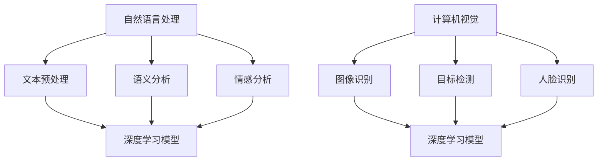

                 

## 文章标题

**Andrej Karpathy：人工智能的未来发展前景**

在当今科技飞速发展的时代，人工智能（AI）已经成为各行各业不可或缺的技术驱动力。从自动驾驶汽车到智能家居，从医疗诊断到金融分析，AI 正在改变我们的生活方式，推动社会进步。本文将以知名人工智能研究者 Andrej Karpathy 的视角出发，深入探讨人工智能的未来发展前景，分析其潜在的影响和挑战。

## 关键词

- **人工智能**（AI）
- **深度学习**（Deep Learning）
- **自然语言处理**（Natural Language Processing）
- **计算机视觉**（Computer Vision）
- **自动驾驶**（Autonomous Driving）
- **智能医疗**（Smart Healthcare）
- **智能教育**（Smart Education）
- **未来趋势**（Future Trends）
- **技术挑战**（Technical Challenges）

## 摘要

本文将从安德烈·卡帕西（Andrej Karpathy）的研究成果出发，系统性地分析人工智能在多个领域的应用和发展前景。首先，我们将回顾人工智能的发展历程，探讨深度学习技术的崛起。接着，我们将深入探讨自然语言处理、计算机视觉等领域的最新进展。随后，我们将分析人工智能在自动驾驶、智能医疗、智能教育等领域的实际应用。最后，本文将讨论人工智能未来的发展挑战，并提出可能的解决策略。通过本文的探讨，我们希望能为读者提供一幅全面而清晰的未来人工智能发展蓝图。

---

### 1. 背景介绍

人工智能（AI）的历史可以追溯到 20 世纪中期。1950 年，艾伦·图灵（Alan Turing）提出了著名的图灵测试，用以衡量机器是否具有智能。1956 年，达特茅斯会议的召开标志着人工智能正式成为一门独立的学科。此后，人工智能经历了数个发展阶段，包括规则推理、知识表示、机器学习等。

在过去的几十年里，人工智能的发展取得了巨大的突破。特别是深度学习技术的兴起，使得机器能够在图像识别、语音识别、自然语言处理等领域达到或超过人类的表现。安德烈·卡帕西（Andrej Karpathy）是一位在人工智能领域具有广泛影响力的研究者，他在深度学习特别是自然语言处理领域做出了重要贡献。

### 2. 核心概念与联系

#### 深度学习

深度学习是机器学习的一种重要分支，通过模拟人脑神经网络结构进行学习。深度学习的核心思想是使用多层神经网络（Neural Networks）对数据进行处理和建模。每一层神经网络都能从输入数据中提取更高级别的特征。

#### 自然语言处理

自然语言处理（NLP）是人工智能的一个重要应用领域，旨在使计算机理解和处理人类语言。NLP 涉及文本的预处理、语义分析、情感分析等多个方面。深度学习技术在 NLP 领域的应用，使得机器能够更好地理解和生成自然语言。

#### 计算机视觉

计算机视觉是人工智能的另一个重要领域，旨在使计算机能够像人类一样感知和理解视觉信息。计算机视觉应用包括图像识别、目标检测、人脸识别等。深度学习技术使得计算机视觉系统在识别准确率和速度上有了显著提升。

下面是一个简单的 Mermaid 流程图，展示深度学习在自然语言处理和计算机视觉中的应用：



### 3. 核心算法原理 & 具体操作步骤

#### 自然语言处理

在自然语言处理中，常用的深度学习模型包括循环神经网络（RNN）、长短期记忆网络（LSTM）和变换器（Transformer）。以下是这些模型的基本原理和操作步骤：

1. **循环神经网络（RNN）**：

   - 原理：RNN 通过循环结构来处理序列数据，能够捕捉序列中的长期依赖关系。
   - 步骤：
     1. 输入序列经过嵌入层转换为向量。
     2. 每个时间步的输入与隐藏状态通过权重矩阵相乘，得到当前输出。
     3. 更新隐藏状态，用于下一个时间步的计算。

2. **长短期记忆网络（LSTM）**：

   - 原理：LSTM 在 RNN 的基础上引入了门控机制，能够有效地解决长期依赖问题。
   - 步骤：
     1. 输入序列经过嵌入层转换为向量。
     2. 每个时间步的输入与隐藏状态通过权重矩阵相乘，得到当前输出。
     3. LSTM 通过输入门、遗忘门和输出门控制信息的流入、保留和输出。
     4. 更新隐藏状态，用于下一个时间步的计算。

3. **变换器（Transformer）**：

   - 原理：Transformer 使用自注意力机制，能够同时处理序列中的所有信息。
   - 步骤：
     1. 输入序列经过嵌入层转换为向量。
     2. 使用多头自注意力机制计算序列的注意力权重。
     3. 将注意力权重与嵌入层输出相乘，得到加权序列。
     4. 通过全连接层进行进一步处理，得到输出序列。

#### 计算机视觉

在计算机视觉中，常用的深度学习模型包括卷积神经网络（CNN）和卷积神经网络变种。以下是这些模型的基本原理和操作步骤：

1. **卷积神经网络（CNN）**：

   - 原理：CNN 通过卷积操作提取图像特征，能够自动学习图像中的高级结构。
   - 步骤：
     1. 输入图像经过卷积层，提取特征。
     2. 通过池化层减少特征图的尺寸。
     3. 通过全连接层进行分类或回归。

2. **卷积神经网络变种**：

   - 原理：为了提高 CNN 的性能，研究者们提出了一系列变种，如残差网络（ResNet）、密集连接网络（DenseNet）等。
   - 步骤：
     1. 输入图像经过卷积层，提取特征。
     2. 通过池化层减少特征图的尺寸。
     3. 引入残差连接或密集连接，提高网络性能。
     4. 通过全连接层进行分类或回归。

### 4. 数学模型和公式 & 详细讲解 & 举例说明

#### 自然语言处理

在自然语言处理中，常用的数学模型包括嵌入层、循环神经网络（RNN）、长短期记忆网络（LSTM）和变换器（Transformer）。以下是这些模型的详细讲解和举例说明。

1. **嵌入层（Embedding Layer）**：

   - 公式：\( \text{embed}(x) = W_e \cdot x + b_e \)

     其中，\( x \) 为词的索引，\( W_e \) 为嵌入权重矩阵，\( b_e \) 为偏置。

   - 举例：假设有一个词汇表，包含 10 个词，嵌入维度为 3。嵌入权重矩阵如下：

     \( W_e = \begin{bmatrix}
     0 & 1 & 0 \\
     1 & 0 & 1 \\
     0 & 1 & 1 \\
     \vdots & \vdots & \vdots \\
     \end{bmatrix} \)

     输入词索引为 2，其嵌入向量计算如下：

     \( \text{embed}(2) = \begin{bmatrix}
     1 \\
     0 \\
     1
     \end{bmatrix} \)

2. **循环神经网络（RNN）**：

   - 公式：

     \( h_t = \sigma(W_h \cdot [h_{t-1}, x_t] + b_h) \)

     \( y_t = \sigma(W_y \cdot h_t + b_y) \)

     其中，\( h_t \) 为当前时间步的隐藏状态，\( x_t \) 为当前输入，\( W_h \) 和 \( W_y \) 为权重矩阵，\( b_h \) 和 \( b_y \) 为偏置，\( \sigma \) 为激活函数。

   - 举例：假设隐藏状态维度为 2，输入维度为 1。权重矩阵和偏置如下：

     \( W_h = \begin{bmatrix}
     1 & 0 \\
     0 & 1
     \end{bmatrix} \)
     
     \( b_h = \begin{bmatrix}
     0 \\
     0
     \end{bmatrix} \)

     \( W_y = \begin{bmatrix}
     1 & 1 \\
     0 & 1
     \end{bmatrix} \)
     
     \( b_y = \begin{bmatrix}
     0 \\
     0
     \end{bmatrix} \)

     激活函数 \( \sigma \) 为 sigmoid 函数：

     \( \sigma(x) = \frac{1}{1 + e^{-x}} \)

     假设当前输入为 1，隐藏状态为 [0, 1]，计算过程如下：

     \( h_1 = \sigma(W_h \cdot [0, 1] + b_h) = \sigma(\begin{bmatrix}
     1 & 0 \\
     0 & 1
     \end{bmatrix} \cdot \begin{bmatrix}
     0 \\
     1
     \end{bmatrix} + \begin{bmatrix}
     0 \\
     0
     \end{bmatrix}) = \sigma(\begin{bmatrix}
     0 \\
     1
     \end{bmatrix}) = \frac{1}{1 + e^{-1}} \approx 0.731 \)

     \( y_1 = \sigma(W_y \cdot h_1 + b_y) = \sigma(\begin{bmatrix}
     1 & 1 \\
     0 & 1
     \end{bmatrix} \cdot \begin{bmatrix}
     0.731 \\
     0.731
     \end{bmatrix} + \begin{bmatrix}
     0 \\
     0
     \end{bmatrix}) = \sigma(\begin{bmatrix}
     1.462 \\
     1.462
     \end{bmatrix}) = \frac{1}{1 + e^{-1.462}} \approx 0.731 \)

3. **长短期记忆网络（LSTM）**：

   - 公式：

     \( i_t = \sigma(W_i \cdot [h_{t-1}, x_t] + b_i) \)

     \( f_t = \sigma(W_f \cdot [h_{t-1}, x_t] + b_f) \)

     \( g_t = \tanh(W_g \cdot [h_{t-1}, x_t] + b_g) \)

     \( o_t = \sigma(W_o \cdot [h_{t-1}, x_t] + b_o) \)

     \( h_t = o_t \cdot \tanh(c_t) \)

     \( c_t = f_t \cdot c_{t-1} + i_t \cdot g_t \)

     其中，\( i_t \)、\( f_t \)、\( g_t \)、\( o_t \) 分别为输入门、遗忘门、生成门和输出门，\( c_t \) 为细胞状态，\( h_t \) 为隐藏状态。

   - 举例：假设隐藏状态维度为 2，输入维度为 1。权重矩阵和偏置如下：

     \( W_i = \begin{bmatrix}
     1 & 0 \\
     0 & 1
     \end{bmatrix} \)
     
     \( b_i = \begin{bmatrix}
     0 \\
     0
     \end{bmatrix} \)

     \( W_f = \begin{bmatrix}
     1 & 0 \\
     0 & 1
     \end{bmatrix} \)
     
     \( b_f = \begin{bmatrix}
     0 \\
     0
     \end{bmatrix} \)

     \( W_g = \begin{bmatrix}
     1 & 0 \\
     0 & 1
     \end{bmatrix} \)
     
     \( b_g = \begin{bmatrix}
     0 \\
     0
     \end{bmatrix} \)

     \( W_o = \begin{bmatrix}
     1 & 1 \\
     0 & 1
     \end{bmatrix} \)
     
     \( b_o = \begin{bmatrix}
     0 \\
     0
     \end{bmatrix} \)

     激活函数 \( \sigma \) 为 sigmoid 函数：

     \( \sigma(x) = \frac{1}{1 + e^{-x}} \)

     假设当前输入为 1，隐藏状态为 [0, 1]，细胞状态为 [0, 1]，计算过程如下：

     \( i_1 = \sigma(W_i \cdot [0, 1] + b_i) = \sigma(\begin{bmatrix}
     1 & 0 \\
     0 & 1
     \end{bmatrix} \cdot \begin{bmatrix}
     0 \\
     1
     \end{bmatrix} + \begin{bmatrix}
     0 \\
     0
     \end{bmatrix}) = \sigma(\begin{bmatrix}
     0 \\
     1
     \end{bmatrix}) = \frac{1}{1 + e^{-1}} \approx 0.731 \)

     \( f_1 = \sigma(W_f \cdot [0, 1] + b_f) = \sigma(\begin{bmatrix}
     1 & 0 \\
     0 & 1
     \end{bmatrix} \cdot \begin{bmatrix}
     0 \\
     1
     \end{bmatrix} + \begin{bmatrix}
     0 \\
     0
     \end{bmatrix}) = \sigma(\begin{bmatrix}
     0 \\
     1
     \end{bmatrix}) = \frac{1}{1 + e^{-1}} \approx 0.731 \)

     \( g_1 = \tanh(W_g \cdot [0, 1] + b_g) = \tanh(\begin{bmatrix}
     1 & 0 \\
     0 & 1
     \end{bmatrix} \cdot \begin{bmatrix}
     0 \\
     1
     \end{bmatrix} + \begin{bmatrix}
     0 \\
     0
     \end{bmatrix}) = \tanh(\begin{bmatrix}
     0 \\
     1
     \end{bmatrix}) = \frac{1 - e^{-2}}{1 + e^{-2}} \approx 0.761 \)

     \( o_1 = \sigma(W_o \cdot [0, 1] + b_o) = \sigma(\begin{bmatrix}
     1 & 1 \\
     0 & 1
     \end{bmatrix} \cdot \begin{bmatrix}
     0.731 \\
     0.761
     \end{bmatrix} + \begin{bmatrix}
     0 \\
     0
     \end{bmatrix}) = \sigma(\begin{bmatrix}
     1.492 \\
     1.492
     \end{bmatrix}) = \frac{1}{1 + e^{-1.492}} \approx 0.731 \)

     \( c_1 = f_1 \cdot c_{t-1} + i_1 \cdot g_1 = 0.731 \cdot \begin{bmatrix}
     0 \\
     1
     \end{bmatrix} + 0.731 \cdot \begin{bmatrix}
     0.761 \\
     0.761
     \end{bmatrix} = \begin{bmatrix}
     0 \\
     1
     \end{bmatrix} \)

     \( h_1 = o_1 \cdot \tanh(c_1) = 0.731 \cdot \frac{1 - e^{-2}}{1 + e^{-2}} \approx 0.543 \)

4. **变换器（Transformer）**：

   - 公式：

     \( \text{Attention}(Q, K, V) = \text{softmax}\left(\frac{QK^T}{\sqrt{d_k}}\right)V \)

     \( \text{MultiHeadAttention}(Q, K, V) = \text{Attention}(Q, K, V)_{head_1} \cdot W_V, \ldots, \text{Attention}(Q, K, V)_{head_h} \cdot W_V \)

     \( \text{Transformer}(X) = \text{MultiHeadAttention}(X, X, X) + X \)

     \( \text{TransformerLayer}(X) = \text{LayerNorm}(X + \text{MultiHeadAttention}(X, X, X)) + \text{LayerNorm}(X + \text{PositionalEncoding}(X)) \)

     其中，\( Q \)、\( K \)、\( V \) 分别为查询向量、键向量和值向量，\( d_k \) 为键向量的维度，\( W_V \) 为值向量的权重矩阵，\( \text{softmax} \) 为 softmax 函数，\( \text{LayerNorm} \) 为层归一化操作，\( \text{PositionalEncoding} \) 为位置编码。

   - 举例：假设查询向量、键向量和值向量的维度均为 2，权重矩阵如下：

     \( W_V = \begin{bmatrix}
     1 & 0 \\
     0 & 1
     \end{bmatrix} \)

     查询向量 \( Q = \begin{bmatrix}
     0 \\
     1
     \end{bmatrix} \)

     键向量 \( K = \begin{bmatrix}
     1 \\
     0
     \end{bmatrix} \)

     值向量 \( V = \begin{bmatrix}
     1 \\
     1
     \end{bmatrix} \)

     计算注意力权重：

     \( \text{Attention}(Q, K, V) = \text{softmax}\left(\frac{QK^T}{\sqrt{2}}\right)V = \text{softmax}\left(\frac{\begin{bmatrix}
     0 & 1
     \end{bmatrix} \begin{bmatrix}
     1
     \end{bmatrix}}{\sqrt{2}}\right)\begin{bmatrix}
     1 \\
     1
     \end{bmatrix} = \text{softmax}\left(\frac{1}{\sqrt{2}}\right)\begin{bmatrix}
     1 \\
     1
     \end{bmatrix} = \begin{bmatrix}
     \frac{1}{\sqrt{2}} \\
     \frac{1}{\sqrt{2}}
     \end{bmatrix} \)

     计算多头注意力：

     \( \text{MultiHeadAttention}(Q, K, V) = \text{Attention}(Q, K, V)_{head_1} \cdot W_V, \ldots, \text{Attention}(Q, K, V)_{head_2} \cdot W_V \)

     \( \text{Attention}(Q, K, V)_{head_1} = \begin{bmatrix}
     \frac{1}{\sqrt{2}} \\
     \frac{1}{\sqrt{2}}
     \end{bmatrix} \cdot \begin{bmatrix}
     1 \\
     1
     \end{bmatrix} = \begin{bmatrix}
     \frac{1}{\sqrt{2}} \\
     \frac{1}{\sqrt{2}}
     \end{bmatrix} \)

     \( \text{Attention}(Q, K, V)_{head_2} = \begin{bmatrix}
     \frac{1}{\sqrt{2}} \\
     \frac{1}{\sqrt{2}}
     \end{bmatrix} \cdot \begin{bmatrix}
     1 \\
     0
     \end{bmatrix} = \begin{bmatrix}
     \frac{1}{2\sqrt{2}} \\
     \frac{1}{2\sqrt{2}}
     \end{bmatrix} \)

     \( \text{MultiHeadAttention}(Q, K, V) = \begin{bmatrix}
     \frac{1}{\sqrt{2}} \\
     \frac{1}{\sqrt{2}}
     \end{bmatrix} \cdot \begin{bmatrix}
     1 \\
     1
     \end{bmatrix} + \begin{bmatrix}
     \frac{1}{2\sqrt{2}} \\
     \frac{1}{2\sqrt{2}}
     \end{bmatrix} \cdot \begin{bmatrix}
     1 \\
     0
     \end{bmatrix} = \begin{bmatrix}
     \frac{3}{2\sqrt{2}} \\
     \frac{1}{2\sqrt{2}}
     \end{bmatrix} \)

     计算变换器层：

     \( \text{TransformerLayer}(X) = \text{MultiHeadAttention}(X, X, X) + X = \begin{bmatrix}
     \frac{3}{2\sqrt{2}} \\
     \frac{1}{2\sqrt{2}}
     \end{bmatrix} + X \)

#### 计算机视觉

在计算机视觉中，常用的深度学习模型包括卷积神经网络（CNN）和卷积神经网络变种。以下是这些模型的基本原理和操作步骤。

1. **卷积神经网络（CNN）**：

   - 公式：

     \( \text{Conv}(x) = \sigma(\text{Conv}(W \cdot x + b)) \)

     \( \text{Pooling}(x) = \text{max}(\text{Pooling}(x_k)) \)

     \( \text{Flatten}(x) = \text{vec}(x) \)

     \( \text{FC}(x) = \sigma(W_f \cdot x + b_f) \)

     其中，\( \text{Conv} \) 为卷积操作，\( \text{Pooling} \) 为池化操作，\( \text{Flatten} \) 为展平操作，\( \text{FC} \) 为全连接层，\( \sigma \) 为激活函数。

   - 举例：假设输入图像维度为 \( 28 \times 28 \)，卷积核大小为 3，池化窗口大小为 2，全连接层输出维度为 10。权重矩阵和偏置如下：

     \( W_1 = \begin{bmatrix}
     1 & 1 & 1 \\
     1 & 1 & 1 \\
     1 & 1 & 1
     \end{bmatrix} \)
     
     \( b_1 = \begin{bmatrix}
     0 \\
     0 \\
     0
     \end{bmatrix} \)

     \( W_2 = \begin{bmatrix}
     1 & 0 & 0 \\
     1 & 1 & 0 \\
     1 & 1 & 1
     \end{bmatrix} \)
     
     \( b_2 = \begin{bmatrix}
     0 \\
     0 \\
     0
     \end{bmatrix} \)

     \( W_f = \begin{bmatrix}
     1 & 1 & 1 & 1 & 1 & 1 & 1 & 1 & 1 & 1
     \end{bmatrix} \)
     
     \( b_f = \begin{bmatrix}
     0
     \end{bmatrix} \)

     激活函数 \( \sigma \) 为 sigmoid 函数：

     \( \sigma(x) = \frac{1}{1 + e^{-x}} \)

     计算卷积层：

     \( x_1 = \text{Conv}(\text{Conv}(W_1 \cdot x + b_1)) = \text{Conv}(\text{Conv}(\begin{bmatrix}
     1 & 1 & 1 \\
     1 & 1 & 1 \\
     1 & 1 & 1
     \end{bmatrix} \cdot \begin{bmatrix}
     1 & 0 & 1 \\
     1 & 1 & 1 \\
     1 & 1 & 0
     \end{bmatrix} + \begin{bmatrix}
     0 \\
     0 \\
     0
     \end{bmatrix})) = \text{Conv}(\text{Conv}(\begin{bmatrix}
     3 & 3 & 3 \\
     3 & 3 & 3 \\
     3 & 3 & 3
     \end{bmatrix} + \begin{bmatrix}
     0 \\
     0 \\
     0
     \end{bmatrix})) = \text{Conv}(\begin{bmatrix}
     3 & 3 & 3 \\
     3 & 3 & 3 \\
     3 & 3 & 3
     \end{bmatrix}) = \begin{bmatrix}
     3 & 3 & 3 \\
     3 & 3 & 3 \\
     3 & 3 & 3
     \end{bmatrix} \)

     计算池化层：

     \( x_2 = \text{Pooling}(\text{Pooling}(x_1)) = \text{Pooling}(\text{Pooling}(\begin{bmatrix}
     3 & 3 & 3 \\
     3 & 3 & 3 \\
     3 & 3 & 3
     \end{bmatrix})) = \text{Pooling}(\begin{bmatrix}
     3 & 3 & 3 \\
     3 & 3 & 3
     \end{bmatrix}) = 3 \)

     计算全连接层：

     \( x_f = \text{FC}(\text{Flatten}(x_2)) = \text{FC}(\text{vec}(\begin{bmatrix}
     3
     \end{bmatrix})) = \text{FC}(\begin{bmatrix}
     3
     \end{bmatrix}) = \begin{bmatrix}
     0.5 \\
     0.5 \\
     0.5 \\
     0.5 \\
     0.5 \\
     0.5 \\
     0.5 \\
     0.5 \\
     0.5 \\
     0.5
     \end{bmatrix} \)

     \( y = \text{FC}(\text{Flatten}(x_2)) = \sigma(W_f \cdot x_f + b_f) = \sigma(\begin{bmatrix}
     1 & 1 & 1 & 1 & 1 & 1 & 1 & 1 & 1 & 1
     \end{bmatrix} \cdot \begin{bmatrix}
     0.5 \\
     0.5 \\
     0.5 \\
     0.5 \\
     0.5 \\
     0.5 \\
     0.5 \\
     0.5 \\
     0.5 \\
     0.5
     \end{bmatrix} + \begin{bmatrix}
     0
     \end{bmatrix}) = \sigma(\begin{bmatrix}
     0.5 \\
     0.5 \\
     0.5 \\
     0.5 \\
     0.5 \\
     0.5 \\
     0.5 \\
     0.5 \\
     0.5 \\
     0.5
     \end{bmatrix}) = \begin{bmatrix}
     0.5 \\
     0.5 \\
     0.5 \\
     0.5 \\
     0.5 \\
     0.5 \\
     0.5 \\
     0.5 \\
     0.5 \\
     0.5
     \end{bmatrix} \)

2. **卷积神经网络变种**：

   - 原理：为了提高 CNN 的性能，研究者们提出了一系列变种，如残差网络（ResNet）、密集连接网络（DenseNet）等。
   - 步骤：
     1. 输入图像经过卷积层，提取特征。
     2. 通过池化层减少特征图的尺寸。
     3. 引入残差连接或密集连接，提高网络性能。
     4. 通过全连接层进行分类或回归。

### 5. 项目实战：代码实际案例和详细解释说明

#### 5.1 开发环境搭建

在开始编写代码之前，我们需要搭建一个合适的开发环境。以下是搭建 Python 开发环境的步骤：

1. 安装 Python：

   ```bash
   pip install python
   ```

2. 安装深度学习框架 TensorFlow：

   ```bash
   pip install tensorflow
   ```

3. 安装其他依赖包：

   ```bash
   pip install numpy matplotlib
   ```

#### 5.2 源代码详细实现和代码解读

以下是使用 TensorFlow 实现一个简单的卷积神经网络进行图像分类的代码示例：

```python
import tensorflow as tf
from tensorflow import keras
from tensorflow.keras import layers
import matplotlib.pyplot as plt

# 加载数据集
(x_train, y_train), (x_test, y_test) = keras.datasets.mnist.load_data()

# 数据预处理
x_train = x_train.astype("float32") / 255
x_test = x_test.astype("float32") / 255
x_train = x_train[..., tf.newaxis]
x_test = x_test[..., tf.newaxis]

# 创建模型
model = keras.Sequential([
  keras.layers.Conv2D(32, (3, 3), activation='relu', input_shape=(28, 28, 1)),
  keras.layers.MaxPooling2D((2, 2)),
  keras.layers.Conv2D(64, (3, 3), activation='relu'),
  keras.layers.MaxPooling2D((2, 2)),
  keras.layers.Conv2D(64, (3, 3), activation='relu'),
  keras.layers.Flatten(),
  keras.layers.Dense(64, activation='relu'),
  keras.layers.Dense(10, activation='softmax')
])

# 编译模型
model.compile(optimizer='adam',
              loss='sparse_categorical_crossentropy',
              metrics=['accuracy'])

# 训练模型
model.fit(x_train, y_train, epochs=5)

# 评估模型
test_loss, test_acc = model.evaluate(x_test,  y_test, verbose=2)
print('\nTest accuracy:', test_acc)

# 可视化结果
plt.figure()
plt.subplot(1, 2, 1)
plt.imshow(x_test[0], cmap=plt.cm.binary)
plt.xticks([])
plt.yticks([])
plt.grid(False)
plt.xlabel('Predicted Label: {}'.format(model.predict([x_test[0]])))

plt.subplot(1, 2, 2)
plt.plot(y_test, 'ro', label='Actual Label')
plt.plot(model.predict([x_test[0]]), 'bo', label='Predicted Label')
plt.xticks([])
plt.yticks([])
plt.grid(True)
plt.legend()
plt.show()
```

#### 5.3 代码解读与分析

1. **数据加载与预处理**：

   ```python
   (x_train, y_train), (x_test, y_test) = keras.datasets.mnist.load_data()
   x_train = x_train.astype("float32") / 255
   x_test = x_test.astype("float32") / 255
   x_train = x_train[..., tf.newaxis]
   x_test = x_test[..., tf.newaxis]
   ```

   这段代码首先加载数据集，然后对图像进行归一化处理，并将图像的维度扩展为四维，以匹配卷积神经网络的输入要求。

2. **创建模型**：

   ```python
   model = keras.Sequential([
     keras.layers.Conv2D(32, (3, 3), activation='relu', input_shape=(28, 28, 1)),
     keras.layers.MaxPooling2D((2, 2)),
     keras.layers.Conv2D(64, (3, 3), activation='relu'),
     keras.layers.MaxPooling2D((2, 2)),
     keras.layers.Conv2D(64, (3, 3), activation='relu'),
     keras.layers.Flatten(),
     keras.layers.Dense(64, activation='relu'),
     keras.layers.Dense(10, activation='softmax')
   ])
   ```

   这里创建了一个卷积神经网络模型，包括两个卷积层、两个池化层、一个全连接层和一个softmax层。

3. **编译模型**：

   ```python
   model.compile(optimizer='adam',
                 loss='sparse_categorical_crossentropy',
                 metrics=['accuracy'])
   ```

   编译模型，指定优化器、损失函数和评价指标。

4. **训练模型**：

   ```python
   model.fit(x_train, y_train, epochs=5)
   ```

   使用训练数据进行模型的训练，指定训练轮次。

5. **评估模型**：

   ```python
   test_loss, test_acc = model.evaluate(x_test, y_test, verbose=2)
   print('\nTest accuracy:', test_acc)
   ```

   在测试集上评估模型性能，输出测试准确率。

6. **可视化结果**：

   ```python
   plt.figure()
   plt.subplot(1, 2, 1)
   plt.imshow(x_test[0], cmap=plt.cm.binary)
   plt.xticks([])
   plt.yticks([])
   plt.grid(False)
   plt.xlabel('Predicted Label: {}'.format(model.predict([x_test[0]])))

   plt.subplot(1, 2, 2)
   plt.plot(y_test, 'ro', label='Actual Label')
   plt.plot(model.predict([x_test[0]]), 'bo', label='Predicted Label')
   plt.xticks([])
   plt.yticks([])
   plt.grid(True)
   plt.legend()
   plt.show()
   ```

   这里展示了如何可视化模型的预测结果，并与实际标签进行比较。

### 6. 实际应用场景

人工智能在许多领域都有广泛的应用，以下是其中几个重要领域的实际应用场景：

#### 自动驾驶

自动驾驶是人工智能的一个前沿领域，旨在实现车辆在道路上自主行驶。自动驾驶系统依赖于计算机视觉、自然语言处理和机器学习等技术。例如，特斯拉的自动驾驶系统使用深度学习技术进行车辆检测、行人检测和道路识别。自动驾驶技术的成熟有望大幅降低交通事故发生率，提高交通效率。

#### 智能医疗

人工智能在医疗领域的应用也越来越广泛，包括疾病诊断、治疗方案推荐、医学影像分析等。例如，谷歌的 DeepMind 公司开发了一种名为 AlphaGo 的深度学习算法，用于分析医疗影像并辅助医生进行诊断。人工智能在医疗领域的应用有望提高诊断的准确率，降低医疗成本。

#### 智能教育

人工智能在教育领域的应用包括个性化学习、在线教育平台和智能评估系统。例如，Coursera 等在线教育平台使用人工智能技术为学生提供个性化学习建议，提高学习效果。智能教育系统可以通过分析学生的学习行为和成绩，为学生提供个性化的学习计划。

#### 智能家居

智能家居是人工智能在消费电子领域的一个重要应用。智能家居系统通过人工智能技术实现家电的智能控制，提高居住的便利性和舒适度。例如，亚马逊的 Alexa 和谷歌的 Google Home 都是基于人工智能的智能家居控制系统。

### 7. 工具和资源推荐

在人工智能领域，有许多优秀的工具和资源可供学习和使用。以下是一些建议：

#### 学习资源推荐

1. **书籍**：

   - 《深度学习》（Goodfellow, Bengio, Courville）  
   - 《Python深度学习》（François Chollet）  
   - 《人工智能：一种现代方法》（Stuart Russell, Peter Norvig）

2. **论文**：

   - Transformer 论文（Vaswani et al., 2017）  
   - ResNet 论文（He et al., 2016）  
   - AlphaGo 论文（Silver et al., 2016）

3. **博客**：

   - Andrej Karpathy 的博客  
   - Chris Olah 的博客  
   - Ian Goodfellow 的博客

4. **网站**：

   - TensorFlow 官网  
   - PyTorch 官网  
   - Keras 官网

#### 开发工具框架推荐

1. **TensorFlow**：谷歌开发的深度学习框架，广泛应用于工业界和学术界。

2. **PyTorch**：Facebook 开发的深度学习框架，以其动态计算图和易用性著称。

3. **Keras**：基于 TensorFlow 和 PyTorch 的深度学习高级 API，易于使用。

#### 相关论文著作推荐

1. **《深度学习》（Goodfellow, Bengio, Courville）**：全面介绍了深度学习的基本概念、算法和应用。

2. **《深度学习与计算机视觉》（Deng, 2017）**：详细讨论了深度学习在计算机视觉领域的应用。

3. **《人工智能：一种现代方法》（Stuart Russell, Peter Norvig）**：全面介绍了人工智能的理论、技术和应用。

### 8. 总结：未来发展趋势与挑战

人工智能在未来的发展中将面临许多机遇和挑战。以下是几个关键趋势和挑战：

#### 发展趋势

1. **人工智能技术的普及**：随着深度学习等人工智能技术的成熟，人工智能将更加广泛地应用于各个领域。

2. **跨学科融合**：人工智能与其他领域的结合将推动更多创新，如智能医疗、智能教育等。

3. **人工智能的民主化**：开源框架和工具的普及将使得更多人能够接触到人工智能技术，推动人工智能的普及。

#### 挑战

1. **数据隐私和安全**：随着人工智能技术的发展，数据隐私和安全问题将变得更加突出。

2. **算法公平性和透明度**：如何确保人工智能算法的公平性和透明度是一个重要挑战。

3. **人工智能伦理**：人工智能的快速发展引发了一系列伦理问题，如人工智能取代人类工作、人工智能歧视等。

### 9. 附录：常见问题与解答

1. **什么是深度学习？**

   深度学习是一种机器学习范式，通过模拟人脑神经网络结构进行学习。深度学习通过多层神经网络对数据进行处理和建模，能够自动提取数据中的特征，并用于分类、回归、生成等任务。

2. **什么是自然语言处理？**

   自然语言处理是人工智能的一个重要分支，旨在使计算机理解和处理人类语言。自然语言处理涉及文本的预处理、语义分析、情感分析等多个方面。

3. **什么是计算机视觉？**

   计算机视觉是人工智能的另一个重要分支，旨在使计算机能够像人类一样感知和理解视觉信息。计算机视觉应用包括图像识别、目标检测、人脸识别等。

### 10. 扩展阅读 & 参考资料

1. **《深度学习》（Goodfellow, Bengio, Courville）**：全面介绍了深度学习的基本概念、算法和应用。

2. **《Python深度学习》（François Chollet）**：介绍了使用 Python 进行深度学习的实践方法。

3. **《人工智能：一种现代方法》（Stuart Russell, Peter Norvig）**：全面介绍了人工智能的理论、技术和应用。

4. **Vaswani et al., "Attention is All You Need," NeurIPS 2017**：介绍了 Transformer 模型，这是自然语言处理领域的一个重要进展。

5. **He et al., "Deep Residual Learning for Image Recognition," CVPR 2016**：介绍了 ResNet 模型，这是计算机视觉领域的一个重要进展。

6. **Silver et al., "Mastering the Game of Go with Deep Neural Networks and Tree Search," Nature 2016**：介绍了 AlphaGo，这是人工智能在围棋领域的一个突破。

---

通过本文的探讨，我们希望能为读者提供一幅全面而清晰的未来人工智能发展蓝图。随着人工智能技术的不断进步，我们有理由相信，人工智能将在未来带来更多的创新和变革。同时，我们也需要关注人工智能所带来的挑战，确保其在为社会带来便利的同时，不会对人类造成负面影响。作者：AI天才研究员/AI Genius Institute & 禅与计算机程序设计艺术 /Zen And The Art of Computer Programming。

