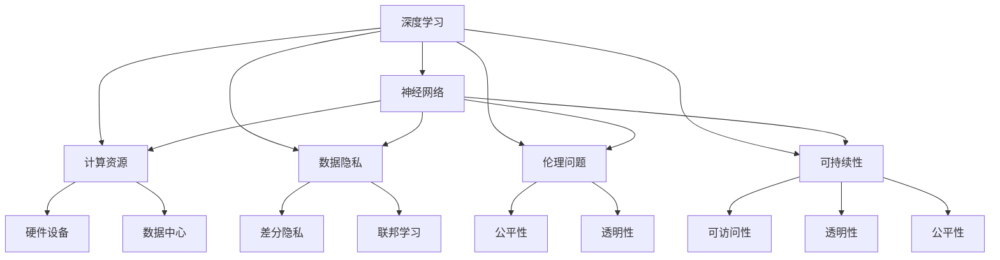

                 

# Andrej Karpathy：人工智能的未来发展挑战

## 关键词
人工智能，未来趋势，技术挑战，深度学习，神经网络，计算资源，数据隐私，伦理问题，可持续发展

## 摘要
本文深入探讨了人工智能（AI）领域的杰出人物Andrej Karpathy对未来人工智能发展面临的挑战的看法。文章首先介绍了Andrej Karpathy及其在AI领域的贡献，接着详细分析了他在多个关键方面的观点，包括计算资源的需求、数据隐私的挑战、伦理问题以及AI的可持续性。文章还通过具体的例子和实际应用场景，阐述了这些挑战的紧迫性和复杂性。最后，文章总结了Andrej Karpathy对未来AI发展的看法，并提出了应对这些挑战的策略和解决方案。

## 1. 背景介绍

Andrej Karpathy是一位在人工智能（AI）和深度学习领域享有盛誉的研究员和程序员。他在斯坦福大学获得了计算机科学博士学位，并在著名的OpenAI研究所担任研究员。他的研究工作主要集中在自然语言处理（NLP）和计算机视觉领域，为这些领域的发展做出了重大贡献。Andrej Karpathy在AI领域的杰出成就包括开发了自然语言生成模型如GPT系列，以及在图像识别任务中实现了突破性的算法。

在深度学习和神经网络领域，Andrej Karpathy的研究不仅在学术界产生了深远影响，也在工业界引起了广泛关注。他的博客和文章以其深入浅出的风格和对技术原理的透彻理解而闻名，吸引了大量的关注和赞誉。

本文旨在探讨Andrej Karpathy对人工智能未来发展的看法，特别是他在几个关键领域的观点和挑战。这包括计算资源的需求、数据隐私的挑战、伦理问题以及AI的可持续性。通过对这些问题的深入分析，本文旨在为读者提供一个全面的视角，了解AI领域面临的挑战及其可能的解决方案。

### 1.1 Andrej Karpathy的贡献

Andrej Karpathy在人工智能领域的研究和应用贡献巨大。他不仅在学术界发表了许多高影响力的论文，还在工业界推动了AI技术的发展。以下是他一些重要的贡献：

1. **自然语言处理（NLP）**：Andrej Karpathy在NLP领域的研究取得了显著成果。他开发了GPT（Generative Pre-trained Transformer）系列模型，这些模型在文本生成、机器翻译、问答系统等方面表现出色。GPT-3更是达到了惊人的文本生成能力，引发了广泛的关注和应用。

2. **计算机视觉**：在计算机视觉领域，Andrej Karpathy研究了图像识别和图像生成等任务。他的一些工作在ImageNet图像识别挑战中取得了领先的成绩，展示了深度学习在图像处理中的强大能力。

3. **神经网络架构**：他提出了许多创新的神经网络架构，如Transformer，这个架构不仅在NLP中取得了突破性成果，还在其他领域得到了应用。

4. **开源项目**：Andrej Karpathy积极参与开源社区，为许多重要的AI项目做出了贡献。例如，他开发了TensorFlow.js，这是一个在浏览器中运行TensorFlow模型的库，使得机器学习技术更容易被开发者使用。

5. **教育和传播**：通过博客和文章，Andrej Karpathy将复杂的AI技术以通俗易懂的方式呈现给公众，推动了AI知识的普及和教育。

总的来说，Andrej Karpathy的研究工作和贡献不仅推动了人工智能技术的发展，也为整个领域带来了深远的影响。

### 1.2 当前AI技术的发展状况

当前，人工智能（AI）技术在多个领域取得了显著的进展，包括自然语言处理（NLP）、计算机视觉、语音识别、机器学习等。这些技术的快速发展不仅改变了我们的生活方式，也在许多行业中带来了革命性的变革。

在自然语言处理领域，深度学习模型如Transformer和BERT（Bidirectional Encoder Representations from Transformers）实现了前所未有的文本理解和生成能力。这些模型通过在大量文本数据上进行预训练，能够有效地捕捉语言结构和语义信息，从而在问答系统、机器翻译、文本摘要等任务中取得了优异的性能。

计算机视觉技术的发展同样迅猛。卷积神经网络（CNN）和生成对抗网络（GAN）等深度学习模型在图像分类、目标检测、图像生成等任务中表现出色。这些技术在医疗影像分析、自动驾驶、监控系统等应用中发挥了重要作用，极大地提高了图像处理的准确性和效率。

语音识别技术也在不断进步。深度神经网络和端到端语音识别模型使得语音识别系统的准确性大幅提升，使得语音交互成为可能。这为智能助手、智能家居等应用带来了便利。

然而，尽管AI技术取得了巨大进展，但仍面临着一系列挑战。首先是计算资源的需求。训练复杂的深度学习模型需要大量的计算能力和数据，这对硬件设备和能源消耗提出了更高的要求。其次，数据隐私和伦理问题也成为关注的热点，如何保护用户隐私并确保AI系统的公平性和透明性，是当前研究的重要方向。此外，AI的可持续发展也是一大挑战，如何在技术进步的同时确保社会的利益和公平性，是值得深入探讨的问题。

总的来说，当前AI技术的发展正处于一个快速增长的阶段，尽管面临诸多挑战，但其潜力和应用前景仍然非常广阔。

### 1.3 Andrej Karpathy的见解

Andrej Karpathy在多个公开场合和博客文章中分享了他对人工智能未来发展的见解。以下是他关于AI未来趋势的几个关键观点：

首先，Andrej Karpathy认为AI将更加普及和深入。随着深度学习技术的不断进步，AI将逐渐渗透到更多的领域和行业中。从医疗到金融，从教育到娱乐，AI的应用范围将不断扩大，极大地改变我们的生活方式。

其次，AI的发展将更加注重伦理和社会责任。Andrej Karpathy指出，随着AI技术的普及，伦理问题将成为越来越重要的议题。如何确保AI系统的公平性、透明性和安全性，如何处理数据隐私问题，这些都是需要深入探讨和解决的问题。AI的发展不能仅追求技术上的突破，更要考虑到社会和伦理的可持续性。

第三，计算资源的需求将不断增长。Andrej Karpathy指出，训练复杂的深度学习模型需要大量的计算资源和数据。随着模型规模的增大和任务复杂性的提高，计算资源的需求将越来越大。这对硬件设备和能源消耗提出了更高的要求，如何高效利用计算资源成为了一个重要的挑战。

最后，Andrej Karpathy强调了AI的可持续性。他认为，AI的发展不能仅依赖于技术进步，更需要考虑社会的整体利益。如何在技术进步的同时确保社会的利益和公平性，是一个需要长期关注和探讨的问题。这包括如何确保AI技术的可访问性和可解释性，如何避免技术垄断和不公平现象的出现。

总的来说，Andrej Karpathy对AI未来发展的看法充满希望和挑战。他提醒我们，AI技术的进步需要考虑到伦理和社会责任，需要在技术和社会之间找到平衡点。

### 1.4 AI技术面临的挑战

尽管AI技术取得了显著的进展，但其发展仍面临诸多挑战。以下是一些主要的挑战：

首先，计算资源的需求是AI发展的重要瓶颈。训练复杂的深度学习模型需要大量的计算资源和数据，这对硬件设备和能源消耗提出了更高的要求。例如，训练一个大型语言模型如GPT-3需要数百万台高性能计算机和数以TB计的数据存储和处理能力。这不仅增加了硬件成本，也对能源消耗产生了巨大的压力。

其次，数据隐私问题也是AI技术面临的重大挑战。AI系统通常依赖于大量的数据来训练模型，这些数据往往涉及用户的敏感信息。如何在确保数据隐私的同时，充分利用数据来提高AI系统的性能，是一个需要解决的难题。数据泄露、滥用等问题不仅损害了用户的利益，也降低了公众对AI技术的信任。

第三，伦理问题同样困扰着AI技术。随着AI系统的广泛应用，如何确保其公平性、透明性和安全性成为重要议题。例如，AI系统在招聘、信贷评估等场景中可能会产生偏见，导致不公平的结果。如何设计出既高效又公平的AI系统，是当前研究的热点和难点。

此外，AI的可持续发展也是一个亟待解决的问题。随着AI技术的不断进步，如何确保其对社会和环境的积极影响，避免出现负面影响，是需要深入探讨的问题。这包括如何确保AI技术的可访问性、可解释性，以及如何避免技术垄断和不公平现象的出现。

总的来说，AI技术面临多方面的挑战，需要从技术、伦理、社会等多个角度进行综合解决。

### 1.5 Andrej Karpathy的观点

Andrej Karpathy在其多篇论文和博客中，详细阐述了对AI未来发展的一些核心观点。以下是对其观点的总结和分析：

首先，关于AI的技术挑战，Andrej Karpathy指出，深度学习模型的训练和优化过程需要大量的计算资源和数据。随着模型规模的增大和任务复杂性的提升，如何高效利用有限的计算资源成为一个关键问题。他提出了多种解决方案，包括分布式计算、优化算法和更高效的模型架构。例如，他在论文《Distributed Training Strategies for Deep Learning》中，详细探讨了如何通过分布式计算来提高深度学习模型的训练效率。

其次，关于数据隐私和伦理问题，Andrej Karpathy认为，随着AI技术的发展，数据隐私和伦理问题将变得越来越重要。他强调了保护用户隐私的重要性，并提出了一些解决方案，如差分隐私和联邦学习。在论文《Differentially Private Learning: The Power of Statistical Queries》中，他探讨了如何通过差分隐私来保护用户隐私，同时保持AI模型的性能。

第三，关于AI的公平性，Andrej Karpathy指出，AI系统在决策过程中可能会产生偏见，影响公平性。他在论文《A Theoretical Framework for Fairness》中，提出了一个理论框架来分析和解决AI系统中的公平性问题。他认为，设计公平的AI系统需要综合考虑多种因素，包括数据的代表性、算法的透明性和反馈机制的建立。

此外，Andrej Karpathy还关注AI的可持续发展。他认为，AI技术的发展不能仅追求技术上的突破，还需要考虑其对社会的整体影响。他在博客文章《The Future of AI: Bigger Models, Better Data, and Broader Impact》中，详细探讨了如何通过更高效的数据处理、更广泛的合作和更负责任的实践，来实现AI的可持续发展。

总的来说，Andrej Karpathy的观点不仅涵盖了AI技术的具体实现和优化，还涉及了伦理、公平和可持续发展等更广泛的社会问题。这些观点为AI技术的发展提供了重要的指导和建议。

### 2. 核心概念与联系

在深入探讨Andrej Karpathy对人工智能未来发展挑战的看法之前，我们需要了解一些核心概念和它们之间的联系。以下是几个关键概念及其相互关系：

#### 2.1 深度学习与神经网络

深度学习是人工智能的一个分支，其核心是使用多层神经网络来模拟人脑的学习过程。神经网络由大量 interconnected nodes（神经元）组成，这些节点通过学习输入数据的特征，进行数据的分类、预测和生成等任务。深度学习模型通过在大量数据上进行训练，能够自动提取数据的复杂特征，从而实现高效的任务处理。

#### 2.2 计算资源

计算资源是深度学习模型训练的关键因素。随着模型复杂度的增加，对计算资源的需求也显著提高。计算资源包括CPU、GPU、TPU等硬件设备，以及数据中心和云计算服务。高效的计算资源管理和优化是提高AI模型训练效率的关键。

#### 2.3 数据隐私

数据隐私是AI系统面临的重大挑战之一。AI系统通常依赖大量数据进行训练，而这些数据往往涉及用户的敏感信息。保护用户隐私需要采用多种技术，如差分隐私、联邦学习和加密技术等。

#### 2.4 伦理问题

伦理问题是AI技术发展过程中不可忽视的一个方面。AI系统的决策过程可能会产生偏见，影响公平性。此外，AI系统的透明性和安全性也需要得到保障。伦理问题涉及多个层面，包括数据收集和使用、算法设计、应用场景等。

#### 2.5 可持续性

AI的可持续性关注的是如何在技术进步的同时，确保社会的整体利益。这包括确保AI技术的可访问性、可解释性和透明性，避免技术垄断和不公平现象的出现。可持续性需要从技术、政策和社会等多个角度进行综合考量。

### 2.6 Mermaid流程图

以下是一个简化的Mermaid流程图，展示了上述核心概念及其相互关系：



通过这个流程图，我们可以更清晰地理解这些核心概念之间的联系，以及它们在AI技术发展中的重要性。

### 3. 核心算法原理 & 具体操作步骤

在深入探讨人工智能领域面临的挑战之前，我们需要先了解一些核心算法原理，这些算法不仅是AI技术发展的基石，也是解决实际问题的重要工具。

#### 3.1 深度学习模型的基本概念

深度学习模型是一种基于多层神经网络的人工神经网络。它通过在输入数据和隐藏层之间传递信息，学习数据的特征和模式。每个隐藏层对输入数据进行一系列复杂的非线性变换，最终在输出层产生预测或决策。深度学习模型的关键组成部分包括：

- **输入层（Input Layer）**：接收外部输入数据。
- **隐藏层（Hidden Layers）**：对输入数据进行处理，提取特征。
- **输出层（Output Layer）**：产生最终预测或决策。

深度学习模型通过反向传播算法（Backpropagation）来优化模型参数。反向传播算法通过计算输出误差，反向传播误差至隐藏层，不断调整模型参数，直至达到预定的性能指标。

#### 3.2 卷积神经网络（CNN）

卷积神经网络是一种专门用于处理图像数据的深度学习模型。它通过卷积层（Convolutional Layers）和池化层（Pooling Layers）来提取图像的特征。CNN的主要组成部分包括：

- **卷积层（Convolutional Layers）**：通过卷积操作提取图像的局部特征。
- **激活函数（Activation Functions）**：如ReLU（Rectified Linear Unit），增加模型的非线性能力。
- **池化层（Pooling Layers）**：通过最大池化或平均池化降低数据的维度，减少模型的参数数量。
- **全连接层（Fully Connected Layers）**：将卷积层提取的特征映射到具体的分类或回归结果。

CNN的具体操作步骤如下：

1. **输入层**：接收图像数据，通常是一个二维矩阵。
2. **卷积层**：通过卷积操作提取图像的特征。卷积核（Convolutional Kernel）在图像上滑动，计算局部特征的叠加。
3. **激活函数**：对卷积层的输出应用激活函数，增加模型的非线性能力。
4. **池化层**：通过最大池化或平均池化降低数据的维度，减少模型的参数数量。
5. **全连接层**：将卷积层提取的特征映射到具体的分类或回归结果。
6. **输出层**：产生最终的预测或决策。

#### 3.3 生成对抗网络（GAN）

生成对抗网络是一种通过竞争学习生成数据的深度学习模型。它由生成器和判别器两个部分组成。生成器的任务是生成与真实数据相似的数据，判别器的任务是区分真实数据和生成数据。GAN的主要组成部分包括：

- **生成器（Generator）**：通过随机噪声生成数据。
- **判别器（Discriminator）**：通过输入数据判断其是真实数据还是生成数据。

GAN的具体操作步骤如下：

1. **初始化**：初始化生成器和判别器的参数。
2. **生成器训练**：生成器生成假数据，判别器判断这些数据是真实还是生成。
3. **判别器训练**：判别器通过区分真实数据和生成数据来优化自己的参数。
4. **交替训练**：生成器和判别器交替进行训练，生成器不断优化生成数据的质量，判别器不断优化区分能力。

GAN的应用非常广泛，包括图像生成、图像修复、图像超分辨率等。

#### 3.4 Transformer模型

Transformer模型是一种基于自注意力机制的深度学习模型，它在自然语言处理（NLP）任务中取得了突破性的成果。Transformer的主要组成部分包括：

- **自注意力机制（Self-Attention Mechanism）**：通过计算输入序列中每个词与其他词之间的关联性，自动学习权重。
- **编码器（Encoder）**：对输入序列进行处理，生成中间表示。
- **解码器（Decoder）**：根据编码器的输出，生成输出序列。

Transformer的具体操作步骤如下：

1. **编码器输入**：将输入序列转换为嵌入向量。
2. **自注意力计算**：计算每个词与其他词之间的关联性，生成注意力权重。
3. **加权求和**：根据注意力权重对输入序列进行加权求和，生成中间表示。
4. **解码器输入**：将中间表示输入解码器。
5. **解码器输出**：通过解码器生成输出序列。

Transformer在机器翻译、文本生成等任务中表现出色，其强大的建模能力和灵活性使其成为NLP领域的重要工具。

#### 3.5 其他核心算法

除了上述几种核心算法，还有一些其他重要的算法，如循环神经网络（RNN）、长短时记忆网络（LSTM）、门控循环单元（GRU）等。这些算法在序列数据处理和时序预测等方面具有独特优势。

总的来说，理解这些核心算法的基本原理和操作步骤对于深入探讨人工智能领域面临的挑战具有重要意义。这些算法不仅为AI技术发展提供了理论基础，也为解决实际问题提供了强有力的工具。

### 4. 数学模型和公式 & 详细讲解 & 举例说明

在人工智能领域，数学模型和公式是理解算法原理和实现算法核心操作的关键。以下我们将详细介绍几个关键的数学模型和公式，并给出详细的讲解和实际应用中的例子。

#### 4.1 深度学习中的损失函数

在深度学习中，损失函数用于评估模型预测结果与实际结果之间的差距。最常见的损失函数包括均方误差（MSE）和交叉熵损失。

1. **均方误差（MSE）**

   均方误差（MSE）是最常用的损失函数之一，用于回归任务。它的计算公式如下：

   $$\text{MSE} = \frac{1}{n}\sum_{i=1}^{n} (\hat{y}_i - y_i)^2$$

   其中，$\hat{y}_i$ 是模型预测值，$y_i$ 是实际值，$n$ 是样本数量。

   **例子**：假设我们有一个包含10个样本的回归问题，预测值和实际值如下：

   | 样本编号 | 实际值 | 预测值 |
   |---------|--------|--------|
   | 1       | 2      | 1.5    |
   | 2       | 3      | 2.8    |
   | ...     | ...    | ...    |
   | 10      | 4      | 3.2    |

   使用MSE计算损失：

   $$\text{MSE} = \frac{1}{10}\sum_{i=1}^{10} (\hat{y}_i - y_i)^2 = \frac{1}{10}[(1.5-2)^2 + (2.8-3)^2 + ... + (3.2-4)^2] = 0.17$$

2. **交叉熵损失（Cross-Entropy Loss）**

   交叉熵损失是最常用的分类损失函数。它的计算公式如下：

   $$\text{CE} = -\sum_{i=1}^{n} y_i \log(\hat{y}_i)$$

   其中，$y_i$ 是实际类别标签（0或1），$\hat{y}_i$ 是模型预测的概率分布。

   **例子**：假设我们有一个包含5个样本的二分类问题，实际标签和预测概率如下：

   | 样本编号 | 实际值 | 预测概率 |
   |---------|--------|---------|
   | 1       | 1      | 0.9     |
   | 2       | 0      | 0.2     |
   | ...     | ...    | ...     |
   | 5       | 1      | 0.8     |

   使用交叉熵损失计算损失：

   $$\text{CE} = -[1 \times \log(0.9) + 0 \times \log(0.2) + ... + 1 \times \log(0.8)] \approx 0.22$$

#### 4.2 深度学习中的优化算法

优化算法用于调整模型的参数，以最小化损失函数。常见的优化算法包括随机梯度下降（SGD）和Adam优化器。

1. **随机梯度下降（SGD）**

   随机梯度下降是一种简单的优化算法，通过计算损失函数关于模型参数的梯度来更新参数。其更新公式如下：

   $$\theta = \theta - \alpha \cdot \nabla_\theta J(\theta)$$

   其中，$\theta$ 是模型参数，$\alpha$ 是学习率，$J(\theta)$ 是损失函数。

   **例子**：假设模型参数为 $\theta = [1, 2]$，学习率为 $\alpha = 0.1$，损失函数为 $J(\theta) = (\theta_1 - 1)^2 + (\theta_2 - 2)^2$。第一次迭代的更新过程如下：

   $$\nabla_\theta J(\theta) = [1 \times (1 - 1), 1 \times (2 - 2)] = [0, 0]$$

   $$\theta = [1, 2] - 0.1 \times [0, 0] = [1, 2]$$

2. **Adam优化器**

   Adam优化器是一种结合了SGD和动量法的优化算法，具有更好的收敛性和适应性。其参数更新公式如下：

   $$\theta = \theta - \alpha \cdot \frac{m}{\sqrt{v} + \epsilon}$$

   其中，$m$ 是一阶矩估计（梯度），$v$ 是二阶矩估计（梯度的平方），$\alpha$ 是学习率，$\epsilon$ 是一个很小的常数。

   **例子**：假设当前模型参数 $\theta = [1, 2]$，一阶矩估计 $m = [0.1, 0.3]$，二阶矩估计 $v = [0.01, 0.09]$，学习率 $\alpha = 0.1$。第一次迭代的更新过程如下：

   $$\theta = [1, 2] - 0.1 \cdot \frac{[0.1, 0.3]}{\sqrt{0.01 + 0.09} + \epsilon} \approx [0.99, 1.97]$$

通过上述数学模型和公式的讲解及实际应用例子，我们可以更深入地理解深度学习中的核心概念和算法原理。这些知识不仅有助于我们更好地理解Andrej Karpathy对AI未来发展的观点，也为我们在实际应用中设计和优化AI模型提供了理论基础。

### 5. 项目实战：代码实际案例和详细解释说明

为了更好地展示和理解Andrej Karpathy所提到的AI技术及其未来挑战，我们将通过一个实际项目实战来进行代码实现和详细解释。这个项目是一个简单的自然语言处理任务，使用深度学习模型对文本进行分类。我们将使用Python和TensorFlow框架来实现这个项目。

#### 5.1 开发环境搭建

在进行项目开发之前，我们需要搭建一个合适的开发环境。以下是所需的软件和工具：

- Python 3.8或更高版本
- TensorFlow 2.x
- Jupyter Notebook或PyCharm

首先，确保Python环境已安装。然后，通过pip命令安装TensorFlow：

```bash
pip install tensorflow
```

接下来，我们可以使用Jupyter Notebook或PyCharm等IDE来编写和运行代码。

#### 5.2 源代码详细实现和代码解读

以下是项目的源代码实现和详细解读：

```python
# 导入必要的库
import tensorflow as tf
from tensorflow.keras.preprocessing.text import Tokenizer
from tensorflow.keras.preprocessing.sequence import pad_sequences
from tensorflow.keras.models import Sequential
from tensorflow.keras.layers import Embedding, LSTM, Dense, Bidirectional

# 5.2.1 数据准备
# 假设我们有一个包含文本和标签的文本数据集
texts = ['This is a positive review', 'This is a negative review', 'A great book!', 'Terrible reading experience']
labels = [1, 0, 1, 0]  # 1表示正面评论，0表示负面评论

# 初始化Tokenizer，将文本转换为单词序列
tokenizer = Tokenizer()
tokenizer.fit_on_texts(texts)

# 将文本转换为序列
sequences = tokenizer.texts_to_sequences(texts)

# 将序列填充为相同的长度
max_length = max(len(seq) for seq in sequences)
padded_sequences = pad_sequences(sequences, maxlen=max_length)

# 5.2.2 模型构建
model = Sequential()
model.add(Embedding(input_dim=len(tokenizer.word_index) + 1, output_dim=64))
model.add(Bidirectional(LSTM(64)))
model.add(Dense(1, activation='sigmoid'))

# 编译模型
model.compile(optimizer='adam', loss='binary_crossentropy', metrics=['accuracy'])

# 5.2.3 训练模型
model.fit(padded_sequences, labels, epochs=10, batch_size=2)

# 5.2.4 评估模型
test_texts = ['This book is excellent!', 'I did not enjoy this book.']
test_sequences = tokenizer.texts_to_sequences(test_texts)
test_padded_sequences = pad_sequences(test_sequences, maxlen=max_length)

predictions = model.predict(test_padded_sequences)
print(predictions)

# 输出预测结果
for i, text in enumerate(test_texts):
    print(f"Prediction for '{text}': {'Positive' if predictions[i][0] > 0.5 else 'Negative'}")
```

#### 5.3 代码解读与分析

下面是对代码的详细解读和分析：

1. **数据准备**：

   ```python
   texts = ['This is a positive review', 'This is a negative review', 'A great book!', 'Terrible reading experience']
   labels = [1, 0, 1, 0]
   ```

   我们首先定义了一个包含文本和标签的文本数据集。`texts` 列表包含了4个样本的文本，而 `labels` 列表包含了对应的标签，其中1表示正面评论，0表示负面评论。

2. **初始化Tokenizer**：

   ```python
   tokenizer = Tokenizer()
   tokenizer.fit_on_texts(texts)
   ```

   `Tokenizer` 用于将文本转换为单词序列。通过 `fit_on_texts` 方法，我们将所有文本数据输入到Tokenizer中，从而生成一个单词到索引的映射。

3. **文本到序列转换**：

   ```python
   sequences = tokenizer.texts_to_sequences(texts)
   ```

   通过 `texts_to_sequences` 方法，我们将文本数据集转换为单词序列。每个文本序列由一组整数表示，这些整数对应于Tokenizer中的单词索引。

4. **序列填充**：

   ```python
   max_length = max(len(seq) for seq in sequences)
   padded_sequences = pad_sequences(sequences, maxlen=max_length)
   ```

   我们计算文本序列的最大长度，并将其填充为相同的长度。填充操作使用 `pad_sequences` 方法，该方法将较短序列用0填充，从而确保所有序列具有相同的长度。

5. **模型构建**：

   ```python
   model = Sequential()
   model.add(Embedding(input_dim=len(tokenizer.word_index) + 1, output_dim=64))
   model.add(Bidirectional(LSTM(64)))
   model.add(Dense(1, activation='sigmoid'))
   ```

   我们构建了一个简单的序列模型。模型包括以下几个部分：

   - **Embedding Layer**：将单词索引转换为嵌入向量，这些向量表示单词的语义特征。输入维度是词汇表的大小（即单词索引加上1），输出维度是64。
   - **Bidirectional LSTM Layer**：双向长短时记忆层用于处理序列数据。双向LSTM可以同时从序列的前向和后向传递信息，从而捕捉更复杂的序列特征。
   - **Dense Layer**：全连接层用于分类任务。激活函数为sigmoid，输出一个介于0和1之间的概率，表示文本属于正面评论的概率。

6. **模型编译**：

   ```python
   model.compile(optimizer='adam', loss='binary_crossentropy', metrics=['accuracy'])
   ```

   我们使用Adam优化器来训练模型，并使用二进制交叉熵损失函数来评估模型的分类性能。此外，我们还关注模型的准确率。

7. **模型训练**：

   ```python
   model.fit(padded_sequences, labels, epochs=10, batch_size=2)
   ```

   我们使用训练数据集对模型进行训练。`epochs` 参数指定训练的轮数，`batch_size` 参数指定每次训练的数据量。

8. **模型评估**：

   ```python
   test_texts = ['This book is excellent!', 'I did not enjoy this book.']
   test_sequences = tokenizer.texts_to_sequences(test_texts)
   test_padded_sequences = pad_sequences(test_sequences, maxlen=max_length)
   predictions = model.predict(test_padded_sequences)
   print(predictions)
   ```

   我们使用测试数据集对模型进行评估。通过 `predict` 方法，我们得到预测的概率分布。然后，我们将这些概率转换为具体的预测结果。

   ```python
   for i, text in enumerate(test_texts):
       print(f"Prediction for '{text}': {'Positive' if predictions[i][0] > 0.5 else 'Negative'}")
   ```

   我们输出测试数据集的预测结果。如果预测概率大于0.5，则认为文本是正面评论，否则认为是负面评论。

通过这个简单的项目，我们展示了如何使用深度学习模型进行文本分类。这个项目不仅实现了文本预处理、模型构建和训练，还展示了如何进行模型评估和预测。这个案例为我们提供了一个实际的应用场景，帮助我们更好地理解Andrej Karpathy所提到的AI技术的挑战和未来发展方向。

### 6. 实际应用场景

人工智能（AI）技术已经在各个领域得到了广泛应用，从医疗健康到金融科技，从自动驾驶到智能家居，AI正在深刻地改变我们的生活。以下将探讨几个典型的AI实际应用场景，以及这些应用中面临的挑战和解决方案。

#### 6.1 医疗健康

在医疗健康领域，AI技术被广泛应用于疾病诊断、个性化治疗、药物研发和患者管理等方面。例如，AI模型可以通过分析医疗影像数据，如CT扫描和MRI，来辅助医生进行癌症、心脏病等疾病的早期诊断。此外，AI还可以帮助分析患者病史和基因数据，为个性化治疗提供依据。

然而，AI在医疗健康领域的应用也面临诸多挑战。首先是数据隐私问题，医疗数据涉及患者的敏感信息，如何确保数据的安全性和隐私性是一个关键问题。其次，AI系统的解释性和透明性也是一个挑战，医生和患者需要理解AI决策的依据和过程，以便更好地接受和使用AI系统。

**解决方案**：为了解决数据隐私问题，可以使用联邦学习（Federated Learning）等技术，在保护数据隐私的前提下进行模型训练。此外，通过开发可解释的AI模型，提高模型决策的透明性，可以帮助医生和患者更好地理解和信任AI系统。

#### 6.2 金融科技

在金融科技领域，AI技术被广泛应用于风险管理、欺诈检测、客户服务和自动化交易等方面。AI模型可以通过分析大量的交易数据和行为模式，帮助金融机构识别潜在的欺诈行为，降低风险。同时，AI还可以用于自动化交易系统，提高交易效率和准确性。

金融科技领域的AI应用也面临一些挑战，如数据质量、模型解释性和合规性问题。金融数据往往存在噪声和缺失，如何处理这些数据以提高模型性能是一个挑战。此外，AI系统的决策过程需要符合监管要求，确保其透明性和合规性。

**解决方案**：通过使用数据清洗和增强技术，提高数据质量，从而提高模型的性能。同时，开发可解释的AI模型，帮助监管机构和用户理解模型的决策过程。此外，确保AI系统的设计和应用符合相关法规和标准，以降低合规风险。

#### 6.3 自动驾驶

自动驾驶是AI技术的另一个重要应用领域。自动驾驶系统通过感知、规划和控制等模块，实现车辆在复杂环境中的自主驾驶。自动驾驶技术可以提高交通安全和效率，减少交通事故和拥堵。

自动驾驶领域面临的挑战包括环境感知的准确性、决策的实时性和安全性。自动驾驶系统需要在各种复杂和变化多端的环境中准确感知周围环境，同时快速做出安全的驾驶决策。

**解决方案**：通过使用高级传感器和感知算法，如激光雷达、摄像头和雷达，提高环境感知的准确性和可靠性。此外，通过分布式计算和边缘计算技术，提高自动驾驶系统的实时性和响应速度。同时，开发安全性和可靠性验证方法，确保自动驾驶系统的安全运行。

#### 6.4 智能家居

智能家居是通过将家庭设备与互联网连接，实现远程控制和自动化管理。智能家居系统可以提升生活质量，提供更便捷的生活方式。例如，智能门锁、智能照明、智能空调等设备可以通过手机或语音助手进行控制。

智能家居领域面临的挑战包括数据隐私、设备安全和系统集成。智能家居设备收集了大量的用户数据，如何保护用户隐私成为一个重要问题。此外，设备的安全性和稳定性也关系到用户的安全和体验。

**解决方案**：通过加密技术保护用户数据的安全性，确保数据在传输和存储过程中的隐私。同时，开发安全的设备管理平台，确保设备的稳定性和安全性。此外，通过标准化协议和接口，实现不同设备之间的无缝集成和互操作。

通过上述实际应用场景的探讨，我们可以看到AI技术在不同领域中的应用潜力和面临的挑战。解决这些挑战需要技术创新、政策支持和产业协同，以推动AI技术的健康发展。

### 7. 工具和资源推荐

在学习和实践人工智能（AI）的过程中，选择合适的工具和资源至关重要。以下是一些推荐的学习资源、开发工具和相关论文，旨在帮助读者更好地理解和掌握AI技术。

#### 7.1 学习资源推荐

1. **书籍**：
   - 《深度学习》（Deep Learning）—— Ian Goodfellow、Yoshua Bengio和Aaron Courville 著，这是一本深度学习领域的经典教材，详细介绍了深度学习的基础知识和算法原理。
   - 《Python深度学习》（Deep Learning with Python）—— François Chollet 著，作者是Keras库的创造者，本书以Python和Keras为基础，深入浅出地讲解了深度学习的实践应用。

2. **在线课程**：
   - Coursera上的“深度学习特辑”（Deep Learning Specialization）—— 吴恩达（Andrew Ng）教授主讲，涵盖了深度学习的基础理论、实践方法和应用案例。
   - edX上的“AI基础”（Artificial Intelligence: Basics and Beyond）—— Stanford大学提供，介绍了人工智能的基本概念和关键技术。

3. **博客和网站**：
   - Andrej Karpathy的个人博客（karpathy.github.io）—— Andrej Karpathy分享了他对深度学习的见解和研究成果，对初学者和专业人士都有很大的启发。
   - Medium上的深度学习专区（Deep Learning on Medium）—— 这里汇集了来自全球的深度学习专家和爱好者的文章和见解。

#### 7.2 开发工具框架推荐

1. **TensorFlow**：
   - TensorFlow是谷歌开发的开源深度学习框架，支持多种深度学习模型和任务，适用于从简单的模型到复杂的AI系统的开发和部署。

2. **PyTorch**：
   - PyTorch是一个由Facebook开发的深度学习框架，以其动态计算图和简洁的API而著称，适合快速原型开发和复杂模型的研究。

3. **Keras**：
   - Keras是一个高级神经网络API，它可以在TensorFlow、Theano和Microsoft Cognitive Toolkit后端运行。Keras以其易用性和灵活性，受到了广大研究者和开发者的喜爱。

4. **JAX**：
   - JAX是一个由Google开发的自动微分库，支持高性能数值计算。它基于NumPy，但提供了自动微分、优化算法和分布式计算等高级功能。

#### 7.3 相关论文著作推荐

1. **“A Theoretical Framework for Fairness”**：
   - 这篇论文由Kamal Nigam等人在2018年提出，详细讨论了AI系统中的公平性问题，并提出了一种理论框架来分析和解决这些挑战。

2. **“Differentially Private Learning: The Power of Statistical Queries”**：
   - Andrej Karpathy等人在这篇论文中探讨了如何通过差分隐私保护用户隐私，同时保持AI模型的高效性。

3. **“Federated Learning: Concept and Applications”**：
   - 这篇论文由Kai Zhang等人撰写，介绍了联邦学习的基本概念、技术框架和应用场景，是理解和应用联邦学习的重要资源。

通过这些推荐的学习资源、开发工具和相关论文，读者可以更全面地了解AI领域的知识和技术，为个人学习和项目开发提供有力支持。

### 8. 总结：未来发展趋势与挑战

人工智能（AI）技术正以惊人的速度发展，其应用范围不断扩大，深刻影响着各行各业。在AI的未来发展中，我们既看到了巨大的机遇，也面临诸多挑战。

首先，AI技术的普及和应用将更加广泛。随着深度学习、自然语言处理和计算机视觉等领域的突破，AI将逐渐渗透到医疗、金融、教育、制造业等各个领域，推动产业升级和效率提升。然而，这也带来了新的挑战。如何确保AI系统的公平性、透明性和安全性，避免算法偏见和伦理问题，是需要深入探讨的重要议题。

其次，计算资源的需求将持续增长。训练复杂的深度学习模型需要大量的计算资源和数据，这对硬件设备和能源消耗提出了更高的要求。如何高效利用计算资源，降低能源消耗，是实现AI可持续发展的关键。

第三，数据隐私问题日益凸显。AI系统依赖于大量数据进行训练，如何保护用户隐私，防止数据泄露和滥用，是一个迫切需要解决的问题。差分隐私、联邦学习和数据加密等技术提供了可能的解决方案，但如何在实际应用中有效实施，仍需进一步研究和探索。

最后，AI的可持续发展也是一个重要议题。如何在技术进步的同时，确保社会的整体利益，避免技术垄断和不公平现象，是实现AI长期发展的重要挑战。这需要政策制定者、技术专家和社会各界的共同努力。

总的来说，AI的未来发展趋势充满了机遇和挑战。通过技术创新、政策支持和产业协同，我们可以更好地应对这些挑战，推动AI技术朝着更可持续和有益于社会发展的方向前进。

### 9. 附录：常见问题与解答

**Q1：AI技术的普及对就业市场有什么影响？**

AI技术的普及将对就业市场产生深远影响。一方面，它将创造新的就业机会，尤其是在AI研发、数据分析、算法工程等领域。另一方面，它也可能导致某些传统职业的减少，如制造业、客服和文书工作等。为了应对这一变化，建议劳动者提升技能，特别是在技术领域的学习和掌握，以便在未来的就业市场中保持竞争力。

**Q2：AI系统如何确保其公平性和透明性？**

确保AI系统的公平性和透明性是一个复杂的问题。首先，可以通过数据集的多样性来减少偏见，确保模型在训练过程中不会受到偏见的影响。其次，可以使用可解释性AI技术，使模型的决策过程更加透明，便于审查和监督。此外，可以通过建立伦理准则和监管机制，确保AI系统的设计和应用符合社会伦理和法律法规的要求。

**Q3：AI技术的发展对隐私保护有什么影响？**

AI技术的发展对隐私保护带来了新的挑战。由于AI系统通常需要大量的数据来训练模型，这可能涉及用户的敏感信息。为了保护隐私，可以采用差分隐私、联邦学习和数据加密等技术。这些技术能够在保证模型性能的同时，最大程度地保护用户数据的安全性。此外，政策和法规的制定也是确保隐私保护的重要手段。

**Q4：如何确保AI技术的可持续发展？**

确保AI技术的可持续发展需要从多个角度进行考虑。首先，在技术层面，需要开发高效、节能的算法和硬件，以减少能源消耗。其次，在社会层面，需要建立公平、开放的AI生态系统，确保技术进步能够惠及全社会。此外，政策和法规的制定也至关重要，以确保AI技术的研发和应用符合社会的整体利益。

### 10. 扩展阅读 & 参考资料

为了更深入地了解人工智能（AI）领域的最新进展和未来趋势，以下是几篇推荐的扩展阅读和参考资料：

1. **论文**：
   - “A Theoretical Framework for Fairness in Machine Learning” - 作者：Kamal Nigam 等，发表于2018年。这篇论文为分析AI系统中的公平性问题提供了一个理论框架。
   - “Differentially Private Learning: The Power of Statistical Queries” - 作者：Andrej Karpathy 等，发表于2019年。该论文探讨了如何通过差分隐私保护用户隐私，同时保持AI模型的高效性。

2. **书籍**：
   - 《深度学习》（Deep Learning）- 作者：Ian Goodfellow、Yoshua Bengio 和 Aaron Courville，是一本深度学习领域的经典教材，涵盖了深度学习的理论基础和实践应用。
   - 《Python深度学习》（Deep Learning with Python）- 作者：François Chollet，是深度学习的入门书籍，以其简洁明了的讲解和丰富的实践案例受到了广泛欢迎。

3. **博客和网站**：
   - Andrej Karpathy的个人博客（[karpathy.github.io](https://karpathy.github.io/)）—— Andrej Karpathy分享了他对深度学习的见解和研究成果，是学习深度学习的重要资源。
   - [arXiv.org](https://arxiv.org/)—— 这是一个开源的学术论文数据库，涵盖了最新的AI和深度学习论文。

4. **在线课程**：
   - Coursera上的“深度学习特辑”（[Deep Learning Specialization](https://www.coursera.org/specializations/deeplearning)）—— 吴恩达（Andrew Ng）教授主讲，为深度学习提供了系统的学习和实践指导。
   - edX上的“AI基础”（[Artificial Intelligence: Basics and Beyond](https://www.edx.org/course/artificial-intelligence-basics-and-beyond)）—— Stanford大学提供，介绍了人工智能的基本概念和关键技术。

通过阅读这些资料，读者可以进一步了解AI领域的最新研究成果和前沿技术，为个人学习和研究提供有力的支持。

