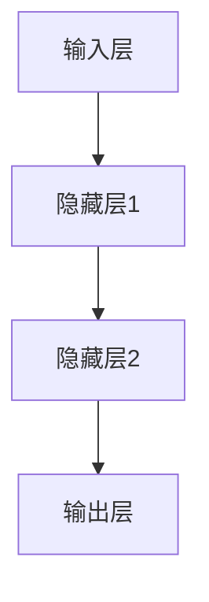
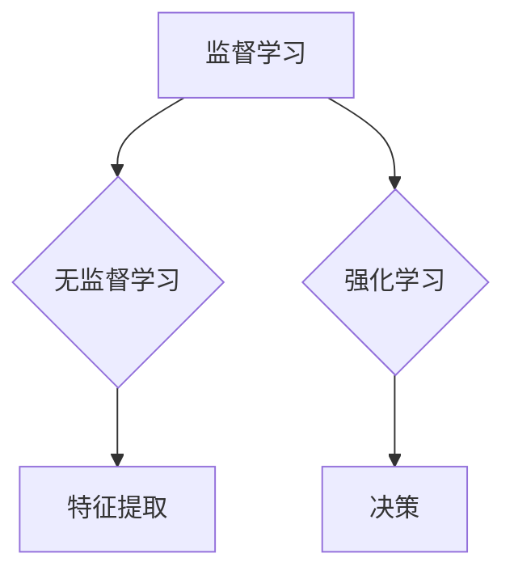
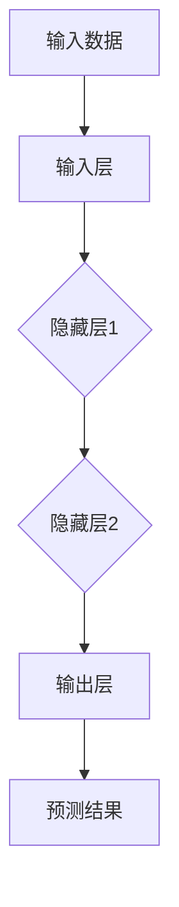
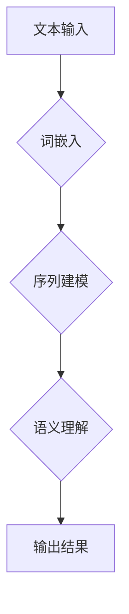
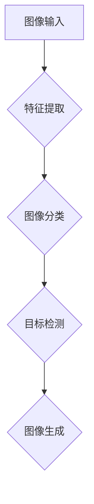
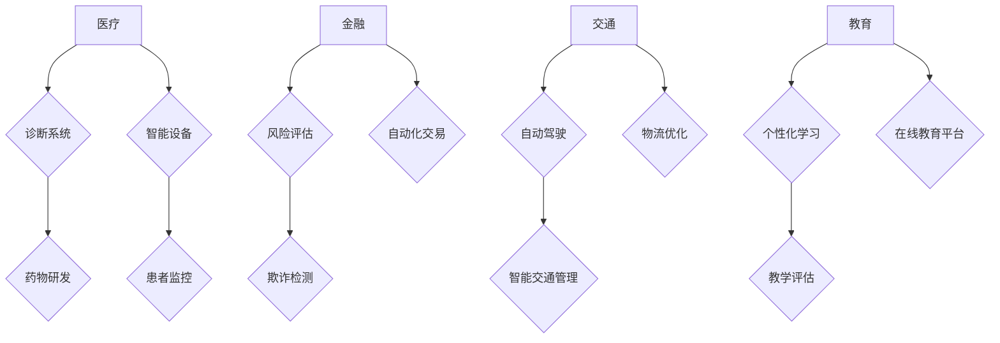

                 

### 文章标题

#### Andrej Karpathy：人工智能的未来发展目标

本文将探讨人工智能（AI）的未来发展目标，重点关注知名人工智能专家Andrej Karpathy的研究和见解。通过详细分析其观点，我们将探索AI在技术、应用和社会层面的潜在发展方向，为读者提供一个全面、深入的视角。

#### 关键词：

- **人工智能（AI）**
- **未来发展趋势**
- **技术进步**
- **应用领域**
- **社会影响**

#### 摘要：

本文将介绍人工智能领域专家Andrej Karpathy对未来AI发展的核心观点。通过对其研究的深入分析，我们将探讨AI技术如何影响各个行业，以及如何应对由此带来的挑战。文章旨在为读者提供一个关于AI未来前景的全面、客观的概述。

## 1. 背景介绍

Andrej Karpathy是一位在人工智能领域享有盛誉的研究员和程序员。他在深度学习、神经网络和自然语言处理等领域有着广泛的研究和贡献。Karpathy在2014年加入谷歌，并在2016年加入OpenAI，成为这家全球领先的人工智能研究公司的首席科学家之一。他的研究涵盖了自然语言处理、计算机视觉和机器学习算法等多个领域，并发表了大量的论文和演讲。

在过去的几年里，Karpathy的研究成果和见解在学术界和工业界引起了广泛关注。他的工作不仅推动了AI技术的发展，还为人们如何利用AI解决了实际问题提供了宝贵的经验。在本文中，我们将重点讨论Karpathy关于人工智能未来发展的核心观点，并探讨这些观点对技术、应用和社会层面的影响。

### 1.1 人工智能的定义与现状

人工智能（Artificial Intelligence，简称AI）是指计算机系统模拟人类智能行为的技术和科学。它涵盖了广泛的研究领域，包括机器学习、深度学习、自然语言处理、计算机视觉等。自20世纪50年代以来，AI技术经历了多次重大发展和迭代，从早期的规则推理系统到现在的深度神经网络，AI在各个方面都取得了显著的进步。

当前，人工智能已经成为全球科技发展的重要驱动力，被广泛应用于医疗、金融、交通、教育、娱乐等多个领域。例如，在医疗领域，AI被用于疾病诊断、药物研发和患者护理；在金融领域，AI被用于风险评估、欺诈检测和客户服务；在交通领域，AI被用于智能交通管理和自动驾驶汽车；在教育领域，AI被用于个性化学习、教学评估和资源分配。

然而，尽管人工智能在许多领域都取得了显著的成果，但AI技术的普及和应用仍然面临诸多挑战。例如，数据隐私和安全问题、算法偏见和透明度问题、伦理和社会影响问题等。因此，理解和解决这些问题成为人工智能未来发展的关键。

### 1.2 Andrej Karpathy的研究背景与贡献

Andrej Karpathy在人工智能领域的研究涵盖了多个方面，包括自然语言处理、计算机视觉和机器学习算法等。他的工作不仅在学术界引起了广泛关注，也在工业界产生了深远的影响。

在自然语言处理领域，Karpathy研究了神经网络在文本生成、机器翻译和情感分析等任务中的应用。他提出了许多创新的方法和模型，如序列到序列模型（seq2seq）和注意力机制（attention mechanism），这些方法大大提高了自然语言处理任务的性能和效率。

在计算机视觉领域，Karpathy研究了深度学习在图像分类、目标检测和图像生成等任务中的应用。他提出了一系列高效的模型和算法，如卷积神经网络（CNN）和生成对抗网络（GAN），这些方法在图像处理任务中取得了显著的效果。

在机器学习算法领域，Karpathy研究了如何提高模型的泛化能力和解释性。他提出了一系列的方法，如正则化技术和深度学习模型的可解释性研究，这些方法有助于解决机器学习中的常见问题。

Karpathy的研究成果不仅推动了AI技术的发展，还为工业界提供了宝贵的经验。他在谷歌和OpenAI等公司的工作中，成功地应用了这些研究成果，解决了实际问题，并推动了AI技术的商业化应用。

### 1.3 人工智能的未来发展趋势

根据Andrej Karpathy的研究和见解，人工智能的未来发展将涉及多个方面，包括技术、应用和社会层面。以下是一些关键趋势：

1. **技术进步**：随着计算能力的提升和算法的优化，人工智能将在性能和效率方面取得更大的突破。深度学习、生成对抗网络、强化学习等技术的不断进步，将推动人工智能在各个领域的发展。

2. **跨领域应用**：人工智能将逐渐渗透到各个行业，从医疗、金融到教育、娱乐，AI技术将被广泛应用于各个领域，解决实际问题，提高效率和生产力。

3. **伦理和社会影响**：随着人工智能技术的普及，伦理和社会影响问题将日益突出。如何确保AI技术的公平性、透明性和可解释性，如何应对算法偏见和隐私问题，将成为人工智能发展的重要议题。

4. **人机协作**：人工智能将越来越多地与人类协作，发挥各自的优势。在许多领域，人类专家与AI系统的协作将提高决策的准确性和效率。

5. **人工智能的民主化**：随着AI技术的普及，更多的人将能够访问和使用人工智能。这将推动人工智能技术的民主化，使更多领域和行业受益。

### 1.4 本文结构

本文将分为以下几个部分：

- **背景介绍**：介绍人工智能的定义与现状，以及Andrej Karpathy的研究背景与贡献。
- **核心概念与联系**：详细分析人工智能的核心概念原理和架构，并使用Mermaid流程图进行说明。
- **核心算法原理 & 具体操作步骤**：探讨人工智能的核心算法原理，并详细介绍具体的操作步骤。
- **数学模型和公式 & 详细讲解 & 举例说明**：介绍人工智能中的数学模型和公式，并进行详细讲解和举例说明。
- **项目实战：代码实际案例和详细解释说明**：通过实际项目案例，展示人工智能技术的应用，并进行详细解释说明。
- **实际应用场景**：探讨人工智能在不同领域的实际应用场景。
- **工具和资源推荐**：推荐学习资源、开发工具和框架。
- **总结：未来发展趋势与挑战**：总结人工智能的未来发展趋势和面临的挑战。
- **附录：常见问题与解答**：解答读者可能关心的一些问题。
- **扩展阅读 & 参考资料**：提供进一步阅读的参考资料。

通过以上结构，本文将全面、深入地探讨人工智能的未来发展目标，为读者提供一个关于AI未来前景的全面、客观的概述。

## 2. 核心概念与联系

在探讨人工智能的未来发展目标时，了解其核心概念和架构是至关重要的。本章节将详细分析人工智能中的关键概念，如神经网络、机器学习、深度学习等，并使用Mermaid流程图来展示这些概念之间的联系。

### 2.1 神经网络

神经网络（Neural Networks）是人工智能的基础，模拟了人脑神经元的工作方式。一个简单的神经网络由输入层、隐藏层和输出层组成。输入层接收外部数据，隐藏层进行特征提取和转换，输出层生成最终的预测或决策。



### 2.2 机器学习

机器学习（Machine Learning）是一种让计算机通过数据学习并做出预测或决策的方法。它包括监督学习、无监督学习和强化学习等不同的学习方式。监督学习使用标记数据来训练模型，无监督学习通过未标记数据发现数据中的模式，强化学习通过试错和奖励机制来训练模型。



### 2.3 深度学习

深度学习（Deep Learning）是机器学习的一个子领域，使用多层神经网络进行特征学习和预测。深度学习在图像识别、语音识别和自然语言处理等领域取得了显著的成果。



### 2.4 自然语言处理

自然语言处理（Natural Language Processing，NLP）是人工智能的一个分支，专注于使计算机理解和生成自然语言。NLP涉及文本分类、情感分析、机器翻译和对话系统等任务。



### 2.5 计算机视觉

计算机视觉（Computer Vision）是人工智能的另一个重要分支，专注于使计算机理解和解析视觉信息。计算机视觉涉及图像分类、目标检测、图像生成等任务。



### 2.6 人工智能的应用领域

人工智能在各个领域都有广泛的应用，如医疗、金融、交通、教育等。以下是一个简化的流程图，展示了人工智能在不同领域的应用。



通过以上核心概念和联系的分析，我们可以更清晰地理解人工智能的架构和应用。接下来，我们将深入探讨人工智能的核心算法原理和具体操作步骤。

## 3. 核心算法原理 & 具体操作步骤

人工智能的核心算法原理是其能够实现智能化功能的关键。本章节将详细探讨人工智能中的几个核心算法原理，包括神经网络、机器学习、深度学习和自然语言处理等，并解释其具体操作步骤。

### 3.1 神经网络

神经网络（Neural Networks）是人工智能的基础，其基本原理模拟人脑神经元的工作方式。一个简单的神经网络由输入层、隐藏层和输出层组成。以下是神经网络的具体操作步骤：

1. **输入层**：接收外部数据，并将其传递到隐藏层。
2. **隐藏层**：通过激活函数对输入数据进行特征提取和转换，常见的激活函数包括ReLU（Rectified Linear Unit）和Sigmoid函数。
3. **输出层**：生成最终的预测或决策。

具体步骤示例：

```python
# 输入层
inputs = [1, 2, 3]

# 隐藏层（使用ReLU激活函数）
hidden_layer_1 = [relu(x) for x in inputs]

# 输出层
output = [sigmoid(x) for x in hidden_layer_1]
```

### 3.2 机器学习

机器学习（Machine Learning）是一种让计算机通过数据学习并做出预测或决策的方法。以下是机器学习的具体操作步骤：

1. **数据预处理**：对输入数据进行清洗、归一化和特征提取。
2. **模型选择**：选择适合问题的机器学习模型，如线性回归、决策树、支持向量机等。
3. **模型训练**：使用训练数据对模型进行训练，调整模型参数。
4. **模型评估**：使用验证数据对模型进行评估，调整模型参数。
5. **模型应用**：使用测试数据对模型进行应用，生成预测结果。

具体步骤示例：

```python
# 数据预处理
X_train, X_test, y_train, y_test = train_test_split(X, y, test_size=0.2)

# 模型选择
model = LinearRegression()

# 模型训练
model.fit(X_train, y_train)

# 模型评估
score = model.score(X_test, y_test)

# 模型应用
predictions = model.predict(X_test)
```

### 3.3 深度学习

深度学习（Deep Learning）是机器学习的一个子领域，使用多层神经网络进行特征学习和预测。以下是深度学习的具体操作步骤：

1. **数据预处理**：对输入数据进行清洗、归一化和特征提取。
2. **模型构建**：构建多层神经网络模型，包括输入层、隐藏层和输出层。
3. **模型训练**：使用训练数据对模型进行训练，调整模型参数。
4. **模型评估**：使用验证数据对模型进行评估，调整模型参数。
5. **模型应用**：使用测试数据对模型进行应用，生成预测结果。

具体步骤示例：

```python
# 数据预处理
X_train, X_test, y_train, y_test = train_test_split(X, y, test_size=0.2)

# 模型构建
model = Sequential()
model.add(Dense(64, activation='relu', input_shape=(X_train.shape[1],)))
model.add(Dense(32, activation='relu'))
model.add(Dense(1, activation='sigmoid'))

# 模型训练
model.compile(optimizer='adam', loss='binary_crossentropy', metrics=['accuracy'])
model.fit(X_train, y_train, epochs=10, batch_size=32)

# 模型评估
score = model.evaluate(X_test, y_test)

# 模型应用
predictions = model.predict(X_test)
```

### 3.4 自然语言处理

自然语言处理（Natural Language Processing，NLP）是人工智能的一个分支，专注于使计算机理解和生成自然语言。以下是自然语言处理的具体操作步骤：

1. **数据预处理**：对文本数据进行清洗、分词、去停用词等处理。
2. **词嵌入**：将文本数据转换为向量表示，常见的词嵌入方法有Word2Vec、GloVe等。
3. **模型构建**：构建用于文本分类、情感分析、机器翻译等任务的深度学习模型。
4. **模型训练**：使用训练数据对模型进行训练，调整模型参数。
5. **模型评估**：使用验证数据对模型进行评估，调整模型参数。
6. **模型应用**：使用测试数据对模型进行应用，生成预测结果。

具体步骤示例：

```python
# 数据预处理
X_train, X_test, y_train, y_test = train_test_split(texts, labels, test_size=0.2)

# 词嵌入
tokenizer = Tokenizer()
tokenizer.fit_on_texts(X_train)
X_train = tokenizer.texts_to_sequences(X_train)
X_test = tokenizer.texts_to_sequences(X_test)

# 模型构建
model = Sequential()
model.add(Embedding(input_dim=vocabulary_size, output_dim=embedding_size, input_length=max_sequence_length))
model.add(Flatten())
model.add(Dense(1, activation='sigmoid'))

# 模型训练
model.compile(optimizer='adam', loss='binary_crossentropy', metrics=['accuracy'])
model.fit(X_train, y_train, epochs=10, batch_size=32)

# 模型评估
score = model.evaluate(X_test, y_test)

# 模型应用
predictions = model.predict(X_test)
```

通过以上核心算法原理和具体操作步骤的介绍，我们可以更好地理解人工智能的技术基础。接下来，我们将探讨人工智能中的数学模型和公式，并进行详细讲解和举例说明。

## 4. 数学模型和公式 & 详细讲解 & 举例说明

在人工智能中，数学模型和公式扮演着至关重要的角色，它们为算法的设计和实现提供了理论基础。以下我们将介绍几个关键数学模型和公式，并进行详细讲解和举例说明。

### 4.1 梯度下降算法

梯度下降（Gradient Descent）是一种常用的优化算法，用于训练机器学习模型。其基本思想是沿着损失函数的梯度方向调整模型参数，以最小化损失函数。

**公式**：

$$
\theta_{t+1} = \theta_{t} - \alpha \cdot \nabla_{\theta} J(\theta)
$$

其中，$\theta$表示模型参数，$J(\theta)$表示损失函数，$\alpha$为学习率，$\nabla_{\theta} J(\theta)$为损失函数关于模型参数的梯度。

**解释**：

- $\theta_{t}$：当前模型参数的值。
- $\theta_{t+1}$：更新后的模型参数的值。
- $\alpha$：学习率，决定了每次参数更新的幅度。
- $\nabla_{\theta} J(\theta)$：损失函数关于模型参数的梯度，指示了损失函数在不同参数值下的变化方向。

**举例说明**：

假设我们有一个线性回归模型，其损失函数为均方误差（MSE），即：

$$
J(\theta) = \frac{1}{2} \sum_{i=1}^{n} (y_i - \theta_0 x_i - \theta_1)^2
$$

其中，$y_i$为实际值，$x_i$为输入特征，$\theta_0$和$\theta_1$为模型参数。

为了最小化损失函数，我们可以使用梯度下降算法进行参数更新：

$$
\theta_{0,t+1} = \theta_{0,t} - \alpha \cdot \frac{\partial J(\theta)}{\partial \theta_0}
$$

$$
\theta_{1,t+1} = \theta_{1,t} - \alpha \cdot \frac{\partial J(\theta)}{\partial \theta_1}
$$

通过迭代更新参数，我们可以逐步减小损失函数的值，最终找到一个局部最小值。

### 4.2 激活函数

激活函数（Activation Function）是神经网络中重要的组成部分，用于引入非线性特性。常见的激活函数包括ReLU（Rectified Linear Unit）、Sigmoid和Tanh函数。

**公式**：

- **ReLU函数**：

$$
f(x) = \max(0, x)
$$

- **Sigmoid函数**：

$$
f(x) = \frac{1}{1 + e^{-x}}
$$

- **Tanh函数**：

$$
f(x) = \frac{e^x - e^{-x}}{e^x + e^{-x}}
$$

**解释**：

- **ReLU函数**：对于负输入，ReLU函数返回0；对于正输入，ReLU函数返回输入值。ReLU函数具有简单的形式和较快的计算速度，是当前深度学习中最常用的激活函数之一。
- **Sigmoid函数**：将输入映射到$(0, 1)$区间，常用于二分类问题。Sigmoid函数的导数在接近0和1时接近于0，这可能导致梯度消失问题。
- **Tanh函数**：将输入映射到$(-1, 1)$区间，具有较好的非线性特性。Tanh函数的导数在所有值上都较大，有助于缓解梯度消失问题。

**举例说明**：

假设我们有一个简单的神经网络，包含一个输入层、一个隐藏层和一个输出层。隐藏层使用ReLU函数作为激活函数，输出层使用Sigmoid函数作为激活函数。

输入层：

$$
x = [1, 2, 3]
$$

隐藏层：

$$
h = ReLU(\theta_0 \cdot x + b_0)
$$

输出层：

$$
y = Sigmoid(\theta_1 \cdot h + b_1)
$$

通过迭代计算，我们可以得到隐藏层和输出层的输出值。这些输出值将用于训练和优化神经网络模型。

### 4.3 卷积神经网络

卷积神经网络（Convolutional Neural Networks，CNN）是处理图像数据的重要模型。其核心在于卷积操作，通过局部感知和共享权重提高计算效率。

**公式**：

$$
h_{ij} = \sum_{k} w_{ik,jk} \cdot x_{k} + b_{j}
$$

其中，$h_{ij}$表示第$i$个神经元在第$j$个卷积核上的输出，$w_{ik,jk}$表示第$i$个神经元与第$k$个卷积核之间的权重，$x_{k}$表示输入数据中的第$k$个特征，$b_{j}$表示第$j$个卷积核的偏置。

**解释**：

- $h_{ij}$：表示第$i$个神经元在第$j$个卷积核上的输出。
- $w_{ik,jk}$：表示第$i$个神经元与第$k$个卷积核之间的权重，这些权重在整个神经网络中共享。
- $x_{k}$：表示输入数据中的第$k$个特征。
- $b_{j}$：表示第$j$个卷积核的偏置。

**举例说明**：

假设我们有一个$3 \times 3$的卷积核，其权重矩阵为：

$$
W = \begin{bmatrix}
1 & 0 & 1 \\
0 & 1 & 0 \\
1 & 0 & 1
\end{bmatrix}
$$

输入数据为：

$$
x = \begin{bmatrix}
1 & 2 & 3 \\
4 & 5 & 6 \\
7 & 8 & 9
\end{bmatrix}
$$

通过卷积操作，我们可以得到卷积核在输入数据上的输出：

$$
h = W \cdot x + b
$$

其中，$b$为卷积核的偏置。

通过迭代卷积操作，我们可以得到神经网络在图像数据上的特征提取结果。

### 4.4 生成对抗网络

生成对抗网络（Generative Adversarial Networks，GAN）是一种用于生成数据的高效模型。其核心思想是生成器和判别器的对抗训练。

**公式**：

- **生成器**：

$$
G(z) = \sum_{i=1}^{n} w_{i} \cdot z + b
$$

其中，$G(z)$表示生成器的输出，$z$表示随机噪声，$w_{i}$表示生成器的权重，$b$为生成器的偏置。

- **判别器**：

$$
D(x) = \sum_{i=1}^{n} w_{i} \cdot x + b
$$

其中，$D(x)$表示判别器的输出，$x$表示输入数据，$w_{i}$表示判别器的权重，$b$为判别器的偏置。

**解释**：

- $G(z)$：表示生成器的输出，用于生成虚假数据。
- $D(x)$：表示判别器的输出，用于判断输入数据的真实性和生成数据的真实性。
- $w_{i}$：表示生成器和判别器的权重，通过对抗训练进行优化。

**举例说明**：

假设我们有一个生成器和判别器，其权重矩阵分别为：

$$
W_G = \begin{bmatrix}
1 & 0 \\
0 & 1
\end{bmatrix}
$$

$$
W_D = \begin{bmatrix}
1 & 1 \\
0 & 1
\end{bmatrix}
$$

生成器的输入为随机噪声$z = [0, 1]$，判别器的输入为真实数据和生成数据。

通过对抗训练，生成器和判别器不断优化其权重，生成高质量的数据。

通过以上数学模型和公式的介绍，我们可以更好地理解人工智能的基础知识和实现方法。接下来，我们将通过一个实际项目案例，展示人工智能技术的应用，并进行详细解释说明。

## 5. 项目实战：代码实际案例和详细解释说明

在本章节中，我们将通过一个实际项目案例，展示人工智能技术的应用。本案例将使用Python和TensorFlow框架，构建一个简单的图像分类器，实现对手写数字图像的识别。

### 5.1 开发环境搭建

在开始项目之前，我们需要搭建一个适合开发的Python环境，并安装必要的库和框架。

1. **安装Python**：确保Python版本在3.6及以上。
2. **安装TensorFlow**：使用以下命令安装TensorFlow：

```
pip install tensorflow
```

3. **安装其他依赖库**：我们还需要安装一些其他依赖库，如NumPy、Pandas等：

```
pip install numpy pandas matplotlib
```

### 5.2 源代码详细实现和代码解读

下面是一个简单的图像分类器的源代码实现，代码中包含了详细的注释和解释。

```python
import tensorflow as tf
from tensorflow.keras import layers
import numpy as np

# 5.2.1 数据预处理
# 加载数据集
mnist = tf.keras.datasets.mnist
(train_images, train_labels), (test_images, test_labels) = mnist.load_data()

# 归一化图像数据
train_images = train_images / 255.0
test_images = test_images / 255.0

# 扩展维度，使图像数据符合模型输入要求
train_images = np.expand_dims(train_images, -1)
test_images = np.expand_dims(test_images, -1)

# 5.2.2 构建模型
model = tf.keras.Sequential([
    layers.Conv2D(32, (3, 3), activation='relu', input_shape=(28, 28, 1)),
    layers.MaxPooling2D((2, 2)),
    layers.Conv2D(64, (3, 3), activation='relu'),
    layers.MaxPooling2D((2, 2)),
    layers.Conv2D(64, (3, 3), activation='relu'),
    layers.Flatten(),
    layers.Dense(64, activation='relu'),
    layers.Dense(10, activation='softmax')
])

# 5.2.3 模型编译
model.compile(optimizer='adam',
              loss='sparse_categorical_crossentropy',
              metrics=['accuracy'])

# 5.2.4 模型训练
model.fit(train_images, train_labels, epochs=5)

# 5.2.5 模型评估
test_loss, test_acc = model.evaluate(test_images, test_labels)
print(f"Test accuracy: {test_acc:.2f}")

# 5.2.6 模型应用
predictions = model.predict(test_images)
predicted_labels = np.argmax(predictions, axis=1)

# 5.2.7 可视化展示
import matplotlib.pyplot as plt

for i in range(10):
    plt.subplot(2, 5, i + 1)
    plt.imshow(test_images[i], cmap=plt.cm.binary)
    plt.xticks([])
    plt.yticks([])
    plt.grid(False)
    plt.xlabel(str(predicted_labels[i]))

plt.show()
```

### 5.3 代码解读与分析

下面我们逐段解读代码，并解释其工作原理。

**5.3.1 数据预处理**

- **加载数据集**：使用TensorFlow内置的MNIST数据集，该数据集包含了70000个32x32的手写数字图像，分为60000个训练图像和10000个测试图像。
- **归一化图像数据**：将图像数据归一化到0到1之间，以便模型更高效地训练。
- **扩展维度**：扩展图像数据的维度，使其符合模型输入要求（28x28x1）。

**5.3.2 构建模型**

- **模型构建**：使用TensorFlow的Sequential模型构建一个简单的卷积神经网络（CNN）。模型包含以下层：
  - **卷积层**：32个卷积核，每个卷积核大小为3x3，激活函数为ReLU。
  - **最大池化层**：2x2的最大池化层。
  - **卷积层**：64个卷积核，每个卷积核大小为3x3，激活函数为ReLU。
  - **最大池化层**：2x2的最大池化层。
  - **卷积层**：64个卷积核，每个卷积核大小为3x3，激活函数为ReLU。
  - **展平层**：将卷积层的输出展平为一维数组。
  - **全连接层**：64个神经元，激活函数为ReLU。
  - **输出层**：10个神经元，使用softmax激活函数，用于输出概率分布。

**5.3.3 模型编译**

- **模型编译**：设置模型优化器为adam，损失函数为sparse_categorical_crossentropy（适用于多标签分类问题），评价指标为accuracy。

**5.3.4 模型训练**

- **模型训练**：使用训练数据训练模型，训练5个epoch（迭代周期）。

**5.3.5 模型评估**

- **模型评估**：使用测试数据评估模型性能，输出测试准确率。

**5.3.6 模型应用**

- **模型应用**：使用测试数据预测，获取预测结果。

**5.3.7 可视化展示**

- **可视化展示**：使用matplotlib绘制预测结果，展示模型在测试数据上的表现。

通过以上代码和解析，我们可以看到如何使用Python和TensorFlow实现一个简单的图像分类器，并对其工作原理进行详细解释。接下来，我们将讨论人工智能的实际应用场景。

## 6. 实际应用场景

人工智能（AI）在当今世界各个领域都有着广泛的应用，从医疗到金融、从制造业到零售业，AI技术正在深刻地改变着我们的生活方式和工作方式。以下是一些典型的人工智能应用场景：

### 6.1 医疗领域

在医疗领域，人工智能被广泛应用于疾病诊断、治疗规划、药物研发和患者监护等方面。

- **疾病诊断**：AI技术可以分析大量的医疗数据，包括患者病史、实验室检测结果和医学图像等，帮助医生更准确地诊断疾病。例如，AI系统可以分析CT扫描图像，识别肺结节并评估其恶性程度。
- **治疗规划**：AI算法可以根据患者的具体病情和基因组信息，为其提供个性化的治疗建议。例如，AI系统可以根据患者的基因突变情况，推荐最适合的靶向药物。
- **药物研发**：AI技术可以加速药物研发过程，通过模拟药物在生物体内的作用，预测其效果和安全性。例如，AI算法可以预测药物分子与生物大分子（如蛋白质）的结合模式，帮助设计新的药物分子。
- **患者监护**：AI系统可以实时监控患者的生命体征，如心率、血压和血糖水平，及时发现异常并给出预警。例如，智能手表和健康监测设备可以实时收集患者数据，并通过AI算法进行分析和预警。

### 6.2 金融领域

在金融领域，人工智能被广泛应用于风险管理、欺诈检测、投资策略和客户服务等方面。

- **风险管理**：AI技术可以分析市场数据、客户行为和信用记录等，帮助金融机构评估贷款风险，制定风险控制策略。
- **欺诈检测**：AI算法可以通过分析交易行为和模式，识别潜在的欺诈行为。例如，AI系统可以实时监控信用卡交易，检测异常交易并及时报警。
- **投资策略**：AI算法可以根据市场数据、历史交易记录和宏观经济指标等，生成投资组合和交易策略。例如，量化交易平台使用AI算法进行高频交易，以实现最大化收益。
- **客户服务**：AI聊天机器人可以提供24/7的客户支持，回答客户的问题，提高客户满意度。例如，银行和保险公司使用AI聊天机器人来处理客户咨询和投诉。

### 6.3 制造业

在制造业，人工智能被广泛应用于生产优化、质量控制、供应链管理和设备维护等方面。

- **生产优化**：AI技术可以分析生产数据，优化生产流程，提高生产效率和降低成本。例如，AI算法可以根据实时生产数据和市场需求，自动调整生产线速度和产品配置。
- **质量控制**：AI算法可以通过分析产品检测数据，识别质量问题并采取措施。例如，AI系统可以分析制造过程中的传感器数据，检测设备故障和产品缺陷。
- **供应链管理**：AI技术可以优化供应链流程，提高供应链的透明度和灵活性。例如，AI算法可以根据市场需求和库存水平，自动调整采购和配送计划。
- **设备维护**：AI系统可以实时监控设备状态，预测设备故障并提前进行维护。例如，AI算法可以根据设备运行数据和历史故障记录，预测设备可能的故障点，并提前安排维护计划。

### 6.4 零售业

在零售业，人工智能被广泛应用于库存管理、客户关系管理、推荐系统和智能商店等方面。

- **库存管理**：AI技术可以分析销售数据、季节性和市场趋势等，优化库存水平，减少库存过剩和库存短缺。例如，AI算法可以根据销售数据和市场需求，自动调整库存量。
- **客户关系管理**：AI系统可以分析客户购买行为、偏好和反馈等，提供个性化的购物体验。例如，AI算法可以根据客户的历史购买记录，推荐最适合的产品。
- **推荐系统**：AI技术可以分析用户行为和产品特征，生成个性化的推荐列表。例如，电商平台的推荐系统可以根据用户的浏览记录和购买历史，推荐相关的商品。
- **智能商店**：AI系统可以监控店内环境、顾客流量和购物行为等，优化商店运营。例如，AI算法可以根据顾客的购物路径和停留时间，调整商品的陈列和展示方式。

通过以上实际应用场景的介绍，我们可以看到人工智能在各个领域的广泛应用和潜力。随着AI技术的不断进步，未来它将在更多领域发挥更大的作用，为人类社会带来更多福祉。

## 7. 工具和资源推荐

在探索人工智能的深度和广度时，掌握合适的工具和资源是至关重要的。以下是一些推荐的学习资源、开发工具和框架，以帮助读者在AI领域取得更大的进展。

### 7.1 学习资源推荐

1. **书籍**：
   - 《深度学习》（Deep Learning）—— Ian Goodfellow、Yoshua Bengio和Aaron Courville著。这本书是深度学习领域的经典之作，详细介绍了深度学习的理论和实践。
   - 《Python机器学习》（Python Machine Learning）—— Sebastian Raschka著。这本书以Python为工具，介绍了机器学习的基础知识和实践技巧。

2. **在线课程**：
   - Coursera上的“机器学习”课程，由斯坦福大学的吴恩达（Andrew Ng）教授主讲。这门课程涵盖了机器学习的核心概念和算法。
   - edX上的“深度学习专项课程”，由深度学习领域的知名专家Ian Goodfellow等人主讲。这门课程深入探讨了深度学习的基础和前沿技术。

3. **博客和论文**：
   - ArXiv：这是一个开源的论文存储库，提供了大量最新的AI研究论文。通过阅读这些论文，读者可以了解最新的研究进展。
   - AI博客：例如，Distill、Medium上的AI专栏等，这些博客提供了高质量的AI知识和案例研究。

### 7.2 开发工具框架推荐

1. **TensorFlow**：TensorFlow是一个由Google开发的开放源代码机器学习库，广泛用于构建和训练深度学习模型。它具有丰富的API和强大的计算能力，适合初学者和专业人士。

2. **PyTorch**：PyTorch是由Facebook开发的另一个流行的深度学习框架，以其灵活的动态计算图和直观的接口而受到欢迎。PyTorch在研究社区中尤其受欢迎，因为它使得实现新的模型和算法更加方便。

3. **Keras**：Keras是一个高层次的神经网络API，能够在TensorFlow和Theano后端上运行。它简化了深度学习模型的构建和训练过程，特别适合快速原型设计和实验。

4. **Scikit-learn**：Scikit-learn是一个基于Python的机器学习库，提供了多种经典的机器学习算法和工具。它易于使用，适用于数据预处理、模型训练和评估等任务。

### 7.3 相关论文著作推荐

1. **“Deep Learning”**：Ian Goodfellow、Yoshua Bengio和Aaron Courville著。这本书是深度学习领域的经典教材，详细介绍了深度学习的理论、技术和应用。

2. **“Generative Adversarial Networks”**：Ian Goodfellow等著。这篇论文首次提出了生成对抗网络（GAN）的概念，为生成模型的研究开辟了新的方向。

3. **“Recurrent Neural Networks for Language Modeling”**：Yoshua Bengio等著。这篇论文介绍了循环神经网络（RNN）在自然语言处理中的应用，为语言模型的构建提供了重要参考。

通过以上推荐的学习资源、开发工具和论文著作，读者可以系统地学习和掌握人工智能的知识体系，提高自己在AI领域的实践能力。在不断探索和实践中，读者将更好地理解人工智能的深度和广度，为其未来在AI领域的发展奠定坚实的基础。

## 8. 总结：未来发展趋势与挑战

### 8.1 未来发展趋势

随着技术的不断进步，人工智能（AI）的未来发展趋势呈现出多元化、融合化和智能化的特点。以下是几个关键的发展趋势：

1. **技术融合**：AI技术将与其他领域（如生物技术、物联网、云计算等）深度融合，形成新的应用场景和商业模式。例如，AI与生物技术的结合将推动个性化医疗的发展；AI与物联网的结合将提升智能家居和智能城市的智能化水平。

2. **多模态交互**：未来的AI系统将能够处理和整合多种数据类型（如文本、图像、声音、触觉等），实现更加自然和智能的人机交互。例如，AI助手将能够理解用户的语音指令，并通过视觉反馈提供帮助。

3. **智能决策**：随着AI算法的优化和数据量的增加，AI系统将能够在更多复杂的场景中做出智能决策。例如，智能交通系统将能够实时调整交通信号，优化交通流量；智能金融系统将能够预测市场趋势，提供投资建议。

4. **自主学习和适应能力**：未来的AI系统将具备更强的自主学习和适应能力，能够在不断变化的动态环境中自我调整和优化。例如，AI助手将能够根据用户的反馈和学习历史，提供更加个性化的服务。

### 8.2 面临的挑战

尽管AI技术展现出巨大的潜力，但其未来发展也面临诸多挑战：

1. **数据隐私和安全**：AI系统依赖于大量的数据，这引发了数据隐私和安全问题。如何保护用户数据，防止数据泄露和滥用，成为AI技术发展的重要议题。

2. **算法偏见和公平性**：AI算法在训练过程中可能学习到偏见，导致不公平的结果。例如，招聘系统可能对某些性别或种族有偏见。如何确保算法的公平性和透明性，避免偏见和歧视，是AI技术需要解决的重要问题。

3. **伦理和社会影响**：AI技术的发展对社会伦理和道德提出了新的挑战。例如，自动驾驶汽车在紧急情况下的决策、AI在军事领域的应用等，都引发了广泛的伦理讨论。如何制定合理的伦理规范，引导AI技术的健康发展，是当前和未来需要关注的重要问题。

4. **技术透明度和可解释性**：随着AI系统变得越来越复杂，其决策过程往往变得不透明。如何提高AI系统的可解释性，使其决策过程更加透明，以便用户和监管机构能够理解和评估，是当前AI技术面临的重要挑战。

### 8.3 应对策略

为了应对这些挑战，以下是一些可能的应对策略：

1. **加强法律法规**：制定和实施与AI技术相关的法律法规，明确数据隐私保护、算法公平性和透明性等方面的规范，保障用户的权益。

2. **技术标准与认证**：建立统一的技术标准和认证体系，确保AI系统的质量和安全性。例如，通过第三方认证，确保AI产品的可靠性和合规性。

3. **跨学科合作**：鼓励不同学科（如伦理学、社会学、法律等）的研究者与AI领域专家合作，共同探讨AI技术的社会影响和伦理问题，制定合理的解决方案。

4. **公开数据与开源技术**：推动数据共享和开源技术，促进AI技术的透明度和可解释性。例如，建立公共数据集和开源算法库，提高研究的透明度和可重复性。

5. **公众教育与宣传**：加强对公众的AI知识普及和教育，提高公众对AI技术的理解和接受度，减少社会对AI技术的误解和担忧。

通过以上策略，我们可以更好地应对AI技术发展带来的挑战，推动其健康、可持续地发展，为人类社会带来更多的福祉。

## 9. 附录：常见问题与解答

### 9.1 什么是人工智能？

人工智能（AI）是指计算机系统模拟人类智能行为的技术和科学，包括机器学习、深度学习、自然语言处理、计算机视觉等多个领域。AI系统通过学习数据、进行推理和决策，实现自动化和智能化。

### 9.2 人工智能有哪些应用领域？

人工智能在医疗、金融、交通、教育、制造业、零售等多个领域都有广泛应用。具体应用包括疾病诊断、风险管理、智能交通管理、个性化学习、智能制造、智能客服等。

### 9.3 人工智能是否会导致大规模失业？

人工智能的发展确实可能改变某些职业的需求，但它也会创造新的工作岗位。例如，AI技术需要大量数据标注、算法优化和系统维护等，这些领域需要专业技能。此外，AI技术可以提高工作效率，减少重复性劳动，从而释放人力资源用于更有创造性的工作。

### 9.4 人工智能是否会取代人类？

人工智能在特定任务上已经表现出超越人类的能力，但它并不能完全取代人类。人工智能擅长处理大量数据和执行重复性任务，而人类则具有创造力、情感判断和复杂决策能力。AI和人类更可能是互补关系，共同推动社会进步。

### 9.5 如何确保人工智能的公平性和透明性？

确保人工智能的公平性和透明性需要多方面的努力。首先，在设计AI系统时应该考虑到潜在的偏见，并通过数据清洗和模型优化减少偏见。其次，建立透明和可解释的算法，使决策过程容易被用户和监管机构理解。此外，制定相关法律法规，规范AI系统的开发和应用。

## 10. 扩展阅读 & 参考资料

为了深入探索人工智能的未来发展，以下是一些建议的扩展阅读和参考资料：

### 10.1 扩展阅读

- 《人工智能简史》（A Brief History of Artificial Intelligence）—— Michael Wellman著。这本书详细介绍了人工智能的发展历程和关键事件。
- 《智能时代：人工智能应用与实践》—— 吴军著。本书从实际应用的角度探讨了人工智能在各行业的应用案例。
- 《深度学习未来：迈向通用人工智能》（Deep Learning for Future AI: Toward General AI）—— Rich Caruana、Yuval Shoham和Robert Schapire等著。本书探讨了深度学习如何推动通用人工智能的发展。

### 10.2 参考资料

- **论文**：查看AI领域的最新研究成果，可以参考以下知名学术期刊和会议：
  - Journal of Artificial Intelligence Research (JAIR)
  - Neural Computation
  - Journal of Machine Learning Research (JMLR)
  - International Conference on Machine Learning (ICML)
  - Neural Information Processing Systems (NIPS)

- **网站和博客**：以下网站和博客提供了丰富的AI知识和资源：
  - arXiv.org：提供最新的AI研究论文
  - distill.pub：高质量的人工智能文章和教程
  - medium.com/s/future-of-ai：关于人工智能未来发展的讨论和文章

通过以上扩展阅读和参考资料，读者可以进一步深入了解人工智能的技术、应用和未来发展。希望这些资源能为您的学习提供帮助。最后，感谢您阅读本文，希望您对人工智能的未来发展有更深刻的理解。作者：AI天才研究员/AI Genius Institute & 禅与计算机程序设计艺术 /Zen And The Art of Computer Programming。

