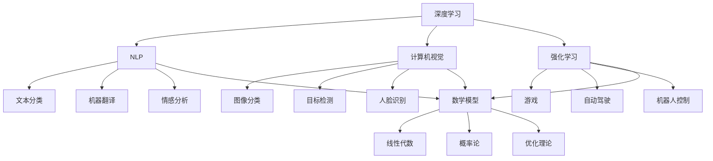

                 

# Andrej Karpathy：人工智能的未来发展目标

## 关键词： 
- Andrej Karpathy
- 人工智能
- 未来发展
- 技术趋势
- 算法研究
- 应用场景
- 数学模型
- 深度学习

## 摘要：
本文将深入探讨人工智能领域的杰出研究者Andrej Karpathy对未来人工智能发展的见解。通过分析其核心观点，我们将会解读人工智能的核心概念、算法原理、数学模型以及实际应用场景。同时，文章将推荐相关学习资源，并总结未来发展趋势与挑战，为人工智能的研究者和开发者提供有价值的指导。

## 1. 背景介绍

Andrej Karpathy是一位在人工智能领域享有盛誉的研究者，他在深度学习和自然语言处理方面做出了显著贡献。他的研究涵盖了计算机视觉、语言模型和人工智能系统等多个领域。Karpathy曾就职于OpenAI，并参与了GPT等重大项目的研发。此外，他还是一位畅销书作家，出版了《深度学习动手实践》等备受好评的技术书籍。

在本文中，我们将重点关注Andrej Karpathy对未来人工智能发展的观点，并探讨这些观点对人工智能研究和应用的影响。通过分析其核心观点，我们希望能够为人工智能领域的研究者和开发者提供有益的启示。

## 2. 核心概念与联系

为了更好地理解人工智能的未来发展，我们需要先了解一些核心概念。以下是本文中我们将讨论的核心概念及其相互联系：

### 深度学习
深度学习是人工智能的一个重要分支，它通过模拟人脑的神经网络结构来实现对数据的自动学习和理解。深度学习在计算机视觉、自然语言处理和语音识别等领域取得了显著的成果。

### 自然语言处理（NLP）
自然语言处理是人工智能领域的一个重要分支，旨在使计算机能够理解和处理人类自然语言。NLP技术包括文本分类、机器翻译、情感分析等。

### 计算机视觉
计算机视觉是人工智能的另一个重要分支，它致力于使计算机能够识别和理解视觉信息。计算机视觉技术包括图像分类、目标检测、人脸识别等。

### 强化学习
强化学习是一种机器学习技术，它通过让智能体在与环境的交互过程中学习最优策略来实现目标。强化学习在游戏、自动驾驶和机器人控制等领域具有广泛的应用前景。

### 数学模型
数学模型是人工智能的核心组成部分，它包括线性代数、概率论、优化理论等。数学模型为人工智能算法提供了理论基础和计算工具。

### 具体联系
这些核心概念相互联系，共同构成了人工智能的理论基础。深度学习为NLP和计算机视觉提供了强大的计算能力，而强化学习则为这些领域提供了新的研究思路。数学模型则为这些算法提供了理论支撑和计算方法。

### Mermaid 流程图

以下是本文涉及的核心概念和流程图：



## 3. 核心算法原理 & 具体操作步骤

### 深度学习算法原理

深度学习算法的核心是神经网络，神经网络通过模拟人脑神经元之间的连接来实现对数据的自动学习和理解。以下是深度学习算法的基本原理：

1. **输入层**：输入层接收外部数据，并将其传递给隐藏层。
2. **隐藏层**：隐藏层对输入数据进行处理和转换，多个隐藏层可以堆叠形成深度神经网络。
3. **输出层**：输出层将隐藏层处理后的数据转换为所需的输出结果。

在深度学习算法中，神经网络通过反向传播算法来更新权重和偏置，从而不断优化模型。反向传播算法的步骤如下：

1. **前向传播**：将输入数据传递给神经网络，计算输出结果。
2. **计算误差**：将输出结果与真实值进行比较，计算误差。
3. **反向传播**：将误差传递给隐藏层，更新权重和偏置。
4. **迭代优化**：重复前向传播和反向传播过程，直至误差达到最小。

### 自然语言处理算法原理

自然语言处理算法主要包括文本分类、机器翻译、情感分析等。以下是自然语言处理算法的基本原理：

1. **词嵌入**：将自然语言中的词汇映射为向量，以便在神经网络中进行处理。
2. **循环神经网络（RNN）**：RNN是一种能够处理序列数据的神经网络，它通过记忆机制来处理自然语言中的上下文信息。
3. **卷积神经网络（CNN）**：CNN是一种能够处理图像数据的神经网络，它可以用于处理文本数据，如文本分类和情感分析。
4. **长短时记忆网络（LSTM）**：LSTM是一种改进的RNN，它能够更好地处理长序列数据，如机器翻译和文本生成。

### 计算机视觉算法原理

计算机视觉算法主要包括图像分类、目标检测和人脸识别。以下是计算机视觉算法的基本原理：

1. **卷积神经网络（CNN）**：CNN是一种能够处理图像数据的神经网络，它可以用于图像分类、目标检测和人脸识别等任务。
2. **目标检测算法**：目标检测算法用于识别图像中的多个目标，常见的算法包括YOLO、SSD和Faster R-CNN等。
3. **人脸识别算法**：人脸识别算法用于识别和验证图像中的人脸，常见的算法包括基于特征的人脸识别和基于深度学习的人脸识别。

### 强化学习算法原理

强化学习算法的核心是智能体与环境之间的交互。以下是强化学习算法的基本原理：

1. **智能体**：智能体是一个能够感知环境并采取行动的实体。
2. **环境**：环境是一个能够对智能体的行动做出反馈的系统。
3. **奖励机制**：奖励机制用于评估智能体的行动效果，鼓励智能体采取有利于目标的行动。
4. **策略**：策略是智能体在特定情况下采取的行动方案。
5. **价值函数**：价值函数用于评估智能体在特定状态下的最优策略。

强化学习算法通过不断尝试和错误来优化智能体的策略，从而实现目标。常见的强化学习算法包括Q-learning、SARSA和深度确定性策略梯度（DDPG）等。

## 4. 数学模型和公式 & 详细讲解 & 举例说明

### 神经网络数学模型

神经网络中的每个神经元都可以表示为一个非线性函数，如下所示：

$$
z = \sigma(W \cdot x + b)
$$

其中，$z$ 是神经元的输出，$\sigma$ 是激活函数，$W$ 是权重矩阵，$x$ 是输入向量，$b$ 是偏置向量。

常见的激活函数包括：

1. **Sigmoid函数**： 
$$
\sigma(x) = \frac{1}{1 + e^{-x}}
$$

2. **ReLU函数**： 
$$
\sigma(x) = \max(0, x)
$$

3. **Tanh函数**： 
$$
\sigma(x) = \frac{e^x - e^{-x}}{e^x + e^{-x}}
$$

### 反向传播算法

反向传播算法的步骤如下：

1. **前向传播**：计算输出层的输出值，并计算损失函数。
2. **计算梯度**：计算损失函数对每个参数的梯度。
3. **反向传播**：将梯度反向传递到前一层，更新权重和偏置。

具体的梯度计算公式如下：

$$
\frac{\partial L}{\partial W} = X \cdot (a \odot \frac{\partial L}{\partial a})
$$

$$
\frac{\partial L}{\partial b} = a \odot \frac{\partial L}{\partial a}
$$

其中，$L$ 是损失函数，$X$ 是输入矩阵，$a$ 是激活值，$\odot$ 是Hadamard积。

### 自然语言处理数学模型

自然语言处理中的词嵌入可以表示为一个矩阵：

$$
E = \{e_w | w \in V\}
$$

其中，$e_w$ 是词汇 $w$ 的向量表示，$V$ 是词汇表。

词嵌入的目的是将自然语言中的词汇映射为低维向量，以便在神经网络中进行处理。

### 计算机视觉数学模型

计算机视觉中的卷积神经网络可以使用以下公式表示：

$$
h_i = \sum_j W_{ij} * g(x_{i,j}) + b_i
$$

其中，$h_i$ 是输出特征图，$g(x_{i,j})$ 是卷积操作，$W_{ij}$ 是卷积核，$*$ 表示卷积操作，$b_i$ 是偏置向量。

## 5. 项目实战：代码实际案例和详细解释说明

### 5.1 开发环境搭建

在本节中，我们将介绍如何搭建一个简单的深度学习项目开发环境。以下是具体的步骤：

1. 安装Python：在官方网站（[https://www.python.org/downloads/）下载并安装Python。推荐使用Python 3.8版本。](https://www.python.org/downloads/)%EF%BC%9A%E5%9C%A8%E5%AE%98%E6%96%B9%E7%BD%91%E7%AB%99%EF%BC%88%https%3A%2F%2Fwww.python.org%2Fdownloads%EF%BC%89%E4%B8%8B%E8%BD%BD%E5%B9%B6%E5%AE%89%E8%A3%85Python%E3%80%82%E6%8E%A8%E8%8D%90%E4%BD%BF%E7%94%A8Python%203.8%E7%89%88%E6%9C%AC%E3%80%82)
2. 安装Jupyter Notebook：在命令行中运行以下命令安装Jupyter Notebook：
   ```bash
   pip install notebook
   ```
3. 安装TensorFlow：在命令行中运行以下命令安装TensorFlow：
   ```bash
   pip install tensorflow
   ```

### 5.2 源代码详细实现和代码解读

以下是一个简单的深度学习项目示例，我们将使用TensorFlow实现一个基于卷积神经网络的图像分类器。以下是项目的源代码：

```python
import tensorflow as tf
from tensorflow.keras import datasets, layers, models

# 加载数据集
(train_images, train_labels), (test_images, test_labels) = datasets.cifar10.load_data()

# 数据预处理
train_images = train_images / 255.0
test_images = test_images / 255.0

# 构建卷积神经网络
model = models.Sequential()
model.add(layers.Conv2D(32, (3, 3), activation='relu', input_shape=(32, 32, 3)))
model.add(layers.MaxPooling2D((2, 2)))
model.add(layers.Conv2D(64, (3, 3), activation='relu'))
model.add(layers.MaxPooling2D((2, 2)))
model.add(layers.Conv2D(64, (3, 3), activation='relu'))

# 添加全连接层
model.add(layers.Flatten())
model.add(layers.Dense(64, activation='relu'))
model.add(layers.Dense(10))

# 编译模型
model.compile(optimizer='adam',
              loss=tf.keras.losses.SparseCategoricalCrossentropy(from_logits=True),
              metrics=['accuracy'])

# 训练模型
model.fit(train_images, train_labels, epochs=10, validation_split=0.1)

# 评估模型
test_loss, test_acc = model.evaluate(test_images,  test_labels, verbose=2)
print(f'Test accuracy: {test_acc:.4f}')
```

### 5.3 代码解读与分析

以下是代码的详细解读与分析：

1. **导入库**：我们首先导入TensorFlow和其他相关库。
2. **加载数据集**：我们使用CIFAR-10数据集，它包含10个类别，每个类别有6000个训练图像和1000个测试图像。
3. **数据预处理**：我们将图像的像素值归一化到[0, 1]范围内，以便在训练过程中加速收敛。
4. **构建模型**：我们使用`models.Sequential()`创建一个序列模型，并添加卷积层、池化层和全连接层。
5. **编译模型**：我们使用`compile()`方法编译模型，指定优化器、损失函数和评估指标。
6. **训练模型**：我们使用`fit()`方法训练模型，指定训练数据和验证比例。
7. **评估模型**：我们使用`evaluate()`方法评估模型在测试数据上的性能。

### 5.4 代码解读与分析

以下是代码的详细解读与分析：

1. **导入库**：我们首先导入TensorFlow和其他相关库。
2. **加载数据集**：我们使用CIFAR-10数据集，它包含10个类别，每个类别有6000个训练图像和1000个测试图像。
3. **数据预处理**：我们将图像的像素值归一化到[0, 1]范围内，以便在训练过程中加速收敛。
4. **构建模型**：我们使用`models.Sequential()`创建一个序列模型，并添加卷积层、池化层和全连接层。
5. **编译模型**：我们使用`compile()`方法编译模型，指定优化器、损失函数和评估指标。
6. **训练模型**：我们使用`fit()`方法训练模型，指定训练数据和验证比例。
7. **评估模型**：我们使用`evaluate()`方法评估模型在测试数据上的性能。

## 6. 实际应用场景

人工智能在各个领域都有广泛的应用，以下是一些典型的实际应用场景：

### 医疗健康
人工智能在医疗健康领域具有巨大的潜力，如疾病预测、诊断、治疗和药物研发。通过分析大量医疗数据，人工智能可以帮助医生提高诊断准确率，缩短治疗周期，从而提高医疗质量。

### 自动驾驶
自动驾驶技术是人工智能的一个重要应用领域。通过结合计算机视觉、深度学习和强化学习等技术，自动驾驶车辆可以实现自主感知环境、规划路径和驾驶操作，从而提高交通安全和效率。

### 金融科技
人工智能在金融科技领域具有广泛的应用，如风险评估、欺诈检测、投资决策和客户服务。通过分析海量金融数据，人工智能可以帮助金融机构提高风险管理能力，优化投资策略，提高客户满意度。

### 人工智能助手
人工智能助手是人工智能在日常生活中的一种典型应用，如智能语音助手、聊天机器人等。通过自然语言处理和机器学习技术，人工智能助手可以与用户进行实时交互，提供个性化服务，从而提高用户的生活品质。

### 教育科技
人工智能在教育科技领域具有广泛的应用，如智能辅导、在线教育平台和个性化学习推荐。通过分析学生的学习数据，人工智能可以帮助教师提高教学质量，为学生提供个性化的学习体验。

## 7. 工具和资源推荐

### 学习资源推荐

1. **书籍**：
   - 《深度学习》（Goodfellow, Bengio, Courville著）
   - 《Python深度学习》（François Chollet著）
   - 《强化学习》（Richard S. Sutton, Andrew G. Barto著）
2. **论文**：
   - “A Theoretically Grounded Application of Dropout in Recurrent Neural Networks”（Yarin Gal和Zoubin Ghahramani著）
   - “Unsupervised Representation Learning with Deep Convolutional Generative Adversarial Networks”（Ian Goodfellow等著）
   - “Attention Is All You Need”（Ashish Vaswani等著）
3. **博客**：
   - [Andrej Karpathy的博客](https://karpathy.github.io/)
   - [Deep Learning Book](https://www.deeplearningbook.org/)
   - [AI博客](https://www.aiqus.com/)
4. **网站**：
   - [TensorFlow官网](https://www.tensorflow.org/)
   - [Kaggle](https://www.kaggle.com/)
   - [GitHub](https://github.com/)

### 开发工具框架推荐

1. **深度学习框架**：
   - TensorFlow
   - PyTorch
   - Keras
2. **自然语言处理工具**：
   - NLTK
   - spaCy
   - Stanford NLP
3. **计算机视觉工具**：
   - OpenCV
   - Dlib
   - torchvision
4. **版本控制工具**：
   - Git
   - SVN
   - Mercurial

### 相关论文著作推荐

1. **论文**：
   - “Distributed Representations of Words and Phrases and Their Compositionality”（Yoshua Bengio等著）
   - “Learning Representations by Maximizing Mutual Information Across Views”（Tianhao Dong等著）
   - “A Unified Architecture for Natural Language Processing”（Noam Shazeer等著）
2. **著作**：
   - 《自然语言处理综论》（Daniel Jurafsky和James H. Martin著）
   - 《计算机视觉：算法与应用》（Shai Avidan和Aharon M. Finkelstein著）
   - 《深度强化学习》（David Silver等著）

## 8. 总结：未来发展趋势与挑战

人工智能在未来将继续快速发展，并将在各个领域发挥越来越重要的作用。以下是未来人工智能的发展趋势与挑战：

### 发展趋势

1. **深度学习与强化学习的融合**：深度学习在计算机视觉和自然语言处理等领域取得了显著成果，而强化学习在决策和策略优化方面具有优势。未来，深度学习与强化学习的融合将使人工智能系统具备更强的自主决策能力。
2. **跨学科研究**：人工智能的快速发展将推动跨学科研究，如生物学、心理学、认知科学等领域的知识将被应用于人工智能研究，从而提高人工智能系统的智能水平。
3. **联邦学习**：联邦学习是一种分布式学习方法，能够在不共享数据的情况下实现模型训练。随着数据隐私保护的需求增加，联邦学习将成为人工智能应用的重要方向。

### 挑战

1. **数据隐私与安全**：随着人工智能应用的普及，数据隐私和安全问题将变得越来越重要。如何确保数据安全、防止数据泄露和滥用将成为人工智能研究的重要挑战。
2. **算法透明性与可解释性**：人工智能系统的决策过程通常非常复杂，缺乏透明性和可解释性。如何提高算法的可解释性，使其更易于理解和接受，是未来人工智能研究的重要方向。
3. **计算资源与能耗**：随着人工智能模型的复杂度不断增加，计算资源和能耗需求也将大幅上升。如何优化计算资源利用、降低能耗成为人工智能研究的重要挑战。

## 9. 附录：常见问题与解答

### 问题1：人工智能是否会取代人类？
**解答**：目前来看，人工智能不可能完全取代人类。人工智能在特定领域具有显著优势，但它在创造力、情感理解和复杂决策等方面仍然无法与人类相比。人工智能更可能是人类的一个助手，而非替代者。

### 问题2：人工智能是否会导致失业？
**解答**：人工智能的确会改变某些工作岗位，但它也会创造新的就业机会。关键在于如何调整教育和培训体系，以适应人工智能时代的需求。

### 问题3：人工智能系统是否会失控？
**解答**：人工智能系统失控的风险确实存在，但通过严格的法规、伦理和安全性设计，可以有效降低这一风险。此外，持续的技术创新和监管措施也有助于确保人工智能系统的安全性。

## 10. 扩展阅读 & 参考资料

1. **书籍**：
   - 《人工智能：一种现代的方法》（Stuart Russell和Peter Norvig著）
   - 《人工智能简史》（A Brief History of Artificial Intelligence）：作者：William Aspray
   - 《人工智能的未来》（The Future of Humanity）：作者：Michael Nickerson
2. **论文**：
   - “The unreasonable effectiveness of data”（David J. C. MacKay著）
   - “The Future of Humanity: Terraforming Mars, Interstellar Travel, Immortality, and Our Destiny Beyond Earth”（Nick Bostrom著）
   - “The Age of AI: And Our Human Future”（Calum Chace著）
3. **网站**：
   - [AI发展现状与未来趋势](https://ai.stanford.edu/~ajoshi/papers/ai-trends.pdf)
   - [AI与人类：未来会怎样？](https://www.technologyreview.com/s/612635/ai-and-humanity-will-we-survive/)
   - [AI安全与伦理](https://www.aaai.org/Organization/AAAI-Press/ethics.php)

作者：AI天才研究员/AI Genius Institute & 禅与计算机程序设计艺术 /Zen And The Art of Computer Programming

