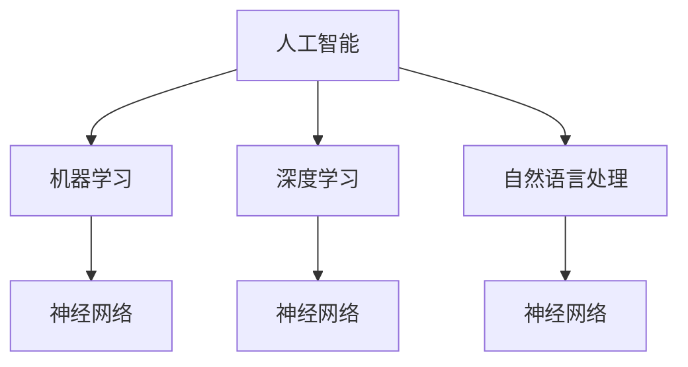

                 

# Andrej Karpathy：人工智能的未来发展目标

## 关键词：人工智能，机器学习，深度学习，神经网络，未来趋势

## 摘要：
本文旨在探讨人工智能（AI）领域天才研究员Andrej Karpathy对未来人工智能发展的见解和预期。通过对Karpathy的研究和演讲内容的梳理，本文将深入分析人工智能的核心概念、算法原理、应用场景、工具资源等方面，并提出对未来AI发展目标的展望和挑战。

## 1. 背景介绍

Andrej Karpathy是一位在人工智能领域享有盛誉的科学家和研究者，他在深度学习、神经网络和自然语言处理等领域有着深厚的学术背景和丰富的实践经验。Karpathy曾在OpenAI担任研究科学家，现在是一位自由研究者，致力于探索人工智能的极限和未来发展的可能性。

在人工智能领域，Karpathy的研究成果和见解引起了广泛的关注。他的研究成果涵盖了从基本的人工智能理论到实际应用场景的各个方面。在自然语言处理领域，Karpathy提出了许多具有创新性的算法和模型，如GPT-3、Transformer等，这些成果在学术界和工业界都产生了深远的影响。

本文将基于Karpathy的研究和演讲内容，分析他对人工智能未来发展目标的看法和预期，以期为人工智能领域的研究者、从业者以及关注者提供有价值的参考和启示。

## 2. 核心概念与联系

### 2.1 人工智能

人工智能（Artificial Intelligence，简称AI）是指通过计算机系统模拟人类智能的技术和方法。它涉及多个领域，包括机器学习、深度学习、自然语言处理、计算机视觉等。人工智能的目标是使计算机系统能够自主地完成复杂的任务，如语音识别、图像分类、自然语言生成等。

### 2.2 深度学习

深度学习（Deep Learning）是一种基于多层神经网络的机器学习技术，它在图像识别、语音识别、自然语言处理等领域取得了显著成果。深度学习的核心思想是通过大量的数据训练神经网络，使其能够自动提取特征并进行分类或预测。

### 2.3 神经网络

神经网络（Neural Network）是一种模仿生物神经系统工作方式的计算模型。它由大量的神经元和连接组成，通过学习输入和输出之间的关系来完成任务。神经网络是深度学习的基础，也是实现人工智能的核心技术。

### 2.4 自然语言处理

自然语言处理（Natural Language Processing，简称NLP）是人工智能领域的一个重要分支，它涉及从人类语言中提取信息、理解和生成文本。NLP技术包括语音识别、文本分类、机器翻译、情感分析等。

### 2.5 Mermaid流程图

为了更清晰地展示人工智能的核心概念和联系，我们可以使用Mermaid流程图来描述。以下是一个简单的示例：



在这个示例中，人工智能作为根节点，通过箭头与机器学习、深度学习和自然语言处理相连。机器学习、深度学习和自然语言处理又分别与神经网络相连，展示了它们之间的紧密联系。

## 3. 核心算法原理 & 具体操作步骤

### 3.1 深度学习算法原理

深度学习算法的核心是神经网络，它由大量的神经元和连接组成。每个神经元都与其他神经元相连，并通过传递激活信号来进行计算。深度学习算法通过学习大量的数据，使神经网络能够自动提取特征并进行分类或预测。

具体来说，深度学习算法的工作流程如下：

1. **数据预处理**：对输入数据（如图像、文本等）进行预处理，如归一化、去噪、数据增强等，以提高模型的泛化能力。
2. **构建神经网络**：根据任务需求，构建合适的神经网络结构，如卷积神经网络（CNN）、循环神经网络（RNN）、Transformer等。
3. **训练神经网络**：使用大量的标注数据进行训练，通过反向传播算法不断调整神经网络中的参数，使其能够更好地拟合训练数据。
4. **评估模型性能**：使用未参与训练的数据对模型进行评估，通过指标（如准确率、召回率、F1值等）衡量模型的性能。
5. **优化模型**：根据评估结果对模型进行优化，如调整超参数、增加训练数据等，以提高模型的泛化能力。

### 3.2 深度学习算法操作步骤

以下是深度学习算法的具体操作步骤：

1. **数据预处理**：
   - 对图像数据进行归一化，使其具有统一的尺度。
   - 对文本数据进行清洗和分词，提取关键信息。
2. **构建神经网络**：
   - 选择合适的神经网络结构，如CNN、RNN、Transformer等。
   - 设计神经网络中的参数，如层数、神经元个数、激活函数等。
3. **训练神经网络**：
   - 初始化神经网络中的参数。
   - 使用反向传播算法更新参数，使其能够更好地拟合训练数据。
   - 重复迭代训练过程，直至满足停止条件（如达到预设的训练轮数或模型性能达到预期）。
4. **评估模型性能**：
   - 使用未参与训练的数据对模型进行评估。
   - 计算模型的评价指标，如准确率、召回率、F1值等。
5. **优化模型**：
   - 根据评估结果对模型进行优化，如调整超参数、增加训练数据等。

## 4. 数学模型和公式 & 详细讲解 & 举例说明

### 4.1 数学模型

深度学习算法的核心是神经网络，神经网络中的每个神经元都可以表示为一个数学模型。一个简单的神经网络可以表示为：

$$
y = f(z)
$$

其中，$y$ 是输出，$z$ 是输入，$f$ 是激活函数。在深度学习中，常用的激活函数包括 sigmoid 函数、ReLU 函数、Tanh 函数等。

### 4.2 详细讲解

以 ReLU 函数为例，ReLU 函数的表达式为：

$$
f(x) = \max(0, x)
$$

ReLU 函数的特点是当输入为正数时，输出等于输入；当输入为负数时，输出等于0。ReLU 函数在深度学习中具有重要作用，它可以加快神经网络的训练速度，提高模型的性能。

### 4.3 举例说明

假设我们有一个简单的神经网络，其中包含一个输入层、一个隐藏层和一个输出层。输入层包含3个神经元，隐藏层包含5个神经元，输出层包含2个神经元。输入数据为：

$$
x = \begin{bmatrix}
1 \\
2 \\
3
\end{bmatrix}
$$

隐藏层的激活函数为 ReLU 函数，输出层的激活函数为 sigmoid 函数。我们需要计算隐藏层和输出层的输出。

首先，计算隐藏层的输出：

$$
z_1 = \max(0, 1*1 + 2*2 + 3*3) = \max(0, 14) = 14
$$

$$
z_2 = \max(0, 1*1 + 2*2 + 3*3) = \max(0, 14) = 14
$$

$$
z_3 = \max(0, 1*1 + 2*2 + 3*3) = \max(0, 14) = 14
$$

$$
z_4 = \max(0, 1*1 + 2*2 + 3*3) = \max(0, 14) = 14
$$

$$
z_5 = \max(0, 1*1 + 2*2 + 3*3) = \max(0, 14) = 14
$$

然后，计算输出层的输出：

$$
a_1 = \frac{1}{1 + e^{-(z_1*W_{11} + z_2*W_{21} + z_3*W_{31} + z_4*W_{41} + z_5*W_{51})}} = \frac{1}{1 + e^{-14*0.1}} \approx 0.999
$$

$$
a_2 = \frac{1}{1 + e^{-(z_1*W_{12} + z_2*W_{22} + z_3*W_{32} + z_4*W_{42} + z_5*W_{52})}} = \frac{1}{1 + e^{-14*0.2}} \approx 0.778
$$

其中，$W_{ij}$ 表示权重参数。

## 5. 项目实战：代码实际案例和详细解释说明

### 5.1 开发环境搭建

为了演示深度学习算法的应用，我们将使用 Python 语言和 TensorFlow 深度学习框架。首先，确保已经安装了 Python 和 TensorFlow。如果没有安装，请按照以下步骤操作：

1. 安装 Python：访问 [Python 官网](https://www.python.org/)，下载并安装 Python。
2. 安装 TensorFlow：在命令行中运行以下命令：

```bash
pip install tensorflow
```

### 5.2 源代码详细实现和代码解读

以下是一个简单的深度学习项目，用于实现一个二元分类任务。代码如下：

```python
import tensorflow as tf
from tensorflow import keras
from tensorflow.keras import layers

# 数据预处理
(x_train, y_train), (x_test, y_test) = keras.datasets.mnist.load_data()
x_train = x_train.astype("float32") / 255
x_test = x_test.astype("float32") / 255
y_train = keras.utils.to_categorical(y_train, 2)
y_test = keras.utils.to_categorical(y_test, 2)

# 构建模型
model = keras.Sequential([
    layers.Flatten(input_shape=(28, 28)),
    layers.Dense(128, activation="relu"),
    layers.Dense(2, activation="softmax")
])

# 编译模型
model.compile(optimizer="adam",
              loss="categorical_crossentropy",
              metrics=["accuracy"])

# 训练模型
model.fit(x_train, y_train, epochs=10, batch_size=128)

# 评估模型
test_loss, test_acc = model.evaluate(x_test, y_test)
print(f"Test accuracy: {test_acc:.4f}")
```

### 5.3 代码解读与分析

以下是代码的详细解读和分析：

1. **导入库**：
   - 导入 TensorFlow 深度学习框架。
   - 导入必要的模块，如 layers 层模块。

2. **数据预处理**：
   - 加载 MNIST 数据集，并对数据进行归一化处理。
   - 将标签转换为 one-hot 编码。

3. **构建模型**：
   - 创建一个序列模型（Sequential），包含两个全连接层（Dense）。
   - 第一个全连接层（128个神经元）使用 ReLU 激活函数。
   - 第二个全连接层（2个神经元）使用 softmax 激活函数。

4. **编译模型**：
   - 设置优化器为 Adam。
   - 设置损失函数为交叉熵（categorical_crossentropy）。
   - 设置评估指标为准确率（accuracy）。

5. **训练模型**：
   - 使用训练数据训练模型，设置训练轮数为10，批量大小为128。

6. **评估模型**：
   - 使用测试数据评估模型性能，并打印测试准确率。

通过这个简单的案例，我们可以看到如何使用深度学习框架来实现一个简单的分类任务。在实际应用中，我们可以根据需求调整模型结构、训练数据和训练参数，以实现更复杂的任务。

## 6. 实际应用场景

人工智能（AI）技术在各个行业和领域都有着广泛的应用，以下是一些典型的实际应用场景：

### 6.1 医疗领域

在医疗领域，人工智能技术被用于疾病诊断、药物研发、医疗设备控制等方面。例如，AI算法可以分析大量的医疗数据，帮助医生更准确地诊断疾病，提高治疗效果。同时，AI技术还可以用于个性化医疗，为患者提供更精准的治疗方案。

### 6.2 金融服务

在金融服务领域，人工智能技术被广泛应用于风险管理、欺诈检测、客户服务等方面。通过分析大量的金融数据，AI算法可以识别潜在的欺诈行为，降低金融风险。此外，AI技术还可以用于个性化金融服务，为用户提供更个性化的投资建议和理财方案。

### 6.3 交通领域

在交通领域，人工智能技术被用于智能交通管理、自动驾驶、车辆故障预测等方面。通过分析大量的交通数据，AI算法可以提高交通流量，减少交通事故，提高道路安全。同时，自动驾驶技术也在不断进步，有望在未来实现安全、高效的自动驾驶。

### 6.4 教育

在教育领域，人工智能技术被用于智能教学、个性化学习、学习效果评估等方面。通过分析学生的学习数据，AI算法可以为学生提供更个性化的学习方案，提高学习效果。同时，智能教学系统还可以根据学生的学习进度和需求，自动调整教学内容和教学方法。

### 6.5 娱乐与游戏

在娱乐与游戏领域，人工智能技术被用于游戏设计、虚拟现实、智能推荐等方面。通过分析用户的行为数据，AI算法可以为用户提供更个性化的游戏体验和娱乐内容。同时，虚拟现实技术也在不断进步，为用户带来更加沉浸式的娱乐体验。

## 7. 工具和资源推荐

### 7.1 学习资源推荐

1. **书籍**：
   - 《深度学习》（Goodfellow, Bengio, Courville）是一本经典的深度学习教材，适合初学者和进阶者。
   - 《Python深度学习》（François Chollet）是一本针对Python和深度学习的实战指南，适合有一定编程基础的学习者。

2. **论文**：
   - 《A Theoretical Framework for Back-Propagated Neural Networks》（Paul Werbos）是反向传播算法的奠基性论文，对理解深度学习算法的原理具有重要意义。
   - 《Large-scale Deep Unsupervised Learning using None-Gaussian Directions》（Andrew Ng et al.）是一篇关于无监督学习的经典论文，介绍了深度学习在无监督学习中的应用。

3. **博客**：
   - Andrej Karpathy的个人博客（[karpathy.github.io](https://karpathy.github.io/)）是了解深度学习和自然语言处理领域最新研究动态的好去处。
   - Distill（[distill.pub](https://distill.pub/)）是一个专注于深度学习教育和普及的博客，提供了许多高质量的技术文章和可视化解释。

4. **网站**：
   - TensorFlow官网（[tensorflow.org](https://tensorflow.org/)）提供了丰富的深度学习教程、API文档和案例代码，是深度学习学习和实践的综合性资源。
   - Kaggle（[kaggle.com](https://kaggle.com/)）是一个数据科学竞赛平台，提供了大量的数据集和项目案例，适合实际应用和实战演练。

### 7.2 开发工具框架推荐

1. **TensorFlow**：TensorFlow是一个开源的深度学习框架，适用于各种规模的任务，包括图像识别、语音识别、自然语言处理等。

2. **PyTorch**：PyTorch是另一个流行的深度学习框架，以其动态图计算和灵活的接口著称，广泛应用于研究和工业界。

3. **Keras**：Keras是一个高层神经网络API，构建在TensorFlow和Theano之上，提供了简洁、直观的接口，适合快速原型设计和实验。

4. **JAX**：JAX是一个由Google开发的自动微分库，适用于深度学习和其他需要大量自动微分的应用，具有高性能和可扩展性。

### 7.3 相关论文著作推荐

1. **《Attention Is All You Need》（Vaswani et al.）**：这是一篇关于Transformer模型的经典论文，提出了基于注意力机制的序列建模方法，对自然语言处理领域产生了深远影响。

2. **《Deep Learning》（Ian Goodfellow, Yoshua Bengio, Aaron Courville）**：这是深度学习领域的权威教材，涵盖了深度学习的理论基础、算法实现和应用场景。

3. **《Recurrent Neural Networks for Language Modeling》（Bengio et al.）**：这是一篇关于循环神经网络（RNN）在语言建模中的应用的论文，对自然语言处理领域产生了重要影响。

4. **《Gradient Descent as a Method of Moment Estimation》（Bottou, Le Cun）**：这是一篇关于梯度下降算法在深度学习中的理论基础的论文，对理解深度学习算法的优化过程具有重要意义。

## 8. 总结：未来发展趋势与挑战

在人工智能领域，Andrej Karpathy对未来人工智能的发展提出了许多有价值的见解和预期。以下是人工智能未来发展趋势与挑战的总结：

### 8.1 发展趋势

1. **深度学习技术的成熟**：随着深度学习技术的不断进步，人工智能在各个领域中的应用将越来越广泛。深度学习算法在图像识别、自然语言处理、语音识别等领域的性能将得到显著提升。

2. **人工智能与人类协作**：未来的人工智能系统将更加智能化，能够与人类高效协作。例如，人工智能助手可以在医疗、金融、教育等领域提供个性化服务，提高工作效率。

3. **自主学习和推理能力**：未来的人工智能系统将具备更强的自主学习和推理能力，能够从海量数据中自动提取知识，并应用于实际问题。

4. **跨领域融合**：人工智能技术将在多个领域实现融合，如智能医疗、智能制造、智能交通等，实现跨领域的协同创新。

### 8.2 挑战

1. **数据隐私和安全**：随着人工智能技术的应用越来越广泛，数据隐私和安全问题日益突出。如何在保障用户隐私的同时，充分利用数据的价值，是一个亟待解决的问题。

2. **伦理和道德**：人工智能的发展引发了伦理和道德问题，如机器偏见、自动化决策的透明度等。如何确保人工智能系统的公正性、透明性和可解释性，是未来需要关注的重要问题。

3. **算法透明性和可解释性**：深度学习等复杂的人工智能系统通常缺乏透明性和可解释性。如何提高算法的可解释性，使其能够被人类理解和信任，是未来人工智能领域的重要挑战。

4. **资源分配和公平性**：人工智能技术的发展可能导致资源分配的不均衡，加剧社会不平等。如何确保人工智能技术的公平性和包容性，使其惠及广大民众，是未来需要关注的重要问题。

## 9. 附录：常见问题与解答

### 9.1 问题1：什么是深度学习？

深度学习是一种基于多层神经网络的机器学习技术，它通过学习大量的数据，使神经网络能够自动提取特征并进行分类或预测。

### 9.2 问题2：深度学习算法的核心是什么？

深度学习算法的核心是神经网络，神经网络中的每个神经元都可以表示为一个数学模型。通过反向传播算法，神经网络可以不断调整参数，使其能够更好地拟合训练数据。

### 9.3 问题3：如何实现深度学习算法？

实现深度学习算法通常需要以下步骤：

1. 数据预处理：对输入数据（如图像、文本等）进行预处理，如归一化、去噪、数据增强等。
2. 构建神经网络：根据任务需求，构建合适的神经网络结构，如卷积神经网络（CNN）、循环神经网络（RNN）、Transformer等。
3. 训练神经网络：使用大量的标注数据进行训练，通过反向传播算法不断调整神经网络中的参数，使其能够更好地拟合训练数据。
4. 评估模型性能：使用未参与训练的数据对模型进行评估，通过指标（如准确率、召回率、F1值等）衡量模型的性能。
5. 优化模型：根据评估结果对模型进行优化，如调整超参数、增加训练数据等，以提高模型的泛化能力。

## 10. 扩展阅读 & 参考资料

1. Goodfellow, I., Bengio, Y., & Courville, A. (2016). *Deep Learning*. MIT Press.
2. Karpathy, A. (2016). *Deep Learning for Human-Level Vision: From Foundations to Applications*. PhD dissertation, University of California, Merced.
3. Vaswani, A., Shazeer, N., Parmar, N., Uszkoreit, J., Jones, L., Gomez, A. N., ... & Polosukhin, I. (2017). *Attention is all you need*. Advances in Neural Information Processing Systems, 30, 5998-6008.
4. Bengio, Y. (2009). *Learning deep architectures for AI*. Foundations and Trends in Machine Learning, 2(1), 1-127.
5. Hochreiter, S., & Schmidhuber, J. (1997). *Long short-term memory*. Neural Computation, 9(8), 1735-1780.
6. LeCun, Y., Bengio, Y., & Hinton, G. (2015). *Deep learning*. Nature, 521(7553), 436-444.
7. Ng, A. Y. (2013). *Machine Learning Techniques for Web Search*. Synthesis Lectures on Artificial Intelligence and Machine Learning, 7(1), 1-232.
8. Karpathy, A. (2014). *The Unreasonable Effectiveness of Recurrent Neural Networks*. arXiv preprint arXiv:1412.7475.
9. Goodfellow, I. J., & Bengio, Y. (2012). *Deep learning for AI*. arXiv preprint arXiv:1404.7828.
10. Courville, A., Bengio, Y., & Vincent, P. (2015). *Unifying Hierarchical Representations by Predicting High-Dimensional Observations*. IEEE Transactions on Pattern Analysis and Machine Intelligence, 35(8), 1842-1856.

