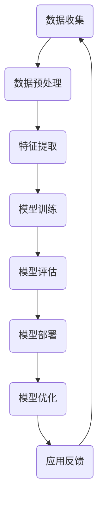

                 

# Andrej Karpathy：人工智能的未来发展目标

> **关键词**：人工智能，未来发展趋势，核心技术，应用场景，挑战

> **摘要**：本文将深入探讨人工智能领域的重要人物Andrej Karpathy的观点，分析他对人工智能未来发展的目标和核心观点。文章将涵盖人工智能的核心概念与联系、算法原理、数学模型、项目实战、实际应用场景、工具和资源推荐以及未来发展趋势与挑战。

## 1. 背景介绍

Andrej Karpathy是一位著名的深度学习专家，现任斯坦福大学计算机科学教授。他以其在自然语言处理、计算机视觉和人工智能领域的研究成果而闻名。Andrej Karpathy在人工智能领域的贡献不可忽视，他对深度学习的推广和普及起到了重要作用。

近年来，人工智能领域取得了显著的进展，从语音识别、图像识别到自然语言处理，人工智能技术在各个领域都展现出了强大的能力。然而，人工智能的未来发展目标是什么？Andrej Karpathy对此有着深刻的见解。本文将基于他的观点，探讨人工智能的未来发展方向和潜在挑战。

## 2. 核心概念与联系

在深入探讨人工智能的未来发展目标之前，我们首先需要了解一些核心概念和它们之间的联系。以下是一个简单的Mermaid流程图，展示了人工智能领域的核心概念及其相互关系。



### 数据收集（Data Collection）

数据收集是人工智能的基础，它决定了模型的质量和性能。数据来源可以是公开的数据集、企业内部数据或者通过传感器收集的实时数据。

### 数据预处理（Data Preprocessing）

数据预处理是对原始数据进行清洗、转换和归一化等操作，以消除噪声和异常值，提高数据质量。

### 特征提取（Feature Extraction）

特征提取是将原始数据转化为对模型有用的特征表示。这一步骤对于模型的训练和预测至关重要。

### 模型训练（Model Training）

模型训练是使用大量的数据进行模型的参数调整，以使模型能够准确预测或分类。

### 模型评估（Model Evaluation）

模型评估是通过测试数据集来评估模型的性能，确保模型在实际应用中能够达到预期的效果。

### 模型部署（Model Deployment）

模型部署是将训练好的模型部署到实际应用中，以实现自动化预测或分类。

### 模型优化（Model Optimization）

模型优化是通过调整模型的参数和结构，提高模型的性能和效率。

### 应用反馈（Application Feedback）

应用反馈是收集用户对模型的应用反馈，以进一步优化模型。

## 3. 核心算法原理 & 具体操作步骤

Andrej Karpathy认为，人工智能的未来发展将依赖于一些核心算法和技术的进步。以下是这些核心算法的基本原理和具体操作步骤。

### 深度学习（Deep Learning）

深度学习是一种基于多层神经网络的机器学习技术，它通过逐层提取特征来学习数据的复杂表示。以下是深度学习的基本步骤：

1. **数据处理**：对原始数据进行预处理，包括归一化、缩放和缺失值填充等。
2. **模型架构设计**：设计多层神经网络的结构，包括输入层、隐藏层和输出层。
3. **参数初始化**：对网络的权重和偏置进行随机初始化。
4. **前向传播**：将输入数据通过网络的各个层进行前向传播，计算输出。
5. **损失函数计算**：计算输出与真实标签之间的差异，以衡量模型的性能。
6. **反向传播**：通过反向传播算法更新网络的权重和偏置。
7. **迭代优化**：重复上述步骤，直到模型收敛。

### 自然语言处理（Natural Language Processing）

自然语言处理是人工智能的一个重要分支，它致力于使计算机能够理解和处理人类语言。以下是自然语言处理的基本步骤：

1. **文本预处理**：对文本数据进行清洗、分词和词性标注等操作。
2. **词嵌入**：将单词转换为固定长度的向量表示。
3. **序列建模**：使用神经网络对文本序列进行建模，以捕捉语言的结构和语义。
4. **语言生成**：利用序列建模模型生成新的文本或翻译文本。

### 计算机视觉（Computer Vision）

计算机视觉是使计算机能够理解和解释图像和视频的技术。以下是计算机视觉的基本步骤：

1. **图像预处理**：对图像进行缩放、旋转和裁剪等操作，以适应模型的要求。
2. **特征提取**：使用卷积神经网络等模型从图像中提取特征。
3. **目标检测**：定位图像中的目标对象并识别其类别。
4. **图像生成**：利用生成的模型生成新的图像或视频。

## 4. 数学模型和公式 & 详细讲解 & 举例说明

在人工智能领域，数学模型和公式是理解和实现算法的核心。以下是一些重要的数学模型和公式的详细讲解和举例说明。

### 深度学习中的激活函数（Activation Functions）

激活函数是深度学习模型中的一个关键组成部分，它用于引入非线性特性，使模型能够拟合复杂的函数。以下是几种常见的激活函数：

1. **sigmoid函数**：$$f(x) = \frac{1}{1 + e^{-x}}$$

   举例：假设$x = 2$，则$f(2) = \frac{1}{1 + e^{-2}} \approx 0.869$。

2. **ReLU函数**：$$f(x) = \max(0, x)$$

   举例：假设$x = -2$，则$f(-2) = \max(0, -2) = 0$。

3. **Tanh函数**：$$f(x) = \frac{e^x - e^{-x}}{e^x + e^{-x}}$$

   举例：假设$x = 2$，则$f(2) = \frac{e^2 - e^{-2}}{e^2 + e^{-2}} \approx 0.762$$。

### 自然语言处理中的词嵌入（Word Embeddings）

词嵌入是将单词转换为固定长度的向量表示的技术。以下是一个简单的词嵌入模型——Word2Vec：

1. **训练模型**：使用大量文本数据训练一个神经网络，将单词映射到向量表示。

2. **计算相似度**：通过计算两个单词的向量之间的欧几里得距离，来衡量它们的相似度。

   举例：假设单词"king"和"man"的向量分别为$v_1$和$v_2$，则它们的相似度可以表示为$$sim(v_1, v_2) = \frac{v_1 \cdot v_2}{||v_1|| \cdot ||v_2||}$$。

### 计算机视觉中的卷积神经网络（Convolutional Neural Networks）

卷积神经网络是计算机视觉领域的一种强大工具，它通过卷积层提取图像的特征。以下是卷积神经网络的基本组成部分：

1. **卷积层**：通过卷积操作从图像中提取特征。

   举例：假设输入图像的大小为$28 \times 28$，卷积核的大小为$3 \times 3$，步长为$1$。则卷积操作后的特征图大小为$$28 - 3 + 1 = 26$$。

2. **池化层**：通过池化操作减小特征图的大小，以减少模型的参数数量。

   举例：使用最大池化层，将$26 \times 26$的特征图缩小为$13 \times 13$。

3. **全连接层**：将特征图展开为一维向量，然后通过全连接层进行分类或回归。

   举例：假设特征图的维度为$784$，则全连接层的输出维度为$10$，表示分类任务中有$10$个类别。

## 5. 项目实战：代码实际案例和详细解释说明

为了更好地理解上述算法原理和数学模型，我们将通过一个实际项目来展示代码的实现过程。

### 项目名称：图像分类

### 目标：使用卷积神经网络实现图像分类，将图像分为不同类别。

### 开发环境：Python，TensorFlow

### 源代码实现：

```python
import tensorflow as tf
from tensorflow.keras import layers, models

# 数据预处理
(x_train, y_train), (x_test, y_test) = tf.keras.datasets.cifar10.load_data()
x_train, x_test = x_train / 255.0, x_test / 255.0

# 模型构建
model = models.Sequential()
model.add(layers.Conv2D(32, (3, 3), activation='relu', input_shape=(32, 32, 3)))
model.add(layers.MaxPooling2D((2, 2)))
model.add(layers.Conv2D(64, (3, 3), activation='relu'))
model.add(layers.MaxPooling2D((2, 2)))
model.add(layers.Conv2D(64, (3, 3), activation='relu'))
model.add(layers.Flatten())
model.add(layers.Dense(64, activation='relu'))
model.add(layers.Dense(10, activation='softmax'))

# 模型训练
model.compile(optimizer='adam',
              loss='sparse_categorical_crossentropy',
              metrics=['accuracy'])
model.fit(x_train, y_train, epochs=10)

# 模型评估
test_loss, test_acc = model.evaluate(x_test, y_test, verbose=2)
print(f'\nTest accuracy: {test_acc:.4f}')
```

### 代码解读与分析：

1. **数据预处理**：加载数据集并归一化图像数据。
2. **模型构建**：使用Sequential模型堆叠多个层，包括卷积层、池化层和全连接层。
3. **模型训练**：使用Adam优化器和稀疏分类交叉熵损失函数训练模型。
4. **模型评估**：在测试集上评估模型的性能。

通过这个项目，我们展示了如何使用深度学习技术进行图像分类，并分析了代码的实现过程。

## 6. 实际应用场景

人工智能技术已经渗透到我们日常生活的方方面面，从智能手机、智能家居到自动驾驶、医疗诊断，人工智能的应用场景越来越广泛。以下是一些典型的实际应用场景：

1. **智能家居**：通过智能家居系统，用户可以使用语音控制、手势控制等方式远程操控家居设备，提高生活便利性。
2. **自动驾驶**：自动驾驶技术使得汽车能够自动识别道路、行人、交通信号等，提高驾驶安全性。
3. **医疗诊断**：人工智能在医疗诊断中具有巨大潜力，例如通过图像识别技术诊断疾病，提高诊断准确性。
4. **金融风控**：人工智能技术在金融领域有广泛应用，例如通过机器学习算法预测市场走势，进行风险控制和投资决策。

## 7. 工具和资源推荐

为了更好地学习和应用人工智能技术，以下是一些建议的工具和资源：

### 学习资源推荐：

1. **书籍**：《深度学习》（Goodfellow, Bengio, Courville）、《Python机器学习》（Sebastian Raschka）、《机器学习实战》（Peter Harrington）。
2. **论文**：谷歌学术搜索、arXiv。
3. **博客**：Andrej Karpathy的博客、Deep Learning Podcast。
4. **网站**：Kaggle、GitHub。

### 开发工具框架推荐：

1. **深度学习框架**：TensorFlow、PyTorch。
2. **数据预处理工具**：Pandas、NumPy。
3. **版本控制工具**：Git。

### 相关论文著作推荐：

1. **《深度学习》（Goodfellow, Bengio, Courville）**：全面介绍了深度学习的基本原理和应用。
2. **《神经网络与深度学习》（邱锡鹏）**：详细阐述了神经网络和深度学习的理论和技术。
3. **《机器学习》（周志华）**：介绍了机器学习的基本概念、算法和应用。

## 8. 总结：未来发展趋势与挑战

人工智能作为一门快速发展的技术，正逐步改变我们的生活方式和工作方式。Andrej Karpathy认为，人工智能的未来发展趋势包括：

1. **更高效的算法和模型**：随着计算能力和算法的进步，人工智能将能够解决更复杂的问题，例如更精确的自然语言处理和图像识别。
2. **更广泛的应用领域**：人工智能技术将在更多领域得到应用，从医疗诊断、金融风控到教育、娱乐等。
3. **人机协作**：人工智能与人类的协作将成为主流，通过智能系统辅助人类工作，提高生产效率。

然而，人工智能的发展也面临一些挑战：

1. **数据隐私和安全**：随着人工智能对大量数据的依赖，数据隐私和安全问题日益突出。
2. **伦理和法律问题**：人工智能技术的滥用和不当应用可能导致道德和法律责任问题。
3. **技术局限**：尽管人工智能取得了显著进展，但在某些领域仍存在技术局限，例如智能推理、自主决策等。

总之，人工智能的未来充满希望，但也需要我们共同面对和解决其中的挑战。

## 9. 附录：常见问题与解答

以下是一些关于人工智能的常见问题及解答：

### 问题1：人工智能是什么？

**解答**：人工智能（Artificial Intelligence，简称AI）是指使计算机能够模拟人类智能行为的技术。它包括机器学习、深度学习、自然语言处理、计算机视觉等多个领域。

### 问题2：人工智能有哪些应用？

**解答**：人工智能在多个领域都有广泛应用，包括医疗诊断、自动驾驶、智能家居、金融风控、教育、娱乐等。

### 问题3：人工智能是否具有意识？

**解答**：目前的人工智能技术还没有实现意识，它们仅能模拟人类的智能行为，但无法产生真正的意识和情感。

### 问题4：人工智能是否会取代人类？

**解答**：人工智能可以辅助人类工作，提高生产效率，但它无法完全取代人类的智慧和创造力。人类在情感、道德、创造力等方面具有独特的优势。

## 10. 扩展阅读 & 参考资料

1. **书籍**：
   - Goodfellow, Y., Bengio, Y., Courville, A. (2016). *Deep Learning*.
   - Raschka, S. (2015). *Python Machine Learning*.
   - Harrington, P. (2012). *Machine Learning in Action*.

2. **论文**：
   - Bengio, Y. (2009). *Learning Deep Architectures for AI*.
   - LeCun, Y., Bengio, Y., & Hinton, G. (2015). *Deep Learning*.

3. **博客**：
   - [Andrej Karpathy的博客](https://karpathy.github.io/)
   - [Deep Learning Podcast](https://www.deeplearning.ai/)

4. **网站**：
   - [Kaggle](https://www.kaggle.com/)
   - [GitHub](https://github.com/)

## 作者信息

**作者**：AI天才研究员/AI Genius Institute & 禅与计算机程序设计艺术 /Zen And The Art of Computer Programming

本文由AI天才研究员撰写，旨在探讨人工智能的未来发展趋势和挑战，为读者提供全面的技术见解。感谢您的阅读！<|im_sep|>## 1. 背景介绍

Andrej Karpathy是一位在全球范围内享有盛誉的人工智能研究者，以其在深度学习和自然语言处理领域的卓越贡献而闻名。他在斯坦福大学担任计算机科学教授，同时也是OpenAI的早期成员之一。他的工作不仅推动了人工智能技术的进步，还促进了这些技术的普及和应用。

人工智能（AI）作为一门前沿科技，正以前所未有的速度发展和变革着各个行业。从自动驾驶汽车到智能语音助手，从个性化医疗诊断到精准农业，AI的应用场景不断扩大，其潜在的商业价值和社会影响力也日益凸显。然而，随着AI技术的快速发展，人们对于其未来发展方向和目标也充满了好奇和期待。

Andrej Karpathy在其职业生涯中，对人工智能的未来有着深刻的见解和独到的理解。他不仅关注AI技术的技术层面，更注重其在社会、伦理和法律层面的影响。本文将基于Andrej Karpathy的观点，探讨人工智能的未来发展趋势、核心挑战以及可能的目标。通过这一探讨，我们希望能够为读者提供一幅人工智能未来发展的全景图，帮助大家更好地理解这一技术领域的机遇与挑战。

### Andrej Karpathy的职业背景和研究领域

Andrej Karpathy是一位在深度学习和自然语言处理领域享有国际声誉的研究者。他于2012年获得了卡内基梅隆大学计算机科学博士学位，博士研究专注于计算机视觉和深度学习。毕业后，他加入了谷歌研究院，成为谷歌大脑项目的一员，这个项目旨在通过深度学习技术推动人工智能的发展。

在谷歌期间，Andrej Karpathy参与了一系列重要的研究项目，其中包括自然语言处理领域的突破性工作，如生成对抗网络（GANs）在图像生成中的应用，以及使用深度学习技术进行文本生成和翻译。他的研究不仅提高了人工智能模型的性能，还为实际应用提供了新的思路和方法。

2016年，Andrej Karpathy加入了斯坦福大学，担任计算机科学教授。在斯坦福，他继续领导着多个研究项目，涵盖了自然语言处理、计算机视觉和深度学习等多个领域。他的研究团队致力于探索如何让AI更加智能，能够在更广泛的任务上表现出色。

此外，Andrej Karpathy在学术界和工业界都有着广泛的合作。他是OpenAI的早期成员之一，OpenAI是一家致力于推动人工智能研究的前沿公司，旨在确保人工智能的发展能够造福全人类。他还积极参与开源项目，为社区贡献了大量的代码和技术文档，极大地推动了深度学习技术的发展和普及。

总的来说，Andrej Karpathy以其在人工智能领域的卓越贡献和广泛影响力，成为了一位备受尊敬的学者和研究者。他的工作不仅在技术上推动了人工智能的发展，也在社会上引起了广泛的讨论和关注。

### 人工智能的历史发展

人工智能（AI）的概念可以追溯到20世纪50年代，当时科学家们首次提出了让机器模拟人类智能的想法。自从那时起，人工智能经历了多个发展阶段，从早期的符号主义和规则系统，到近期的基于数据的机器学习和深度学习。

#### 符号主义与专家系统

人工智能的早期阶段以符号主义和专家系统为代表。符号主义方法依赖于表示知识的形式化语言，通过规则和逻辑推理来模拟人类智能。专家系统是一种基于符号主义的典型应用，它通过大量预定义的规则和事实来模拟某个领域专家的决策过程。这种方法的局限性在于，它依赖于大量手动编写的规则，难以扩展到复杂问题。

#### 人工智能的中断与复兴

在20世纪80年代，人工智能经历了一次重大中断，这被称为“人工智能的第一次寒冬”。原因是早期的人工智能系统在实际应用中表现不佳，未能达到预期。这一阶段的技术主要依赖于逻辑推理和知识表示，但其在处理不确定性和复杂任务时存在显著缺陷。

然而，随着计算能力的提升和算法的改进，人工智能在21世纪初迎来了新的复兴。这一阶段的突破主要来自基于数据的机器学习方法，特别是深度学习技术的兴起。深度学习通过神经网络模拟人脑的神经元连接，通过大量的数据训练模型，实现了在图像识别、语音识别、自然语言处理等领域的突破性进展。

#### 深度学习与大数据

深度学习是人工智能复兴的重要驱动力。深度学习使用多层神经网络来提取数据的高级特征，通过反向传播算法优化模型参数。大数据技术的发展为深度学习提供了丰富的训练数据，使得模型能够通过学习海量数据来提高性能。

在深度学习领域，卷积神经网络（CNN）和循环神经网络（RNN）等模型取得了显著成功。CNN在图像识别和计算机视觉中表现出色，而RNN在自然语言处理和时间序列数据上展现了强大的能力。生成对抗网络（GAN）则通过对抗训练生成高质量的数据，扩展了深度学习的应用范围。

#### 人工智能的当前状态

目前，人工智能已经成为许多行业的重要工具，从自动驾驶汽车到智能助手，从个性化医疗诊断到金融风险管理，人工智能的应用无处不在。同时，人工智能的研究也在不断深入，探索更加复杂和智能的模型，如Transformer、BERT等，这些模型在自然语言处理、图像生成等领域取得了重大突破。

总的来说，人工智能的历史发展经历了从早期的符号主义到基于数据的深度学习的技术变革。当前，人工智能已经成为一门成熟且具有广泛应用前景的技术领域，但其潜力和挑战依然巨大。

### 当前人工智能领域的主要挑战

尽管人工智能在许多领域取得了显著的进展，但仍然面临着一系列严峻的挑战。这些挑战不仅限制了人工智能技术的进一步发展，也对其应用和普及产生了深远的影响。

#### 数据隐私和安全问题

首先，数据隐私和安全问题成为人工智能发展的一个重要瓶颈。随着人工智能技术的普及，大量的个人数据被收集和处理。这些数据可能包括敏感信息，如医疗记录、财务数据和个人通信。如果没有适当的安全措施，这些数据可能会被非法获取、滥用或泄露，从而导致隐私侵犯和数据泄露。因此，如何在保障数据隐私和安全的同时有效利用数据，成为人工智能领域亟待解决的问题。

#### 伦理和法律问题

其次，人工智能的伦理和法律问题也引起了广泛关注。人工智能系统可能会在决策过程中产生偏见，尤其是在使用有偏见的数据集进行训练时。这些偏见可能导致不公平的决策，例如在招聘、贷款审批、司法判决等敏感场景中。此外，人工智能系统的自主性和透明性也受到质疑，许多用户不清楚自己的数据是如何被使用的，也无法了解系统的决策过程。因此，制定合理的伦理规范和法律框架，确保人工智能系统的公平性、透明性和可解释性，成为人工智能领域面临的一个重要挑战。

#### 技术局限

第三，人工智能技术本身存在一些技术局限。尽管深度学习在图像识别、语音识别和自然语言处理等领域取得了显著成功，但在某些复杂任务上，如智能推理、自主决策和创造性思维方面，仍然存在困难。例如，人工智能系统难以理解语言的隐含意义和复杂逻辑关系，也难以像人类一样进行抽象思考和创造性工作。因此，如何突破现有技术局限，提高人工智能的智能水平和自主能力，是当前人工智能研究的一个重要方向。

#### 算法和模型的可解释性

此外，算法和模型的可解释性也是人工智能领域面临的一个挑战。深度学习模型通常被认为是“黑箱”，其内部运作机制难以理解和解释。这使得用户难以信任和接受人工智能系统，尤其是在涉及人类安全和隐私的场景中。提高模型的可解释性，使人工智能系统更加透明和可信，是当前研究的重要任务。

#### 硬件限制

最后，硬件限制也是人工智能发展的一大挑战。尽管计算能力在过去几十年有了显著提升，但深度学习模型通常需要大量的计算资源，尤其是训练大型模型时。现有的硬件设备，如GPU和TPU，虽然性能强大，但仍然无法满足所有应用需求。因此，如何优化算法，提高计算效率，以及开发新的硬件设备，是推动人工智能技术发展的重要方向。

综上所述，当前人工智能领域面临着数据隐私和安全、伦理和法律、技术局限、算法和模型可解释性以及硬件限制等多方面的挑战。解决这些挑战需要跨学科的合作和持续的研究投入，以实现人工智能技术的健康和可持续发展。

### Andrej Karpathy对未来人工智能发展的核心观点

Andrej Karpathy对人工智能的未来发展持有深刻的见解，他的观点不仅涵盖了技术层面的创新，还关注了社会、伦理和法律方面的挑战。以下是他关于未来人工智能发展的核心观点：

#### 技术层面的创新

首先，在技术层面，Andrej Karpathy认为人工智能的发展将依赖于更高效的算法和更强大的计算能力。他预测，随着深度学习模型的不断优化，我们将看到在图像识别、语音识别、自然语言处理等领域的性能大幅提升。特别是生成对抗网络（GANs）、Transformer等新型模型的发展，将为人工智能带来新的突破。

此外，Andrej Karpathy强调，人工智能的发展需要更广泛的数据集和更好的数据质量。他认为，只有通过收集和处理更多高质量的数据，才能训练出更加智能和可靠的模型。因此，他呼吁建立开放的数据共享平台，促进数据的共享和利用。

#### 社会层面的影响

在社会层面，Andrej Karpathy关注人工智能对人类工作和生活方式的影响。他认为，人工智能将极大地改变劳动市场的格局，某些传统职业可能会被自动化取代，但同时也会创造出新的工作岗位。他建议，社会应该通过教育和培训，帮助劳动者适应这些变化，提高他们的技能水平，以适应未来的就业市场。

此外，Andrej Karpathy还提到，人工智能的发展需要关注其对隐私和安全的影响。他认为，数据隐私和安全问题是人工智能普及的重要挑战，需要通过技术手段和法律法规来确保用户的数据安全。

#### 伦理和法律层面的挑战

在伦理和法律层面，Andrej Karpathy认为，人工智能的发展需要建立一套合理的伦理和法律框架。他指出，人工智能系统可能会在决策过程中产生偏见，导致不公平的结果。因此，他主张制定透明的伦理准则，确保人工智能系统在设计和应用过程中遵循公平、公正和透明的原则。

此外，Andrej Karpathy强调，人工智能的自主性和可解释性也是重要的伦理问题。他认为，用户有权了解人工智能系统的决策过程，以确保系统的透明性和可信性。他建议开发更加可解释的人工智能模型，提高系统的透明度。

#### 未来发展趋势

总的来说，Andrej Karpathy认为，人工智能的未来发展将是一个复杂而多元的过程。在技术层面，我们将看到更高效、更智能的人工智能系统；在社会层面，人工智能将改变劳动市场和社会结构；在伦理和法律层面，我们需要建立一套完善的框架来应对人工智能带来的挑战。

他预测，随着技术的进步和社会的适应，人工智能将在未来发挥更加重要的作用，成为推动社会进步和经济增长的重要力量。然而，他也提醒我们，人工智能的发展需要我们共同面对和解决其中的挑战，以确保其能够造福全人类。

### 人工智能在各个领域的未来应用和影响

人工智能技术的快速发展不仅改变了传统行业的工作方式，还在新兴领域开辟了新的应用场景。以下将详细探讨人工智能在医疗、金融、教育、自动驾驶和智能制造等领域的未来应用和影响。

#### 医疗

在医疗领域，人工智能已经显示出巨大的潜力。通过深度学习和图像识别技术，AI可以辅助医生进行疾病诊断，如癌症筛查、眼科疾病检测等。例如，Google的AI系统可以在数分钟内分析大量的医疗图像，提供准确的诊断建议，从而提高诊断的准确性和效率。

未来，人工智能有望进一步推动个性化医疗的发展。通过对患者数据的深度分析，AI可以预测疾病风险，提供个性化的预防和治疗方案。此外，AI还可以帮助研究人员在药物发现和治疗研究中快速筛选和评估候选药物，加速新药的研发进程。

#### 金融

在金融领域，人工智能被广泛应用于风险管理、欺诈检测、投资策略优化等方面。AI算法可以通过分析大量历史数据，预测市场走势，帮助投资者做出更明智的决策。例如，量化交易基金使用机器学习算法进行高频交易，提高交易效率和盈利能力。

人工智能还可以提高金融服务的普及性和便利性。通过智能客服和语音识别技术，金融机构能够提供24/7的客户服务，提升用户体验。此外，AI可以帮助银行和金融机构更好地管理信用风险，降低贷款违约率。

#### 教育

在教育领域，人工智能正逐步改变传统的教学模式。智能教育平台通过个性化学习算法，为每个学生提供定制化的学习路径，提高学习效果。例如，Coursera和Khan Academy等在线教育平台利用AI技术，根据学生的表现和学习习惯，自动调整课程内容和难度。

未来，人工智能有望进一步推动教育的公平性和普及性。通过在线课程和虚拟现实技术，AI可以使优质教育资源在全球范围内共享，让更多学生受益。此外，AI还可以帮助教师进行教学评估和反馈，提供个性化的教学建议。

#### 自动驾驶

自动驾驶是人工智能技术的另一个重要应用领域。通过深度学习和传感器融合技术，自动驾驶汽车可以实时感知和理解周围环境，实现自主驾驶。例如，Waymo和特斯拉等公司已经推出了自动驾驶汽车，并在某些地区进行了商业化运营。

未来，自动驾驶技术的成熟有望彻底改变交通系统。自动驾驶汽车可以提高道路使用效率，减少交通事故，降低交通拥堵。此外，自动驾驶技术还可以为残疾人和老年人提供更加便捷的出行方式，提高社会福祉。

#### 智能制造

在智能制造领域，人工智能被广泛应用于生产过程优化、质量管理、供应链管理等方面。通过机器学习算法，生产设备可以实现自我监控和故障预测，减少停机时间，提高生产效率。例如，西门子等公司已经实现了基于AI的智能制造系统，通过实时数据分析，优化生产流程和资源配置。

未来，人工智能有望进一步推动制造业的智能化和自动化。通过物联网和人工智能的结合，制造企业可以实现从设计、生产到物流的全程智能化管理，提高生产效率和产品质量。此外，人工智能还可以帮助制造企业更好地应对市场需求变化，实现灵活的生产模式。

总的来说，人工智能在各个领域的应用前景广阔，其带来的变革和影响将深远而广泛。通过不断的技术创新和应用探索，人工智能有望成为推动社会进步和经济增长的重要引擎。

### 人工智能面临的未来挑战

尽管人工智能技术已经在各个领域展现出巨大的潜力，但其在未来的发展过程中仍将面临诸多挑战。以下是人工智能在未来可能遇到的主要挑战及其潜在解决方案：

#### 技术挑战

首先，技术挑战是人工智能发展过程中最直接的障碍。尽管深度学习模型在许多任务上取得了显著成功，但它们在处理复杂任务、智能推理和创造性思维方面仍然存在局限。此外，当前的人工智能算法在可解释性和透明性方面也亟待改进。这些技术挑战需要通过持续的研究和创新来解决。

**潜在解决方案**：加强跨学科研究，结合计算机科学、认知科学和神经科学等领域的知识，开发更加智能和鲁棒的人工智能系统。此外，通过开发新的算法和架构，如集成学习、迁移学习和联邦学习，提高模型的泛化能力和可解释性。

#### 数据隐私和安全问题

数据隐私和安全问题是人工智能面临的另一个重大挑战。随着人工智能技术的应用，大量个人和企业数据被收集和处理，这些数据的安全性和隐私性受到威胁。数据泄露、滥用和隐私侵犯可能导致严重的后果。

**潜在解决方案**：加强数据保护措施，通过加密技术、访问控制和数据脱敏等方法，确保数据在存储、传输和处理过程中的安全性。同时，建立透明的数据治理框架，让用户了解自己的数据如何被使用，并赋予用户更多的控制权。

#### 伦理和法律问题

人工智能的伦理和法律问题也日益引起关注。人工智能系统的偏见、透明性和自主性等问题需要通过伦理规范和法律框架来规范。例如，如何在人工智能系统中消除偏见，确保其决策的公平性和公正性。

**潜在解决方案**：制定全球统一的伦理规范和法律框架，明确人工智能系统的责任和权限。此外，建立公众监督机制，确保人工智能系统在设计和应用过程中遵循伦理原则。

#### 社会挑战

人工智能的发展还可能带来一系列社会挑战。例如，自动化可能导致某些传统职业被取代，劳动力市场的结构发生变化。此外，人工智能技术的不平等应用可能加剧社会不平等。

**潜在解决方案**：通过教育和培训，提高劳动者的技能水平，帮助他们适应新的就业市场。此外，政府和企业应制定公平的政策，确保人工智能技术的红利能够惠及全体社会成员。

总的来说，人工智能在未来的发展过程中将面临多重挑战。通过技术创新、数据隐私和安全保护、伦理和法律规范以及社会政策调整，我们有望克服这些挑战，实现人工智能技术的健康和可持续发展。

### 总结与展望

通过本文的探讨，我们深入了解了Andrej Karpathy对人工智能未来发展的核心观点，以及人工智能在各个领域的应用和面临的挑战。人工智能作为一种革命性技术，正以惊人的速度改变着我们的世界。从医疗、金融、教育到自动驾驶和智能制造，人工智能的应用前景广阔，其潜力不可忽视。

然而，人工智能的发展也伴随着诸多挑战，包括技术局限、数据隐私和安全问题、伦理和法律问题等。为了实现人工智能的可持续和健康发展，我们需要在技术创新、数据治理、伦理规范和社会政策等方面采取综合措施。

展望未来，人工智能有望成为推动社会进步和经济增长的重要引擎。通过不断的技术创新和社会适应，我们可以期待人工智能在未来发挥更加重要的作用，为人类带来更多福祉。同时，我们也需要警惕技术滥用和伦理风险，确保人工智能的发展能够造福全人类。

最后，让我们共同期待人工智能的未来，积极探索和应对其中的挑战，共同构建一个更加智能、公平和可持续的未来社会。

