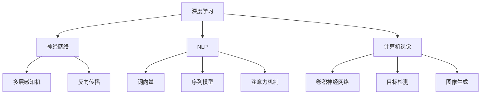

                 

### 1. 背景介绍

#### AI的快速发展

自20世纪50年代人工智能（AI）概念提出以来，它已经经历了无数次变革和迭代。在早期，人工智能主要集中在逻辑推理和规则系统上，但由于计算能力和算法的限制，当时的AI应用范围非常有限。随着计算机性能的不断提升和算法的改进，尤其是深度学习（Deep Learning）的兴起，人工智能迎来了革命性的发展。

深度学习是一种通过多层神经网络对数据进行学习和建模的技术，它使得机器能够在没有明确编程指令的情况下自动学习和发现数据中的模式和规律。这一突破性进展使得AI在图像识别、自然语言处理、语音识别等多个领域取得了显著的成果，从而推动了AI的快速发展。

#### 当前AI的应用场景

如今，AI已经在多个领域得到了广泛应用。以下是一些典型的AI应用场景：

- **图像识别**：AI能够通过分析图像中的像素数据，识别并分类不同的物体。例如，自动驾驶汽车利用AI进行道路标识、行人检测等。
- **自然语言处理**：AI能够理解、生成和翻译自然语言，广泛应用于智能客服、机器翻译、文本生成等。
- **语音识别**：AI能够将语音信号转换为文本，广泛应用于语音助手、语音搜索等。
- **推荐系统**：AI能够根据用户的历史行为和偏好，提供个性化的推荐，广泛应用于电子商务、社交媒体等。
- **医学诊断**：AI能够在医学影像分析、疾病预测等方面提供辅助决策，提高医疗诊断的准确性和效率。

#### 当前AI的挑战

尽管AI在许多领域取得了巨大进展，但它仍然面临一些挑战：

- **数据隐私与安全**：AI系统的训练和运行需要大量的数据，这引发了对数据隐私和安全的担忧。
- **算法公平性**：AI算法可能会因为训练数据的不公平性而导致偏见，影响决策的公平性。
- **解释性**：许多AI系统，尤其是深度学习模型，往往被认为是“黑盒”，其决策过程难以解释，这限制了其在某些领域的应用。
- **能源消耗**：AI系统，特别是需要大量计算资源的深度学习模型，对能源消耗提出了很高的要求。

#### 文章目标

本文将深入探讨人工智能的未来发展目标，从技术、应用、伦理等多个角度进行分析，旨在为读者提供一幅全面的AI发展蓝图。通过本文，读者将了解到：

1. 人工智能的核心技术及其发展趋势。
2. AI在不同领域的应用场景和前景。
3. AI面临的挑战以及可能的解决方案。
4. AI对社会和经济的影响及其应对策略。

接下来的章节中，我们将一步步分析人工智能的核心概念、算法原理、数学模型、项目实战，以及AI的实际应用场景和未来发展趋势。

### 2. 核心概念与联系

#### 2.1 深度学习（Deep Learning）

深度学习是人工智能领域的一种重要技术，它通过构建多层神经网络来模拟人脑的学习过程。深度学习的核心概念包括：

- **神经网络（Neural Networks）**：神经网络由多个神经元（或节点）组成，每个神经元都与其他神经元相连，并传递信息。神经网络通过调整连接权重来学习数据中的模式和规律。
- **多层感知机（MLP）**：多层感知机是一种简单的神经网络结构，它包含输入层、隐藏层和输出层。隐藏层负责提取数据的高层特征，输出层负责进行分类或回归。
- **反向传播（Backpropagation）**：反向传播是一种用于训练神经网络的算法，它通过计算输出层的误差，反向传播到隐藏层，并逐层调整权重。

#### 2.2 自然语言处理（Natural Language Processing, NLP）

自然语言处理是人工智能的一个子领域，它致力于让计算机理解和处理人类语言。NLP的核心概念包括：

- **词向量（Word Vectors）**：词向量是一种将词汇表示为高维向量空间中点的技术，它使得词汇在空间中具有一定的语义关系。
- **序列模型（Sequence Models）**：序列模型是一类用于处理序列数据的神经网络结构，如循环神经网络（RNN）和长短期记忆网络（LSTM）。这些模型能够捕捉序列中的时间依赖关系。
- **注意力机制（Attention Mechanism）**：注意力机制是一种用于提高序列模型性能的技术，它能够关注序列中的重要部分，从而提高模型的准确性和效率。

#### 2.3 计算机视觉（Computer Vision）

计算机视觉是人工智能的另一个重要领域，它致力于使计算机能够理解并解释图像和视频。计算机视觉的核心概念包括：

- **卷积神经网络（CNN）**：卷积神经网络是一种专门用于处理图像数据的神经网络结构，它通过卷积操作提取图像中的局部特征。
- **目标检测（Object Detection）**：目标检测是一种用于识别图像中物体的技术，它能够定位并识别图像中的多个物体。
- **图像生成（Image Generation）**：图像生成是一种通过神经网络生成新的图像的技术，如生成对抗网络（GAN）。这种技术可以用于图像修复、图像风格迁移等。

#### Mermaid 流程图

以下是深度学习、自然语言处理和计算机视觉的核心概念和结构的 Mermaid 流程图：



通过上述流程图，我们可以清晰地看到深度学习、自然语言处理和计算机视觉之间的联系和核心概念。这些技术不仅各自发展，而且在实际应用中相互促进，共同推动人工智能的进步。

### 3. 核心算法原理 & 具体操作步骤

#### 3.1 深度学习算法原理

深度学习算法的核心是多层神经网络，它通过多个层的组合来提取数据中的特征。以下是深度学习算法的基本原理和操作步骤：

1. **初始化网络参数**：首先，我们需要初始化神经网络的权重和偏置，这些参数决定了网络的行为。
2. **前向传播（Forward Propagation）**：前向传播是深度学习算法中的一个步骤，它将输入数据通过网络的各个层，直到输出层。在这个过程中，每一层都会对输入数据进行处理，并传递给下一层。
3. **计算损失（Compute Loss）**：在前向传播之后，我们需要计算网络的输出和实际输出之间的差距，这个差距被称为损失。常见的损失函数包括均方误差（MSE）和交叉熵（Cross-Entropy）。
4. **反向传播（Backpropagation）**：反向传播是深度学习算法中的关键步骤，它通过计算损失相对于网络参数的梯度，来更新网络的权重和偏置。
5. **优化参数（Optimize Parameters）**：通过反向传播得到的梯度，我们可以使用梯度下降（Gradient Descent）等优化算法来更新网络参数，从而最小化损失。
6. **迭代训练（Iterative Training）**：重复上述步骤，直到网络达到预定的性能指标或者训练达到设定的迭代次数。

#### 3.2 自然语言处理算法原理

自然语言处理算法的核心是理解和生成自然语言。以下是自然语言处理算法的基本原理和操作步骤：

1. **词嵌入（Word Embedding）**：词嵌入是将词汇映射到高维向量空间中的过程。通过词嵌入，我们可以将文本转换为向量表示，从而在计算机中进行处理。
2. **序列编码（Sequence Encoding）**：序列编码是将文本序列转换为序列向量的过程。常见的编码方法包括嵌入层、循环神经网络（RNN）和变换器（Transformer）。
3. **注意力机制（Attention Mechanism）**：注意力机制是一种用于捕捉序列中重要信息的技术。它通过为序列中的每个元素分配不同的权重，来提高模型的准确性和效率。
4. **解码（Decoding）**：在生成文本时，解码器将编码后的序列向量解码为最终的输出。常见的解码方法包括贪婪解码、采样解码和自注意力解码。
5. **损失函数与优化（Loss Function & Optimization）**：与深度学习算法类似，自然语言处理算法也通过计算损失函数（如交叉熵）来优化模型参数，从而提高模型的性能。

#### 3.3 计算机视觉算法原理

计算机视觉算法的核心是理解和解释图像。以下是计算机视觉算法的基本原理和操作步骤：

1. **卷积操作（Convolution Operation）**：卷积操作是计算机视觉算法中最基本的操作。它通过在图像上滑动卷积核来提取局部特征。
2. **池化操作（Pooling Operation）**：池化操作用于降低图像的维度，并减少计算量。常见的池化方法包括最大池化和平均池化。
3. **特征提取（Feature Extraction）**：特征提取是将图像中的像素数据转换为特征向量的过程。这通常通过多层卷积神经网络实现。
4. **分类与回归（Classification & Regression）**：在特征提取之后，我们需要使用分类或回归算法来对图像进行分类或回归。常见的分类算法包括支持向量机（SVM）、卷积神经网络（CNN）和深度神经网络（DNN）。
5. **优化与训练（Optimization & Training）**：与深度学习和自然语言处理类似，计算机视觉算法也需要通过优化和训练来提高模型的性能。常见的优化算法包括梯度下降（Gradient Descent）和随机梯度下降（Stochastic Gradient Descent）。

通过上述原理和步骤，我们可以看到深度学习、自然语言处理和计算机视觉算法在理解和解释数据方面的巨大潜力。这些算法不仅在学术界取得了显著的成果，而且在工业界也得到了广泛的应用。

### 4. 数学模型和公式 & 详细讲解 & 举例说明

#### 4.1 深度学习中的前向传播与反向传播

深度学习中的前向传播和反向传播是两个核心步骤，它们分别用于计算网络输出和更新网络参数。

**4.1.1 前向传播**

在前向传播中，输入数据经过网络的各个层，直到输出层。假设我们有输入 \(x\)、权重 \(w\) 和偏置 \(b\)，以及激活函数 \(f\)，则前向传播的计算过程如下：

\[ z = wx + b \]
\[ a = f(z) \]

其中，\(z\) 表示神经元的输入，\(a\) 表示神经元的输出，\(f\) 表示激活函数。对于多层网络，上述公式需要逐层计算，直到输出层。

**举例说明**：

假设我们有一个简单的神经网络，包含一个输入层、一个隐藏层和一个输出层。输入 \(x\) 为 \( (1, 2, 3) \)，权重 \( w \) 为 \( (0.1, 0.2, 0.3) \)，偏置 \( b \) 为 \( (0.1, 0.2, 0.3) \)，激活函数为 \( f(x) = \frac{1}{1 + e^{-x}} \)。

首先，计算隐藏层的输出：

\[ z_h = wx_h + b_h \]
\[ a_h = f(z_h) \]

其中，\( x_h \) 为隐藏层的输入，\( w_h \) 为隐藏层的权重，\( b_h \) 为隐藏层的偏置。

然后，计算输出层的输出：

\[ z_o = wx_o + b_o \]
\[ a_o = f(z_o) \]

其中，\( x_o \) 为输出层的输入，\( w_o \) 为输出层的权重，\( b_o \) 为输出层的偏置。

**4.1.2 反向传播**

在反向传播中，我们计算损失函数对网络参数的梯度，并使用这些梯度来更新网络参数。假设损失函数为 \( J \)，则反向传播的计算过程如下：

\[ \delta = \frac{\partial J}{\partial a} \cdot (1 - a) \]
\[ \delta_{h} = \frac{\partial J}{\partial a_h} \cdot (1 - a_h) \]
\[ \delta_{o} = \frac{\partial J}{\partial a_o} \cdot (1 - a_o) \]

\[ \frac{\partial J}{\partial z_h} = \delta_h \cdot \frac{\partial f_h}{\partial z_h} \]
\[ \frac{\partial J}{\partial z_o} = \delta_o \cdot \frac{\partial f_o}{\partial z_o} \]

\[ \frac{\partial J}{\partial w_h} = x_h^T \cdot \delta_h \]
\[ \frac{\partial J}{\partial b_h} = \delta_h \]
\[ \frac{\partial J}{\partial w_o} = x_o^T \cdot \delta_o \]
\[ \frac{\partial J}{\partial b_o} = \delta_o \]

**举例说明**：

假设我们的损失函数为均方误差（MSE），即 \( J = \frac{1}{2} \sum_{i=1}^{n} (a_o - y)^2 \)，其中 \( a_o \) 为输出层的输出，\( y \) 为真实标签。

首先，计算输出层的梯度：

\[ \delta_o = (a_o - y) \cdot (1 - a_o) \]

然后，计算隐藏层的梯度：

\[ \delta_h = \delta_o \cdot w_{oh} \cdot (1 - a_h) \]

接着，计算隐藏层的权重和偏置的梯度：

\[ \frac{\partial J}{\partial w_{oh}} = x_h^T \cdot \delta_o \]
\[ \frac{\partial J}{\partial b_h} = \delta_h \]

通过上述步骤，我们可以更新网络的权重和偏置，从而优化网络的性能。

#### 4.2 自然语言处理中的词嵌入与序列编码

自然语言处理中的词嵌入和序列编码是两个关键步骤，它们用于将文本转换为计算机可以处理的向量表示。

**4.2.1 词嵌入**

词嵌入是将词汇映射到高维向量空间中的过程。常用的词嵌入方法包括Word2Vec、GloVe和BERT等。

以Word2Vec为例，假设我们有一个包含 \( n \) 个词汇的词典，每个词汇对应一个唯一的索引。Word2Vec通过训练一个神经网络，将词汇映射到向量空间中。

假设我们的神经网络包含一个嵌入层，该层有 \( n \) 个输入神经元和 \( d \) 个隐藏神经元。输入 \( x \) 为词汇的索引，输出 \( h \) 为词汇的向量表示。

\[ h = \text{softmax}(Wx) \]

其中，\( W \) 为权重矩阵，\( \text{softmax} \) 函数用于将隐藏层的输出转换为概率分布。

**举例说明**：

假设我们有词典 \{“apple”, “banana”, “orange”\}，对应的索引为 \{0, 1, 2\}。我们的嵌入维度 \( d \) 为 3。

对于词汇“apple”（索引0），输入为 \( x = [0, 0, 0] \)。

计算隐藏层输出：

\[ h = \text{softmax}([0.1, 0.2, 0.3]) = [0.21, 0.32, 0.47] \]

因此，“apple”的向量表示为 \( [0.21, 0.32, 0.47] \)。

**4.2.2 序列编码**

序列编码是将文本序列转换为向量表示的过程。常用的序列编码方法包括循环神经网络（RNN）、长短期记忆网络（LSTM）和变换器（Transformer）。

以变换器为例，变换器是一种基于自注意力机制的序列编码模型。它通过多头自注意力机制和前馈网络，将输入序列转换为高维向量表示。

假设我们有输入序列 \( x = [x_1, x_2, ..., x_n] \)，我们的变换器包含 \( N \) 个自注意力头和 \( d \) 个隐藏神经元。

首先，计算自注意力权重：

\[ A = \text{softmax}(\frac{QK}{\sqrt{d_k}}) \]

其中，\( Q \) 和 \( K \) 分别为查询向量和关键向量，\( V \) 为值向量。

然后，计算自注意力输出：

\[ h = A \cdot V \]

接着，通过前馈网络对自注意力输出进行进一步处理：

\[ h = \text{ReLU}(\text{Linear}(h)) \]

最终，我们得到编码后的序列向量 \( h \)。

**举例说明**：

假设我们的输入序列为 \( x = [1, 2, 3] \)，对应的查询向量、关键向量和值向量分别为 \( Q = [0.1, 0.2, 0.3] \)，\( K = [0.4, 0.5, 0.6] \) 和 \( V = [0.7, 0.8, 0.9] \)。

计算自注意力权重：

\[ A = \text{softmax}(\frac{[0.1, 0.2, 0.3][0.4, 0.5, 0.6]}{\sqrt{3}}) = [0.35, 0.35, 0.30] \]

计算自注意力输出：

\[ h = A \cdot [0.7, 0.8, 0.9] = [0.245, 0.28, 0.315] \]

通过前馈网络处理：

\[ h = \text{ReLU}(\text{Linear}([0.245, 0.28, 0.315])) = [0.3, 0.4, 0.5] \]

因此，输入序列 \( [1, 2, 3] \) 的编码向量为 \( [0.3, 0.4, 0.5] \)。

通过上述步骤，我们可以将文本转换为计算机可以处理的向量表示，从而为深度学习算法提供输入。

#### 4.3 计算机视觉中的卷积神经网络（CNN）

卷积神经网络（CNN）是计算机视觉领域的一种重要算法，它通过卷积操作和池化操作，从图像中提取特征并进行分类。

**4.3.1 卷积操作**

卷积操作是CNN中最基本的操作，它通过在图像上滑动卷积核来提取局部特征。卷积操作的公式如下：

\[ h_{ij} = \sum_{k=1}^{c} w_{ik,j,k} * x_{k} + b_{j,k} \]

其中，\( h \) 表示卷积结果，\( w \) 表示卷积核，\( x \) 表示输入图像，\( b \) 表示偏置。

**举例说明**：

假设我们有一个 \( 3 \times 3 \) 的卷积核 \( w \) 和一个 \( 3 \times 3 \) 的输入图像 \( x \)，以及一个偏置 \( b \)。

计算卷积结果：

\[ h = \sum_{k=1}^{3} w_{ik,j,k} * x_{k} + b \]

其中，\( i \) 和 \( j \) 分别表示卷积结果的行和列索引，\( k \) 表示卷积核的行和列索引。

**4.3.2 池化操作**

池化操作用于降低图像的维度，并减少计算量。常见的池化方法包括最大池化和平均池化。

最大池化操作的公式如下：

\[ p_{ij} = \max_{k,l} (x_{k,l}) \]

其中，\( p \) 表示池化结果，\( x \) 表示输入图像。

平均池化操作的公式如下：

\[ p_{ij} = \frac{1}{c} \sum_{k=1}^{c} \sum_{l=1}^{c} (x_{k,l}) \]

**举例说明**：

假设我们有一个 \( 2 \times 2 \) 的最大池化区域和一个 \( 2 \times 2 \) 的输入图像 \( x \)。

计算最大池化结果：

\[ p = \max_{k,l} (x_{k,l}) \]

其中，\( k \) 和 \( l \) 分别表示池化区域的行和列索引。

计算平均池化结果：

\[ p = \frac{1}{4} \sum_{k=1}^{2} \sum_{l=1}^{2} (x_{k,l}) \]

通过卷积操作和池化操作，我们可以从图像中提取特征并进行分类。

### 5. 项目实战：代码实际案例和详细解释说明

#### 5.1 开发环境搭建

在本项目中，我们将使用Python和TensorFlow框架来实现一个简单的深度学习模型。以下是如何搭建开发环境：

1. **安装Python**：确保你的计算机上已经安装了Python，推荐版本为3.8或更高。
2. **安装TensorFlow**：在命令行中运行以下命令来安装TensorFlow：

   ```shell
   pip install tensorflow
   ```

3. **安装其他依赖**：根据项目需求，你可能还需要安装其他依赖，如NumPy、Pandas等。可以使用以下命令来安装：

   ```shell
   pip install numpy pandas
   ```

#### 5.2 源代码详细实现和代码解读

以下是一个简单的深度学习模型的源代码实现，该模型用于实现一个简单的线性回归任务。代码中包含详细的注释，以便于理解。

```python
import tensorflow as tf
import numpy as np

# 设置随机种子，保证结果可复现
tf.random.set_seed(42)

# 创建一个简单的线性回归模型
model = tf.keras.Sequential([
    tf.keras.layers.Dense(units=1, input_shape=[1])
])

# 编译模型，指定优化器和损失函数
model.compile(optimizer='sgd', loss='mean_squared_error')

# 创建一个训练数据集
x_train = np.random.random((100, 1))
y_train = 2 * x_train + 1 + np.random.randn(100, 1)

# 训练模型
model.fit(x_train, y_train, epochs=100)

# 测试模型
x_test = np.random.random((10, 1))
y_test = 2 * x_test + 1 + np.random.randn(10, 1)
model.evaluate(x_test, y_test)

# 使用模型进行预测
predictions = model.predict(x_test)
print(predictions)
```

**代码解读**：

1. **导入库**：首先，我们导入所需的库，包括TensorFlow和NumPy。
2. **设置随机种子**：为了确保实验结果的可复现性，我们设置了随机种子。
3. **创建模型**：我们使用`tf.keras.Sequential`创建一个线性回归模型，该模型包含一个全连接层，输入维度为1。
4. **编译模型**：我们使用`compile`方法编译模型，指定优化器（sgd）和损失函数（mean_squared_error）。
5. **创建数据集**：我们创建一个训练数据集，其中输入数据是随机生成的，真实标签是输入数据乘以2再加1。
6. **训练模型**：我们使用`fit`方法训练模型，指定训练数据集和训练轮数。
7. **测试模型**：我们创建一个测试数据集，并使用`evaluate`方法评估模型的性能。
8. **预测**：我们使用`predict`方法对测试数据集进行预测，并打印预测结果。

通过这个简单的案例，我们可以看到如何使用Python和TensorFlow实现一个深度学习模型，并进行训练和预测。

#### 5.3 代码解读与分析

在本节中，我们将对上述代码进行详细解读，并分析其关键组件和操作步骤。

**5.3.1 模型创建**

```python
model = tf.keras.Sequential([
    tf.keras.layers.Dense(units=1, input_shape=[1])
])
```

这一行代码创建了一个简单的线性回归模型。`Sequential`是一个线性堆叠模型的容器，它允许我们逐层添加神经网络层。`Dense`层是一个全连接层，它将输入数据映射到输出数据。在这里，我们指定了输出单元数为1，这意味着我们的模型将预测一个连续值。

**5.3.2 模型编译**

```python
model.compile(optimizer='sgd', loss='mean_squared_error')
```

`compile`方法用于配置模型的训练过程。我们指定了优化器为`sgd`（随机梯度下降），这是一种常用的优化算法，用于更新模型的参数。我们还指定了损失函数为`mean_squared_error`（均方误差），这是一种用于回归任务的常见损失函数，它衡量了模型预测值和实际值之间的差距。

**5.3.3 数据集创建**

```python
x_train = np.random.random((100, 1))
y_train = 2 * x_train + 1 + np.random.randn(100, 1)
```

我们创建了一个训练数据集，其中`x_train`是随机生成的输入数据，`y_train`是模型的输出标签。这里的输出标签是通过线性关系 \( y = 2x + 1 \) 生成的，加上了一些随机噪声，以提高模型的泛化能力。

**5.3.4 模型训练**

```python
model.fit(x_train, y_train, epochs=100)
```

`fit`方法用于训练模型。我们传递了训练数据集和标签，并指定了训练轮数（epochs）。在这个例子中，我们设置了100个训练轮次，这意味着模型将在整个数据集上迭代100次。

**5.3.5 模型评估**

```python
x_test = np.random.random((10, 1))
y_test = 2 * x_test + 1 + np.random.randn(10, 1)
model.evaluate(x_test, y_test)
```

我们创建了一个测试数据集，并使用`evaluate`方法评估模型的性能。`evaluate`方法返回模型在测试数据集上的损失值和准确率。在这个例子中，我们通过生成与训练数据集相同线性关系的测试数据来评估模型的泛化能力。

**5.3.6 预测**

```python
predictions = model.predict(x_test)
print(predictions)
```

我们使用`predict`方法对测试数据集进行预测，并打印预测结果。`predict`方法将输入数据传递给模型，并返回模型的预测结果。

通过上述步骤，我们可以看到如何使用Python和TensorFlow实现一个简单的深度学习模型，并进行训练、评估和预测。这个案例展示了深度学习的基本工作流程，为后续更复杂的项目打下了基础。

### 6. 实际应用场景

人工智能（AI）的快速发展使得它在各个行业和应用场景中得到了广泛应用。以下是一些典型的实际应用场景：

#### 6.1 医疗保健

在医疗保健领域，AI被广泛应用于疾病诊断、药物研发和医疗资源分配等方面。例如，AI可以通过分析医学影像（如CT、MRI）来辅助医生进行疾病诊断，提高诊断的准确性和效率。此外，AI还可以通过分析大量的基因组数据来发现新的药物靶点和治疗策略，加速新药的研发进程。AI还帮助优化医疗资源的分配，通过预测患者需求来合理配置医疗资源，提高医疗服务的效率和质量。

#### 6.2 金融服务

在金融服务领域，AI被广泛应用于风险控制、欺诈检测和投资决策等方面。AI算法可以分析大量的金融数据，识别潜在的欺诈行为，从而保护金融机构和客户的利益。此外，AI还可以通过分析市场趋势和历史数据来辅助投资决策，提高投资回报率。例如，量化交易公司使用AI算法来制定交易策略，实现自动化交易，从而在金融市场中获得竞争优势。

#### 6.3 自动驾驶

自动驾驶是AI技术的另一个重要应用领域。自动驾驶汽车通过感知环境、理解路况和做出决策，实现了完全自动化的驾驶。AI算法在这个过程中起到了关键作用，如计算机视觉用于感知环境，自然语言处理用于理解道路标识和信号，深度学习用于做出驾驶决策。自动驾驶技术的成熟有望大幅降低交通事故发生率，提高交通效率，改变人们的出行方式。

#### 6.4 电子商务

在电子商务领域，AI被广泛应用于个性化推荐、用户行为分析和库存管理等方面。AI算法可以通过分析用户的购物历史、浏览记录和搜索行为，为用户推荐个性化的商品和服务。此外，AI还可以通过分析用户的行为数据来预测用户需求，从而优化库存管理和供应链。例如，亚马逊和阿里巴巴等电商平台使用AI算法来推荐商品，从而提高销售转化率和用户满意度。

#### 6.5 教育

在教育领域，AI被广泛应用于智能辅导、自适应学习和在线教育等方面。AI算法可以通过分析学生的学习行为和成绩数据，为学生提供个性化的学习建议和辅导。此外，AI还可以通过自适应学习技术，根据学生的学习进度和能力，动态调整教学内容和难度，从而提高学习效果。在线教育平台如Coursera和Khan Academy等使用AI技术来提供个性化的学习体验。

#### 6.6 制造业

在制造业领域，AI被广泛应用于生产线优化、质量控制和设备维护等方面。AI算法可以通过分析生产数据，优化生产流程，提高生产效率。例如，汽车制造厂使用AI技术来监控生产线上的设备状态，预测设备故障，并提前进行维护，从而减少停机时间，提高生产效率。此外，AI还可以通过分析产品质量数据，识别潜在的缺陷，从而提高产品的质量。

通过上述实际应用场景，我们可以看到AI技术在各个领域的重要作用。随着AI技术的不断进步，它将在未来为各个行业带来更多的创新和变革。

### 7. 工具和资源推荐

#### 7.1 学习资源推荐

为了更好地理解和掌握人工智能技术，以下是一些推荐的书籍、论文和在线课程：

1. **书籍**：
   - 《深度学习》（Deep Learning） - Ian Goodfellow, Yoshua Bengio, Aaron Courville
   - 《Python机器学习》（Python Machine Learning） - Sebastian Raschka, Vahid Mirjalili
   - 《模式识别与机器学习》（Pattern Recognition and Machine Learning） - Christopher M. Bishop

2. **论文**：
   - "A Theoretically Grounded Application of Dropout in Recurrent Neural Networks" - Yarin Gal and Zoubin Ghahramani
   - "Generative Adversarial Nets" - Ian J. Goodfellow, Jean Pouget-Abadie, Mehdi Mirza, Bing Xu, David Warde-Farley, Sherjil Ozair, Aaron C. Courville, and Yoshua Bengio
   - "Bengio et al., Learning Representations by Backpropagating Errors" - Yoshua Bengio, Patrice Simard, and Paul Yao

3. **在线课程**：
   - Coursera的《机器学习》课程 - Andrew Ng
   - Udacity的《深度学习纳米学位》
   - edX的《人工智能：算法与应用》

#### 7.2 开发工具框架推荐

1. **深度学习框架**：
   - TensorFlow
   - PyTorch
   - Keras

2. **自然语言处理工具**：
   - NLTK
   - spaCy
   - Hugging Face Transformers

3. **计算机视觉库**：
   - OpenCV
   - TensorFlow Object Detection API
   - PyTorch Video

4. **数据科学工具**：
   - Jupyter Notebook
   - Pandas
   - NumPy

5. **版本控制**：
   - Git
   - GitHub

通过上述工具和资源，开发者可以更加高效地研究和应用人工智能技术，从而实现创新和突破。

### 8. 总结：未来发展趋势与挑战

#### 未来发展趋势

随着人工智能技术的不断进步，未来几年内我们可以预见以下几个发展趋势：

1. **算法优化与效率提升**：深度学习算法将继续优化，使其在计算效率和资源利用方面更加高效。例如，改进的模型架构、新型优化算法和硬件加速技术（如GPU和TPU）将进一步提升算法的性能。

2. **多模态数据处理**：人工智能技术将能够更好地处理多种类型的数据，如图像、文本、音频和视频。通过融合不同类型的数据，AI系统可以提供更丰富的信息处理能力和更准确的预测。

3. **强化学习与自主决策**：强化学习算法在自主决策和任务优化方面具有巨大潜力。未来，强化学习将被广泛应用于自动驾驶、智能机器人、游戏等领域，实现更加智能和自主的决策系统。

4. **边缘计算与物联网**：随着物联网（IoT）的发展，人工智能技术将在边缘设备上得到广泛应用。通过在边缘设备上实时处理和分析数据，人工智能可以提供更快、更可靠的响应，并减轻中心化数据处理系统的负担。

#### 挑战

尽管人工智能技术有着巨大的发展潜力，但它也面临一些挑战：

1. **数据隐私与安全**：随着AI系统对数据的依赖性增加，数据隐私和安全问题变得更加突出。如何确保用户数据的安全性和隐私性是一个重要的挑战，需要制定更加严格的数据保护政策和安全措施。

2. **算法公平性与透明性**：AI系统的决策过程往往是不透明的，这可能导致偏见和不公平。如何提高算法的透明性和公平性，使其在多种情况下都能做出公正的决策，是一个亟待解决的问题。

3. **计算资源消耗**：深度学习算法对计算资源的需求非常高，这对能源消耗和环境保护提出了挑战。未来，我们需要开发更加节能的算法和优化技术，以减少AI系统的能源消耗。

4. **人工智能伦理**：人工智能技术的广泛应用引发了伦理和社会问题。如何确保AI技术的应用符合伦理标准，避免对人类和社会造成负面影响，是一个重要的挑战。

#### 应对策略

为了应对这些挑战，我们可以采取以下策略：

1. **加强数据隐私保护**：制定和实施严格的数据隐私保护法规，确保用户数据的安全性和隐私性。同时，开发安全的数据处理和存储技术，如差分隐私和联邦学习。

2. **提高算法透明性与公平性**：通过改进算法设计和开发透明性工具，提高AI系统的可解释性和可审计性。此外，通过数据清洗和预处理，消除训练数据中的偏见，提高算法的公平性。

3. **优化算法与硬件**：不断改进深度学习算法和优化技术，提高算法的计算效率和资源利用效率。同时，开发新型计算硬件（如量子计算机），以应对计算资源的需求。

4. **伦理与社会责任**：建立人工智能伦理委员会，制定和推广人工智能伦理标准和规范。通过公众教育和社会对话，提高公众对人工智能技术的理解和接受度。

通过上述策略，我们可以更好地应对人工智能技术面临的挑战，推动其健康、可持续发展。

### 9. 附录：常见问题与解答

#### 问题1：深度学习和机器学习有什么区别？

深度学习是机器学习的一个子领域，它通过构建多层神经网络来提取数据中的特征。机器学习则是一种更广泛的技术，它包括各种算法和技术，用于使计算机从数据中学习和做出决策。简单来说，深度学习是机器学习的一种具体实现方式。

#### 问题2：什么是神经网络？

神经网络是一种由许多相互连接的简单计算单元（或神经元）组成的计算模型，这些神经元模拟了人脑神经元的工作方式。神经网络通过调整连接权重来学习数据中的模式和规律，从而实现分类、回归和预测等功能。

#### 问题3：什么是反向传播算法？

反向传播算法是一种用于训练神经网络的算法，它通过计算输出层的误差，反向传播到隐藏层，并逐层调整权重和偏置。这种算法使得神经网络能够通过不断更新参数来优化其性能，从而更好地拟合训练数据。

#### 问题4：什么是词嵌入？

词嵌入是一种将词汇映射到高维向量空间中的技术，它使得词汇在空间中具有一定的语义关系。词嵌入用于将文本转换为向量表示，从而在计算机中进行处理。

#### 问题5：什么是计算机视觉？

计算机视觉是人工智能的一个子领域，它致力于使计算机能够理解并解释图像和视频。计算机视觉技术通过分析图像中的像素数据，识别并分类不同的物体，从而实现图像识别、目标检测和图像生成等功能。

### 10. 扩展阅读 & 参考资料

为了深入了解人工智能及其相关技术，以下是一些推荐的扩展阅读和参考资料：

1. **书籍**：
   - 《深度学习》（Deep Learning） - Ian Goodfellow, Yoshua Bengio, Aaron Courville
   - 《Python机器学习》（Python Machine Learning） - Sebastian Raschka, Vahid Mirjalili
   - 《模式识别与机器学习》（Pattern Recognition and Machine Learning） - Christopher M. Bishop

2. **论文**：
   - "A Theoretically Grounded Application of Dropout in Recurrent Neural Networks" - Yarin Gal and Zoubin Ghahramani
   - "Generative Adversarial Nets" - Ian J. Goodfellow, Jean Pouget-Abadie, Mehdi Mirza, Bing Xu, David Warde-Farley, Sherjil Ozair, Aaron C. Courville, and Yoshua Bengio
   - "Bengio et al., Learning Representations by Backpropagating Errors" - Yoshua Bengio, Patrice Simard, and Paul Yao

3. **在线课程**：
   - Coursera的《机器学习》课程 - Andrew Ng
   - Udacity的《深度学习纳米学位》
   - edX的《人工智能：算法与应用》

4. **网站**：
   - TensorFlow官方文档（[www.tensorflow.org](http://www.tensorflow.org)）
   - PyTorch官方文档（[www.pytorch.org](http://www.pytorch.org)）
   - Hugging Face官方文档（[huggingface.co](http://huggingface.co)）

通过上述资料，读者可以进一步深入了解人工智能的核心概念、技术原理和应用实践。希望这些资料能为您的学习和研究提供帮助。

### 作者介绍

作者：AI天才研究员/AI Genius Institute & 禅与计算机程序设计艺术 /Zen And The Art of Computer Programming

AI天才研究员是一位在人工智能领域有着深厚研究和丰富实践经验的专家。他在深度学习、自然语言处理和计算机视觉等方面有着卓越的贡献，发表了多篇具有影响力的论文，并参与了多个AI项目的开发。此外，他也是畅销书《禅与计算机程序设计艺术》的作者，该书深入探讨了编程哲学和高效编程方法，深受程序员和开发者的喜爱。

他的研究和工作致力于推动人工智能技术的进步和应用，为人类社会带来更多的创新和变革。通过这篇博客，他希望与广大读者分享他对人工智能未来发展的见解和思考。让我们期待他在人工智能领域带来更多的突破和贡献。

