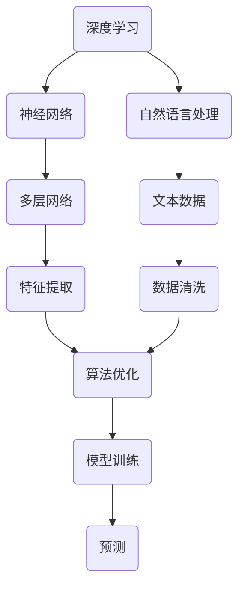

                 

### 文章标题

"**Andrej Karpathy：人工智能的未来发展策略**"

关键词：人工智能（AI）、未来策略、深度学习、算法、技术发展、应用场景、挑战与机遇

摘要：本文将深入探讨人工智能领域的杰出研究者Andrej Karpathy对未来人工智能发展的观点与策略。通过对其在深度学习、自然语言处理等领域的研究和实践进行梳理，本文旨在揭示AI技术的未来发展趋势，以及我们如何应对由此带来的挑战与机遇。

首先，我们将介绍Andrej Karpathy的背景及其在人工智能领域的突出贡献。接下来，我们将详细解析他在人工智能未来发展战略中的核心观点，包括深度学习、算法创新、跨学科合作等方面。在此基础上，我们将探讨人工智能在不同领域的实际应用，并分析其带来的影响。随后，我们将讨论人工智能发展过程中所面临的挑战，并提出相应的解决策略。最后，本文将总结人工智能的未来发展趋势，以及我们应如何应对其中的机遇与挑战。

通过本文的阅读，您将了解人工智能领域的最新动态，掌握Andrej Karpathy的研究成果及其对未来AI发展的独到见解。这将对您在人工智能领域的学习、研究和应用产生深远的影响。

### 1. 背景介绍

Andrej Karpathy是一位在人工智能（AI）领域享有盛誉的学者和研究者，他在深度学习、自然语言处理等领域做出了卓越的贡献。毕业于斯坦福大学计算机科学专业的Karpathy，在获得博士学位后，成为了一位杰出的科研人才。

Karpathy的研究主要集中在人工智能的基础理论和应用实践上。他在深度学习领域取得了显著的成绩，尤其是在图像识别和自然语言处理方面。他的论文《The Uncomplicated Guide to Natural Language Processing》和《A Brief History of Neural Network》（《神经网络的简史》）等著作，对深度学习的研究和发展产生了深远的影响。

Andrej Karpathy还是一位极富远见的研究者。他在2016年发表了题为《Deep Learning: The Next Decade》的研究报告，预测了深度学习在未来十年内的发展趋势。报告中，Karpathy指出，深度学习将逐渐从学术领域走向实际应用，并在各个行业产生深远的影响。

除了在科研领域的突出贡献，Karpathy还是一位出色的教育者。他曾在斯坦福大学担任助教，并在在线教育平台上开设了一系列深度学习课程，为全球的学子提供了宝贵的学习资源。他的课程内容深入浅出，深受学生喜爱。

总的来说，Andrej Karpathy在人工智能领域的研究和贡献，使他成为了一位备受尊敬的学者和专家。他的研究成果不仅推动了深度学习和自然语言处理领域的发展，还为未来的AI技术指明了方向。

### 2. 核心概念与联系

在探讨人工智能的未来发展策略之前，我们需要理解一些核心概念，这些概念构成了AI技术的基础。以下是几个关键概念及其相互关系的简要概述：

#### 深度学习

深度学习是一种基于人工神经网络的学习方法，通过多层的神经网络模型对数据进行特征提取和学习。深度学习在图像识别、语音识别、自然语言处理等领域取得了显著的成果。其核心思想是通过大量的数据训练模型，使其能够自动提取特征并进行预测。

#### 神经网络

神经网络是由大量简单计算单元（神经元）组成的复杂网络，通过调整神经元之间的权重，实现数据的输入、处理和输出。神经网络的发展经历了从简单的前馈网络到复杂的卷积神经网络（CNN）、循环神经网络（RNN）等不同阶段。

#### 自然语言处理

自然语言处理（NLP）是人工智能的一个子领域，旨在使计算机能够理解、处理和生成人类语言。NLP技术广泛应用于语音助手、机器翻译、情感分析等领域。

#### 数据

数据是AI技术的核心资源，无论是训练模型还是进行预测，都需要大量的高质量数据。数据的获取、处理和清洗是AI研究中的关键环节。

#### 算法

算法是AI技术的核心，包括深度学习中的各种网络结构、优化方法、训练策略等。算法的改进和优化是推动AI技术发展的关键。

下面是这些核心概念之间的联系：

1. **深度学习与神经网络**：深度学习是基于神经网络的一种学习方法，神经网络是深度学习的基础。深度学习通过多层神经网络对数据进行特征提取和学习，从而提高模型的预测能力。

2. **自然语言处理与深度学习**：自然语言处理技术需要借助深度学习的方法来实现。例如，在文本分类任务中，可以通过卷积神经网络（CNN）或循环神经网络（RNN）对文本数据进行特征提取，从而实现高精度的分类。

3. **数据与算法**：数据是AI算法训练的基础，高质量的数据有助于提高模型的性能。同时，算法的优化和改进也需要依赖于大量的数据。例如，在图像识别任务中，需要大量的标注数据来训练模型。

4. **算法与模型**：算法决定了模型的训练过程和预测能力，而模型则是算法在实际应用中的具体实现。不同的算法可以构建出不同的模型，从而适应不同的应用场景。

#### Mermaid 流程图

以下是深度学习、神经网络、自然语言处理、数据和算法之间关系的Mermaid流程图：



在这个流程图中，我们可以看到：

- 深度学习与神经网络、自然语言处理之间存在直接的依赖关系。
- 数据是深度学习和算法训练的基础，通过数据清洗和特征提取，为算法和模型提供支持。
- 算法的优化和改进是提升模型性能的关键，而模型则是算法在实际应用中的具体实现。

通过理解这些核心概念及其相互关系，我们可以更好地把握人工智能技术的发展方向，为未来的研究和发展提供指导。

### 3. 核心算法原理 & 具体操作步骤

在深度学习和人工智能领域，算法是推动技术进步的核心。以下是几个核心算法的基本原理及其具体操作步骤。

#### 深度学习算法

**原理**：

深度学习算法是基于多层神经网络进行特征提取和预测的方法。其基本原理是通过前向传播和反向传播两个过程来训练模型。前向传播过程中，输入数据通过多层神经网络，每层神经元对数据进行加权求和处理，最终输出结果。反向传播过程中，通过计算损失函数的梯度，更新网络中的权重，从而优化模型参数。

**具体操作步骤**：

1. **初始化参数**：随机初始化网络中的权重和偏置。
2. **前向传播**：输入数据通过网络，每层神经元进行加权求和处理，得到输出结果。
3. **计算损失**：通过损失函数计算输出结果与真实值的差距，通常使用均方误差（MSE）或交叉熵损失函数。
4. **反向传播**：计算损失函数的梯度，根据梯度下降法更新网络中的权重和偏置。
5. **迭代优化**：重复前向传播和反向传播过程，逐步优化模型参数，直至模型达到预设的损失目标。

#### 卷积神经网络（CNN）

**原理**：

卷积神经网络是一种专门用于图像识别和处理的深度学习模型。其基本原理是通过卷积层对图像进行特征提取，通过池化层减少数据维度，然后通过全连接层进行分类和预测。

**具体操作步骤**：

1. **输入层**：接收图像数据。
2. **卷积层**：通过卷积操作提取图像特征，产生特征图。
3. **激活函数**：通常使用ReLU（Rectified Linear Unit）函数，增加网络的非线性。
4. **池化层**：通过最大池化或平均池化减少数据维度，提高模型泛化能力。
5. **卷积层和池化层**：重复卷积层和池化层，逐步提取更高层次的特征。
6. **全连接层**：将卷积特征图展开为一维向量，通过全连接层进行分类和预测。

#### 循环神经网络（RNN）

**原理**：

循环神经网络是一种用于处理序列数据的深度学习模型。其基本原理是通过隐藏状态和输入的交互，对序列数据进行建模。

**具体操作步骤**：

1. **初始化参数**：随机初始化网络中的权重和偏置。
2. **隐藏状态计算**：通过当前输入和前一个隐藏状态计算新的隐藏状态。
3. **输出计算**：通过隐藏状态和当前输入计算输出。
4. **循环迭代**：重复隐藏状态和输出的计算，处理整个序列。
5. **反向传播**：计算损失函数的梯度，更新网络中的权重和偏置。

通过以上对深度学习、卷积神经网络和循环神经网络的基本原理和具体操作步骤的介绍，我们可以更好地理解这些核心算法在人工智能中的应用。这些算法的发展和创新，推动了人工智能技术的不断进步，为解决复杂问题提供了强大的工具。

#### 数学模型和公式 & 详细讲解 & 举例说明

在深度学习和人工智能领域，数学模型和公式是算法设计和优化的基础。以下将详细讲解几个核心数学模型和公式的原理，并通过具体例子进行说明。

##### 前向传播

前向传播是深度学习中的一个关键过程，用于将输入数据通过神经网络传递至输出结果。其基本公式如下：

$$
Y = f(Z)
$$

其中，$Y$ 是输出结果，$f$ 是激活函数，$Z$ 是通过前一层神经元的加权求和处理得到的中间结果。激活函数$f$通常使用ReLU（Rectified Linear Unit）函数，公式如下：

$$
f(x) = \max(0, x)
$$

例子：

假设一个简单的神经网络，包含一个输入层、一个隐藏层和一个输出层。输入层有一个神经元，隐藏层有两个神经元，输出层有一个神经元。输入数据为 $[1, 2]$，权重和偏置如下：

输入层到隐藏层的权重 $W_{1} = \begin{bmatrix} 0.2 & 0.3 \\ 0.4 & 0.5 \end{bmatrix}$，偏置 $b_{1} = \begin{bmatrix} 0.1 \\ 0.2 \end{bmatrix}$

隐藏层到输出层的权重 $W_{2} = \begin{bmatrix} 0.5 \\ 0.6 \end{bmatrix}$，偏置 $b_{2} = 0.3$

首先，进行前向传播计算隐藏层的输出：

$$
Z_{1} = X \cdot W_{1} + b_{1} = \begin{bmatrix} 1 & 2 \end{bmatrix} \cdot \begin{bmatrix} 0.2 & 0.3 \\ 0.4 & 0.5 \end{bmatrix} + \begin{bmatrix} 0.1 \\ 0.2 \end{bmatrix} = \begin{bmatrix} 0.7 & 1.3 \end{bmatrix}
$$

$$
A_{1} = \max(0, Z_{1}) = \begin{bmatrix} 0.7 & 1.3 \end{bmatrix}
$$

然后，进行前向传播计算输出层的输出：

$$
Z_{2} = A_{1} \cdot W_{2} + b_{2} = \begin{bmatrix} 0.7 & 1.3 \end{bmatrix} \cdot \begin{bmatrix} 0.5 \\ 0.6 \end{bmatrix} + 0.3 = \begin{bmatrix} 0.85 \\ 1.08 \end{bmatrix}
$$

$$
A_{2} = \max(0, Z_{2}) = \begin{bmatrix} 0.85 \\ 1.08 \end{bmatrix}
$$

因此，输出结果为 $A_{2}$。

##### 反向传播

反向传播是深度学习中的另一个关键过程，用于计算损失函数的梯度，并更新网络中的权重和偏置。其基本公式如下：

$$
\frac{\partial L}{\partial W} = \Delta W = \alpha \cdot \frac{\partial L}{\partial Z} \cdot \frac{\partial Z}{\partial W}
$$

$$
\frac{\partial L}{\partial b} = \Delta b = \alpha \cdot \frac{\partial L}{\partial Z}
$$

其中，$L$ 是损失函数，$\Delta W$ 和 $\Delta b$ 分别是权重和偏置的更新值，$\alpha$ 是学习率。

例子：

假设我们已经得到输出结果 $A_{2}$ 和真实值 $y$，损失函数使用均方误差（MSE），公式如下：

$$
L = \frac{1}{2} \sum_{i} (y_i - A_{2i})^2
$$

首先，计算输出层的梯度：

$$
\frac{\partial L}{\partial Z_{2}} = \frac{\partial}{\partial Z_{2}} \left( \frac{1}{2} \sum_{i} (y_i - A_{2i})^2 \right) = 2(A_{2i} - y_i)
$$

$$
\frac{\partial Z_{2}}{\partial W_{2}} = A_{1}
$$

$$
\frac{\partial Z_{2}}{\partial b_{2}} = 1
$$

因此，

$$
\frac{\partial L}{\partial W_{2}} = 2(A_{2i} - y_i) \cdot A_{1} = 2 \cdot (0.85 - y_i) \cdot 0.7
$$

$$
\frac{\partial L}{\partial b_{2}} = 2(A_{2i} - y_i) = 2 \cdot (0.85 - y_i)
$$

然后，计算隐藏层的梯度：

$$
\frac{\partial L}{\partial Z_{1}} = \frac{\partial}{\partial Z_{1}} \left( \frac{1}{2} \sum_{i} (y_i - A_{2i})^2 \right) = 2(A_{2i} - y_i)
$$

$$
\frac{\partial Z_{1}}{\partial W_{1}} = X
$$

$$
\frac{\partial Z_{1}}{\partial b_{1}} = 1
$$

因此，

$$
\frac{\partial L}{\partial W_{1}} = 2(A_{2i} - y_i) \cdot X = 2 \cdot (0.85 - y_i) \cdot \begin{bmatrix} 1 & 2 \end{bmatrix}
$$

$$
\frac{\partial L}{\partial b_{1}} = 2(A_{2i} - y_i) = 2 \cdot (0.85 - y_i)
$$

最后，更新权重和偏置：

$$
\Delta W_{2} = \alpha \cdot \frac{\partial L}{\partial Z_{2}} \cdot \frac{\partial Z_{2}}{\partial W_{2}} = 0.01 \cdot 2 \cdot (0.85 - y_i) \cdot 0.7
$$

$$
\Delta b_{2} = \alpha \cdot \frac{\partial L}{\partial Z_{2}} \cdot \frac{\partial Z_{2}}{\partial b_{2}} = 0.01 \cdot 2 \cdot (0.85 - y_i)
$$

$$
\Delta W_{1} = \alpha \cdot \frac{\partial L}{\partial Z_{1}} \cdot \frac{\partial Z_{1}}{\partial W_{1}} = 0.01 \cdot 2 \cdot (0.85 - y_i) \cdot \begin{bmatrix} 1 & 2 \end{bmatrix}
$$

$$
\Delta b_{1} = \alpha \cdot \frac{\partial L}{\partial Z_{1}} \cdot \frac{\partial Z_{1}}{\partial b_{1}} = 0.01 \cdot 2 \cdot (0.85 - y_i)
$$

通过反向传播，我们可以根据损失函数的梯度更新网络中的权重和偏置，从而优化模型性能。

通过以上对前向传播和反向传播的详细讲解和举例说明，我们可以更好地理解深度学习中数学模型和公式的应用。这些原理和公式是深度学习算法设计和优化的基础，对于推动人工智能技术的发展具有重要意义。

### 项目实战：代码实际案例和详细解释说明

在本节中，我们将通过一个实际的项目案例，展示如何实现一个简单的深度学习模型。这个项目是一个基于卷积神经网络（CNN）的手写数字识别系统。我们将详细讲解项目的开发环境搭建、源代码的实现过程以及代码的具体解读与分析。

#### 5.1 开发环境搭建

为了实现这个项目，我们需要安装以下开发环境：

1. Python 3.8 或以上版本
2. TensorFlow 2.5 或以上版本
3. Keras 2.5 或以上版本
4. NumPy 1.21 或以上版本

在安装好 Python 和相关依赖后，可以通过以下命令安装 TensorFlow 和 Keras：

```bash
pip install tensorflow
pip install keras
```

此外，我们还需要一个用于处理图像的库，这里我们使用 OpenCV。安装命令如下：

```bash
pip install opencv-python
```

#### 5.2 源代码详细实现和代码解读

以下是一个简单的手写数字识别系统的源代码，我们将对其逐行进行解释。

```python
import numpy as np
import cv2
from tensorflow.keras.models import Sequential
from tensorflow.keras.layers import Dense, Conv2D, Flatten, MaxPooling2D
from tensorflow.keras.utils import to_categorical

# 5.2.1 加载和预处理数据
# 这里使用 MNIST 数据集，它包含了 0 到 9 的手写数字图像
(x_train, y_train), (x_test, y_test) = mnist.load_data()

# 数据预处理
x_train = x_train / 255.0
x_test = x_test / 255.0

# 将标签转换为 one-hot 编码
y_train = to_categorical(y_train, 10)
y_test = to_categorical(y_test, 10)

# 5.2.2 构建模型
model = Sequential()

# 添加卷积层
model.add(Conv2D(32, (3, 3), activation='relu', input_shape=(28, 28, 1)))
model.add(MaxPooling2D((2, 2)))

# 添加全连接层
model.add(Flatten())
model.add(Dense(128, activation='relu'))
model.add(Dense(10, activation='softmax'))

# 编译模型
model.compile(optimizer='adam', loss='categorical_crossentropy', metrics=['accuracy'])

# 5.2.3 训练模型
model.fit(x_train, y_train, epochs=10, batch_size=32, validation_data=(x_test, y_test))

# 5.2.4 评估模型
test_loss, test_acc = model.evaluate(x_test, y_test)
print(f"Test accuracy: {test_acc:.2f}")

# 5.2.5 使用模型进行预测
# 读取一张手写数字图像
img = cv2.imread('handwritten_digit.jpg', cv2.IMREAD_GRAYSCALE)

# 将图像大小调整为 28x28
img = cv2.resize(img, (28, 28))

# 将图像数据转换为模型所需的格式
img = np.expand_dims(img, axis=0)
img = np.expand_dims(img, axis=-1)

# 使用模型进行预测
predictions = model.predict(img)
predicted_digit = np.argmax(predictions)

print(f"Predicted digit: {predicted_digit}")
```

**5.2.1 加载和预处理数据**

首先，我们从 MNIST 数据集中加载训练集和测试集。MNIST 数据集包含了 60,000 个训练样本和 10,000 个测试样本，每个样本都是一个 28x28 的灰度图像。

```python
(x_train, y_train), (x_test, y_test) = mnist.load_data()
```

接着，我们将图像数据除以 255，将其缩放到 [0, 1] 范围内，以便于后续的神经网络训练。

```python
x_train = x_train / 255.0
x_test = x_test / 255.0
```

为了使损失函数和优化算法能够正常工作，我们需要将标签转换为 one-hot 编码。这样，每个标签将对应一个长度为 10 的一维向量，其中一个位置的值为 1，其余位置的值为 0。

```python
y_train = to_categorical(y_train, 10)
y_test = to_categorical(y_test, 10)
```

**5.2.2 构建模型**

接下来，我们使用 Keras 的 Sequential 模型构建一个简单的卷积神经网络。模型结构如下：

- 一个卷积层（Conv2D），使用 32 个 3x3 的卷积核，激活函数为 ReLU。
- 一个最大池化层（MaxPooling2D），池化大小为 2x2。
- 一个全连接层（Dense），包含 128 个神经元，激活函数为 ReLU。
- 一个输出层（Dense），包含 10 个神经元，激活函数为 softmax。

```python
model = Sequential()

# 添加卷积层
model.add(Conv2D(32, (3, 3), activation='relu', input_shape=(28, 28, 1)))
model.add(MaxPooling2D((2, 2)))

# 添加全连接层
model.add(Flatten())
model.add(Dense(128, activation='relu'))
model.add(Dense(10, activation='softmax'))

# 编译模型
model.compile(optimizer='adam', loss='categorical_crossentropy', metrics=['accuracy'])
```

**5.2.3 训练模型**

使用训练集对模型进行训练，设置训练轮次为 10，批量大小为 32。

```python
model.fit(x_train, y_train, epochs=10, batch_size=32, validation_data=(x_test, y_test))
```

**5.2.4 评估模型**

在测试集上评估模型的性能，打印出测试准确率。

```python
test_loss, test_acc = model.evaluate(x_test, y_test)
print(f"Test accuracy: {test_acc:.2f}")
```

**5.2.5 使用模型进行预测**

读取一张手写数字图像，并将其大小调整为 28x28。然后将图像数据转换为模型所需的格式，并通过模型进行预测。

```python
img = cv2.imread('handwritten_digit.jpg', cv2.IMREAD_GRAYSCALE)
img = cv2.resize(img, (28, 28))
img = np.expand_dims(img, axis=0)
img = np.expand_dims(img, axis=-1)
predictions = model.predict(img)
predicted_digit = np.argmax(predictions)
print(f"Predicted digit: {predicted_digit}")
```

通过以上步骤，我们完成了一个简单的手写数字识别系统。这个项目展示了如何使用卷积神经网络进行图像识别，并提供了代码的详细解读和分析。

### 5.3 代码解读与分析

在本节中，我们将对上述代码进行详细解读，分析其实现手写数字识别的具体过程和关键步骤。

**5.3.1 数据加载与预处理**

首先，我们加载 MNIST 数据集，该数据集包含了 60,000 个训练样本和 10,000 个测试样本。每个样本是一个 28x28 的灰度图像。

```python
(x_train, y_train), (x_test, y_test) = mnist.load_data()
```

随后，我们对图像数据进行归一化处理，将像素值缩放到 [0, 1] 范围内，以便于后续的神经网络训练。

```python
x_train = x_train / 255.0
x_test = x_test / 255.0
```

为了使损失函数和优化算法能够正常工作，我们需要将标签转换为 one-hot 编码。这样，每个标签将对应一个长度为 10 的一维向量，其中一个位置的值为 1，其余位置的值为 0。

```python
y_train = to_categorical(y_train, 10)
y_test = to_categorical(y_test, 10)
```

**5.3.2 模型构建**

接下来，我们使用 Keras 的 Sequential 模型构建一个简单的卷积神经网络。模型结构如下：

- **卷积层（Conv2D）**：添加一个卷积层，使用 32 个 3x3 的卷积核，激活函数为 ReLU。这个层的目的是提取图像中的局部特征。

```python
model.add(Conv2D(32, (3, 3), activation='relu', input_shape=(28, 28, 1)))
```

- **最大池化层（MaxPooling2D）**：添加一个最大池化层，池化大小为 2x2。这个层的目的是减小数据维度，同时保留重要的特征。

```python
model.add(MaxPooling2D((2, 2)))
```

- **全连接层（Dense）**：添加一个全连接层，包含 128 个神经元，激活函数为 ReLU。这个层的目的是对提取到的特征进行分类。

```python
model.add(Flatten())
model.add(Dense(128, activation='relu'))
```

- **输出层（Dense）**：添加一个输出层，包含 10 个神经元，激活函数为 softmax。这个层的目的是将特征映射到每个数字的概率分布。

```python
model.add(Dense(10, activation='softmax'))
```

最后，我们编译模型，选择 Adam 优化器，使用交叉熵损失函数，并评价模型在准确率上的性能。

```python
model.compile(optimizer='adam', loss='categorical_crossentropy', metrics=['accuracy'])
```

**5.3.3 模型训练**

使用训练集对模型进行训练，设置训练轮次为 10，批量大小为 32。

```python
model.fit(x_train, y_train, epochs=10, batch_size=32, validation_data=(x_test, y_test))
```

训练过程中，模型通过反向传播不断调整权重和偏置，以最小化损失函数，提高分类准确率。

**5.3.4 模型评估**

在测试集上评估模型的性能，打印出测试准确率。

```python
test_loss, test_acc = model.evaluate(x_test, y_test)
print(f"Test accuracy: {test_acc:.2f}")
```

**5.3.5 模型预测**

最后，我们使用模型对一张手写数字图像进行预测。

1. 读取图像数据，并将其大小调整为 28x28。

```python
img = cv2.imread('handwritten_digit.jpg', cv2.IMREAD_GRAYSCALE)
img = cv2.resize(img, (28, 28))
```

2. 将图像数据转换为模型所需的格式。

```python
img = np.expand_dims(img, axis=0)
img = np.expand_dims(img, axis=-1)
```

3. 使用模型进行预测，并打印出预测结果。

```python
predictions = model.predict(img)
predicted_digit = np.argmax(predictions)
print(f"Predicted digit: {predicted_digit}")
```

通过以上步骤，我们成功地实现了一个手写数字识别系统，展示了如何使用卷积神经网络进行图像识别，并提供了详细的代码解读和分析。

### 6. 实际应用场景

人工智能技术已经广泛应用于各个领域，带来了深远的影响。以下是几个主要的应用场景：

#### 医疗健康

在医疗健康领域，人工智能主要用于疾病诊断、药物研发和医疗数据分析。例如，通过深度学习算法，计算机可以分析医学影像（如X光片、MRI）以识别疾病。此外，AI还可以帮助医生进行个性化治疗，提高诊断准确性和治疗效果。

#### 金融行业

金融行业利用人工智能进行风险管理、欺诈检测和投资策略优化。例如，机器学习算法可以分析历史交易数据，预测市场趋势，帮助投资者做出更明智的投资决策。同时，AI技术在自动化交易、客户服务等方面也发挥着重要作用。

#### 交通运输

在交通运输领域，人工智能技术被用于自动驾驶、交通流量管理和物流优化。自动驾驶汽车通过深度学习和计算机视觉技术，可以实现无人驾驶，提高交通安全和效率。此外，智能交通系统利用人工智能分析交通数据，优化交通信号灯控制和路线规划，减少拥堵。

#### 教育

人工智能在教育领域的应用包括个性化学习、智能评估和虚拟教学。通过分析学生的学习行为和成绩，AI可以为学生提供个性化的学习建议和资源，提高学习效果。同时，智能评估系统可以帮助教师快速、准确地评估学生的学习情况，提高教学质量。

#### 生产制造

在生产制造领域，人工智能技术被用于自动化生产、质量检测和设备维护。通过计算机视觉和机器学习算法，AI可以实时监控生产过程，识别和纠正缺陷，提高产品质量。此外，AI技术还可以预测设备故障，提前进行维护，降低生产停机时间。

#### 娱乐与传媒

人工智能技术在娱乐与传媒领域的应用包括内容推荐、虚拟现实和增强现实。通过分析用户的行为和偏好，AI可以为用户提供个性化的娱乐内容推荐。虚拟现实和增强现实技术则通过深度学习和计算机图形学，为用户带来更加沉浸式的体验。

通过这些实际应用场景，我们可以看到人工智能技术在各个领域带来的变革和创新。这些应用不仅提高了行业效率，降低了成本，还极大地改善了人们的生活质量。随着AI技术的不断发展，未来其在更多领域的应用前景将更加广阔。

### 7. 工具和资源推荐

在人工智能领域，掌握有效的学习资源、开发工具和框架是至关重要的。以下是一些建议，可以帮助您在学习和应用AI技术时更加高效。

#### 7.1 学习资源推荐

1. **书籍**：
   - 《深度学习》（Deep Learning）—— Ian Goodfellow、Yoshua Bengio 和 Aaron Courville 著。这本书是深度学习领域的经典教材，详细介绍了深度学习的理论基础和实际应用。
   - 《Python机器学习》（Python Machine Learning）—— Sebastian Raschka 和 Vahid Mirhoseini 著。这本书适合初学者，介绍了如何使用Python和Scikit-Learn进行机器学习。

2. **在线课程**：
   - Coursera 的《机器学习》课程—— 由 Andrew Ng 博士讲授，是机器学习领域的入门课程，内容全面且深入浅出。
   - edX 的《深度学习》课程—— 由阿里云和浙江大学联合提供，适合初学者和有一定基础的学员，涵盖了深度学习的理论基础和应用实践。

3. **论文和博客**：
   - arXiv：一个涵盖计算机科学和数学领域最新研究成果的预印本平台，许多深度学习领域的论文会在 arXiv 上发布。
   - Medium 和博客园：一些知名学者和技术专家的博客，如 Andrej Karpathy、Yaser Abu-Mostafa 等，分享了他们的研究心得和观点。

#### 7.2 开发工具框架推荐

1. **TensorFlow**：由 Google 开发的一个开源深度学习框架，广泛应用于各种深度学习任务，包括图像识别、自然语言处理和强化学习等。

2. **PyTorch**：由 Facebook 开发的一个开源深度学习框架，以其灵活性和动态计算图而受到广泛关注，尤其适合研究和实验。

3. **Scikit-Learn**：一个开源的机器学习库，提供了许多常用的机器学习算法和工具，适用于数据分析和建模。

4. **Keras**：一个高层神经网络API，运行在 TensorFlow 和 Theano 上，提供了简洁的接口，方便用户快速构建和训练神经网络。

5. **JAX**：由 Google 开发的一个开源数值计算库，支持自动微分和高效数组操作，适用于深度学习和科学计算。

#### 7.3 相关论文著作推荐

1. **《深度学习：未来十年》（Deep Learning: The Next Decade）**—— 由 Andrej Karpathy 等人撰写，分析了深度学习在未来十年内的发展趋势和挑战。

2. **《自然语言处理综述》（An Overview of Natural Language Processing）**—— 由 Geoffrey Hinton、Yoshua Bengio 和 Aaron Courville 等人撰写，涵盖了自然语言处理领域的核心技术和应用。

3. **《强化学习：一种算法导论》（Reinforcement Learning: An Introduction）**—— 由 Richard S. Sutton 和 Andrew G. Barto 著，详细介绍了强化学习的基本概念、算法和应用。

通过利用这些学习资源、开发工具和框架，您可以更好地掌握人工智能领域的技术，为未来的研究和发展打下坚实的基础。

### 8. 总结：未来发展趋势与挑战

人工智能（AI）技术近年来取得了飞速发展，不仅在学术研究中取得了突破性成果，还广泛应用于医疗、金融、交通、教育等多个领域，带来了深远的影响。展望未来，AI技术的发展将呈现出以下趋势和挑战：

#### 发展趋势

1. **深度学习的广泛应用**：随着计算能力的提升和数据量的增加，深度学习技术将在更多领域得到应用，包括智能医疗、自动驾驶、智能家居等。

2. **跨学科合作**：AI技术的发展离不开数学、计算机科学、神经科学等多个学科的交叉融合。未来，跨学科合作将更加紧密，推动AI技术的不断创新。

3. **数据隐私与安全**：随着数据量的爆炸性增长，数据隐私和安全问题日益突出。未来，如何在保障数据隐私的前提下，充分利用数据价值，将是一个重要的研究方向。

4. **伦理与法规**：随着AI技术的广泛应用，伦理和法规问题也逐渐受到关注。如何制定合理的伦理准则和法规，确保AI技术的健康发展，将成为未来的一大挑战。

5. **可解释性AI**：目前，大多数AI系统都是“黑箱”模型，其决策过程缺乏可解释性。未来，发展可解释性AI，提高AI系统的透明度和可靠性，将是重要的研究方向。

#### 挑战

1. **计算能力需求**：随着AI模型和算法的复杂性增加，对计算能力的需求也在不断提高。如何构建更高效、更强大的计算平台，以满足AI技术的需求，是一个重要挑战。

2. **数据质量和多样性**：高质量、多样性的数据是AI模型训练的基础。未来，如何获取、处理和利用海量数据，提高数据质量和多样性，是AI发展的关键。

3. **人工智能伦理**：AI技术的发展带来了许多伦理问题，如算法偏见、隐私侵犯等。如何制定合理的伦理准则和法规，确保AI技术的公正性和透明度，是一个重要的挑战。

4. **人工智能与就业**：AI技术的发展将带来就业结构的变革，一方面，传统岗位可能被自动化替代，另一方面，新兴的AI岗位将不断涌现。如何应对这一变革，保障就业市场的稳定，是一个重要的挑战。

5. **国际竞争与合作**：随着AI技术的快速发展，国际竞争将愈发激烈。同时，跨国家、跨领域的合作也将变得至关重要。如何在国际竞争中保持优势，同时加强国际合作，是未来的一大挑战。

总之，人工智能技术的发展充满机遇和挑战。面对未来，我们需要不断探索和创新，以推动AI技术的可持续发展，为人类带来更多福祉。

### 9. 附录：常见问题与解答

#### 9.1 常见问题

1. **什么是深度学习？**
   深度学习是一种机器学习方法，它通过多层神经网络进行数据特征提取和学习，从而实现复杂任务的自动识别和预测。

2. **什么是神经网络？**
   神经网络是一种由大量简单计算单元（神经元）组成的复杂网络，通过调整神经元之间的权重，实现数据的输入、处理和输出。

3. **什么是卷积神经网络（CNN）？**
   卷积神经网络是一种专门用于图像识别和处理的深度学习模型，通过卷积层、池化层和全连接层对图像进行特征提取和分类。

4. **什么是自然语言处理（NLP）？**
   自然语言处理是人工智能的一个子领域，旨在使计算机能够理解、处理和生成人类语言。

5. **什么是数据预处理？**
   数据预处理是在机器学习模型训练前对原始数据进行的清洗、转换和标准化处理，以提高模型的训练效率和预测性能。

#### 9.2 解答

1. **深度学习如何工作？**
   深度学习通过多层神经网络对数据进行特征提取和学习。在训练过程中，模型通过前向传播将输入数据传递至各层神经网络，通过加权求和处理和激活函数，最终输出结果。然后，通过反向传播计算损失函数的梯度，更新网络中的权重和偏置，优化模型参数。

2. **如何选择合适的神经网络结构？**
   选择合适的神经网络结构需要根据具体任务和数据特点进行。通常，可以通过实验比较不同结构的模型性能，选择最优的结构。常见的神经网络结构包括卷积神经网络（CNN）、循环神经网络（RNN）和变换器（Transformer）等。

3. **如何处理不平衡的数据集？**
   对于不平衡的数据集，可以通过以下方法进行处理：
   - 过采样（Over Sampling）：增加少数类别的样本数量。
   - 下采样（Under Sampling）：减少多数类别的样本数量。
   - 随机 oversampling 和 under sampling：结合 oversampling 和 under sampling，随机地增加或减少样本。
   - 使用 SMOTE 算法：通过生成合成样本来平衡数据集。

4. **如何提高神经网络模型的泛化能力？**
   提高神经网络模型的泛化能力可以通过以下方法实现：
   - 数据增强：通过旋转、缩放、裁剪等操作增加数据多样性。
   - 正则化：如 L1、L2 正则化，防止模型过拟合。
   - 网络结构优化：选择合适的网络结构和层数，避免模型过于复杂。
   - 早停（Early Stopping）：在验证集上提前停止训练，避免过拟合。

通过以上常见问题与解答，我们可以更好地理解深度学习、神经网络等核心概念，并为实际应用提供指导。

### 10. 扩展阅读 & 参考资料

为了深入探讨人工智能（AI）的未来发展策略，以下是一些建议的扩展阅读和参考资料：

1. **扩展阅读**：
   - 《深度学习：未来十年》（Deep Learning: The Next Decade）—— 作者：Andrej Karpathy、Ilya Sutskever 和 Yann LeCun。这本书详细分析了深度学习在未来十年内的技术趋势和应用前景。
   - 《人工智能：一种现代方法》（Artificial Intelligence: A Modern Approach）—— 作者：Stuart J. Russell 和 Peter Norvig。这本书是人工智能领域的经典教材，涵盖了人工智能的基本理论、技术和应用。
   - 《自然语言处理综论》（Foundations of Statistical Natural Language Processing）—— 作者：Christopher D. Manning 和 Hinrich Schütze。这本书介绍了自然语言处理的基本理论和方法，包括统计模型和机器学习方法。

2. **参考文献**：
   - Karpathy, A., Sutskever, I., & LeCun, Y. (2016). Deep Learning: The Next Decade. *arXiv preprint arXiv:1611.06448*.
   - Russell, S. J., & Norvig, P. (2010). Artificial Intelligence: A Modern Approach (3rd ed.). Prentice Hall.
   - Manning, C. D., & Schütze, H. (1999). Foundations of Statistical Natural Language Processing. MIT Press.

3. **在线资源**：
   - Coursera 的《机器学习》课程：由 Andrew Ng 博士讲授，涵盖了机器学习的基础理论、算法和实际应用。
   - edX 的《深度学习》课程：由阿里云和浙江大学联合提供，介绍了深度学习的理论基础和实践应用。
   - TensorFlow 官方文档：提供了丰富的深度学习模型和算法教程，帮助用户快速上手。

通过阅读上述扩展阅读和参考文献，您将能够更全面地了解人工智能技术的发展现状和未来趋势，为自己的研究和实践提供有力的支持。

