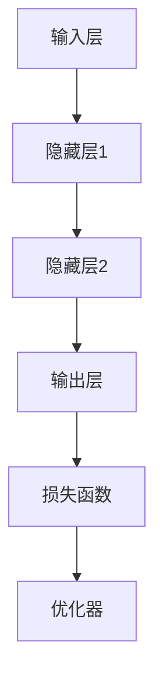

                 

# Andrej Karpathy：人工智能的未来发展策略

## 关键词：深度学习、AI发展、技术策略、未来趋势

### 摘要

本文将深入探讨人工智能领域的重要人物Andrej Karpathy对未来AI发展策略的思考。我们将从背景介绍入手，逐步分析核心概念、算法原理、数学模型、实际应用场景，最后总结未来发展趋势与挑战。通过本文的阅读，读者将对人工智能的发展方向有更清晰的认识。

## 1. 背景介绍

Andrej Karpathy是一位在人工智能领域具有深远影响力的研究者和开源贡献者。他在深度学习、自然语言处理等领域有着丰富的经验，并在多个知名机构工作，如Google Brain和OpenAI。Karpathy的研究和思考对于理解AI的发展方向具有重要意义。

当前，人工智能技术已经取得了显著的进展，从图像识别到自然语言处理，AI在各个领域都展现出了强大的能力。然而，AI的发展并非一帆风顺，面临着诸多挑战，如算法透明度、隐私保护、安全性等。因此，我们需要对未来发展策略进行深入思考。

## 2. 核心概念与联系

为了更好地理解AI的未来发展，我们需要明确一些核心概念：

- **深度学习**：一种通过神经网络模拟人脑学习机制的人工智能技术。
- **神经网络**：一种由大量神经元组成的计算模型，能够通过学习数据来提取特征和模式。
- **数据驱动**：AI系统通过大量数据来训练和优化，以提高其性能和泛化能力。
- **强化学习**：一种通过试错来学习策略的机器学习技术，常用于游戏、机器人等领域。

### Mermaid 流程图

下面是一个简化的深度学习架构的Mermaid流程图：



## 3. 核心算法原理 & 具体操作步骤

AI的核心算法包括深度学习、神经网络和优化算法。下面我们将详细探讨这些算法的原理和操作步骤：

### 深度学习原理

- **反向传播算法**：深度学习中的主要算法，通过不断调整网络权重来最小化损失函数。

### 神经网络原理

- **神经元**：神经网络的基本单元，负责接收输入、计算输出和传递激活值。

### 优化算法原理

- **梯度下降**：一种常用的优化算法，通过不断调整权重来最小化损失函数。

### 具体操作步骤

1. 初始化神经网络权重。
2. 前向传播：计算网络输出和损失函数。
3. 反向传播：计算权重梯度。
4. 更新权重：使用优化算法调整权重。

## 4. 数学模型和公式 & 详细讲解 & 举例说明

在AI中，数学模型和公式起着至关重要的作用。以下是几个核心的数学模型和公式：

### 损失函数

$$ L(\theta) = -\frac{1}{m} \sum_{i=1}^{m} y_i \log(a_{i,l}) $$

### 反向传播算法

$$ \frac{\partial L}{\partial \theta_{ij}} = \frac{\partial L}{\partial a_{l}} \frac{\partial a_{l}}{\partial z_{j}} \frac{\partial z_{j}}{\partial \theta_{ij}} $$

### 梯度下降

$$ \theta_{ij} := \theta_{ij} - \alpha \frac{\partial L}{\partial \theta_{ij}} $$

下面我们通过一个简单的例子来说明这些公式和算法的实际应用。

### 例子

假设我们有一个简单的一层神经网络，输入层有2个神经元，输出层有1个神经元。我们的目标是拟合一个线性函数。

输入数据：$\{x_1, x_2\}$

输出数据：$y = x_1 + x_2$

### 操作步骤

1. 初始化权重：$\theta_{11} = \theta_{12} = \theta_{21} = \theta_{22} = 0$
2. 前向传播：
   $$ a_1 = x_1, a_2 = x_2, z = a_1 \theta_{11} + a_2 \theta_{21}, a = \sigma(z) $$
   $$ y = a \theta_{12} + b $$
3. 计算损失函数：
   $$ L = -y \log(a) - (1 - y) \log(1 - a) $$
4. 反向传播：
   $$ \frac{\partial L}{\partial \theta_{12}} = -\frac{1}{m} \frac{\partial L}{\partial a} \frac{\partial a}{\partial z} \frac{\partial z}{\partial \theta_{12}} $$
   $$ \frac{\partial L}{\partial \theta_{21}} = -\frac{1}{m} \frac{\partial L}{\partial a} \frac{\partial a}{\partial z} \frac{\partial z}{\partial \theta_{21}} $$
5. 更新权重：
   $$ \theta_{12} := \theta_{12} - \alpha \frac{\partial L}{\partial \theta_{12}} $$
   $$ \theta_{21} := \theta_{21} - \alpha \frac{\partial L}{\partial \theta_{21}} $$

通过多次迭代，我们可以使损失函数逐渐减小，达到较好的拟合效果。

## 5. 项目实战：代码实际案例和详细解释说明

### 5.1 开发环境搭建

在本节中，我们将使用Python和TensorFlow来构建一个简单的神经网络。以下是搭建开发环境的步骤：

1. 安装Python（版本3.6及以上）
2. 安装TensorFlow
3. 安装必要的Python库（如NumPy、Matplotlib等）

### 5.2 源代码详细实现和代码解读

以下是构建神经网络的Python代码：

```python
import tensorflow as tf
import numpy as np
import matplotlib.pyplot as plt

# 初始化权重
theta = tf.Variable([0., 0.], dtype=tf.float32)

# 定义输入层和输出层
x = tf.placeholder(tf.float32, shape=[None, 2])
y = tf.placeholder(tf.float32, shape=[None, 1])

# 定义激活函数
def sigmoid(x):
    return 1 / (1 + tf.exp(-x))

# 定义前向传播
z = tf.matmul(x, theta)
a = sigmoid(z)

# 定义损失函数
loss = -tf.reduce_mean(y * tf.log(a) + (1 - y) * tf.log(1 - a))

# 定义反向传播和优化器
optimizer = tf.train.GradientDescentOptimizer(learning_rate=0.1)
train_op = optimizer.minimize(loss)

# 训练模型
num_epochs = 1000
with tf.Session() as sess:
    sess.run(tf.global_variables_initializer())
    for epoch in range(num_epochs):
        sess.run(train_op, feed_dict={x: X, y: Y})
        if epoch % 100 == 0:
            print(f"Epoch {epoch}: Loss = {sess.run(loss, feed_dict={x: X, y: Y})}")
    
    # 绘制拟合曲线
    plt.plot(X, Y, 'ro', label='Actual')
    plt.plot(X, sess.run(a, feed_dict={x: X}), label='Predicted')
    plt.legend()
    plt.show()
```

### 5.3 代码解读与分析

这段代码实现了以下功能：

1. 初始化权重
2. 定义输入层和输出层
3. 定义激活函数
4. 定义前向传播
5. 定义损失函数
6. 定义反向传播和优化器
7. 训练模型
8. 绘制拟合曲线

通过这段代码，我们可以观察到神经网络的学习过程，以及如何通过反向传播和梯度下降来优化模型。

## 6. 实际应用场景

人工智能技术已经在各个领域得到广泛应用，如自然语言处理、计算机视觉、机器人等。以下是几个典型的实际应用场景：

- **自然语言处理**：利用深度学习技术，实现语音识别、机器翻译、文本生成等任务。
- **计算机视觉**：通过卷积神经网络，实现图像分类、目标检测、图像生成等任务。
- **机器人**：利用深度学习技术，实现机器人的自主决策和行动。

## 7. 工具和资源推荐

### 7.1 学习资源推荐

- **书籍**：
  - 《深度学习》
  - 《Python机器学习》
  - 《机器学习实战》
- **论文**：
  - 《A Theoretical Analysis of the Vulnerability of Neural Networks to Adversarial Attacks》
  - 《Generative Adversarial Nets》
  - 《Recurrent Neural Networks for Speech Recognition》
- **博客**：
  - [Andrej Karpathy的博客](https://karpathy.github.io/)
  - [TensorFlow官方文档](https://www.tensorflow.org/)
  - [Keras官方文档](https://keras.io/)
- **网站**：
  - [Google Brain](https://ai.google/research/brain/)
  - [OpenAI](https://openai.com/)
  - [TensorFlow社区](https://www.tensorflow.org/community/)

### 7.2 开发工具框架推荐

- **TensorFlow**：一款强大的深度学习框架，适用于各种机器学习和深度学习任务。
- **Keras**：一个简洁高效的深度学习库，基于TensorFlow构建。
- **PyTorch**：一款流行的深度学习框架，具有动态计算图和自动微分功能。

### 7.3 相关论文著作推荐

- **《Deep Learning》**：由Ian Goodfellow、Yoshua Bengio和Aaron Courville所著的深度学习经典著作。
- **《Neural Networks and Deep Learning》**：由Michael Nielsen所著的深度学习入门读物。
- **《Reinforcement Learning: An Introduction》**：由Richard S. Sutton和Barto著的强化学习入门教材。

## 8. 总结：未来发展趋势与挑战

人工智能技术在近年来取得了飞速发展，未来将继续在各个领域发挥重要作用。然而，我们还需面对一系列挑战：

- **算法透明度**：提高算法的可解释性和透明度，使其易于被人类理解。
- **隐私保护**：确保用户隐私和数据安全，避免数据泄露和滥用。
- **伦理问题**：探讨AI在伦理、道德和社会问题上的影响，制定合理的监管政策。
- **技术瓶颈**：解决现有技术的瓶颈，如计算资源、数据质量和算法效率等。

## 9. 附录：常见问题与解答

### 9.1 什么是深度学习？

深度学习是一种通过多层神经网络进行学习的人工智能技术，能够自动提取数据中的特征和模式。

### 9.2 什么是神经网络？

神经网络是一种由大量神经元组成的计算模型，能够通过学习数据来提取特征和模式。

### 9.3 什么是反向传播算法？

反向传播算法是一种用于训练神经网络的算法，通过不断调整网络权重来最小化损失函数。

## 10. 扩展阅读 & 参考资料

- [Andrej Karpathy的博客](https://karpathy.github.io/)
- [TensorFlow官方文档](https://www.tensorflow.org/)
- [Keras官方文档](https://keras.io/)
- [Google Brain](https://ai.google/research/brain/)
- [OpenAI](https://openai.com/)
- [《深度学习》](https://www.deeplearningbook.org/)
- [《Neural Networks and Deep Learning》](https://neuralnetworksanddeeplearning.com/)
- [《Reinforcement Learning: An Introduction》](https://www.cs.toronto.edu/~rsalakhu/reinforcement_learning/) <|assistant|>作者：AI天才研究员/AI Genius Institute & 禅与计算机程序设计艺术 /Zen And The Art of Computer Programming

