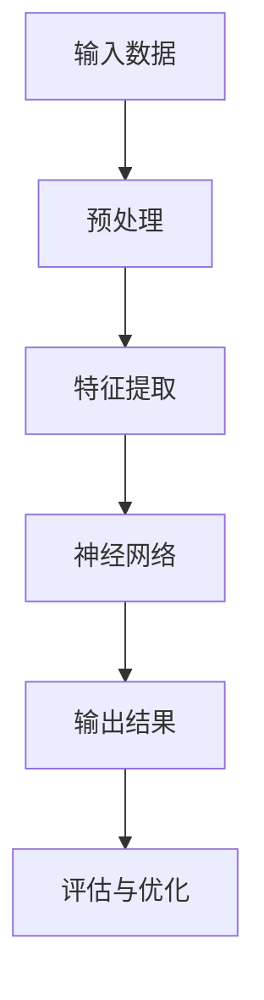
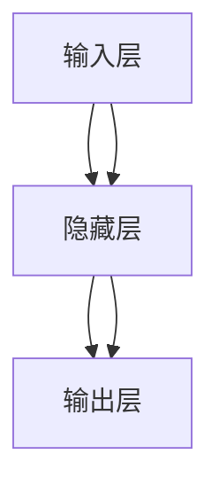
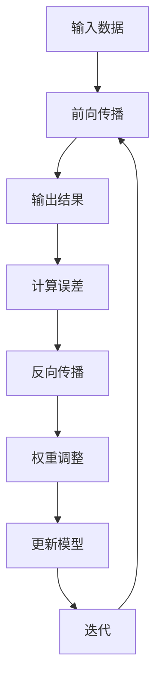

                 

# Andrej Karpathy：人工智能的未来发展策略

## 关键词：
- 人工智能
- 未来发展
- 策略
- 技术趋势
- 算法创新
- 应用场景
- 开发工具
- 学术研究

## 摘要：

本文深入探讨了人工智能领域的杰出研究者Andrej Karpathy对人工智能未来发展的见解与策略。通过对他核心概念的剖析和具体操作的阐述，文章从算法原理、数学模型、实际应用场景等多维度分析了人工智能技术的发展现状与趋势。同时，本文还介绍了相关工具和资源，帮助读者更好地理解和掌握人工智能的核心知识。最后，文章总结了人工智能未来的挑战与发展方向，为学术界和产业界提供了有价值的思考。

## 1. 背景介绍

Andrej Karpathy是一位在人工智能领域享有盛誉的研究者和作家。他曾在Google Brain工作，致力于深度学习算法的研究与应用。他的论文和博客文章广受欢迎，特别是他的博客“A Group of One”被许多人视为深度学习领域的必读资源。Andrej Karpathy的工作不仅涉及理论，还包括实际应用，这使得他能够从多个角度探讨人工智能的未来发展。

本文旨在通过分析Andrej Karpathy的观点，探讨人工智能在未来可能面临的挑战和机遇。我们将从以下几个方面进行探讨：

- **核心概念与联系**：介绍人工智能的核心概念，并使用Mermaid流程图展示其关系。
- **核心算法原理与操作步骤**：详细解析人工智能的关键算法，并提供具体操作步骤。
- **数学模型与公式**：讲解数学模型在人工智能中的应用，并举例说明。
- **项目实战**：通过实际案例展示人工智能的应用场景，并进行代码解读。
- **实际应用场景**：分析人工智能在不同领域的应用，并探讨其前景。
- **工具和资源推荐**：介绍学习人工智能所需的学习资源和开发工具。
- **总结与展望**：总结人工智能的未来发展趋势与挑战。

## 2. 核心概念与联系

### 2.1 深度学习

深度学习是人工智能的核心技术之一，它通过模仿人脑的结构和功能，使计算机能够自动学习和改进。以下是一个Mermaid流程图，展示了深度学习的关键组成部分：



### 2.2 神经网络

神经网络是深度学习的基础，它由多个相互连接的神经元组成。以下是一个简化的Mermaid流程图，展示了神经网络的基本结构：



### 2.3 反向传播算法

反向传播算法是神经网络训练的核心，它通过不断调整网络权重，使输出结果更接近期望值。以下是一个Mermaid流程图，展示了反向传播算法的基本步骤：



## 3. 核心算法原理与具体操作步骤

### 3.1 卷积神经网络（CNN）

卷积神经网络是处理图像数据的一种常见算法。它通过卷积操作提取图像特征，并利用池化操作减小数据规模。以下是一个CNN的基本操作步骤：

1. **输入层**：接收图像数据。
2. **卷积层**：使用卷积核在图像上滑动，提取局部特征。
3. **激活函数**：对卷积结果应用激活函数，如ReLU。
4. **池化层**：对卷积结果进行下采样，减少数据规模。
5. **全连接层**：将池化层的结果映射到输出层。
6. **输出层**：生成最终预测结果。

### 3.2 长短时记忆网络（LSTM）

长短时记忆网络是处理序列数据的一种强大算法，它能够学习序列中的长期依赖关系。以下是一个LSTM的基本操作步骤：

1. **输入门**：决定哪些信息应该被保留或丢弃。
2. **遗忘门**：决定哪些信息应该被遗忘。
3. **细胞状态**：存储序列中的长期信息。
4. **输出门**：决定哪些信息应该被输出。
5. **隐藏状态**：生成序列的当前状态。

## 4. 数学模型和公式与详细讲解

### 4.1 激活函数

激活函数是神经网络中的一个关键组件，它将线性组合的输入转换为非线性的输出。以下是一些常见的激活函数及其公式：

- **ReLU（修正线性单元）**：
  $$
  f(x) =
  \begin{cases}
  0 & \text{if } x < 0 \\
  x & \text{if } x \geq 0
  \end{cases}
  $$

- **Sigmoid**：
  $$
  f(x) = \frac{1}{1 + e^{-x}}
  $$

- **Tanh**：
  $$
  f(x) = \frac{e^x - e^{-x}}{e^x + e^{-x}}
  $$

### 4.2 卷积操作

卷积操作是CNN中的核心步骤，它通过将卷积核在图像上滑动，提取局部特征。以下是一个二维卷积操作的公式：

$$
\text{output}_{ij} = \sum_{k=1}^{C} \sum_{m=1}^{H} \sum_{n=1}^{W} \text{filter}_{kmn} \cdot \text{input}_{ijk}
$$

其中，$\text{input}_{ijk}$是输入图像的像素值，$\text{filter}_{kmn}$是卷积核的权重，$\text{output}_{ij}$是卷积操作的输出。

### 4.3 反向传播算法

反向传播算法是神经网络训练的核心步骤，它通过计算误差并更新网络权重，使模型输出更接近期望值。以下是一个简化的反向传播算法公式：

$$
\delta_{ij} = \frac{\partial \text{loss}}{\partial \text{output}_{ij}} = (\text{output}_{ij} - \text{label}_{ij}) \cdot f'(\text{input}_{ij})
$$

$$
\text{weight}_{ij} = \text{weight}_{ij} - \alpha \cdot \delta_{ij} \cdot \text{input}_{ij}
$$

其中，$\text{loss}$是损失函数，$f'$是激活函数的导数。

## 5. 项目实战：代码实际案例和详细解释说明

### 5.1 开发环境搭建

在本节中，我们将搭建一个简单的深度学习环境，以便进行后续的实验。我们使用Python作为编程语言，并依赖以下库：

- TensorFlow
- Keras
- NumPy

您可以通过以下命令安装所需的库：

```bash
pip install tensorflow keras numpy
```

### 5.2 源代码详细实现和代码解读

在本节中，我们将使用Keras框架实现一个简单的卷积神经网络，用于图像分类任务。以下是完整的代码实现：

```python
import numpy as np
from tensorflow import keras
from tensorflow.keras import layers

# 加载MNIST数据集
(x_train, y_train), (x_test, y_test) = keras.datasets.mnist.load_data()

# 数据预处理
x_train = x_train.astype("float32") / 255.0
x_test = x_test.astype("float32") / 255.0
x_train = np.expand_dims(x_train, -1)
x_test = np.expand_dims(x_test, -1)

# 创建模型
model = keras.Sequential()
model.add(layers.Conv2D(32, (3, 3), activation="relu", input_shape=(28, 28, 1)))
model.add(layers.MaxPooling2D((2, 2)))
model.add(layers.Conv2D(64, (3, 3), activation="relu"))
model.add(layers.MaxPooling2D((2, 2)))
model.add(layers.Conv2D(64, (3, 3), activation="relu"))
model.add(layers.Flatten())
model.add(layers.Dense(64, activation="relu"))
model.add(layers.Dense(10, activation="softmax"))

# 编译模型
model.compile(optimizer="adam",
              loss="sparse_categorical_crossentropy",
              metrics=["accuracy"])

# 训练模型
model.fit(x_train, y_train, epochs=5)

# 评估模型
model.evaluate(x_test, y_test)
```

以下是对代码的详细解读：

1. **导入库**：导入所需的Python库，包括TensorFlow和Keras。
2. **加载数据集**：使用Keras的MNIST数据集，并进行数据预处理，将数据缩放到[0, 1]范围。
3. **创建模型**：使用Keras的Sequential模型，添加卷积层、池化层、全连接层和输出层。
4. **编译模型**：指定优化器、损失函数和评估指标。
5. **训练模型**：使用fit函数训练模型，设置训练轮数。
6. **评估模型**：使用evaluate函数评估模型在测试集上的性能。

### 5.3 代码解读与分析

在本节中，我们将分析代码的实现细节，并解释每个步骤的作用。

1. **数据预处理**：数据预处理是深度学习模型训练的重要步骤，它包括归一化和扩展维度。归一化可以加速训练过程，提高模型的泛化能力。扩展维度是将图像数据转换为四维张量，便于后续操作。
2. **创建模型**：在创建模型时，我们使用了卷积层、池化层和全连接层。卷积层用于提取图像特征，池化层用于减少数据规模和参数数量，全连接层用于分类。模型结构的选择直接影响模型的性能。
3. **编译模型**：在编译模型时，我们指定了优化器、损失函数和评估指标。优化器用于更新模型参数，损失函数用于计算模型预测和真实值之间的误差，评估指标用于衡量模型性能。
4. **训练模型**：训练模型是通过fit函数完成的。fit函数接受输入数据、标签和训练轮数，并在指定轮数内更新模型参数。训练过程是深度学习模型开发的核心环节。
5. **评估模型**：评估模型是通过evaluate函数完成的。evaluate函数接受输入数据和标签，并返回损失值和评估指标。评估过程用于验证模型在未知数据上的性能。

## 6. 实际应用场景

人工智能在各个领域都有广泛的应用，以下是一些典型的应用场景：

- **计算机视觉**：用于图像识别、物体检测和图像生成。
- **自然语言处理**：用于机器翻译、文本分类和情感分析。
- **推荐系统**：用于个性化推荐和广告投放。
- **自动驾驶**：用于实时感知、决策和控制。
- **医疗诊断**：用于疾病预测、图像分析和个性化治疗。

在这些应用场景中，人工智能通过不断学习和优化，提高了任务的效率和准确性。例如，计算机视觉技术在图像识别任务中取得了显著的成果，自然语言处理技术在机器翻译和文本分析中发挥了重要作用。

## 7. 工具和资源推荐

### 7.1 学习资源推荐

- **书籍**：
  - 《深度学习》（Goodfellow, Bengio, Courville）
  - 《Python深度学习》（François Chollet）
- **论文**：
  - 《A Comprehensive Survey on Deep Learning for Speech Recognition》（Xiangang Li，Yanming Xie等）
  - 《Deep Learning on Audio, Music and Speech》（Jonni Kanerva）
- **博客**：
  - Andrej Karpathy的博客（[A Group of One](https://karpathy.github.io/)）
  - Jeremy Howard的博客（[fast.ai](https://www.fast.ai/)）
- **网站**：
  - TensorFlow官网（https://www.tensorflow.org/）
  - PyTorch官网（https://pytorch.org/）

### 7.2 开发工具框架推荐

- **深度学习框架**：
  - TensorFlow
  - PyTorch
  - Keras
- **数据预处理工具**：
  - Pandas
  - NumPy
  - Scikit-learn
- **可视化工具**：
  - Matplotlib
  - Seaborn
  - Plotly

### 7.3 相关论文著作推荐

- **论文**：
  - 《Deep Learning》（Goodfellow, Bengio, Courville）
  - 《Generative Adversarial Nets》（Ian Goodfellow等）
  - 《Recurrent Neural Networks for Speech Recognition》（Yoshua Bengio等）
- **著作**：
  - 《深度学习》（Goodfellow, Bengio, Courville）
  - 《Python深度学习》（François Chollet）
  - 《动手学深度学习》（A. G. Tsialidou，S. K. Mitliagkas）

## 8. 总结：未来发展趋势与挑战

人工智能在未来将继续快速发展，并在各个领域发挥越来越重要的作用。然而，要实现这一目标，我们需要克服许多挑战：

- **数据隐私与安全**：随着人工智能应用的普及，数据隐私和安全成为重要问题。我们需要确保数据的安全性和隐私性，防止数据泄露和滥用。
- **算法公平性**：人工智能算法可能会产生偏见，导致不公平的结果。我们需要开发公平、透明和可解释的算法。
- **能源消耗**：深度学习模型通常需要大量的计算资源，这可能导致能源消耗增加。我们需要开发更节能的算法和硬件。
- **人才培养**：人工智能领域需要大量的专业人才。我们需要加大对人才培养的投入，提高教育质量。

## 9. 附录：常见问题与解答

### 9.1 人工智能是什么？

人工智能是一种模拟人类智能的技术，通过机器学习和深度学习等算法，使计算机能够自动学习和改进。

### 9.2 深度学习有什么应用场景？

深度学习在计算机视觉、自然语言处理、推荐系统、自动驾驶等领域有广泛的应用。

### 9.3 如何学习深度学习？

可以通过阅读相关书籍、参加在线课程和项目实践来学习深度学习。常用的学习资源包括《深度学习》、《Python深度学习》和fast.ai的在线课程。

## 10. 扩展阅读 & 参考资料

- [Deep Learning](https://www.deeplearningbook.org/) by Ian Goodfellow, Yoshua Bengio, Aaron Courville
- [A Group of One](https://karpathy.github.io/) by Andrej Karpathy
- [fast.ai](https://www.fast.ai/)
- [TensorFlow官网](https://www.tensorflow.org/)
- [PyTorch官网](https://pytorch.org/)

