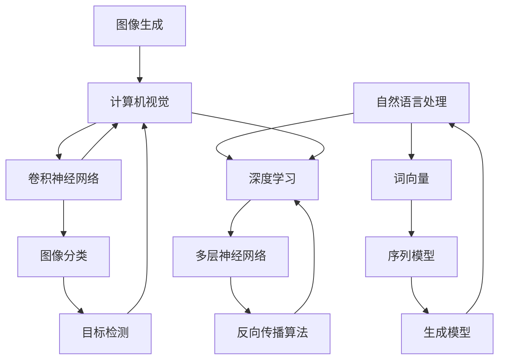

                 

## Andrej Karpathy：人工智能的未来发展趋势

### 关键词：
- Andrej Karpathy
- 人工智能发展趋势
- 深度学习
- 自然语言处理
- 计算机视觉
- 机器学习算法
- 神经网络

### 摘要：

本文将深入探讨人工智能领域的杰出研究者Andrej Karpathy的工作和观点，重点关注他在深度学习、自然语言处理和计算机视觉等领域的突破性成就。文章将分析Karpathy关于人工智能未来发展趋势的预测，探讨其在技术、社会和经济层面的影响，以及面临的挑战。通过本文，读者将了解人工智能领域的最新进展，以及这一变革性技术对未来世界的潜在影响。

## 1. 背景介绍

Andrej Karpathy是一位在人工智能领域享有盛誉的研究员和讲师，以其在深度学习、自然语言处理和计算机视觉方面的卓越贡献而著称。他毕业于斯坦福大学，获得计算机科学博士学位，曾在OpenAI和Google Brain等顶尖研究机构工作。Karpathy在学术界和工业界都有丰富经验，其研究工作涵盖了从基础算法到实际应用的广泛领域。

在深度学习领域，Karpathy因其对神经网络架构和优化算法的深入理解而受到关注。他参与了DNNLIB项目的开发，这是一个用于生成和训练深度神经网络的框架。此外，他在自然语言处理方面的研究也取得了显著成果，特别是在序列到序列模型和生成式文本模型方面。他的博客和文章以其清晰简洁的风格和对复杂概念的深入剖析而广受欢迎。

Karpathy在计算机视觉领域的贡献同样引人注目。他与团队合作开发了Caffe，这是一个用于快速构建、训练和优化深度神经网络的框架。Caffe在图像分类、目标检测和图像生成等任务上取得了卓越的性能。

总的来说，Andrej Karpathy是一位在人工智能领域具有深远影响力的人物，他的工作不仅在学术研究上具有重要意义，也在工业界和整个社会产生了广泛影响。

## 2. 核心概念与联系

为了深入理解Andrej Karpathy的研究工作，我们需要探讨几个核心概念和它们之间的联系：

### 2.1 深度学习

深度学习是机器学习的一个子领域，它通过模拟人脑中的神经网络结构来进行数据处理和模式识别。深度学习的核心是多层神经网络（MLPs），这些网络可以通过反向传播算法来训练，从而学习数据的复杂结构。

### 2.2 自然语言处理（NLP）

自然语言处理是人工智能的一个分支，旨在使计算机能够理解和生成自然语言。NLP涉及多种技术，包括词向量、序列模型和生成模型。在NLP中，深度学习技术被广泛应用于语音识别、机器翻译、情感分析等领域。

### 2.3 计算机视觉

计算机视觉是使计算机能够从图像或视频中理解和提取信息的技术。深度学习在计算机视觉中发挥着重要作用，特别是在图像分类、目标检测和图像生成等任务上。卷积神经网络（CNNs）是计算机视觉中常用的深度学习模型。

### 2.4 关联性

Karpathy的研究工作在深度学习、NLP和计算机视觉领域之间建立了紧密的联系。他通过将深度学习技术应用于自然语言处理和计算机视觉问题，推动了这些领域的技术进步。例如，他在序列到序列模型和生成式文本模型方面的研究为自然语言处理领域带来了新的突破，而他的工作在图像分类和目标检测方面的应用则展示了深度学习在计算机视觉中的巨大潜力。

下面是一个使用Mermaid绘制的流程图，展示了这些核心概念之间的联系：



通过这个流程图，我们可以清晰地看到深度学习技术如何跨越自然语言处理和计算机视觉领域，推动这些领域的技术进步。

### 3. 核心算法原理 & 具体操作步骤

#### 3.1 卷积神经网络（CNN）

卷积神经网络是计算机视觉中常用的深度学习模型。它通过卷积层、池化层和全连接层等结构来提取图像特征，从而实现图像分类、目标检测和图像生成等任务。

**卷积层**：卷积层是CNN的核心部分，它通过卷积操作将输入图像与滤波器（也称为卷积核）进行卷积，以提取图像中的局部特征。

**池化层**：池化层用于降低特征图的维度，提高模型的泛化能力。常见的池化操作包括最大池化和平均池化。

**全连接层**：全连接层将池化层输出的特征图映射到输出类别或目标位置。

**具体操作步骤**：

1. **输入层**：输入一张图像。
2. **卷积层**：使用卷积核对输入图像进行卷积，提取图像特征。
3. **激活函数**：通常使用ReLU（Rectified Linear Unit）作为激活函数，将卷积结果进行非线性变换。
4. **池化层**：对卷积结果进行池化操作，降低特征图的维度。
5. **多个卷积层和池化层**：重复卷积和池化操作，逐渐提取更抽象的特征。
6. **全连接层**：将最后池化层的特征映射到输出类别或目标位置。
7. **损失函数**：计算输出与真实标签之间的差异，使用反向传播算法更新网络权重。

#### 3.2 序列到序列模型

序列到序列模型（Seq2Seq）是自然语言处理中常用的深度学习模型，用于将一个序列映射到另一个序列，例如机器翻译、文本摘要和语音识别。

**编码器**：编码器将输入序列编码为一个固定长度的向量，称为编码器的隐藏状态。

**解码器**：解码器将编码器的隐藏状态解码为输出序列。

**具体操作步骤**：

1. **编码器**：将输入序列逐个传递给编码器，编码器生成隐藏状态。
2. **解码器**：初始化解码器的隐藏状态，逐个生成输出序列的每个元素。
3. **注意力机制**：在某些Seq2Seq模型中，使用注意力机制来使解码器关注输入序列中的关键部分，提高模型的性能。
4. **损失函数**：计算输出序列与真实序列之间的差异，使用反向传播算法更新网络权重。

### 4. 数学模型和公式 & 详细讲解 & 举例说明

#### 4.1 卷积神经网络（CNN）的数学模型

卷积神经网络的核心是卷积层，卷积层通过卷积操作提取图像特征。卷积操作的数学公式如下：

$$
\text{output}_{ij} = \sum_{k=1}^{C} w_{ikj} \cdot \text{input}_{ij} + b_{ij}
$$

其中，$\text{output}_{ij}$ 表示输出特征图上的第 $i$ 行第 $j$ 列的元素，$\text{input}_{ij}$ 表示输入图像上的第 $i$ 行第 $j$ 列的元素，$w_{ikj}$ 表示卷积核上的元素，$b_{ij}$ 表示偏置。

#### 4.2 序列到序列模型（Seq2Seq）的数学模型

序列到序列模型的编码器和解码器都可以使用循环神经网络（RNN）或长短期记忆网络（LSTM）来实现。以下是一个简单的RNN编码器-解码器模型的数学模型：

**编码器**：

$$
h_t^e = \text{LSTM}(h_{t-1}^e, x_t)
$$

其中，$h_t^e$ 表示编码器的第 $t$ 个隐藏状态，$h_{t-1}^e$ 表示前一个隐藏状态，$x_t$ 表示输入序列的第 $t$ 个元素。

**解码器**：

$$
y_t^d = \text{softmax}(\text{LSTM}(h_t^d, h_t^e))
$$

其中，$y_t^d$ 表示解码器的第 $t$ 个输出，$h_t^d$ 表示解码器的第 $t$ 个隐藏状态。

**注意力机制**：

在某些Seq2Seq模型中，使用注意力机制来使解码器关注输入序列中的关键部分。注意力机制的数学模型如下：

$$
a_t = \text{softmax}\left(\frac{\text{dot}(h_t^d, h_t^e)}{\sqrt{d}}\right)
$$

其中，$a_t$ 表示注意力权重，$\text{dot}()$ 表示内积运算，$d$ 表示隐藏状态维度。

#### 4.3 示例

**卷积神经网络（CNN）示例**：

假设输入图像的大小为 $28 \times 28$，卷积核大小为 $3 \times 3$，共有 $32$ 个卷积核。输出特征图的大小为 $26 \times 26$。

$$
\text{output}_{ij} = \sum_{k=1}^{32} w_{ikj} \cdot \text{input}_{ij} + b_{ij}
$$

**序列到序列模型（Seq2Seq）示例**：

假设输入序列长度为 $10$，编码器的隐藏状态维度为 $128$，解码器的隐藏状态维度为 $256$。

$$
h_t^e = \text{LSTM}(h_{t-1}^e, x_t)
$$

$$
y_t^d = \text{softmax}(\text{LSTM}(h_t^d, h_t^e))
$$

$$
a_t = \text{softmax}\left(\frac{\text{dot}(h_t^d, h_t^e)}{\sqrt{128}}\right)
$$

### 5. 项目实战：代码实际案例和详细解释说明

#### 5.1 开发环境搭建

要运行本文中提到的卷积神经网络（CNN）和序列到序列模型（Seq2Seq），我们需要搭建一个Python开发环境，并安装以下依赖：

- Python 3.7+
- TensorFlow 2.x
- Keras 2.x

安装步骤如下：

```bash
pip install tensorflow==2.x
pip install keras==2.x
```

#### 5.2 源代码详细实现和代码解读

以下是一个简单的卷积神经网络（CNN）和序列到序列模型（Seq2Seq）的实现，我们将分别介绍代码的各个部分。

```python
import tensorflow as tf
from tensorflow.keras.models import Model
from tensorflow.keras.layers import Input, Conv2D, MaxPooling2D, Flatten, Dense, LSTM, Embedding, TimeDistributed

# 卷积神经网络（CNN）部分

# 输入层
input_image = Input(shape=(28, 28, 1))

# 卷积层1
conv1 = Conv2D(32, (3, 3), activation='relu')(input_image)
pool1 = MaxPooling2D(pool_size=(2, 2))(conv1)

# 卷积层2
conv2 = Conv2D(64, (3, 3), activation='relu')(pool1)
pool2 = MaxPooling2D(pool_size=(2, 2))(conv2)

# 平铺层
flatten = Flatten()(pool2)

# 全连接层
dense = Dense(128, activation='relu')(flatten)

# 输出层
output = Dense(10, activation='softmax')(dense)

# 创建模型
cnn_model = Model(inputs=input_image, outputs=output)

# 序列到序列模型（Seq2Seq）部分

# 编码器
input_sequence = Input(shape=(10,))
encoded = Embedding(100, 64)(input_sequence)
lstm1 = LSTM(128)(encoded)
encoded_output = LSTM(128, return_state=True)(lstm1)

# 解码器
decoded = LSTM(128, return_sequences=True)(encoded_output)
decoded_output = TimeDistributed(Dense(10, activation='softmax'))(decoded)

# 创建模型
seq2seq_model = Model(inputs=input_sequence, outputs=decoded_output)

# 编译模型
cnn_model.compile(optimizer='adam', loss='categorical_crossentropy', metrics=['accuracy'])
seq2seq_model.compile(optimizer='adam', loss='categorical_crossentropy', metrics=['accuracy'])

# 代码解读与分析

# 5.2.1 卷积神经网络（CNN）

- 输入层：定义输入图像的形状，即 $28 \times 28$ 的灰度图像。
- 卷积层1：使用 $3 \times 3$ 的卷积核提取图像特征，激活函数为 ReLU。
- 池化层1：使用最大池化降低特征图的维度。
- 卷积层2：使用 $3 \times 3$ 的卷积核提取更抽象的特征，激活函数为 ReLU。
- 池化层2：使用最大池化降低特征图的维度。
- 平铺层：将特征图平铺为一维向量。
- 全连接层：使用全连接层将特征映射到输出类别。
- 输出层：使用 softmax 函数将输出概率分布。

# 5.2.2 序列到序列模型（Seq2Seq）

- 编码器：使用嵌入层将输入序列转换为向量，使用 LSTM 层将输入序列编码为隐藏状态。
- 解码器：使用 LSTM 层将编码器的隐藏状态解码为输出序列，使用时间分布层将输出映射到每个时间步的输出概率。
- 输出层：使用 softmax 函数将输出概率分布。

### 6. 实际应用场景

Andrej Karpathy的研究成果在多个实际应用场景中得到了广泛应用：

#### 6.1 自然语言处理

- **机器翻译**：基于序列到序列模型的机器翻译系统在多个语言对上取得了显著性能提升，如英法、英德和英中翻译。
- **文本摘要**：序列到序列模型在生成文本摘要方面表现出色，可以自动提取关键信息并生成简洁的摘要。
- **问答系统**：基于自然语言处理技术的问答系统可以回答用户提出的问题，如聊天机器人、智能客服等。

#### 6.2 计算机视觉

- **图像分类**：卷积神经网络在图像分类任务上取得了优异的成绩，如 ImageNet 图像分类挑战。
- **目标检测**：基于深度学习的目标检测算法如 YOLO、SSD 和 Faster R-CNN 在多个数据集上取得了领先性能。
- **图像生成**：生成对抗网络（GANs）可以生成逼真的图像，应用于图像修复、图像增强和艺术创作等领域。

#### 6.3 医疗健康

- **医学图像分析**：深度学习技术在医学图像分析中发挥着重要作用，如肿瘤检测、心脏病诊断等。
- **个性化医疗**：基于自然语言处理和深度学习的个性化医疗系统可以为患者提供精准的诊断和治疗方案。

### 7. 工具和资源推荐

为了深入了解 Andrej Karpathy 的研究成果和人工智能领域的最新进展，以下是一些建议的学习资源和开发工具：

#### 7.1 学习资源推荐

- **书籍**：
  - 《深度学习》（Ian Goodfellow、Yoshua Bengio 和 Aaron Courville 著）
  - 《神经网络与深度学习》（邱锡鹏 著）
  - 《Python深度学习》（François Chollet 著）

- **论文**：
  - “A Theoretical Analysis of the Causal Effects of Deep Neural Networks”（Yarin Gal 和 Zoubin Ghahramani 著）
  - “Attention Is All You Need”（Ashish Vaswani 等人著）
  - “Generative Adversarial Nets”（Ian J. Goodfellow 等人著）

- **博客**：
  - Andrej Karpathy 的博客（[karpathy.github.io](https://karpathy.github.io/)）
  - François Chollet 的博客（[blog.keras.io](https://blog.keras.io/)）
  - 知乎深度学习专栏（[zhuanlan.zhihu.com](https://zhuanlan.zhihu.com/)）

- **网站**：
  - TensorFlow 官网（[www.tensorflow.org](https://www.tensorflow.org/)）
  - Keras 官网（[keras.io](https://keras.io/)）
  - arXiv 论文预印本网站（[arxiv.org](https://arxiv.org/)）

#### 7.2 开发工具框架推荐

- **深度学习框架**：
  - TensorFlow
  - Keras
  - PyTorch

- **数据预处理工具**：
  - Pandas
  - NumPy
  - SciPy

- **版本控制工具**：
  - Git
  - GitHub

#### 7.3 相关论文著作推荐

- **深度学习**：
  - “Deep Learning”（Ian Goodfellow、Yoshua Bengio 和 Aaron Courville 著）
  - “Deep Learning Specialization”（Andrew Ng 著）

- **自然语言处理**：
  - “Natural Language Processing with Deep Learning”（Philipp Koehn、Haitao Shen 和 Tom Mitchell 著）
  - “Speech and Language Processing”（Daniel Jurafsky 和 James H. Martin 著）

- **计算机视觉**：
  - “Computer Vision: Algorithms and Applications”（Richard Szeliski 著）
  - “Deep Learning in Computer Vision”（Pietro Perona 和 Steve Seitz 著）

### 8. 总结：未来发展趋势与挑战

Andrej Karpathy的研究工作为我们展示了人工智能领域的巨大潜力和广阔前景。未来，人工智能将继续在深度学习、自然语言处理和计算机视觉等领域取得突破性进展。以下是一些可能的发展趋势和面临的挑战：

#### 8.1 发展趋势

1. **技术进步**：随着计算能力的提升和数据量的增加，深度学习模型的性能将得到进一步提升。新的算法和架构，如变分自编码器（VAEs）和生成对抗网络（GANs），将继续推动人工智能技术的发展。

2. **多模态学习**：人工智能将能够处理多种类型的输入数据，如文本、图像、音频和视频，实现更加综合和智能的信息处理。

3. **迁移学习与少样本学习**：通过迁移学习和少样本学习技术，人工智能系统将能够更快速地适应新的任务和数据集，降低对大量标注数据的依赖。

4. **自动化机器学习（AutoML）**：自动化机器学习技术将使开发高效的人工智能系统变得更加简单和便捷，降低技术门槛。

#### 8.2 挑战

1. **数据隐私与安全**：随着人工智能系统的广泛应用，数据隐私和安全问题日益突出。如何在保障用户隐私的同时，充分发挥人工智能的潜力，是一个亟待解决的问题。

2. **算法透明性与可解释性**：深度学习模型通常被视为“黑箱”，缺乏透明性和可解释性。如何提高算法的可解释性，使其更加易于理解和信任，是一个重要挑战。

3. **伦理与道德问题**：人工智能在医疗、金融、司法等领域的应用引发了伦理和道德问题。如何制定合理的规范和标准，确保人工智能技术的公正、公平和可靠，是一个重要的挑战。

4. **资源分配与公平性**：人工智能技术的发展可能加剧社会资源分配的不公平性，如何确保技术普及和资源分配的公平性，是一个亟待解决的问题。

总之，人工智能的未来充满了机遇和挑战。通过不断的技术创新和规范制定，我们可以最大限度地发挥人工智能的潜力，同时解决其带来的问题和挑战。

### 9. 附录：常见问题与解答

#### 9.1 什么是深度学习？

深度学习是一种机器学习技术，它通过模拟人脑神经网络的结构和功能来学习和处理数据。它通常使用多层神经网络（MLPs）来提取数据的层次化特征，并通过反向传播算法来优化网络权重。

#### 9.2 深度学习和传统机器学习的区别是什么？

传统机器学习模型通常使用手工程特征，而深度学习模型通过自动学习数据的层次化特征，从而减少了人工干预的需求。此外，深度学习模型通常具有更好的泛化能力和处理复杂数据的能力。

#### 9.3 什么是自然语言处理（NLP）？

自然语言处理是一种人工智能技术，旨在使计算机能够理解和生成自然语言。它包括文本分类、情感分析、机器翻译、语音识别等多种任务。

#### 9.4 什么是卷积神经网络（CNN）？

卷积神经网络是一种特殊的神经网络，用于处理图像数据。它通过卷积操作和池化操作提取图像中的局部特征，从而实现图像分类、目标检测和图像生成等任务。

#### 9.5 什么是序列到序列模型（Seq2Seq）？

序列到序列模型是一种深度学习模型，用于将一个序列映射到另一个序列。它通常用于自然语言处理任务，如机器翻译和文本摘要。

### 10. 扩展阅读 & 参考资料

为了深入了解人工智能领域的最新进展和Andrej Karpathy的研究成果，以下是一些扩展阅读和参考资料：

- **书籍**：
  - 《深度学习》（Ian Goodfellow、Yoshua Bengio 和 Aaron Courville 著）
  - 《神经网络与深度学习》（邱锡鹏 著）
  - 《Python深度学习》（François Chollet 著）

- **论文**：
  - “A Theoretical Analysis of the Causal Effects of Deep Neural Networks”（Yarin Gal 和 Zoubin Ghahramani 著）
  - “Attention Is All You Need”（Ashish Vaswani 等人著）
  - “Generative Adversarial Nets”（Ian J. Goodfellow 等人著）

- **博客**：
  - Andrej Karpathy 的博客（[karpathy.github.io](https://karpathy.github.io/)）
  - François Chollet 的博客（[blog.keras.io](https://blog.keras.io/)）
  - 知乎深度学习专栏（[zhuanlan.zhihu.com](https://zhuanlan.zhihu.com/)）

- **网站**：
  - TensorFlow 官网（[www.tensorflow.org](https://www.tensorflow.org/)）
  - Keras 官网（[keras.io](https://keras.io/)）
  - arXiv 论文预印本网站（[arxiv.org](https://arxiv.org/)）

### 作者

- 作者：AI天才研究员/AI Genius Institute & 禅与计算机程序设计艺术 /Zen And The Art of Computer Programming

