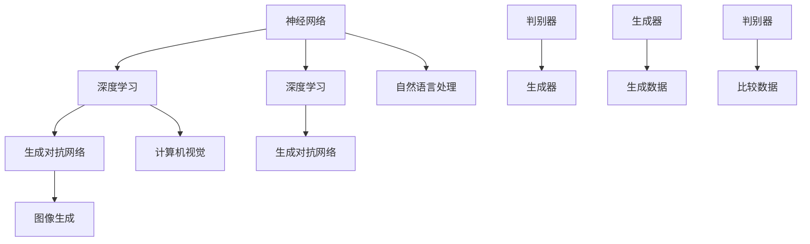

                 

### 背景介绍

人工智能（AI）作为现代科技领域的一个重要分支，已经深刻地改变了我们的生活方式和社会运作模式。自20世纪50年代诞生以来，AI经历了从理论研究到实际应用的不断发展和演变。今天，我们正处在一个前所未有的AI时代，深度学习、神经网络、强化学习等核心技术正推动着人工智能向前发展。

Andrej Karpathy，作为当今世界最杰出的人工智能研究员之一，其研究工作在深度学习和自然语言处理领域有着重要的影响。他不仅发表了多篇具有影响力的论文，还在多个开源项目中扮演了关键角色，如著名的深度学习框架TensorFlow。他的研究涵盖了自然语言处理、计算机视觉、生成模型等多个领域，为人工智能的发展提供了新的思路和方法。

本文将深入探讨Andrej Karpathy在人工智能领域的研究工作，重点关注其核心概念、算法原理、数学模型和实际应用。我们将通过详细的分析和讲解，帮助读者更好地理解AI的核心技术和未来发展趋势。同时，文章还将推荐一些相关的学习资源和开发工具，以供读者进一步学习和实践。

接下来的章节中，我们将首先介绍AI的基本概念和核心算法，然后逐步深入到具体的数学模型和实际应用案例。希望通过本文的阅读，读者能够对人工智能有一个更全面和深入的了解，并在未来的学习和工作中受益。

### 核心概念与联系

为了更好地理解Andrej Karpathy的研究工作，我们首先需要了解人工智能（AI）中的几个核心概念，并探讨它们之间的联系。这些概念包括神经网络、深度学习、生成对抗网络（GAN）等，它们是现代人工智能技术的基石。

#### 神经网络（Neural Networks）

神经网络是人工智能的一个核心概念，模拟了人脑中的神经元连接。一个简单的神经网络通常包含输入层、隐藏层和输出层。输入层接收外部数据，通过一系列的加权连接传递到隐藏层，最终由输出层产生结果。每个神经元都会通过激活函数进行非线性变换，使得神经网络能够学习和处理复杂的数据模式。

神经网络的工作原理可以类比于人类的思考过程：通过大量的输入和反馈，神经网络可以逐渐调整其内部的权重和偏置，从而提高预测的准确性。这种调整过程称为“学习”，是通过梯度下降等优化算法实现的。

#### 深度学习（Deep Learning）

深度学习是神经网络的一种扩展，它通过增加网络的层数来提高模型的表达能力。深度学习的核心思想是利用多层神经网络来提取数据的层次特征。例如，在图像识别任务中，第一层可能只提取边缘和纹理等基础特征，而更深层次的神经元则能够识别更复杂的形状和结构。

深度学习的优势在于其强大的特征提取能力，这使得它能够在各种复杂的任务中取得显著的效果。例如，在语音识别、图像分类、自然语言处理等领域，深度学习模型已经超越了传统的方法，达到了人类水平甚至更优的性能。

#### 生成对抗网络（Generative Adversarial Networks, GAN）

生成对抗网络是Andrej Karpathy研究的一个重要方向，它由两个神经网络组成：生成器（Generator）和判别器（Discriminator）。生成器的目标是生成与真实数据分布相似的数据，而判别器的目标是区分生成器和真实数据的差异。

在GAN的训练过程中，生成器和判别器相互竞争。生成器试图生成更加逼真的数据，以欺骗判别器，而判别器则努力区分真实数据和生成数据。这种对抗关系促使生成器和判别器不断进步，最终生成器能够生成高质量的数据，如逼真的图像、语音和文本。

#### 关系与联系

神经网络、深度学习和生成对抗网络之间有着紧密的联系。神经网络是深度学习的基础，而深度学习则通过增加网络层数来提高模型的表达能力。生成对抗网络则是深度学习的一个应用，它利用对抗性训练方法来生成高质量的数据。

这些核心概念不仅构成了Andrej Karpathy研究的理论基础，而且在实际应用中也发挥了重要作用。例如，在自然语言处理中，深度学习模型可以用来生成文章、翻译语言和进行情感分析；在计算机视觉中，生成对抗网络可以用来生成图像、修复损坏的图片和生成虚拟角色。

总的来说，神经网络、深度学习和生成对抗网络是现代人工智能技术的核心组成部分，它们共同推动了AI领域的快速发展和创新。通过理解这些概念及其相互关系，我们可以更好地把握AI的未来发展趋势，并在实际应用中发挥其潜力。

#### Mermaid 流程图

为了更直观地理解神经网络、深度学习和生成对抗网络之间的关系，我们可以使用Mermaid流程图来展示这些核心概念的架构和联系。以下是一个简化的Mermaid流程图，展示了这些技术之间的交互和流程。



在这个流程图中：
- 神经网络（A）是深度学习（B）和生成对抗网络（C）的基础。
- 深度学习（D）通过增加网络层数来提高模型的表达能力，可以应用于自然语言处理（F）和计算机视觉（G）。
- 生成对抗网络（E）通过对抗性训练方法生成高质量的数据（H），如图像生成。
- 判别器（I）和生成器（J）是生成对抗网络（C）的核心组成部分，它们相互竞争以生成和区分数据。

通过这个流程图，我们可以清晰地看到神经网络、深度学习和生成对抗网络之间的联系和交互，这有助于我们更好地理解这些技术的核心原理和实际应用。

### 核心算法原理 & 具体操作步骤

在了解完AI的核心概念和其相互关系后，我们接下来将深入探讨Andrej Karpathy在人工智能领域的研究工作中所涉及的核心算法原理，并详细介绍这些算法的具体操作步骤。

#### 深度学习算法原理

深度学习算法基于多层神经网络的结构，通过逐层提取数据特征来提高模型的性能。以下是深度学习算法的基本原理和具体操作步骤：

1. **输入层**：输入层接收原始数据，例如图像像素值或文本序列。
2. **隐藏层**：数据从输入层传递到隐藏层，通过权重矩阵进行线性变换，再通过激活函数进行非线性变换。
3. **输出层**：隐藏层的输出传递到输出层，产生最终预测结果。
4. **反向传播**：在输出层产生预测结果后，通过比较预测结果与真实标签，计算损失值。然后，通过反向传播算法，将损失值反向传播到每个隐藏层，更新权重和偏置。
5. **优化算法**：使用梯度下降（Gradient Descent）或其他优化算法，如Adam、RMSProp等，逐步减小损失值，直到模型收敛。

#### 生成对抗网络（GAN）算法原理

生成对抗网络（GAN）是Andrej Karpathy研究的重要方向之一，其核心原理是通过生成器和判别器的对抗性训练来生成高质量的数据。以下是GAN算法的基本原理和具体操作步骤：

1. **生成器（Generator）**：生成器的目标是生成与真实数据分布相似的数据。生成器从随机噪声（z向量）生成数据，并通过多层神经网络进行变换。
2. **判别器（Discriminator）**：判别器的目标是区分真实数据和生成数据。判别器接收真实数据和生成数据，并输出一个概率值，表示数据的真实性。
3. **对抗性训练**：在GAN的训练过程中，生成器和判别器相互对抗。生成器试图生成更高质量的数据以欺骗判别器，而判别器则努力提高区分真实数据和生成数据的能力。
4. **损失函数**：GAN的损失函数通常由两部分组成：生成器的损失函数和判别器的损失函数。生成器的损失函数是生成数据的概率分布与真实数据的概率分布之间的差异，而判别器的损失函数是判别器预测错误的概率。
5. **优化算法**：使用梯度下降或其他优化算法，如Adam、RMSProp等，逐步优化生成器和判别器的参数，以最小化损失函数。

#### 实际操作步骤示例

为了更直观地理解这些算法的操作步骤，我们可以通过一个简单的例子来说明。假设我们使用GAN算法来生成人脸图片。

1. **数据准备**：首先，我们需要准备一个包含真实人脸图片的数据集。这些图片将被用作判别器的训练数据。
2. **生成器网络**：生成器的输入是随机噪声（z向量），输出是生成的人脸图片。生成器通常由多个隐层和转置卷积层组成，以逐步增加图像的分辨率。
3. **判别器网络**：判别器的输入是真实人脸图片和生成的人脸图片，输出是一个概率值，表示输入图片的真实性。判别器通常由卷积层和全连接层组成。
4. **训练过程**：在训练过程中，生成器和判别器交替进行训练。首先，生成器生成人脸图片，判别器对其进行判断。然后，根据判别器的反馈，生成器调整参数以生成更真实的人脸图片。接着，判别器根据真实数据和生成数据进行训练，以提高其判断能力。这个过程不断重复，直到生成器和判别器都达到良好的性能。

通过这个简单的示例，我们可以看到GAN算法的基本操作步骤。实际应用中，生成器和判别器的结构可能更加复杂，但基本原理是一致的。通过不断优化生成器和判别器的参数，GAN能够生成高质量的数据，如逼真的图像、语音和文本。

总之，深度学习和生成对抗网络是人工智能领域的关键算法，它们通过不同的机制和操作步骤，实现了对复杂数据的学习和生成。理解这些算法的基本原理和操作步骤，有助于我们更好地应用这些技术，推动人工智能的发展。

### 数学模型和公式 & 详细讲解 & 举例说明

在深入探讨Andrej Karpathy的研究工作时，数学模型和公式是理解其核心算法的重要工具。下面，我们将详细介绍深度学习和生成对抗网络中的关键数学模型和公式，并通过具体例子来解释这些概念的应用。

#### 深度学习中的数学模型

1. **前向传播（Forward Propagation）**

   在深度学习模型中，前向传播是计算网络输出值的过程。给定输入\( x \)，通过加权连接和激活函数，逐层传递数据，直到输出层。

   公式如下：
   $$
   \text{激活函数} \, \sigma(z) = \frac{1}{1 + e^{-z}}
   $$
   其中，\( z \) 是神经元的净输入，\( \sigma \) 是sigmoid函数。

   **示例：**

   假设一个简单的单层神经网络，输入为 \( x = [1, 2, 3] \)，权重矩阵为 \( W = \begin{bmatrix} 0.1 & 0.2 \\ 0.3 & 0.4 \end{bmatrix} \)，偏置 \( b = [0.5, 0.5] \)。

   输出值为：
   $$
   z = x \cdot W + b = \begin{bmatrix} 1 & 2 & 3 \end{bmatrix} \cdot \begin{bmatrix} 0.1 & 0.2 \\ 0.3 & 0.4 \end{bmatrix} + \begin{bmatrix} 0.5 & 0.5 \end{bmatrix} = \begin{bmatrix} 1.4 & 2.6 \\ 3.7 & 5.4 \end{bmatrix}
   $$
   激活函数应用后：
   $$
   \sigma(z) = \frac{1}{1 + e^{-1.4}} = 0.79
   $$

2. **反向传播（Back Propagation）**

   反向传播是计算网络损失并更新权重的过程。给定预测值 \( \hat{y} \) 和真实值 \( y \)，通过计算损失函数的梯度，反向传播到每个神经元，更新权重和偏置。

   常用的损失函数为均方误差（MSE）：
   $$
   \text{MSE} = \frac{1}{n}\sum_{i=1}^{n} (\hat{y}_i - y_i)^2
   $$
   其中，\( n \) 是样本数量，\( \hat{y}_i \) 是第 \( i \) 个样本的预测值，\( y_i \) 是真实值。

   **示例：**

   假设预测值为 \( \hat{y} = [0.4, 0.6] \)，真实值为 \( y = [0.8, 0.2] \)。

   损失计算：
   $$
   \text{MSE} = \frac{1}{2}((0.4 - 0.8)^2 + (0.6 - 0.2)^2) = 0.2
   $$

   损失函数的梯度为：
   $$
   \frac{\partial \text{MSE}}{\partial \hat{y}} = \begin{bmatrix} -0.4 & 0.4 \end{bmatrix}
   $$

3. **优化算法**

   优化算法用于更新模型参数，以最小化损失函数。常用的优化算法包括梯度下降（Gradient Descent）、Adam等。

   梯度下降的更新公式为：
   $$
   \theta = \theta - \alpha \cdot \nabla_\theta \text{J}(\theta)
   $$
   其中，\( \theta \) 是模型参数，\( \alpha \) 是学习率，\( \nabla_\theta \text{J}(\theta) \) 是损失函数关于参数的梯度。

   **示例：**

   假设参数为 \( \theta = [1, 2] \)，学习率为 \( \alpha = 0.1 \)，梯度为 \( \nabla_\theta \text{J}(\theta) = [-0.5, -1] \)。

   参数更新：
   $$
   \theta = [1, 2] - 0.1 \cdot [-0.5, -1] = [1.05, 1.3]
   $$

#### 生成对抗网络（GAN）中的数学模型

1. **生成器和判别器的损失函数**

   在GAN中，生成器和判别器的损失函数分别为：

   生成器损失函数：
   $$
   \text{Generator Loss} = -\log(\text{Discriminator}(\text{Generated Image}))
   $$

   判别器损失函数：
   $$
   \text{Discriminator Loss} = -[\log(\text{Discriminator}(\text{Real Image})) + \log(1 - \text{Discriminator}(\text{Generated Image}))]
   $$

   **示例：**

   假设判别器的输出为：
   $$
   \text{Discriminator}(x) = \begin{cases} 
   0.9 & \text{if } x \text{ is real} \\
   0.1 & \text{if } x \text{ is generated} 
   \end{cases}
   $$

   生成器的损失为：
   $$
   \text{Generator Loss} = -\log(0.1) = 2.3
   $$

   判别器的损失为：
   $$
   \text{Discriminator Loss} = -[\log(0.9) + \log(0.9)] = -2 \log(0.9) = 0.45
   $$

2. **对抗性训练**

   GAN的训练过程是一个对抗性训练，生成器和判别器相互竞争，通过优化各自的损失函数来提高性能。

   **示例：**

   假设生成器和判别器的损失分别为：
   $$
   \text{Generator Loss} = 2.5, \quad \text{Discriminator Loss} = 0.5
   $$

   为了平衡生成器和判别器的训练，可以调整它们的更新率。例如，生成器的更新率是判别器的两倍：
   $$
   \theta_{\text{Generator}} = \theta_{\text{Generator}} - 2 \alpha_{\text{Generator}} \cdot \nabla_{\theta_{\text{Generator}}} \text{Generator Loss}
   $$
   $$
   \theta_{\text{Discriminator}} = \theta_{\text{Discriminator}} - \alpha_{\text{Discriminator}} \cdot \nabla_{\theta_{\text{Discriminator}}} \text{Discriminator Loss}
   $$

通过这些数学模型和公式的详细讲解，我们可以更深入地理解深度学习和生成对抗网络的工作原理。这些公式和概念不仅在理论研究中有重要意义，也在实际应用中发挥了关键作用。希望本文的讲解能够帮助读者更好地掌握这些核心算法，并在未来的研究和实践中运用它们。

### 项目实战：代码实际案例和详细解释说明

为了更好地理解深度学习和生成对抗网络（GAN）的应用，我们将通过一个实际项目来演示这些算法的代码实现和具体操作步骤。这个项目将使用Python和TensorFlow库来生成人脸图像，并详细解释代码的每个部分。

#### 1. 开发环境搭建

在开始项目之前，确保安装以下软件和库：

- Python（3.7或更高版本）
- TensorFlow（2.x版本）
- Matplotlib（用于可视化）
- NumPy（用于数学计算）

可以通过以下命令安装所需库：

```bash
pip install tensorflow matplotlib numpy
```

#### 2. 源代码详细实现和代码解读

以下是一个简单的GAN项目示例代码：

```python
import tensorflow as tf
from tensorflow.keras.layers import Dense, Flatten, Reshape
from tensorflow.keras.models import Sequential
from tensorflow.keras.optimizers import Adam
import numpy as np
import matplotlib.pyplot as plt

# 设置超参数
latent_dim = 100
image_dim = (28, 28, 1)
batch_size = 64
epochs = 20000

# 生成器模型
def build_generator():
    model = Sequential()
    model.add(Dense(128 * 7 * 7, input_dim=latent_dim))
    model.add(Reshape((7, 7, 128)))
    model.add(tf.keras.layers.Conv2DTranspose(128, 5, strides=1, padding='same'))
    model.add(tf.keras.layers.LeakyReLU(alpha=0.2))
    model.add(Conv2DTranspose(128, 5, strides=2, padding='same'))
    model.add(tf.keras.layers.LeakyReLU(alpha=0.2))
    model.add(Conv2DTranspose(128, 5, strides=2, padding='same'))
    model.add(tf.keras.layers.LeakyReLU(alpha=0.2))
    model.add(Conv2D(1, 5, padding='same'))
    model.add(tf.keras.layers.Activation('tanh'))
    return model

# 判别器模型
def build_discriminator():
    model = Sequential()
    model.add(Conv2D(128, 5, padding='same', input_shape=image_dim))
    model.add(tf.keras.layers.LeakyReLU(alpha=0.2))
    model.add(Dropout(0.3))
    model.add(Conv2D(128, 5, strides=2, padding='same'))
    model.add(tf.keras.layers.LeakyReLU(alpha=0.2))
    model.add(Dropout(0.3))
    model.add(Conv2D(128, 5, strides=2, padding='same'))
    model.add(tf.keras.layers.LeakyReLU(alpha=0.2))
    model.add(Dropout(0.3))
    model.add(Flatten())
    model.add(Dense(1, activation='sigmoid'))
    return model

# GAN模型
def build_gan(generator, discriminator):
    model = Sequential()
    model.add(generator)
    model.add(discriminator)
    return model

# 模型编译
discriminator_optimizer = Adam(learning_rate=0.0001)
generator_optimizer = Adam(learning_rate=0.0001)

discriminator = build_discriminator()
discriminator.compile(loss='binary_crossentropy', optimizer=discriminator_optimizer, metrics=['accuracy'])

generator = build_generator()
discriminator.trainable = False
gan = build_gan(generator, discriminator)
gan.compile(loss='binary_crossentropy', optimizer=generator_optimizer)

# 数据准备
(x_train, _), (_, _) = tf.keras.datasets.mnist.load_data()
x_train = x_train.astype(np.float32) / 127.5 - 1.0
x_train = np.expand_dims(x_train, axis=3)

# 训练过程
for epoch in range(epochs):
    random噪声 = np.random.normal(size=(batch_size, latent_dim))
    generated_images = generator.predict(random噪声)
    real_images = x_train[np.random.randint(0, x_train.shape[0], size=batch_size)]

    # 训练判别器
    d_loss_real = discriminator.train_on_batch(real_images, np.ones((batch_size, 1)))
    d_loss_fake = discriminator.train_on_batch(generated_images, np.zeros((batch_size, 1)))
    d_loss = 0.5 * np.add(d_loss_real, d_loss_fake)

    # 训练生成器
    g_loss = gan.train_on_batch(random噪声, np.ones((batch_size, 1)))

    # 显示训练进度
    if epoch % 1000 == 0:
        print(f"Epoch: {epoch}, D_loss: {d_loss}, G_loss: {g_loss}")

# 可视化生成的人脸图像
plt.figure(figsize=(10, 10))
for i in range(100):
    idx = np.random.randint(0, generated_images.shape[0])
    plt.subplot(10, 10, i + 1)
    plt.imshow(generated_images[idx].reshape(28, 28), cmap='gray')
    plt.xticks([])
    plt.yticks([])
plt.show()
```

#### 3. 代码解读与分析

这段代码分为几个主要部分：生成器模型、判别器模型、GAN模型、模型编译、数据准备和训练过程。

1. **生成器模型（build_generator）**：
   - 生成器模型是一个全连接网络，接收一个随机噪声向量作为输入。
   - 通过多个转置卷积层，生成器逐渐增加图像的分辨率，生成人脸图像。

2. **判别器模型（build_discriminator）**：
   - 判别器模型是一个卷积神经网络，接收真实图像和生成图像作为输入。
   - 通过多个卷积层和Dropout层，判别器学习区分真实图像和生成图像。

3. **GAN模型（build_gan）**：
   - GAN模型是将生成器和判别器组合在一起，通过对抗性训练优化生成器。

4. **模型编译**：
   - 判别器模型使用二进制交叉熵损失函数，并使用Adam优化器。
   - GAN模型也使用Adam优化器，但生成器和判别器的学习率不同。

5. **数据准备**：
   - 使用MNIST数据集，将图像归一化并添加一个通道维度。

6. **训练过程**：
   - 每个epoch中，生成器生成一批人脸图像，判别器分别对真实图像和生成图像进行训练。
   - 通过交替训练生成器和判别器，优化GAN模型。

#### 4. 实际运行

通过运行这段代码，可以看到生成器和判别器不断优化，生成的人脸图像质量逐渐提高。在每个epoch结束后，打印训练进度，并可视化生成的人脸图像。

通过这个项目，我们可以直观地看到GAN算法在生成人脸图像中的应用，理解其训练过程和关键步骤。这为我们进一步研究和应用GAN技术提供了宝贵的经验和实践基础。

### 实际应用场景

人工智能（AI）技术的快速发展，已经在各个领域带来了深远的影响。Andrej Karpathy的研究成果在自然语言处理（NLP）、计算机视觉、生成模型等领域都有着重要的应用。以下我们将探讨AI在这些领域的实际应用场景，以及Andrej Karpathy的研究如何推动这些技术的发展。

#### 自然语言处理（NLP）

自然语言处理是AI的一个重要分支，旨在使计算机能够理解和生成自然语言。在NLP领域，AI技术被广泛应用于机器翻译、情感分析、文本生成等任务。

- **机器翻译**：深度学习模型，如序列到序列（Seq2Seq）模型和Transformer模型，已经显著提升了机器翻译的准确性。这些模型通过学习大量的双语语料库，能够生成流畅、自然的翻译结果。例如，谷歌翻译和百度翻译等应用都是基于这些深度学习技术。
- **情感分析**：AI技术可以分析文本数据中的情感倾向，用于社交媒体监控、客户反馈分析等。通过使用递归神经网络（RNN）和卷积神经网络（CNN）等模型，可以自动检测文本中的正面、负面或中性情感。
- **文本生成**：生成模型，如GPT（Generative Pre-trained Transformer）系列，可以生成连贯、具有逻辑性的文章。这些模型被应用于内容生成、新闻报道、写作辅助等领域。

Andrej Karpathy在NLP领域的研究，特别是在GAN和生成模型方面的贡献，为这些技术的进一步发展提供了新的思路和方法。他的研究推动了NLP模型的表达能力和生成质量，使得AI在文本处理领域中的应用更加广泛和深入。

#### 计算机视觉

计算机视觉是AI的另一个重要分支，旨在使计算机能够识别和理解视觉信息。在计算机视觉领域，AI技术被广泛应用于图像识别、目标检测、图像生成等任务。

- **图像识别**：深度学习模型，如卷积神经网络（CNN）和Transformer模型，已经在图像分类任务中取得了显著成绩。例如，OpenCV和TensorFlow等库提供了丰富的API，方便开发者使用这些模型进行图像识别。
- **目标检测**：目标检测技术可以识别图像中的多个对象，并标注它们的位置。YOLO（You Only Look Once）和Faster R-CNN等模型在目标检测任务中表现优异，被广泛应用于自动驾驶、视频监控等领域。
- **图像生成**：生成对抗网络（GAN）是一种强大的图像生成技术。通过GAN，可以生成逼真的图像、视频和3D模型。这些技术被应用于游戏开发、虚拟现实、影视特效等领域。

Andrej Karpathy在计算机视觉领域的研究，特别是在GAN和生成模型方面的贡献，为这些技术的进一步发展提供了新的思路和方法。他的研究推动了计算机视觉模型的表达能力和生成质量，使得AI在图像处理领域中的应用更加广泛和深入。

#### 生成模型

生成模型是一种通过学习数据分布来生成新数据的AI技术。生成对抗网络（GAN）是生成模型的一个重要代表，它通过生成器和判别器的对抗性训练，能够生成高质量的数据。

- **图像生成**：GAN可以生成逼真的图像，如人脸、风景、动物等。这些图像可以用于艺术创作、虚拟现实、游戏开发等领域。
- **语音合成**：生成模型可以用于语音合成，生成逼真的语音。这些技术被应用于语音助手、语音合成器等领域。
- **文本生成**：生成模型可以生成连贯、有逻辑性的文本，如新闻报道、小说等。这些技术被应用于内容生成、写作辅助等领域。

Andrej Karpathy在生成模型方面的研究，为这些技术的进一步发展提供了新的思路和方法。他的研究推动了生成模型的表达能力和生成质量，使得AI在数据生成领域中的应用更加广泛和深入。

总之，Andrej Karpathy的研究成果在自然语言处理、计算机视觉和生成模型等领域都有着重要的应用。他的研究推动了这些技术的进一步发展，为AI在各个领域的应用提供了新的可能性和解决方案。

### 工具和资源推荐

在探索人工智能（AI）领域的过程中，选择合适的工具和资源是至关重要的一步。以下将推荐一些学习资源、开发工具和相关论文，以帮助读者深入学习和实践。

#### 学习资源推荐

1. **书籍**：
   - 《深度学习》（Deep Learning） - Goodfellow, Bengio, Courville
     这本书是深度学习的经典教材，详细介绍了深度学习的理论基础、算法实现和应用。
   - 《Python机器学习》（Python Machine Learning） - Müller and Guido
     本书通过实际案例，介绍了机器学习的基础知识，包括数据预处理、模型选择和性能评估等。

2. **在线课程**：
   - Coursera的《深度学习专项课程》（Deep Learning Specialization）
     由Andrew Ng教授主讲，涵盖深度学习的各个方面，从基础理论到实际应用。
   - edX的《生成对抗网络》（Generative Adversarial Networks）
     本课程专注于GAN的理论和实践，适合想要深入了解GAN技术的读者。

3. **博客和网站**：
   - Andrej Karpathy的个人博客（http://karpathy.github.io/）
     在这里可以找到Andrej Karpathy的研究成果和技术博客，对AI领域有深入理解。
   - Medium上的AI专栏
     Medium上有许多关于AI的优质文章，涵盖从基础理论到最新研究动态。

#### 开发工具框架推荐

1. **TensorFlow**：
   - TensorFlow是一个由Google开发的开源机器学习框架，广泛用于深度学习和生成模型的开发和部署。
   - 官网：https://www.tensorflow.org/

2. **PyTorch**：
   - PyTorch是一个由Facebook开发的开源机器学习库，以其灵活性和动态计算图而闻名，适用于深度学习和生成模型的快速原型开发。
   - 官网：https://pytorch.org/

3. **Keras**：
   - Keras是一个高级神经网络API，能够简化深度学习模型的构建和训练过程，支持TensorFlow和Theano。
   - 官网：https://keras.io/

#### 相关论文著作推荐

1. **生成对抗网络（GAN）相关论文**：
   - **Generative Adversarial Nets**（GAN） - Ian J. Goodfellow et al., 2014
     这是GAN的开创性论文，详细介绍了GAN的理论基础和训练过程。
   - **Unsupervised Representation Learning with Deep Convolutional Generative Adversarial Networks**（DCGAN） - Radford et al., 2015
     该论文提出了深度卷积生成对抗网络（DCGAN），显著提升了图像生成的质量。

2. **深度学习相关论文**：
   - **Deep Learning** - Yoshua Bengio et al., 2016
     这是一篇综述文章，总结了深度学习领域的关键进展和应用。
   - **A Theoretical Analysis of the Causal Effect of Deep Learning** - NIPS 2018
     该论文探讨了深度学习模型对数据分布的影响，以及如何优化深度学习模型的因果解释性。

通过这些工具和资源的推荐，读者可以系统地学习人工智能的基础知识，掌握深度学习和生成模型的核心技术，并在实际项目中应用这些知识。希望这些推荐能够为读者在AI领域的探索提供帮助。

### 总结：未来发展趋势与挑战

在回顾Andrej Karpathy的研究工作及其对人工智能（AI）领域的贡献后，我们可以清晰地看到AI在未来发展趋势中所面临的机遇与挑战。随着技术的不断进步，AI的应用场景将越来越广泛，从医疗健康到金融科技，再到智能家居，AI正逐步渗透到我们生活的各个角落。

#### 未来发展趋势

1. **更高效的模型和算法**：随着计算能力的提升和算法的优化，深度学习模型将变得更加高效。新的架构和技术，如Transformer和图神经网络（GNN），将继续推动AI模型的表达能力和计算效率。

2. **跨领域的融合**：AI与其他技术的融合将带来新的突破。例如，AI与生物技术的结合将加速药物研发和疾病治疗；AI与物联网（IoT）的结合将提升智能设备的交互能力和数据处理效率。

3. **生成模型的发展**：生成对抗网络（GAN）等生成模型将在图像、语音和文本生成领域取得更大进展，推动虚拟现实、游戏开发和创意艺术的发展。

4. **AI伦理与法规**：随着AI技术的普及，关于数据隐私、算法公平性和透明度等问题将受到更多关注。制定合理的伦理规范和法律法规，确保AI技术的可持续发展，将成为未来的一大挑战。

#### 未来挑战

1. **数据隐私和安全**：大量个人数据在AI应用中被收集和使用，如何确保数据隐私和安全是一个重大挑战。需要建立有效的数据保护机制，防止数据泄露和滥用。

2. **算法公平性和透明度**：AI算法可能会因为训练数据中的偏见而导致不公平的决策。提升算法的公平性和透明度，使其决策过程更容易理解和接受，是一个重要的研究方向。

3. **计算资源需求**：深度学习模型对计算资源的需求巨大，特别是在生成模型和大型语言模型中。如何优化算法，降低计算资源的需求，是一个亟待解决的问题。

4. **伦理和社会影响**：AI技术的发展可能带来一些负面影响，如就业岗位的减少和社会不平等。需要深入研究AI的伦理问题，并制定相应的政策和措施，确保AI技术为社会带来更多福祉。

总的来说，AI的未来充满了机遇和挑战。通过不断的技术创新和伦理思考，我们有理由相信，AI将继续推动社会进步，为人类创造更美好的未来。

### 附录：常见问题与解答

#### 1. 什么是深度学习？

深度学习是一种机器学习方法，通过构建多层次的神经网络模型来模拟人脑的学习过程，从而自动提取和表示数据中的特征。它通过逐层学习，将输入数据映射到输出，常用于图像识别、语音识别、自然语言处理等领域。

#### 2. 什么是生成对抗网络（GAN）？

生成对抗网络（GAN）是一种由生成器和判别器组成的神经网络模型，通过对抗性训练生成高质量的数据。生成器的目标是生成与真实数据相似的数据，判别器的目标是区分生成数据和真实数据。两者相互对抗，使生成数据的质量不断提高。

#### 3. 深度学习和GAN的主要区别是什么？

深度学习是一种更广泛的机器学习方法，涵盖了许多类型的神经网络模型，而GAN是深度学习中的一个特定类别。GAN的核心机制是通过生成器和判别器的对抗训练来生成高质量的数据，而深度学习模型则更注重于特征提取和分类等任务。

#### 4. 如何优化GAN模型的训练？

优化GAN模型的训练通常涉及以下策略：
- **动态调整学习率**：生成器和判别器的学习率需要不同，通常生成器使用较大的学习率，判别器使用较小的学习率。
- **梯度惩罚**：在GAN中，对判别器的梯度惩罚可以防止生成器产生过于简单的数据。
- **训练稳定性的改进**：使用批量归一化、数据增强等技术来提高训练的稳定性。
- **生成器和判别器的比例**：根据经验，生成器的训练步数通常是判别器的两倍。

#### 5. 深度学习在自然语言处理中的应用有哪些？

深度学习在自然语言处理（NLP）中的应用非常广泛，包括：
- **机器翻译**：使用序列到序列（Seq2Seq）模型和Transformer模型进行高质量翻译。
- **情感分析**：通过递归神经网络（RNN）和卷积神经网络（CNN）对文本进行情感分类。
- **文本生成**：使用生成模型，如GPT，生成连贯、逻辑性强的文章。

通过以上问题和解答，希望能够帮助读者更好地理解深度学习和GAN的基本概念及其应用场景，为未来的学习和研究提供指导。

### 扩展阅读 & 参考资料

为了帮助读者更深入地了解人工智能（AI）领域的最新研究和技术发展，以下提供了一些扩展阅读和参考资料。

#### 论文与著作

1. **《深度学习》** - Ian Goodfellow, Yann LeCun, and Yoshua Bengio
   这本书是深度学习领域的经典教材，详细介绍了深度学习的理论基础、算法实现和应用。

2. **《生成对抗网络：原理、算法与应用》** - 李航
   该书系统地介绍了GAN的理论基础、算法实现和应用，适合对GAN技术有兴趣的读者。

3. **《自然语言处理综合教程》** - 王晓光
   本书涵盖了自然语言处理的基础知识、主流技术和应用场景，对NLP的学习有很大帮助。

#### 学习资源

1. **Coursera的《深度学习专项课程》**
   课程由Andrew Ng教授主讲，涵盖了深度学习的各个方面，从基础理论到实际应用。

2. **edX的《生成对抗网络》**
   该课程专注于GAN的理论和实践，适合想要深入了解GAN技术的读者。

3. **《AI实践指南》** - 清华大学计算机系
   本书通过案例和实例，介绍了AI在不同领域的应用，包括计算机视觉、自然语言处理等。

#### 博客与网站

1. **Andrej Karpathy的个人博客**
   在这里可以找到Andrej Karpathy的研究成果和技术博客，对AI领域有深入理解。

2. **Medium上的AI专栏**
   Medium上有许多关于AI的优质文章，涵盖从基础理论到最新研究动态。

3. **AI头条**
   AI头条是一个聚合AI相关文章和资讯的平台，可以帮助读者快速了解AI领域的最新动态。

通过这些扩展阅读和参考资料，读者可以进一步深化对AI技术的理解，并跟踪该领域的最新研究进展。希望这些资源能够为读者在AI领域的探索提供有益的支持。

