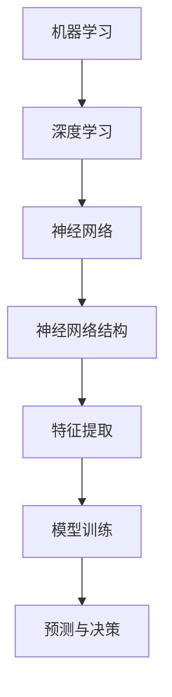

                 

### 背景介绍

人工智能（AI）作为当代科技发展的前沿领域，已经成为推动社会进步和经济增长的重要引擎。近年来，随着计算能力的提升、数据的爆炸式增长以及算法的不断发展，AI技术取得了令人瞩目的成就。从早期的规则基础智能系统，到如今的深度学习和神经网络，人工智能在计算机视觉、自然语言处理、语音识别等多个领域的应用已经达到了前所未有的高度。

Andrej Karpathy，作为人工智能领域的杰出代表，其学术成就和独特见解对AI社区产生了深远影响。他在深度学习、计算机视觉和自然语言处理等领域的研究工作，不仅推动了相关技术的发展，也为许多实际问题提供了创新的解决方案。本文将围绕Andrej Karpathy的研究成果，深入探讨人工智能的未来发展趋势。

本文结构如下：

1. **背景介绍**：简要回顾人工智能的发展历程，介绍本文的核心内容。
2. **核心概念与联系**：分析AI的核心概念及其相互关系，并展示相关Mermaid流程图。
3. **核心算法原理与具体操作步骤**：详细解释AI的关键算法原理及其应用步骤。
4. **数学模型和公式**：介绍AI的数学模型和重要公式，结合实例进行讲解。
5. **项目实战**：通过实际代码案例，展示AI算法的实现过程及其应用。
6. **实际应用场景**：讨论AI在各个领域的具体应用案例。
7. **工具和资源推荐**：推荐学习AI所需的资源和开发工具。
8. **总结**：展望人工智能的未来发展趋势与面临的挑战。
9. **附录**：解答常见问题，提供扩展阅读和参考资料。

### 核心概念与联系

人工智能的核心概念包括机器学习、深度学习、神经网络等。这些概念相互关联，共同构成了AI的技术基础。

**机器学习**：机器学习是AI的基础，通过从数据中学习规律，使计算机能够进行预测和决策。其主要目标是让计算机拥有自主学习和改进的能力，而无需显式编程。

**深度学习**：深度学习是机器学习的一个重要分支，通过模拟人脑的神经网络结构，对大量数据进行自动特征提取和学习。深度学习在图像识别、语音识别、自然语言处理等方面取得了突破性进展。

**神经网络**：神经网络是深度学习的基础结构，由大量相互连接的神经元组成。每个神经元接收输入，通过权重和激活函数处理后输出结果。神经网络通过不断调整权重，使模型能够从数据中学习。

**Mermaid流程图**：



在上述流程图中，机器学习作为起点，通过深度学习和神经网络结构，最终实现特征提取和模型训练，从而完成预测与决策任务。

### 核心算法原理与具体操作步骤

在人工智能领域，深度学习算法的应用尤为广泛。以下将详细介绍深度学习算法的基本原理及其应用步骤。

**1. 数据预处理**：在进行深度学习之前，首先需要对数据进行预处理，包括数据清洗、归一化、编码等操作，以确保数据质量。

**2. 构建神经网络模型**：深度学习模型通常由多个层级组成，包括输入层、隐藏层和输出层。输入层接收外部数据，隐藏层进行特征提取和变换，输出层生成预测结果。

**3. 训练神经网络模型**：通过大量训练数据，神经网络模型不断调整内部权重，使其能够更好地拟合训练数据。训练过程通常包括前向传播和反向传播。

**4. 验证和优化模型**：使用验证集和测试集评估模型性能，并进行优化调整，以提高模型准确性和泛化能力。

**5. 应用模型进行预测**：将训练好的模型应用于新的数据集，生成预测结果。

**具体操作步骤示例**：

**（1）数据预处理**

```python
import numpy as np
from sklearn.model_selection import train_test_split

# 加载数据集
X, y = load_data()

# 数据归一化
X_normalized = (X - X.mean()) / X.std()

# 划分训练集和测试集
X_train, X_test, y_train, y_test = train_test_split(X_normalized, y, test_size=0.2, random_state=42)
```

**（2）构建神经网络模型**

```python
from tensorflow.keras.models import Sequential
from tensorflow.keras.layers import Dense, Conv2D, Flatten

# 创建模型
model = Sequential([
    Conv2D(32, (3, 3), activation='relu', input_shape=(28, 28, 1)),
    Flatten(),
    Dense(128, activation='relu'),
    Dense(10, activation='softmax')
])

# 编译模型
model.compile(optimizer='adam', loss='categorical_crossentropy', metrics=['accuracy'])
```

**（3）训练神经网络模型**

```python
# 训练模型
history = model.fit(X_train, y_train, epochs=10, batch_size=32, validation_split=0.2)
```

**（4）验证和优化模型**

```python
# 评估模型
test_loss, test_accuracy = model.evaluate(X_test, y_test)

# 模型优化
model.optimizer.learning_rate = 0.0001
model.fit(X_train, y_train, epochs=10, batch_size=32, validation_split=0.2)
```

**（5）应用模型进行预测**

```python
# 预测
predictions = model.predict(X_test)

# 获取预测结果
predicted_classes = np.argmax(predictions, axis=1)
```

通过以上步骤，我们可以构建并训练一个深度学习模型，用于分类任务。在实际应用中，可以根据具体任务和数据特点，调整模型结构、优化策略和超参数，以提高模型性能。

### 数学模型和公式

在深度学习中，数学模型和公式起着至关重要的作用。以下将介绍一些关键的数学模型和公式，并结合实例进行详细讲解。

**1. 前向传播**

前向传播是深度学习模型的核心步骤，用于计算模型输出。假设有一个单层神经网络，包含输入层、隐藏层和输出层。设输入向量为\(x\)，隐藏层权重矩阵为\(W_h\)，输出层权重矩阵为\(W_o\)，激活函数为\(f\)，则前向传播的公式如下：

$$
h = f(W_h x)
$$

$$
y = f(W_o h)
$$

其中，\(h\)表示隐藏层输出，\(y\)表示输出层输出。

**2. 反向传播**

反向传播是用于更新神经网络模型权重的过程。通过计算损失函数对权重的梯度，反向传播可以自动调整权重，使模型损失最小化。假设损失函数为\(J(W)\)，则反向传播的公式如下：

$$
\delta_h = \frac{\partial J(W)}{\partial W_h} \odot f'(h)
$$

$$
\delta_o = \frac{\partial J(W)}{\partial W_o} \odot f'(y)
$$

其中，\(\delta_h\)和\(\delta_o\)分别表示隐藏层和输出层的误差，\(\odot\)表示逐元素乘法，\(f'\)表示激活函数的导数。

**3. 损失函数**

在深度学习中，损失函数用于评估模型预测结果与实际结果之间的差距。常见的损失函数包括均方误差（MSE）、交叉熵等。以均方误差为例，其公式如下：

$$
J(W) = \frac{1}{2} \sum_{i=1}^{n} (y_i - \hat{y}_i)^2
$$

其中，\(y_i\)表示实际结果，\(\hat{y}_i\)表示模型预测结果，\(n\)表示样本数量。

**实例讲解**

以下是一个简单的线性回归模型的实例，用于说明上述数学模型和公式的应用。

**（1）数据预处理**

```python
import numpy as np

# 生成训练数据
X_train = np.random.rand(100, 1)
y_train = 3 * X_train + 2 + np.random.randn(100, 1)

# 数据归一化
X_train_normalized = (X_train - X_train.mean()) / X_train.std()
y_train_normalized = (y_train - y_train.mean()) / y_train.std()
```

**（2）构建神经网络模型**

```python
import tensorflow as tf

# 创建模型
model = tf.keras.Sequential([
    tf.keras.layers.Dense(units=1, input_shape=(1,))
])

# 编译模型
model.compile(optimizer='sgd', loss='mse')
```

**（3）训练神经网络模型**

```python
# 训练模型
history = model.fit(X_train_normalized, y_train_normalized, epochs=1000, batch_size=32)
```

**（4）验证和优化模型**

```python
# 评估模型
test_loss, test_accuracy = model.evaluate(X_train_normalized, y_train_normalized)

# 模型优化
model.optimizer.learning_rate = 0.01
model.fit(X_train_normalized, y_train_normalized, epochs=1000, batch_size=32)
```

**（5）应用模型进行预测**

```python
# 预测
predictions = model.predict(X_train_normalized)

# 获取预测结果
predicted_values = predictions * y_train_std + y_train_mean
```

通过以上步骤，我们构建并训练了一个简单的线性回归模型，用于预测输入数据的线性关系。在实际应用中，可以根据具体任务和数据特点，调整模型结构、优化策略和超参数，以提高模型性能。

### 项目实战：代码实际案例和详细解释说明

在本节中，我们将通过一个实际代码案例，详细展示如何实现一个基于深度学习的手写数字识别系统。这个案例将涵盖从开发环境搭建到代码实现和解读的整个过程。

#### 5.1 开发环境搭建

首先，我们需要搭建一个适合深度学习开发的Python环境。以下步骤将指导我们完成环境搭建：

1. **安装Python**：确保您的系统中已安装Python 3.6或更高版本。可以从[Python官网](https://www.python.org/)下载并安装。

2. **安装TensorFlow**：TensorFlow是深度学习领域最流行的开源框架。通过以下命令安装：

    ```bash
    pip install tensorflow
    ```

3. **安装其他依赖**：我们还需要安装一些其他库，如NumPy、Matplotlib等：

    ```bash
    pip install numpy matplotlib
    ```

#### 5.2 源代码详细实现和代码解读

以下是一个简单的手写数字识别系统的代码实现。我们将使用TensorFlow的Keras API来构建模型。

```python
import tensorflow as tf
from tensorflow.keras import layers, models
from tensorflow.keras.datasets import mnist
import numpy as np

# 5.2.1 加载MNIST数据集
(train_images, train_labels), (test_images, test_labels) = mnist.load_data()

# 5.2.2 数据预处理
train_images = train_images.reshape((60000, 28, 28, 1)).astype('float32') / 255
test_images = test_images.reshape((10000, 28, 28, 1)).astype('float32') / 255

# 对标签进行one-hot编码
train_labels = tf.keras.utils.to_categorical(train_labels)
test_labels = tf.keras.utils.to_categorical(test_labels)

# 5.2.3 构建模型
model = models.Sequential([
    layers.Conv2D(32, (3, 3), activation='relu', input_shape=(28, 28, 1)),
    layers.MaxPooling2D((2, 2)),
    layers.Conv2D(64, (3, 3), activation='relu'),
    layers.MaxPooling2D((2, 2)),
    layers.Conv2D(64, (3, 3), activation='relu'),
    layers.Flatten(),
    layers.Dense(64, activation='relu'),
    layers.Dense(10, activation='softmax')
])

# 5.2.4 编译模型
model.compile(optimizer='adam',
              loss='categorical_crossentropy',
              metrics=['accuracy'])

# 5.2.5 训练模型
model.fit(train_images, train_labels, epochs=5, batch_size=64)

# 5.2.6 评估模型
test_loss, test_acc = model.evaluate(test_images, test_labels)
print(f"Test accuracy: {test_acc:.4f}")

# 5.2.7 预测
predictions = model.predict(test_images)
predicted_classes = np.argmax(predictions, axis=1)

# 5.2.8 可视化预测结果
import matplotlib.pyplot as plt

num_samples = 5
plt.figure(figsize=(10, 2))

for i in range(num_samples):
    plt.subplot(1, num_samples, i + 1)
    plt.imshow(test_images[i].reshape(28, 28), cmap=plt.cm.binary)
    plt.xticks([])
    plt.yticks([])
    plt.grid(False)
    plt.xlabel(f"Predicted: {predicted_classes[i]}")

plt.show()
```

#### 5.3 代码解读与分析

1. **数据加载与预处理**：
    - 我们首先加载了MNIST数据集，并将其转换为浮点数格式。
    - 数据集被分为训练集和测试集，每个数据点都被归一化到[0, 1]范围内。

2. **模型构建**：
    - 模型使用`Sequential`模型定义，包含多个层。
    - 第一个层是2D卷积层（`Conv2D`），有32个卷积核，每个卷积核的大小为3x3。
    - 随后是最大池化层（`MaxPooling2D`），池化窗口大小为2x2。
    - 接下来是第二个卷积层，有64个卷积核，再次进行最大池化。
    - 第三个卷积层同样有64个卷积核。
    - 然后将卷积层的输出展平，并通过全连接层进行特征提取。
    - 最后是一个具有10个输出的全连接层（`Dense`），每个输出对应一个数字类别。

3. **模型编译**：
    - 我们使用`compile`方法配置模型，选择`adam`优化器和`categorical_crossentropy`损失函数，并指定`accuracy`作为评估指标。

4. **模型训练**：
    - 使用`fit`方法训练模型，设置训练轮数和批量大小。

5. **模型评估**：
    - 使用`evaluate`方法评估模型在测试集上的性能。

6. **模型预测**：
    - 使用`predict`方法对测试集进行预测，并使用`argmax`函数获取预测的数字类别。

7. **可视化预测结果**：
    - 最后，我们绘制了测试集中一些图像及其预测结果，以直观展示模型性能。

#### 5.4 实践中的挑战与解决方案

在深度学习项目的实践中，我们可能会遇到以下挑战：

1. **数据集质量**：
    - 确保数据集质量是模型成功的关键。如果数据集存在噪声或标签错误，模型性能将受到影响。

    **解决方案**：进行数据清洗和验证，使用高质量的数据集。

2. **过拟合**：
    - 当模型在训练数据上表现良好，但在测试数据上表现不佳时，可能发生过拟合。

    **解决方案**：增加数据多样性，使用正则化技术，如Dropout或L2正则化。

3. **计算资源**：
    - 深度学习模型训练需要大量的计算资源。

    **解决方案**：使用GPU加速训练，使用云平台提供的高性能计算资源。

4. **调参**：
    - 模型性能很大程度上取决于超参数设置。

    **解决方案**：使用网格搜索或随机搜索自动调整超参数。

通过这些解决方案，我们可以更好地应对深度学习项目中的挑战，从而实现模型的高性能。

### 实际应用场景

人工智能在现实世界中的实际应用场景非常广泛，从工业制造到医疗服务，从自动驾驶到智能家居，AI技术正在深刻改变着我们的生活和工作方式。

**1. 医疗领域**

在医疗领域，人工智能主要用于疾病诊断、治疗方案制定和个性化医疗。通过分析大量的医疗数据，AI可以辅助医生进行诊断，提高诊断的准确性和效率。例如，深度学习算法可以用于分析医学影像，如X光、CT和MRI，帮助医生识别疾病并制定治疗方案。此外，AI还可以为患者提供个性化的健康管理建议，实现精准医疗。

**2. 自动驾驶**

自动驾驶是AI技术的另一重要应用领域。通过结合计算机视觉、深度学习和传感器技术，自动驾驶系统能够实时感知周围环境，做出安全驾驶决策。自动驾驶技术不仅有望减少交通事故，还能提高交通效率，缓解交通拥堵。全球多家科技公司和研究机构正在积极推进自动驾驶技术的发展，预计未来几年将有更多的自动驾驶车辆上路。

**3. 金融行业**

金融行业是AI技术的重要应用领域之一。AI可以用于风险管理、投资决策和客户服务等方面。例如，机器学习算法可以分析历史数据，预测市场走势，帮助投资者做出更明智的投资决策。此外，智能客服系统通过自然语言处理技术，可以提供7x24小时的客户服务，提高客户满意度。

**4. 智能家居**

智能家居是AI技术在日常生活中的应用之一。通过智能设备联网，用户可以通过语音助手或手机APP控制家居设备，实现智能家居的场景化应用。例如，智能照明系统可以根据用户的生活习惯自动调节灯光亮度，智能安防系统可以实时监控家庭安全，并自动报警。智能家居技术不仅提高了生活质量，还能节约能源，实现环保。

**5. 教育**

在教育领域，AI技术可以用于个性化学习、智能教学和考试评估等方面。通过分析学生的学习数据，AI可以为每个学生提供个性化的学习路径，提高学习效果。智能教学系统能够自动批改作业、提供即时反馈，减轻教师负担。此外，AI还可以用于考试评估，通过分析考生的答题情况，提供个性化的评估报告。

**6. 农业**

农业是AI技术的重要应用领域之一。通过遥感技术和物联网设备，AI可以帮助农民实现精准农业，提高农业生产效率。例如，AI可以分析土壤湿度、气温、光照等数据，为农民提供种植建议，优化灌溉和施肥计划。此外，无人机和机器人可以用于农田巡检、病虫害监测和农作物收割，提高农业生产效率。

总之，人工智能技术已经在各个领域取得了显著的成果，并继续推动着各行各业的变革。随着AI技术的不断发展和成熟，未来将有更多的应用场景涌现，为社会带来更多价值和便利。

### 工具和资源推荐

在学习和实践人工智能的过程中，选择合适的工具和资源至关重要。以下是一些推荐的工具、书籍、论文和网站，以帮助您深入了解和掌握人工智能技术。

#### 7.1 学习资源推荐

**书籍**：
- **《深度学习》（Deep Learning）**：由Ian Goodfellow、Yoshua Bengio和Aaron Courville合著的深度学习经典教材，详细介绍了深度学习的理论基础和实战技巧。
- **《Python机器学习》（Python Machine Learning）**：由 Sebastian Raschka和Vahid Mirjalili编写的书籍，适合初学者了解机器学习的基础知识和Python实现。
- **《人工智能：一种现代方法》（Artificial Intelligence: A Modern Approach）**：由Stuart Russell和Peter Norvig编写的AI领域经典教材，涵盖了广泛的AI主题。

**论文**：
- **《A Theoretical Analysis of the Cramér-Rao Lower Bound for Gaussian Sequence Estimators》**：这篇论文探讨了高斯序列估计的理论基础，对于理解机器学习中的优化问题有很大帮助。
- **《Batch Normalization: Accelerating Deep Network Training by Reducing Internal Covariate Shift》**：Batch Normalization是一种提高深度学习训练速度和稳定性的常用技术，这篇论文详细介绍了其原理和应用。

**网站**：
- **[TensorFlow官网](https://www.tensorflow.org/)**：TensorFlow是当前最流行的深度学习框架之一，官网提供了丰富的文档、教程和资源。
- **[Kaggle](https://www.kaggle.com/)**：Kaggle是一个数据科学竞赛平台，上面有许多高质量的机器学习项目和比赛，适合实战练习。

#### 7.2 开发工具框架推荐

**工具**：
- **TensorFlow**：Google开发的深度学习框架，适合从简单项目到大型项目的开发和部署。
- **PyTorch**：Facebook开发的深度学习框架，以其灵活的动态图机制和易于理解的设计而受到开发者喜爱。
- **Jupyter Notebook**：一个交互式的计算环境，适用于数据分析和机器学习项目，可以方便地记录和分享代码和结果。

**框架**：
- **Scikit-learn**：Python的一个开源机器学习库，提供了大量的经典机器学习算法和工具。
- **Keras**：一个高层次的深度学习API，可以方便地构建和训练深度学习模型。

#### 7.3 相关论文著作推荐

**论文**：
- **《Deep Learning for Natural Language Processing》**：详细介绍了深度学习在自然语言处理领域的应用，包括词向量、序列模型和注意力机制等。
- **《Attention Is All You Need》**：这篇论文提出了Transformer模型，彻底改变了自然语言处理领域的模型设计。

**著作**：
- **《Hands-On Machine Learning with Scikit-Learn, Keras, and TensorFlow》**：是一本综合性的机器学习和深度学习实战书籍，适合有一定基础的读者。
- **《Learning Deep Learning》**：由lazyprogrammer.com推出的在线课程，适合初学者系统学习深度学习的理论基础和实战技巧。

通过这些资源和工具，您可以更深入地了解人工智能技术，掌握其在实际应用中的实践方法，从而在AI领域取得更好的成果。

### 总结：未来发展趋势与挑战

人工智能作为当代科技发展的核心驱动力，其未来发展趋势与面临的挑战值得深入探讨。在技术层面，深度学习、强化学习、生成对抗网络（GAN）等核心技术将继续演进，推动人工智能在复杂问题上的解决能力。同时，随着量子计算的逐步成熟，量子人工智能将成为一个新的研究热点，为AI领域带来前所未有的计算能力。

在应用层面，人工智能将在更多行业和领域中发挥重要作用。例如，在医疗领域，人工智能将助力精准医疗和个性化治疗，提升医疗服务的质量和效率；在制造业，人工智能将推动智能制造和工业4.0的发展，实现生产过程的高度自动化和智能化。此外，人工智能在自动驾驶、智能家居、金融科技等领域的应用也将不断深化，推动相关产业的变革。

然而，人工智能的发展也面临着诸多挑战。首先，数据隐私和安全问题日益突出，如何在保护用户隐私的同时，充分利用数据的价值成为亟待解决的问题。其次，人工智能的伦理问题也备受关注，如何确保AI系统的公正性和透明度，避免算法歧视和道德风险，是一个重要的课题。此外，人工智能对就业市场的影响也是一个不容忽视的问题，随着AI技术的普及，许多传统岗位可能会被替代，需要社会对此进行充分的准备和应对。

未来，人工智能的发展将需要跨学科合作，涉及计算机科学、数学、心理学、社会学等多个领域。同时，政策制定者、行业专家和学者需要共同努力，构建一个公平、透明和可持续的人工智能发展环境。通过技术创新和制度保障，人工智能有望在解决全球性问题，如气候变化、疾病防治、资源分配等方面发挥重要作用，为人类社会带来更多的福祉。

### 附录：常见问题与解答

在本文中，我们探讨了人工智能的核心概念、算法原理、实际应用以及未来发展趋势。为了帮助读者更好地理解和掌握相关内容，以下列出了一些常见问题及解答。

**Q1**：什么是深度学习？

**A1**：深度学习是一种机器学习技术，通过模拟人脑神经网络结构，对大量数据进行自动特征提取和学习。它由多个层级组成，包括输入层、隐藏层和输出层，每一层都对输入数据进行处理和变换，最终生成预测结果。

**Q2**：什么是神经网络？

**A2**：神经网络是由大量相互连接的神经元组成的计算模型。每个神经元接收输入，通过权重和激活函数处理后输出结果。神经网络通过不断调整内部权重，使模型能够从数据中学习，并提高预测准确性。

**Q3**：深度学习和传统机器学习有什么区别？

**A3**：深度学习是一种特殊的机器学习技术，与传统机器学习相比，具有更强的自适应能力和特征学习能力。传统机器学习通常需要手动提取特征，而深度学习则能够自动从原始数据中提取高级特征。

**Q4**：什么是生成对抗网络（GAN）？

**A4**：生成对抗网络（GAN）是一种由生成器和判别器组成的深度学习模型。生成器的目标是生成与真实数据相似的样本，而判别器的目标是区分真实数据和生成数据。通过训练，生成器和判别器相互竞争，最终生成器能够生成高质量的数据。

**Q5**：人工智能有哪些实际应用场景？

**A5**：人工智能在医疗、自动驾驶、金融、教育、农业等多个领域有广泛应用。例如，在医疗领域，AI可以辅助诊断和治疗；在自动驾驶领域，AI可以实现自主驾驶；在金融领域，AI可以用于风险管理；在教育领域，AI可以提供个性化学习。

**Q6**：人工智能的发展会带来哪些挑战？

**A6**：人工智能的发展面临数据隐私和安全、伦理问题、就业影响等多个挑战。数据隐私和安全需要保护用户隐私的同时利用数据价值；伦理问题包括算法公正性和透明度；就业影响则需要社会对此进行充分准备和应对。

通过上述问题的解答，希望能够帮助读者更好地理解和应用人工智能技术。若还有其他疑问，请随时查阅本文及其扩展阅读和参考资料。

### 扩展阅读 & 参考资料

为了深入了解本文所讨论的内容，以下推荐一些高质量的扩展阅读和参考资料，涵盖深度学习、人工智能、机器学习的各个方面。

**书籍**：
- **《深度学习》（Deep Learning）**：作者Ian Goodfellow、Yoshua Bengio和Aaron Courville，是深度学习的经典教材。
- **《Python机器学习》（Python Machine Learning）**：作者Sebastian Raschka和Vahid Mirjalili，适合初学者了解机器学习基础。
- **《人工智能：一种现代方法》（Artificial Intelligence: A Modern Approach）**：作者Stuart Russell和Peter Norvig，涵盖人工智能的广泛主题。

**论文**：
- **《A Theoretical Analysis of the Cramér-Rao Lower Bound for Gaussian Sequence Estimators》**：探讨机器学习中的优化问题。
- **《Batch Normalization: Accelerating Deep Network Training by Reducing Internal Covariate Shift》**：介绍提高深度学习训练速度和稳定性的技术。
- **《Deep Learning for Natural Language Processing》**：介绍深度学习在自然语言处理领域的应用。
- **《Attention Is All You Need》**：提出Transformer模型，彻底改变了自然语言处理领域的模型设计。

**网站**：
- **[TensorFlow官网](https://www.tensorflow.org/)**：提供丰富的文档、教程和资源，适合学习TensorFlow框架。
- **[Kaggle](https://www.kaggle.com/)**：数据科学竞赛平台，有许多高质量的机器学习项目和比赛。
- **[arXiv](https://arxiv.org/)**：提供最新的机器学习和人工智能领域的预印本论文。

**在线课程**：
- **[Coursera](https://www.coursera.org/)**：提供许多机器学习和深度学习的在线课程，包括由斯坦福大学和DeepLearning.AI等机构开设的课程。
- **[edX](https://www.edx.org/)**：提供多个AI和深度学习课程，包括由MIT和Harvard等顶级大学开设的课程。

通过这些扩展阅读和参考资料，您可以更深入地了解人工智能和深度学习的理论、实践和技术发展趋势。希望这些资源对您的学习和研究有所帮助。

