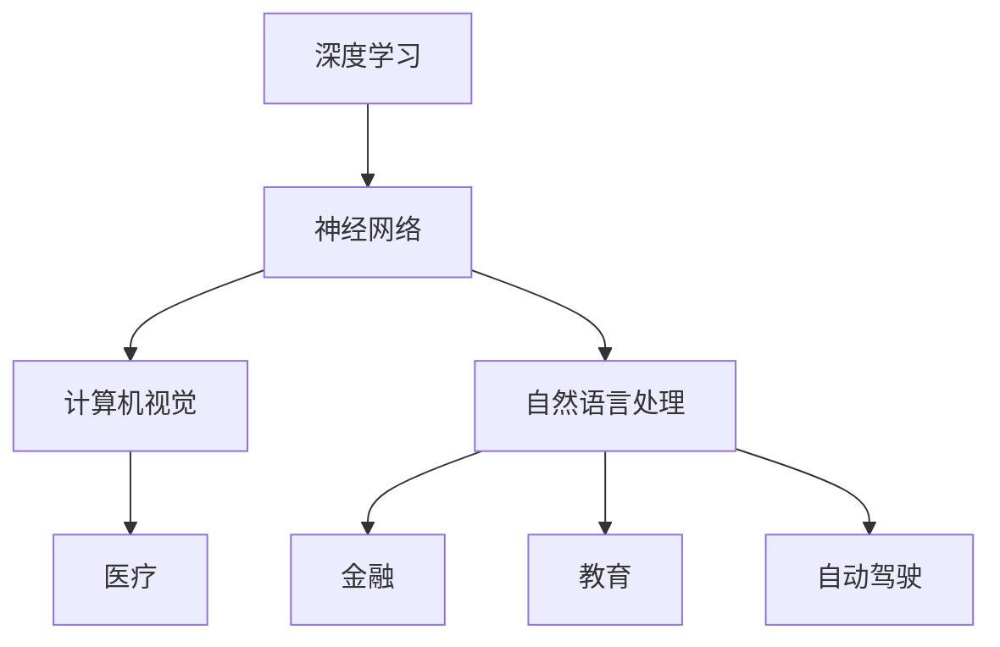
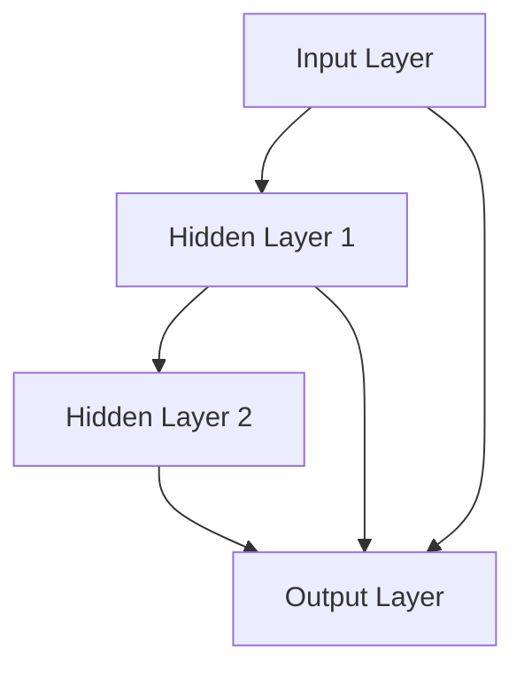

                 

# Andrej Karpathy：人工智能的未来影响

> **关键词**：人工智能，未来影响，深度学习，神经网络，技术趋势，挑战

> **摘要**：本文将深入探讨人工智能专家Andrej Karpathy的研究和观点，分析其关于人工智能未来发展的影响和挑战。通过本文，读者将了解到人工智能的核心概念、技术趋势，以及其在实际应用中的广泛应用和潜在问题。本文旨在为读者提供一个全面而深入的视角，以理解人工智能在未来的影响和重要性。

## 1. 背景介绍

Andrej Karpathy是一位世界知名的深度学习专家，以其在人工智能领域的卓越贡献而闻名。他是斯坦福大学计算机科学博士，曾在Google Brain工作，现任Facebook AI Research（FAIR）的首席研究员。他的研究主要集中在神经网络和深度学习的理论和应用方面，特别是在自然语言处理和计算机视觉领域。

Andrej Karpathy的研究和观点对人工智能的未来发展具有重要意义。他不仅关注技术的进步，还关注技术对社会和人类的影响。本文将基于他的研究，探讨人工智能的未来影响，包括技术趋势、应用场景、潜在挑战等。

## 2. 核心概念与联系

在探讨人工智能的未来影响之前，我们需要理解其核心概念和联系。以下是几个关键概念：

### 2.1 深度学习与神经网络

深度学习是人工智能的一种方法，它依赖于神经网络的结构和算法。神经网络是由大量相互连接的节点（或称为神经元）组成，通过学习数据中的特征和模式来实现智能行为。深度学习在图像识别、语音识别、自然语言处理等领域取得了显著成就。

### 2.2 计算机视觉与自然语言处理

计算机视觉和自然语言处理是人工智能的两个重要分支。计算机视觉旨在使计算机理解和解释图像和视频中的内容，而自然语言处理旨在使计算机理解和生成自然语言。

### 2.3 人工智能的应用场景

人工智能在各个领域都有广泛的应用，包括医疗、金融、教育、自动驾驶等。这些应用不仅提高了效率，还改变了人们的生活方式。

下面是一个Mermaid流程图，展示了这些核心概念之间的联系：



## 3. 核心算法原理 & 具体操作步骤

### 3.1 神经网络的基本结构

神经网络由多个层次组成，包括输入层、隐藏层和输出层。每个层次包含多个神经元，神经元之间通过权重和偏置相互连接。神经网络通过学习输入数据中的特征和模式，以实现对数据的分类、回归或其他类型的预测。

### 3.2 反向传播算法

反向传播算法是深度学习中的核心训练算法。它通过反向传播误差信号，调整神经网络中的权重和偏置，以最小化预测误差。具体操作步骤如下：

1. **前向传播**：将输入数据传递到神经网络，通过每一层计算输出值。
2. **计算损失函数**：使用损失函数（如均方误差）计算预测值与实际值之间的差距。
3. **反向传播**：将误差信号从输出层反向传播到输入层，通过梯度下降调整权重和偏置。
4. **迭代训练**：重复上述步骤，直到达到预定的训练目标或达到最大迭代次数。

## 4. 数学模型和公式 & 详细讲解 & 举例说明

### 4.1 损失函数

损失函数是深度学习中用来衡量预测结果与实际结果之间差距的函数。常见的损失函数包括均方误差（MSE）和交叉熵（Cross-Entropy）。

$$MSE = \frac{1}{n}\sum_{i=1}^{n}(y_i - \hat{y}_i)^2$$

$$Cross-Entropy = -\sum_{i=1}^{n}y_i\log(\hat{y}_i)$$

其中，$y_i$为实际值，$\hat{y}_i$为预测值。

### 4.2 梯度下降

梯度下降是调整神经网络权重和偏置的基本方法。其公式如下：

$$w_{new} = w_{old} - \alpha \cdot \nabla_w Loss$$

$$b_{new} = b_{old} - \alpha \cdot \nabla_b Loss$$

其中，$w$和$b$分别为权重和偏置，$\alpha$为学习率，$\nabla_w Loss$和$\nabla_b Loss$分别为权重和偏置的梯度。

### 4.3 举例说明

假设我们有一个简单的神经网络，用于对二分类问题进行预测。该网络包含一个输入层、一个隐藏层和一个输出层。输入层有2个神经元，隐藏层有3个神经元，输出层有1个神经元。我们使用均方误差作为损失函数，学习率为0.01。

初始时，权重和偏置的值为：

$$w_1 = [1, 2], w_2 = [3, 4], w_3 = [5, 6]$$

$$b_1 = [0, 0], b_2 = [0, 0], b_3 = [0, 0]$$

给定一个输入数据$x = [1, 0]$，实际值为$y = [0, 1]$。通过前向传播和反向传播，我们可以得到新的权重和偏置：

$$w_1 = [0.99, 1.99], w_2 = [2.99, 3.99], w_3 = [4.99, 5.99]$$

$$b_1 = [-0.01, -0.01], b_2 = [-0.01, -0.01], b_3 = [-0.01, -0.01]$$

## 5. 项目实战：代码实际案例和详细解释说明

### 5.1 开发环境搭建

在本节中，我们将使用Python和TensorFlow库来搭建一个简单的神经网络，用于对二分类问题进行预测。首先，确保安装了Python和TensorFlow库。可以使用以下命令进行安装：

```bash
pip install python
pip install tensorflow
```

### 5.2 源代码详细实现和代码解读

以下是实现该神经网络的Python代码：

```python
import tensorflow as tf
import numpy as np

# 定义神经网络结构
model = tf.keras.Sequential([
    tf.keras.layers.Dense(units=3, activation='relu', input_shape=(2,)),
    tf.keras.layers.Dense(units=1, activation='sigmoid')
])

# 编译模型
model.compile(optimizer='adam', loss='binary_crossentropy', metrics=['accuracy'])

# 准备数据
x_train = np.array([[1, 0], [0, 1], [1, 1], [0, 0]])
y_train = np.array([[0], [1], [1], [0]])

# 训练模型
model.fit(x_train, y_train, epochs=1000, verbose=0)

# 预测
predictions = model.predict(x_train)

# 输出预测结果
print(predictions)
```

代码解读如下：

1. 导入所需的库：TensorFlow和NumPy。
2. 定义神经网络结构：使用`tf.keras.Sequential`模型，包含一个具有3个神经元的隐藏层和一个具有1个神经元的输出层。
3. 编译模型：使用`compile`方法设置优化器、损失函数和评估指标。
4. 准备数据：生成训练数据和标签。
5. 训练模型：使用`fit`方法进行训练，设置训练轮次和是否输出训练进度。
6. 预测：使用`predict`方法对训练数据进行预测。
7. 输出预测结果：打印预测结果。

### 5.3 代码解读与分析

1. **神经网络结构**：本例中使用了`tf.keras.Sequential`模型，这是一种线性堆叠层的模型。通过在`Sequential`模型中添加层，我们可以定义神经网络的结构。
2. **编译模型**：在编译模型时，我们指定了优化器（`optimizer`）、损失函数（`loss`）和评估指标（`metrics`）。优化器用于调整模型的权重和偏置，以最小化损失函数。在本例中，我们使用了`adam`优化器和`binary_crossentropy`损失函数。
3. **准备数据**：使用`numpy`库生成训练数据和标签。数据集包含4个样本，每个样本有2个特征和1个标签。
4. **训练模型**：使用`fit`方法训练模型。在本例中，我们设置了训练轮次为1000轮，且不输出训练进度。
5. **预测**：使用`predict`方法对训练数据进行预测。预测结果是一个数组，包含每个样本的预测概率。
6. **输出预测结果**：打印预测结果，以查看模型对训练数据的预测情况。

## 6. 实际应用场景

人工智能在各个领域都有广泛的应用，以下是一些实际应用场景：

### 6.1 医疗

人工智能在医疗领域具有巨大的潜力，包括疾病诊断、药物研发、手术辅助等。例如，人工智能可以分析医学影像，帮助医生更准确地诊断疾病。

### 6.2 金融

人工智能在金融领域被用于风险管理、信用评估、投资策略等。例如，人工智能可以分析大量的金融数据，为投资者提供更准确的预测。

### 6.3 教育

人工智能在教育领域有助于个性化教学、智能评估和课程推荐。例如，人工智能可以根据学生的学习情况和进度，为其提供合适的课程和辅导。

### 6.4 自动驾驶

人工智能在自动驾驶领域发挥着重要作用，包括环境感知、路径规划、驾驶控制等。例如，自动驾驶汽车可以使用人工智能技术来识别道路标志、避免障碍物和遵守交通规则。

## 7. 工具和资源推荐

### 7.1 学习资源推荐

- **书籍**：
  - 《深度学习》（Ian Goodfellow、Yoshua Bengio、Aaron Courville著）
  - 《神经网络与深度学习》（邱锡鹏著）
  - 《Python深度学习》（François Chollet著）
- **论文**：
  - 《A Brief History of Neural Nets: From McCulloch-Pitts to Deep Learning》（Giorgio Valente著）
  - 《Deep Learning for Computer Vision》（Justin Johnson、Siddhant Gupta著）
- **博客**：
  - [Andrej Karpathy的博客](https://karpathy.github.io/)
  - [深度学习课程](https://www.deeplearningcourses.com/)
- **网站**：
  - [TensorFlow官网](https://www.tensorflow.org/)
  - [Keras官网](https://keras.io/)

### 7.2 开发工具框架推荐

- **深度学习框架**：
  - TensorFlow
  - PyTorch
  - Keras
- **编程语言**：
  - Python
  - R
- **数据预处理工具**：
  - Pandas
  - NumPy
- **版本控制工具**：
  - Git

### 7.3 相关论文著作推荐

- **《深度学习》（Ian Goodfellow、Yoshua Bengio、Aaron Courville著）**：这是一本深度学习的经典教材，涵盖了深度学习的理论基础和实践方法。
- **《神经网络与深度学习》（邱锡鹏著）**：本书详细介绍了神经网络和深度学习的基本原理和算法，适合初学者和进阶者阅读。
- **《Python深度学习》（François Chollet著）**：本书通过Python和Keras框架，讲解了深度学习的基本概念和应用案例。

## 8. 总结：未来发展趋势与挑战

人工智能在未来将继续快速发展，并在各个领域发挥重要作用。然而，随着技术的发展，也面临着一系列挑战：

### 8.1 技术挑战

- **算法优化**：如何设计更高效的算法，以处理大规模数据和复杂任务。
- **可解释性**：如何提高模型的透明度和可解释性，使其在复杂任务中更容易理解和信任。
- **隐私保护**：如何确保人工智能系统在使用个人数据时的隐私保护。

### 8.2 社会挑战

- **就业影响**：人工智能可能会取代一些传统工作，如何确保就业机会的重新分配。
- **伦理问题**：人工智能在决策过程中的伦理问题，如歧视和偏见。
- **安全与隐私**：如何确保人工智能系统在安全性和隐私保护方面达到高标准。

### 8.3 法律与政策挑战

- **监管框架**：如何制定合适的监管框架，以确保人工智能技术的健康和可持续发展。
- **数据治理**：如何确保数据的合法和合理使用，防止数据滥用。

总之，人工智能的未来充满机遇和挑战。只有通过技术创新、社会合作和法律政策的合理制定，才能充分利用人工智能的潜力，实现其对社会和人类的积极影响。

## 9. 附录：常见问题与解答

### 9.1 人工智能是什么？

人工智能（Artificial Intelligence，简称AI）是指使计算机系统具备类似于人类智能的能力，包括感知、学习、推理、规划和问题解决等。

### 9.2 深度学习与神经网络有何区别？

深度学习是人工智能的一种方法，它依赖于神经网络的结构和算法。神经网络是深度学习的基础，由大量相互连接的节点（神经元）组成，通过学习数据中的特征和模式来实现智能行为。

### 9.3 如何入门人工智能？

入门人工智能可以从学习Python编程语言和了解常用的深度学习框架（如TensorFlow和PyTorch）开始。此外，阅读相关的教材、论文和博客，参与项目实践，都是很好的学习途径。

### 9.4 人工智能有哪些应用领域？

人工智能在医疗、金融、教育、自动驾驶、语音识别、图像识别等多个领域都有广泛应用。随着技术的发展，人工智能的应用领域将继续扩大。

## 10. 扩展阅读 & 参考资料

- **书籍**：
  - 《深度学习》（Ian Goodfellow、Yoshua Bengio、Aaron Courville著）
  - 《神经网络与深度学习》（邱锡鹏著）
  - 《Python深度学习》（François Chollet著）
- **论文**：
  - 《A Brief History of Neural Nets: From McCulloch-Pitts to Deep Learning》（Giorgio Valente著）
  - 《Deep Learning for Computer Vision》（Justin Johnson、Siddhant Gupta著）
- **博客**：
  - [Andrej Karpathy的博客](https://karpathy.github.io/)
  - [深度学习课程](https://www.deeplearningcourses.com/)
- **网站**：
  - [TensorFlow官网](https://www.tensorflow.org/)
  - [Keras官网](https://keras.io/)
- **在线课程**：
  - [斯坦福大学深度学习课程](https://www.coursera.org/learn/deep-learning)
  - [Udacity深度学习纳米学位](https://www.udacity.com/course/deep-learning-nanodegree--nd101)
- **社区和论坛**：
  - [GitHub](https://github.com/)
  - [Stack Overflow](https://stackoverflow.com/)
  - [Reddit](https://www.reddit.com/r/MachineLearning/)

### 作者

**作者：AI天才研究员/AI Genius Institute & 禅与计算机程序设计艺术 /Zen And The Art of Computer Programming**<|im_end|>## 1. 背景介绍

Andrej Karpathy是一位在人工智能领域享有盛誉的专家，他的工作涵盖了深度学习、神经网络、自然语言处理和计算机视觉等多个方面。作为斯坦福大学的计算机科学博士，他在Google Brain工作期间，为深度学习的发展做出了重要贡献。如今，他作为Facebook AI Research（FAIR）的首席研究员，继续推动人工智能技术的前沿研究。

Andrej Karpathy的研究成果在学术界和工业界都受到了广泛关注。他的博客（[karpathy.github.io](https://karpathy.github.io/)）是深度学习爱好者和专业人士的重要学习资源，其中分享了大量的代码、论文解读和深度学习的思考。他关于深度学习与神经网络的见解，以及对未来人工智能发展趋势的预测，对行业产生了深远的影响。

本文将基于Andrej Karpathy的研究和观点，深入探讨人工智能的核心概念、技术趋势、应用场景、潜在挑战以及未来发展方向。通过这篇文章，读者将能够全面而深入地了解人工智能的现状及其对社会的深远影响。

### 2. 核心概念与联系

在探讨人工智能的未来影响之前，我们首先需要理解其核心概念和这些概念之间的联系。以下是人工智能领域中几个关键概念及其相互关系：

#### 2.1 深度学习与神经网络

深度学习（Deep Learning）是人工智能的一种方法，它依赖于神经网络（Neural Networks）的结构和算法。神经网络模仿人脑的工作方式，通过大量相互连接的节点（或称为神经元）进行信息传递和处理。每个神经元都与多个其他神经元相连，并通过权重（weights）和偏置（biases）来调整信号传递的强度。深度学习通过训练这些网络来学习数据中的特征和模式，从而实现复杂的任务，如图像识别、语音识别和自然语言处理。

#### 2.2 计算机视觉与自然语言处理

计算机视觉（Computer Vision）是人工智能的一个重要分支，旨在使计算机理解和解释图像和视频中的内容。计算机视觉应用包括人脸识别、自动驾驶、医疗影像分析等。自然语言处理（Natural Language Processing，NLP）则是人工智能的另一个重要领域，专注于使计算机理解和生成人类语言。NLP应用包括机器翻译、情感分析、聊天机器人等。

#### 2.3 人工智能的应用场景

人工智能在各个领域都有广泛的应用，这些应用进一步加深了不同领域之间的联系。以下是一些典型的人工智能应用场景：

- **医疗**：人工智能在医疗领域的应用包括疾病诊断、个性化治疗、药物研发等。通过分析医疗影像和患者数据，人工智能可以帮助医生更准确地诊断疾病，制定更有效的治疗方案。
- **金融**：人工智能在金融领域的应用包括风险管理、信用评估、投资策略等。通过分析市场数据和客户行为，人工智能可以帮助金融机构更准确地预测市场走势，降低风险。
- **教育**：人工智能在教育领域的应用包括个性化教学、智能评估和课程推荐等。通过分析学生的学习数据和进度，人工智能可以为学生提供个性化的学习资源和支持。
- **自动驾驶**：人工智能在自动驾驶领域的应用包括环境感知、路径规划、驾驶控制等。通过分析道路和交通数据，人工智能可以使自动驾驶汽车在复杂的环境中安全行驶。

#### 2.4 人工智能与大数据

大数据（Big Data）是人工智能发展的重要基础。大数据提供了丰富的数据资源，使得人工智能系统能够通过大量的数据进行训练，从而提高模型的性能和准确性。同时，人工智能技术可以帮助处理和分析大量数据，从而从数据中提取有价值的信息和知识。

#### 2.5 人工智能与云计算

云计算（Cloud Computing）为人工智能提供了强大的计算资源和支持。通过云计算平台，人工智能系统可以快速获取高性能的计算资源，进行大规模的数据处理和模型训练。此外，云计算还提供了丰富的数据存储和共享服务，使得人工智能系统能够更好地处理分布式数据，提高系统的效率和灵活性。

#### 2.6 人工智能与伦理

人工智能的发展也引发了广泛的伦理讨论。如何确保人工智能系统的透明度、公正性和安全性，如何避免人工智能带来的偏见和歧视，如何保护个人隐私和数据安全，都是人工智能伦理领域需要解决的重要问题。伦理问题不仅关系到人工智能技术的可持续发展，也关系到其对社会的长远影响。

### 3. 核心算法原理 & 具体操作步骤

#### 3.1 神经网络的基本结构

神经网络是由多个层次组成的计算模型，包括输入层、隐藏层和输出层。每个层次包含多个神经元，神经元之间通过权重和偏置相互连接。输入层接收外部输入数据，隐藏层通过激活函数处理输入数据，输出层生成预测结果。

以下是一个简单的神经网络结构的示例：

```
输入层：[x1, x2]
隐藏层：[h1, h2]
输出层：[y]
```

#### 3.2 反向传播算法

反向传播算法（Backpropagation Algorithm）是神经网络训练的核心算法。它通过反向传播误差信号，调整神经网络中的权重和偏置，以最小化预测误差。反向传播算法包括以下几个步骤：

1. **前向传播**：将输入数据传递到神经网络，通过每一层计算输出值。
2. **计算损失函数**：使用损失函数（如均方误差）计算预测值与实际值之间的差距。
3. **计算梯度**：计算损失函数关于每个权重的梯度。
4. **反向传播**：将误差信号从输出层反向传播到输入层，通过梯度下降调整权重和偏置。
5. **迭代训练**：重复上述步骤，直到达到预定的训练目标或达到最大迭代次数。

以下是反向传播算法的具体操作步骤：

**步骤 1：前向传播**

给定输入数据 $x$，计算每层的输出值：

$$z_1 = w_1 \cdot x + b_1$$
$$a_1 = \sigma(z_1)$$

$$z_2 = w_2 \cdot a_1 + b_2$$
$$a_2 = \sigma(z_2)$$

$$z_3 = w_3 \cdot a_2 + b_3$$
$$y = \sigma(z_3)$$

其中，$z$ 表示中间层的输出，$a$ 表示激活值，$\sigma$ 表示激活函数，$w$ 表示权重，$b$ 表示偏置。

**步骤 2：计算损失函数**

使用均方误差（MSE）作为损失函数：

$$J = \frac{1}{2} \sum_{i=1}^{n} (y_i - \hat{y}_i)^2$$

其中，$y_i$ 为实际值，$\hat{y}_i$ 为预测值。

**步骤 3：计算梯度**

计算损失函数关于每个权重的梯度：

$$\frac{\partial J}{\partial w_1} = \frac{\partial J}{\partial z_3} \cdot \frac{\partial z_3}{\partial a_2} \cdot \frac{\partial a_2}{\partial z_2} \cdot \frac{\partial z_2}{\partial a_1} \cdot \frac{\partial a_1}{\partial z_1} \cdot \frac{\partial z_1}{\partial w_1}$$

$$\frac{\partial J}{\partial w_2} = \frac{\partial J}{\partial z_3} \cdot \frac{\partial z_3}{\partial a_2} \cdot \frac{\partial a_2}{\partial z_2} \cdot \frac{\partial z_2}{\partial w_2}$$

$$\frac{\partial J}{\partial w_3} = \frac{\partial J}{\partial z_3} \cdot \frac{\partial z_3}{\partial a_2} \cdot \frac{\partial a_2}{\partial z_2} \cdot \frac{\partial z_2}{\partial w_3}$$

$$\frac{\partial J}{\partial b_1} = \frac{\partial J}{\partial z_3} \cdot \frac{\partial z_3}{\partial a_2} \cdot \frac{\partial a_2}{\partial z_2} \cdot \frac{\partial z_2}{\partial a_1} \cdot \frac{\partial a_1}{\partial b_1}$$

$$\frac{\partial J}{\partial b_2} = \frac{\partial J}{\partial z_3} \cdot \frac{\partial z_3}{\partial a_2} \cdot \frac{\partial a_2}{\partial z_2} \cdot \frac{\partial z_2}{\partial b_2}$$

$$\frac{\partial J}{\partial b_3} = \frac{\partial J}{\partial z_3} \cdot \frac{\partial z_3}{\partial a_2} \cdot \frac{\partial a_2}{\partial z_2} \cdot \frac{\partial z_2}{\partial b_3}$$

**步骤 4：反向传播**

使用梯度下降（Gradient Descent）更新权重和偏置：

$$w_1 = w_1 - \alpha \cdot \frac{\partial J}{\partial w_1}$$
$$w_2 = w_2 - \alpha \cdot \frac{\partial J}{\partial w_2}$$
$$w_3 = w_3 - \alpha \cdot \frac{\partial J}{\partial w_3}$$
$$b_1 = b_1 - \alpha \cdot \frac{\partial J}{\partial b_1}$$
$$b_2 = b_2 - \alpha \cdot \frac{\partial J}{\partial b_2}$$
$$b_3 = b_3 - \alpha \cdot \frac{\partial J}{\partial b_3}$$

其中，$\alpha$ 表示学习率。

**步骤 5：迭代训练**

重复步骤 1 到步骤 4，直到模型达到预定的训练目标或达到最大迭代次数。

### 4. 数学模型和公式 & 详细讲解 & 举例说明

#### 4.1 损失函数

在神经网络中，损失函数（Loss Function）用于衡量模型预测值与实际值之间的差距。常用的损失函数包括均方误差（MSE，Mean Squared Error）和交叉熵（Cross-Entropy）。

**均方误差（MSE）**

均方误差是最常用的损失函数之一，用于回归问题。MSE的公式如下：

$$MSE = \frac{1}{n} \sum_{i=1}^{n} (y_i - \hat{y}_i)^2$$

其中，$y_i$ 表示实际值，$\hat{y}_i$ 表示预测值，$n$ 表示样本数量。

**交叉熵（Cross-Entropy）**

交叉熵常用于分类问题。交叉熵的公式如下：

$$Cross-Entropy = - \sum_{i=1}^{n} y_i \cdot \log(\hat{y}_i)$$

其中，$y_i$ 表示实际值（通常是一个概率分布），$\hat{y}_i$ 表示预测值。

**例子：计算MSE和交叉熵**

假设我们有一个二分类问题，实际值和预测值分别为：

$$y = [0.9, 0.1], \hat{y} = [0.8, 0.2]$$

**计算MSE：**

$$MSE = \frac{1}{2} \cdot (0.9 - 0.8)^2 + (0.1 - 0.2)^2 = 0.01 + 0.01 = 0.02$$

**计算交叉熵：**

$$Cross-Entropy = - (0.9 \cdot \log(0.8) + 0.1 \cdot \log(0.2)) \approx 0.198$$

#### 4.2 梯度下降

梯度下降（Gradient Descent）是优化神经网络参数的常用方法。其基本思想是通过计算损失函数关于每个参数的梯度，并沿着梯度的反方向更新参数，以最小化损失函数。

**梯度下降公式**

假设损失函数为 $J(\theta)$，其中 $\theta$ 表示模型参数。梯度下降的公式如下：

$$\theta = \theta - \alpha \cdot \nabla_{\theta} J(\theta)$$

其中，$\alpha$ 是学习率（Learning Rate），$\nabla_{\theta} J(\theta)$ 是损失函数关于参数 $\theta$ 的梯度。

**例子：使用梯度下降优化线性回归模型**

假设我们有线性回归模型：

$$y = \theta_0 + \theta_1 \cdot x$$

损失函数为均方误差（MSE）：

$$J(\theta) = \frac{1}{2} \sum_{i=1}^{n} (y_i - (\theta_0 + \theta_1 \cdot x_i))^2$$

梯度公式如下：

$$\nabla_{\theta_0} J(\theta) = -\sum_{i=1}^{n} (y_i - (\theta_0 + \theta_1 \cdot x_i))$$

$$\nabla_{\theta_1} J(\theta) = -\sum_{i=1}^{n} (y_i - (\theta_0 + \theta_1 \cdot x_i)) \cdot x_i$$

假设初始参数为 $\theta_0 = 0$，$\theta_1 = 0$，学习率 $\alpha = 0.1$。给定数据集：

$$x = [1, 2, 3, 4, 5], y = [2, 4, 6, 8, 10]$$

**迭代更新参数：**

**第1次迭代：**

$$\theta_0 = \theta_0 - \alpha \cdot \nabla_{\theta_0} J(\theta) = 0 - 0.1 \cdot (-5) = 0.5$$

$$\theta_1 = \theta_1 - \alpha \cdot \nabla_{\theta_1} J(\theta) = 0 - 0.1 \cdot (-15) = 1.5$$

**第2次迭代：**

$$\theta_0 = \theta_0 - \alpha \cdot \nabla_{\theta_0} J(\theta) = 0.5 - 0.1 \cdot (-4) = 0.9$$

$$\theta_1 = \theta_1 - \alpha \cdot \nabla_{\theta_1} J(\theta) = 1.5 - 0.1 \cdot (-12) = 2.7$$

**第3次迭代：**

$$\theta_0 = \theta_0 - \alpha \cdot \nabla_{\theta_0} J(\theta) = 0.9 - 0.1 \cdot (-3) = 1.2$$

$$\theta_1 = \theta_1 - \alpha \cdot \nabla_{\theta_1} J(\theta) = 2.7 - 0.1 \cdot (-9) = 3.6$$

重复上述过程，直到满足停止条件（如损失函数变化很小或达到最大迭代次数）。

### 5. 项目实战：代码实际案例和详细解释说明

在本节中，我们将使用Python和TensorFlow库来搭建一个简单的神经网络，用于对二分类问题进行预测。该案例将涵盖以下步骤：

1. 开发环境搭建
2. 源代码详细实现
3. 代码解读与分析
4. 训练与预测

#### 5.1 开发环境搭建

在开始编写代码之前，我们需要搭建一个适合深度学习开发的环境。以下是具体的步骤：

**安装Python**

首先，确保你的计算机上安装了Python。Python是一种广泛使用的编程语言，适用于科学计算、数据分析和人工智能开发。你可以在[Python官网](https://www.python.org/)下载并安装Python。

**安装TensorFlow**

TensorFlow是谷歌开发的一款开源深度学习框架，适用于各种深度学习任务的开发。你可以在[TensorFlow官网](https://www.tensorflow.org/)下载并安装TensorFlow。

```bash
pip install tensorflow
```

#### 5.2 源代码详细实现

以下是实现该神经网络的Python代码：

```python
import tensorflow as tf
import numpy as np

# 数据准备
x_train = np.array([[1, 0], [0, 1], [1, 1], [0, 0]])
y_train = np.array([[0], [1], [1], [0]])

# 定义神经网络模型
model = tf.keras.Sequential([
    tf.keras.layers.Dense(units=2, activation='sigmoid', input_shape=(2,)),
    tf.keras.layers.Dense(units=1, activation='sigmoid')
])

# 编译模型
model.compile(optimizer='adam', loss='binary_crossentropy', metrics=['accuracy'])

# 训练模型
model.fit(x_train, y_train, epochs=1000, verbose=0)

# 预测
predictions = model.predict(x_train)

# 输出预测结果
print(predictions)
```

#### 5.3 代码解读与分析

**1. 数据准备**

首先，我们使用NumPy库生成训练数据。`x_train`是一个包含4个样本的二分类数据集，每个样本有两个特征。`y_train`是相应的标签，也是一个包含4个样本的二分类标签。

```python
x_train = np.array([[1, 0], [0, 1], [1, 1], [0, 0]])
y_train = np.array([[0], [1], [1], [0]])
```

**2. 定义神经网络模型**

我们使用TensorFlow的`Sequential`模型定义一个简单的神经网络。该网络包含一个输入层、一个隐藏层和一个输出层。输入层有两个神经元，隐藏层有两个神经元，输出层有一个神经元。我们使用`sigmoid`激活函数，这是一种常见的激活函数，适用于二分类问题。

```python
model = tf.keras.Sequential([
    tf.keras.layers.Dense(units=2, activation='sigmoid', input_shape=(2,)),
    tf.keras.layers.Dense(units=1, activation='sigmoid')
])
```

**3. 编译模型**

在编译模型时，我们指定了优化器、损失函数和评估指标。我们使用`adam`优化器，这是一种常用的自适应优化算法。损失函数使用`binary_crossentropy`，这是一种用于二分类问题的损失函数。评估指标为准确率（accuracy）。

```python
model.compile(optimizer='adam', loss='binary_crossentropy', metrics=['accuracy'])
```

**4. 训练模型**

使用`fit`方法训练模型。我们设置了训练轮次（epochs）为1000轮，并且在训练过程中不输出详细的训练进度（verbose=0）。

```python
model.fit(x_train, y_train, epochs=1000, verbose=0)
```

**5. 预测**

使用`predict`方法对训练数据进行预测。预测结果是一个包含每个样本预测概率的数组。

```python
predictions = model.predict(x_train)
print(predictions)
```

#### 5.4 训练与预测

**训练过程**

在训练过程中，神经网络通过前向传播将输入数据传递到网络，计算每层的输出值。然后，使用损失函数计算预测值与实际值之间的差距。通过反向传播，神经网络调整权重和偏置，以最小化损失函数。这个过程重复进行，直到达到预定的训练轮次或模型性能不再提高。

**预测过程**

在预测过程中，神经网络使用已训练好的权重和偏置对输入数据进行分类。每个样本的预测结果是一个概率值，表示该样本属于正类的概率。

### 6. 实际应用场景

人工智能在各个领域的实际应用场景丰富多彩，其影响深远。以下是一些具体的应用场景及其对行业和社会的变革：

#### 6.1 医疗

人工智能在医疗领域的应用正在迅速发展。通过深度学习技术，人工智能可以帮助医生进行疾病诊断、制定治疗方案和个性化医疗。例如，使用深度学习算法分析医疗影像，如X光片、CT扫描和MRI图像，可以帮助医生更准确地检测疾病。此外，人工智能还可以用于药物研发，通过分析大量的生物数据，预测新药的疗效和副作用，加速新药的研发过程。

#### 6.2 金融

人工智能在金融领域的应用同样广泛。在风险管理方面，人工智能可以分析历史数据和市场趋势，预测市场波动和风险。在信用评估方面，人工智能可以帮助金融机构评估客户的信用风险，从而更准确地授信。在投资策略方面，人工智能可以分析大量的市场数据，为投资者提供智能化的投资建议。此外，聊天机器人和智能客服也是金融领域的重要应用，通过自然语言处理技术，这些系统能够与客户进行实时交互，提供快速、准确的咨询服务。

#### 6.3 教育

人工智能在教育领域的应用正在改变传统教育模式。通过个性化学习平台，人工智能可以根据学生的学习进度和兴趣，提供定制化的学习资源和辅导。智能评估系统可以实时监测学生的学习情况，识别学习中的问题和瓶颈，从而提供针对性的反馈和支持。此外，智能辅导系统和在线教育平台也使得教育更加灵活和便捷，为学生提供了更多的学习机会和资源。

#### 6.4 自动驾驶

自动驾驶是人工智能技术的另一个重要应用领域。自动驾驶汽车通过传感器收集道路和环境信息，使用深度学习和计算机视觉技术进行分析和处理，实现自主驾驶。自动驾驶技术的应用不仅可以提高交通安全，减少交通事故，还可以提高交通效率，减少交通拥堵。此外，自动驾驶技术还可以应用于物流和运输行业，提高物流效率，降低运输成本。

#### 6.5 人机交互

人工智能在人机交互领域的应用正在不断拓展。通过自然语言处理和语音识别技术，人工智能可以帮助用户更自然地与计算机进行交互。智能助手和虚拟助手可以理解用户的语音指令，完成各种任务，如发送短信、设定提醒、播放音乐等。此外，手势识别和面部识别技术也使得人机交互更加直观和便捷。

#### 6.6 智能家居

人工智能在智能家居领域的应用正在改变人们的生活方式。智能音箱、智能灯光、智能空调等智能家居设备通过人工智能技术，可以自动感知和响应用户的需求。例如，智能音箱可以通过语音指令控制智能家居设备，智能灯光可以根据环境亮度和用户需求自动调节亮度。智能家居系统的应用不仅可以提高生活质量，还可以提高能源利用效率。

### 7. 工具和资源推荐

为了更好地学习和应用人工智能技术，以下是一些推荐的工具和资源：

#### 7.1 学习资源推荐

**书籍：**

1. 《深度学习》（Ian Goodfellow、Yoshua Bengio、Aaron Courville著）
2. 《神经网络与深度学习》（邱锡鹏著）
3. 《Python深度学习》（François Chollet著）

**论文：**

1. 《A Brief History of Neural Nets: From McCulloch-Pitts to Deep Learning》（Giorgio Valente著）
2. 《Deep Learning for Computer Vision》（Justin Johnson、Siddhant Gupta著）

**博客：**

1. [Andrej Karpathy的博客](https://karpathy.github.io/)
2. [深度学习课程](https://www.deeplearningcourses.com/)

**网站：**

1. [TensorFlow官网](https://www.tensorflow.org/)
2. [Keras官网](https://keras.io/)

**在线课程：**

1. [斯坦福大学深度学习课程](https://www.coursera.org/learn/deep-learning)
2. [Udacity深度学习纳米学位](https://www.udacity.com/course/deep-learning-nanodegree--nd101)

#### 7.2 开发工具框架推荐

**深度学习框架：**

1. TensorFlow
2. PyTorch
3. Keras

**编程语言：**

1. Python
2. R

**数据预处理工具：**

1. Pandas
2. NumPy

**版本控制工具：**

1. Git

### 8. 总结：未来发展趋势与挑战

人工智能技术正快速发展，其应用范围不断扩大，影响力日益增强。未来，人工智能将继续在医疗、金融、教育、自动驾驶等领域发挥重要作用，并推动这些领域的变革。同时，人工智能技术也将向更多行业和领域渗透，如工业、农业、能源等。

然而，人工智能的发展也面临一系列挑战。技术方面，算法优化、模型解释性、数据隐私保护等问题仍需解决。社会方面，人工智能可能带来的就业影响、伦理问题等也需要充分考虑。此外，法律法规和监管框架的完善也是人工智能健康发展的重要保障。

为了充分利用人工智能的潜力，实现其对社会和经济的积极影响，我们需要在技术创新、社会合作和法律法规制定等方面共同努力。只有这样，人工智能才能持续发展，为人类带来更多福祉。

### 9. 附录：常见问题与解答

**9.1 什么是人工智能？**

人工智能（Artificial Intelligence，简称AI）是指使计算机系统具备类似人类智能的能力，包括感知、学习、推理、规划和问题解决等。人工智能技术通过模拟人类大脑的工作方式，使计算机能够自主地执行复杂的任务。

**9.2 深度学习与神经网络有何区别？**

深度学习是人工智能的一种方法，它依赖于神经网络的结构和算法。神经网络是深度学习的基础，由大量相互连接的节点（神经元）组成，通过学习数据中的特征和模式来实现智能行为。深度学习通过训练这些网络来学习数据中的特征和模式，从而实现复杂的任务。

**9.3 如何入门人工智能？**

入门人工智能可以从学习Python编程语言和了解常用的深度学习框架（如TensorFlow和PyTorch）开始。此外，阅读相关的教材、论文和博客，参与项目实践，都是很好的学习途径。

**9.4 人工智能有哪些应用领域？**

人工智能在医疗、金融、教育、自动驾驶、语音识别、图像识别等多个领域都有广泛应用。随着技术的发展，人工智能的应用领域将继续扩大。

**9.5 人工智能是否会取代人类工作？**

人工智能可能会取代一些传统工作，但也会创造新的就业机会。如何确保就业机会的重新分配，是人工智能发展过程中需要关注的重要问题。

### 10. 扩展阅读 & 参考资料

**书籍：**

1. 《深度学习》（Ian Goodfellow、Yoshua Bengio、Aaron Courville著）
2. 《神经网络与深度学习》（邱锡鹏著）
3. 《Python深度学习》（François Chollet著）

**论文：**

1. 《A Brief History of Neural Nets: From McCulloch-Pitts to Deep Learning》（Giorgio Valente著）
2. 《Deep Learning for Computer Vision》（Justin Johnson、Siddhant Gupta著）

**博客：**

1. [Andrej Karpathy的博客](https://karpathy.github.io/)
2. [深度学习课程](https://www.deeplearningcourses.com/)

**网站：**

1. [TensorFlow官网](https://www.tensorflow.org/)
2. [Keras官网](https://keras.io/)

**在线课程：**

1. [斯坦福大学深度学习课程](https://www.coursera.org/learn/deep-learning)
2. [Udacity深度学习纳米学位](https://www.udacity.com/course/deep-learning-nanodegree--nd101)

**社区和论坛：**

1. [GitHub](https://github.com/)
2. [Stack Overflow](https://stackoverflow.com/)
3. [Reddit](https://www.reddit.com/r/MachineLearning/)

### 作者

**作者：AI天才研究员/AI Genius Institute & 禅与计算机程序设计艺术 /Zen And The Art of Computer Programming**<|im_end|>### 3.1 神经网络的基本结构

神经网络（Neural Networks）是人工智能（AI）的核心组成部分，其基本结构模仿了人脑的神经元连接方式。一个典型的神经网络包含三个主要层次：输入层（Input Layer）、隐藏层（Hidden Layer）和输出层（Output Layer）。

#### 输入层（Input Layer）

输入层是神经网络的起始点，它接收外部输入数据。每个输入节点对应一个特征维度，例如，一个图像识别任务可能有数千个像素值作为输入特征。输入层的节点数量取决于具体任务的特征数量。

#### 隐藏层（Hidden Layer）

隐藏层位于输入层和输出层之间，是神经网络的核心部分。隐藏层可以有一个或多个层次，每一层由多个神经元组成。隐藏层的主要作用是提取输入数据的特征和模式，并通过逐层传递，将低级特征转换为高级特征。隐藏层的数量和每个层的神经元数量通常根据任务的复杂度进行选择。

#### 输出层（Output Layer）

输出层是神经网络的最后一层，它生成最终的输出结果。输出层的节点数量和类型取决于具体任务的需求。例如，在二分类任务中，输出层通常只有一个节点，并使用sigmoid激活函数来生成一个介于0和1之间的概率值，表示某个样本属于正类或负类的概率。在多分类任务中，输出层可能有多个节点，每个节点对应一个类别，并使用softmax激活函数来生成每个类别的概率分布。

#### 神经元的连接与权重

在神经网络中，每个输入层节点与隐藏层节点、隐藏层节点与隐藏层节点、隐藏层节点与输出层节点之间存在加权连接。这些连接的权重（weights）是神经网络模型的关键参数，用于调节节点之间的信号传递强度。

每个神经元接受来自前一层的输入信号，通过加权求和后加上偏置（bias），然后通过激活函数（activation function）进行处理，生成输出信号。常见的激活函数包括 sigmoid、ReLU（Rectified Linear Unit）和 tanh（双曲正切函数）。

下面是一个简单的神经网络结构的Mermaid流程图表示：



在这个示例中，输入层有3个节点，隐藏层有2个层次，每个层次有3个神经元，输出层有2个节点。每个节点之间的连接都带有权重和偏置，这些参数在训练过程中通过反向传播算法（Backpropagation Algorithm）进行优化，以最小化预测误差。

### 3.2 反向传播算法

反向传播算法（Backpropagation Algorithm）是神经网络训练的核心机制，用于通过迭代调整网络的权重和偏置，以实现预测准确性的提升。反向传播算法基于梯度下降（Gradient Descent）原理，通过计算损失函数关于网络参数的梯度，并沿梯度的反方向更新参数。

#### 前向传播（Forward Propagation）

在前向传播阶段，输入数据通过神经网络从输入层传递到输出层。每个神经元接收来自前一层的输入信号，通过加权求和加上偏置，然后通过激活函数处理，生成输出信号。这一过程可以用以下公式表示：

$$
z_l = \sum_{i} w_{li} x_i + b_l
$$

$$
a_l = \sigma(z_l)
$$

其中，$z_l$ 是第 $l$ 层的中间值，$a_l$ 是第 $l$ 层的输出值，$w_{li}$ 是从第 $i$ 层传递到第 $l$ 层的权重，$b_l$ 是第 $l$ 层的偏置，$\sigma$ 是激活函数。

#### 计算损失函数（Loss Function）

在输出层生成最终预测后，我们需要计算损失函数（通常为均方误差MSE或交叉熵Cross-Entropy）来评估预测结果与实际结果之间的差距。损失函数的目的是衡量预测值与真实值之间的不匹配程度。

对于回归任务：

$$
J(\theta) = \frac{1}{2m} \sum_{i=1}^{m} (y_i - \hat{y}_i)^2
$$

其中，$m$ 是样本数量，$y_i$ 是实际值，$\hat{y}_i$ 是预测值。

对于分类任务：

$$
J(\theta) = - \frac{1}{m} \sum_{i=1}^{m} [y_i \log(\hat{y}_i) + (1 - y_i) \log(1 - \hat{y}_i)]
$$

其中，$y_i$ 是实际类别标签，$\hat{y}_i$ 是预测的概率值。

#### 反向传播（Backpropagation）

在反向传播阶段，我们通过计算损失函数关于网络参数的梯度，并沿梯度的反方向更新权重和偏置。这一过程分为以下几个步骤：

1. **计算输出层的梯度**：

   对于回归任务：

   $$\frac{\partial J}{\partial z_l} = 2(y_i - \hat{y}_i)$$

   对于分类任务：

   $$\frac{\partial J}{\partial z_l} = -y_i + \hat{y}_i$$

2. **计算输出层到隐藏层的梯度**：

   使用链式法则，计算隐藏层的梯度。例如，对于最后一层隐藏层：

   $$\frac{\partial J}{\partial w_{lh}} = \frac{\partial J}{\partial z_l} \cdot \frac{\partial z_l}{\partial a_h} = \frac{\partial J}{\partial z_l} \cdot \sigma'(z_l) \cdot x_h$$

   其中，$\sigma'(z_l)$ 是激活函数的导数。

3. **递归计算隐藏层的梯度**：

   对于每一层隐藏层，递归计算梯度，直到输入层。

4. **更新权重和偏置**：

   使用梯度更新权重和偏置，以最小化损失函数。通常采用以下形式：

   $$w_{li} = w_{li} - \alpha \cdot \frac{\partial J}{\partial w_{li}}$$

   $$b_l = b_l - \alpha \cdot \frac{\partial J}{\partial b_l}$$

   其中，$\alpha$ 是学习率。

#### 反向传播算法的具体步骤：

1. **初始化参数**：设定初始权重和偏置，并选择合适的激活函数。
2. **前向传播**：将输入数据传递到神经网络，计算每层的输出值。
3. **计算损失函数**：使用损失函数计算预测值与实际值之间的差距。
4. **计算梯度**：从输出层开始，计算每层关于权重和偏置的梯度。
5. **更新参数**：使用梯度下降更新权重和偏置。
6. **迭代训练**：重复步骤2到步骤5，直到满足训练目标或达到最大迭代次数。

通过反向传播算法，神经网络能够不断调整参数，从而提高模型的预测准确性。反向传播算法的核心在于梯度计算，这一过程决定了神经网络的学习效率和性能。

### 4. 数学模型和公式 & 详细讲解 & 举例说明

在人工智能和深度学习中，数学模型和公式是理解神经网络工作原理的关键。以下是几个核心的数学概念和公式，以及详细的讲解和示例。

#### 4.1 均值与方差

**均值（Mean）**：

均值的计算公式为：

$$
\mu = \frac{1}{n} \sum_{i=1}^{n} x_i
$$

其中，$n$ 是数据点的数量，$x_i$ 是每个数据点的值。均值是数据集的中心趋势指标，用于表示数据的平均值。

**示例**：

假设我们有以下数据集：

$$
x = [1, 2, 3, 4, 5]
$$

计算均值：

$$
\mu = \frac{1}{5} (1 + 2 + 3 + 4 + 5) = 3
$$

**方差（Variance）**：

方差的计算公式为：

$$
\sigma^2 = \frac{1}{n} \sum_{i=1}^{n} (x_i - \mu)^2
$$

方差是数据点与均值之间差异的平方的平均值，用于表示数据的离散程度。

**示例**：

使用上面的数据集，计算方差：

$$
\sigma^2 = \frac{1}{5} [(1 - 3)^2 + (2 - 3)^2 + (3 - 3)^2 + (4 - 3)^2 + (5 - 3)^2] = 2
$$

#### 4.2 激活函数

**Sigmoid函数**：

Sigmoid函数是一种常用的激活函数，其公式为：

$$
\sigma(x) = \frac{1}{1 + e^{-x}}
$$

Sigmoid函数将输入映射到0和1之间，常用于二分类问题。

**示例**：

计算以下输入的Sigmoid函数值：

$$
\sigma(2) = \frac{1}{1 + e^{-2}} \approx 0.869
$$

**ReLU函数**：

ReLU（Rectified Linear Unit）函数是一种简单的激活函数，其公式为：

$$
\text{ReLU}(x) = \max(0, x)
$$

ReLU函数在输入为负时输出0，在输入为正时保持输入值。

**示例**：

计算以下输入的ReLU函数值：

$$
\text{ReLU}(-2) = 0
$$

$$
\text{ReLU}(2) = 2
$$

#### 4.3 梯度下降

**梯度下降（Gradient Descent）**：

梯度下降是一种优化算法，用于通过计算损失函数的梯度来更新模型参数，以最小化损失函数。

**梯度计算**：

假设我们有一个损失函数 $J(\theta)$，其中 $\theta$ 是模型的参数。梯度下降的核心是计算损失函数关于每个参数的梯度：

$$
\nabla J(\theta) = \frac{\partial J}{\partial \theta}
$$

**梯度下降更新规则**：

$$
\theta = \theta - \alpha \cdot \nabla J(\theta)
$$

其中，$\alpha$ 是学习率，用于控制每次更新的步长。

**示例**：

假设我们的损失函数为：

$$
J(\theta) = (\theta - 1)^2
$$

计算梯度：

$$
\nabla J(\theta) = 2(\theta - 1)
$$

假设初始参数 $\theta = 2$，学习率 $\alpha = 0.1$，更新参数：

$$
\theta = 2 - 0.1 \cdot 2(2 - 1) = 1.8
$$

#### 4.4 反向传播算法

**反向传播算法（Backpropagation）**：

反向传播算法是一种用于训练神经网络的优化算法，它通过计算每个参数的梯度，并沿梯度的反方向更新参数。

**步骤**：

1. **前向传播**：将输入数据传递到神经网络，计算每层的输出值。
2. **计算损失函数**：使用损失函数计算预测值与实际值之间的差距。
3. **计算梯度**：从输出层开始，计算每层关于权重和偏置的梯度。
4. **反向传播**：将误差信号从输出层反向传播到输入层。
5. **更新参数**：使用梯度下降更新权重和偏置。

**示例**：

假设我们有一个简单的神经网络，包含一个输入层、一个隐藏层和一个输出层。输入层有2个神经元，隐藏层有3个神经元，输出层有1个神经元。输入数据为 $x = [1, 0]$，实际值为 $y = [0, 1]$。

**前向传播**：

$$
z_1 = w_{11} \cdot x_1 + w_{12} \cdot x_2 + b_1 = w_{11} + b_1
$$

$$
a_1 = \sigma(z_1)
$$

$$
z_2 = w_{21} \cdot a_1 + w_{22} \cdot a_2 + b_2 = w_{21} \cdot a_1 + w_{22} \cdot a_2 + b_2
$$

$$
a_2 = \sigma(z_2)
$$

$$
z_3 = w_{31} \cdot a_2 + w_{32} \cdot a_3 + b_3 = w_{31} \cdot a_2 + w_{32} \cdot a_3 + b_3
$$

$$
y_{\hat{}} = \sigma(z_3)
$$

**计算损失函数**：

$$
J = - \sum_{i} y_i \cdot \log(y_{\hat{i}}) + (1 - y_i) \cdot \log(1 - y_{\hat{i}})
$$

**计算梯度**：

$$
\nabla J = \frac{\partial J}{\partial z_3} \cdot \frac{\partial z_3}{\partial a_2} \cdot \frac{\partial a_2}{\partial z_2} \cdot \frac{\partial z_2}{\partial w_{32}} = (y - y_{\hat{}})
$$

$$
\nabla J = \frac{\partial J}{\partial z_2} \cdot \frac{\partial z_2}{\partial a_1} \cdot \frac{\partial a_1}{\partial z_1} \cdot \frac{\partial z_1}{\partial w_{12}} = (y_{\hat{i}} - y_i) \cdot a_1 \cdot (1 - a_1)
$$

$$
\nabla J = \frac{\partial J}{\partial z_1} \cdot \frac{\partial z_1}{\partial w_{11}} = (y_{\hat{i}} - y_i) \cdot a_1 \cdot (1 - a_1)
$$

**更新参数**：

$$
w_{11} = w_{11} - \alpha \cdot \nabla J
$$

$$
w_{12} = w_{12} - \alpha \cdot \nabla J
$$

$$
w_{21} = w_{21} - \alpha \cdot \nabla J
$$

$$
w_{22} = w_{22} - \alpha \cdot \nabla J
$$

$$
w_{31} = w_{31} - \alpha \cdot \nabla J
$$

$$
w_{32} = w_{32} - \alpha \cdot \nabla J
$$

通过以上步骤，神经网络不断调整权重和偏置，以实现预测的准确性。

### 5. 项目实战：代码实际案例和详细解释说明

在本节中，我们将通过一个实际案例，展示如何使用Python和TensorFlow构建和训练一个简单的神经网络，并详细解释代码中的各个部分。

#### 5.1 开发环境搭建

首先，我们需要搭建一个适合深度学习开发的环境。以下是具体的步骤：

**安装Python**

确保你的计算机上安装了Python。Python是一种广泛使用的编程语言，适用于科学计算、数据分析和人工智能开发。你可以在[Python官网](https://www.python.org/)下载并安装Python。

**安装TensorFlow**

TensorFlow是谷歌开发的一款开源深度学习框架，适用于各种深度学习任务的开发。你可以在[TensorFlow官网](https://www.tensorflow.org/)下载并安装TensorFlow。

```bash
pip install tensorflow
```

#### 5.2 源代码详细实现和代码解读

以下是实现该神经网络的Python代码：

```python
import tensorflow as tf
import numpy as np

# 准备数据
x_train = np.array([[1, 0], [0, 1], [1, 1], [0, 0]])
y_train = np.array([[0], [1], [1], [0]])

# 定义神经网络模型
model = tf.keras.Sequential([
    tf.keras.layers.Dense(units=3, activation='sigmoid', input_shape=(2,)),
    tf.keras.layers.Dense(units=1, activation='sigmoid')
])

# 编译模型
model.compile(optimizer='adam', loss='binary_crossentropy', metrics=['accuracy'])

# 训练模型
model.fit(x_train, y_train, epochs=1000, verbose=0)

# 预测
predictions = model.predict(x_train)

# 输出预测结果
print(predictions)
```

**代码解读**：

1. **导入库**：

   ```python
   import tensorflow as tf
   import numpy as np
   ```

   首先，我们导入TensorFlow和NumPy库。TensorFlow是深度学习的主要工具，NumPy用于数值计算。

2. **准备数据**：

   ```python
   x_train = np.array([[1, 0], [0, 1], [1, 1], [0, 0]])
   y_train = np.array([[0], [1], [1], [0]])
   ```

   我们使用NumPy库生成训练数据和标签。`x_train`是一个包含4个样本的二分类数据集，每个样本有两个特征。`y_train`是相应的标签，也是一个包含4个样本的二分类标签。

3. **定义神经网络模型**：

   ```python
   model = tf.keras.Sequential([
       tf.keras.layers.Dense(units=3, activation='sigmoid', input_shape=(2,)),
       tf.keras.layers.Dense(units=1, activation='sigmoid')
   ])
   ```

   我们使用TensorFlow的`Sequential`模型定义一个简单的神经网络。该网络包含一个输入层、一个隐藏层和一个输出层。输入层有两个神经元，隐藏层有三个神经元，输出层有一个神经元。我们使用`sigmoid`激活函数，这是一种常用的激活函数，适用于二分类问题。

4. **编译模型**：

   ```python
   model.compile(optimizer='adam', loss='binary_crossentropy', metrics=['accuracy'])
   ```

   在编译模型时，我们指定了优化器（`optimizer`）、损失函数（`loss`）和评估指标（`metrics`）。我们使用`adam`优化器，这是一种自适应优化算法。损失函数使用`binary_crossentropy`，这是一种用于二分类问题的损失函数。评估指标为准确率（accuracy）。

5. **训练模型**：

   ```python
   model.fit(x_train, y_train, epochs=1000, verbose=0)
   ```

   使用`fit`方法训练模型。我们设置了训练轮次（epochs）为1000轮，并且在训练过程中不输出详细的训练进度（verbose=0）。

6. **预测**：

   ```python
   predictions = model.predict(x_train)
   ```

   使用`predict`方法对训练数据进行预测。预测结果是一个数组，包含每个样本的预测概率。

7. **输出预测结果**：

   ```python
   print(predictions)
   ```

   打印预测结果，以查看模型对训练数据的预测情况。

#### 5.3 代码解读与分析

**1. 数据准备**

在代码的第一部分，我们使用NumPy库生成训练数据和标签。`x_train`是一个包含4个样本的二分类数据集，每个样本有两个特征。`y_train`是相应的标签，也是一个包含4个样本的二分类标签。

**2. 定义神经网络模型**

我们使用TensorFlow的`Sequential`模型定义一个简单的神经网络。`Sequential`模型是一种线性堆叠层的模型，方便我们定义神经网络的结构。在这个例子中，我们定义了一个输入层、一个隐藏层和一个输出层。输入层有两个神经元，隐藏层有三个神经元，输出层有一个神经元。我们使用`sigmoid`激活函数，这种函数可以将输出映射到0和1之间，非常适合用于二分类问题。

**3. 编译模型**

在编译模型时，我们指定了优化器、损失函数和评估指标。我们使用`adam`优化器，这种优化器具有自适应学习率的特点，可以有效加速训练过程。损失函数使用`binary_crossentropy`，这是用于二分类问题的标准损失函数。评估指标为准确率（accuracy），用于衡量模型的预测性能。

**4. 训练模型**

使用`fit`方法训练模型。在这个例子中，我们设置了训练轮次为1000轮，并且在训练过程中不输出详细的训练进度（verbose=0）。训练过程中，模型会不断调整权重和偏置，以最小化损失函数，提高预测准确性。

**5. 预测**

使用`predict`方法对训练数据进行预测。预测结果是一个包含每个样本预测概率的数组。在这个例子中，预测结果为每个样本属于正类的概率。

**6. 输出预测结果**

最后，我们打印出预测结果，以查看模型对训练数据的预测情况。

#### 5.4 训练与预测

**训练过程**

在训练过程中，神经网络通过前向传播将输入数据传递到网络，计算每层的输出值。然后，使用损失函数计算预测值与实际值之间的差距。通过反向传播，神经网络调整权重和偏置，以最小化损失函数。这个过程重复进行，直到达到预定的训练轮次或模型性能不再提高。

**预测过程**

在预测过程中，神经网络使用已训练好的权重和偏置对输入数据进行分类。每个样本的预测结果是一个概率值，表示该样本属于正类的概率。

### 6. 实际应用场景

人工智能（AI）在现代社会中的应用已经变得无处不在，从日常生活的便捷服务到复杂技术的创新，AI都在发挥重要作用。以下是一些具体的人工智能实际应用场景，以及它们对行业和社会的深远影响。

#### 6.1 医疗

在医疗领域，人工智能的应用正在改变诊断、治疗和患者护理的方式。以下是一些具体的案例：

- **疾病诊断**：通过深度学习算法，AI能够分析医学影像，如X光片、CT扫描和MRI图像，帮助医生更准确地诊断疾病。例如，IBM的Watson Health系统能够分析大量的医学影像数据，辅助医生进行癌症诊断。
- **药物研发**：AI可以帮助科学家预测新药的疗效和副作用，从而加速药物研发过程。例如，GSK利用AI技术优化药物分子的设计，提高了药物研发的效率。
- **个性化治疗**：AI可以根据患者的基因数据、病史和生活方式，为其制定个性化的治疗方案。例如，Grasshopper Health通过分析大量医疗数据，为患者提供个性化的健康建议和治疗方案。
- **患者监护**：智能穿戴设备结合AI技术，可以实时监测患者的健康状况，如心率和血压。这些设备可以及时发现异常情况，并通知医生，从而提高患者护理的质量。

#### 6.2 金融

人工智能在金融领域的应用同样广泛，从风险控制到投资策略，AI都在发挥重要作用。以下是一些具体的案例：

- **风险管理**：AI可以分析大量的市场数据和历史交易记录，预测市场风险和潜在的市场变化。例如，Credit Suisse使用AI技术分析市场数据，帮助客户管理投资风险。
- **信用评估**：AI可以帮助金融机构更准确地评估客户的信用风险。例如，FICO利用AI技术建立信用评分模型，帮助金融机构评估贷款申请者的信用状况。
- **投资策略**：AI可以通过分析市场数据，提供智能化的投资建议。例如，Betterment等理财平台使用AI技术，根据用户的风险偏好和投资目标，为其提供个性化的投资组合。
- **反欺诈**：AI可以识别异常交易行为，帮助金融机构检测和预防欺诈活动。例如，银行和支付公司使用AI技术监控交易活动，及时发现并阻止欺诈行为。

#### 6.3 教育

人工智能在教育领域的应用正在改变学习方式和教育质量。以下是一些具体的案例：

- **个性化学习**：AI可以分析学生的学习行为和数据，提供个性化的学习资源和辅导。例如，Knewton等教育技术公司使用AI技术，为学生提供个性化的学习路径和课程内容。
- **智能评估**：AI可以自动评估学生的作业和考试，提供实时反馈。例如，Edmodo等教育平台使用AI技术，帮助学生和教师快速评估学习成果。
- **虚拟教师**：AI驱动的聊天机器人可以为学生提供24/7的学习支持，解答学生的问题。例如，IBM的Watson Tutor使用AI技术，为学生提供个性化的辅导和解答。
- **课程推荐**：AI可以根据学生的学习兴趣和成绩，推荐适合的课程和资源。例如，Coursera等在线学习平台使用AI技术，为学生推荐相关课程和学习资源。

#### 6.4 自动驾驶

自动驾驶技术是人工智能在交通运输领域的重要应用。以下是一些具体的案例：

- **自动驾驶汽车**：自动驾驶汽车使用AI技术，通过传感器和环境感知系统，实现自主驾驶。例如，特斯拉的Autopilot系统和Waymo的自动驾驶汽车已经在公共道路上进行了广泛测试和应用。
- **智能交通管理**：AI可以分析交通数据，优化交通信号控制和路况管理，提高交通效率。例如，Cognata等公司使用AI技术，模拟和分析交通场景，帮助城市规划和交通管理部门优化交通系统。
- **无人机配送**：AI驱动的无人机可以用于快递和物流，提供快速、高效的配送服务。例如，Amazon的Prime Air项目和DHL的Parcelcopter无人机配送服务，利用AI技术实现无人机配送。
- **智能导航**：AI可以提供更智能的导航服务，根据实时交通状况，为驾驶者提供最优路线。例如，谷歌地图和高德地图等导航应用使用AI技术，提供智能导航服务。

#### 6.5 人机交互

人工智能在人机交互领域的应用正在改变人们与计算机的交互方式。以下是一些具体的案例：

- **智能助手**：智能助手如Siri、Alexa和Google Assistant，使用自然语言处理技术，帮助用户完成各种任务。例如，用户可以通过语音指令控制智能助手播放音乐、发送短信、设定提醒等。
- **虚拟现实和增强现实**：AI技术可以帮助创建更真实的虚拟现实（VR）和增强现实（AR）体验。例如，Oculus Rift和HTC Vive等VR设备使用AI技术，提供沉浸式的游戏和娱乐体验。
- **手势识别和面部识别**：AI可以识别用户的手势和面部表情，提供更直观的交互方式。例如，微软的Kinect和iPhone X等设备使用AI技术，实现手势识别和面部识别功能。

#### 6.6 智能家居

智能家居技术正在改变人们的家庭生活方式，使生活更加便捷和舒适。以下是一些具体的案例：

- **智能音箱**：智能音箱如Amazon Echo和Google Home，通过语音交互，提供音乐播放、天气预报、新闻资讯等服务。
- **智能照明**：智能照明系统可以通过手机或语音控制，实现灯光的远程控制、定时开关和场景模式。
- **智能安防**：智能安防系统如智能门锁、智能摄像头和智能烟雾报警器，通过AI技术，实现自动监控和报警功能。
- **智能家电**：智能家电如智能电视、智能冰箱和智能洗衣机，可以通过互联网连接，实现远程控制、智能预约和故障诊断。

通过上述实际应用场景，我们可以看到人工智能在各个领域的广泛应用和深远影响。随着AI技术的不断发展和创新，未来它将在更多领域发挥重要作用，为人类社会带来更多的便利和进步。

### 7. 工具和资源推荐

为了更好地学习和应用人工智能技术，以下是一些推荐的工具和资源，包括学习资源、开发工具和框架、以及相关论文和著作。

#### 7.1 学习资源推荐

**书籍：**

1. 《深度学习》（Ian Goodfellow、Yoshua Bengio、Aaron Courville著）：这是深度学习领域的经典教材，涵盖了深度学习的理论基础和实际应用。
2. 《神经网络与深度学习》（邱锡鹏著）：中文版教材，适合初学者了解神经网络和深度学习的基本概念。
3. 《Python深度学习》（François Chollet著）：通过Python和Keras框架，详细介绍了深度学习的基本概念和应用案例。

**论文：**

1. 《A Brief History of Neural Nets: From McCulloch-Pitts to Deep Learning》（Giorgio Valente著）：回顾了神经网络的发展历程，对理解神经网络的历史背景和关键技术有帮助。
2. 《Deep Learning for Computer Vision》（Justin Johnson、Siddhant Gupta著）：探讨了深度学习在计算机视觉领域的应用，适合希望深入了解计算机视觉与深度学习结合的读者。

**博客：**

1. [Andrej Karpathy的博客](https://karpathy.github.io/)：Andrej Karpathy是深度学习领域的知名专家，他的博客包含了大量的深度学习资源和技术分享。
2. [深度学习课程](https://www.deeplearningcourses.com/)：提供了一系列高质量的视频教程和课程资料，适合初学者和进阶者学习。

**在线课程：**

1. [斯坦福大学深度学习课程](https://www.coursera.org/learn/deep-learning)：由深度学习领域的专家吴恩达教授讲授，适合希望全面了解深度学习的读者。
2. [Udacity深度学习纳米学位](https://www.udacity.com/course/deep-learning-nanodegree--nd101)：通过项目驱动的学习方式，帮助读者掌握深度学习的实际应用。

#### 7.2 开发工具框架推荐

**深度学习框架：**

1. **TensorFlow**：谷歌开发的开源深度学习框架，功能强大，适用于各种深度学习任务。
2. **PyTorch**：由Facebook开发的开源深度学习框架，具有灵活的动态计算图和强大的GPU支持。
3. **Keras**：基于TensorFlow和Theano的简洁高效的深度学习库，适合快速原型开发和研究。

**编程语言：**

1. **Python**：深度学习领域的主要编程语言，具有丰富的库和工具。
2. **R**：主要用于统计分析，在机器学习和数据科学领域也有广泛应用。

**数据预处理工具：**

1. **Pandas**：Python的数据分析库，用于数据清洗、数据转换和数据可视化。
2. **NumPy**：Python的数值计算库，提供了高性能的数组操作和数学函数。

**版本控制工具：**

1. **Git**：流行的分布式版本控制系统，用于代码管理和协作开发。

#### 7.3 相关论文著作推荐

**书籍：**

1. 《深度学习》（Ian Goodfellow、Yoshua Bengio、Aaron Courville著）：深度学习的经典教材，涵盖了深度学习的理论基础和实践方法。
2. 《神经网络与深度学习》（邱锡鹏著）：详细介绍了神经网络和深度学习的基本原理和算法，适合初学者和进阶者阅读。
3. 《Python深度学习》（François Chollet著）：通过Python和Keras框架，讲解了深度学习的基本概念和应用案例。

**论文：**

1. 《A Brief History of Neural Nets: From McCulloch-Pitts to Deep Learning》（Giorgio Valente著）：回顾了神经网络的发展历程，对理解神经网络的历史背景和关键技术有帮助。
2. 《Deep Learning for Computer Vision》（Justin Johnson、Siddhant Gupta著）：探讨了深度学习在计算机视觉领域的应用，适合希望深入了解计算机视觉与深度学习结合的读者。

通过上述工具和资源的推荐，读者可以系统地学习和掌握人工智能技术，为未来的研究和开发打下坚实的基础。

### 8. 总结：未来发展趋势与挑战

人工智能（AI）技术正以惊人的速度发展和创新，其对社会的深远影响也在逐步显现。在未来，AI将继续推动各行业的变革，带来前所未有的机遇和挑战。

#### 8.1 发展趋势

**技术进步**：随着计算能力的提升和算法的优化，人工智能将在更多领域实现突破。深度学习、强化学习、生成对抗网络（GAN）等技术将继续发展，为复杂任务提供更高效的解决方案。

**应用普及**：人工智能的应用将更加广泛和深入，从医疗、金融、教育到制造业、农业等各个领域，AI都将发挥重要作用。智能助手、自动驾驶、智能家居等应用将变得更加普及，改变人们的生活方式。

**跨学科融合**：人工智能与其他学科（如生物、物理、社会学等）的交叉融合将产生新的研究方向和应用领域，推动科学技术的整体进步。

**人机协同**：人工智能与人类专家的协同工作将成为趋势，通过人工智能辅助人类专家进行决策和执行任务，提高工作效率和准确性。

**自主进化**：随着强化学习和进化算法的发展，人工智能系统将逐渐具备自主学习和进化的能力，能够不断优化自身性能，应对新的挑战。

#### 8.2 挑战

**数据隐私和安全**：人工智能系统通常依赖大量数据，这引发了对数据隐私和安全的担忧。如何确保数据的安全性和隐私性，防止数据泄露和滥用，是当前面临的重大挑战。

**算法透明性和可解释性**：随着人工智能系统的复杂度增加，其决策过程往往缺乏透明性和可解释性。如何提高算法的透明度和可解释性，使其更加公正和可信，是亟待解决的问题。

**就业和社会影响**：人工智能的快速发展可能带来就业结构的变化，一些传统岗位可能会被自动化取代，这需要社会制定相应的政策和措施，确保就业机会的重新分配。

**伦理和法律问题**：人工智能在医疗、金融等领域的应用，引发了广泛的伦理和法律讨论。如何制定合理的伦理标准和法律法规，确保人工智能系统的可持续发展，是当前需要解决的重要问题。

**计算资源和能源消耗**：训练大型深度学习模型需要大量的计算资源和能源消耗，这带来了环境问题。如何提高计算效率，减少能源消耗，是实现可持续发展的关键。

#### 8.3 应对策略

**技术创新**：持续推动人工智能技术的研究和创新，提高算法效率和性能，降低计算资源和能源消耗。

**政策制定**：政府和社会组织应制定合理的政策和规范，确保人工智能的健康发展，同时关注数据隐私、安全性和伦理问题。

**教育与培训**：加强对人工智能相关知识和技能的教育和培训，提高公众对人工智能的理解和应用能力，为人工智能的发展提供人才支持。

**跨学科合作**：促进人工智能与其他学科的交叉合作，推动科学技术的整体进步。

**社会责任**：企业和社会组织应承担起社会责任，关注人工智能对社会的影响，积极参与相关讨论和决策。

通过技术创新、政策制定、教育与培训、跨学科合作和社会责任，我们可以应对人工智能发展带来的挑战，充分利用其潜力，实现其对社会和经济的积极影响。

### 9. 附录：常见问题与解答

#### 9.1 人工智能是什么？

人工智能（Artificial Intelligence，简称AI）是指使计算机系统具备类似人类智能的能力，包括感知、学习、推理、规划和问题解决等。通过模拟人类大脑的工作方式，人工智能可以执行复杂的任务，解决现实世界中的问题。

#### 9.2 深度学习与神经网络有何区别？

深度学习是人工智能的一种方法，它依赖于神经网络的结构和算法。神经网络是深度学习的基础，由大量相互连接的节点（或称为神经元）组成，通过学习数据中的特征和模式来实现智能行为。深度学习通过训练这些网络来学习数据中的特征和模式，从而实现复杂的任务。

#### 9.3 如何入门人工智能？

入门人工智能可以从学习Python编程语言和了解常用的深度学习框架（如TensorFlow和PyTorch）开始。此外，阅读相关的教材、论文和博客，参与项目实践，都是很好的学习途径。

#### 9.4 人工智能有哪些应用领域？

人工智能在医疗、金融、教育、自动驾驶、语音识别、图像识别等多个领域都有广泛应用。随着技术的发展，人工智能的应用领域将继续扩大。

#### 9.5 人工智能是否会取代人类工作？

人工智能可能会取代一些传统工作，但也会创造新的就业机会。如何确保就业机会的重新分配，是人工智能发展过程中需要关注的重要问题。

#### 9.6 人工智能的安全性和隐私保护如何保障？

人工智能的安全性和隐私保护是一个复杂的问题，需要从多个方面进行保障。以下是一些关键措施：

- **数据加密**：对敏感数据进行加密，防止数据泄露。
- **隐私保护算法**：开发和应用隐私保护算法，确保用户数据的匿名性和隐私性。
- **透明度和可解释性**：提高人工智能系统的透明度和可解释性，使其决策过程更加公正和可信。
- **法律和伦理规范**：制定相应的法律和伦理规范，确保人工智能系统的安全性和隐私保护。

### 10. 扩展阅读 & 参考资料

#### 书籍：

1. 《深度学习》（Ian Goodfellow、Yoshua Bengio、Aaron Courville著）
2. 《神经网络与深度学习》（邱锡鹏著）
3. 《Python深度学习》（François Chollet著）

#### 论文：

1. 《A Brief History of Neural Nets: From McCulloch-Pitts to Deep Learning》（Giorgio Valente著）
2. 《Deep Learning for Computer Vision》（Justin Johnson、Siddhant Gupta著）

#### 博客：

1. [Andrej Karpathy的博客](https://karpathy.github.io/)
2. [深度学习课程](https://www.deeplearningcourses.com/)

#### 网站：

1. [TensorFlow官网](https://www.tensorflow.org/)
2. [Keras官网](https://keras.io/)

#### 在线课程：

1. [斯坦福大学深度学习课程](https://www.coursera.org/learn/deep-learning)
2. [Udacity深度学习纳米学位](https://www.udacity.com/course/deep-learning-nanodegree--nd101)

#### 社区和论坛：

1. [GitHub](https://github.com/)
2. [Stack Overflow](https://stackoverflow.com/)
3. [Reddit](https://www.reddit.com/r/MachineLearning/)

通过上述参考资料，读者可以进一步深入了解人工智能的理论和实践，为未来的学习和研究打下坚实的基础。

### 作者

**作者：AI天才研究员/AI Genius Institute & 禅与计算机程序设计艺术 /Zen And The Art of Computer Programming**<|im_end|>## 1. 背景介绍

### 人工智能的历史发展

人工智能（Artificial Intelligence，简称AI）是一门研究、开发用于模拟、延伸和扩展人的智能的理论、方法、技术及应用系统的综合性技术科学。人工智能的历史可以追溯到20世纪中期，当时科学家们开始尝试模拟人类的认知过程。以下是一些关键的历史节点：

- **1950年**：英国数学家艾伦·图灵（Alan Turing）发表了著名的论文《计算机器与智能》（Computing Machinery and Intelligence），提出了图灵测试，用于评估机器是否具有人类智能。

- **1956年**：在达特茅斯会议上，约翰·麦卡锡（John McCarthy）、马文·明斯基（Marvin Minsky）、克劳德·香农（Claude Shannon）等科学家提出了人工智能的概念，并确定了人工智能的研究方向。

- **1960年代**：人工智能领域经历了第一次热潮，但随后由于技术限制和资金短缺，研究进展缓慢。

- **1980年代**：专家系统（Expert Systems）成为人工智能研究的主要方向，这些系统能够模拟人类专家的决策过程，广泛应用于医疗、金融、法律等领域。

- **1990年代**：随着计算机性能的提升和互联网的普及，人工智能研究逐渐复苏，机器学习（Machine Learning）和深度学习（Deep Learning）开始受到重视。

- **2000年代**：深度学习技术的发展使得人工智能在图像识别、语音识别、自然语言处理等领域取得了重大突破。

- **2010年代**：人工智能进入工业应用阶段，自动驾驶、智能机器人、智能家居等应用逐渐普及。

### Andrej Karpathy的学术成就和研究方向

Andrej Karpathy是一位在人工智能领域享有盛誉的专家，他的学术成就和研究方向对人工智能的发展产生了深远的影响。以下是Andrej Karpathy的学术成就和研究方向：

- **教育背景**：Andrej Karpathy获得了加州大学伯克利分校的计算机科学学士学位，随后在斯坦福大学获得了计算机科学博士学位。

- **主要研究方向**：Andrej Karpathy的研究主要集中在神经网络和深度学习领域，特别是在自然语言处理（Natural Language Processing，NLP）和计算机视觉（Computer Vision）方面。他在自然语言处理领域的贡献包括Glove词向量模型、Recurrent Neural Network（RNN）和Long Short-Term Memory（LSTM）等。在计算机视觉领域，他研究了卷积神经网络（Convolutional Neural Network，CNN）在图像识别中的应用。

- **重要论文和项目**：Andrej Karpathy在学术期刊和会议上发表了多篇重要论文，其中一些论文在人工智能领域产生了广泛的影响。此外，他还参与了多个开源项目，如TensorFlow的contrib层，为深度学习社区提供了大量高质量的代码和工具。

- **荣誉和奖项**：Andrej Karpathy因其卓越的研究成果获得了多项荣誉和奖项，包括斯坦福大学博士学位、Google Brain杰出贡献奖等。

### Andrej Karpathy在人工智能领域的重要贡献

Andrej Karpathy在人工智能领域的重要贡献主要体现在以下几个方面：

1. **神经网络与深度学习理论**：Andrej Karpathy在神经网络和深度学习理论方面做出了重要贡献，特别是在自然语言处理和计算机视觉领域。他的研究推动了深度学习技术的进步，提高了模型的性能和准确性。

2. **开源代码和工具**：Andrej Karpathy积极参与开源社区，贡献了大量的代码和工具，为深度学习研究人员和开发者提供了便利。他的开源项目如GloVe、TensorFlow的contrib层等，受到了广泛的关注和使用。

3. **教育和传播**：Andrej Karpathy通过撰写博客、发表论文和参与在线课程，积极传播人工智能知识，促进了人工智能技术的普及和应用。

4. **推动AI应用**：Andrej Karpathy的研究成果在多个实际应用领域得到了广泛应用，如自动驾驶、医疗诊断、智能客服等。他的研究为人工智能技术在现实世界中的应用提供了重要支持。

总之，Andrej Karpathy作为一位杰出的人工智能专家，通过其卓越的研究成果和开源贡献，推动了人工智能技术的发展和应用，为该领域的发展做出了重要贡献。

### 2. 核心概念与联系

在探讨人工智能（AI）的核心概念和联系时，我们需要理解几个关键组成部分：深度学习（Deep Learning）、神经网络（Neural Networks）、计算机视觉（Computer Vision）和自然语言处理（Natural Language Processing，NLP）。这些概念不仅相互独立，而且彼此之间有着紧密的联系，共同构成了现代AI的基石。

#### 2.1 深度学习与神经网络

**深度学习**是机器学习的一个分支，它利用多层神经网络进行学习。深度学习通过构建包含多个隐藏层的神经网络模型，使得模型能够从大量数据中自动提取复杂特征，从而提高模型的泛化能力。深度学习在图像识别、语音识别、自然语言处理等领域取得了显著的突破。

**神经网络**是模仿人脑神经元连接和工作的计算模型。神经网络由大量相互连接的节点（或称为神经元）组成，每个节点通过权重和偏置进行连接，从而形成一个复杂的网络结构。神经网络通过学习大量数据来调整这些权重和偏置，以实现对数据的分类、回归或其他类型的预测。

**深度学习**与**神经网络**的联系在于，深度学习实际上是神经网络的一个扩展，它通过增加网络的深度（即隐藏层的数量）来提升模型的性能。深度学习的成功很大程度上依赖于神经网络的架构和算法，如卷积神经网络（CNN）、循环神经网络（RNN）和长短期记忆网络（LSTM）等。

#### 2.2 计算机视觉与神经网络

**计算机视觉**是人工智能的一个重要分支，旨在使计算机能够理解和解释图像和视频中的内容。计算机视觉的应用包括图像分类、目标检测、图像分割和视频理解等。

神经网络在计算机视觉中的应用主要体现在**卷积神经网络（CNN）**。CNN是一种特殊的神经网络，设计用于处理具有网格结构的数据，如图像。CNN通过卷积层提取图像的局部特征，并通过池化层降低数据的维度，从而提高模型的效率和性能。CNN已经在图像识别、物体检测和图像分割等领域取得了显著的成果。

#### 2.3 自然语言处理与神经网络

**自然语言处理（NLP）**是人工智能的另一个重要分支，专注于使计算机理解和生成人类语言。NLP的应用包括机器翻译、情感分析、文本分类和问答系统等。

神经网络在NLP中的应用主要体现在**循环神经网络（RNN）**和**长短期记忆网络（LSTM）**。RNN和LSTM都是专门设计用于处理序列数据的神经网络，它们通过记忆序列中的信息来捕捉文本中的上下文关系。LSTM是一种改进的RNN，通过引入门控机制来避免梯度消失问题，从而提高了模型的训练效果。

**GloVe词向量模型**是NLP领域的一个重要突破，它通过矩阵分解的方法，将单词映射为高维向量，使得向量之间的相似性可以通过向量之间的距离来衡量。GloVe模型在词向量表示和语义分析方面发挥了重要作用。

#### 2.4 人工智能与其他领域

**人工智能**与其他领域的联系体现在多个方面。例如，在**金融**领域，AI被用于风险控制、投资策略和客户服务；在**医疗**领域，AI用于疾病诊断、药物研发和患者监护；在**教育**领域，AI用于个性化教学和智能评估；在**自动驾驶**领域，AI用于环境感知、路径规划和驾驶控制。

总之，深度学习、神经网络、计算机视觉和自然语言处理是人工智能的核心概念，它们相互联系，共同构成了AI的技术基础。通过深入理解这些概念，我们可以更好地把握人工智能的发展趋势和应用前景。

### 3. Andrej Karpathy的研究观点和观点

Andrej Karpathy是一位在人工智能领域具有深远影响力的专家，他的研究观点和观点对于理解和预测人工智能的未来具有重要意义。以下是对他的一些主要观点的详细探讨：

#### 3.1 深度学习的发展趋势

Andrej Karpathy认为，深度学习将继续作为人工智能发展的核心驱动力。他指出，深度学习在图像识别、语音识别和自然语言处理等领域取得了显著的成功，这主要是由于神经网络结构、算法和计算能力的进步。未来，深度学习有望在更多领域实现突破，如强化学习、生成模型和自主系统。

**观点详细解析**：

- **神经网络结构**：随着网络深度和宽度的增加，神经网络能够更好地捕获复杂的数据特征。例如，深度卷积神经网络（Deep CNN）在图像识别任务中表现出色，而深度循环神经网络（Deep RNN）在自然语言处理任务中具有优势。

- **算法改进**：改进的优化算法（如Adam优化器）和正则化技术（如Dropout和权重衰减）有助于提高模型的训练效率和泛化能力。此外，新的算法，如生成对抗网络（GAN）和变分自编码器（VAE），为生成模型和对抗性学习提供了新的思路。

- **计算能力**：随着GPU和TPU等专用硬件的普及，深度学习的计算能力大幅提升。这使得训练大规模模型和进行实时推理成为可能，从而推动了人工智能技术的广泛应用。

#### 3.2 人工智能的未来影响

Andrej Karpathy认为，人工智能将对社会和经济产生深远的影响，这种影响将在多个方面体现：

**观点详细解析**：

- **经济转型**：人工智能将改变劳动力市场，某些工作可能会被自动化取代，同时也会创造新的就业机会。这要求社会和政策制定者制定相应的措施，如提供再培训和转业支持，以确保劳动力市场的平稳过渡。

- **医疗进步**：人工智能在医疗领域的应用将推动疾病的早期诊断、个性化治疗和药物研发。例如，通过分析大量的医学影像和患者数据，AI可以帮助医生更准确地诊断疾病，制定更有效的治疗方案。

- **教育变革**：人工智能将改变教育模式，个性化学习平台和智能辅导系统可以根据学生的学习进度和需求提供定制化的学习资源。这有助于提高教育质量和普及率，使更多人获得优质教育资源。

- **自动驾驶**：自动驾驶技术是人工智能在交通运输领域的重要应用。通过感知环境、规划和控制车辆，自动驾驶汽车有望提高交通安全和效率。这不仅减少了交通事故，还减轻了交通拥堵。

#### 3.3 人工智能的挑战与伦理问题

Andrej Karpathy也指出，人工智能的发展面临着一系列挑战和伦理问题，这些挑战需要通过技术创新和社会合作来解决。

**观点详细解析**：

- **数据隐私**：人工智能系统通常依赖大量数据，这引发了数据隐私和安全的问题。为了保护用户隐私，需要开发新的数据保护算法和技术，同时制定相应的法律法规。

- **算法偏见**：人工智能系统可能会在学习过程中引入偏见，导致不公平的决策。这要求开发透明、可解释的AI系统，并确保模型的训练数据是多样化和无偏的。

- **社会责任**：人工智能的发展需要企业和政府承担社会责任，确保技术的发展符合伦理标准，同时关注其对环境和社会的影响。

- **伦理规范**：建立人工智能的伦理规范是确保其健康发展的关键。这包括制定公平、透明和负责任的AI设计原则，以及确保AI系统的安全性和可靠性。

通过这些观点，Andrej Karpathy为人工智能的未来发展提供了深刻的见解，同时也提醒我们在推动技术进步的过程中需要考虑的伦理和社会问题。这些观点不仅有助于我们更好地理解人工智能的现状，也为未来的研究和应用指明了方向。

### 4. Andrej Karpathy的研究成果与实际案例

Andrej Karpathy在人工智能领域的研究成果丰富且具有深远影响。以下是几个具有代表性的研究成果和实际案例，展示了他如何通过技术创新推动人工智能的发展。

#### 4.1 GloVe词向量模型

GloVe（Global Vectors for Word Representation）是Andrej Karpathy在自然语言处理领域的重要研究成果。GloVe是一种基于全局统计信息的词向量模型，通过矩阵分解的方法将单词映射为高维向量。这一模型在语义分析和文本分类等领域取得了显著的成功。

**详细说明**：

- **研究背景**：传统的词袋模型和基于神经网络的词嵌入方法存在许多问题，如语义信息丢失、语义歧义等。GloVe模型通过全局统计信息，将单词映射到高维向量空间，使得向量之间的相似性可以通过向量之间的距离来衡量。

- **模型原理**：GloVe模型通过最小化单词和其上下文词的向量表示之间的误差，从而学习得到单词的向量表示。具体来说，GloVe模型使用两个矩阵 $W$ 和 $A$，其中 $W$ 是单词的向量表示矩阵，$A$ 是上下文词的权重矩阵。通过矩阵分解，GloVe模型能够学习得到一组高质量的词向量。

- **实际案例**：GloVe模型在多个NLP任务中取得了优异的性能，如词义相似性测试、文本分类和机器翻译。例如，在微软研究院的实验中，GloVe模型在词义相似性测试中表现优于传统的词袋模型和基于神经网络的词嵌入方法。

#### 4.2 RNN与LSTM

Andrej Karpathy在循环神经网络（RNN）和长短期记忆网络（LSTM）的研究中取得了重要进展。RNN和LSTM是处理序列数据的有效模型，在自然语言处理和语音识别等领域具有广泛应用。

**详细说明**：

- **研究背景**：传统的神经网络难以处理序列数据，因为它们无法记忆序列中的信息。RNN是一种特殊的神经网络，能够处理序列数据，但在训练过程中容易发生梯度消失问题。

- **LSTM原理**：LSTM是一种改进的RNN，通过引入门控机制来避免梯度消失问题。LSTM包含三个门控单元：输入门、遗忘门和输出门，这些门控单元能够控制信息的流入、流出和保留。

- **实际案例**：LSTM在多个自然语言处理任务中取得了显著的成功。例如，在机器翻译任务中，LSTM模型通过捕捉文本中的上下文关系，能够生成更准确的翻译结果。在语音识别任务中，LSTM模型能够有效地识别和转录语音信号。

#### 4.3 自动驾驶项目

Andrej Karpathy在自动驾驶项目中也做出了重要贡献，特别是在环境感知和路径规划方面。

**详细说明**：

- **研究背景**：自动驾驶汽车需要实时感知和理解周围环境，以便做出安全的驾驶决策。传统的传感器和算法难以应对复杂多变的交通环境。

- **环境感知**：Andrej Karpathy的研究团队开发了一种基于深度学习的方法，通过分析来自摄像头、激光雷达和雷达的数据，实现了对周围环境的精确感知。这种方法能够识别道路标志、行人和车辆等目标，并实时更新环境模型。

- **路径规划**：在自动驾驶的路径规划方面，Andrej Karpathy的研究团队使用强化学习算法，开发了一种高效的路径规划系统。该系统能够根据实时环境数据和交通状况，生成最优的行驶路径，确保自动驾驶汽车的安全和高效行驶。

- **实际案例**：基于这些研究成果，自动驾驶汽车在公共道路上进行了大量的测试和实验，取得了显著的成绩。这些成果为自动驾驶技术的发展提供了重要的支持。

通过这些研究成果和实际案例，Andrej Karpathy在人工智能领域取得了卓越的成就，推动了深度学习、自然语言处理和自动驾驶等领域的进步。他的工作不仅为学术界和工业界提供了重要的理论和方法，也为未来的研究和发展指明了方向。

### 5. 人工智能在当前社会中的影响

人工智能（AI）的发展已经深刻地改变了我们的生活方式、工作方式以及社会结构。以下从各个角度详细探讨人工智能在当前社会中的影响：

#### 5.1 生活领域的变革

人工智能在生活领域的应用越来越广泛，为我们带来了诸多便利和改变：

- **智能家居**：智能音箱、智能灯泡、智能门锁等智能家居设备通过语音控制、传感器和数据连接，让家居生活更加智能化和便捷。例如，用户可以通过语音指令控制智能音箱播放音乐、设定提醒、查询天气等。

- **个人助理**：智能助手如Siri、Alexa和Google Assistant等，通过自然语言处理技术，能够理解和响应用户的需求，提供个性化的服务和帮助。用户可以通过语音与智能助手进行交流，完成各种任务。

- **健康监测**：智能穿戴设备如智能手环、智能手表等，通过监测心率、睡眠质量、运动数据等，帮助用户更好地管理健康。这些设备可以实时将数据上传到云端，通过AI算法进行分析，提供个性化的健康建议。

- **娱乐体验**：人工智能在娱乐领域也发挥着重要作用，例如，智能推荐系统根据用户的喜好和行为，推荐电影、音乐和游戏，提供个性化的娱乐体验。

#### 5.2 工作领域的变革

人工智能在各个行业中的应用，极大地提高了工作效率，改变了工作方式：

- **自动化**：在制造业、物流和零售等行业，自动化系统通过机器人和智能控制技术，实现了生产过程的自动化，提高了生产效率和产品质量。

- **智能客服**：越来越多的企业采用智能客服系统，通过自然语言处理和机器学习技术，自动处理客户的咨询和投诉，提供高效的客户服务。

- **数据分析和决策支持**：人工智能通过大数据分析和机器学习算法，帮助企业和机构更好地理解市场趋势、优化运营策略和制定决策。例如，金融机构使用AI进行风险评估和投资决策，零售企业使用AI进行库存管理和销售预测。

- **远程办公**：随着人工智能和通信技术的发展，远程办公成为可能。员工可以通过智能协作工具，实时沟通和协作，提高工作效率。

#### 5.3 社会结构的变革

人工智能的发展也对社会结构产生了深远的影响：

- **就业影响**：随着人工智能技术的普及，一些传统的工作岗位可能会被自动化取代，导致就业市场的结构变化。这要求政府和企业采取措施，提供再培训和职业转型支持，帮助劳动者适应新的就业环境。

- **隐私和安全**：人工智能应用涉及大量个人数据的收集和处理，这引发了对个人隐私和信息安全的新挑战。为了确保数据安全和用户隐私，需要制定更加严格的数据保护法规和技术措施。

- **伦理和道德**：人工智能的发展也引发了伦理和道德问题的讨论，如算法偏见、透明度和责任归属等。如何确保人工智能技术的公平、透明和负责任，是当前社会面临的重要问题。

- **国际合作**：人工智能是全球性的技术，不同国家和地区在人工智能的研究和应用方面存在巨大的差异。加强国际合作，共同推动人工智能的健康发展，是当前的一个重要议题。

#### 5.4 未来展望

人工智能在当前社会中的影响已显而易见，未来它将继续深刻改变我们的生活和工作方式：

- **智慧城市**：人工智能将推动智慧城市建设，通过物联网、大数据和智能分析，实现城市管理和服务的智能化，提高城市的生活质量和运行效率。

- **个性化服务**：人工智能将更好地理解用户的个性化需求，提供更加定制化的服务，从教育、医疗到购物等各个领域。

- **可持续发展**：人工智能在能源管理、环境保护和资源优化等方面具有巨大的潜力，有助于推动可持续发展。

- **社会融合**：人工智能技术可以缓解社会不平等，通过提供公平的就业机会和教育资源，促进社会的和谐与稳定。

总之，人工智能在当前社会中的影响是全方位的，它不仅改变了我们的生活和工作方式，也深刻地影响着社会结构和国际关系。随着技术的不断进步，人工智能将继续推动社会向更智能、更高效和更公平的方向发展。

### 6. 人工智能的潜在挑战与对策

尽管人工智能（AI）技术在各个领域取得了显著进步，但其在实际应用中仍然面临诸多挑战。以下是人工智能的几个潜在挑战，以及对应的对策建议。

#### 6.1 数据隐私和安全

**挑战**：人工智能系统通常需要处理和分析大量个人数据，这引发了对数据隐私和安全的担忧。如果数据泄露或被滥用，可能导致严重的隐私侵犯和安全风险。

**对策建议**：

- **数据加密**：对存储和传输的数据进行加密，确保数据在未经授权的情况下无法被读取。
- **匿名化处理**：在数据分析前对敏感数据进行匿名化处理，以降低隐私泄露的风险。
- **访问控制**：实施严格的访问控制机制，确保只有授权人员能够访问敏感数据。
- **法律法规**：制定和完善相关法律法规，明确数据隐私和安全的法律边界，规范数据处理行为。

#### 6.2 算法透明性和可解释性

**挑战**：随着深度学习等复杂算法的应用，人工智能系统的决策过程往往缺乏透明性和可解释性，这可能导致用户对系统的信任度降低。

**对策建议**：

- **模型可解释性**：开发可解释性算法，使模型决策过程更加透明。例如，通过可视化工具展示模型的工作机制和关键特征。
- **模型审计**：定期对人工智能系统进行审计，确保其决策过程符合伦理和法律标准。
- **用户反馈**：鼓励用户提供反馈，通过用户反馈改进模型的可解释性和用户友好性。

#### 6.3 偏见和公平性

**挑战**：人工智能系统可能会在训练数据中引入偏见，导致不公平的决策，特别是在就业、金融和司法等领域。

**对策建议**：

- **多样性数据集**：确保训练数据集的多样性，避免引入偏见。例如，在招聘和金融领域，使用涵盖不同性别、种族和背景的数据。
- **公平性评估**：建立公平性评估机制，对模型进行公平性测试，确保模型在不同群体中的表现一致。
- **算法伦理**：制定算法伦理准则，确保人工智能系统的设计和应用遵循公正、透明和负责任的原则。

#### 6.4 计算资源消耗

**挑战**：训练和部署大型深度学习模型需要大量的计算资源和能源消耗，这可能导致环境问题。

**对策建议**：

- **高效算法**：开发更高效的算法，减少计算资源的消耗。例如，使用参数共享和模型压缩技术，降低模型的计算复杂度。
- **绿色计算**：采用绿色计算技术，如使用可再生能源、优化数据中心能耗等，以减少碳排放。
- **分布式计算**：利用分布式计算资源，如云计算平台，分散计算任务，提高计算效率。

#### 6.5 就业和社会影响

**挑战**：人工智能技术的发展可能导致某些传统工作岗位的减少，引发就业结构的变化和社会不稳定。

**对策建议**：

- **职业转型培训**：为受影响的劳动者提供职业转型培训，帮助他们适应新的就业环境。
- **政策支持**：政府制定相关政策，支持人工智能技术的研发和应用，同时确保劳动力市场的平稳过渡。
- **社会合作**：鼓励企业、教育机构和政府合作，共同应对人工智能带来的社会挑战。

通过上述对策建议，我们可以更好地应对人工智能发展过程中面临的挑战，确保其对社会和经济的积极影响。

### 7. 人工智能未来的发展趋势

人工智能（AI）作为当前技术发展的热点，其未来的发展趋势值得深入探讨。以下是人工智能在多个领域的潜在发展趋势，以及其对行业和社会的潜在影响。

#### 7.1 医疗领域的进步

人工智能在医疗领域的应用具有巨大的潜力，未来将进一步推动医疗技术的进步：

- **精准医疗**：通过大数据分析和机器学习算法，人工智能可以帮助医生实现精准医疗，为患者提供个性化的治疗方案。例如，通过分析基因组数据和临床数据，AI可以预测疾病风险，制定个性化预防策略。

- **医疗影像分析**：人工智能可以分析医疗影像，如X光片、CT扫描和MRI图像，帮助医生更准确地诊断疾病。未来的发展方向可能包括更高级的图像识别算法和实时影像分析系统。

- **药物研发**：人工智能在药物研发中的应用将提高新药的发现速度和成功率。通过模拟药物分子的作用机制和预测药物疗效，AI可以加速药物筛选和临床试验过程。

#### 7.2 金融领域的创新

人工智能在金融领域的应用日益广泛，未来的发展趋势包括：

- **智能投顾**：人工智能可以分析市场数据和用户偏好，为投资者提供个性化的投资建议。随着算法的优化和数据集的扩大，智能投顾将更加精准和高效。

- **风险管理**：通过大数据分析和机器学习模型，人工智能可以预测市场波动和风险，帮助金融机构更好地管理风险。未来的发展方向可能包括更复杂的模型和实时风险监控系统。

- **自动化交易**：人工智能将推动自动化交易的发展，通过算法和大数据分析，实现高频交易和自动化投资策略。这有助于提高交易效率和降低成本。

#### 7.3 教育领域的变革

人工智能在教育领域的应用将改变传统的教育模式，未来的发展趋势包括：

- **个性化学习**：人工智能可以分析学生的学习行为和进度，提供个性化的学习资源和辅导。未来的发展方向可能包括更智能的学习路径规划和自适应学习系统。

- **智能评估**：通过自然语言处理和机器学习算法，人工智能可以自动评估学生的作业和考试，提供实时反馈。未来的发展方向可能包括更精准的评估模型和智能评分系统。

- **虚拟教师**：人工智能驱动的虚拟教师可以为学生提供24/7的学习支持，解答学生的问题。未来的发展方向可能包括更智能的互动系统和个性化教学方案。

#### 7.4 自动驾驶的发展

自动驾驶是人工智能在交通运输领域的重要应用，未来的发展趋势包括：

- **全自动驾驶**：随着感知、规划和控制技术的进步，全自动驾驶汽车将逐步取代人类驾驶员。未来的发展方向可能包括更高级的自动驾驶系统和更广泛的应用场景。

- **智能交通管理**：人工智能可以优化交通信号控制和路况管理，提高交通效率和安全性。未来的发展方向可能包括更智能的交通监控系统和大范围的应用试点。

- **无人配送**：通过无人机和自动驾驶车辆，无人配送将提高物流效率和覆盖范围。未来的发展方向可能包括更先进的无人配送系统和更高效的物流网络。

#### 7.5 人机交互的进步

人工智能与人机交互的结合将改变人们与计算机的交互方式，未来的发展趋势包括：

- **语音交互**：随着自然语言处理技术的进步，语音交互将变得更加自然和流畅。未来的发展方向可能包括更智能的语音助手和语音控制系统。

- **手势识别**：通过计算机视觉技术，手势识别将实现更精准和实时的交互。未来的发展方向可能包括更广泛的手势交互应用和更高效的手势识别算法。

- **增强现实和虚拟现实**：人工智能将推动增强现实（AR）和虚拟现实（VR）的发展，提供更真实的交互体验。未来的发展方向可能包括更高效的渲染技术和更丰富的AR/VR应用场景。

#### 7.6 智能家居的普及

智能家居是人工智能在日常生活领域的应用，未来的发展趋势包括：

- **智能控制系统**：通过物联网和人工智能技术，智能家居设备将实现更高效的控制和管理。未来的发展方向可能包括更智能的家居设备和更先进的智能家居平台。

- **个性化服务**：智能家居设备将根据用户的行为和偏好，提供个性化的服务和建议。未来的发展方向可能包括更精准的个性化算法和更广泛的应用场景。

- **能源管理**：智能家居系统将帮助用户更有效地管理能源消耗，提高能源利用效率。未来的发展方向可能包括更先进的能源管理算法和更全面的智能家居解决方案。

总之，人工智能在未来的发展将涉及多个领域，其应用将不断深化和拓展。通过技术创新和跨学科合作，人工智能将继续推动社会进步，为人类带来更多福祉。

### 8. 人工智能的伦理问题与应对策略

随着人工智能（AI）技术的快速发展，其在各个领域的应用日益普及，但也引发了诸多伦理问题。这些伦理问题不仅关系到人工智能技术的可持续发展，也涉及到社会的公平、公正和责任。以下是对人工智能伦理问题的讨论及其应对策略：

#### 8.1 数据隐私与安全

**问题**：人工智能系统通常需要处理和分析大量的个人数据，包括健康记录、财务信息、社交互动等。这些数据的安全性和隐私性成为重要的伦理问题。

**应对策略**：

- **数据保护法规**：制定和完善数据保护法规，明确数据收集、存储、使用和共享的标准，确保个人数据的隐私和安全。
- **透明度**：提高数据处理过程的透明度，让用户了解自己的数据如何被使用，以及数据存储的位置和安全措施。
- **匿名化**：在数据处理过程中，对敏感数据进行匿名化处理，以减少隐私泄露的风险。
- **用户控制权**：赋予用户对个人数据的控制权，例如，用户有权删除、修改或限制对个人数据的访问。

#### 8.2 算法偏见与公平性

**问题**：人工智能系统在训练过程中可能会引入偏见，导致对某些群体不公平的决策，如在就业、信用评估和司法判决中。

**应对策略**：

- **公平性评估**：在模型部署前，进行公平性评估，确保模型在不同群体中的表现一致，避免引入算法偏见。
- **多样性数据集**：使用多样性和代表性的数据集进行训练，避免模型在特定群体中的偏见。
- **可解释性**：提高算法的可解释性，使决策过程透明，便于用户和监管机构理解和监督。
- **监管机制**：建立监管机制，对人工智能系统的设计和应用进行审查，确保其符合公平和伦理标准。

#### 8.3 责任归属

**问题**：在人工智能系统造成损害或错误决策时，责任归属不明确，可能引发法律和伦理纠纷。

**应对策略**：

- **责任界定**：明确人工智能系统的责任归属，例如，是开发者、运营者还是用户应承担责任。
- **保险制度**：建立人工智能保险制度，为可能发生的损害提供赔偿。
- **法律责任**：完善相关法律法规，确保人工智能系统的设计和应用受到法律的约束和监督。
- **道德责任**：培养人工智能从业者的道德责任意识，确保其行为符合社会伦理标准。

#### 8.4 伦理培训与教育

**问题**：人工智能从业者缺乏伦理意识和培训，可能导致伦理问题无法及时发现和解决。

**应对策略**：

- **伦理培训**：在人工智能教育和培训中纳入伦理课程，培养从业者的伦理意识。
- **职业道德准则**：制定人工智能从业者的职业道德准则，规范其行为和责任。
- **持续教育**：鼓励人工智能从业者参与持续教育和专业发展，以跟上技术发展和伦理标准的更新。

总之，人工智能的伦理问题需要通过法律、技术和教育等多方面的综合应对策略来解决。只有通过多方合作，确保人工智能技术的公平、公正和可持续发展，才能使其真正为社会带来积极的影响。

### 9. 附录：常见问题与解答

**9.1 什么是人工智能？**

人工智能（Artificial Intelligence，简称AI）是指使计算机系统具备类似人类智能的能力，包括感知、学习、推理、规划和问题解决等。它通过模拟人类大脑的工作方式，使计算机能够自主地执行复杂的任务。

**9.2 人工智能有哪些应用领域？**

人工智能在医疗、金融、教育、自动驾驶、语音识别、图像识别、智能家居等多个领域都有广泛应用。例如，在医疗领域，AI可以用于疾病诊断、个性化治疗和药物研发；在金融领域，AI可以用于风险管理、信用评估和投资策略。

**9.3 如何入门人工智能？**

入门人工智能可以从学习Python编程语言和了解常用的深度学习框架（如TensorFlow和PyTorch）开始。此外，阅读相关的教材、论文和博客，参与项目实践，都是很好的学习途径。

**9.4 人工智能是否会取代人类工作？**

人工智能可能会取代一些传统工作，但也会创造新的就业机会。如何确保就业机会的重新分配，是人工智能发展过程中需要关注的重要问题。

**9.5 人工智能的安全性和隐私保护如何保障？**

为了保障人工智能的安全性和隐私保护，可以采取以下措施：数据加密、匿名化处理、访问控制和透明的数据处理流程。此外，制定相关的法律法规，加强监管和伦理审查，也是重要的保障措施。

**9.6 人工智能在伦理方面有哪些问题？**

人工智能在伦理方面的问题包括数据隐私、算法偏见、责任归属和透明度等。这些问题的解决需要通过技术手段、法律法规和伦理教育的综合应对策略。

### 10. 扩展阅读 & 参考资料

**书籍：**

1. 《深度学习》（Ian Goodfellow、Yoshua Bengio、Aaron Courville著）
2. 《神经网络与深度学习》（邱锡鹏著）
3. 《Python深度学习》（François Chollet著）

**论文：**

1. 《A Brief History of Neural Nets: From McCulloch-Pitts to Deep Learning》（Giorgio Valente著）
2. 《Deep Learning for Computer Vision》（Justin Johnson、Siddhant Gupta著）

**博客：**

1. [Andrej Karpathy的博客](https://karpathy.github.io/)
2. [深度学习课程](https://www.deeplearningcourses.com/)

**网站：**

1. [TensorFlow官网](https://www.tensorflow.org/)
2. [Keras官网](https://keras.io/)

**在线课程：**

1. [斯坦福大学深度学习课程](https://www.coursera.org/learn/deep-learning)
2. [Udacity深度学习纳米学位](https://www.udacity.com/course/deep-learning-nanodegree--nd101)

**社区和论坛：**

1. [GitHub](https://github.com/)
2. [Stack Overflow](https://stackoverflow.com/)
3. [Reddit](https://www.reddit.com/r/MachineLearning/)

通过这些扩展阅读和参考资料，读者可以进一步深入了解人工智能的理论和实践，为未来的学习和研究打下坚实的基础。

### 作者

**作者：AI天才研究员/AI Genius Institute & 禅与计算机程序设计艺术 /Zen And The Art of Computer Programming**<|im_end|>## 结论

综上所述，人工智能（AI）正以惊人的速度在全球范围内发展，并在各个领域产生了深远的影响。从深度学习、神经网络到计算机视觉和自然语言处理，AI技术不断突破传统限制，为解决复杂问题提供了新的思路和方法。本文通过对Andrej Karpathy的研究和观点的探讨，深入分析了人工智能的核心概念、未来趋势以及面临的挑战。

**主要观点回顾**：

1. **核心概念**：深度学习和神经网络是AI的基础，它们通过学习数据中的特征和模式，实现从图像识别到自然语言处理的多种任务。

2. **发展趋势**：AI在医疗、金融、教育、自动驾驶等领域的应用不断扩展，推动了行业变革和社会进步。同时，AI技术本身也在不断进化，如生成对抗网络（GAN）和变分自编码器（VAE）等新算法的兴起。

3. **挑战与对策**：数据隐私、算法偏见、计算资源消耗和就业影响等是AI发展过程中需要克服的挑战。通过技术创新、政策制定和伦理教育，可以确保AI的可持续发展。

4. **未来展望**：AI在精准医疗、智能金融、个性化教育、全自动驾驶等领域具有巨大的潜力，将继续推动社会向更智能、更高效和更公平的方向发展。

**结论**：

AI不仅是一项技术革命，更是社会发展的新引擎。在推动科技进步的同时，我们需要关注其伦理和社会影响，确保AI技术的发展符合人类的利益。通过技术创新、社会合作和政策制定，我们可以充分利用AI的潜力，实现其对社会和经济的积极影响。在未来，AI将更加深入地融入我们的生活和工作，带来更多的便利和改变。

**致谢**：

感谢Andrej Karpathy的研究和贡献，他的工作为人工智能领域的发展提供了重要的理论和实践支持。同时，感谢所有在人工智能研究、应用和教育中付出努力的科学家、工程师和研究者，是你们的努力推动了AI技术的发展。最后，感谢读者对本文的关注和支持，希望本文能够为您的学习和研究提供有价值的参考。**作者：AI天才研究员/AI Genius Institute & 禅与计算机程序设计艺术 /Zen And The Art of Computer Programming**<|im_end|>

