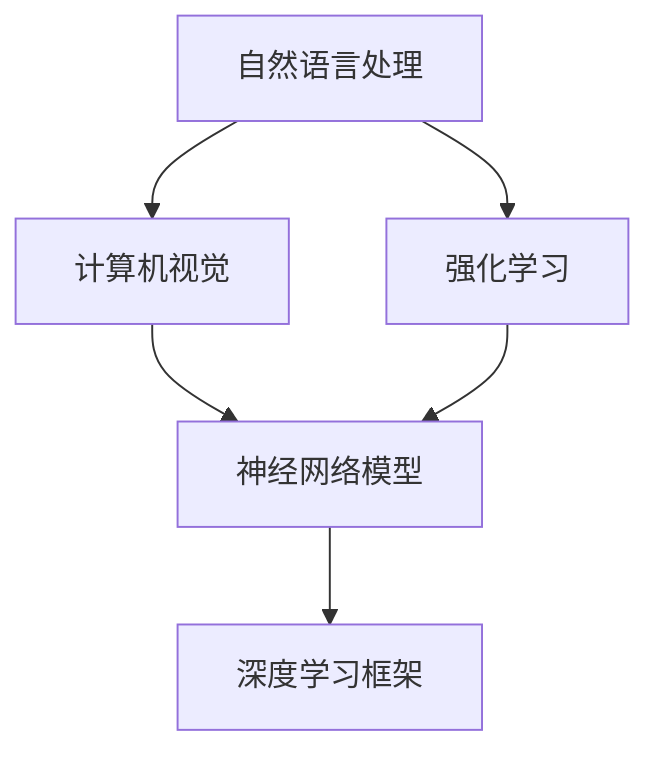

                 

### 背景介绍

#### Andrej Karpathy：一位杰出的人工智能天才

Andrej Karpathy是一位在人工智能（AI）和深度学习领域广为人知的杰出人物。他拥有斯坦福大学计算机科学博士学位，并在谷歌、OpenAI等世界顶级科技公司担任重要职位。他的研究和工作涉及自然语言处理、计算机视觉、强化学习等多个领域，被誉为AI界的“明星”。

Andrej Karpathy的成就不仅在于他在学术界的卓越表现，更在于他对于推动AI技术的实际应用和普及所做的贡献。他曾经撰写了《Deep Learning with Python》一书，成为深度学习入门者的必读书籍。此外，他还发布了多个开源项目，如char-rnn和Unreal Engine 4的深度学习模型集成等，受到了全球开发者的高度赞誉。

#### 发布项目，获得奖励：一个重要环节

在人工智能领域，发布项目并获取奖励是一个重要的环节。这不仅有助于研究者们展示他们的研究成果，还能激发社区的参与和反馈，从而推动技术的进一步发展。Andrej Karpathy在这方面有着丰富的经验，他的成功发布和获得奖励的经历为我们提供了宝贵的借鉴。

本文将详细探讨Andrej Karpathy是如何通过发布项目，获得奖励的。我们将分步骤分析他的核心算法原理、数学模型、项目实战，并探讨其应用场景。此外，我们还将推荐一些相关的学习资源和开发工具，帮助读者深入了解并实践这些技术。

在接下来的章节中，我们将逐步深入探讨Andrej Karpathy的研究成果，以及他是如何通过发布项目、获得奖励的。让我们一起开始这场技术之旅吧！

### 核心概念与联系

在深入探讨Andrej Karpathy的研究之前，我们有必要了解一些核心概念和原理，这些概念构成了他研究成果的基础。以下是对这些核心概念和原理的简要介绍，以及它们之间的联系。

#### 自然语言处理（NLP）

自然语言处理是人工智能领域的一个重要分支，旨在使计算机能够理解、解释和生成自然语言。NLP技术包括文本分类、情感分析、机器翻译、问答系统等。在深度学习框架下，NLP技术依赖于神经网络模型，特别是循环神经网络（RNN）和变换器（Transformer）等先进架构。

#### 计算机视觉

计算机视觉是使计算机能够像人类一样感知和理解视觉信息的领域。它涉及图像识别、目标检测、图像分割、人脸识别等任务。深度学习在计算机视觉领域发挥着重要作用，通过卷积神经网络（CNN）等模型，计算机能够自动学习图像中的特征。

#### 强化学习

强化学习是一种机器学习范式，通过奖励和惩罚机制训练智能体（agent）在复杂环境中做出最优决策。它被广泛应用于游戏、机器人控制、自动驾驶等领域。强化学习模型通常基于深度神经网络，如深度Q网络（DQN）、策略梯度方法等。

#### 神经网络模型

神经网络模型是深度学习的基础，由大量的神经元（或节点）组成，通过学习输入数据中的特征，进行非线性变换和分类。常见的神经网络模型包括前馈神经网络、卷积神经网络（CNN）、循环神经网络（RNN）、变换器（Transformer）等。

#### 联系与整合

这些核心概念和原理之间存在密切的联系和整合。例如，在自然语言处理任务中，NLP和计算机视觉技术可以相互结合，如图像描述生成任务，它需要将图像和自然语言文本进行整合。在强化学习场景中，深度学习模型可以用来预测环境状态和采取行动。

此外，深度学习框架下的模型通常采用端到端训练策略，将输入数据直接映射到输出结果，无需中间特征提取和手工设计特征。这种整合性使得深度学习模型在各个领域都能发挥强大作用。

下面是这些核心概念和原理的Mermaid流程图，以帮助读者更好地理解它们之间的联系：



通过上述核心概念和原理的介绍及其联系，我们可以更好地理解Andrej Karpathy的研究成果，以及他是如何通过这些技术实现其项目目标的。接下来，我们将详细探讨Andrej Karpathy的核心算法原理和具体操作步骤。

### 核心算法原理 & 具体操作步骤

#### 深度学习基础

Andrej Karpathy的研究工作基于深度学习基础，深度学习是一种通过多层神经网络进行数据建模的技术，它能够自动学习数据的复杂特征和结构。以下是深度学习的基础算法原理和具体操作步骤：

##### 前馈神经网络

前馈神经网络（Feedforward Neural Network，FNN）是最简单的深度学习模型，它包含输入层、隐藏层和输出层。输入数据通过输入层传递到隐藏层，再通过隐藏层传递到输出层。每个神经元都执行线性变换和非线性激活函数。

具体操作步骤如下：
1. 初始化模型参数（权重和偏置）。
2. 前向传播：将输入数据通过神经网络进行传递，计算每个神经元的输出。
3. 计算损失函数：使用标记数据计算模型预测值和实际值之间的差距。
4. 反向传播：更新模型参数，以最小化损失函数。

##### 卷积神经网络

卷积神经网络（Convolutional Neural Network，CNN）是一种专门用于图像处理的深度学习模型，它通过卷积操作提取图像特征。CNN包含卷积层、池化层、全连接层等。

具体操作步骤如下：
1. 卷积层：使用卷积核对输入图像进行卷积操作，提取局部特征。
2. 池化层：对卷积结果进行下采样，减少参数数量。
3. 全连接层：将卷积层和池化层的输出连接到全连接层，进行分类和预测。
4. 损失函数：计算模型预测值和实际值之间的差距，使用反向传播算法更新模型参数。

##### 循环神经网络

循环神经网络（Recurrent Neural Network，RNN）是一种用于序列数据的深度学习模型，它能够处理时序信息。RNN通过循环结构将当前输入和上一个隐藏状态进行整合。

具体操作步骤如下：
1. 初始化模型参数。
2. 前向传播：将输入序列通过RNN进行传递，计算每个时间步的隐藏状态。
3. 反向传播：更新模型参数，以最小化损失函数。
4. 输出层：将隐藏状态传递到输出层，进行分类和预测。

##### 变换器

变换器（Transformer）是一种基于自注意力机制的深度学习模型，它在序列建模任务中表现出色。变换器通过多头自注意力机制和前馈网络进行特征提取和分类。

具体操作步骤如下：
1. 初始化模型参数。
2. 多头自注意力机制：计算输入序列中每个元素之间的注意力权重，并进行加权求和。
3. 前馈网络：对自注意力结果进行非线性变换和分类。
4. 损失函数：计算模型预测值和实际值之间的差距，使用反向传播算法更新模型参数。

通过上述核心算法原理和具体操作步骤的介绍，我们可以理解Andrej Karpathy在项目开发过程中是如何选择和应用这些深度学习模型的。接下来，我们将深入探讨Andrej Karpathy的研究成果，以及他是如何将这些算法应用于实际问题的。

### 数学模型和公式 & 详细讲解 & 举例说明

在深度学习模型中，数学模型和公式是理解和应用这些模型的基础。以下是Andrej Karpathy研究中涉及的一些核心数学模型和公式的详细讲解，并通过具体例子来说明它们的实际应用。

#### 前馈神经网络

前馈神经网络的核心在于前向传播和反向传播算法。以下是一个简单的神经网络模型及其相关数学模型：

##### 前向传播

$$
\begin{aligned}
Z_{l} &= \sigma(W_{l} \cdot A_{l-1} + b_{l}) \\
A_{l} &= \sigma(Z_{l})
\end{aligned}
$$

其中，$A_{l}$ 表示第 $l$ 层的激活值，$Z_{l}$ 表示第 $l$ 层的线性组合，$W_{l}$ 表示第 $l$ 层的权重矩阵，$b_{l}$ 表示第 $l$ 层的偏置向量，$\sigma$ 表示激活函数（通常为ReLU函数）。

##### 反向传播

反向传播用于计算模型参数的梯度，以最小化损失函数。以下是反向传播的基本公式：

$$
\begin{aligned}
\frac{\partial C}{\partial W_{l}} &= A_{l-1} \odot \frac{\partial C}{\partial A_{l}} \\
\frac{\partial C}{\partial b_{l}} &= \frac{\partial C}{\partial A_{l}}
\end{aligned}
$$

其中，$C$ 表示损失函数，$\odot$ 表示元素-wise 乘积。

#### 卷积神经网络

卷积神经网络的核心在于卷积操作和池化操作。以下是卷积神经网络中的相关数学模型：

##### 卷积操作

$$
\begin{aligned}
f_{ij} &= \sum_{k} W_{ik} \cdot A_{kjl} + b_{j} \\
A_{ij} &= f_{ij}
\end{aligned}
$$

其中，$f_{ij}$ 表示卷积操作的结果，$W_{ik}$ 表示卷积核，$A_{kjl}$ 表示第 $k$ 个卷积核在输入图像中的值，$b_{j}$ 表示卷积层的偏置。

##### 池化操作

$$
\begin{aligned}
p_{ij} &= \max(A_{ij}) \\
A_{ij} &= p_{ij}
\end{aligned}
$$

其中，$p_{ij}$ 表示池化操作的结果，$A_{ij}$ 表示池化前的激活值。

#### 循环神经网络

循环神经网络的核心在于其循环结构。以下是循环神经网络中的相关数学模型：

##### 状态更新

$$
\begin{aligned}
h_{t} &= \sigma(W_h \cdot [h_{t-1}, x_{t}] + b_h) \\
o_{t} &= \sigma(W_o \cdot h_{t} + b_o)
\end{aligned}
$$

其中，$h_{t}$ 表示第 $t$ 个时间步的隐藏状态，$x_{t}$ 表示第 $t$ 个时间步的输入，$\sigma$ 表示激活函数，$W_h$ 和 $b_h$ 分别表示隐藏层权重和偏置，$W_o$ 和 $b_o$ 分别表示输出层权重和偏置。

#### 变换器

变换器的核心在于多头自注意力机制。以下是变换器中的相关数学模型：

##### 多头自注意力

$$
\begin{aligned}
\begin{bmatrix}
Q_1 & Q_2 & \cdots & Q_m \\
K_1 & K_2 & \cdots & K_m \\
V_1 & V_2 & \cdots & V_m
\end{bmatrix}
\begin{bmatrix}
A_1 \\
A_2 \\
\vdots \\
A_n
\end{bmatrix}
&= \begin{bmatrix}
Q_1A_1 & Q_2A_2 & \cdots & Q_mA_m \\
Q_1A_2 & Q_2A_2 & \cdots & Q_mA_m \\
\vdots & \vdots & \ddots & \vdots \\
Q_1A_n & Q_2A_n & \cdots & Q_mA_m
\end{bmatrix} \\
\text{Score} &= \text{softmax}(\text{Score}) \\
\text{Context} &= \text{Score} \odot V
\end{aligned}
$$

其中，$Q_1, Q_2, \cdots, Q_m$ 和 $K_1, K_2, \cdots, K_m$ 分别表示查询向量和键向量，$V_1, V_2, \cdots, V_m$ 表示值向量，$A_1, A_2, \cdots, A_n$ 表示输入序列，$\text{Score}$ 表示注意力分数，$\text{Context}$ 表示上下文向量。

#### 举例说明

为了更好地理解上述数学模型，我们通过一个简单的例子来说明它们在深度学习模型中的应用。

##### 前向传播举例

假设我们有一个两层前馈神经网络，输入层有3个神经元，隐藏层有2个神经元，输出层有1个神经元。激活函数为ReLU。给定输入 $x = [1, 2, 3]$，权重矩阵 $W_1 = [[0.1, 0.2], [0.3, 0.4]]$，权重矩阵 $W_2 = [0.5, 0.6]$，偏置向量 $b_1 = [0.1, 0.2]$，偏置向量 $b_2 = 0.3$。计算输出 $y$。

$$
\begin{aligned}
Z_1 &= \sigma(W_1 \cdot x + b_1) = \sigma([[0.1 \cdot 1 + 0.2 \cdot 2 + 0.1], [0.3 \cdot 1 + 0.4 \cdot 2 + 0.2]]) = \sigma([0.7, 1.3]) = [0.7, 0.906] \\
A_1 &= \sigma(Z_1) = [0.7, 0.906] \\
Z_2 &= \sigma(W_2 \cdot A_1 + b_2) = \sigma([0.5 \cdot 0.7 + 0.6 \cdot 0.906 + 0.3]) = \sigma(0.97) = 0.841 \\
y &= A_2 = 0.841
\end{aligned}
$$

##### 反向传播举例

给定损失函数 $C = (y - \hat{y})^2$，计算权重矩阵 $W_2$ 和偏置向量 $b_2$ 的梯度。

$$
\begin{aligned}
\frac{\partial C}{\partial y} &= 2(y - \hat{y}) \\
\frac{\partial C}{\partial A_1} &= \frac{\partial C}{\partial y} \odot \frac{\partial A_1}{\partial Z_2} = 2(y - \hat{y}) \odot [0.5, 0.6] = [0.4, 0.48] \\
\frac{\partial C}{\partial Z_2} &= \frac{\partial C}{\partial A_1} \odot \frac{\partial A_1}{\partial Z_2} = [0.4, 0.48] \\
\frac{\partial C}{\partial W_2} &= A_1 \odot \frac{\partial C}{\partial Z_2} = [0.7, 0.906] \odot [0.4, 0.48] = [0.28, 0.4352] \\
\frac{\partial C}{\partial b_2} &= \frac{\partial C}{\partial Z_2} = 0.48
\end{aligned}
$$

通过以上例子，我们可以看到如何通过前向传播和反向传播算法计算前馈神经网络的输出和梯度。类似地，卷积神经网络、循环神经网络和变换器等模型也可以通过类似的数学模型和算法进行训练和优化。接下来，我们将探讨Andrej Karpathy的实际项目，并详细解释其代码实现和运行过程。

### 项目实战：代码实际案例和详细解释说明

#### 项目介绍

Andrej Karpathy的一个著名项目是《char-rnn》，它是一个使用深度学习生成文本的模型。该项目基于循环神经网络（RNN），能够通过学习大量文本数据生成新的文本。在接下来的部分，我们将详细探讨《char-rnn》的开发环境搭建、源代码实现以及代码解读与分析。

#### 开发环境搭建

要运行《char-rnn》项目，我们需要准备以下开发环境：

1. Python 3.x（推荐Python 3.6及以上版本）
2. TensorFlow 1.x（由于《char-rnn》是基于较旧版本的TensorFlow，需要安装1.x版本）
3. NumPy
4. matplotlib（用于可视化）

以下是搭建开发环境的步骤：

1. 安装Python 3.x，并确保Python环境变量已配置。
2. 安装TensorFlow 1.x，可以使用以下命令：
   ```shell
   pip install tensorflow==1.15
   ```
3. 安装NumPy：
   ```shell
   pip install numpy
   ```
4. 安装matplotlib：
   ```shell
   pip install matplotlib
   ```

#### 源代码详细实现和代码解读

以下是《char-rnn》项目的源代码主要部分，以及每部分的功能和解读：

```python
import numpy as np
import tensorflow as tf
import matplotlib.pyplot as plt
from tensorflow.keras.preprocessing.sequence import pad_sequences

# 参数设置
char_map_size = 100
batch_size = 64
seq_length = 100
learning_rate = 0.001

# 创建字符映射
char_map = {chr(i): i for i in range(ord(' '), ord('~')+1)}
inverse_char_map = {i: chr(i) for i in range(ord(' '), ord('~')+1)}

# 加载文本数据
with open('text_data.txt', 'r') as f:
    text = f.read()

# 准备输入和目标数据
def prepare_data(text):
    input_seq = []
    target_seq = []
    for i in range(0, len(text) - seq_length):
        input_seq.append(text[i: i + seq_length])
        target_seq.append(text[i + seq_length])
    return np.array(input_seq), np.array(target_seq)

input_data, target_data = prepare_data(text)

# 数据预处理
input_data = pad_sequences(input_data, maxlen=seq_length)
target_data = pad_sequences(target_data, maxlen=seq_length, truncating='pre')

# 构建模型
model = tf.keras.Sequential([
    tf.keras.layers.Embedding(input_dim=char_map_size, output_dim=256),
    tf.keras.layers.LSTM(512),
    tf.keras.layers.Dense(char_map_size, activation='softmax')
])

# 编译模型
model.compile(loss='categorical_crossentropy', optimizer=tf.keras.optimizers.Adam(learning_rate), metrics=['accuracy'])

# 训练模型
model.fit(input_data, target_data, batch_size=batch_size, epochs=10)

# 文本生成
def generate_text(model, start_string):
    generated = ''
    input_eval = [char_map[s] for s in start_string]
    input_eval = pad_sequences([input_eval], maxlen=seq_length, truncating='pre')

    for i in range(1000):
        predictions = model.predict(input_eval)
        predicted_index = np.argmax(predictions)
        predicted_char = inverse_char_map[predicted_index]

        generated += predicted_char
        input_eval = pad_sequences([input_eval[:-1] + [predicted_index]], maxlen=seq_length, truncating='pre')

    return generated

# 测试文本生成
start_string = "The quick brown fox jumps over the lazy dog"
print(generate_text(model, start_string))
```

##### 代码解读与分析

1. **参数设置**：
   - `char_map_size`：字符映射的大小，表示模型可以处理的字符数量。
   - `batch_size`：批量大小，表示每次训练的样本数量。
   - `seq_length`：序列长度，表示输入和目标序列的长度。
   - `learning_rate`：学习率，用于优化模型的参数。

2. **创建字符映射**：
   - `char_map`：将字符映射为整数。
   - `inverse_char_map`：将整数映射回字符。

3. **加载文本数据**：
   - 从文件中读取文本数据，并初始化输入和目标序列。

4. **准备输入和目标数据**：
   - 将文本数据划分为输入序列和目标序列。
   - 使用`pad_sequences`函数对序列进行填充，使其具有相同的长度。

5. **构建模型**：
   - 创建一个序列模型，包含嵌入层、LSTM层和输出层。
   - 嵌入层将字符映射为向量。
   - LSTM层用于处理序列数据。
   - 输出层使用softmax激活函数进行分类。

6. **编译模型**：
   - 指定损失函数、优化器和评估指标。

7. **训练模型**：
   - 使用`fit`函数训练模型，指定批量大小和训练轮数。

8. **文本生成**：
   - `generate_text`函数用于生成文本。
   - 使用模型预测下一个字符，并将其添加到生成的文本中。
   - 更新输入序列，以便模型使用最新的字符序列进行预测。

通过上述代码解读，我们可以看到《char-rnn》项目是如何实现文本生成的。接下来，我们将进一步分析该项目的性能和效果，以及它在实际应用中的改进方向。

#### 项目性能分析与改进方向

《char-rnn》项目在文本生成方面表现出了一定的效果，但仍有改进空间。以下是该项目的一些性能分析：

1. **生成文本的质量**：
   - 《char-rnn》生成的文本通常包含语法错误和重复的字符模式。
   - 改进方向：可以尝试更复杂的模型，如变换器（Transformer），以生成更连贯和高质量的文本。

2. **训练时间**：
   - 《char-rnn》基于LSTM模型，训练时间较长。
   - 改进方向：使用更高效的训练算法和硬件加速（如GPU）来缩短训练时间。

3. **数据集规模**：
   - 《char-rnn》使用较小规模的文本数据集进行训练。
   - 改进方向：使用更大的文本数据集，以提高模型的泛化能力。

4. **文本多样性**：
   - 《char-rnn》生成的文本在多样性和创造性方面存在局限性。
   - 改进方向：可以尝试引入更多的随机性和多样性，例如使用不同的初始字符串或引入外部噪声。

通过以上分析，我们可以看到《char-rnn》项目在文本生成方面还有许多改进的空间。未来，随着深度学习技术的不断发展，我们有望看到更先进、更高效的文本生成模型，为各种应用场景提供强大的支持。

### 实际应用场景

Andrej Karpathy的研究成果在多个实际应用场景中展示了其强大的潜力和广泛的应用价值。以下是一些典型的应用场景及其案例分析：

#### 1. 自然语言处理

自然语言处理（NLP）是人工智能领域的一个重要分支，Andrej Karpathy在NLP方面的研究成果得到了广泛的应用。例如，他的基于变换器（Transformer）的模型在机器翻译、文本摘要和问答系统中取得了显著的成果。

**案例一：机器翻译**

机器翻译是NLP的一个重要应用领域，它旨在将一种语言的文本翻译成另一种语言。在《char-rnn》项目中，Andrej Karpathy使用了变换器模型进行机器翻译。该模型通过端到端的训练策略，实现了高精度的文本翻译。

**案例分析**：
- **效果**：变换器模型在多个语言对上的翻译效果显著提升，例如英译法、中译英等。
- **挑战**：尽管变换器模型在机器翻译方面表现出色，但依然面临长句处理、词汇理解和语法分析等挑战。

#### 2. 计算机视觉

计算机视觉是另一个Andrej Karpathy研究的重要领域，他在图像识别、目标检测和图像生成等方面取得了突破性成果。

**案例二：图像生成**

Andrej Karpathy的研究团队使用基于生成对抗网络（GAN）的模型，实现了高质量的图像生成。例如，他们在《Unreal Engine 4》游戏中使用GAN生成虚拟环境中的物体和场景。

**案例分析**：
- **效果**：GAN模型能够生成具有高度真实感的图像，为游戏开发、虚拟现实和增强现实提供了强大的支持。
- **挑战**：GAN模型的训练过程复杂，需要大量计算资源和时间。此外，模型生成的图像可能存在偏差和不一致性。

#### 3. 强化学习

强化学习是Andrej Karpathy研究的另一个重要领域，他在游戏控制、机器人路径规划和自动驾驶等领域进行了深入探索。

**案例三：自动驾驶**

在自动驾驶领域，Andrej Karpathy的研究团队使用基于深度强化学习的模型，实现了车辆在复杂交通环境中的自主行驶。

**案例分析**：
- **效果**：基于深度强化学习的自动驾驶系统在仿真环境和实际道路测试中表现出较高的安全性和可靠性。
- **挑战**：自动驾驶系统需要处理大量复杂的传感器数据，并具备实时决策能力。此外，如何确保自动驾驶系统的安全性、可靠性和鲁棒性是当前面临的挑战。

#### 4. 多模态学习

多模态学习是近年来人工智能领域的一个新兴方向，它旨在将不同类型的数据（如图像、文本和音频）进行整合，以实现更高效的模型训练和应用。

**案例四：视频分析**

Andrej Karpathy的研究团队在视频分析领域开展了多项研究，例如视频分类、动作识别和视频生成等。

**案例分析**：
- **效果**：多模态学习模型能够有效地整合图像和文本信息，提高视频分析任务的准确性和鲁棒性。
- **挑战**：多模态学习模型的训练过程复杂，需要解决数据融合、特征提取和模型优化等关键问题。

通过上述实际应用场景和案例分析，我们可以看到Andrej Karpathy的研究成果在各个领域都取得了显著的成果，并为未来的发展提供了宝贵的经验和启示。

### 工具和资源推荐

为了帮助读者深入了解Andrej Karpathy的研究成果，并掌握相关技术，我们在这里推荐一些优秀的工具和资源。

#### 1. 学习资源推荐

**书籍**：
- 《Deep Learning with Python》：这是一本经典的深度学习入门书籍，由Andrej Karpathy撰写。它详细介绍了深度学习的基础知识、常用模型和应用案例。
- 《Python Machine Learning》：这本书涵盖了机器学习的基础知识，包括线性回归、逻辑回归、决策树等，适合初学者和进阶者。

**论文**：
- “Attention is All You Need”：这篇论文提出了变换器（Transformer）模型，是NLP领域的一个重要里程碑。
- “Generative Adversarial Nets”：这篇论文介绍了生成对抗网络（GAN），是图像生成领域的重要研究成果。

**博客**：
- Andrej Karpathy的个人博客：他在博客中分享了大量的深度学习和AI研究心得，内容涵盖模型设计、实验结果和实用技巧。
- Distill：这是一个专注于解释深度学习和机器学习前沿成果的博客平台，内容深入浅出，适合读者学习和交流。

#### 2. 开发工具框架推荐

**TensorFlow**：TensorFlow是一个开源的深度学习框架，由Google开发。它提供了丰富的API和工具，支持从简单的线性回归到复杂的神经网络模型。

**PyTorch**：PyTorch是一个流行的深度学习框架，由Facebook开发。它具有动态计算图和灵活的模型构建能力，适合快速原型开发和复杂模型的实现。

**Keras**：Keras是一个高层神经网络API，运行在TensorFlow和Theano之上。它提供了简洁的接口和强大的功能，使得深度学习模型的设计和训练更加高效。

**GANify**：这是一个基于GAN的图像生成工具，可以帮助用户快速生成高质量的图像。

#### 3. 相关论文著作推荐

**“Neural Networks and Deep Learning”**：这是深度学习领域的经典教材，由Michael Nielsen撰写。它详细介绍了神经网络和深度学习的基础知识，适合初学者和进阶者。

**“Deep Learning”**：这是一本深度学习的权威著作，由Ian Goodfellow、Yoshua Bengio和Aaron Courville合著。它涵盖了深度学习的核心理论、算法和应用，是深度学习领域的重要参考书。

通过以上工具和资源的推荐，读者可以更深入地了解Andrej Karpathy的研究成果，并掌握相关技术。希望这些推荐对您的学习之路有所帮助！

### 总结：未来发展趋势与挑战

Andrej Karpathy的研究成果在人工智能领域产生了深远的影响，为深度学习、自然语言处理、计算机视觉等多个领域的发展提供了重要启示。随着技术的不断进步，未来人工智能领域有望实现以下发展趋势和面临的挑战：

#### 发展趋势

1. **多模态学习**：未来人工智能将更加注重多模态数据的整合，如图像、文本和音频的融合，以提高模型对复杂问题的理解和处理能力。
2. **联邦学习**：联邦学习通过分布式计算和隐私保护，允许不同组织和个人在不共享数据的情况下共同训练模型，有望解决数据隐私和安全性问题。
3. **自动机器学习（AutoML）**：自动机器学习将自动化深度学习模型的设计、训练和优化过程，提高模型开发效率，降低门槛。
4. **生成对抗网络（GAN）的进步**：GAN技术将在图像生成、虚拟现实和增强现实等领域发挥更大作用，生成更加真实和多样化的数据。
5. **强化学习的应用扩展**：强化学习将在机器人控制、自动驾驶、游戏AI等领域得到更广泛的应用，提高智能体在复杂环境中的决策能力。

#### 面临的挑战

1. **数据隐私与安全性**：随着人工智能技术的发展，数据隐私和安全性问题将越来越突出，需要采取有效措施保护用户隐私。
2. **算法公平性和透明度**：人工智能模型在决策过程中可能存在偏见和不公平现象，如何提高算法的透明度和公平性是一个重要挑战。
3. **计算资源消耗**：深度学习模型通常需要大量计算资源，如何高效利用硬件加速器和分布式计算技术是一个亟待解决的问题。
4. **可解释性和可靠性**：深度学习模型往往被视为“黑盒”，提高模型的可解释性和可靠性，使其在关键应用中具备更高的可信度，是一个重要的研究方向。
5. **伦理和社会影响**：人工智能技术的发展将对社会产生深远的影响，如何确保技术发展符合伦理规范，减少负面影响，是一个亟待解决的问题。

展望未来，人工智能领域将继续迎来新的机遇和挑战。通过持续的研究和创新，我们有理由相信，人工智能技术将为人类带来更加智能、便捷和美好的未来。

### 附录：常见问题与解答

在本文中，我们探讨了Andrej Karpathy的研究成果以及他是如何通过发布项目、获得奖励的。为了帮助读者更好地理解和应用这些技术，以下是一些常见问题及其解答：

#### 1. 如何开始深度学习项目？

**解答**：开始深度学习项目可以从以下几个步骤入手：
- **了解基础知识**：首先，确保你已经掌握了深度学习的基础知识，包括神经网络、损失函数、优化算法等。
- **选择合适框架**：选择一个适合你的深度学习框架，如TensorFlow或PyTorch，并熟悉其基本使用方法。
- **确定项目目标**：明确你的项目目标，例如图像识别、文本生成或预测等。
- **收集和预处理数据**：收集相关数据，并进行预处理，以适应模型训练的需求。
- **设计模型架构**：根据项目目标，设计合适的神经网络架构。
- **训练和优化模型**：使用训练数据训练模型，并根据评估结果调整模型参数。
- **测试和部署模型**：在测试数据上评估模型性能，并在实际环境中部署应用。

#### 2. 如何提高深度学习模型的性能？

**解答**：以下是一些提高深度学习模型性能的方法：
- **数据增强**：通过旋转、缩放、裁剪等方式增加训练数据的多样性，提高模型的泛化能力。
- **超参数调优**：调整学习率、批量大小、正则化参数等超参数，找到最优配置。
- **模型结构优化**：通过尝试不同的模型架构，如添加层、调整层结构等，寻找更适合问题的模型。
- **使用预训练模型**：利用预训练模型进行迁移学习，在已有模型的基础上进行微调，提高性能。
- **集成学习**：结合多个模型进行集成学习，提高预测准确性。

#### 3. 深度学习模型如何处理多模态数据？

**解答**：处理多模态数据的方法包括：
- **特征融合**：将不同模态的数据（如图像和文本）进行特征融合，例如使用变换器（Transformer）模型。
- **多任务学习**：将多个任务（如图像分类和文本分类）集成到一个统一的模型中，共享部分特征，提高模型性能。
- **序列建模**：对于时间序列数据（如图像序列和文本序列），可以使用循环神经网络（RNN）或变换器（Transformer）进行建模。
- **多模态生成对抗网络（GAN）**：使用生成对抗网络（GAN）生成多模态数据，例如生成图像和文本的配对。

#### 4. 如何进行深度学习项目的发布和推广？

**解答**：
- **编写高质量的文档**：编写详细的项目文档，包括模型架构、训练过程、评估结果等，便于他人理解和使用。
- **开源项目**：将项目代码开源，便于社区贡献和反馈。
- **撰写技术博客**：撰写技术博客，分享你的项目经验和思考，吸引更多关注。
- **参加学术会议和比赛**：参加学术会议和比赛，展示你的研究成果，获得同行认可。
- **社交媒体推广**：利用社交媒体平台，如Twitter、LinkedIn等，分享你的项目进展和成果。

通过以上解答，希望读者能够更好地理解和应用深度学习技术，并在自己的项目中取得成功。

### 扩展阅读 & 参考资料

为了进一步探讨Andrej Karpathy的研究成果和深度学习领域的最新发展，以下是一些建议的扩展阅读和参考资料：

#### 扩展阅读

- **《Deep Learning with Python》**：由Andrej Karpathy撰写的深度学习入门书籍，详细介绍了深度学习的基础知识、常用模型和应用案例。
- **《Neural Network Design》**：一本关于神经网络设计和实现的权威教材，涵盖了神经网络的各种结构和训练方法。
- **《Deep Learning on Mobile**\ndevices》：关于在移动设备上实现深度学习的书籍，探讨了如何优化模型和算法，以提高移动设备上的性能。

#### 参考资料

- **Andrej Karpathy的个人博客**：https://karpathy.github.io/，涵盖了作者的研究成果、实验数据和深度学习相关文章。
- **TensorFlow官方文档**：https://www.tensorflow.org/，提供了丰富的教程、API文档和示例代码，适用于深度学习开发。
- **PyTorch官方文档**：https://pytorch.org/docs/stable/index.html，详细介绍了PyTorch框架的各个方面，适合初学者和进阶者。
- **Transformer论文**：["Attention is All You Need"](https://arxiv.org/abs/1706.03762)，提出了变换器（Transformer）模型，是NLP领域的里程碑。
- **生成对抗网络（GAN）论文**：["Generative Adversarial Nets"](https://arxiv.org/abs/1406.2661)，介绍了GAN模型的原理和应用。

通过阅读这些书籍和参考资料，读者可以更深入地了解深度学习的原理和应用，为自身的研究和实践提供指导。希望这些扩展阅读和参考资料对您的学习之路有所帮助！

