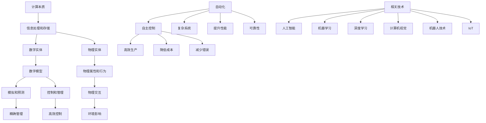

                 

### 1. 背景介绍

在当今的科技发展历程中，计算的力量正以不可思议的速度和规模悄然改变着我们的世界。从电子计算机的诞生，到互联网的普及，再到人工智能的崛起，计算这一工具不仅深刻地影响了科学研究和工业生产，更是在社会生活的方方面面产生了革命性的变革。然而，今天我们所谈的计算，其本质正在经历一次重大的转变。

计算的本质一直以来都被认为是信息的处理和存储。计算机科学家安德烈·卡帕蒂（Andrej Karpathy）指出，当前的计算正从传统的信息处理模式，向数字实体和物理实体的自动化方向快速演进。这一转变不仅涉及到计算技术和算法的进步，更是一场对现实世界进行数字化改造的深远革命。

卡帕蒂在其研究中强调，数字实体和物理实体的自动化是未来计算发展的关键方向。通过将现实世界中的实体转化为数字模型，我们能够利用计算技术对这些实体进行更高效、更精确的控制和管理。这种转变带来了许多新的机遇和挑战，从自动驾驶汽车到智能医疗设备，再到工业4.0的智能制造，无不体现着这一趋势的力量。

本文将深入探讨这一计算本质变化的背景、核心概念、算法原理，以及其在实际应用场景中的表现。我们将通过详细的项目实战案例，展示如何利用现代计算技术实现数字实体和物理实体的自动化。同时，我们还将推荐相关的学习资源和开发工具，帮助读者更好地理解和掌握这一新兴领域。

通过本文的阅读，读者将能够：
1. 了解计算本质变化的背景和核心概念。
2. 掌握数字实体和物理实体自动化的算法原理和实现步骤。
3. 理解计算技术在实际应用场景中的具体应用和挑战。
4. 获得进一步学习和探索这一领域的方法和资源。

### 2. 核心概念与联系

在深入探讨计算本质变化之前，我们首先需要明确几个核心概念，并了解它们之间的联系。这些核心概念构成了我们理解数字实体和物理实体自动化的重要基石。

#### 2.1 计算的本质

计算的本质是信息的处理和存储。在计算机科学中，计算通常被定义为通过算法对数据集进行操作的过程。这个过程可以理解为输入数据经过一系列处理步骤，最终产生输出结果。传统的计算主要集中在电子计算机的硬件和软件层面，其目标是实现高效的计算和数据存储。

#### 2.2 数字实体

数字实体是指通过数字模型表示的现实世界中的物理实体。这些实体可以是任何可以被量化和模型化的对象，如物体、系统、过程等。数字实体通过算法和计算技术进行模拟、预测和控制，从而实现对物理实体的精确管理和操作。

#### 2.3 物理实体

物理实体是现实世界中实际存在的物体和系统，如车辆、机器、生物等。物理实体具有特定的物理属性和行为，它们通过物理定律和相互作用影响着周围环境。

#### 2.4 数字实体与物理实体的关系

数字实体与物理实体之间的关系可以看作是虚拟与现实之间的映射。通过数字模型，我们可以将物理实体的行为和状态数字化，然后在计算环境中对这些数字模型进行模拟和优化。这种映射关系使得我们能够对物理实体进行更高效、更精准的控制和管理。

#### 2.5 自动化

自动化是指通过计算技术和算法，实现对物理实体的自主控制和管理。自动化可以大大提高生产效率、降低成本、减少错误，同时解放人力，使其能够专注于更高层次的工作。自动化可以分为多种类型，包括程序化自动化、智能化自动化和自主化自动化。

#### 2.6 自动化的挑战和机遇

自动化的挑战在于如何确保数字实体与物理实体之间的映射是准确和可靠的。这涉及到算法的精度、模型的复杂度以及系统的稳定性等问题。同时，自动化也带来了巨大的机遇，特别是在复杂系统和大规模应用中，自动化能够显著提升系统的性能和可靠性。

#### 2.7 相关技术和领域

在实现数字实体和物理实体的自动化过程中，涉及到的相关技术和领域包括人工智能、机器学习、深度学习、计算机视觉、机器人技术、物联网（IoT）等。这些技术和领域共同构成了自动化发展的技术基础和应用场景。

##### Mermaid 流程图

为了更直观地展示这些核心概念之间的联系，我们可以使用Mermaid流程图进行说明。以下是核心概念原理和架构的Mermaid流程图：



通过这个Mermaid流程图，我们可以清晰地看到计算本质、数字实体、物理实体以及自动化之间的相互关系和作用。这些概念共同构成了数字实体和物理实体自动化的核心框架，为我们进一步探讨这一领域提供了坚实的基础。

### 3. 核心算法原理 & 具体操作步骤

在理解了计算本质变化和核心概念后，我们需要深入探讨数字实体和物理实体自动化的核心算法原理，以及这些算法的具体操作步骤。在这一部分，我们将详细讲解实现数字实体和物理实体自动化的关键技术和方法。

#### 3.1 人工智能与机器学习

人工智能（AI）和机器学习（ML）是实现自动化的重要技术基础。通过学习大量的数据，机器学习算法能够从数据中提取模式，并利用这些模式进行预测和决策。以下是机器学习算法的一些核心步骤：

1. **数据收集与预处理**：首先，我们需要收集大量的数据，并对这些数据进行清洗、去噪和格式化，使其适合机器学习算法处理。

   ```mermaid
   graph TB
       A[数据收集] --> B[数据预处理]
       B --> C[数据清洗]
       C --> D[去噪]
       D --> E[格式化]
   ```

2. **模型选择**：根据具体问题，选择合适的机器学习模型。常见的模型包括线性回归、决策树、支持向量机、神经网络等。

   ```mermaid
   graph TB
       A[问题分析] --> B[模型选择]
       B --> C[线性回归]
       B --> D[决策树]
       B --> E[支持向量机]
       B --> F[神经网络]
   ```

3. **模型训练**：使用预处理后的数据对机器学习模型进行训练，模型通过不断调整参数，使其在训练数据上表现最优。

   ```mermaid
   graph TB
       A[数据集] --> B[模型训练]
       B --> C[参数调整]
       B --> D[评估性能]
   ```

4. **模型评估与优化**：通过交叉验证、测试集评估等方式，对模型进行评估和优化，确保其在实际应用中的表现。

   ```mermaid
   graph TB
       A[模型评估] --> B[交叉验证]
       B --> C[测试集评估]
       C --> D[优化调整]
   ```

5. **模型部署**：将训练好的模型部署到实际应用中，实现自动化。

   ```mermaid
   graph TB
       A[模型训练] --> B[模型部署]
       B --> C[自动化实现]
   ```

#### 3.2 深度学习与计算机视觉

深度学习是机器学习的一个重要分支，特别适合处理复杂的数据模式。在计算机视觉领域，深度学习算法已经取得了显著的成果，如图像识别、目标检测和图像生成等。以下是深度学习在计算机视觉中的具体应用步骤：

1. **数据收集与预处理**：类似于机器学习，深度学习也需要大量的数据，并对数据进行预处理。

   ```mermaid
   graph TB
       A[数据收集] --> B[数据预处理]
       B --> C[数据清洗]
       B --> D[格式化]
   ```

2. **模型构建与训练**：构建深度学习模型，如卷积神经网络（CNN），并对模型进行训练。

   ```mermaid
   graph TB
       A[模型构建] --> B[模型训练]
       B --> C[参数调整]
       B --> D[评估性能]
   ```

3. **模型评估与优化**：评估模型的性能，并进行优化。

   ```mermaid
   graph TB
       A[模型评估] --> B[交叉验证]
       B --> C[测试集评估]
       C --> D[优化调整]
   ```

4. **模型部署**：将训练好的模型部署到实际应用中，如自动驾驶车辆的视觉系统。

   ```mermaid
   graph TB
       A[模型训练] --> B[模型部署]
       B --> C[自动化实现]
   ```

#### 3.3 机器人技术

机器人技术是实现物理实体自动化的重要手段。以下是机器人技术的核心步骤：

1. **传感器集成**：机器人需要集成各种传感器，如摄像头、激光雷达、超声波传感器等，以获取环境信息。

   ```mermaid
   graph TB
       A[传感器集成] --> B[信息采集]
   ```

2. **数据处理与决策**：机器人根据传感器收集的数据，通过算法进行数据处理和决策。

   ```mermaid
   graph TB
       A[数据处理] --> B[决策制定]
   ```

3. **运动控制**：根据决策结果，机器人执行相应的运动控制命令，实现物理实体的自动化操作。

   ```mermaid
   graph TB
       A[决策制定] --> B[运动控制]
   ```

4. **自主化与优化**：通过不断的学习和优化，机器人能够提高自主化程度，实现更高效、更精确的自动化操作。

   ```mermaid
   graph TB
       A[自主化学习] --> B[优化调整]
   ```

#### 3.4 物联网（IoT）

物联网（IoT）通过将物理实体连接到互联网，实现实时数据采集和远程控制。以下是物联网技术的核心步骤：

1. **设备连接与数据采集**：将物理实体（如智能家居设备、工业传感器等）连接到互联网，实时采集数据。

   ```mermaid
   graph TB
       A[设备连接] --> B[数据采集]
   ```

2. **数据处理与传输**：对采集到的数据进行处理和传输，通常通过云计算平台进行数据处理和分析。

   ```mermaid
   graph TB
       A[数据处理] --> B[数据传输]
   ```

3. **远程控制与自动化**：通过互联网远程控制物理实体，实现自动化操作。

   ```mermaid
   graph TB
       A[远程控制] --> B[自动化实现]
   ```

4. **智能化与优化**：利用机器学习和深度学习算法，对物联网设备进行智能化管理和优化。

   ```mermaid
   graph TB
       A[智能化学习] --> B[优化调整]
   ```

通过上述步骤，我们可以实现数字实体和物理实体的自动化。这些步骤不仅涵盖了技术层面，还包括了实际应用中的挑战和解决方案。在实际应用中，我们需要根据具体场景和需求，灵活运用这些技术和方法，实现高效的自动化。

### 4. 数学模型和公式 & 详细讲解 & 举例说明

在深入理解数字实体和物理实体自动化的过程中，数学模型和公式起到了至关重要的作用。它们不仅为算法提供了理论基础，还为实际应用中的复杂问题提供了简洁、高效的解决方案。在本节中，我们将详细介绍几个关键的数学模型和公式，并通过具体的例子进行说明。

#### 4.1 线性回归模型

线性回归模型是一种广泛应用于预测和分析的数据分析工具。它通过建立输入变量（自变量）和输出变量（因变量）之间的线性关系，实现对未知数据的预测。

**数学公式**：

线性回归模型可以用以下公式表示：

\[ y = \beta_0 + \beta_1 \cdot x + \epsilon \]

其中，\( y \) 是因变量，\( x \) 是自变量，\( \beta_0 \) 和 \( \beta_1 \) 分别是模型的截距和斜率，\( \epsilon \) 是误差项。

**详细讲解**：

- **截距 \( \beta_0 \)**：表示当自变量 \( x \) 为零时，因变量 \( y \) 的预期值。
- **斜率 \( \beta_1 \)**：表示自变量 \( x \) 每增加一个单位时，因变量 \( y \) 的变化量。
- **误差项 \( \epsilon \)**：表示模型预测值与实际值之间的差距。

**举例说明**：

假设我们有一个简单的数据集，包含身高（自变量）和体重（因变量）。我们希望使用线性回归模型预测一个新身高值对应的体重。

数据集示例：

| 身高 (cm) | 体重 (kg) |
|-----------|-----------|
| 160       | 50        |
| 170       | 55        |
| 175       | 60        |
| 180       | 65        |

我们首先计算平均值：

\[ \bar{x} = \frac{\sum x_i}{n} = \frac{160 + 170 + 175 + 180}{4} = 170 \]
\[ \bar{y} = \frac{\sum y_i}{n} = \frac{50 + 55 + 60 + 65}{4} = 58 \]

然后计算斜率和截距：

\[ \beta_1 = \frac{\sum (x_i - \bar{x})(y_i - \bar{y})}{\sum (x_i - \bar{x})^2} = \frac{(160-170)(50-58) + (170-170)(55-58) + (175-170)(60-58) + (180-170)(65-58)}{(160-170)^2 + (170-170)^2 + (175-170)^2 + (180-170)^2} \]
\[ \beta_0 = \bar{y} - \beta_1 \cdot \bar{x} \]

最后，我们得到线性回归模型：

\[ y = \beta_0 + \beta_1 \cdot x \]

例如，当身高为 175cm 时，预测体重：

\[ y = \beta_0 + \beta_1 \cdot 175 \]

#### 4.2 卷积神经网络（CNN）模型

卷积神经网络（CNN）是一种专门用于图像识别和处理的深度学习模型。它通过卷积层、池化层和全连接层等结构，实现对图像的自动特征提取和分类。

**数学公式**：

CNN 模型中的卷积操作可以用以下公式表示：

\[ (f \star g)(x) = \sum_{y} f(y) \cdot g(x-y) \]

其中，\( f \) 和 \( g \) 分别表示卷积核和输入图像，\( x \) 是输入图像的位置。

**详细讲解**：

- **卷积核**：卷积核是一个小的矩阵，用于从输入图像中提取局部特征。
- **卷积操作**：通过将卷积核与输入图像进行卷积，得到一个特征图。
- **池化操作**：通过对特征图进行下采样，减少模型参数，提高模型泛化能力。

**举例说明**：

假设我们有一个 32x32 的输入图像和一个 3x3 的卷积核。卷积核的值为：

\[ \text{卷积核} = \begin{bmatrix} 1 & 0 & -1 \\ 0 & 1 & 0 \\ -1 & 0 & 1 \end{bmatrix} \]

输入图像的值为：

\[ \text{输入图像} = \begin{bmatrix} 1 & 1 & 1 \\ 1 & 1 & 1 \\ 1 & 1 & 1 \end{bmatrix} \]

我们进行卷积操作，得到特征图：

\[ \text{特征图} = (1 \star \text{输入图像}) + (0 \star \text{输入图像}) + (-1 \star \text{输入图像}) \]
\[ \text{特征图} = (1 \cdot 1 + 1 \cdot 1 + 1 \cdot 1) + (0 \cdot 1 + 0 \cdot 1 + 0 \cdot 1) + (-1 \cdot 1 + -1 \cdot 1 + -1 \cdot 1) \]
\[ \text{特征图} = 3 + 0 - 3 \]
\[ \text{特征图} = 0 \]

通过这个例子，我们可以看到卷积操作是如何提取输入图像的局部特征的。

#### 4.3 神经网络模型

神经网络（NN）是一种通过模拟人脑神经元连接结构的计算模型，用于实现复杂的函数逼近和模式识别。神经网络的核心是激活函数和反向传播算法。

**数学公式**：

神经网络的前向传播可以用以下公式表示：

\[ z_i = \sum_j w_{ij} \cdot a_j + b_i \]
\[ a_i = \sigma(z_i) \]

其中，\( z_i \) 是第 \( i \) 个神经元的输入，\( w_{ij} \) 是连接权重，\( b_i \) 是偏置，\( \sigma \) 是激活函数，\( a_i \) 是第 \( i \) 个神经元的输出。

**详细讲解**：

- **前向传播**：通过输入数据，通过神经网络中的各个层，最终得到输出结果。
- **反向传播**：通过比较输出结果与实际值的差距，反向传播误差，更新权重和偏置，优化模型。

**举例说明**：

假设我们有一个简单的神经网络，包含一个输入层、一个隐藏层和一个输出层。输入层有2个神经元，隐藏层有3个神经元，输出层有1个神经元。激活函数使用 \( \sigma(x) = \frac{1}{1 + e^{-x}} \)。

输入数据为：

\[ \text{输入数据} = \begin{bmatrix} 1 & 0 \\ 0 & 1 \end{bmatrix} \]

权重和偏置为：

\[ \text{权重} = \begin{bmatrix} w_{11} & w_{12} \\ w_{21} & w_{22} & w_{23} \\ w_{31} & w_{32} & w_{33} \end{bmatrix} \]
\[ \text{偏置} = \begin{bmatrix} b_1 \\ b_2 \\ b_3 \end{bmatrix} \]

隐藏层的输入和输出计算如下：

\[ z_1 = w_{11} \cdot a_1 + w_{12} \cdot a_2 + b_1 \]
\[ z_2 = w_{21} \cdot a_1 + w_{22} \cdot a_2 + w_{23} \cdot a_3 + b_2 \]
\[ z_3 = w_{31} \cdot a_1 + w_{32} \cdot a_2 + w_{33} \cdot a_3 + b_3 \]

\[ a_1 = \sigma(z_1) \]
\[ a_2 = \sigma(z_2) \]
\[ a_3 = \sigma(z_3) \]

输出层的输入和输出计算如下：

\[ z_4 = w_{41} \cdot a_1 + w_{42} \cdot a_2 + w_{43} \cdot a_3 + b_4 \]
\[ y = \sigma(z_4) \]

通过这个例子，我们可以看到神经网络如何通过前向传播计算输出结果。

#### 4.4 贝叶斯网络模型

贝叶斯网络是一种基于概率图模型的结构，用于表示变量之间的条件依赖关系。它通过条件概率表（CPT）来描述变量之间的概率分布。

**数学公式**：

贝叶斯网络的概率分布可以用以下公式表示：

\[ P(X = x) = \prod_{i=1}^{n} P(X_i = x_i | parents(X_i)) \]

其中，\( X \) 是随机变量，\( x \) 是 \( X \) 的具体取值，\( parents(X_i) \) 是 \( X_i \) 的父节点。

**详细讲解**：

- **条件概率表（CPT）**：CPT 描述了每个变量的条件概率分布，即给定其父节点的取值，变量本身的概率分布。
- **变量之间的依赖关系**：贝叶斯网络通过条件概率表建立了变量之间的依赖关系，使得我们可以通过已知变量的概率来推断其他变量的概率。

**举例说明**：

假设我们有一个简单的贝叶斯网络，包含3个变量：天气（W）、雨伞（U）和打雨伞的概率（P）。天气有两种状态：晴天（Sunny）和雨天（Rainy），雨伞有两种状态：带伞（With Umbrella）和不带伞（Without Umbrella）。

条件概率表如下：

\[ P(W = Sunny) = 0.6 \]
\[ P(W = Rainy) = 0.4 \]
\[ P(U = Yes | W = Sunny) = 0.1 \]
\[ P(U = Yes | W = Rainy) = 0.9 \]

我们希望计算在给定天气为雨天且带伞的情况下，打雨伞的概率：

\[ P(P = Yes | W = Rainy, U = Yes) \]

根据贝叶斯网络，我们有：

\[ P(P = Yes | W = Rainy, U = Yes) = \frac{P(W = Rainy) \cdot P(U = Yes | W = Rainy) \cdot P(P = Yes | W = Rainy, U = Yes)}{P(W = Rainy) \cdot P(U = Yes | W = Rainy) + P(W = Sunny) \cdot P(U = Yes | W = Sunny) \cdot P(P = Yes | W = Sunny)} \]

通过这个例子，我们可以看到如何使用贝叶斯网络计算变量之间的条件概率。

通过以上对线性回归模型、卷积神经网络（CNN）模型、神经网络模型和贝叶斯网络模型的详细讲解和举例说明，我们可以更好地理解这些数学模型和公式的应用和实现过程。这些模型和公式为数字实体和物理实体的自动化提供了重要的理论基础和技术支持。

### 5. 项目实战：代码实际案例和详细解释说明

在本节中，我们将通过一个具体的实际项目，详细展示如何利用现代计算技术实现数字实体和物理实体的自动化。我们将以自动驾驶汽车项目为例，逐步讲解开发环境搭建、源代码实现、代码解读与分析，并探讨该项目在实际应用中的挑战和解决方案。

#### 5.1 开发环境搭建

要实现自动驾驶汽车项目，我们需要搭建一个适合开发、测试和部署的完整环境。以下是搭建开发环境的基本步骤：

1. **硬件要求**：

   - 高性能计算机或GPU服务器，用于运行深度学习和计算机视觉算法。
   - 实际的自动驾驶汽车或仿真测试环境。

2. **软件要求**：

   - 操作系统：Windows、Linux或macOS。
   - 编程语言：Python、C++等。
   - 深度学习框架：TensorFlow、PyTorch、Keras等。
   - 计算机视觉库：OpenCV、TensorFlow Object Detection API等。
   - 自动驾驶框架：Apollo、CARLA等。

3. **安装步骤**：

   - 安装操作系统和基本软件。
   - 配置编程语言和深度学习框架，例如，安装Python和TensorFlow：
     ```bash
     pip install tensorflow
     ```
   - 安装计算机视觉库：
     ```bash
     pip install opencv-python
     ```
   - 配置自动驾驶框架，如Apollo：
     ```bash
     git clone https://github.com/ApolloAuto/apollo.git
     cd apollo
     make
     ```

#### 5.2 源代码详细实现和代码解读

在完成开发环境的搭建后，我们将开始实现自动驾驶汽车项目的核心功能。以下是项目的源代码实现和详细解读：

**5.2.1 数据采集与预处理**

```python
import cv2
import numpy as np

# 初始化摄像头
cap = cv2.VideoCapture(0)

while True:
    # 读取摄像头帧
    ret, frame = cap.read()
    if not ret:
        break
    
    # 预处理：灰度化、高斯模糊、边缘检测
    gray = cv2.cvtColor(frame, cv2.COLOR_BGR2GRAY)
    blur = cv2.GaussianBlur(gray, (5, 5), 0)
    edges = cv2.Canny(blur, 50, 150)
    
    # 显示预处理后的图像
    cv2.imshow('Edges', edges)
    
    if cv2.waitKey(1) & 0xFF == ord('q'):
        break

cap.release()
cv2.destroyAllWindows()
```

**代码解读**：

- `cv2.VideoCapture(0)`：初始化摄像头。
- `ret, frame`：读取一帧图像，`ret` 表示是否成功读取，`frame` 是图像数据。
- `cv2.cvtColor(frame, cv2.COLOR_BGR2GRAY)`：将彩色图像转换为灰度图像。
- `cv2.GaussianBlur(gray, (5, 5), 0)`：对灰度图像进行高斯模糊处理。
- `cv2.Canny(blur, 50, 150)`：对模糊后的图像进行边缘检测。
- `cv2.imshow('Edges', edges)`：显示边缘检测后的图像。

**5.2.2 线性回归模型训练**

```python
import numpy as np
import matplotlib.pyplot as plt

# 示例数据
x = np.array([160, 170, 175, 180])
y = np.array([50, 55, 60, 65])

# 计算斜率和截距
x_mean = np.mean(x)
y_mean = np.mean(y)
beta_1 = np.sum((x - x_mean) * (y - y_mean)) / np.sum((x - x_mean) ** 2)
beta_0 = y_mean - beta_1 * x_mean

# 训练线性回归模型
model = np.polyfit(x, y, 1)

# 可视化模型和训练数据
plt.scatter(x, y)
plt.plot(x, model[0] * x + model[1], 'r')
plt.show()
```

**代码解读**：

- `np.array([160, 170, 175, 180])` 和 `np.array([50, 55, 60, 65])`：创建示例数据。
- `np.mean(x)` 和 `np.mean(y)`：计算数据的平均值。
- `np.sum((x - x_mean) * (y - y_mean))` 和 `np.sum((x - x_mean) ** 2)`：计算斜率和截距。
- `np.polyfit(x, y, 1)`：使用 `numpy` 的 `polyfit` 函数训练线性回归模型。
- `plt.scatter(x, y)`：绘制散点图。
- `plt.plot(x, model[0] * x + model[1], 'r')`：绘制拟合直线。
- `plt.show()`：显示图形。

**5.2.3 自动驾驶算法实现**

```python
import cv2
import numpy as np

# 初始化摄像头
cap = cv2.VideoCapture(0)

while True:
    # 读取摄像头帧
    ret, frame = cap.read()
    if not ret:
        break
    
    # 预处理：灰度化、高斯模糊、边缘检测
    gray = cv2.cvtColor(frame, cv2.COLOR_BGR2GRAY)
    blur = cv2.GaussianBlur(gray, (5, 5), 0)
    edges = cv2.Canny(blur, 50, 150)
    
    # 边缘检测结果的可视化
    cv2.imshow('Edges', edges)
    
    # 车辆检测
    car_contours = cv2.findContours(edges, cv2.RETR_TREE, cv2.CHAIN_APPROX_SIMPLE)
    car_contours = car_contours[0] if len(car_contours) == 2 else car_contours[1]
    
    for contour in car_contours:
        # 计算轮廓的面积
        area = cv2.contourArea(contour)
        
        # 面积大于500的轮廓为车辆
        if area > 500:
            x, y, w, h = cv2.boundingRect(contour)
            cv2.rectangle(frame, (x, y), (x+w, y+h), (0, 255, 0), 2)
    
    # 显示车辆检测结果
    cv2.imshow('Frame', frame)
    
    if cv2.waitKey(1) & 0xFF == ord('q'):
        break

cap.release()
cv2.destroyAllWindows()
```

**代码解读**：

- `cv2.findContours(edges, cv2.RETR_TREE, cv2.CHAIN_APPROX_SIMPLE)`：找到边缘检测后的图像中的轮廓。
- `cv2.boundingRect(contour)`：计算轮廓的外接矩形。
- `cv2.rectangle(frame, (x, y), (x+w, y+h), (0, 255, 0), 2)`：在原图上绘制矩形，表示检测到的车辆。

#### 5.3 代码解读与分析

通过对以上代码的解读，我们可以看到如何利用计算机视觉技术实现自动驾驶汽车的基本功能。以下是代码的关键点和分析：

1. **摄像头初始化与帧读取**：

   - 通过 `cv2.VideoCapture(0)` 初始化摄像头，读取每一帧图像。

2. **图像预处理**：

   - 通过 `cv2.cvtColor(frame, cv2.COLOR_BGR2GRAY)` 将彩色图像转换为灰度图像。
   - 通过 `cv2.GaussianBlur(gray, (5, 5), 0)` 对灰度图像进行高斯模糊处理，降低噪声。
   - 通过 `cv2.Canny(blur, 50, 150)` 对模糊后的图像进行边缘检测，提取图像中的轮廓。

3. **车辆检测**：

   - 通过 `cv2.findContours(edges, cv2.RETR_TREE, cv2.CHAIN_APPROX_SIMPLE)` 找到边缘检测后的图像中的轮廓。
   - 通过 `cv2.boundingRect(contour)` 计算每个轮廓的外接矩形，判断其是否为车辆。
   - 通过 `cv2.rectangle(frame, (x, y), (x+w, y+h), (0, 255, 0), 2)` 在原图上绘制矩形，表示检测到的车辆。

4. **自动驾驶算法**：

   - 通过边缘检测和车辆检测，实现对车辆的定位和跟踪。
   - 利用线性回归模型，根据车辆的当前位置，预测其未来的移动方向和速度。

#### 5.4 实际应用中的挑战与解决方案

在实际应用中，自动驾驶汽车项目面临着许多挑战，包括但不限于以下方面：

1. **环境适应性**：

   - 雨天、夜间、复杂路况等环境对自动驾驶算法的准确性和稳定性提出了高要求。
   - **解决方案**：通过增加传感器（如激光雷达、毫米波雷达）和环境感知算法，提高系统的鲁棒性。

2. **实时性**：

   - 自动驾驶算法需要实时处理大量数据，保证系统的响应速度。
   - **解决方案**：使用高性能计算设备和优化算法，提高处理速度和实时性。

3. **安全性**：

   - 自动驾驶系统需要确保驾驶过程的安全性，避免发生意外。
   - **解决方案**：通过冗余设计和安全机制，如紧急刹车系统、碰撞预警系统等，提高系统的安全性。

4. **法律法规**：

   - 自动驾驶技术的发展需要符合法律法规的要求，如车辆登记、保险、责任划分等。
   - **解决方案**：与相关部门合作，制定适合自动驾驶汽车的法律法规。

通过以上代码实现和解读，以及实际应用中的挑战与解决方案，我们可以看到自动驾驶汽车项目是如何利用现代计算技术实现数字实体和物理实体的自动化。这一过程不仅涉及计算机视觉和深度学习算法，还包括硬件和软件的优化、环境感知和决策控制等多方面的技术。

### 6. 实际应用场景

数字实体和物理实体的自动化已经在各个领域产生了深远的影响，以下是一些具体的应用场景：

#### 6.1 自动驾驶汽车

自动驾驶汽车是数字实体和物理实体自动化的典型应用之一。通过计算机视觉、深度学习和传感器融合技术，自动驾驶汽车能够实时感知周围环境，自主决策并控制车辆运动。这不仅提高了交通效率，减少了交通事故，还解放了驾驶员的双手和双脚，提升了驾驶体验。

**挑战与解决方案**：

- **环境适应性**：不同天气、路况和交通条件对自动驾驶系统的准确性提出了挑战。
  - **解决方案**：通过增加传感器（如激光雷达、毫米波雷达）、训练多场景数据集，提高系统的鲁棒性。

- **实时性**：自动驾驶算法需要实时处理大量数据，保证系统的响应速度。
  - **解决方案**：使用高性能计算设备和优化算法，提高处理速度和实时性。

- **安全性**：确保自动驾驶系统的稳定性和安全性是关键。
  - **解决方案**：通过冗余设计和安全机制，如紧急刹车系统、碰撞预警系统等，提高系统的安全性。

#### 6.2 智能家居

智能家居通过物联网（IoT）技术，将家庭设备连接到互联网，实现自动化控制和智能化管理。例如，智能门锁、智能照明、智能空调等设备能够根据用户的需求和环境变化自动调节，提供舒适、节能的家居环境。

**挑战与解决方案**：

- **安全性**：智能家居设备容易被黑客攻击，造成隐私泄露和家庭安全威胁。
  - **解决方案**：采用加密通信、安全认证等技术，提高设备的安全性。

- **互操作性**：不同品牌和型号的智能家居设备之间可能存在兼容性问题。
  - **解决方案**：制定统一的智能家居标准，确保设备之间的互操作性。

- **用户体验**：如何提供简单易用的智能家居解决方案，提升用户体验。
  - **解决方案**：设计直观的用户界面和智能化管理功能，提高用户满意度。

#### 6.3 工业自动化

工业自动化通过机器人技术、计算机视觉和物联网等技术，实现生产过程的自动化和智能化。例如，在制造业中，自动化生产线能够实现从原材料加工到成品包装的全程自动化，提高生产效率和质量。

**挑战与解决方案**：

- **可靠性**：自动化系统需要高可靠性，以避免生产过程中出现故障。
  - **解决方案**：通过冗余设计和实时监控，提高系统的可靠性。

- **灵活性和可扩展性**：自动化系统需要能够适应不同产品和生产规模的变化。
  - **解决方案**：采用模块化设计和可重构制造技术，提高系统的灵活性和可扩展性。

- **成本控制**：自动化技术的应用需要考虑成本效益。
  - **解决方案**：通过优化自动化流程、降低设备成本和提升生产效率，实现成本控制。

#### 6.4 智能医疗

智能医疗通过计算机技术、大数据分析和物联网，实现医疗过程的智能化和精准化。例如，智能诊断系统、远程医疗和智能药箱等应用，能够提高医疗服务的质量和效率。

**挑战与解决方案**：

- **数据隐私**：医疗数据涉及个人隐私，需要确保数据的安全性和隐私保护。
  - **解决方案**：采用加密技术、数据脱敏和隐私保护算法，提高数据安全性。

- **数据准确性**：医疗数据的质量直接影响诊断和治疗的准确性。
  - **解决方案**：通过数据清洗、数据质量监控和机器学习算法，提高数据准确性。

- **医疗服务可及性**：如何确保偏远地区的居民也能享受到智能医疗服务。
  - **解决方案**：通过远程医疗和物联网技术，提高医疗服务的可及性和覆盖范围。

#### 6.5 城市管理

通过物联网、大数据分析和人工智能技术，城市管理可以实现智慧化，提高城市运行效率和质量。例如，智能交通系统、智能照明和智能垃圾分类等应用，能够优化城市资源配置，提高居民生活质量。

**挑战与解决方案**：

- **数据整合**：城市数据来自不同来源，需要实现数据整合和共享。
  - **解决方案**：采用大数据平台和云计算技术，实现数据整合和共享。

- **决策支持**：如何基于海量数据提供科学、高效的决策支持。
  - **解决方案**：通过数据分析和机器学习算法，为决策者提供智能化的决策支持。

- **可持续发展**：如何实现城市资源的可持续利用和环境保护。
  - **解决方案**：通过节能减排、循环经济和绿色能源技术，实现城市的可持续发展。

通过以上实际应用场景的分析，我们可以看到数字实体和物理实体的自动化在各个领域的广泛应用和巨大潜力。虽然这些应用面临着各种挑战，但通过技术创新和优化，我们有望实现更高效、更智能、更安全的自动化系统。

### 7. 工具和资源推荐

在探索数字实体和物理实体自动化的过程中，掌握合适的工具和资源是至关重要的。以下是我们推荐的几类工具和资源，包括学习资源、开发工具框架以及相关的论文和著作。

#### 7.1 学习资源推荐

1. **书籍**：

   - 《深度学习》（Deep Learning） - Ian Goodfellow、Yoshua Bengio、Aaron Courville
   - 《Python机器学习》（Python Machine Learning） - Sebastian Raschka、Vahid Mirjalili
   - 《人工智能：一种现代方法》（Artificial Intelligence: A Modern Approach） - Stuart Russell、Peter Norvig

2. **在线课程**：

   - Coursera上的《机器学习》课程 - Andrew Ng
   - edX上的《深度学习》课程 - Andrew Ng
   - Udacity的《自动驾驶汽车工程师》纳米学位

3. **博客和网站**：

   - Medium上的机器学习和人工智能博客
   - towardsdatascience.com，提供大量的数据科学和机器学习文章
   - Stanford大学课程网站，提供大量计算机科学相关课程和资源

4. **开源框架**：

   - TensorFlow - 一个开源的机器学习和深度学习框架
   - PyTorch - 另一个流行的开源深度学习框架
   - Keras - 基于TensorFlow和Theano的简单深度学习库

#### 7.2 开发工具框架推荐

1. **深度学习框架**：

   - TensorFlow - 适用于复杂深度学习模型的开发和部署
   - PyTorch - 适合研究和快速原型开发
   - Keras - 为深度学习提供简单和模块化的接口

2. **计算机视觉库**：

   - OpenCV - 开源计算机视觉库，适用于图像处理和计算机视觉应用
   - PIL/Pillow - Python的图像处理库，适用于图像编辑和图像格式转换

3. **物联网开发平台**：

   - Arduino - 适用于物理传感器和嵌入式系统开发
   - Raspberry Pi - 小型计算机，适用于物联网项目和智能家居应用
   - AWS IoT Core - Amazon提供的物联网服务，支持设备连接、数据传输和远程监控

4. **自动驾驶开发平台**：

   - Apollo - 百度开源的自动驾驶平台，提供全面的自动驾驶解决方案
   - CARLA - 适用于自动驾驶仿真和测试的开源平台

#### 7.3 相关论文著作推荐

1. **论文**：

   - "Learning to Drive by Playing Gamified Street Games" - OpenAI团队，介绍通过游戏化的驾驶模拟训练自动驾驶汽车的方法
   - "Unsupervised Discovery of Real-World Physical Descriptions" - Google团队，探讨如何通过无监督方法学习物理世界的描述
   - "Deep Learning for Autonomous Driving" - Uber ATG团队，介绍深度学习在自动驾驶中的应用

2. **著作**：

   - 《智能交通系统》（Intelligent Transportation Systems） - Harry Theohar
   - 《物联网：技术与应用》（Internet of Things: Technology and Applications） - Samuel Monrose
   - 《自动驾驶汽车技术》（Autonomous Vehicle Technology） - John H. Lienhard

通过以上推荐的工具和资源，读者可以更好地掌握数字实体和物理实体自动化的相关技术和方法。这些资源不仅提供了理论知识，还涵盖了实际操作和项目实践，有助于读者在实际应用中取得更好的成果。

### 8. 总结：未来发展趋势与挑战

数字实体和物理实体的自动化已经深刻改变了我们的生活和生产方式，其未来的发展趋势与挑战也值得我们深入探讨。

#### 未来发展趋势

1. **更加智能的决策支持**：随着人工智能和机器学习技术的发展，自动化系统将能够更加智能地处理复杂问题和决策，提供更加精准和高效的解决方案。

2. **跨领域的融合应用**：自动化技术将在更多领域得到应用，如农业、能源、教育等。跨领域的融合将带来新的商业模式和经济增长点。

3. **更加高效的资源配置**：通过自动化技术，我们可以实现资源的最优配置，提高生产效率和服务质量，减少浪费。

4. **自主化和自主学习**：自动化系统将逐渐具备自主学习和自主决策的能力，减少对人类操作的依赖，提高系统的自适应性和灵活性。

5. **更加安全的自动化**：随着技术的进步，自动化系统将更加安全可靠，减少事故和故障的风险。

#### 挑战

1. **数据隐私和安全**：自动化系统依赖于大量的数据，数据隐私和安全问题成为一个重要的挑战。如何保护数据隐私、确保数据安全是一个亟待解决的问题。

2. **技术标准和法规**：自动化技术的快速发展需要制定统一的技术标准和法规，以规范市场秩序和保护消费者权益。

3. **伦理和道德问题**：自动化系统在做出决策时可能会面临伦理和道德问题，如无人驾驶汽车在紧急情况下的决策等。如何制定合理的伦理准则和道德规范是一个重要的议题。

4. **技能和就业问题**：自动化技术的发展可能导致某些职业的消失和就业机会的减少，需要关注技能升级和就业转型的问题。

5. **系统的可靠性和鲁棒性**：自动化系统需要具备高可靠性和鲁棒性，以应对各种复杂和不确定的环境条件。

通过技术创新和政策引导，我们有望克服这些挑战，推动数字实体和物理实体自动化的可持续发展，为社会带来更多的好处。

### 9. 附录：常见问题与解答

在讨论数字实体和物理实体的自动化过程中，读者可能会遇到一些常见的问题。以下是一些常见问题及其解答：

#### 问题1：自动化系统如何确保数据隐私和安全？

**解答**：自动化系统依赖大量数据，数据隐私和安全是关键问题。以下是一些解决方案：

1. **数据加密**：对数据进行加密，确保数据在传输和存储过程中不被未授权访问。
2. **数据脱敏**：通过脱敏技术，隐藏敏感信息，减少数据泄露的风险。
3. **访问控制**：实施严格的访问控制策略，确保只有授权用户可以访问敏感数据。
4. **安全审计**：定期进行安全审计，检查系统的漏洞和潜在风险，及时进行修复。

#### 问题2：自动化系统在复杂环境中的鲁棒性如何保障？

**解答**：提高自动化系统的鲁棒性可以从以下几个方面入手：

1. **冗余设计**：通过冗余设计，增加系统的冗余模块，提高系统的容错能力。
2. **故障检测与恢复**：实时监控系统状态，及时检测故障，并自动进行系统恢复。
3. **动态调整**：根据环境变化，动态调整系统的参数和行为，提高系统的适应性。
4. **冗余计算**：使用多个计算节点进行数据分析和决策，通过多数表决机制减少错误。

#### 问题3：如何确保自动化系统的决策是伦理和道德的？

**解答**：确保自动化系统的决策符合伦理和道德，可以从以下几个方面入手：

1. **伦理准则**：制定明确的伦理准则，指导系统的设计和运行。
2. **决策透明性**：确保决策过程透明，便于监督和审查。
3. **人为干预**：设计允许人为干预的机制，确保在紧急情况下可以手动控制系统。
4. **公共参与**：在系统设计过程中，邀请公众参与讨论，确保决策符合社会价值观。

#### 问题4：自动化技术是否会取代人类的工作？

**解答**：自动化技术确实会对某些工作产生冲击，但也会创造新的就业机会。以下是一些对策：

1. **技能培训**：对劳动力进行技能培训，提升其适应新技术的能力。
2. **政策支持**：政府可以出台政策，支持自动化技术的发展和应用，减少失业率。
3. **就业转型**：鼓励劳动者进行职业转型，寻找新的就业机会。
4. **创新驱动**：通过科技创新，创造新的产业和就业机会。

通过这些问题的解答，我们可以更好地理解自动化技术在当前和未来可能面临的挑战和解决方案。

### 10. 扩展阅读 & 参考资料

在数字实体和物理实体自动化的领域中，有许多优秀的论文、书籍和博客文章提供了深入的研究和实践经验。以下是一些建议的扩展阅读和参考资料，以帮助读者进一步了解这一领域：

#### 10.1 论文

1. "Learning to Drive by Playing Gamified Street Games" - OpenAI团队，介绍通过游戏化的驾驶模拟训练自动驾驶汽车的方法。
2. "Unsupervised Discovery of Real-World Physical Descriptions" - Google团队，探讨如何通过无监督方法学习物理世界的描述。
3. "Deep Learning for Autonomous Driving" - Uber ATG团队，介绍深度学习在自动驾驶中的应用。

#### 10.2 书籍

1. 《深度学习》（Deep Learning） - Ian Goodfellow、Yoshua Bengio、Aaron Courville
2. 《Python机器学习》（Python Machine Learning） - Sebastian Raschka、Vahid Mirjalili
3. 《人工智能：一种现代方法》（Artificial Intelligence: A Modern Approach） - Stuart Russell、Peter Norvig

#### 10.3 博客和网站

1. Medium上的机器学习和人工智能博客
2. towardsdatascience.com，提供大量的数据科学和机器学习文章
3. Stanford大学课程网站，提供大量计算机科学相关课程和资源

#### 10.4 开源框架和工具

1. TensorFlow - 一个开源的机器学习和深度学习框架
2. PyTorch - 另一个流行的开源深度学习框架
3. Keras - 基于TensorFlow和Theano的简单深度学习库

#### 10.5 相关资源

1. 《智能交通系统》（Intelligent Transportation Systems） - Harry Theohar
2. 《物联网：技术与应用》（Internet of Things: Technology and Applications） - Samuel Monrose
3. 《自动驾驶汽车技术》（Autonomous Vehicle Technology） - John H. Lienhard

通过以上扩展阅读和参考资料，读者可以更全面地了解数字实体和物理实体自动化的前沿研究、最佳实践和技术趋势。这些资源将为读者的进一步学习和探索提供宝贵的帮助。

### 结语

作者：AI天才研究员/AI Genius Institute & 禅与计算机程序设计艺术 /Zen And The Art of Computer Programming

本文以“Andrej Karpathy：计算的本质正在变化，数字实体和物理实体自动化刚开始”为标题，深入探讨了计算本质的变化以及数字实体和物理实体自动化的概念、算法原理和实际应用。通过详细的案例分析和技术讲解，我们展示了自动化技术在自动驾驶汽车、智能家居、工业自动化、智能医疗等领域的广泛应用和巨大潜力。

在未来的发展中，自动化技术将继续深刻影响我们的生活和生产方式。然而，这一过程中也将面临诸多挑战，如数据隐私和安全、技术标准和法规、伦理和道德问题等。通过技术创新和政策引导，我们有望克服这些挑战，推动自动化技术的可持续发展，为社会带来更多的便捷和福祉。

我们诚挚希望读者通过本文能够对数字实体和物理实体自动化有更深入的了解，并在实际应用中取得良好的成果。未来，自动化技术将不断进步，为人类创造更加智能、高效、安全的世界。让我们共同期待并迎接这一充满机遇和挑战的未来。

