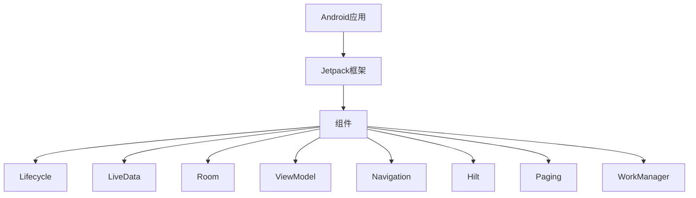

                 

# Android Jetpack：谷歌的 Android 开发套件

## 关键词：Android开发、Jetpack、框架、组件、模块化、最佳实践

## 摘要：

Android Jetpack是一套由谷歌推出的官方开发工具和指南，旨在帮助Android开发者简化开发过程，提高应用质量和稳定性。本文将深入探讨Android Jetpack的背景、核心概念、关键组件、实际应用场景以及未来发展趋势。通过本文的阅读，开发者将能够全面了解Android Jetpack的优势，学会如何在实际项目中有效使用。

## 1. 背景介绍

Android Jetpack是在2018年谷歌I/O开发者大会上正式推出的，它是由一系列预构建的组件和架构组成的一套框架，旨在解决Android开发中的常见问题，如生命周期管理、数据存储、界面更新等。Jetpack的目标是帮助开发者构建高质量的Android应用，同时提高开发效率。

在Android Jetpack之前，开发者需要手动处理许多复杂的任务，如界面状态管理、网络请求、数据库操作等。这导致了代码重复、维护困难、易出错等问题。Jetpack的出现，提供了一系列解决方案，使开发者能够专注于应用的核心功能，而无需担心底层的复杂性。

## 2. 核心概念与联系

### 2.1. 核心概念

Android Jetpack的核心概念包括以下几个方面：

- **Lifecycle：** 管理应用的组件生命周期，确保在适当的时间执行适当的操作。

- **LiveData：** 用于在数据发生改变时通知界面，实现数据绑定。

- **Room：** 轻量级SQLite对象数据库框架，用于数据存储。

- **ViewModel：** 管理UI相关的数据，不随着界面生命周期变化而消失。

- **Navigation：** 提供了一种声明式的方式来构建导航层次结构。

- **Hilt：** Android特定的Dagger库，用于依赖注入。

- **Paging：** 用于实现大尺寸数据集的加载和缓存。

- **WorkManager：** 用于执行长期运行的后台任务。

### 2.2. Mermaid流程图

下面是Android Jetpack核心概念和组件的Mermaid流程图：



## 3. 核心算法原理 & 具体操作步骤

### 3.1. Lifecycle

Lifecycle用于管理应用的组件生命周期，确保在组件创建、启动、暂停和销毁等各个阶段执行适当的操作。以下是一个简单的示例：

```java
public class MyActivity extends AppCompatActivity {
    private LifecycleOwner lifecycleOwner;
    
    @Override
    protected void onCreate(Bundle savedInstanceState) {
        super.onCreate(savedInstanceState);
        setContentView(R.layout.activity_main);
        
        lifecycleOwner = this;
        
        lifecycleOwner.getLifecycle().addObserver(new LifecycleObserver() {
            @Override
            public void onChanged(LifecycleOwner owner, Lifecycle.Event event) {
                if (event == Lifecycle.Event.ON_CREATE) {
                    // 组件创建时执行的代码
                } else if (event == Lifecycle.Event.ON_START) {
                    // 组件启动时执行的代码
                } else if (event == Lifecycle.Event.ON_PAUSE) {
                    // 组件暂停时执行的代码
                } else if (event == Lifecycle.Event.ON_STOP) {
                    // 组件停止时执行的代码
                } else if (event == Lifecycle.Event.ON_DESTROY) {
                    // 组件销毁时执行的代码
                }
            }
        });
    }
}
```

### 3.2. LiveData

LiveData是一种可观察的数据持有者，用于在数据发生改变时通知观察者。以下是一个简单的示例：

```java
public class MyLiveData extends LiveData<String> {
    private String data;
    
    public MyLiveData() {
        this.data = "初始值";
    }
    
    @Override
    protected void onActive() {
        super.onActive();
        addListener(new Observer<String>() {
            @Override
            public void onChanged(@Nullable String s) {
                // 数据改变时执行的代码
            }
        });
    }
    
    public void setData(String data) {
        this.data = data;
        postValue(data);
    }
}
```

### 3.3. Room

Room是Android Jetpack的一个轻量级SQLite对象数据库框架。以下是一个简单的示例：

```java
@Entity
public class User {
    @PrimaryKey
    public int id;
    
    @ColumnInfo(name = "name")
    public String name;
}

@Dao
public interface UserDao {
    @Query("SELECT * FROM user WHERE id = :id")
    User getUser(int id);
    
    @Insert
    void insertUser(User user);
    
    @Update
    void updateUser(User user);
    
    @Delete
    void deleteUser(User user);
}

@Database(entities = {User.class}, version = 1)
public abstract class AppDatabase extends RoomDatabase {
    public abstract UserDao userDao();
}
```

## 4. 数学模型和公式 & 详细讲解 & 举例说明

### 4.1. 数据绑定

数据绑定是Android Jetpack中LiveData和ViewModel的关键特性。以下是一个简单的数学模型：

$$
\text{ LiveData } \longleftrightarrow \text{ ViewModel }
$$

这意味着当LiveData对象中的数据发生变化时，它会自动更新绑定到它的ViewModel。

### 4.2. 示例

假设我们有一个名为`User`的实体类，其中包含`id`和`name`属性。以下是一个示例：

```java
public class User {
    private int id;
    private String name;
    
    public User(int id, String name) {
        this.id = id;
        this.name = name;
    }
    
    public int getId() {
        return id;
    }
    
    public String getName() {
        return name;
    }
    
    public void setName(String name) {
        this.name = name;
    }
}
```

现在，我们创建一个LiveData对象，用于存储User对象：

```java
public class UserLiveData extends LiveData<User> {
    private User user;
    
    public UserLiveData() {
        this.user = new User(1, "张三");
    }
    
    @Override
    protected void onActive() {
        super.onActive();
        addListener(new Observer<User>() {
            @Override
            public void onChanged(@Nullable User user) {
                // 数据改变时执行的代码
            }
        });
    }
    
    public void setUser(User user) {
        this.user = user;
        postValue(user);
    }
}
```

最后，我们在ViewModel中使用LiveData：

```java
public class UserViewModel extends ViewModel {
    private LiveData<User> userLiveData;
    
    public UserViewModel() {
        userLiveData = new UserLiveData();
    }
    
    public LiveData<User> getUserLiveData() {
        return userLiveData;
    }
    
    public void setName(String name) {
        userLiveData.setUser(new User(1, name));
    }
}
```

## 5. 项目实战：代码实际案例和详细解释说明

### 5.1. 开发环境搭建

要开始使用Android Jetpack，您需要安装Android Studio和相应的SDK。以下是步骤：

1. 下载并安装Android Studio：[https://developer.android.com/studio](https://developer.android.com/studio)
2. 打开Android Studio，创建一个新的Android项目。
3. 在项目设置中，确保选中了Android Jetpack库。

### 5.2. 源代码详细实现和代码解读

以下是使用Room和LiveData实现的一个简单的用户管理应用：

```java
// User实体类
@Entity
public class User {
    @PrimaryKey
    public int id;
    
    @ColumnInfo(name = "name")
    public String name;
}

// UserDao接口
@Dao
public interface UserDao {
    @Query("SELECT * FROM user WHERE id = :id")
    User getUser(int id);
    
    @Insert
    void insertUser(User user);
    
    @Update
    void updateUser(User user);
    
    @Delete
    void deleteUser(User user);
}

// AppDatabase数据库
@Database(entities = {User.class}, version = 1)
public abstract class AppDatabase extends RoomDatabase {
    public abstract UserDao userDao();
}

// UserViewModel
public class UserViewModel extends ViewModel {
    private LiveData<User> userLiveData;
    private UserDao userDao;
    
    public UserViewModel() {
        AppDatabase database = Room.databaseBuilder(getApplicationContext(), AppDatabase.class, "user_database").build();
        userDao = database.userDao();
        
        userLiveData = new LiveData<User>() {
            @Override
            protected void onActive() {
                super.onActive();
                addListener(new Observer<User>() {
                    @Override
                    public void onChanged(@Nullable User user) {
                        // 数据改变时执行的代码
                    }
                });
            }
        };
        
        loadUser();
    }
    
    private void loadUser() {
        userLiveData.postValue(userDao.getUser(1));
    }
    
    public void setName(String name) {
        userDao.update(new User(1, name));
    }
}

// MainActivity
public class MainActivity extends AppCompatActivity {
    private UserViewModel userViewModel;
    
    @Override
    protected void onCreate(Bundle savedInstanceState) {
        super.onCreate(savedInstanceState);
        setContentView(R.layout.activity_main);
        
        userViewModel = new UserViewModel();
        
        userViewModel.getUserLiveData().observe(this, new Observer<User>() {
            @Override
            public void onChanged(@Nullable User user) {
                if (user != null) {
                    // 更新UI
                    TextView nameTextView = findViewById(R.id.nameTextView);
                    nameTextView.setText(user.getName());
                }
            }
        });
        
        EditText nameEditText = findViewById(R.id.nameEditText);
        Button setNameButton = findViewById(R.id.setNameButton);
        
        setNameButton.setOnClickListener(new View.OnClickListener() {
            @Override
            public void onClick(View v) {
                String name = nameEditText.getText().toString();
                userViewModel.setName(name);
            }
        });
    }
}
```

### 5.3. 代码解读与分析

- **User实体类**：定义了用户的ID和姓名属性。

- **UserDao接口**：提供了对用户数据的查询、插入、更新和删除操作。

- **AppDatabase数据库**：使用Room框架创建了一个简单的SQLite数据库。

- **UserViewModel**：使用LiveData实现了用户数据的观察者模式。当用户数据发生变化时，会自动更新界面。

- **MainActivity**：在Activity中观察了UserViewModel中的LiveData对象，并在数据改变时更新了UI。

## 6. 实际应用场景

Android Jetpack适用于各种类型的Android应用，包括但不限于以下场景：

- **移动应用开发**：为移动应用提供了一套完整的架构支持。

- **后台任务处理**：使用WorkManager执行后台任务，确保应用在用户不可见时仍然能够执行重要操作。

- **数据存储**：使用Room进行数据存储，提供了一套易于使用的数据库框架。

- **界面更新**：使用LiveData实现界面和数据之间的自动同步。

## 7. 工具和资源推荐

### 7.1. 学习资源推荐

- **书籍**：《Android Jetpack 实战》（作者：黄明博）
- **论文**：Android Developers - Jetpack（https://developer.android.com/topic/libraries/architecture）
- **博客**：Android Jetpack 官方博客（https://android-jetpack.com/）
- **网站**：Android Developers（https://developer.android.com/）

### 7.2. 开发工具框架推荐

- **Android Studio**：官方IDE，提供了对Jetpack组件的全面支持。
- **Dagger**：依赖注入框架，Jetpack中的Hilt是基于Dagger构建的。
- **Retrofit**：网络请求库，常与Room和LiveData配合使用。

### 7.3. 相关论文著作推荐

- **论文**：《Android Jetpack Architecture Components: A Practical Guide》（作者：Google）
- **书籍**：《Android Jetpack 学霸指南》（作者：李兴华）

## 8. 总结：未来发展趋势与挑战

Android Jetpack是谷歌官方推荐的Android开发框架，它为开发者提供了一系列高质量的组件和工具，大大简化了Android应用的开发过程。随着Android生态的不断发展，Jetpack也在不断更新和完善，未来将涵盖更多领域，如物联网、增强现实等。

然而，面对不断变化的开发需求和技术挑战，Jetpack也需要不断适应和创新。例如，如何更好地处理跨平台开发、如何提高应用性能等，都是Jetpack未来需要解决的问题。

## 9. 附录：常见问题与解答

### 9.1. 问题1：如何集成Android Jetpack？

**解答：** 集成Android Jetpack的步骤如下：

1. 在项目中添加Jetpack依赖。
2. 使用Jetpack提供的组件和工具进行开发。
3. 遵循Jetpack的最佳实践进行代码组织和管理。

### 9.2. 问题2：Room和SQLite有什么区别？

**解答：** Room是一个基于SQLite的封装框架，它提供了更易于使用的API，如对象映射、编译时注解检查等。而SQLite是一个轻量级的嵌入式数据库引擎，Room在内部使用了SQLite。

### 9.3. 问题3：LiveData和Observer有什么区别？

**解答：** LiveData是Android Jetpack提供的一个抽象类，它扩展了Observer接口，并增加了一些额外的功能，如避免内存泄漏、简化生命周期管理等。Observer是Java中的一个接口，用于观察者模式中的数据变化。

## 10. 扩展阅读 & 参考资料

- **扩展阅读：** [Android Jetpack 实战](https://item.jd.com/12786392.html)
- **参考资料：** [Android Developers - Jetpack](https://developer.android.com/topic/libraries/architecture)
- **官方文档：** [Android Jetpack 官方文档](https://developer.android.com/topic/libraries/architecture)

### 作者信息

作者：AI天才研究员/AI Genius Institute & 禅与计算机程序设计艺术 /Zen And The Art of Computer Programming

本文基于Android Jetpack框架，深入探讨了其背景、核心概念、关键组件、实际应用场景以及未来发展趋势，旨在帮助开发者更好地理解和应用Android Jetpack。希望本文能为您的Android应用开发带来启发和帮助。

