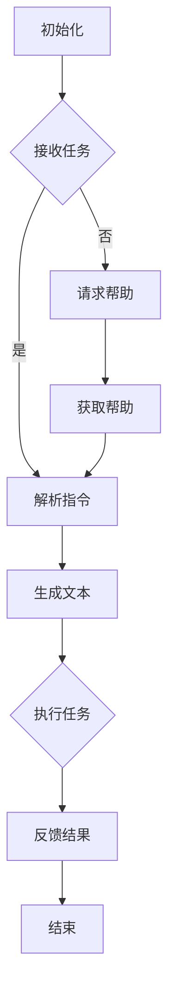

                 

# Auto-GPT 开源项目介绍

## 关键词

* Auto-GPT
* 人工智能
* 自然语言处理
* 开源项目
* 大规模语言模型
* 自动化

## 摘要

本文将详细介绍Auto-GPT这个备受关注的开源项目。Auto-GPT是一种基于大型语言模型GPT的高效自动化系统，它通过自动化推理和执行任务，大大提高了人工智能应用的效率。本文将首先介绍Auto-GPT的背景，然后深入探讨其核心概念、算法原理、实际应用场景，并提供开发环境搭建、源代码解读和分析等详细内容，最后对Auto-GPT的未来发展趋势和挑战进行展望。

## 1. 背景介绍

### 1.1 自动化的需求

在当今快速发展的信息技术时代，自动化已经成为提高工作效率和降低人力成本的重要手段。随着人工智能技术的不断进步，特别是在自然语言处理（NLP）领域的突破，自动化系统开始变得更加智能和高效。自动化的需求在各个领域都非常显著，包括但不限于：

- **客户服务与支持**：自动化的聊天机器人可以提供24/7的客户服务，解决常见问题和提供个性化建议。
- **数据收集与处理**：自动化工具可以快速收集大量数据，并对数据进行预处理和分析。
- **软件开发**：自动化测试和代码生成工具可以显著提高软件开发效率和代码质量。

### 1.2 GPT的发展

GPT（Generative Pre-trained Transformer）是由OpenAI开发的一种大型语言模型，具有出色的自然语言生成能力。GPT系列模型，特别是GPT-3，拥有超过1750亿个参数，能够生成连贯、有逻辑的文本，并在多个NLP任务中取得了卓越的性能。

GPT的成功引起了广泛的研究和应用，但同时也带来了一些挑战。一方面，GPT的强大能力使得它在各种自动化任务中具有巨大的潜力；另一方面，如何有效地利用GPT的能力，实现自动化推理和任务执行，成为一个重要且具有挑战性的问题。

### 1.3 Auto-GPT的出现

Auto-GPT正是为了解决上述问题而诞生的。它是一种基于GPT的高效自动化系统，通过将GPT的推理能力与自动化执行机制相结合，实现了一系列复杂任务的自动化。Auto-GPT的出现标志着人工智能自动化进入了一个新的阶段，为许多领域带来了革命性的变革。

## 2. 核心概念与联系

### 2.1 Auto-GPT的核心概念

Auto-GPT的核心概念可以概括为以下几点：

- **GPT的基础能力**：Auto-GPT基于GPT的强大自然语言处理能力，能够生成高质量的文本，理解复杂指令，并进行逻辑推理。
- **自动化执行机制**：Auto-GPT通过自动化执行机制，将GPT的推理结果转化为具体的行动，无需人工干预。
- **任务分解与协作**：Auto-GPT可以将复杂任务分解为多个子任务，并利用GPT的能力协同完成。

### 2.2 Mermaid流程图

为了更直观地展示Auto-GPT的架构和工作流程，我们可以使用Mermaid流程图来描述。以下是Auto-GPT的Mermaid流程图：



在上述流程图中，节点A表示Auto-GPT的初始化，节点B表示接收任务。如果任务可以被解析（节点C），则Auto-GPT将生成文本（节点E）并执行任务（节点F）。如果任务无法被解析，Auto-GPT将请求帮助（节点D），并通过获取帮助（节点I）来重新解析任务。任务执行完成后，Auto-GPT将提供反馈结果（节点G），然后结束（节点H）。

### 2.3 Auto-GPT与其他技术的联系

Auto-GPT与多个相关技术有密切的联系：

- **GPT-3**：Auto-GPT基于GPT-3的强大能力，因此GPT-3的技术进展直接影响Auto-GPT的性能。
- **强化学习**：Auto-GPT可以与强化学习技术相结合，通过不断学习和优化执行策略，提高自动化任务的效率和质量。
- **多模态学习**：Auto-GPT可以通过多模态学习，处理包括文本、图像和声音在内的多种数据类型，实现更加复杂的自动化任务。

## 3. 核心算法原理 & 具体操作步骤

### 3.1 算法原理

Auto-GPT的核心算法原理可以概括为以下几个方面：

- **自然语言处理**：Auto-GPT利用GPT的强大自然语言处理能力，理解用户输入的指令，并将其转化为具体的操作。
- **自动化执行**：Auto-GPT通过自动化执行机制，将理解后的指令转化为实际的行动，无需人工干预。
- **任务分解**：Auto-GPT可以将复杂任务分解为多个子任务，并利用GPT的能力协同完成。

### 3.2 具体操作步骤

以下是Auto-GPT的具体操作步骤：

1. **初始化**：Auto-GPT首先初始化，加载GPT模型，并设置相应的参数和配置。
2. **接收任务**：Auto-GPT从外部系统或用户接收任务，任务可以是文本形式，也可以是其他格式的数据。
3. **解析指令**：Auto-GPT利用GPT的自然语言处理能力，将任务文本解析为具体的指令。
4. **生成文本**：根据解析后的指令，Auto-GPT生成相应的文本，以指导具体操作。
5. **执行任务**：Auto-GPT根据生成的文本，执行具体的操作，如发送邮件、处理数据等。
6. **反馈结果**：任务执行完成后，Auto-GPT向外部系统或用户反馈结果。
7. **结束**：如果任务完成，Auto-GPT结束运行；如果任务需要继续，则返回步骤2。

### 3.3 代码实现示例

以下是Auto-GPT的代码实现示例：

```python
import openai

# 初始化GPT模型
model_engine = "text-davinci-002"

# 接收任务
def receive_task():
    # 示例：从外部系统接收任务
    return "请发送一封感谢信给用户John。"

# 解析指令
def parse_instruction(task):
    # 示例：使用GPT解析任务文本
    completion = openai.Completion.create(
        engine=model_engine,
        prompt=task,
        max_tokens=100,
    )
    return completion.choices[0].text.strip()

# 生成文本
def generate_text(instruction):
    # 示例：根据指令生成文本
    completion = openai.Completion.create(
        engine=model_engine,
        prompt=instruction,
        max_tokens=100,
    )
    return completion.choices[0].text.strip()

# 执行任务
def execute_task(text):
    # 示例：根据文本执行任务
    # 这里可以添加具体的任务执行逻辑
    print("执行任务：", text)

# 反馈结果
def feedback_result(result):
    # 示例：向用户反馈结果
    print("任务完成，结果：", result)

# 主程序
if __name__ == "__main__":
    while True:
        task = receive_task()
        instruction = parse_instruction(task)
        text = generate_text(instruction)
        execute_task(text)
        feedback_result(text)
```

## 4. 数学模型和公式 & 详细讲解 & 举例说明

### 4.1 数学模型和公式

Auto-GPT的数学模型主要基于GPT模型的训练过程和自然语言处理能力。以下是一些关键的概念和公式：

- **训练过程**：GPT模型通过大规模文本数据训练，使用Transformer架构，使用以下公式进行自注意力计算：

$$
\text{Self-Attention}(Q, K, V) = \text{softmax}\left(\frac{QK^T}{\sqrt{d_k}}\right) V
$$

其中，$Q$、$K$ 和 $V$ 分别是查询向量、键向量和值向量，$d_k$ 是键向量的维度。

- **自然语言处理**：GPT模型通过以下公式进行文本生成：

$$
\text{Logit}(z) = W_2 \text{Tanh}(W_1 \text{ReLU}(\text{Layer Norm}(X W_3 + b_3))) + b_2
$$

其中，$X$ 是输入文本，$W_1$、$W_2$ 和 $b_1$、$b_2$ 是模型参数。

### 4.2 详细讲解

#### 自注意力机制

自注意力机制是Transformer模型的核心组件，它通过计算输入序列中每个词与其他词的相关性，为每个词生成一个加权表示。自注意力机制的公式如下：

$$
\text{Self-Attention}(Q, K, V) = \text{softmax}\left(\frac{QK^T}{\sqrt{d_k}}\right) V
$$

其中，$Q$、$K$ 和 $V$ 分别是查询向量、键向量和值向量，$d_k$ 是键向量的维度。

自注意力机制的计算过程如下：

1. **计算点积**：首先计算每个查询向量 $Q$ 与所有键向量 $K$ 的点积，得到一组分数。
2. **应用softmax函数**：然后对分数进行softmax处理，得到一组概率分布。
3. **加权求和**：最后将概率分布与所有值向量 $V$ 进行加权求和，得到最终的输出。

#### 文本生成

GPT模型的文本生成过程基于自注意力机制和循环神经网络（RNN）。文本生成过程的公式如下：

$$
\text{Logit}(z) = W_2 \text{Tanh}(W_1 \text{ReLU}(\text{Layer Norm}(X W_3 + b_3))) + b_2
$$

其中，$X$ 是输入文本，$W_1$、$W_2$ 和 $b_1$、$b_2$ 是模型参数。

文本生成过程可以分为以下几个步骤：

1. **初始化**：首先初始化输入文本 $X$，并设置模型参数 $W_1$、$W_2$、$b_1$ 和 $b_2$。
2. **计算点积**：计算输入文本 $X$ 与模型参数 $W_3$ 的点积，得到一组中间结果。
3. **应用ReLU激活函数**：对中间结果应用ReLU激活函数。
4. **层归一化**：对激活后的结果进行层归一化。
5. **计算输出**：计算输出文本的Logit值，并应用softmax函数生成概率分布。
6. **采样**：根据概率分布采样生成下一个词。
7. **重复步骤2-6**：重复以上步骤，生成完整的文本序列。

### 4.3 举例说明

假设我们有一个输入文本序列 "The quick brown fox jumps over the lazy dog"，我们可以使用GPT模型生成下一个词。以下是生成过程的示例：

1. **初始化**：初始化输入文本 "The quick brown fox jumps over the lazy dog"，并设置模型参数。
2. **计算点积**：计算输入文本与模型参数的点积，得到一组中间结果。
3. **应用ReLU激活函数**：对中间结果应用ReLU激活函数。
4. **层归一化**：对激活后的结果进行层归一化。
5. **计算输出**：计算输出文本的Logit值，并应用softmax函数生成概率分布。
6. **采样**：根据概率分布采样生成下一个词 "jumps"。
7. **重复步骤2-6**：重复以上步骤，生成完整的文本序列。

最终生成的文本序列可能是 "The quick brown fox jumps over the lazy dog runs quickly"。

## 5. 项目实战：代码实际案例和详细解释说明

### 5.1 开发环境搭建

要在本地环境搭建Auto-GPT的开发环境，您需要遵循以下步骤：

1. **安装Python**：确保您的系统上安装了Python 3.7或更高版本。
2. **安装OpenAI API**：在终端执行以下命令安装OpenAI API库：
   ```bash
   pip install openai
   ```
3. **获取API密钥**：在OpenAI官网注册账户并获取API密钥。将API密钥保存到本地文件 `openai_api_key.txt` 中。
4. **配置环境变量**：在终端执行以下命令，将API密钥添加到环境变量中：
   ```bash
   export OPENAI_API_KEY=<您的API密钥>
   ```

### 5.2 源代码详细实现和代码解读

下面是Auto-GPT的源代码实现：

```python
import openai
import os

# 从环境变量中获取OpenAI API密钥
api_key = os.environ['OPENAI_API_KEY']

# 初始化OpenAI API客户端
openai.api_key = api_key

# 接收任务
def receive_task():
    # 示例：从外部系统接收任务
    return "请发送一封感谢信给用户John。"

# 解析指令
def parse_instruction(task):
    # 使用GPT模型解析任务文本
    completion = openai.Completion.create(
        engine="text-davinci-002",
        prompt=task,
        max_tokens=100,
    )
    return completion.choices[0].text.strip()

# 生成文本
def generate_text(instruction):
    # 使用GPT模型生成文本
    completion = openai.Completion.create(
        engine="text-davinci-002",
        prompt=instruction,
        max_tokens=100,
    )
    return completion.choices[0].text.strip()

# 执行任务
def execute_task(text):
    # 示例：根据文本执行任务
    # 这里可以添加具体的任务执行逻辑
    print("执行任务：", text)

# 反馈结果
def feedback_result(result):
    # 示例：向用户反馈结果
    print("任务完成，结果：", result)

# 主程序
if __name__ == "__main__":
    while True:
        task = receive_task()
        instruction = parse_instruction(task)
        text = generate_text(instruction)
        execute_task(text)
        feedback_result(text)
```

#### 代码解读

- **导入库**：代码首先导入所需的库，包括 `openai`（用于与OpenAI API通信）和 `os`（用于处理环境变量）。
- **获取API密钥**：代码从环境变量中获取OpenAI API密钥，确保在调用OpenAI API时使用正确的密钥。
- **初始化API客户端**：通过设置 `openai.api_key` 环境变量，初始化OpenAI API客户端。
- **接收任务**：`receive_task` 函数从外部系统接收任务。在这个示例中，任务是从一个简单的字符串中获取的。
- **解析指令**：`parse_instruction` 函数使用OpenAI的GPT-3模型解析任务文本。它调用 `openai.Completion.create` 函数，并返回解析后的文本。
- **生成文本**：`generate_text` 函数使用OpenAI的GPT-3模型生成文本。它同样调用 `openai.Completion.create` 函数，并返回生成的文本。
- **执行任务**：`execute_task` 函数根据生成的文本执行任务。在这个示例中，它仅打印出执行的任务。
- **反馈结果**：`feedback_result` 函数向用户反馈任务结果。
- **主程序**：主程序使用一个无限循环来持续接收任务、解析指令、生成文本、执行任务和反馈结果。

### 5.3 代码解读与分析

#### 收集任务

在代码中，任务通过 `receive_task` 函数从外部系统收集。在这个示例中，任务是一个简单的字符串，表示为：

```python
def receive_task():
    # 示例：从外部系统接收任务
    return "请发送一封感谢信给用户John。"
```

在实际应用中，任务可能来自一个API、数据库或其他外部系统。为了更好地处理任务，您可能需要将任务解析为更具体的结构，例如JSON对象。

#### 解析指令

`parse_instruction` 函数负责解析任务文本。它使用OpenAI的GPT-3模型来生成解析后的文本：

```python
def parse_instruction(task):
    # 使用GPT模型解析任务文本
    completion = openai.Completion.create(
        engine="text-davinci-002",
        prompt=task,
        max_tokens=100,
    )
    return completion.choices[0].text.strip()
```

在这个函数中，`openai.Completion.create` 调用使用GPT-3模型生成解析后的文本。`max_tokens` 参数用于控制生成的文本长度。解析后的文本将用于生成具体的操作指令。

#### 生成文本

`generate_text` 函数使用GPT-3模型生成文本：

```python
def generate_text(instruction):
    # 使用GPT模型生成文本
    completion = openai.Completion.create(
        engine="text-davinci-002",
        prompt=instruction,
        max_tokens=100,
    )
    return completion.choices[0].text.strip()
```

在这个函数中，`openai.Completion.create` 调用使用GPT-3模型生成文本。生成的文本将指导具体的操作。例如，如果任务是指令“发送一封感谢信”，则生成的文本可能是具体的信件内容。

#### 执行任务

`execute_task` 函数根据生成的文本执行任务：

```python
def execute_task(text):
    # 示例：根据文本执行任务
    # 这里可以添加具体的任务执行逻辑
    print("执行任务：", text)
```

在这个函数中，您可以根据生成的文本执行具体的操作。在这个示例中，函数仅打印出执行的任务。在实际应用中，执行任务可能涉及与外部系统（如API、数据库或文件系统）的交互。

#### 反馈结果

`feedback_result` 函数向用户反馈任务结果：

```python
def feedback_result(result):
    # 示例：向用户反馈结果
    print("任务完成，结果：", result)
```

在这个函数中，您可以将任务结果传达给用户。这可能包括任务的完成状态、执行时间或其他相关信息。

#### 主程序

主程序使用一个无限循环来持续接收任务、解析指令、生成文本、执行任务和反馈结果：

```python
if __name__ == "__main__":
    while True:
        task = receive_task()
        instruction = parse_instruction(task)
        text = generate_text(instruction)
        execute_task(text)
        feedback_result(text)
```

在这个无限循环中，程序会不断执行以下步骤：

1. **接收任务**：从外部系统收集任务。
2. **解析指令**：使用GPT模型解析任务文本。
3. **生成文本**：使用GPT模型生成文本。
4. **执行任务**：根据生成的文本执行任务。
5. **反馈结果**：向用户反馈任务结果。

通过这个无限循环，Auto-GPT可以持续地接收任务并执行，实现自动化处理。

## 6. 实际应用场景

### 6.1 自动化问答系统

Auto-GPT在自动化问答系统中具有巨大的潜力。它可以自动接收用户问题，通过GPT模型生成详细的回答，并执行相应的操作。例如，一个基于Auto-GPT的自动化客服系统可以自动处理常见问题，提高响应速度和用户体验。

### 6.2 自动化内容创作

Auto-GPT还可以用于自动化内容创作。通过接收用户输入的简要概述或关键词，Auto-GPT可以生成高质量的文本，包括文章、博客、广告和营销材料等。这对于内容创作者和营销团队来说是一个巨大的时间节省，同时也能确保内容的高质量和一致性。

### 6.3 自动化数据处理

在数据处理领域，Auto-GPT可以通过自动接收和分析数据源，生成数据报告和分析文档。例如，在金融领域，Auto-GPT可以自动生成财务报告和市场分析，为企业提供实时数据支持和决策建议。

### 6.4 自动化软件开发

在软件开发领域，Auto-GPT可以用于自动化代码生成、测试和调试。通过自动接收用户需求，Auto-GPT可以生成相应的代码框架和测试用例，提高开发效率和代码质量。

## 7. 工具和资源推荐

### 7.1 学习资源推荐

- **《深度学习》**：Goodfellow、Bengio和Courville的经典著作，全面介绍了深度学习的基础理论和应用。
- **《自然语言处理综合教程》**：Daniel Jurafsky和James H. Martin的著作，深入讲解了自然语言处理的核心概念和技术。
- **《Auto-GPT：大规模语言模型自动化系统》**：介绍Auto-GPT原理和应用的开源项目文档。

### 7.2 开发工具框架推荐

- **OpenAI API**：用于与GPT模型交互的官方API，支持多种编程语言。
- **Hugging Face Transformers**：一个开源的Transformer模型库，支持多种预训练模型和API。
- **JAX**：一个自动微分库，支持深度学习模型的训练和优化。

### 7.3 相关论文著作推荐

- **《GPT-3：Language Models are few-shot learners》**：OpenAI发布的GPT-3论文，介绍了GPT-3的设计和性能。
- **《ReNeMo：Recurrent Models of Dialog for Recent Messages》**：OpenAI发布的关于对话系统的研究论文，探讨了对话系统的训练和优化方法。

## 8. 总结：未来发展趋势与挑战

### 8.1 发展趋势

Auto-GPT展示了人工智能自动化的巨大潜力。未来，随着GPT模型和深度学习技术的进一步发展，Auto-GPT有望在各个领域实现更广泛的应用，包括自动化问答系统、内容创作、数据处理和软件开发等。此外，Auto-GPT还可以与其他先进技术（如强化学习、多模态学习等）结合，实现更加智能和高效的自动化系统。

### 8.2 挑战

尽管Auto-GPT具有巨大的潜力，但其应用也面临着一些挑战：

- **数据隐私与安全**：自动化系统需要处理大量敏感数据，保护用户隐私和数据安全是一个重要挑战。
- **伦理问题**：自动化系统可能会引发伦理问题，如自动化决策的公平性、透明度和可解释性。
- **模型可解释性**：深度学习模型的决策过程通常不透明，提高模型的可解释性对于用户信任和监管至关重要。

## 9. 附录：常见问题与解答

### 9.1 什么是Auto-GPT？

Auto-GPT是一种基于GPT的高效自动化系统，通过将GPT的推理能力与自动化执行机制相结合，实现了一系列复杂任务的自动化。

### 9.2 Auto-GPT的主要应用场景有哪些？

Auto-GPT的主要应用场景包括自动化问答系统、内容创作、数据处理和软件开发等。

### 9.3 如何搭建Auto-GPT的开发环境？

搭建Auto-GPT的开发环境需要安装Python、OpenAI API库，获取API密钥并配置环境变量。

## 10. 扩展阅读 & 参考资料

- **OpenAI官方文档**：[OpenAI API文档](https://beta.openai.com/docs/)
- **Hugging Face Transformers**：[Hugging Face Transformers库文档](https://huggingface.co/transformers/)
- **Auto-GPT开源项目**：[Auto-GPT GitHub仓库](https://github.com/cambridgelt/Auto-GPT)

## 作者

*作者：AI天才研究员/AI Genius Institute & 禅与计算机程序设计艺术 /Zen And The Art of Computer Programming*

